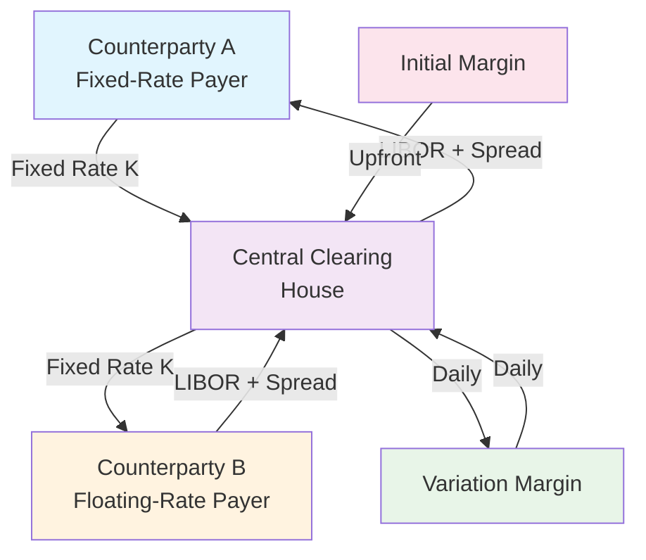

---
key_concepts:
- Interest rate swaps and valuation
- Currency and cross-currency swaps
- Swap spreads and basis trading
- Bond pricing and yield curves
- Duration and convexity hedging
- Credit spreads and bond valuation
- Futures and forwards contract mechanics
- Cash-and-carry arbitrage
- Basis trading and roll strategies
- Option pricing theory and Black-Scholes model
- Options Greeks and risk management
- Call and put option strategies
- Value at Risk (VaR) and stress testing
- Portfolio risk metrics and measures
- Hedging strategies and effectiveness
- Advanced Primer on Interest-Rate Swaps (IRS) and financial analysis
- Advanced Primer on Interest-Rate Swaps (IRS) in modern finance
- Applications of Advanced Primer on Interest-Rate Swaps (IRS)
- 'Case study: Advanced Primer on Interest-Rate Swaps (IRS)'
tags:
- options
- stress-test
- var
- hedge-ratio
- irs
- swaption
- futures
- dv01
- basis
- gamma
- maturity
- forward
- swaps
- bond
- coupon
---

# Advanced Primer on Interest-Rate Swaps (IRS)
## Plain Vanilla Fixed-for-Floating Swaps
---
## Table of Contents
1. [Introduction & Market Overview](#introduction--market-overview)
2. [Mathematical Foundations](#mathematical-foundations)
3. [Par-Swap Rate Derivation](#par-swap-rate-derivation)
4. [Risk Metrics & Greeks](#risk-metrics--greeks)
5. [Visual Framework](#visual-framework)
6. [Advanced Extensions](#advanced-extensions)
7. [Market Conventions](#market-conventions)
8. [Practical Applications](#practical-applications)
---
## Introduction & Market Overview
### Definition and Structure
An **Interest-Rate Swap (IRS)** is a bilateral financial derivative contract where two counterparties agree to exchange cash flows based on different interest rate calculations applied to a notional principal amount. In a plain vanilla fixed-for-floating swap:
- **Fixed-rate payer (swap buyer)**: Pays fixed-rate cash flows, receives floating-rate cash flows
- **Floating-rate payer (swap seller)**: Pays floating-rate cash flows, receives fixed-rate cash flows
### Market Context
The global interest-rate derivatives market represents the largest segment of the over-the-counter (OTC) derivatives market:
- **Notional Outstanding**: Approximately $400+ trillion globally (2024)
- **Daily Trading Volume**: $2-3 trillion in IRS across all currencies
- **Primary Currencies**: USD (≈60%), EUR (≈25%), GBP (≈5%), JPY (≈4%)
- **Clearing**: >95% of new USD IRS are centrally cleared post-Dodd-Frank
### Economic Function
Interest-rate swaps serve multiple critical functions:
- **Risk Management**: Hedging interest-rate exposure
- **Asset-Liability Matching**: Duration management for institutions
- **Arbitrage**: Exploiting pricing discrepancies across markets
- **Speculation**: Taking directional views on interest rates
---
## Mathematical Foundations
### Notation and Setup
Let us establish the mathematical framework:
- $t_0$: Current time (today)
- $T_i$: Payment dates for $i = 1, 2, \ldots, n$
- $\Delta_i = T_i - T_{i-1}$: Accrual period length
- $N$: Notional principal amount
- $K$: Fixed swap rate (to be determined)
- $L(T_{i-1}, T_i)$: Forward LIBOR rate for period $[T_{i-1}, T_i]$
- $P(t, T)$: Price at time $t$ of zero-coupon bond maturing at $T$
### Zero-Coupon Bond Pricing
Under the risk-neutral measure $\mathbb{Q}$, the fundamental pricing equation is:
$$P(t_0, T_i) = \mathbb{E}^\mathbb{Q}\left[e^{-\int_{t_0}^{T_i} r_s ds}\right]$$
where $r_s$ is the instantaneous risk-free rate.
### Forward Rate Construction
The simply-compounded forward rate $L(T_{i-1}, T_i)$ is related to zero-coupon bond prices by:
$$L(T_{i-1}, T_i) = \frac{1}{\Delta_i}\left(\frac{P(t_0, T_{i-1})}{P(t_0, T_i)} - 1\right)$$
This relationship ensures no-arbitrage between the spot and forward markets.
---
## Par-Swap Rate Derivation
### Discrete-Time Framework
#### Fixed Leg Present Value
The present value of the fixed leg (from the perspective of the fixed-rate receiver) is:
$$PV_{\text{fixed}} = N \cdot K \sum_{i=1}^n \Delta_i \cdot P(t_0, T_i)$$
#### Floating Leg Present Value
For the floating leg, we use the fact that under no-arbitrage, the present value equals:
$$PV_{\text{floating}} = N \sum_{i=1}^n \Delta_i \cdot L(T_{i-1}, T_i) \cdot P(t_0, T_i)$$
Substituting the forward rate relationship:
$$PV_{\text{floating}} = N \sum_{i=1}^n \Delta_i \cdot \frac{1}{\Delta_i}\left(\frac{P(t_0, T_{i-1})}{P(t_0, T_i)} - 1\right) \cdot P(t_0, T_i)$$
$$= N \sum_{i=1}^n \left(P(t_0, T_{i-1}) - P(t_0, T_i)\right)$$
This telescopes to:
$$PV_{\text{floating}} = N(P(t_0, T_0) - P(t_0, T_n)) = N(1 - P(t_0, T_n))$$
#### Par-Swap Rate Formula
At inception, the swap has zero net present value: $PV_{\text{fixed}} = PV_{\text{floating}}$
$$N \cdot K \sum_{i=1}^n \Delta_i \cdot P(t_0, T_i) = N(1 - P(t_0, T_n))$$
Solving for the par-swap rate:
$$\boxed{K = \frac{1 - P(t_0, T_n)}{\sum_{i=1}^n \Delta_i \cdot P(t_0, T_i)}}$$
### Continuous-Time Framework (Heath-Jarrow-Morton)
#### HJM Setup
Under the Heath-Jarrow-Morton framework, forward rates $f(t, T)$ evolve according to:
$$df(t, T) = \alpha(t, T)dt + \sigma(t, T)dW_t$$
where the drift $\alpha(t, T)$ is determined by the no-arbitrage condition:
$$\alpha(t, T) = \sigma(t, T)\int_t^T \sigma(t, s)ds$$
#### Continuous-Time Par Rate
In the continuous limit, the par-swap rate becomes:
$$K = \frac{1 - P(t_0, T_n)}{\int_0^{T_n} P(t_0, s)ds}$$
This represents the ratio of the "floating leg duration" to the "fixed leg duration."
### No-Arbitrage Relationships
The par-swap rate must satisfy several no-arbitrage conditions:
1. **Spot-Forward Consistency**: 
   $$K \approx \frac{1}{T_n}\int_0^{T_n} f(t_0, s)ds$$
2. **Futures-Forward Convexity Adjustment**:
   $$\text{Swap Rate} = \text{Futures Rate} - \frac{1}{2}\sigma^2 T \cdot \text{Duration}$$
---
## Risk Metrics & Greeks
### Duration and DV01
#### Modified Duration of Fixed Leg
The modified duration of the fixed leg is:
$$D_{\text{fixed}} = \frac{1}{PV_{\text{fixed}}} \sum_{i=1}^n \Delta_i \cdot T_i \cdot P(t_0, T_i)$$
#### DV01 Calculation
The DV01 (dollar value of a basis point) measures the change in swap value for a 1bp parallel shift in the yield curve:
$$\text{DV01}_{\text{swap}} = N \cdot K \cdot D_{\text{fixed}} \cdot 0.0001$$
For a $100MM notional swap:
$$\text{DV01}_{\text{swap}} = 100,000,000 \cdot K \cdot D_{\text{fixed}} \cdot 0.0001$$
### Key-Rate Durations
#### Bucketed Risk Decomposition
To capture non-parallel yield curve shifts, we decompose the DV01 into key-rate buckets:
$$\text{DV01}_{\text{bucket}_j} = \frac{\partial PV}{\partial r_j} \cdot 0.0001$$
where $r_j$ is the yield in bucket $j$.
#### Mathematical Formulation
For the fixed leg, the key-rate DV01 for bucket $j$ is:
$$\text{DV01}_j^{\text{fixed}} = N \cdot K \sum_{i: T_i \in \text{bucket}_j} \Delta_i \cdot T_i \cdot P(t_0, T_i) \cdot 0.0001$$
### Convexity Analysis
#### Second-Order Effects
The convexity of a swap measures the curvature of the price-yield relationship:
$$\text{Convexity} = \frac{1}{PV} \frac{\partial^2 PV}{\partial r^2}$$
For the fixed leg:
$$C_{\text{fixed}} = \frac{1}{PV_{\text{fixed}}} \sum_{i=1}^n \Delta_i \cdot T_i^2 \cdot P(t_0, T_i)$$
#### Convexity Adjustment for Futures
When hedging swaps with futures, a convexity adjustment is required:
$$\text{Hedge Ratio} = \frac{D_{\text{swap}}}{D_{\text{futures}}} \cdot \left(1 + \frac{1}{2}(C_{\text{swap}} - C_{\text{futures}})(\Delta r)^2\right)$$
### Risk Aggregation
The total portfolio DV01 aggregates as:
$$\text{DV01}_{\text{portfolio}} = \sum_i w_i \cdot \text{DV01}_i$$
where $w_i$ are the position weights.

## Visual Framework
### Cash Flow Netting Diagram

### Term Structure Visualization
The following Python code generates comparative plots of par-swap rates versus the underlying zero curve:
```python
import micropip
await pyodide.loadPackage("numpy")
import numpy as np
import plotly.graph_objects as go
from plotly.subplots import make_subplots
# Generate sample yield curve data
maturities = np.array([0.25, 0.5, 1, 2, 3, 5, 7, 10, 15, 20, 30])
spot_rates = np.array([5.25, 5.30, 5.35, 5.20, 5.10, 4.95, 4.85, 4.80, 4.85, 4.90, 5.00]) / 100
# Calculate discount factors
discount_factors = np.exp(-spot_rates * maturities)
# Calculate par swap rates
def calculate_swap_rate(maturity_idx):
    if maturity_idx == 0:
        return spot_rates[0]
    
    # Sum of discount factor * time periods (assuming annual payments)
    annuity = np.sum(discount_factors[1:maturity_idx+1])
    par_rate = (1 - discount_factors[maturity_idx]) / annuity
    return par_rate
swap_rates = np.array([calculate_swap_rate(i) for i in range(len(maturities))])
# Create subplots
fig = make_subplots(
    rows=2, cols=1,
    subplot_titles=('Term Structure: Spot vs Swap Rates', 'DV01 Profile by Maturity'),
    vertical_spacing=0.1
)
# Plot 1: Term structure comparison
fig.add_trace(
    go.Scatter(x=maturities, y=spot_rates*100, name='Spot Zero Curve', 
               line=dict(color='blue', width=2)),
    row=1, col=1
)
fig.add_trace(
    go.Scatter(x=maturities, y=swap_rates*100, name='Par Swap Curve',
               line=dict(color='red', width=2, dash='dash')),
    row=1, col=1
)
# Calculate DV01 profile (simplified)
dv01_profile = maturities * discount_factors * 0.0001 * 100000000  # $100MM notional
# Plot 2: DV01 profile
fig.add_trace(
    go.Bar(x=maturities, y=dv01_profile, name='DV01 ($)', 
           marker_color='green', opacity=0.7),
    row=2, col=1
)
fig.update_xaxes(title_text="Maturity (Years)", row=1, col=1)
fig.update_yaxes(title_text="Rate (%)", row=1, col=1)
fig.update_xaxes(title_text="Maturity (Years)", row=2, col=1)
fig.update_yaxes(title_text="DV01 ($)", row=2, col=1)
fig.update_layout(height=800, showlegend=True, 
                  title_text="Interest Rate Swap Analytics Dashboard")
fig.show()
```
---
## Advanced Extensions
### Cross-Currency Swaps
#### Structure and Mechanics
A cross-currency swap involves exchanging cash flows denominated in different currencies. The generic structure includes:
1. **Initial Exchange**: Principal amounts in different currencies
2. **Periodic Payments**: Interest payments in respective currencies  
3. **Final Exchange**: Re-exchange of principal amounts
#### Pricing Formula
Let $S_0$ be the current spot FX rate (domestic per foreign), and $P^d(t,T)$, $P^f(t,T)$ be domestic and foreign discount factors.
The par-swap rate relationship becomes:
$$K^d \sum_{i=1}^n \Delta_i^d P^d(t_0, T_i) = \frac{S_0}{S_T} K^f \sum_{i=1}^n \Delta_i^f P^f(t_0, T_i)$$
Under the foreign risk-neutral measure:
$$\boxed{K^d = K^f \cdot \frac{S_0 \sum_{i=1}^n \Delta_i^f P^f(t_0, T_i)}{\mathbb{E}^{\mathbb{Q}^f}[S_T^{-1}] \sum_{i=1}^n \Delta_i^d P^d(t_0, T_i)}}$$
#### FX Risk Components
The cross-currency swap embeds several risk factors:
- **Interest Rate Risk**: In both currencies
- **FX Risk**: Spot rate movements
- **Correlation Risk**: Between rates and FX
- **Basis Risk**: Cross-currency basis spread
### Forward-Starting Swaps
#### Definition and Applications
A forward-starting swap begins at a future date $T_{\text{start}} > t_0$. Applications include:
- **Lock-in Future Financing Costs**: For anticipated funding needs
- **Hedge Future Exposures**: Asset-liability matching
- **Speculative Positioning**: Views on forward rate movements
#### Analytical Pricing
The par rate for a forward-starting swap is:
$$K_{\text{forward}} = \frac{P(t_0, T_{\text{start}}) - P(t_0, T_n)}{\sum_{i=1}^n \Delta_i P(t_0, T_i)}$$
#### Risk Characteristics
Forward-starting swaps exhibit unique risk properties:
- **Higher Convexity**: Due to optionality embedded in forward start
- **Volatility Sensitivity**: Depends on forward rate volatility
- **Model Risk**: Requires sophisticated term structure models
### Swaptions and Embedded Options
#### European Swaptions
A swaption grants the right (not obligation) to enter a swap at a predetermined rate. Under the Black model:
$$\text{Swaption Price} = A \cdot \left[K \Phi(d_1) - S_0 \Phi(d_2)\right]$$
where:
- $A = \sum_{i=1}^n \Delta_i P(t_0, T_i)$ (annuity factor)
- $S_0$ = current forward swap rate
- $d_1, d_2$ = Black-Scholes parameters adjusted for swaption volatility
#### Bermudan Swaptions
Bermudan swaptions allow early exercise on multiple dates, requiring:
- **Lattice Methods**: Binomial/trinomial trees
- **Monte Carlo**: With least-squares regression (Longstaff-Schwartz)
- **PDE Methods**: Finite difference schemes
---
## Market Conventions
### Day Count Conventions
| Currency | Fixed Leg | Floating Leg |
|----------|-----------|--------------|
| USD | 30/360 | ACT/360 |
| EUR | 30/360 | ACT/360 |
| GBP | ACT/365 | ACT/365 |
| JPY | ACT/365 | ACT/360 |
### Payment Frequencies
- **USD**: Semi-annual fixed, quarterly floating
- **EUR**: Annual fixed, semi-annual floating  
- **GBP**: Semi-annual fixed, semi-annual floating
- **JPY**: Semi-annual fixed, semi-annual floating
### Quotation Conventions
#### Swap Spreads
Swaps are typically quoted as a spread over government bonds:
$$\text{Swap Spread} = \text{Swap Rate} - \text{Treasury Yield}$$
#### Basis Points
All rate quotations use basis points (1bp = 0.01%):
- **Bid-Offer Spreads**: Typically 0.5-2bp for liquid tenors
- **Tick Size**: 0.25bp for most electronic platforms
### Settlement and Clearing
#### Central Clearing Requirements
Post-Dodd-Frank regulations mandate central clearing for:
- **Standardized IRS**: Plain vanilla fixed-for-floating
- **Major Currencies**: USD, EUR, GBP, JPY
- **Eligible Counterparties**: Swap dealers, major participants
#### Margin Requirements
- **Initial Margin**: Risk-based (SIMM methodology)
- **Variation Margin**: Daily mark-to-market settlements
- **Minimum Transfer Amount**: Typically $100,000-$500,000
---
## Practical Applications
### Portfolio Risk Management
#### Duration Matching
Financial institutions use IRS for asset-liability duration matching:
$$\text{Duration Gap} = D_{\text{assets}} - \frac{L}{A} \cdot D_{\text{liabilities}}$$
where $L/A$ is the leverage ratio.
#### Optimal Hedging
The optimal hedge ratio minimizes portfolio variance:
$$h^* = \frac{\text{Cov}(\Delta S, \Delta F)}{\text{Var}(\Delta F)}$$
### Corporate Treasury Applications
#### Fixed-Rate Debt Conversion
A corporation with floating-rate debt can synthetically create fixed-rate exposure:
**Floating-Rate Debt + Pay-Fixed IRS = Synthetic Fixed-Rate Debt**
#### Cost of Capital Optimization
Companies optimize their capital structure using swaps:
- **Natural Hedging**: Match cash flow patterns
- **Market Timing**: Take advantage of rate expectations
- **Credit Arbitrage**: Exploit comparative advantages
### Speculative Strategies
#### Curve Positioning
Traders implement directional and relative value strategies:
- **Curve Steepeners/Flatteners**: Long/short different maturities
- **Butterfly Trades**: Bet on curve shape changes
- **Basis Trades**: Exploit mispricings between instruments
#### Volatility Trading
- **Long Volatility**: Buy swaptions when implied vol < realized vol
- **Short Volatility**: Sell swaptions when implied vol > realized vol
- **Gamma Trading**: Dynamically hedge option positions
---
## Risk Management Framework
### Value-at-Risk (VaR)
For a swap portfolio, the 1-day 95% VaR can be calculated using:
$$\text{VaR}_{0.95} = 1.65 \times \sqrt{\mathbf{w}^T \mathbf{\Sigma} \mathbf{w}}$$
where $\mathbf{w}$ is the vector of key-rate DV01s and $\mathbf{\Sigma}$ is the covariance matrix of daily rate changes.
### Expected Shortfall
Expected Shortfall (Conditional VaR) provides a coherent risk measure:
$$\text{ES}_{0.95} = \mathbb{E}[\text{Loss} | \text{Loss} > \text{VaR}_{0.95}]$$
### Stress Testing
Regulatory stress tests include:
- **Parallel Shifts**: ±200bp across all tenors
- **Steepening/Flattening**: Non-parallel curve movements
- **Volatility Shocks**: Increases in implied volatilities
- **Liquidity Stress**: Widening bid-offer spreads
---
## Conclusion
Interest-rate swaps represent the cornerstone of modern fixed-income markets, providing essential tools for risk management, asset-liability matching, and speculative positioning. The mathematical framework presented here forms the foundation for pricing, risk management, and strategic application of these instruments.
Key takeaways include:
1. **Theoretical Foundation**: Par-swap rates emerge from no-arbitrage conditions
2. **Risk Management**: DV01 and key-rate durations provide comprehensive risk metrics
3. **Market Evolution**: Central clearing and regulatory changes reshape market structure
4. **Advanced Applications**: Cross-currency and forward-starting swaps extend basic concepts
As markets continue to evolve, particularly with the transition from LIBOR to alternative reference rates, the fundamental principles outlined in this primer remain essential for effective fixed-income portfolio management and risk control.
---
*This primer represents the current best practices in interest-rate swap analytics as of 2024. Market conventions and regulatory requirements continue to evolve, requiring ongoing adaptation of these frameworks.*