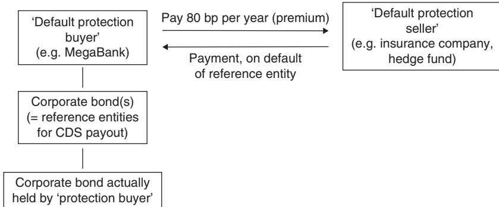

| [Introduction](../../Financial%20Markets%20and%20Institutions/III.%20Liquidity%20of%20Assets/Class%209-%20Bailouts%20and%20Bank%20Failures/Squam%20Lake%20Group%20Introduction.md)                                                                                                                   | 5                                                      |     |
| ------------------------------------------------------------------------------------------------------------------------------ | ------------------------------------------------------ | --- |
| The Basics                                                                                                                     | 7                                                      |     |
| [London Interbank Offered Rate](../../Financial%20Markets/Fixed%20Income%20Securities%20Tools%20for%20Today's%20Markets/Chapter%2012/Short-Term%20Rates%20and%20the%20Transition%20from%20LIBOR.md) (LIBOR)                                                                                          | 7                                                      |     |
| Federal Funds Market                                                                                                           | 9                                                      |     |
| [Basis Swap](A%20Guide%20to%20the%20Front%20End%20and%20[[Basis%20Swaps) Markets#[Forward Rate Agreements](../../Financial%20Markets/Fixed%20Income%20Securities%20Tools%20for%20Today's%20Markets/Chapter%2012/EURIBOR%20Forward%20Rate%20Agreements%20and%20Futures.md) (FRAs) [Overview](../../Financial%20Markets/Financial%20Engineering%20and%20Arbitrage%20in%20the%20Financial%20Markets/PART%20I%20RELATIVE%20VALUE%20BUILDING%20BLOCKS/Chapter%201%20-%20Purpose%20and%20Structure%20of%20Financial%20Markets/Overview%20of%20Financial%20Markets.md)|[Forward Rate Agreements](../../Financial%20Markets/Fixed%20Income%20Securities%20Tools%20for%20Today's%20Markets/Chapter%2012/EURIBOR%20Forward%20Rate%20Agreements%20and%20Futures.md)]] (FRAs)                                                                                                 | 11                                                     |     |
| [Overview](../../Financial%20Markets/Financial%20Engineering%20and%20Arbitrage%20in%20the%20Financial%20Markets/PART%20I%20RELATIVE%20VALUE%20BUILDING%20BLOCKS/Chapter%201%20-%20Purpose%20and%20Structure%20of%20Financial%20Markets/Overview%20of%20Financial%20Markets.md)                                                                                                                       | 11                                                     |     |
| FRAs used to hedge floating-rate notes                                                                                         | 14                                                     |     |
| FRAs used to express a view on falling [Basis Swap](A%20Guide%20to%20the%20Front%20End%20and%20[[Basis%20Swaps) Markets#[London Interbank Offered Rate](../../Financial%20Markets/Fixed%20Income%20Securities%20Tools%20for%20Today's%20Markets/Chapter%2012/Short-Term%20Rates%20and%20the%20Transition%20from%20LIBOR.md) (LIBOR) | LIBOR]] Rates                                          | 15  |
| Overnight Index Swaps                                                                                                          | 17                                                     |     |
| [Overview](../../Financial%20Markets/Financial%20Engineering%20and%20Arbitrage%20in%20the%20Financial%20Markets/PART%20I%20RELATIVE%20VALUE%20BUILDING%20BLOCKS/Chapter%201%20-%20Purpose%20and%20Structure%20of%20Financial%20Markets/Overview%20of%20Financial%20Markets.md)                                                                                                                       | 17                                                     |     |
| Using Is to restructure bank liabilities                                                                                       | 18                                                     |     |
| Using Is to hedge repo funding rates                                                                                           | 19                                                     |     |
| Using Is to take directional views on T-Bill/Is spreads                                                                        | 20                                                     |     |
| Using Is to anticipate the outcome of FOMC meetings                                                                            | 21                                                     |     |
| Using Is to hedge one leg of [total return swaps](../../Financial%20Engineering/Derivatives/Part%20X%20-%20Credit%20Derivatives/Chapter%2043%20-%20Securitisation,%20ABSs%20and%20CDOs.md)                                                                                | 21                                                     |     |
| FRA-OIS Spread                                                                                                                 | 23                                                     |     |
| [Overview](../../Financial%20Markets/Financial%20Engineering%20and%20Arbitrage%20in%20the%20Financial%20Markets/PART%20I%20RELATIVE%20VALUE%20BUILDING%20BLOCKS/Chapter%201%20-%20Purpose%20and%20Structure%20of%20Financial%20Markets/Overview%20of%20Financial%20Markets.md)                                                                                                                       | 23                                                     |     |
| Using FRA/Is as a hedge for general bank [credit quality](../../Financial%20Markets%20and%20Institutions/II.%20The%20Roles%20of%20Banks%20and%20Derivative%20Markets%20in%20Resolving%20Problems%20Inherent%20in%20Debt%20Contracts/Class%202-%20Debt%20Contracts%20due%20to%20Lack%20of%20Information/Wellman%20Inc%20the%20Importance%20of%20Loan%20Covenants.md)                                                                        | 24                                                     |     |
| Using FRA/Is to express directional view on credit spreads                                                                     | 24                                                     |     |
| Using FRA/Is to hedge swap spreads generically                                                                                 | 25                                                     |     |
| LIBOR/[Basis Swap](A%20Guide%20to%20the%20Front%20End%20and%20[[Basis%20Swaps) Markets#[London Interbank Offered Rate](../../Financial%20Markets/Fixed%20Income%20Securities%20Tools%20for%20Today's%20Markets/Chapter%2012/Short-Term%20Rates%20and%20the%20Transition%20from%20LIBOR.md) (LIBOR)                                  | LIBOR]] Basis Swaps                                    | 27  |
| [Overview](../../Financial%20Markets/Financial%20Engineering%20and%20Arbitrage%20in%20the%20Financial%20Markets/PART%20I%20RELATIVE%20VALUE%20BUILDING%20BLOCKS/Chapter%201%20-%20Purpose%20and%20Structure%20of%20Financial%20Markets/Overview%20of%20Financial%20Markets.md)                                                                                                                       | 27                                                     |     |
| LIBOR/[Basis Swap](A%20Guide%20to%20the%20Front%20End%20and%20[[Basis%20Swaps) Markets#[London Interbank Offered Rate](../../Financial%20Markets/Fixed%20Income%20Securities%20Tools%20for%20Today's%20Markets/Chapter%2012/Short-Term%20Rates%20and%20the%20Transition%20from%20LIBOR.md) (LIBOR)                                  | LIBOR]] basis as a hedge for [interest rate uncertainty](../../Financial%20Markets/Financial%20Asset%20Pricing%20Theory%20Overview/Chapter%2012%20-%20Derivatives/Exercises.md) | 28  |
| Using LIBOR/[Basis Swap](A%20Guide%20to%20the%20Front%20End%20and%20[[Basis%20Swaps) Markets#[London Interbank Offered Rate](../../Financial%20Markets/Fixed%20Income%20Securities%20Tools%20for%20Today's%20Markets/Chapter%2012/Short-Term%20Rates%20and%20the%20Transition%20from%20LIBOR.md) (LIBOR)                            | LIBOR]] basis to express a view on bank credit         | 29  |
| Using 6 s 3 s basis swaps to match bank assets and liabilities                                                                 | 30                                                     |     |
| Using 3 s 1 s basis swaps to convert issuance exposure from fixed to                                                           |                                                        |     |
| 1-month [Basis Swap](A%20Guide%20to%20the%20Front%20End%20and%20[[Basis%20Swaps) Markets#[London Interbank Offered Rate](../../Financial%20Markets/Fixed%20Income%20Securities%20Tools%20for%20Today's%20Markets/Chapter%2012/Short-Term%20Rates%20and%20the%20Transition%20from%20LIBOR.md) (LIBOR)                                | LIBOR]]                                                | 30  |
| Using 3 s 1 s basis swaps to match assets and liabilities of                                                                   |                                                        |     |
| mortgage portfolios                                                                                                            | 31                                                     |     |

| [Fed Funds](../../Financial%20Markets/Fixed%20Income%20Securities%20Tools%20for%20Today's%20Markets/Chapter%2012/Fed%20Fund%20Futures.md)/[Basis Swap](A%20Guide%20to%20the%20Front%20End%20and%20[[Basis%20Swaps) Markets#[London Interbank Offered Rate](../../Financial%20Markets/Fixed%20Income%20Securities%20Tools%20for%20Today's%20Markets/Chapter%2012/Short-Term%20Rates%20and%20the%20Transition%20from%20LIBOR.md) (LIBOR)|LIBOR]] [Basis Swap](../../Financial%20Markets/Fixed%20Income%20Securities%20Tools%20for%20Today's%20Markets/Chapter%2013/Basis%20Swaps.md) | 33 |

| --- | --- |

| [Overview](../../Financial%20Markets/Financial%20Engineering%20and%20Arbitrage%20in%20the%20Financial%20Markets/PART%20I%20RELATIVE%20VALUE%20BUILDING%20BLOCKS/Chapter%201%20-%20Purpose%20and%20Structure%20of%20Financial%20Markets/Overview%20of%20Financial%20Markets.md) | 33 |

| Using FF/[Basis Swap](A%20Guide%20to%20the%20Front%20End%20and%20[[Basis%20Swaps) Markets#[London Interbank Offered Rate](../../Financial%20Markets/Fixed%20Income%20Securities%20Tools%20for%20Today's%20Markets/Chapter%2012/Short-Term%20Rates%20and%20the%20Transition%20from%20LIBOR.md) (LIBOR)|LIBOR]] basis swaps to convert a swap spread trade to a | |

| repo/Is trade | 34 |

| Using FF/[Basis Swap](A%20Guide%20to%20the%20Front%20End%20and%20[[Basis%20Swaps) Markets#[London Interbank Offered Rate](../../Financial%20Markets/Fixed%20Income%20Securities%20Tools%20for%20Today's%20Markets/Chapter%2012/Short-Term%20Rates%20and%20the%20Transition%20from%20LIBOR.md) (LIBOR)|LIBOR]] basis swaps to hedge [Basis Swap](A%20Guide%20to%20the%20Front%20End%20and%20[[Basis%20Swaps) Markets#Federal Funds Market|[Fed Funds](../../Financial%20Markets/Fixed%20Income%20Securities%20Tools%20for%20Today's%20Markets/Chapter%2012/Fed%20Fund%20Futures.md)]] floaters | 34 |

| Using FF/[Basis Swap](A%20Guide%20to%20the%20Front%20End%20and%20[[Basis%20Swaps) Markets#[London Interbank Offered Rate](../../Financial%20Markets/Fixed%20Income%20Securities%20Tools%20for%20Today's%20Markets/Chapter%2012/Short-Term%20Rates%20and%20the%20Transition%20from%20LIBOR.md) (LIBOR)|LIBOR]] basis swaps to extract 5 yr 5 yr real [Basis Swap](A%20Guide%20to%20the%20Front%20End%20and%20[[Basis%20Swaps) Markets#Federal Funds Market|[Fed Funds](../../Financial%20Markets/Fixed%20Income%20Securities%20Tools%20for%20Today's%20Markets/Chapter%2012/Fed%20Fund%20Futures.md)]] | 35 |

| Prime/[Basis Swap](A%20Guide%20to%20the%20Front%20End%20and%20[[Basis%20Swaps) Markets#[London Interbank Offered Rate](../../Financial%20Markets/Fixed%20Income%20Securities%20Tools%20for%20Today's%20Markets/Chapter%2012/Short-Term%20Rates%20and%20the%20Transition%20from%20LIBOR.md) (LIBOR)|LIBOR]] [Basis Swap](../../Financial%20Markets/Fixed%20Income%20Securities%20Tools%20for%20Today's%20Markets/Chapter%2013/Basis%20Swaps.md) | 37 |

| [Overview](../../Financial%20Markets/Financial%20Engineering%20and%20Arbitrage%20in%20the%20Financial%20Markets/PART%20I%20RELATIVE%20VALUE%20BUILDING%20BLOCKS/Chapter%201%20-%20Purpose%20and%20Structure%20of%20Financial%20Markets/Overview%20of%20Financial%20Markets.md) | 37 |

| Using prime/[Basis Swap](A%20Guide%20to%20the%20Front%20End%20and%20[[Basis%20Swaps) Markets#[London Interbank Offered Rate](../../Financial%20Markets/Fixed%20Income%20Securities%20Tools%20for%20Today's%20Markets/Chapter%2012/Short-Term%20Rates%20and%20the%20Transition%20from%20LIBOR.md) (LIBOR)|LIBOR]] basis swaps for asset liability matching | 37 |

| Using prime/[Basis Swap](A%20Guide%20to%20the%20Front%20End%20and%20[[Basis%20Swaps) Markets#[London Interbank Offered Rate](../../Financial%20Markets/Fixed%20Income%20Securities%20Tools%20for%20Today's%20Markets/Chapter%2012/Short-Term%20Rates%20and%20the%20Transition%20from%20LIBOR.md) (LIBOR)|LIBOR]] basis swaps to hedge prime floaters | 38 |

| Using prime/[Basis Swap](A%20Guide%20to%20the%20Front%20End%20and%20[[Basis%20Swaps) Markets#[London Interbank Offered Rate](../../Financial%20Markets/Fixed%20Income%20Securities%20Tools%20for%20Today's%20Markets/Chapter%2012/Short-Term%20Rates%20and%20the%20Transition%20from%20LIBOR.md) (LIBOR)|LIBOR]] basis swaps to express a view on [Basis Swap](A%20Guide%20to%20the%20Front%20End%20and%20[[Basis%20Swaps) Markets#Federal Funds Market|[Fed Funds](../../Financial%20Markets/Fixed%20Income%20Securities%20Tools%20for%20Today's%20Markets/Chapter%2012/Fed%20Fund%20Futures.md)]] | |

| effective diverging from target | 38 |

| Using prime/[Basis Swap](A%20Guide%20to%20the%20Front%20End%20and%20[[Basis%20Swaps) Markets#[London Interbank Offered Rate](../../Financial%20Markets/Fixed%20Income%20Securities%20Tools%20for%20Today's%20Markets/Chapter%2012/Short-Term%20Rates%20and%20the%20Transition%20from%20LIBOR.md) (LIBOR)|LIBOR]] basis swaps to hedge a credit card [portfolio](../../Advanced%20Investments/An%20Asset%20Allocation%20Primer.md) | 39 |

| Prime/[Basis Swap](A%20Guide%20to%20the%20Front%20End%20and%20[[Basis%20Swaps) Markets#Federal Funds Market|[Fed Funds](../../Financial%20Markets/Fixed%20Income%20Securities%20Tools%20for%20Today's%20Markets/Chapter%2012/Fed%20Fund%20Futures.md)]] [Basis Swap](../../Financial%20Markets/Fixed%20Income%20Securities%20Tools%20for%20Today's%20Markets/Chapter%2013/Basis%20Swaps.md) | 41 |

| [Overview](../../Financial%20Markets/Financial%20Engineering%20and%20Arbitrage%20in%20the%20Financial%20Markets/PART%20I%20RELATIVE%20VALUE%20BUILDING%20BLOCKS/Chapter%201%20-%20Purpose%20and%20Structure%20of%20Financial%20Markets/Overview%20of%20Financial%20Markets.md) | 41 |

| Using prime/[Basis Swap](A%20Guide%20to%20the%20Front%20End%20and%20[[Basis%20Swaps) Markets#Federal Funds Market|[Fed Funds](../../Financial%20Markets/Fixed%20Income%20Securities%20Tools%20for%20Today's%20Markets/Chapter%2012/Fed%20Fund%20Futures.md)]] basis swaps to express a view on consumer | |

| [credit quality](../../Financial%20Markets%20and%20Institutions/II.%20The%20Roles%20of%20Banks%20and%20Derivative%20Markets%20in%20Resolving%20Problems%20Inherent%20in%20Debt%20Contracts/Class%202-%20Debt%20Contracts%20due%20to%20Lack%20of%20Information/Wellman%20Inc%20the%20Importance%20of%20Loan%20Covenants.md) | 41 |

| Using prime/[Basis Swap](A%20Guide%20to%20the%20Front%20End%20and%20[[Basis%20Swaps) Markets#Federal Funds Market|[Fed Funds](../../Financial%20Markets/Fixed%20Income%20Securities%20Tools%20for%20Today's%20Markets/Chapter%2012/Fed%20Fund%20Futures.md)]] basis swaps to express a view on divergence | |

| of fed effective from target | 41 |

| Summary & Comparison | 43 |

| Basic Instruments | 43 |

| Basic Swaps | 44 |

| Appendix: Sample Term Sheets | 45 |

# A Guide to the Front End and Basis Swap Markets

The demand for [short-term interest rate](../../Financial%20Markets/Fixed%20Income%20Securities%20Tools%20for%20Today's%20Markets/Chapter%209/The%20Gauss%20Model.md) instruments and [derivatives](../../Financial%20Markets/Financial%20Trading%20and%20Markets/Chapter%209%20Arbitrage%20and%20Hedging%20With%20Options.md) has increased significantly in recent years in response to unprecedented volatility. Policy rates were slashed markedly during 2008 and 2009 in response to the [global financial crisis](../../Financial%20Engineering/8.%20Credit%20Modeling%20and%20Credit%20Derivatives.md). Meanwhile,  the spreads between various short-term benchmark rates became much more volatile as credit concerns caused historically stable relationships to unravel. For example,  [Basis Swap](A%20Guide%20to%20the%20Front%20End%20and%20[[Basis%20Swaps) Markets#[London Interbank Offered Rate](../../Financial%20Markets/Fixed%20Income%20Securities%20Tools%20for%20Today's%20Markets/Chapter%2012/Short-Term%20Rates%20and%20the%20Transition%20from%20LIBOR.md) (LIBOR)|LIBOR]] rates rose even as central banks cut policy rates.

[Derivatives](../../Financial%20Markets/Financial%20Trading%20and%20Markets/Chapter%209%20Arbitrage%20and%20Hedging%20With%20Options.md) trading in the front end of the USD rates market increased 33% from the beginning of 2008 to mid-2009. Hedgers increased their usage of short-term instruments in order to protect their cash flows better from unexpected moves in spreads and/or policy rates. Meanwhile,  speculators increased their trading of more tailored products such as Is to express views on policy rates while becoming far more active in the basis markets to take advantage of spread movements.

Recent events provide a useful context for discussing the breadth of products available to market participants in the [short-term rates](../../Financial%20Markets/Fixed%20Income%20Securities%20Tools%20for%20Today's%20Markets/Chapter%208/Volatility%20and%20Convexity.md) and basis markets. This [primer](../../Advanced%20Investments/An%20Asset%20Allocation%20Primer.md) starts with the building blocks of the [Basis Swap](A%20Guide%20to%20the%20Front%20End%20and%20[[Basis%20Swaps) Markets#[London Interbank Offered Rate](../../Financial%20Markets/Fixed%20Income%20Securities%20Tools%20for%20Today's%20Markets/Chapter%2012/Short-Term%20Rates%20and%20the%20Transition%20from%20LIBOR.md) (LIBOR)|LIBOR]] and the [Basis Swap](A%20Guide%20to%20the%20Front%20End%20and%20[[Basis%20Swaps) Markets#Federal Funds Market|[Fed Funds](../../Financial%20Markets/Fixed%20Income%20Securities%20Tools%20for%20Today's%20Markets/Chapter%2012/Fed%20Fund%20Futures.md)]] market and moves on to cover the most common instruments in the front-end and basis markets. Sections are devoted to products and are intended to be self-contained. Each section consists of an [overview](../../Financial%20Markets/Financial%20Engineering%20and%20Arbitrage%20in%20the%20Financial%20Markets/PART%20I%20RELATIVE%20VALUE%20BUILDING%20BLOCKS/Chapter%201%20-%20Purpose%20and%20Structure%20of%20Financial%20Markets/Overview%20of%20Financial%20Markets.md) outlining the salient features of the product followed by examples of usage. Sample term sheets for the instruments and [derivatives](../../Financial%20Markets/Financial%20Trading%20and%20Markets/Chapter%209%20Arbitrage%20and%20Hedging%20With%20Options.md) are provided in the Appendix.

#### **Exhibit 1: Growth of short-term interest rate derivatives trading**

Source: [Credit Suisse](../../Financial%20Markets%20and%20Institutions/III.%20Liquidity%20of%20Assets/Class%208-%20Markets,%20Meltdowns,%20and%20Arbitrage/The%20Economist%20Margin%20Call%20of%20the%20Wild.md),  Bank of International Settlements (BIS)

# The Basics

 [Basis Swap](A%20Guide%20to%20the%20Front%20End%20and%20[[Basis%20Swaps) Markets#[London Interbank Offered Rate](../../Financial%20Markets/Fixed%20Income%20Securities%20Tools%20for%20Today's%20Markets/Chapter%2012/Short-Term%20Rates%20and%20the%20Transition%20from%20LIBOR.md) (LIBOR)|LIBOR]]

### London Interbank Offered Rate (LIBOR)

"[Basis Swap](A%20Guide%20to%20the%20Front%20End%20and%20[[Basis%20Swaps) Markets#[London Interbank Offered Rate](../../Financial%20Markets/Fixed%20Income%20Securities%20Tools%20for%20Today's%20Markets/Chapter%2012/Short-Term%20Rates%20and%20the%20Transition%20from%20LIBOR.md) (LIBOR)|LIBOR]] is the rate at which an individual Contributor Panel bank could borrow funds,  were it to do so by asking for and then accepting interbank offers in reasonable market size,  just prior to 11:00 am London time." – British Banker's Association

In the early 1980 s,  in order to ensure continued growth in the trading of numerous new instruments such as interest rate swaps and [currency](../../Financial%20Instruments/Lecture%20Notes-%20Financial%20Instruments/Teaching%20Note%201-%20Forward%20Rates%20Agreement/Forwards%20and%20Futures%20Notes.md) options,  there arose the pressing need to establish a uniform benchmark index against which these instruments could be referenced. That search for a uniform benchmark culminated in the [Basis Swap](A%20Guide%20to%20the%20Front%20End%20and%20[[Basis%20Swaps) Markets#[London Interbank Offered Rate](../../Financial%20Markets/Fixed%20Income%20Securities%20Tools%20for%20Today's%20Markets/Chapter%2012/Short-Term%20Rates%20and%20the%20Transition%20from%20LIBOR.md) (LIBOR)|LIBOR]] indices. Today,  [Basis Swap](A%20Guide%20to%20the%20Front%20End%20and%20[[Basis%20Swaps) Markets#[London Interbank Offered Rate](../../Financial%20Markets/Fixed%20Income%20Securities%20Tools%20for%20Today's%20Markets/Chapter%2012/Short-Term%20Rates%20and%20the%20Transition%20from%20LIBOR.md) (LIBOR)|LIBOR]] serves as the foundation for the bulk of front-end trading and is quoted for a number of tenors and currencies. [Basis Swap](A%20Guide%20to%20the%20Front%20End%20and%20[[Basis%20Swaps) Markets#[London Interbank Offered Rate](../../Financial%20Markets/Fixed%20Income%20Securities%20Tools%20for%20Today's%20Markets/Chapter%2012/Short-Term%20Rates%20and%20the%20Transition%20from%20LIBOR.md) (LIBOR)|LIBOR]] is not a traded rate,  but rather the outcome of a poll of bank rates submitted to the British Banker's Association (BBA) at 11 am GMT each London business day. The official fixings are calculated by the BBA in conjunction with Reuters and are released to the Telerate/Reuters page 3750 and on Bloomberg to BBAL.

| Exhibit 2 | LIBOR Panels    |                        |                              |
| --------- | --------------- | ---------------------- | ---------------------------- |
| [Currency](../../Financial%20Instruments/Lecture%20Notes-%20Financial%20Instruments/Teaching%20Note%201-%20Forward%20Rates%20Agreement/Forwards%20and%20Futures%20Notes.md)  | LIBOR           | Tenors                 | Number of Contributing Banks |
| AUD       | S/N (spot/next) | 1 W,  2 W,  1 M - 12 M | 8                            |
| CAD       | O/N (overnight) | 1 W,  2 W,  1 M - 12 M | 12                           |
| CHF       | S/N             | 1 W,  2 W,  1 M - 12 M | 12                           |
| EUR       | O/N             | 1 W,  2 W,  1 M - 12 M | 16                           |
| GBP       | O/N             | 1 W,  2 W,  1 M - 12 M | 16                           |
| JPY       | S/N             | 1 W,  2 W,  1 M - 12 M | 16                           |
| USD       | O/N             | 1 W,  2 W,  1 M - 12 M | 16                           |
| DKK       | S/N             | 1 W,  2 W,  1 M - 12 M | 8                            |
| NZD       | S/N             | 1 W,  2 W,  1 M - 12 M | 8                            |
| SEK       | S/N             | 1 W,  2 W,  1 M - 12 M | 8                            |

Source: British Banker's Association

The term "funds" in the [Basis Swap](A%20Guide%20to%20the%20Front%20End%20and%20[[Basis%20Swaps) Markets#[London Interbank Offered Rate](../../Financial%20Markets/Fixed%20Income%20Securities%20Tools%20for%20Today's%20Markets/Chapter%2012/Short-Term%20Rates%20and%20the%20Transition%20from%20LIBOR.md) (LIBOR)|LIBOR]] definition refers to unsecured deposit rates,  which tend to trade at or above secured (repo) rates. LIBORs reflect "offshore" deposit rates,  which allow banks to avoid regulation or registration applicable to onshore deposit markets and thus require an added spread to equivalent onshore rates. Note that the terms "Eurodollar",  "Euroyen",  etc.,  refer to USD or JPY deposits trading outside of their respective domestic deposit markets and are not related to the euro [currency](../../Financial%20Instruments/Lecture%20Notes-%20Financial%20Instruments/Teaching%20Note%201-%20Forward%20Rates%20Agreement/Forwards%20and%20Futures%20Notes.md).

The fixed [Basis Swap](A%20Guide%20to%20the%20Front%20End%20and%20[[Basis%20Swaps) Markets#[London Interbank Offered Rate](../../Financial%20Markets/Fixed%20Income%20Securities%20Tools%20for%20Today's%20Markets/Chapter%2012/Short-Term%20Rates%20and%20the%20Transition%20from%20LIBOR.md) (LIBOR)|LIBOR]] rate is not precisely linked to the rate a contributing bank would bid for funding,  nor is it directly tied to the rate at which a given contributor would offer funding. Instead,  it reflects where a given bank deems it could borrow funds in reasonable size should it seek to do so. In essence,  the banks are being asked to disclose the rate at which they **believe** the market would be willing to offer cash to them should they desire funding. It is the contributing bank's perception of where others would offer them funding. Sentiment is,  therefore,  critical for the direction of LIBOR.

To compute the USD LIBORs,  the BBA queries 16 banks each morning,  ranks the rates from highest to lowest,  removes the top and bottom quartiles and then arithmetically averages the remaining rates. This average is the [Basis Swap](A%20Guide%20to%20the%20Front%20End%20and%20[[Basis%20Swaps) Markets#[London Interbank Offered Rate](../../Financial%20Markets/Fixed%20Income%20Securities%20Tools%20for%20Today's%20Markets/Chapter%2012/Short-Term%20Rates%20and%20the%20Transition%20from%20LIBOR.md) (LIBOR)|LIBOR]] fixing for the day,  for a particular tenor. The process is repeated for each tenor to compute the corresponding [Basis Swap](A%20Guide%20to%20the%20Front%20End%20and%20[[Basis%20Swaps) Markets#[London Interbank Offered Rate](../../Financial%20Markets/Fixed%20Income%20Securities%20Tools%20for%20Today's%20Markets/Chapter%2012/Short-Term%20Rates%20and%20the%20Transition%20from%20LIBOR.md) (LIBOR)|LIBOR]] fixings (Exhibit 2). The [day-count](../../Financial%20Markets/Financial%20Engineering%20and%20Arbitrage%20in%20the%20Financial%20Markets/PART%20I%20RELATIVE%20VALUE%20BUILDING%20BLOCKS/Chapter%202%20-%20Spot%20Markets/Intra-Year%20Compounding%20and%20Day-Count.md) convention used in the submissions and fixings is actual/360.

[Basis Swap](A%20Guide%20to%20the%20Front%20End%20and%20[[Basis%20Swaps) Markets#[London Interbank Offered Rate](../../Financial%20Markets/Fixed%20Income%20Securities%20Tools%20for%20Today's%20Markets/Chapter%2012/Short-Term%20Rates%20and%20the%20Transition%20from%20LIBOR.md) (LIBOR)|LIBOR]] rates reference accrual periods,  with lengths that correspond to the specific [Basis Swap](A%20Guide%20to%20the%20Front%20End%20and%20[[Basis%20Swaps) Markets#[London Interbank Offered Rate](../../Financial%20Markets/Fixed%20Income%20Securities%20Tools%20for%20Today's%20Markets/Chapter%2012/Short-Term%20Rates%20and%20the%20Transition%20from%20LIBOR.md) (LIBOR)|LIBOR]] tenors. The start of the accrual period and the [Basis Swap](A%20Guide%20to%20the%20Front%20End%20and%20[[Basis%20Swaps) Markets#[London Interbank Offered Rate](../../Financial%20Markets/Fixed%20Income%20Securities%20Tools%20for%20Today's%20Markets/Chapter%2012/Short-Term%20Rates%20and%20the%20Transition%20from%20LIBOR.md) (LIBOR)|LIBOR]] fixing date need not,  and most often do not,  coincide. In the case of USD,  the [Basis Swap](A%20Guide%20to%20the%20Front%20End%20and%20[[Basis%20Swaps) Markets#[London Interbank Offered Rate](../../Financial%20Markets/Fixed%20Income%20Securities%20Tools%20for%20Today's%20Markets/Chapter%2012/Short-Term%20Rates%20and%20the%20Transition%20from%20LIBOR.md) (LIBOR)|LIBOR]] fixing date precedes the accrual start date (also known as the [Basis Swap](A%20Guide%20to%20the%20Front%20End%20and%20[[Basis%20Swaps) Markets#[London Interbank Offered Rate](../../Financial%20Markets/Fixed%20Income%20Securities%20Tools%20for%20Today's%20Markets/Chapter%2012/Short-Term%20Rates%20and%20the%20Transition%20from%20LIBOR.md) (LIBOR)|LIBOR]] Spot date or [Basis Swap](A%20Guide%20to%20the%20Front%20End%20and%20[[Basis%20Swaps) Markets#[London Interbank Offered Rate](../../Financial%20Markets/Fixed%20Income%20Securities%20Tools%20for%20Today's%20Markets/Chapter%2012/Short-Term%20Rates%20and%20the%20Transition%20from%20LIBOR.md) (LIBOR)|LIBOR]] Value date) by two London business days. The procedure for calculating the [Basis Swap](A%20Guide%20to%20the%20Front%20End%20and%20[[Basis%20Swaps) Markets#[London Interbank Offered Rate](../../Financial%20Markets/Fixed%20Income%20Securities%20Tools%20for%20Today's%20Markets/Chapter%2012/Short-Term%20Rates%20and%20the%20Transition%20from%20LIBOR.md) (LIBOR)|LIBOR]] spot date from the fixing date is outlined below.

#### **Steps to calculate the |LIBOR) Spot date:**
- 1. Start with today's date.
- 2. Go forward two good London business days from (1).
- 3. If the date from (2) is a good New York business day,  (2) is the USD [Basis Swap](A%20Guide%20to%20the%20Front%20End%20and%20[[Basis%20Swaps) Markets#[London Interbank Offered Rate](../../Financial%20Markets/Fixed%20Income%20Securities%20Tools%20for%20Today's%20Markets/Chapter%2012/Short-Term%20Rates%20and%20the%20Transition%20from%20LIBOR.md) (LIBOR)|LIBOR]] Spot.
- 4. If (2) is not a good New York business day,  advance forward until both a good London and New York day is reached. This date is then the USD [Basis Swap](A%20Guide%20to%20the%20Front%20End%20and%20[[Basis%20Swaps) Markets#[London Interbank Offered Rate](../../Financial%20Markets/Fixed%20Income%20Securities%20Tools%20for%20Today's%20Markets/Chapter%2012/Short-Term%20Rates%20and%20the%20Transition%20from%20LIBOR.md) (LIBOR)|LIBOR]] Spot.

[Basis Swap](A%20Guide%20to%20the%20Front%20End%20and%20[[Basis%20Swaps) Markets#[London Interbank Offered Rate](../../Financial%20Markets/Fixed%20Income%20Securities%20Tools%20for%20Today's%20Markets/Chapter%2012/Short-Term%20Rates%20and%20the%20Transition%20from%20LIBOR.md) (LIBOR)|LIBOR]] fixings are generally slower to adjust to small [changes in rates](../../Financial%20Markets/Fixed%20Income%20Securities%20Tools%20for%20Today's%20Markets/Chapter%203/Pl%20Attribution.md) than the real-time derivative markets since LIBORs represent deposit rates with wider bid-offer spreads than [derivatives](../../Financial%20Markets/Financial%20Trading%20and%20Markets/Chapter%209%20Arbitrage%20and%20Hedging%20With%20Options.md). These wider margins allow the fixing panels to adjust rates incrementally,  as the bid/offer prices will likely remain valid after a small rate change.

Generally,  timing can significantly impact [Basis Swap](A%20Guide%20to%20the%20Front%20End%20and%20[[Basis%20Swaps) Markets#[London Interbank Offered Rate](../../Financial%20Markets/Fixed%20Income%20Securities%20Tools%20for%20Today's%20Markets/Chapter%2012/Short-Term%20Rates%20and%20the%20Transition%20from%20LIBOR.md) (LIBOR)|LIBOR]] fixings. Around quarter-end and year-end turns,  [Basis Swap](A%20Guide%20to%20the%20Front%20End%20and%20[[Basis%20Swaps) Markets#[London Interbank Offered Rate](../../Financial%20Markets/Fixed%20Income%20Securities%20Tools%20for%20Today's%20Markets/Chapter%2012/Short-Term%20Rates%20and%20the%20Transition%20from%20LIBOR.md) (LIBOR)|LIBOR]] rates can spike as banks' willingness to lend diminishes near balance sheet reporting periods. In addition,  [Basis Swap](A%20Guide%20to%20the%20Front%20End%20and%20[[Basis%20Swaps) Markets#[London Interbank Offered Rate](../../Financial%20Markets/Fixed%20Income%20Securities%20Tools%20for%20Today's%20Markets/Chapter%2012/Short-Term%20Rates%20and%20the%20Transition%20from%20LIBOR.md) (LIBOR)|LIBOR]] fixings after central bank meetings jump noticeably,  even when policy changes are fully expected,  since cash participants generally want to see the changes before they adjust rates. Notably,  the volatility of changes in Wednesday/Thursday fixings is not significantly greater than that of other days even though the value date for Thursday's fixing is three calendar days ahead of Wednesday's value date.

### 

[Basis Swap](A%20Guide%20to%20the%20Front%20End%20and%20[[Basis%20Swaps) Markets#Federal Funds Market|[Fed Funds](../../Financial%20Markets/Fixed%20Income%20Securities%20Tools%20for%20Today's%20Markets/Chapter%2012/Fed%20Fund%20Futures.md)]]

"Federal funds,  or [fed funds](../../Financial%20Markets/Fixed%20Income%20Securities%20Tools%20for%20Today's%20Markets/Chapter%2012/Fed%20Fund%20Futures.md),  are unsecured loans of reserve balances at Federal Reserve Banks that depository institutions make to one another. The rate at which these transactions occur is called the [Basis Swap](A%20Guide%20to%20the%20Front%20End%20and%20[[Basis%20Swaps) Markets#Federal Funds Market|[Fed Funds](../../Financial%20Markets/Fixed%20Income%20Securities%20Tools%20for%20Today's%20Markets/Chapter%2012/Fed%20Fund%20Futures.md) Rate]] ." (Federal Reserve Bank of New York)

Banks maintain reserve balances at the Federal Reserve Banks to serve two primary purposes – to meet their reserve requirements and to clear financial transactions. The **reserve requirement** is a central-bank-mandated minimum level of reserves that must be held against demand deposits. Currently,  the reserve requirement in the US stands at 10%,  measured over a period of two weeks (the reserve maintenance period). Any reserves in excess of the reserve requirement are considered **excess reserves**. In the US,  banks and other eligible institutions trade these reserves in the [Basis Swap](A%20Guide%20to%20the%20Front%20End%20and%20[[Basis%20Swaps) Markets#Federal Funds Market|[Fed Funds](../../Financial%20Markets/Fixed%20Income%20Securities%20Tools%20for%20Today's%20Markets/Chapter%2012/Fed%20Fund%20Futures.md)]] market,  a free trading market,  to redistribute total reserves in the [banking system](../../Financial%20Markets%20and%20Institutions/II.%20The%20Roles%20of%20Banks%20and%20Derivative%20Markets%20in%20Resolving%20Problems%20Inherent%20in%20Debt%20Contracts/Class%203-%20Financial%20Intermediation%20and%20Delegated%20Loan%20Monitoring%20,%20Intro%20to%20Bankruptcy%20and%20Debt%20Restructuring/Class%20Slide%203%20Financial%20Intermediation%20and%20Delegated%20Monitoring.md). Institutions that have excess reserves lend reserves to institutions that have reserve deficiencies with loan terms that are typically overnight,  although longer terms can also be arranged.

The eligible entities that can participate in the federal funds market include commercial banks,  thrift institutions,  agencies and branches of foreign banks in the United States,  federal agencies and government securities dealers. 1

Although [Basis Swap](A%20Guide%20to%20the%20Front%20End%20and%20[[Basis%20Swaps) Markets#Federal Funds Market|[Fed Funds](../../Financial%20Markets/Fixed%20Income%20Securities%20Tools%20for%20Today's%20Markets/Chapter%2012/Fed%20Fund%20Futures.md)]] are unsecured loans,  they are considered safer than unsecured deposits because they occur in the [Federal Reserve system](../../Financial%20Markets/Fixed%20Income%20Securities%20Tools%20for%20Today's%20Markets/Chapter%2012/Fed%20Fund%20Futures.md) under the oversight of the Federal Reserve. The Federal Reserve uses the [Basis Swap](A%20Guide%20to%20the%20Front%20End%20and%20[[Basis%20Swaps) Markets#Federal Funds Market|[Fed Funds](../../Financial%20Markets/Fixed%20Income%20Securities%20Tools%20for%20Today's%20Markets/Chapter%2012/Fed%20Fund%20Futures.md)]] market as a tool to implement [Risk and Return](Lecture%207-[[Lecture%207-Risk%20and%20Return%20of%20Bonds) of Bonds#7.6 [Asset price](../../Financial%20Markets/Financial%20Asset%20Pricing%20Theory%20Overview/Chapter%204%20-%20State%20Prices/A%20Preview%20of%20Alternative%20Formulations.md) reactions to [monetary policy](../../Financial%20Markets%20and%20Institutions/III.%20Liquidity%20of%20Assets/Class%209-%20Bailouts%20and%20Bank%20Failures/Articles/The%20Economist%20Regime%20Change.md) surprises|[monetary policy](../../Financial%20Markets%20and%20Institutions/III.%20Liquidity%20of%20Assets/Class%209-%20Bailouts%20and%20Bank%20Failures/Articles/The%20Economist%20Regime%20Change.md)]]. It does so by setting the target level for the [Basis Swap](A%20Guide%20to%20the%20Front%20End%20and%20[[Basis%20Swaps) Markets#Federal Funds Market|[Fed Funds](../../Financial%20Markets/Fixed%20Income%20Securities%20Tools%20for%20Today's%20Markets/Chapter%2012/Fed%20Fund%20Futures.md) Rate]] at every Federal Open Market Committee (FOMC) meeting and changing the reserve balances in the system to effect the desired [Basis Swap](A%20Guide%20to%20the%20Front%20End%20and%20[[Basis%20Swaps) Markets#Federal Funds Market|[Fed Funds](../../Financial%20Markets/Fixed%20Income%20Securities%20Tools%20for%20Today's%20Markets/Chapter%2012/Fed%20Fund%20Futures.md) Rate]] . The Federal Reserve Bank of New York is charged by the FOMC to "create conditions in reserve markets" that encourage the [Basis Swap](A%20Guide%20to%20the%20Front%20End%20and%20[[Basis%20Swaps) Markets#Federal Funds Market|[Fed Funds](../../Financial%20Markets/Fixed%20Income%20Securities%20Tools%20for%20Today's%20Markets/Chapter%2012/Fed%20Fund%20Futures.md) Rate]] to trade close to a certain level and from time to time **may or may not** intervene in the [Basis Swap](A%20Guide%20to%20the%20Front%20End%20and%20[[Basis%20Swaps) Markets#Federal Funds Market|[Fed Funds](../../Financial%20Markets/Fixed%20Income%20Securities%20Tools%20for%20Today's%20Markets/Chapter%2012/Fed%20Fund%20Futures.md)]] market.

While the [Basis Swap](A%20Guide%20to%20the%20Front%20End%20and%20[[Basis%20Swaps) Markets#Federal Funds Market|[Fed Funds](../../Financial%20Markets/Fixed%20Income%20Securities%20Tools%20for%20Today's%20Markets/Chapter%2012/Fed%20Fund%20Futures.md)]] target rate is set at the FOMC meetings,  the [Basis Swap](A%20Guide%20to%20the%20Front%20End%20and%20[[Basis%20Swaps) Markets#Federal Funds Market|[Fed Funds](../../Financial%20Markets/Fixed%20Income%20Securities%20Tools%20for%20Today's%20Markets/Chapter%2012/Fed%20Fund%20Futures.md) Rate]] itself is a traded rate that is determined by the trading counterparts in a free market environment. Thus [the Fed](../../Financial%20Markets/Fixed%20Income%20Securities%20Tools%20for%20Today's%20Markets/Front%20Matter/Monetary%20Policy%20with%20Abundantreserves.md) does not dictate the [Basis Swap](A%20Guide%20to%20the%20Front%20End%20and%20[[Basis%20Swaps) Markets#Federal Funds Market|[Fed Funds](../../Financial%20Markets/Fixed%20Income%20Securities%20Tools%20for%20Today's%20Markets/Chapter%2012/Fed%20Fund%20Futures.md) Rate]] . During the course of the day,  the [Basis Swap](A%20Guide%20to%20the%20Front%20End%20and%20[[Basis%20Swaps) Markets#Federal Funds Market|[Fed Funds](../../Financial%20Markets/Fixed%20Income%20Securities%20Tools%20for%20Today's%20Markets/Chapter%2012/Fed%20Fund%20Futures.md) Rate]] can vary from transaction to transaction. The **federal funds effective rate**,  commonly referred to as [the fed](../../Financial%20Markets/Fixed%20Income%20Securities%20Tools%20for%20Today's%20Markets/Front%20Matter/Monetary%20Policy%20with%20Abundantreserves.md) effective,  is the weighted average of all brokered trades in the federal funds market on a given day and is used as a benchmark in many [short-term interest rate](../../Financial%20Markets/Fixed%20Income%20Securities%20Tools%20for%20Today's%20Markets/Chapter%209/The%20Gauss%20Model.md) instruments. The official fixing is calculated by the Federal Reserve and published between 7:30am and 8:00am EST to the H0.\1 series of Federal Reserve Statistical Releases. It can also be found on Bloomberg under FEDL and on Reuters page FEDFUNDS 1. The fixing is released with a one-day lag,  and thus to avoid confusion,  the fixing has an attached correct reference date. For example,  brokered trades in the federal funds market for value date 2-Mar-09,  are averaged and published on 3-Mar-09,  but carry an associated date label of 2-Mar-09.

Excess reserve balances rose sharply from late 2008 into 2010 as the Federal Reserve created reserves in order to fund its credit facilities and asset purchases in the wake of the [financial crisis](../../Financial%20Markets%20and%20Institutions/III.%20Liquidity%20of%20Assets/Class%209-%20Bailouts%20and%20Bank%20Failures/Squam%20Lake%20Group%20Letter.md). These large excess balances depressed the funds rate,  and absent [the Fed](../../Financial%20Markets/Fixed%20Income%20Securities%20Tools%20for%20Today's%20Markets/Front%20Matter/Monetary%20Policy%20with%20Abundantreserves.md)'s payment of interest on excess reserves (IOER),  the effective rate would tend to trade near zero,  as banks would seek to dispose of unwanted reserves at any positive interest rate. For the foreseeable future,  IOER will likely be the primary tool to manage the effective rate. [Liquidity](../../Financial%20Markets%20and%20Institutions/III.%20Liquidity%20of%20Assets/Class%205-%20Private%20Information,%20Liquidity,%20and%20Securitization/Class%20Note%2010%20Liquidity%20and%20Class%20Note%2010%20Liquidity%20and%20Liquidity%20Managementliquidity%20management.md)-draining techniques (reverse repos,  time deposits) may be used to mitigate the impact of excess reserves on the effective rate at some point. Still it is likely that a persistent reserve overhang will dampen the impact of various seasonal factors that historically caused predictable sources of volatility in the effective rate.

Prior to 2008,  the funds market exhibited discernible trading patterns. At some point,  these factors may again become important considerations if the supply of excess reserves is reduced substantially.

Historically,  demand to borrow funds has generally been high on the market open because of offshore entities' needs to cover short balances. This demand often (but not always) tapers off throughout the day. Peak volume occurs in the afternoon after banks have reconciled overnight balances (3 pm - 6 pm).

Timing can have a significant impact on the [Basis Swap](A%20Guide%20to%20the%20Front%20End%20and%20[[Basis%20Swaps) Markets#Federal Funds Market|[Fed Funds](../../Financial%20Markets/Fixed%20Income%20Securities%20Tools%20for%20Today's%20Markets/Chapter%2012/Fed%20Fund%20Futures.md)]] market. Some of the salient date effects are listed below:

- Daily Adjustments
	  - Weekends Effective is generally lower than the target as funds get lent out at a cheaper rate because of the longer time period.
	  - Thursdays Effective is generally higher than the target as Treasury bill auction settlement increases the demand for funds.
- Monthly Adjustments
	  - Month-end / Quarter-ends Effective is generally higher than the target as Treasury note auction settlement increases the demand for funds as does increased corporate borrowing for quarter-end balance sheets.
	  - Tax Days / Quarterly Refunding Effective is generally higher than the target as corporations (15 th of each fiscal quarter) and individuals (15 April) borrow to meet tax obligations. Another source of higher demand for funds is the quarterly Treasury refunding settlement on the 15 th of February,  May,  August and November.
	  - Mortgage Settlement dates Effective is generally higher than the target as mortgage bond payments (25 th of each month) drain balances of the Government Sponsored Entities (GSE) out of the system.
- Year-end Adjustments
	  - Year-end Effective is generally lower than the target as [the Fed](../../Financial%20Markets/Fixed%20Income%20Securities%20Tools%20for%20Today's%20Markets/Front%20Matter/Monetary%20Policy%20with%20Abundantreserves.md) injects excess [liquidity](../../Financial%20Markets%20and%20Institutions/III.%20Liquidity%20of%20Assets/Class%205-%20Private%20Information,%20Liquidity,%20and%20Securitization/Class%20Note%2010%20Liquidity%20and%20Class%20Note%2010%20Liquidity%20and%20Liquidity%20Managementliquidity%20management.md) to the [Basis Swap](A%20Guide%20to%20the%20Front%20End%20and%20[[Basis%20Swaps) Markets#Federal Funds Market|[Fed Funds](../../Financial%20Markets/Fixed%20Income%20Securities%20Tools%20for%20Today's%20Markets/Chapter%2012/Fed%20Fund%20Futures.md)]] market.

# %20Overview|Forward%20Rate%20Agreements) (FRAs) Overview

[Basis Swap](A%20Guide%20to%20the%20Front%20End%20and%20[[Basis%20Swaps) Markets#[Basis Swap](A%20Guide%20to%20the%20Front%20End%20and%20[[Basis%20Swaps) Markets#[Forward Rate Agreements](../../Financial%20Markets/Fixed%20Income%20Securities%20Tools%20for%20Today's%20Markets/Chapter%2012/EURIBOR%20Forward%20Rate%20Agreements%20and%20Futures.md) (FRAs) [Overview](../../Financial%20Markets/Financial%20Engineering%20and%20Arbitrage%20in%20the%20Financial%20Markets/PART%20I%20RELATIVE%20VALUE%20BUILDING%20BLOCKS/Chapter%201%20-%20Purpose%20and%20Structure%20of%20Financial%20Markets/Overview%20of%20Financial%20Markets.md)|[Forward Rate Agreements](../../Financial%20Markets/Fixed%20Income%20Securities%20Tools%20for%20Today's%20Markets/Chapter%2012/EURIBOR%20Forward%20Rate%20Agreements%20and%20Futures.md)]] (FRAs) [Overview](../../Financial%20Markets/Financial%20Engineering%20and%20Arbitrage%20in%20the%20Financial%20Markets/PART%20I%20RELATIVE%20VALUE%20BUILDING%20BLOCKS/Chapter%201%20-%20Purpose%20and%20Structure%20of%20Financial%20Markets/Overview%20of%20Financial%20Markets.md)|[Basis Swap](A%20Guide%20to%20the%20Front%20End%20and%20[[Basis%20Swaps) Markets#[Forward Rate Agreements](../../Financial%20Markets/Fixed%20Income%20Securities%20Tools%20for%20Today's%20Markets/Chapter%2012/EURIBOR%20Forward%20Rate%20Agreements%20and%20Futures.md) (FRAs) [Overview](../../Financial%20Markets/Financial%20Engineering%20and%20Arbitrage%20in%20the%20Financial%20Markets/PART%20I%20RELATIVE%20VALUE%20BUILDING%20BLOCKS/Chapter%201%20-%20Purpose%20and%20Structure%20of%20Financial%20Markets/Overview%20of%20Financial%20Markets.md)|[Forward Rate Agreements](../../Financial%20Markets/Fixed%20Income%20Securities%20Tools%20for%20Today's%20Markets/Chapter%2012/EURIBOR%20Forward%20Rate%20Agreements%20and%20Futures.md)]]]]

A [Basis Swap](A%20Guide%20to%20the%20Front%20End%20and%20[[Basis%20Swaps) Markets#[Forward Rate Agreements](../../Financial%20Markets/Fixed%20Income%20Securities%20Tools%20for%20Today's%20Markets/Chapter%2012/EURIBOR%20Forward%20Rate%20Agreements%20and%20Futures.md) (FRAs) [Overview](../../Financial%20Markets/Financial%20Engineering%20and%20Arbitrage%20in%20the%20Financial%20Markets/PART%20I%20RELATIVE%20VALUE%20BUILDING%20BLOCKS/Chapter%201%20-%20Purpose%20and%20Structure%20of%20Financial%20Markets/Overview%20of%20Financial%20Markets.md)|[Forward Rate](../../Clippings/Forward%20Points%20in%20Currency.md) Agreement]](FRA) is an obligation to exchange a pre-specified fixed rate for a floating reference rate,  usually [Basis Swap](A%20Guide%20to%20the%20Front%20End%20and%20[[Basis%20Swaps) Markets#[London Interbank Offered Rate](../../Financial%20Markets/Fixed%20Income%20Securities%20Tools%20for%20Today's%20Markets/Chapter%2012/Short-Term%20Rates%20and%20the%20Transition%20from%20LIBOR.md) (LIBOR)|LIBOR]] in the case of USD,  at a pre-specified time in the future for a pre-determined period of time and notional amount. In other words,  a [Basis Swap](A%20Guide%20to%20the%20Front%20End%20and%20[[Basis%20Swaps) Markets#[Forward Rate Agreements](../../Financial%20Markets/Fixed%20Income%20Securities%20Tools%20for%20Today's%20Markets/Chapter%2012/EURIBOR%20Forward%20Rate%20Agreements%20and%20Futures.md) (FRAs) [Overview](../../Financial%20Markets/Financial%20Engineering%20and%20Arbitrage%20in%20the%20Financial%20Markets/PART%20I%20RELATIVE%20VALUE%20BUILDING%20BLOCKS/Chapter%201%20-%20Purpose%20and%20Structure%20of%20Financial%20Markets/Overview%20of%20Financial%20Markets.md)|FRA]] is a way of locking in an interest rate today for borrowing/lending that is to take place at some time in the future. The buyer of the [Basis Swap](A%20Guide%20to%20the%20Front%20End%20and%20[[Basis%20Swaps) Markets#[Forward Rate Agreements](../../Financial%20Markets/Fixed%20Income%20Securities%20Tools%20for%20Today's%20Markets/Chapter%2012/EURIBOR%20Forward%20Rate%20Agreements%20and%20Futures.md) (FRAs) [Overview](../../Financial%20Markets/Financial%20Engineering%20and%20Arbitrage%20in%20the%20Financial%20Markets/PART%20I%20RELATIVE%20VALUE%20BUILDING%20BLOCKS/Chapter%201%20-%20Purpose%20and%20Structure%20of%20Financial%20Markets/Overview%20of%20Financial%20Markets.md)|FRA]] pays the fixed rate,  while the seller receives the fixed rate.

The [Basis Swap](A%20Guide%20to%20the%20Front%20End%20and%20[[Basis%20Swaps) Markets#[Forward Rate Agreements](../../Financial%20Markets/Fixed%20Income%20Securities%20Tools%20for%20Today's%20Markets/Chapter%2012/EURIBOR%20Forward%20Rate%20Agreements%20and%20Futures.md) (FRAs) [Overview](../../Financial%20Markets/Financial%20Engineering%20and%20Arbitrage%20in%20the%20Financial%20Markets/PART%20I%20RELATIVE%20VALUE%20BUILDING%20BLOCKS/Chapter%201%20-%20Purpose%20and%20Structure%20of%20Financial%20Markets/Overview%20of%20Financial%20Markets.md)|FRA]] level is a result of market supply and demand and thus is a reflection of [market expectations](../../Clippings/Forward%20Rate.md) of forward rates. In addition,  FRAs are over-the-counter instruments with highly customizable start and end dates compared to [Eurodollar futures](../../Financial%20Markets/Financial%20Engineering%20and%20Arbitrage%20in%20the%20Financial%20Markets/PART%20I%20RELATIVE%20VALUE%20BUILDING%20BLOCKS/Chapter%206%20Options%20on%20Non-Price%20Variables/Convexity-Adjusted%20Models%20for%20LIBOR%20Forwards%20Qu.md),  which are restricted to IMM dates. Because no principal is exchanged,  FRAs are credit-efficient instruments with [credit risk](../../Course%20Notes/Quantitative%20Trading%20Strategies%20Lecture%20Notes.md) limited to the difference between the reference and [Basis Swap](A%20Guide%20to%20the%20Front%20End%20and%20[[Basis%20Swaps) Markets#[Forward Rate Agreements](../../Financial%20Markets/Fixed%20Income%20Securities%20Tools%20for%20Today's%20Markets/Chapter%2012/EURIBOR%20Forward%20Rate%20Agreements%20and%20Futures.md) (FRAs) [Overview](../../Financial%20Markets/Financial%20Engineering%20and%20Arbitrage%20in%20the%20Financial%20Markets/PART%20I%20RELATIVE%20VALUE%20BUILDING%20BLOCKS/Chapter%201%20-%20Purpose%20and%20Structure%20of%20Financial%20Markets/Overview%20of%20Financial%20Markets.md)|FRA]] rates. Thus,  FRAs can be used extensively to hedge against and express a view on future movements in [interest rates](../../Financial%20Markets/Fixed%20Income%20Securities%20Tools%20for%20Today's%20Markets/Chapter%202/Interest%20Rate%20Quotations.md).

Eurodollar (ED) [futures](../../Financial%20Markets/Financial%20Engineering%20and%20Arbitrage%20in%20the%20Financial%20Markets/PART%20I%20RELATIVE%20VALUE%20BUILDING%20BLOCKS/Chapter%203%20-%20Futures%20Markets/Futures%20Not%20Subject%20to%20Cash-And-Carry.md) are generally the cheapest way to express a view on the direction of rates or to hedge interest rate movements. However,  ED [futures](../../Financial%20Markets/Financial%20Engineering%20and%20Arbitrage%20in%20the%20Financial%20Markets/PART%20I%20RELATIVE%20VALUE%20BUILDING%20BLOCKS/Chapter%203%20-%20Futures%20Markets/Futures%20Not%20Subject%20to%20Cash-And-Carry.md) cover limited dates (IMM dates 2 ) and lack [convexity](../Problem%20Sets/PSET%20II%20Fixed%20Income%20Asset%20Pricing%201.md),  making FRAs an attractive alternative. The importance of [hedging](../../Financial%20Markets/Fixed%20Income%20Securities%20Tools%20for%20Today's%20Markets/Chapter%205/Key%20Rates%20O1s%20Durations%20and%20Hedging.md) for a specific day can be illustrated by the divergence between 3-month [Basis Swap](A%20Guide%20to%20the%20Front%20End%20and%20[[Basis%20Swaps) Markets#[London Interbank Offered Rate](../../Financial%20Markets/Fixed%20Income%20Securities%20Tools%20for%20Today's%20Markets/Chapter%2012/Short-Term%20Rates%20and%20the%20Transition%20from%20LIBOR.md) (LIBOR)|LIBOR]] and the first ED future in the wake of Lehman's collapse. Had an investor used ED [futures](../../Financial%20Markets/Financial%20Engineering%20and%20Arbitrage%20in%20the%20Financial%20Markets/PART%20I%20RELATIVE%20VALUE%20BUILDING%20BLOCKS/Chapter%203%20-%20Futures%20Markets/Futures%20Not%20Subject%20to%20Cash-And-Carry.md) to hedge a liability based on 3-month [Basis Swap](A%20Guide%20to%20the%20Front%20End%20and%20[[Basis%20Swaps) Markets#[London Interbank Offered Rate](../../Financial%20Markets/Fixed%20Income%20Securities%20Tools%20for%20Today's%20Markets/Chapter%2012/Short-Term%20Rates%20and%20the%20Transition%20from%20LIBOR.md) (LIBOR)|LIBOR]] by [shorting](../../Financial%20Markets/Financial%20Engineering%20and%20Arbitrage%20in%20the%20Financial%20Markets/PART%20I%20RELATIVE%20VALUE%20BUILDING%20BLOCKS/Chapter%202%20-%20Spot%20Markets/Short%20Selling.md) the first ED future,  the investor would have amassed losses from both the change in the liability and the [hedging](../../Financial%20Markets/Fixed%20Income%20Securities%20Tools%20for%20Today's%20Markets/Chapter%205/Key%20Rates%20O1s%20Durations%20and%20Hedging.md) position. If,  instead,  the same liability had been hedged with a [Basis Swap](A%20Guide%20to%20the%20Front%20End%20and%20[[Basis%20Swaps) Markets#[Forward Rate Agreements](../../Financial%20Markets/Fixed%20Income%20Securities%20Tools%20for%20Today's%20Markets/Chapter%2012/EURIBOR%20Forward%20Rate%20Agreements%20and%20Futures.md) (FRAs) [Overview](../../Financial%20Markets/Financial%20Engineering%20and%20Arbitrage%20in%20the%20Financial%20Markets/PART%20I%20RELATIVE%20VALUE%20BUILDING%20BLOCKS/Chapter%201%20-%20Purpose%20and%20Structure%20of%20Financial%20Markets/Overview%20of%20Financial%20Markets.md)|FRA]] settling on the same date as the liability fixing,  the hedge would have been effective.

ED [futures](../../Financial%20Markets/Financial%20Engineering%20and%20Arbitrage%20in%20the%20Financial%20Markets/PART%20I%20RELATIVE%20VALUE%20BUILDING%20BLOCKS/Chapter%203%20-%20Futures%20Markets/Futures%20Not%20Subject%20to%20Cash-And-Carry.md) have a constant exposure of $25 per basis point move in [interest rates](../../Financial%20Markets/Fixed%20Income%20Securities%20Tools%20for%20Today's%20Markets/Chapter%202/Interest%20Rate%20Quotations.md) and thus exhibit no "[convexity](../Problem%20Sets/PSET%20II%20Fixed%20Income%20Asset%20Pricing%201.md)". A FRA,  on the other hand,  shows a smaller change in value for a 1 bp rise in the [forward interest rate](../../Clippings/Forward%20Rate.md) than for a 1 bp decline in the [forward rate](../../Clippings/Forward%20Points%20in%20Currency.md) ([convexity](../Problem%20Sets/PSET%20II%20Fixed%20Income%20Asset%20Pricing%201.md)).

FRAs are therefore a better hedge for fixed-rate assets and liabilities that are also convex.

A [Basis Swap](A%20Guide%20to%20the%20Front%20End%20and%20[[Basis%20Swaps) Markets#[Forward Rate Agreements](../../Financial%20Markets/Fixed%20Income%20Securities%20Tools%20for%20Today's%20Markets/Chapter%2012/EURIBOR%20Forward%20Rate%20Agreements%20and%20Futures.md) (FRAs) [Overview](../../Financial%20Markets/Financial%20Engineering%20and%20Arbitrage%20in%20the%20Financial%20Markets/PART%20I%20RELATIVE%20VALUE%20BUILDING%20BLOCKS/Chapter%201%20-%20Purpose%20and%20Structure%20of%20Financial%20Markets/Overview%20of%20Financial%20Markets.md)|FRA]] is referenced by three dates – the fixing,  settle and maturity dates. On the **fixing date** the reference floating rate is observed. Once the fixing has been determined,  accrual begins and [cash settlement](../../Financial%20Markets/Fixed%20Income%20Securities%20Tools%20for%20Today's%20Markets/Chapter%2016/Swaptions.md) is made on the **settle date**. In contrast to an [interest rate swap](../../Financial%20Engineering/Primer%20on%20Interest%20Rate%20Swaps.md),  the cash payment for a [Basis Swap](A%20Guide%20to%20the%20Front%20End%20and%20[[Basis%20Swaps) Markets#[Forward Rate Agreements](../../Financial%20Markets/Fixed%20Income%20Securities%20Tools%20for%20Today's%20Markets/Chapter%2012/EURIBOR%20Forward%20Rate%20Agreements%20and%20Futures.md) (FRAs) [Overview](../../Financial%20Markets/Financial%20Engineering%20and%20Arbitrage%20in%20the%20Financial%20Markets/PART%20I%20RELATIVE%20VALUE%20BUILDING%20BLOCKS/Chapter%201%20-%20Purpose%20and%20Structure%20of%20Financial%20Markets/Overview%20of%20Financial%20Markets.md)|FRA]] is made at the beginning of the accrual period rather than at **maturity** (with appropriate discounting).

2 [International Money Market](../../International%20Finance/Characteristics%20of%20the%20Eurodollar%20Market.md) (IMM) dates are the third Wednesdays of March,  June,  September and December.

 

#### **Exhibit 4: %20Overview|FRA) Timeline**

A [Basis Swap](A%20Guide%20to%20the%20Front%20End%20and%20[[Basis%20Swaps) Markets#[Forward Rate Agreements](../../Financial%20Markets/Fixed%20Income%20Securities%20Tools%20for%20Today's%20Markets/Chapter%2012/EURIBOR%20Forward%20Rate%20Agreements%20and%20Futures.md) (FRAs) [Overview](../../Financial%20Markets/Financial%20Engineering%20and%20Arbitrage%20in%20the%20Financial%20Markets/PART%20I%20RELATIVE%20VALUE%20BUILDING%20BLOCKS/Chapter%201%20-%20Purpose%20and%20Structure%20of%20Financial%20Markets/Overview%20of%20Financial%20Markets.md)|FRA]] is referenced by three dates – the fixing,  settle and maturity dates. On the fixing date the reference floating rate is observed. Once the fixing has been determined,  accrual begins and [cash settlement](../../Financial%20Markets/Fixed%20Income%20Securities%20Tools%20for%20Today's%20Markets/Chapter%2016/Swaptions.md) is made on the settle date . In contrast to an [interest rate swap](../../Financial%20Engineering/Primer%20on%20Interest%20Rate%20Swaps.md),  the cash payment for a [Basis Swap](A%20Guide%20to%20the%20Front%20End%20and%20[[Basis%20Swaps) Markets#[Forward Rate Agreements](../../Financial%20Markets/Fixed%20Income%20Securities%20Tools%20for%20Today's%20Markets/Chapter%2012/EURIBOR%20Forward%20Rate%20Agreements%20and%20Futures.md) (FRAs) [Overview](../../Financial%20Markets/Financial%20Engineering%20and%20Arbitrage%20in%20the%20Financial%20Markets/PART%20I%20RELATIVE%20VALUE%20BUILDING%20BLOCKS/Chapter%201%20-%20Purpose%20and%20Structure%20of%20Financial%20Markets/Overview%20of%20Financial%20Markets.md)|FRA]] is made at the beginning of the accrual period rather than at maturity (with appropriate discounting).

Source: [Credit Suisse](../../Financial%20Markets%20and%20Institutions/III.%20Liquidity%20of%20Assets/Class%208-%20Markets,%20Meltdowns,%20and%20Arbitrage/The%20Economist%20Margin%20Call%20of%20the%20Wild.md)

### **FRA Shorthand Notation**

Notation can be a potential source of confusion in FRAs given the three dates that must be referenced to define the timeline of a FRA. Preferred shorthand notation takes the "A*B over C" form (for example,  1*4 over 10 th). "A" and "B" refer to the number of months to settle and maturity dates,  respectively,  and C references the specific day of the month for the maturity date. The step-by-step procedure for identifying the key dates based on the notation A*B over C is as follows:

- 1. Start with the current [Basis Swap](A%20Guide%20to%20the%20Front%20End%20and%20[[Basis%20Swaps) Markets#[London Interbank Offered Rate](../../Financial%20Markets/Fixed%20Income%20Securities%20Tools%20for%20Today's%20Markets/Chapter%2012/Short-Term%20Rates%20and%20the%20Transition%20from%20LIBOR.md) (LIBOR)|LIBOR]] **spot** date (not the current date).
- 2. Advance A months forward from (1).
- 3. Locate the Cth date of the month in (2) this is the settle date.
- 4. Advance B months forward from (1).
- 5. Locate the Cth date of the month in (4) this is the maturity date.
- 6. (B-A) month [Basis Swap](A%20Guide%20to%20the%20Front%20End%20and%20[[Basis%20Swaps) Markets#[London Interbank Offered Rate](../../Financial%20Markets/Fixed%20Income%20Securities%20Tools%20for%20Today's%20Markets/Chapter%2012/Short-Term%20Rates%20and%20the%20Transition%20from%20LIBOR.md) (LIBOR)|LIBOR]] is the reference rate (e.g.,  1 m,  3 m,  6 m,  etc. LIBOR).
- 7. Two London business days prior to (3) is the fixing date.

#### Notes

- A and B must be integers,  where B is greater than A.
- C can take on any of the following forms:
	  - Numbers: refers to the day of the month (e.g.,  "1 st,  10 th,  21 st);
	  - IMM: refers to the IMM date (3 rd Wednesday of the month);
	  - End: refers to the last good business day for both NY and London in any given month; and
	  - Omitted/spot: refers to the same day of the month as spot.
- If the settle/maturity date falls on a holiday,  the next good business day is used.

Exhibit 5 provides concrete examples of shorthand notation for FRAs followed by a list of the most common [Basis Swap](A%20Guide%20to%20the%20Front%20End%20and%20[[Basis%20Swaps) Markets#[Forward Rate Agreements](../../Financial%20Markets/Fixed%20Income%20Securities%20Tools%20for%20Today's%20Markets/Chapter%2012/EURIBOR%20Forward%20Rate%20Agreements%20and%20Futures.md) (FRAs) [Overview](../../Financial%20Markets/Financial%20Engineering%20and%20Arbitrage%20in%20the%20Financial%20Markets/PART%20I%20RELATIVE%20VALUE%20BUILDING%20BLOCKS/Chapter%201%20-%20Purpose%20and%20Structure%20of%20Financial%20Markets/Overview%20of%20Financial%20Markets.md)|FRA]] contracts.

### **Exhibit 5: Shorthand notation given a sample calendar with US& UK holidays**

 

Source: [Credit Suisse](../../Financial%20Markets%20and%20Institutions/III.%20Liquidity%20of%20Assets/Class%208-%20Markets,%20Meltdowns,%20and%20Arbitrage/The%20Economist%20Margin%20Call%20of%20the%20Wild.md)

#### **Popular %20Overview|FRA) runs**

Some of the most common [Basis Swap](A%20Guide%20to%20the%20Front%20End%20and%20[[Basis%20Swaps) Markets#[Forward Rate Agreements](../../Financial%20Markets/Fixed%20Income%20Securities%20Tools%20for%20Today's%20Markets/Chapter%2012/EURIBOR%20Forward%20Rate%20Agreements%20and%20Futures.md) (FRAs) [Overview](../../Financial%20Markets/Financial%20Engineering%20and%20Arbitrage%20in%20the%20Financial%20Markets/PART%20I%20RELATIVE%20VALUE%20BUILDING%20BLOCKS/Chapter%201%20-%20Purpose%20and%20Structure%20of%20Financial%20Markets/Overview%20of%20Financial%20Markets.md)|FRA]] runs include the following:

- **FOMC FRAs** (the first [Basis Swap](A%20Guide%20to%20the%20Front%20End%20and%20[[Basis%20Swaps) Markets#[Forward Rate Agreements](../../Financial%20Markets/Fixed%20Income%20Securities%20Tools%20for%20Today's%20Markets/Chapter%2012/EURIBOR%20Forward%20Rate%20Agreements%20and%20Futures.md) (FRAs) [Overview](../../Financial%20Markets/Financial%20Engineering%20and%20Arbitrage%20in%20the%20Financial%20Markets/PART%20I%20RELATIVE%20VALUE%20BUILDING%20BLOCKS/Chapter%201%20-%20Purpose%20and%20Structure%20of%20Financial%20Markets/Overview%20of%20Financial%20Markets.md)|FRA]] fixing after an FOMC meeting) are often used to hedge unexpected changes in the FOMC and the ensuing market reaction to the changes. These FRAs can also be used to express a view on FOMC outcomes.
- **FOMC switch**,  the one-day switch between two FRAs before and after FOMC,  allows investors to take advantage of,  or hedge against,  events that cause anomalies in the market,  such as a FOMC meeting.
- **Turn FRAs** (Oct 1 or Dec 31) are used in [hedging](../../Financial%20Markets/Fixed%20Income%20Securities%20Tools%20for%20Today's%20Markets/Chapter%205/Key%20Rates%20O1s%20Durations%20and%20Hedging.md)/expressing directional views around specific fixings that are not covered by [Eurodollar futures](../../Financial%20Markets/Financial%20Engineering%20and%20Arbitrage%20in%20the%20Financial%20Markets/PART%20I%20RELATIVE%20VALUE%20BUILDING%20BLOCKS/Chapter%206%20Options%20on%20Non-Price%20Variables/Convexity-Adjusted%20Models%20for%20LIBOR%20Forwards%20Qu.md).
- **Turn switches** (Sep 30 vs. Oct 1,  and Dec 31 vs. Jan 1),  like FOMC switches,  are commonly used to take advantage of or hedge against idiosyncratic month-end,  quarter-end or year-end effects.
- **FRAs to hedge serial month exposures** (Jan,  Feb,  Apr,  May,  Jul,  Aug,  Oct,  Nov) are common given that the IMM [Eurodollar futures](../../Financial%20Markets/Financial%20Engineering%20and%20Arbitrage%20in%20the%20Financial%20Markets/PART%20I%20RELATIVE%20VALUE%20BUILDING%20BLOCKS/Chapter%206%20Options%20on%20Non-Price%20Variables/Convexity-Adjusted%20Models%20for%20LIBOR%20Forwards%20Qu.md) only cover the first four serial months,  which are not very liquid,  and do not cover forward serial months. Thus FRAs are generally used for [hedging](../../Financial%20Markets/Fixed%20Income%20Securities%20Tools%20for%20Today's%20Markets/Chapter%205/Key%20Rates%20O1s%20Durations%20and%20Hedging.md) serial month exposures.
- **End-of-quarter FRAs** tend to be popular,  as many corporations use them to hedge cash-flow volatility at quarter-end dates.

| Exhibit 6: Advantages/Disadvantages of [Basis Swap](A%20Guide%20to%20the%20Front%20End%20and%20[[Basis%20Swaps) Markets#[Forward Rate Agreements](../../Financial%20Markets/Fixed%20Income%20Securities%20Tools%20for%20Today's%20Markets/Chapter%2012/EURIBOR%20Forward%20Rate%20Agreements%20and%20Futures.md) (FRAs) [Overview](../../Financial%20Markets/Financial%20Engineering%20and%20Arbitrage%20in%20the%20Financial%20Markets/PART%20I%20RELATIVE%20VALUE%20BUILDING%20BLOCKS/Chapter%201%20-%20Purpose%20and%20Structure%20of%20Financial%20Markets/Overview%20of%20Financial%20Markets.md)|[Forward Rate Agreements](../../Financial%20Markets/Fixed%20Income%20Securities%20Tools%20for%20Today's%20Markets/Chapter%2012/EURIBOR%20Forward%20Rate%20Agreements%20and%20Futures.md)]] | |

| --- | --- |

| Advantages | Disadvantages |

| • Tailorability: FRAs can cover any set of | • Wider Bid/Offer than [Futures](../../Financial%20Markets/Financial%20Engineering%20and%20Arbitrage%20in%20the%20Financial%20Markets/PART%20I%20RELATIVE%20VALUE%20BUILDING%20BLOCKS/Chapter%203%20-%20Futures%20Markets/Futures%20Not%20Subject%20to%20Cash-And-Carry.md): Less [liquidity](../../Financial%20Markets%20and%20Institutions/III.%20Liquidity%20of%20Assets/Class%205-%20Private%20Information,%20Liquidity,%20and%20Securitization/Class%20Note%2010%20Liquidity%20and%20Class%20Note%2010%20Liquidity%20and%20Liquidity%20Managementliquidity%20management.md) |

| dates,  while [futures](../../Financial%20Markets/Financial%20Engineering%20and%20Arbitrage%20in%20the%20Financial%20Markets/PART%20I%20RELATIVE%20VALUE%20BUILDING%20BLOCKS/Chapter%203%20-%20Futures%20Markets/Futures%20Not%20Subject%20to%20Cash-And-Carry.md) trade specific dates | (given OTC nature) requires compensation |

| • Off Balance Sheet: FRAs are off-balance | • Short-end product: [Liquidity](../../Financial%20Markets%20and%20Institutions/III.%20Liquidity%20of%20Assets/Class%205-%20Private%20Information,%20Liquidity,%20and%20Securitization/Class%20Note%2010%20Liquidity%20and%20Class%20Note%2010%20Liquidity%20and%20Liquidity%20Managementliquidity%20management.md) out to two |

| sheet [derivatives](../../Financial%20Markets/Financial%20Trading%20and%20Markets/Chapter%209%20Arbitrage%20and%20Hedging%20With%20Options.md) | years maximum |

| • Quicker Settlement: P&L is exchanged | • Subjective Valuation: No official daily |

| earlier than that of a swap and thus FRAs | settlement; thus valuation is more subjective |

| are slightly less credit intensive | • [Basis Swap](A%20Guide%20to%20the%20Front%20End%20and%20[[Basis%20Swaps) Markets#[London Interbank Offered Rate](../../Financial%20Markets/Fixed%20Income%20Securities%20Tools%20for%20Today's%20Markets/Chapter%2012/Short-Term%20Rates%20and%20the%20Transition%20from%20LIBOR.md) (LIBOR)|LIBOR]] is a polled rate: FRAs reference |

| | LIBOR,  which is not a "pure" market rate |

Source: [Credit Suisse](../../Financial%20Markets%20and%20Institutions/III.%20Liquidity%20of%20Assets/Class%208-%20Markets,%20Meltdowns,%20and%20Arbitrage/The%20Economist%20Margin%20Call%20of%20the%20Wild.md)

### FRAs used to hedge floating-rate notes

FRAs can be used to hedge against unfavorable movements in [interest rates](../../Financial%20Markets/Fixed%20Income%20Securities%20Tools%20for%20Today's%20Markets/Chapter%202/Interest%20Rate%20Quotations.md). In particular,  FRAs can be used to "lock-in" borrowing or lending costs,  to protect against changes in an asset's value because of swings in discount rates,  or to manage [portfolio](../../Advanced%20Investments/An%20Asset%20Allocation%20Primer.md) exposure to [interest rates](../../Financial%20Markets/Fixed%20Income%20Securities%20Tools%20for%20Today's%20Markets/Chapter%202/Interest%20Rate%20Quotations.md).

Consider,  for example,  an investor who is long $10 million XYZ floating-rate notes (FRNs) that pay 3-month [Basis Swap](A%20Guide%20to%20the%20Front%20End%20and%20[[Basis%20Swaps) Markets#[London Interbank Offered Rate](../../Financial%20Markets/Fixed%20Income%20Securities%20Tools%20for%20Today's%20Markets/Chapter%2012/Short-Term%20Rates%20and%20the%20Transition%20from%20LIBOR.md) (LIBOR)|LIBOR]] + 20 bps every March 1,  June 1,  September 1 and December 1. Hypothetically,  this investor decides in June 2009 that 3-month [Basis Swap](A%20Guide%20to%20the%20Front%20End%20and%20[[Basis%20Swaps) Markets#[London Interbank Offered Rate](../../Financial%20Markets/Fixed%20Income%20Securities%20Tools%20for%20Today's%20Markets/Chapter%2012/Short-Term%20Rates%20and%20the%20Transition%20from%20LIBOR.md) (LIBOR)|LIBOR]] is likely to decline prior to the September reset. The investor can protect himself against a decline in [Basis Swap](A%20Guide%20to%20the%20Front%20End%20and%20[[Basis%20Swaps) Markets#[London Interbank Offered Rate](../../Financial%20Markets/Fixed%20Income%20Securities%20Tools%20for%20Today's%20Markets/Chapter%2012/Short-Term%20Rates%20and%20the%20Transition%20from%20LIBOR.md) (LIBOR)|LIBOR]] with a FRA. Specifically,  the investor can sell a 3-month [Basis Swap](A%20Guide%20to%20the%20Front%20End%20and%20[[Basis%20Swaps) Markets#[Forward Rate Agreements](../../Financial%20Markets/Fixed%20Income%20Securities%20Tools%20for%20Today's%20Markets/Chapter%2012/EURIBOR%20Forward%20Rate%20Agreements%20and%20Futures.md) (FRAs) [Overview](../../Financial%20Markets/Financial%20Engineering%20and%20Arbitrage%20in%20the%20Financial%20Markets/PART%20I%20RELATIVE%20VALUE%20BUILDING%20BLOCKS/Chapter%201%20-%20Purpose%20and%20Structure%20of%20Financial%20Markets/Overview%20of%20Financial%20Markets.md)|FRA]] for the period September 1 to December 1 (a 3 months forward,  3-month [Basis Swap](A%20Guide%20to%20the%20Front%20End%20and%20[[Basis%20Swaps) Markets#[Forward Rate Agreements](../../Financial%20Markets/Fixed%20Income%20Securities%20Tools%20for%20Today's%20Markets/Chapter%2012/EURIBOR%20Forward%20Rate%20Agreements%20and%20Futures.md) (FRAs) [Overview](../../Financial%20Markets/Financial%20Engineering%20and%20Arbitrage%20in%20the%20Financial%20Markets/PART%20I%20RELATIVE%20VALUE%20BUILDING%20BLOCKS/Chapter%201%20-%20Purpose%20and%20Structure%20of%20Financial%20Markets/Overview%20of%20Financial%20Markets.md)|FRA]] or 3 x 6 FRA) at the then prevailing rate of 0.766%.

On September 1,  3-month [Basis Swap](A%20Guide%20to%20the%20Front%20End%20and%20[[Basis%20Swaps) Markets#[London Interbank Offered Rate](../../Financial%20Markets/Fixed%20Income%20Securities%20Tools%20for%20Today's%20Markets/Chapter%2012/Short-Term%20Rates%20and%20the%20Transition%20from%20LIBOR.md) (LIBOR)|LIBOR]] had fallen to 0.334% and the coupon on the XYZ floating-rate note reset at 0.534% (0.334% + 20 bps). Still,  the company would effectively receive a coupon rate of 0.966% (the 0.766% rate "locked-in" + 20 bps). The calculations are shown in Exhibit 7. On December 1,  the company's cash inflow comes from two sources – the FRN and the FRA. At a more conceptual level,  Exhibit 8 shows the cash flows that would result from [hedging](../../Financial%20Markets/Fixed%20Income%20Securities%20Tools%20for%20Today's%20Markets/Chapter%205/Key%20Rates%20O1s%20Durations%20and%20Hedging.md) the FRN with a FRA.

#### **Exhibit 7: Hedging a FRN with a FRA**

|  |  | Total P&L |
| --- | --- | --- |
| Coupon from FRN | 0.534% x (92/360) x 10 Mil | $13,     647 |
| (on Dec 1) |  |  |
| Net Cash from [Basis Swap](A%20Guide%20to%20the%20Front%20End%20and%20[[Basis%20Swaps) Markets#[Forward Rate Agreements](../../Financial%20Markets/Fixed%20Income%20Securities%20Tools%20for%20Today's%20Markets/Chapter%2012/EURIBOR%20Forward%20Rate%20Agreements%20and%20Futures.md) (FRAs) [Overview](../../Financial%20Markets/Financial%20Engineering%20and%20Arbitrage%20in%20the%20Financial%20Markets/PART%20I%20RELATIVE%20VALUE%20BUILDING%20BLOCKS/Chapter%201%20-%20Purpose%20and%20Structure%20of%20Financial%20Markets/Overview%20of%20Financial%20Markets.md)|FRA]] | (0.766%-0.334%) x | $11,     040 |
| (on Sept. 1) | (92/360) x 10 Mil |  |
| Int. On [Basis Swap](A%20Guide%20to%20the%20Front%20End%20and%20[[Basis%20Swaps) Markets#[Forward Rate Agreements](../../Financial%20Markets/Fixed%20Income%20Securities%20Tools%20for%20Today's%20Markets/Chapter%2012/EURIBOR%20Forward%20Rate%20Agreements%20and%20Futures.md) (FRAs) [Overview](../../Financial%20Markets/Financial%20Engineering%20and%20Arbitrage%20in%20the%20Financial%20Markets/PART%20I%20RELATIVE%20VALUE%20BUILDING%20BLOCKS/Chapter%201%20-%20Purpose%20and%20Structure%20of%20Financial%20Markets/Overview%20of%20Financial%20Markets.md)|FRA]] P&L (if re | 0.334% x (92/360) * | $ 9.42 |
| invested at 3 mL 2.85%) | 11,     040 |  |
| Total Return on Dec. 1 |  | $24,     696.09 |
| Equivalent to coupon of 0.966% (or 3 mL of 0.766%) |  |  |
| Source: [Credit Suisse](../../Financial%20Markets%20and%20Institutions/III.%20Liquidity%20of%20Assets/Class%208-%20Markets,%20Meltdowns,%20and%20Arbitrage/The%20Economist%20Margin%20Call%20of%20the%20Wild.md) |  |  |

#### **Exhibit 8: Locking in a coupon rate for a floating-rate note**

 

Source: [Credit Suisse](../../Financial%20Markets%20and%20Institutions/III.%20Liquidity%20of%20Assets/Class%208-%20Markets,%20Meltdowns,%20and%20Arbitrage/The%20Economist%20Margin%20Call%20of%20the%20Wild.md)

### FRAs used to express a view on falling |LIBOR) Rates

As of June 2009,  the 6 x 12 (6 months forward,  6-month FRA) and 6 x 9 (6 months forward,  3 month FRA) rates indicated that [Basis Swap](A%20Guide%20to%20the%20Front%20End%20and%20[[Basis%20Swaps) Markets#[London Interbank Offered Rate](../../Financial%20Markets/Fixed%20Income%20Securities%20Tools%20for%20Today's%20Markets/Chapter%2012/Short-Term%20Rates%20and%20the%20Transition%20from%20LIBOR.md) (LIBOR)|LIBOR]] rates would remain elevated at or above the then current levels even six month down the road as markets remained nervous. Suppose an investor believed that interbank lending rates would normalize and that the 6-month tenor had more room to fall than 3-month LIBOR. Because there is no [futures](../../Financial%20Markets/Financial%20Engineering%20and%20Arbitrage%20in%20the%20Financial%20Markets/PART%20I%20RELATIVE%20VALUE%20BUILDING%20BLOCKS/Chapter%203%20-%20Futures%20Markets/Futures%20Not%20Subject%20to%20Cash-And-Carry.md) contract referencing 6-month LIBOR,  the investor decides to utilize a FRA.

Source: [Credit Suisse](../../Financial%20Markets%20and%20Institutions/III.%20Liquidity%20of%20Assets/Class%208-%20Markets,%20Meltdowns,%20and%20Arbitrage/The%20Economist%20Margin%20Call%20of%20the%20Wild.md) In particular,  had the investor sold the 6 x 12 [Basis Swap](A%20Guide%20to%20the%20Front%20End%20and%20[[Basis%20Swaps) Markets#[Forward Rate Agreements](../../Financial%20Markets/Fixed%20Income%20Securities%20Tools%20for%20Today's%20Markets/Chapter%2012/EURIBOR%20Forward%20Rate%20Agreements%20and%20Futures.md) (FRAs) [Overview](../../Financial%20Markets/Financial%20Engineering%20and%20Arbitrage%20in%20the%20Financial%20Markets/PART%20I%20RELATIVE%20VALUE%20BUILDING%20BLOCKS/Chapter%201%20-%20Purpose%20and%20Structure%20of%20Financial%20Markets/Overview%20of%20Financial%20Markets.md)|FRA]] on 10 June 2009 at 161 bps,  he would have realized a profit of 115 bps,  as

 

 

6-month [Basis Swap](A%20Guide%20to%20the%20Front%20End%20and%20[[Basis%20Swaps) Markets#[London Interbank Offered Rate](../../Financial%20Markets/Fixed%20Income%20Securities%20Tools%20for%20Today's%20Markets/Chapter%2012/Short-Term%20Rates%20and%20the%20Transition%20from%20LIBOR.md) (LIBOR)|LIBOR]] fell to 46 bps as of settlement. The hypothetical cash flows

Are shown in Exhibit . 10

#### **Exhibit 10: Hypothetical trade cash flows based on a long 6 x 12 FRA**

 

Source: [Credit Suisse](../../Financial%20Markets%20and%20Institutions/III.%20Liquidity%20of%20Assets/Class%208-%20Markets,%20Meltdowns,%20and%20Arbitrage/The%20Economist%20Margin%20Call%20of%20the%20Wild.md)

# Overnight Index Swaps Overview

[Basis Swap](A%20Guide%20to%20the%20Front%20End%20and%20[[Basis%20Swaps) Markets#Overnight Index Swaps [Overview](../../Financial%20Markets/Financial%20Engineering%20and%20Arbitrage%20in%20the%20Financial%20Markets/PART%20I%20RELATIVE%20VALUE%20BUILDING%20BLOCKS/Chapter%201%20-%20Purpose%20and%20Structure%20of%20Financial%20Markets/Overview%20of%20Financial%20Markets.md)|Overnight Index Swaps]]

An Overnight Indexed Swap (Is) is a fixed/floating [interest rate swap](../../Financial%20Engineering/Primer%20on%20Interest%20Rate%20Swaps.md) with the [floating leg](../../Financial%20Markets/Fixed%20Income%20Securities%20Tools%20for%20Today's%20Markets/Chapter%202/Pricing%20Interest%20Rate%20Swaps.md) tied to a published overnight rate index. The start and end dates are highly customizable,  providing exposure to virtually any time period a counterparty wishes (the bulk of Is trades mature within two years,  however). The parties agree to exchange at the repayment date the difference between the agreed fixed rate and interest accrued from the geometric average of the floating overnight index rate,  on the agreed notional amount. Is counterparties do not exchange [notional principal](../../Financial%20Markets/Financial%20Engineering%20and%20Arbitrage%20in%20the%20Financial%20Markets/PART%20I%20RELATIVE%20VALUE%20BUILDING%20BLOCKS/Chapter%204%20-%20Swap%20Markets/Fundamentals%20of%20Swaps.md); settlement is made on a net basis.

Since their [introduction](../../Financial%20Markets%20and%20Institutions/III.%20Liquidity%20of%20Assets/Class%209-%20Bailouts%20and%20Bank%20Failures/Squam%20Lake%20Group%20Introduction.md) in the 1990 s,  Is have become widely used,  very credit-efficient and liquid [derivatives](../../Financial%20Markets/Financial%20Trading%20and%20Markets/Chapter%209%20Arbitrage%20and%20Hedging%20With%20Options.md) in all major currencies. They are used to hedge against,  or express a view on,  moves in overnight [interest rates](../../Financial%20Markets/Fixed%20Income%20Securities%20Tools%20for%20Today's%20Markets/Chapter%202/Interest%20Rate%20Quotations.md). The popularity of Is has increased in the wake of the 2007/2008 [financial crisis](../../Financial%20Markets%20and%20Institutions/III.%20Liquidity%20of%20Assets/Class%209-%20Bailouts%20and%20Bank%20Failures/Squam%20Lake%20Group%20Letter.md),  as LIBOR-based instruments often did not capture movements in policy rates as a result of credit-induced widening in [Basis Swap](A%20Guide%20to%20the%20Front%20End%20and%20[[Basis%20Swaps) Markets#[London Interbank Offered Rate](../../Financial%20Markets/Fixed%20Income%20Securities%20Tools%20for%20Today's%20Markets/Chapter%2012/Short-Term%20Rates%20and%20the%20Transition%20from%20LIBOR.md) (LIBOR)|LIBOR]] rates.

In the U.S. market,  the reference rate is the overnight [Basis Swap](A%20Guide%20to%20the%20Front%20End%20and%20[[Basis%20Swaps) Markets#Federal Funds Market|[Fed Funds](../../Financial%20Markets/Fixed%20Income%20Securities%20Tools%20for%20Today's%20Markets/Chapter%2012/Fed%20Fund%20Futures.md)]] effective rate as set forth in [the Fed](../../Financial%20Markets/Fixed%20Income%20Securities%20Tools%20for%20Today's%20Markets/Front%20Matter/Monetary%20Policy%20with%20Abundantreserves.md)'s H0.\1 release. Interest payments on bank reserves and open-market operations aim to equilibrate

| Exhibit 11: Market Convention (USD Is)                                 |                                    |                             |
| ---------------------------------------------------------------------- | ---------------------------------- | --------------------------- |
| Reference Rate                                                         | Value Date Payment Date Rate Basis |                             |
| [Basis Swap](A%20Guide%20to%20the%20Front%20End%20and%20[[Basis%20Swaps) Markets#Federal Funds Market | [Fed Funds](../../Financial%20Markets/Fixed%20Income%20Securities%20Tools%20for%20Today's%20Markets/Chapter%2012/Fed%20Fund%20Futures.md)]] Effective              | Spot (t+2) Maturity+2 A/360 |
| Source: [Credit Suisse](../../Financial%20Markets%20and%20Institutions/III.%20Liquidity%20of%20Assets/Class%208-%20Markets,%20Meltdowns,%20and%20Arbitrage/The%20Economist%20Margin%20Call%20of%20the%20Wild.md)                                                  |                                    |                             |

 

the maintenance period average level of the effective rate and [the Fed](../../Financial%20Markets/Fixed%20Income%20Securities%20Tools%20for%20Today's%20Markets/Front%20Matter/Monetary%20Policy%20with%20Abundantreserves.md)'s stated policy rate. The effective rate data are published on Reuters page FEDM,  Bloomberg page FEDL and Telerate 118. A potential source of confusion in Is is that the fixing is released with a one-day lag the [Basis Swap](A%20Guide%20to%20the%20Front%20End%20and%20[[Basis%20Swaps) Markets#Federal Funds Market|[Fed Funds](../../Financial%20Markets/Fixed%20Income%20Securities%20Tools%20for%20Today's%20Markets/Chapter%2012/Fed%20Fund%20Futures.md)]] effective rate for a given business day is not released until the morning of the following business day,  generally around 7:30am. In addition to the sources cited above,  investors can subscribe to email alerts from the NYFRB at the web address: http://service.govdelivery.com/service/user.html?code=USFRBNEWYORK.

The accrual of the [floating leg](../../Financial%20Markets/Fixed%20Income%20Securities%20Tools%20for%20Today's%20Markets/Chapter%202/Pricing%20Interest%20Rate%20Swaps.md) of the swap is identical to that of a strategy in which one borrows cash in the amount of the swap's [notional principal](../../Financial%20Markets/Financial%20Engineering%20and%20Arbitrage%20in%20the%20Financial%20Markets/PART%20I%20RELATIVE%20VALUE%20BUILDING%20BLOCKS/Chapter%204%20-%20Swap%20Markets/Fundamentals%20of%20Swaps.md),  invests in the overnight index rate and repeats the transaction,  investing principal plus interest on an overnight basis. The [fixed leg](../../Financial%20Markets/Fixed%20Income%20Securities%20Tools%20for%20Today's%20Markets/Chapter%202/Pricing%20Interest%20Rate%20Swaps.md) accrual is a straightforward [interest calculation](../../Financial%20Markets%20and%20Institutions/III.%20Liquidity%20of%20Assets/Class%207-%20CP,%20Repo,%20and%20the%20Crisis/Class%20Slides%20On%20Repurchase%20Agreements.md) using the contract's agreed fixed rate based on local [currency](../../Financial%20Instruments/Lecture%20Notes-%20Financial%20Instruments/Teaching%20Note%201-%20Forward%20Rates%20Agreement/Forwards%20and%20Futures%20Notes.md) money market conventions.

#### **Exhibit 12: Example of a hypothetical one-week USD Is trade (spot starting)**

| Trade Date                                                                           | Value Date    | End Date      | Payment Date  |               |           |     |
| ------------------------------------------------------------------------------------ | ------------- | ------------- | ------------- | ------------- | --------- | --- |
| Mon 04-Jan-10                                                                        | Wed 06-Jan-10 | Tue 12-Jan-10 | Thu 14-Jan-10 |               |           |     |
| Wed 06-Jan-10                                                                        | Thu 07-Jan-10 | Fri 08-Jan-10 | Mon 11-Jan-10 | Tue 12-Jan-10 |           |     |
| [Basis Swap](A%20Guide%20to%20the%20Front%20End%20and%20[[Basis%20Swaps) Markets #Federal Funds Market\|[Fed Funds](../../Financial%20Markets/Fixed%20Income%20Securities%20Tools%20for%20Today's%20Markets/Chapter%2012/Fed%20Fund%20Futures.md)]] | 0.12%         | 0.13%         | 0.14%         | 0.13%         | 0.10%     |     |
| Day Count Fraction (Act/360)                                                         | 1/360         | 1/360         | 3/360         | 1/360         | 1/360     |     |
| 1 + Fed Effective x DCF                                                              | 1.0000033     | 1.0000036     | 1.0000117     | 1.0000036     | 1.0000028 |     |
| Cumulative Product                                                                   | 1.0000033     | 1.0000069     | 1.0000186     | 1.0000222     | 1.0000250 |     |

Breakeven Fixed Rate = (1.00002500 -1)*(360/7) = 0.1286%

Source: [Credit Suisse](../../Financial%20Markets%20and%20Institutions/III.%20Liquidity%20of%20Assets/Class%208-%20Markets,%20Meltdowns,%20and%20Arbitrage/The%20Economist%20Margin%20Call%20of%20the%20Wild.md)

### **Exhibit 13: Advantages/Disadvantages of Overnight Index Swaps**

| Advantages | Disadvantages |
| --- | --- |
| • Tailorability: An Is can cover any set of | • Computationally Intensive: Multiple fixing |
| dates,      while [futures](../../Financial%20Markets/Financial%20Engineering%20and%20Arbitrage%20in%20the%20Financial%20Markets/PART%20I%20RELATIVE%20VALUE%20BUILDING%20BLOCKS/Chapter%203%20-%20Futures%20Markets/Futures%20Not%20Subject%20to%20Cash-And-Carry.md) trade specific dates | dates and daily compounding require robust |
|  | systems to handle all cash flows |
| • More precise for taking Fed views: Is,      |  |
| because they are so customizable,      can trade | • Wider Bid/Offer for non-standard dates: |
| from one FOMC meeting to another,      while | [Liquidity](../../Financial%20Markets%20and%20Institutions/III.%20Liquidity%20of%20Assets/Class%205-%20Private%20Information,%20Liquidity,%20and%20Securitization/Class%20Note%2010%20Liquidity%20and%20Class%20Note%2010%20Liquidity%20and%20Liquidity%20Managementliquidity%20management.md) can be sparse for non-standard |
| fund [futures](../../Financial%20Markets/Financial%20Engineering%20and%20Arbitrage%20in%20the%20Financial%20Markets/PART%20I%20RELATIVE%20VALUE%20BUILDING%20BLOCKS/Chapter%203%20-%20Futures%20Markets/Futures%20Not%20Subject%20to%20Cash-And-Carry.md) cover calendar months | runs and requires compensation |
| • Credit Efficient: Fixed and floating cash | • Short-end product: [Liquidity](../../Financial%20Markets%20and%20Institutions/III.%20Liquidity%20of%20Assets/Class%205-%20Private%20Information,%20Liquidity,%20and%20Securitization/Class%20Note%2010%20Liquidity%20and%20Class%20Note%2010%20Liquidity%20and%20Liquidity%20Managementliquidity%20management.md) out to three |
| flows occur on matched days. Thus there is | year maximum |
| no credit exposure from mismatched | • Sensitive to anomalies in [Basis Swap](A%20Guide%20to%20the%20Front%20End%20and%20[[Basis%20Swaps) Markets#Federal Funds Market|[Fed Funds](../../Financial%20Markets/Fixed%20Income%20Securities%20Tools%20for%20Today's%20Markets/Chapter%2012/Fed%20Fund%20Futures.md)]] |
| payment dates | market: The impact of seasonality,      tax |
| • More reflective of market conditions: | dates,      Treasury settlement dates,      etc. On the |
| Unlike LIBOR-based products,      the | overnight cash rate can make Is difficult to |
| underlying index for Is is a based on | model |
| traded rates rather than a poll |  |
| • Less volatile: Is tend to exhibit lower |  |
| volatility than like-maturity LIBOR-based |  |
| products |  |

Exhibit 12: Example of a hypothetical one-week USD Is trade (spot starting) Trade Date Value Date End Date Payment Date Mon 04-Jan-10 Wed 06-Jan-10 Tue 12-Jan-10 Thu 14-Jan-10

 

Source: [Credit Suisse](../../Financial%20Markets%20and%20Institutions/III.%20Liquidity%20of%20Assets/Class%208-%20Markets,%20Meltdowns,%20and%20Arbitrage/The%20Economist%20Margin%20Call%20of%20the%20Wild.md)

### Using Is to restructure bank liabilities

A bank receiving a one-year term deposit might wish to keep the [liquidity](../../Financial%20Markets%20and%20Institutions/III.%20Liquidity%20of%20Assets/Class%205-%20Private%20Information,%20Liquidity,%20and%20Securitization/Class%20Note%2010%20Liquidity%20and%20Class%20Note%2010%20Liquidity%20and%20Liquidity%20Managementliquidity%20management.md) of the oneyear point but not the one-year term or rate. The bank could receive fixed in a 1 year Is to achieve a shorter net liability term and (in an upwardly sloping curve) a lower funding rate. Exhibit 15 illustrates how this synthetic liability is structured.

Currently money-center banks are paying about 1.00% on 12-month certificates of deposit. By receiving fixed in a 1-year Is at 0.45%,  they can create a floating-rate 1 year liability that floats daily at effective funds plus 0.55%. With [overnight rates](../../Financial%20Markets/Fixed%20Income%20Securities%20Tools%20for%20Today's%20Markets/Chapter%2012/Short-Term%20Rates%20and%20the%20Transition%20from%20LIBOR.md) hovering around 0.12%,  the bank would begin accruing the liability at a rate of 0.67% for a savings of 0.33%. For the hedge to deliver a net savings to the bank over the life of the deposit,  [overnight rates](../../Financial%20Markets/Fixed%20Income%20Securities%20Tools%20for%20Today's%20Markets/Chapter%2012/Short-Term%20Rates%20and%20the%20Transition%20from%20LIBOR.md) would need to come in below the 0.45% compounded average implied by the Is rate.

**Exhibit 14: An upward-sloping money market curve allows positive carry for swapping term liabilities to overnight**

 

The bank might choose to employ such a strategy to express a view that short rates will be lower than implied by the Is market or simply to reduce the [duration](../../Financial%20Markets/Fixed%20Income%20Securities%20Tools%20for%20Today's%20Markets/Chapter%205/Key%20Rates%20O1s%20Durations%20and%20Hedging.md) of its liabilities to match their book of assets better.

 

 

Source: [Credit Suisse](../../Financial%20Markets%20and%20Institutions/III.%20Liquidity%20of%20Assets/Class%208-%20Markets,%20Meltdowns,%20and%20Arbitrage/The%20Economist%20Margin%20Call%20of%20the%20Wild.md)

### Using Is to hedge repo funding rates

[Liquidity](../../Financial%20Markets%20and%20Institutions/III.%20Liquidity%20of%20Assets/Class%205-%20Private%20Information,%20Liquidity,%20and%20Securitization/Class%20Note%2010%20Liquidity%20and%20Class%20Note%2010%20Liquidity%20and%20Liquidity%20Managementliquidity%20management.md) in overnight repo markets is very good but tends to fall off substantially at longer terms. Purchasers of Treasury bonds,  for example,  can use the Is market to create term repo financing synthetically in order to avoid "paying up" to lock in an actual term repo. Overnight general collateral [repo rates](../../Financial%20Markets/Fixed%20Income%20Securities%20Tools%20for%20Today's%20Markets/Chapter%2011/Implied%20Repo%20Rates.md) tend to track the effective funds rate very closely,  making Is an ideal instrument for terming out a repo.

The diagram in Exhibit 17 shows the mechanics of a synthetic term repo. Specifically,  the investor finances his bond with a repo on an overnight basis. Simultaneously,  he pays fixed in 1-year Is,  against which he

 

Receives the compounded average of the daily effective funds rate for the year. His net funding cost will be approximately the 1-year Is rate (0.45%) less the average spread between the overnight GC rate and the [Basis Swap](A%20Guide%20to%20the%20Front%20End%20and%20[[Basis%20Swaps) Markets#Federal Funds Market|[Fed Funds](../../Financial%20Markets/Fixed%20Income%20Securities%20Tools%20for%20Today's%20Markets/Chapter%2012/Fed%20Fund%20Futures.md)]] effective (over the past ten years,  GC has averaged 8 bps below the effective rate). This would suggest an expected 1-year funding cost of approximately 0.37%. Note that the actual funding rate will vary based on the realized spread between GC and the effective rate and the spread between the repo rate on the bond and GC (the investor will lose the benefit of any episodes in which the bond trades special in repo). Additionally,  the repo rate is computed using [simple interest](../../Financial%20Markets/Fixed%20Income%20Securities%20Tools%20for%20Today's%20Markets/Chapter%202/Interest%20Rate%20Quotations.md),  where the effective rate leg of the Is trade is based on compounded interest,  which will reduce the precision of the hedge somewhat; however,  the difference will typically be quite small,  especially at low levels of [interest rates](../../Financial%20Markets/Fixed%20Income%20Securities%20Tools%20for%20Today's%20Markets/Chapter%202/Interest%20Rate%20Quotations.md).

More generally,  Is can be used to create term funding while raising funds in the overnight market.

 

 

 

Source: [Credit Suisse](../../Financial%20Markets%20and%20Institutions/III.%20Liquidity%20of%20Assets/Class%208-%20Markets,%20Meltdowns,%20and%20Arbitrage/The%20Economist%20Margin%20Call%20of%20the%20Wild.md)

### Using Is to take directional views on T-Bill/Is spreads

Is can be used along with Treasury bill purchases or sales to express views on T-Bill/Is spreads. Is and T-bill yields are essentially risk free – the T-bill because it is government-backed debt and the Is rate because it is based on lending among depository institutions under the oversight of the Federal Reserve. Thus the difference in the two rates (the spread) is mostly dependent on supply and demand. In times of crisis,  the demand for [government debt](../../Financial%20Markets/Fixed%20Income%20Securities%20Tools%20for%20Today's%20Markets/Front%20Matter/Global%20Fixed%20Income%20Markets.md) can soar. Treasuries become the collateral of choice for funding,  using repurchases agreements (repos) in times of high uncertainty. T-Bill/Is spreads therefore tend to widen (on an absolute basis) during a crisis,  as illustrated in Exhibit 18.

 

 

Distortions in the market allow for opportunities to exploit the dislocation of the spread between the Is and the T-bill (Is equivalent) yields. For instance,  should the spread be highly negative,  an investor expecting risk aversion to fade could short a T-Bill while receiving fixed in a matched-maturity Is (Exhibit 19).

 

 

Source: [Credit Suisse](../../Financial%20Markets%20and%20Institutions/III.%20Liquidity%20of%20Assets/Class%208-%20Markets,%20Meltdowns,%20and%20Arbitrage/The%20Economist%20Margin%20Call%20of%20the%20Wild.md)

### Using Is to anticipate the outcome of FOMC meetings

Meeting-to-meeting Is,  which cover the period from a given FOMC meeting to the next,  are an ideal vehicle for anticipating the rate outcome of an FOMC meeting. The Is fixed rate for a meeting-to-meeting Is is the expectation of the daily [Basis Swap](A%20Guide%20to%20the%20Front%20End%20and%20[[Basis%20Swaps) Markets#Federal Funds Market|[Fed Funds](../../Financial%20Markets/Fixed%20Income%20Securities%20Tools%20for%20Today's%20Markets/Chapter%2012/Fed%20Fund%20Futures.md)]] effective rate compounded over the life of the swap. This expectation should be close to target rate [expectations](FORWARD%20RATES%20AND%20TERM%20STRUCTURE.md),  assuming the [Basis Swap](A%20Guide%20to%20the%20Front%20End%20and%20[[Basis%20Swaps) Markets#Federal Funds Market|[Fed Funds](../../Financial%20Markets/Fixed%20Income%20Securities%20Tools%20for%20Today's%20Markets/Chapter%2012/Fed%20Fund%20Futures.md)]] target and effective rates trade close to each other and no inter-meeting rate moves are anticipated. Should an investor have reason to believe the rate change the market has priced in is not accurate,  he can use the meetingto-meeting Is to express his view. For example,  if an investor believes that the rate priced in is too low,  he can pay fixed in meeting-to-meeting Is.

### **Exhibit 20: Positioning for a higher-than-expected rate hike**

 

 

Source: [Credit Suisse](../../Financial%20Markets%20and%20Institutions/III.%20Liquidity%20of%20Assets/Class%208-%20Markets,%20Meltdowns,%20and%20Arbitrage/The%20Economist%20Margin%20Call%20of%20the%20Wild.md)

### Using Is to hedge one leg of total return swaps

 

A total return swap (TRS) consists of exchanging the total return on a reference asset,  such as the S&P 500 Index,  with a floating reference rate plus or minus a spread. Often the [Basis Swap](A%20Guide%20to%20the%20Front%20End%20and%20[[Basis%20Swaps) Markets#Federal Funds Market|[Fed Funds](../../Financial%20Markets/Fixed%20Income%20Securities%20Tools%20for%20Today's%20Markets/Chapter%2012/Fed%20Fund%20Futures.md)]] effective rate is used as the floating reference. If an investor believes the market is underpricing the risk of a Fed hike before the next TRS fixing,  he can pay fixed in an Is spanning the period between TRS fixings to lock in a funding rate. Exhibit presents the mechanics of this hedge. 21

### **Exhibit 21: Hedging one leg of a total return swap with Is**

 

Source: [Credit Suisse](../../Financial%20Markets%20and%20Institutions/III.%20Liquidity%20of%20Assets/Class%208-%20Markets,%20Meltdowns,%20and%20Arbitrage/The%20Economist%20Margin%20Call%20of%20the%20Wild.md)

# FRA-OIS Spread Overview

The spread between current 3-month [Basis Swap](A%20Guide%20to%20the%20Front%20End%20and%20[[Basis%20Swaps) Markets#[London Interbank Offered Rate](../../Financial%20Markets/Fixed%20Income%20Securities%20Tools%20for%20Today's%20Markets/Chapter%2012/Short-Term%20Rates%20and%20the%20Transition%20from%20LIBOR.md) (LIBOR)|LIBOR]] and spot 3-month Is (often called the LIBOR/Is spread) is now frequently cited by the financial press,  market commentators and policymakers. The spread is seen as a bellwether for overall credit and [liquidity](../../Financial%20Markets%20and%20Institutions/III.%20Liquidity%20of%20Assets/Class%205-%20Private%20Information,%20Liquidity,%20and%20Securitization/Class%20Note%2010%20Liquidity%20and%20Class%20Note%2010%20Liquidity%20and%20Liquidity%20Managementliquidity%20management.md) conditions in the interbank market since it represents the premium paid to borrow funds in the [Basis Swap](A%20Guide%20to%20the%20Front%20End%20and%20[[Basis%20Swaps) Markets#[London Interbank Offered Rate](../../Financial%20Markets/Fixed%20Income%20Securities%20Tools%20for%20Today's%20Markets/Chapter%2012/Short-Term%20Rates%20and%20the%20Transition%20from%20LIBOR.md) (LIBOR)|LIBOR]] market versus the more secure[Basis Swap](A%20Guide%20to%20the%20Front%20End%20and%20[[Basis%20Swaps) Markets#Federal Funds Market]]t. It also embodies a [term premium](../../Contemporary%20Financial%20Intermediation%20Notes/Table%20of%20Contents.md),  as 3-month [Basis Swap](A%20Guide%20to%20the%20Front%20End%20and%20[[Basis%20Swaps) Markets#[London Interbank Offered Rate](../../Financial%20Markets/Fixed%20Income%20Securities%20Tools%20for%20Today's%20Markets/Chapter%2012/Short-Term%20Rates%20and%20the%20Transition%20from%20LIBOR.md) (LIBOR)|LIBOR]] is compared with [expectations](FORWARD%20RATES%20AND%20TERM%20STRUCTURE.md) for compounded [overnight rates](../../Financial%20Markets/Fixed%20Income%20Securities%20Tools%20for%20Today's%20Markets/Chapter%2012/Short-Term%20Rates%20and%20the%20Transition%20from%20LIBOR.md). Market participants can hedge against,  or express a view on,  future moves in LIBOR/Is by combining an [Basis Swap](A%20Guide%20to%20the%20Front%20End%20and%20[[Basis%20Swaps) Markets#[Forward Rate Agreements](../../Financial%20Markets/Fixed%20Income%20Securities%20Tools%20for%20Today's%20Markets/Chapter%2012/EURIBOR%20Forward%20Rate%20Agreements%20and%20Futures.md) (FRAs) [Overview](../../Financial%20Markets/Financial%20Engineering%20and%20Arbitrage%20in%20the%20Financial%20Markets/PART%20I%20RELATIVE%20VALUE%20BUILDING%20BLOCKS/Chapter%201%20-%20Purpose%20and%20Structure%20of%20Financial%20Markets/Overview%20of%20Financial%20Markets.md)|FRA]] trade with a forward-starting Is position.

 

 

**Exhibit 22: LIBOR/Is spread widened in 2008 with deterioration in bank credit**

Source: [Credit Suisse](../../Financial%20Markets%20and%20Institutions/III.%20Liquidity%20of%20Assets/Class%208-%20Markets,%20Meltdowns,%20and%20Arbitrage/The%20Economist%20Margin%20Call%20of%20the%20Wild.md)

FRA/Is is quoted as a spread,  where the USD [Basis Swap](A%20Guide%20to%20the%20Front%20End%20and%20[[Basis%20Swaps) Markets#[Forward Rate Agreements](../../Financial%20Markets/Fixed%20Income%20Securities%20Tools%20for%20Today's%20Markets/Chapter%2012/EURIBOR%20Forward%20Rate%20Agreements%20and%20Futures.md) (FRAs) [Overview](../../Financial%20Markets/Financial%20Engineering%20and%20Arbitrage%20in%20the%20Financial%20Markets/PART%20I%20RELATIVE%20VALUE%20BUILDING%20BLOCKS/Chapter%201%20-%20Purpose%20and%20Structure%20of%20Financial%20Markets/Overview%20of%20Financial%20Markets.md)|FRA]] uses actual/360 with payment occurring on the settlement date and the USD Is uses actual/360 (on [fixed and floating legs](../../Financial%20Engineering/Fixed%20Income%20Derivatives/Determining%20the%20Expression%20for%20the%20Fair%20Value%20of%20the%20Swap%20Spread.md)),  with payment occurring two New York business days after the maturity date. The timeline of a FRA/Is is shown in Exhibit 23.

 

#### **Exhibit 23: FRA/Is Timeline**

| [Basis Swap](A%20Guide%20to%20the%20Front%20End%20and%20[[Basis%20Swaps) Markets#[Forward Rate Agreements](../../Financial%20Markets/Fixed%20Income%20Securities%20Tools%20for%20Today's%20Markets/Chapter%2012/EURIBOR%20Forward%20Rate%20Agreements%20and%20Futures.md) (FRAs) [Overview](../../Financial%20Markets/Financial%20Engineering%20and%20Arbitrage%20in%20the%20Financial%20Markets/PART%20I%20RELATIVE%20VALUE%20BUILDING%20BLOCKS/Chapter%201%20-%20Purpose%20and%20Structure%20of%20Financial%20Markets/Overview%20of%20Financial%20Markets.md)|FRA]] | [Basis Swap](A%20Guide%20to%20the%20Front%20End%20and%20[[Basis%20Swaps) Markets#[Forward Rate Agreements](../../Financial%20Markets/Fixed%20Income%20Securities%20Tools%20for%20Today's%20Markets/Chapter%2012/EURIBOR%20Forward%20Rate%20Agreements%20and%20Futures.md) (FRAs) [Overview](../../Financial%20Markets/Financial%20Engineering%20and%20Arbitrage%20in%20the%20Financial%20Markets/PART%20I%20RELATIVE%20VALUE%20BUILDING%20BLOCKS/Chapter%201%20-%20Purpose%20and%20Structure%20of%20Financial%20Markets/Overview%20of%20Financial%20Markets.md)|FRA]] | [Basis Swap](A%20Guide%20to%20the%20Front%20End%20and%20[[Basis%20Swaps) Markets#[Forward Rate Agreements](../../Financial%20Markets/Fixed%20Income%20Securities%20Tools%20for%20Today's%20Markets/Chapter%2012/EURIBOR%20Forward%20Rate%20Agreements%20and%20Futures.md) (FRAs) [Overview](../../Financial%20Markets/Financial%20Engineering%20and%20Arbitrage%20in%20the%20Financial%20Markets/PART%20I%20RELATIVE%20VALUE%20BUILDING%20BLOCKS/Chapter%201%20-%20Purpose%20and%20Structure%20of%20Financial%20Markets/Overview%20of%20Financial%20Markets.md)|FRA]] | |  |

| --- | --- | --- | --- | --- |

| Fixing | Settlement | Maturity | |  |

| 2 day | SION | ાંક | 2 days | SION |

| | Start | Maturity | | Settlement |

Exhibit 23: FRA/Is Timeline

 

Source: [Credit Suisse](../../Financial%20Markets%20and%20Institutions/III.%20Liquidity%20of%20Assets/Class%208-%20Markets,%20Meltdowns,%20and%20Arbitrage/The%20Economist%20Margin%20Call%20of%20the%20Wild.md)

In a FRA/Is trade,  both legs of the trade cover the same [notional principal](../../Financial%20Markets/Financial%20Engineering%20and%20Arbitrage%20in%20the%20Financial%20Markets/PART%20I%20RELATIVE%20VALUE%20BUILDING%20BLOCKS/Chapter%204%20-%20Swap%20Markets/Fundamentals%20of%20Swaps.md) amount (NPA). IMM FRA/Is is quoted from one quarterly IMM date reference to the next (they cover the same period as the quarterly ED [futures contracts](../../Financial%20Engineering/Mathematics%20of%20the%20Financial%20Markets.md)).

Generally FRA/Is is fairly liquid in the so-called "whites" (which cover the first four quarterly IMM contracts),  primarily because of the [liquidity](../../Financial%20Markets%20and%20Institutions/III.%20Liquidity%20of%20Assets/Class%205-%20Private%20Information,%20Liquidity,%20and%20Securitization/Class%20Note%2010%20Liquidity%20and%20Class%20Note%2010%20Liquidity%20and%20Liquidity%20Managementliquidity%20management.md) in the underlying products themselves. Is is generally most liquid through one year. Beyond one year,  the [Basis Swap](A%20Guide%20to%20the%20Front%20End%20and%20[[Basis%20Swaps) Markets#Federal Funds Market|[Fed Funds](../../Financial%20Markets/Fixed%20Income%20Securities%20Tools%20for%20Today's%20Markets/Chapter%2012/Fed%20Fund%20Futures.md)]] [futures contracts](../../Financial%20Engineering/Mathematics%20of%20the%20Financial%20Markets.md) used as a hedge by market makers become far less liquid and hedges are moved to FF/[Basis Swap](A%20Guide%20to%20the%20Front%20End%20and%20[[Basis%20Swaps) Markets#[London Interbank Offered Rate](../../Financial%20Markets/Fixed%20Income%20Securities%20Tools%20for%20Today's%20Markets/Chapter%2012/Short-Term%20Rates%20and%20the%20Transition%20from%20LIBOR.md) (LIBOR)|LIBOR]] basis swaps.

### Using FRA/Is as a hedge for general bank credit quality

The FRA/Is spread provides a hedge against general bank [credit quality](../../Financial%20Markets%20and%20Institutions/II.%20The%20Roles%20of%20Banks%20and%20Derivative%20Markets%20in%20Resolving%20Problems%20Inherent%20in%20Debt%20Contracts/Class%202-%20Debt%20Contracts%20due%20to%20Lack%20of%20Information/Wellman%20Inc%20the%20Importance%20of%20Loan%20Covenants.md). With the [Basis Swap](A%20Guide%20to%20the%20Front%20End%20and%20[[Basis%20Swaps) Markets#[Forward Rate Agreements](../../Financial%20Markets/Fixed%20Income%20Securities%20Tools%20for%20Today's%20Markets/Chapter%2012/EURIBOR%20Forward%20Rate%20Agreements%20and%20Futures.md) (FRAs) [Overview](../../Financial%20Markets/Financial%20Engineering%20and%20Arbitrage%20in%20the%20Financial%20Markets/PART%20I%20RELATIVE%20VALUE%20BUILDING%20BLOCKS/Chapter%201%20-%20Purpose%20and%20Structure%20of%20Financial%20Markets/Overview%20of%20Financial%20Markets.md)|FRA]] leg tied to [Basis Swap](A%20Guide%20to%20the%20Front%20End%20and%20[[Basis%20Swaps) Markets#[London Interbank Offered Rate](../../Financial%20Markets/Fixed%20Income%20Securities%20Tools%20for%20Today's%20Markets/Chapter%2012/Short-Term%20Rates%20and%20the%20Transition%20from%20LIBOR.md) (LIBOR)|LIBOR]] (interbank lending rate) and the Is tied to the overnight [Basis Swap](A%20Guide%20to%20the%20Front%20End%20and%20[[Basis%20Swaps) Markets#Federal Funds Market|[Fed Funds](../../Financial%20Markets/Fixed%20Income%20Securities%20Tools%20for%20Today's%20Markets/Chapter%2012/Fed%20Fund%20Futures.md)]] effective rate ([minimal credit risk](../../Financial%20Markets%20and%20Institutions/III.%20Liquidity%20of%20Assets/Class%207-%20CP,%20Repo,%20and%20the%20Crisis/When%20Safe%20Proved%20Risky%20Commercial%20Paper%20During%20the%20Financial%20Crisis%20of%202007%202009.md)),  FRA/Is is a direct measure of the [credit quality](../../Financial%20Markets%20and%20Institutions/II.%20The%20Roles%20of%20Banks%20and%20Derivative%20Markets%20in%20Resolving%20Problems%20Inherent%20in%20Debt%20Contracts/Class%202-%20Debt%20Contracts%20due%20to%20Lack%20of%20Information/Wellman%20Inc%20the%20Importance%20of%20Loan%20Covenants.md) of [financial institutions](../../Financial%20Markets%20and%20Institutions/Financial%20Markets%20and%20Institutions%20Lecture%20Notes.md). Exhibit 24 shows the correlation of the 3 x 6 FRA/Is with the 5-year bank CDS. The 3 x 6 FRA/Is moves in much the same direction as the bank CDS,  indicating that as bank [credit quality](../../Financial%20Markets%20and%20Institutions/II.%20The%20Roles%20of%20Banks%20and%20Derivative%20Markets%20in%20Resolving%20Problems%20Inherent%20in%20Debt%20Contracts/Class%202-%20Debt%20Contracts%20due%20to%20Lack%20of%20Information/Wellman%20Inc%20the%20Importance%20of%20Loan%20Covenants.md) deteriorates the FRA/Is spread (in this case the 3 x 6 FRA/Is) widens.

A long FRA/Is spread position provides a hedge against deterioration of bank [credit quality](../../Financial%20Markets%20and%20Institutions/II.%20The%20Roles%20of%20Banks%20and%20Derivative%20Markets%20in%20Resolving%20Problems%20Inherent%20in%20Debt%20Contracts/Class%202-%20Debt%20Contracts%20due%20to%20Lack%20of%20Information/Wellman%20Inc%20the%20Importance%20of%20Loan%20Covenants.md). Synthetically,  this would allow an investor to gain exposure to 3 month LIBOR/Is,  which increases with

 

Worsening bank [credit quality](../../Financial%20Markets%20and%20Institutions/II.%20The%20Roles%20of%20Banks%20and%20Derivative%20Markets%20in%20Resolving%20Problems%20Inherent%20in%20Debt%20Contracts/Class%202-%20Debt%20Contracts%20due%20to%20Lack%20of%20Information/Wellman%20Inc%20the%20Importance%20of%20Loan%20Covenants.md). Exhibit 25 illustrates the net exposure based on current levels of 3-month [Basis Swap](A%20Guide%20to%20the%20Front%20End%20and%20[[Basis%20Swaps) Markets#[Forward Rate Agreements](../../Financial%20Markets/Fixed%20Income%20Securities%20Tools%20for%20Today's%20Markets/Chapter%2012/EURIBOR%20Forward%20Rate%20Agreements%20and%20Futures.md) (FRAs) [Overview](../../Financial%20Markets/Financial%20Engineering%20and%20Arbitrage%20in%20the%20Financial%20Markets/PART%20I%20RELATIVE%20VALUE%20BUILDING%20BLOCKS/Chapter%201%20-%20Purpose%20and%20Structure%20of%20Financial%20Markets/Overview%20of%20Financial%20Markets.md)|FRA]] and Is rates,  three months forward. With the fixed rates already determined,  the variable pay-off is then [3 mL - 3 mOIS],  which will result in higher pay-offs with worsening bank [credit quality](../../Financial%20Markets%20and%20Institutions/II.%20The%20Roles%20of%20Banks%20and%20Derivative%20Markets%20in%20Resolving%20Problems%20Inherent%20in%20Debt%20Contracts/Class%202-%20Debt%20Contracts%20due%20to%20Lack%20of%20Information/Wellman%20Inc%20the%20Importance%20of%20Loan%20Covenants.md).

### **Exhibit 25: Constructing a hedge against deteriorating bank credit**

 

 

Source: [Credit Suisse](../../Financial%20Markets%20and%20Institutions/III.%20Liquidity%20of%20Assets/Class%208-%20Markets,%20Meltdowns,%20and%20Arbitrage/The%20Economist%20Margin%20Call%20of%20the%20Wild.md),  the BLOOMBERG PROFESSIONAL™ service

### Using FRA/Is to express directional view on credit spreads

 

FRA/Is can be used to express a directional view on credit spreads. During 2007 and 2008,  as the [banking](../../Advanced%20Financial%20Analysis%20and%20Valuation/Problem%20Sets/HKS%20The%20Banking%20Industry.md) crisis unfolded,  LIBOR/Is widened significantly and remained at elevated levels until exogenous measures by the government helped credit conditions to thaw.

At the end of April 2009,  the 3-month LIBOR/Is spread started to decline after being elevated for many months. The FRA/Is market indicated that the LIBOR/Is spread was expected to remain at or above the then-current levels over the next three months. If an investor had believed that the [banking](../../Advanced%20Financial%20Analysis%20and%20Valuation/Problem%20Sets/HKS%20The%20Banking%20Industry.md) crisis would not last much longer,  the FRA/Is structure could have been used as a credit-efficient way of expressing this view.

If an investor had anticipated that LIBOR/Is would come in more quickly than the [forwards](../../Financial%20Markets/Financial%20Asset%20Pricing%20Theory%20Overview/Chapter%2012%20-%20Derivatives/Forwards%20and%20Futures.md) indicated at the end of April 2009 and accordingly sold the spread (by selling the 3 x 6 [Basis Swap](A%20Guide%20to%20the%20Front%20End%20and%20[[Basis%20Swaps) Markets#[Forward Rate Agreements](../../Financial%20Markets/Fixed%20Income%20Securities%20Tools%20for%20Today's%20Markets/Chapter%2012/EURIBOR%20Forward%20Rate%20Agreements%20and%20Futures.md) (FRAs) [Overview](../../Financial%20Markets/Financial%20Engineering%20and%20Arbitrage%20in%20the%20Financial%20Markets/PART%20I%20RELATIVE%20VALUE%20BUILDING%20BLOCKS/Chapter%201%20-%20Purpose%20and%20Structure%20of%20Financial%20Markets/Overview%20of%20Financial%20Markets.md)|FRA]] and buying the 3 x 6 Is with the same start and end dates),  the trade would have resulted in a positive P&L. As shown in Exhibit 26,  the realized 3-month LIBOR/Is was consistently lower than anticipated by the [forwards](../../Financial%20Markets/Financial%20Asset%20Pricing%20Theory%20Overview/Chapter%2012%20-%20Derivatives/Forwards%20and%20Futures.md) during the period in question. A hypothetical trade based on these premises is presented in Exhibit 27. Three months from the trade date,  the 3-month LIBOR/Is spread was 29 bps,  resulting in a P&L of 44 bps at settlement.

**Exhibit 26: FRA/Is to express a directional view on credit spreads**

 

Source: [Credit Suisse](../../Financial%20Markets%20and%20Institutions/III.%20Liquidity%20of%20Assets/Class%208-%20Markets,%20Meltdowns,%20and%20Arbitrage/The%20Economist%20Margin%20Call%20of%20the%20Wild.md)

**Exhibit 27: Hypothetical FRA/Is trade to anticipate decreasing credit spreads**

 

Source: [Credit Suisse](../../Financial%20Markets%20and%20Institutions/III.%20Liquidity%20of%20Assets/Class%208-%20Markets,%20Meltdowns,%20and%20Arbitrage/The%20Economist%20Margin%20Call%20of%20the%20Wild.md),  the BLOOMBERG PROFESSIONAL™ service

### Using FRA/Is to hedge swap spreads generically

Historically,  swap spreads and the LIBOR/Is spread have moved closely together. Exhibit 28 illustrates how the 2-year swap spread has generally moved in tandem with the 3-month LIBOR/Is spread. The same relationship also holds true for the 5-year and 10-year swap spreads. Thus being short the FRA/Is spread can be an approximate hedge for a [long position](../../Financial%20Engineering/Derivatives/Part%20I%20-%20Forwards%20and%20Futures/Chapter%204%20-%20Futures:%20Hedging%20and%20Speculation.md) in the 2-year swap spread,  for example.

 

Source: [Credit Suisse](../../Financial%20Markets%20and%20Institutions/III.%20Liquidity%20of%20Assets/Class%208-%20Markets,%20Meltdowns,%20and%20Arbitrage/The%20Economist%20Margin%20Call%20of%20the%20Wild.md)

 

Exhibit 28: FRA/Is as a hedge for swap spreads Source: [Credit Suisse](../../Financial%20Markets%20and%20Institutions/III.%20Liquidity%20of%20Assets/Class%208-%20Markets,%20Meltdowns,%20and%20Arbitrage/The%20Economist%20Margin%20Call%20of%20the%20Wild.md)

Page left intentionally blank

# LIBOR/|LIBOR) Basis Swaps

### Overview

A LIBOR/[Basis Swap](A%20Guide%20to%20the%20Front%20End%20and%20[[Basis%20Swaps) Markets#[London Interbank Offered Rate](../../Financial%20Markets/Fixed%20Income%20Securities%20Tools%20for%20Today's%20Markets/Chapter%2012/Short-Term%20Rates%20and%20the%20Transition%20from%20LIBOR.md) (LIBOR)|LIBOR]] [basis swap](../../Financial%20Markets/Fixed%20Income%20Securities%20Tools%20for%20Today's%20Markets/Chapter%2013/Basis%20Swaps.md) is a floating-for-floating exchange of (netted) cash flows,  where the floating legs each reference a distinct [Basis Swap](A%20Guide%20to%20the%20Front%20End%20and%20[[Basis%20Swaps) Markets#[London Interbank Offered Rate](../../Financial%20Markets/Fixed%20Income%20Securities%20Tools%20for%20Today's%20Markets/Chapter%2012/Short-Term%20Rates%20and%20the%20Transition%20from%20LIBOR.md) (LIBOR)|LIBOR]] index. Recall that [Basis Swap](A%20Guide%20to%20the%20Front%20End%20and%20[[Basis%20Swaps) Markets#[London Interbank Offered Rate](../../Financial%20Markets/Fixed%20Income%20Securities%20Tools%20for%20Today's%20Markets/Chapter%2012/Short-Term%20Rates%20and%20the%20Transition%20from%20LIBOR.md) (LIBOR)|LIBOR]] is meant to mirror an unsecured deposit rate. As such,  credit premium exists for term lending versus rolling funding in shorter intervals and the basis is the value of this optionality. A bank or investor that rolls one-month loans for three months has the option to cancel each month,  whereas a bank or investor who lends for a three-month term does not.

The LIBOR/[Basis Swap](A%20Guide%20to%20the%20Front%20End%20and%20[[Basis%20Swaps) Markets#[London Interbank Offered Rate](../../Financial%20Markets/Fixed%20Income%20Securities%20Tools%20for%20Today's%20Markets/Chapter%2012/Short-Term%20Rates%20and%20the%20Transition%20from%20LIBOR.md) (LIBOR)|LIBOR]] basis answers the question: What is the compounded short-tenor rate relative to the long-tenor rate? As shown in Exhibit 29,  the 3 month 1 mL/3 mL basis (3 s 1 s basis) is "X",  the difference between the 1-month [Basis Swap](A%20Guide%20to%20the%20Front%20End%20and%20[[Basis%20Swaps) Markets#[London Interbank Offered Rate](../../Financial%20Markets/Fixed%20Income%20Securities%20Tools%20for%20Today's%20Markets/Chapter%2012/Short-Term%20Rates%20and%20the%20Transition%20from%20LIBOR.md) (LIBOR)|LIBOR]] compounded over three months and the 3-month [Basis Swap](A%20Guide%20to%20the%20Front%20End%20and%20[[Basis%20Swaps) Markets#[London Interbank Offered Rate](../../Financial%20Markets/Fixed%20Income%20Securities%20Tools%20for%20Today's%20Markets/Chapter%2012/Short-Term%20Rates%20and%20the%20Transition%20from%20LIBOR.md) (LIBOR)|LIBOR]] also over the same period. A positive 3 s 1 s basis is a result of the compounded 1-month rate being less than the 3-month rate and represents banks' [preference](../../Financial%20Markets/Financial%20Asset%20Pricing%20Theory%20Overview/Chapter%205%20-%20Modeling%20the%20Preferences%20of%20Individuals/Utility%20Indices.md) to lend for one month rather than three months.

 

X: 3 month 3 s 1 s basis; Y: 6-month 3 s 1 s basis

 

LIBOR/[Basis Swap](A%20Guide%20to%20the%20Front%20End%20and%20[[Basis%20Swaps) Markets#[London Interbank Offered Rate](../../Financial%20Markets/Fixed%20Income%20Securities%20Tools%20for%20Today's%20Markets/Chapter%2012/Short-Term%20Rates%20and%20the%20Transition%20from%20LIBOR.md) (LIBOR)|LIBOR]] basis swaps can be an indication of lending [preference](../../Financial%20Markets/Financial%20Asset%20Pricing%20Theory%20Overview/Chapter%205%20-%20Modeling%20the%20Preferences%20of%20Individuals/Utility%20Indices.md),  basis

curve shape and credit/[liquidity](../../Financial%20Markets%20and%20Institutions/III.%20Liquidity%20of%20Assets/Class%205-%20Private%20Information,%20Liquidity,%20and%20Securitization/Class%20Note%2010%20Liquidity%20and%20Class%20Note%2010%20Liquidity%20and%20Liquidity%20Managementliquidity%20management.md) perceptions. Typically,  the [term structure](../../Financial%20Markets/Fixed%20Income%20Securities%20Tools%20for%20Today's%20Markets/Chapter%209/The%20Vasicek%20Model.md) of the LIBOR/[Basis Swap](A%20Guide%20to%20the%20Front%20End%20and%20[[Basis%20Swaps) Markets#[London Interbank Offered Rate](../../Financial%20Markets/Fixed%20Income%20Securities%20Tools%20for%20Today's%20Markets/Chapter%2012/Short-Term%20Rates%20and%20the%20Transition%20from%20LIBOR.md) (LIBOR)|LIBOR]] basis is downward sloping,  i.e.,  the spread between the tenors decreases with time.

In the [basis swap](../../Financial%20Markets/Fixed%20Income%20Securities%20Tools%20for%20Today's%20Markets/Chapter%2013/Basis%20Swaps.md) market,  spreads (basis) are quoted against the shorter underlying tenor,  while the payment is determined by the longer tenor. For example,  the 3 s 1 s basis is quoted as the 1 mL +/- spread and the payment frequency is quarterly. Both legs of a LIBOR/[Basis Swap](A%20Guide%20to%20the%20Front%20End%20and%20[[Basis%20Swaps) Markets#[London Interbank Offered Rate](../../Financial%20Markets/Fixed%20Income%20Securities%20Tools%20for%20Today's%20Markets/Chapter%2012/Short-Term%20Rates%20and%20the%20Transition%20from%20LIBOR.md) (LIBOR)|LIBOR]] [basis swap](../../Financial%20Markets/Fixed%20Income%20Securities%20Tools%20for%20Today's%20Markets/Chapter%2013/Basis%20Swaps.md) use an actual/360 basis for accrual. Exhibit 30 shows the basic structure of the 3 s 1 s and 6 s 3 s basis swaps,  the most commonly traded LIBOR/[Basis Swap](A%20Guide%20to%20the%20Front%20End%20and%20[[Basis%20Swaps) Markets#[London Interbank Offered Rate](../../Financial%20Markets/Fixed%20Income%20Securities%20Tools%20for%20Today's%20Markets/Chapter%2012/Short-Term%20Rates%20and%20the%20Transition%20from%20LIBOR.md) (LIBOR)|LIBOR]] basis swaps. The structures show the cash flows at each payment period (governed by the longer tenor).

### **Exhibit 30: 3 s 1 s and 6 s 3 s Basis Swap Structures (for buying/paying the spread)**

 

Source: [Credit Suisse](../../Financial%20Markets%20and%20Institutions/III.%20Liquidity%20of%20Assets/Class%208-%20Markets,%20Meltdowns,%20and%20Arbitrage/The%20Economist%20Margin%20Call%20of%20the%20Wild.md)

**The Stub** An important characteristic of the spot starting LIBOR/[Basis Swap](A%20Guide%20to%20the%20Front%20End%20and%20[[Basis%20Swaps) Markets#[London Interbank Offered Rate](../../Financial%20Markets/Fixed%20Income%20Securities%20Tools%20for%20Today's%20Markets/Chapter%2012/Short-Term%20Rates%20and%20the%20Transition%20from%20LIBOR.md) (LIBOR)|LIBOR]] [basis swap](../../Financial%20Markets/Fixed%20Income%20Securities%20Tools%20for%20Today's%20Markets/Chapter%2013/Basis%20Swaps.md) is the "stub",  the first piece of the [basis swap](../../Financial%20Markets/Fixed%20Income%20Securities%20Tools%20for%20Today's%20Markets/Chapter%2013/Basis%20Swaps.md),  which is responsible for exposure to outright market direction. This exposure results from the first fixing being known at trade inception. For example,  at the start of the spot starting 3 s 1 s [basis swap](../../Financial%20Markets/Fixed%20Income%20Securities%20Tools%20for%20Today's%20Markets/Chapter%2013/Basis%20Swaps.md),  the first compounding rate for the 1-month tenor is already fixed,  as is the first payment for the 3-month tenor. This exposes the [basis swap](../../Financial%20Markets/Fixed%20Income%20Securities%20Tools%20for%20Today's%20Markets/Chapter%2013/Basis%20Swaps.md) to changes in market direction. The payer of the basis has long market exposure,  i.e.,  the payer of the basis benefits from lower rates,  and conversely the seller has short market exposure. The stub can be measured as the difference between the longer-tenor [Basis Swap](A%20Guide%20to%20the%20Front%20End%20and%20[[Basis%20Swaps) Markets#[London Interbank Offered Rate](../../Financial%20Markets/Fixed%20Income%20Securities%20Tools%20for%20Today's%20Markets/Chapter%2012/Short-Term%20Rates%20and%20the%20Transition%20from%20LIBOR.md) (LIBOR)|LIBOR]] fixing and the shorter-tenor [interest rate swap](../../Financial%20Engineering/Primer%20on%20Interest%20Rate%20Swaps.md) (IRS) that lasts for the term of the longer tenor. Thus the 3 s 1 s stub is: [3 mL – 3 m 1 s IRS].

 

 

Source: [Credit Suisse](../../Financial%20Markets%20and%20Institutions/III.%20Liquidity%20of%20Assets/Class%208-%20Markets,%20Meltdowns,%20and%20Arbitrage/The%20Economist%20Margin%20Call%20of%20the%20Wild.md)

### LIBOR/|LIBOR) basis as a hedge for interest rate uncertainty

Bank balance sheets typically have assets tied to 1-month LIBOR,  while their funding is achieved in 3-month LIBOR. The mismatch in assets and liabilities can be a source of additional risk since the basis between the 1-month [Basis Swap](A%20Guide%20to%20the%20Front%20End%20and%20[[Basis%20Swaps) Markets#[London Interbank Offered Rate](../../Financial%20Markets/Fixed%20Income%20Securities%20Tools%20for%20Today's%20Markets/Chapter%2012/Short-Term%20Rates%20and%20the%20Transition%20from%20LIBOR.md) (LIBOR)|LIBOR]] and 3-month [Basis Swap](A%20Guide%20to%20the%20Front%20End%20and%20[[Basis%20Swaps) Markets#[London Interbank Offered Rate](../../Financial%20Markets/Fixed%20Income%20Securities%20Tools%20for%20Today's%20Markets/Chapter%2012/Short-Term%20Rates%20and%20the%20Transition%20from%20LIBOR.md) (LIBOR)|LIBOR]] is not constant (Exhibit 32). Thus,  in order to reduce this additional [basis risk](../../Financial%20Markets%20and%20Institutions/III.%20Liquidity%20of%20Assets/Class%208-%20Markets,%20Meltdowns,%20and%20Arbitrage/Lessons%20From%20The%20Crisis.md),  [financial institutions](../../Financial%20Markets%20and%20Institutions/Financial%20Markets%20and%20Institutions%20Lecture%20Notes.md) can use a 3 s 1 s LIBOR/[Basis Swap](A%20Guide%20to%20the%20Front%20End%20and%20[[Basis%20Swaps) Markets#[London Interbank Offered Rate](../../Financial%20Markets/Fixed%20Income%20Securities%20Tools%20for%20Today's%20Markets/Chapter%2012/Short-Term%20Rates%20and%20the%20Transition%20from%20LIBOR.md) (LIBOR)|LIBOR]] [basis swap](../../Financial%20Markets/Fixed%20Income%20Securities%20Tools%20for%20Today's%20Markets/Chapter%2013/Basis%20Swaps.md).

Consider a financial institution that makes a student loan with monthly repayments at 8% over the 1-month [Basis Swap](A%20Guide%20to%20the%20Front%20End%20and%20[[Basis%20Swaps) Markets#[London Interbank Offered Rate](../../Financial%20Markets/Fixed%20Income%20Securities%20Tools%20for%20Today's%20Markets/Chapter%2012/Short-Term%20Rates%20and%20the%20Transition%20from%20LIBOR.md) (LIBOR)|LIBOR]] rate. The funding is typically achieved through the issuance of debt based on 3-month [Basis Swap](A%20Guide%20to%20the%20Front%20End%20and%20[[Basis%20Swaps) Markets#[London Interbank Offered Rate](../../Financial%20Markets/Fixed%20Income%20Securities%20Tools%20for%20Today's%20Markets/Chapter%2012/Short-Term%20Rates%20and%20the%20Transition%20from%20LIBOR.md) (LIBOR)|LIBOR]] (with quarterly payments). Assume this institution

 

Is able to raise debt at 3-month [Basis Swap](A%20Guide%20to%20the%20Front%20End%20and%20[[Basis%20Swaps) Markets#[London Interbank Offered Rate](../../Financial%20Markets/Fixed%20Income%20Securities%20Tools%20for%20Today's%20Markets/Chapter%2012/Short-Term%20Rates%20and%20the%20Transition%20from%20LIBOR.md) (LIBOR)|LIBOR]] + 80 bps for a 10-year term. In-order to match the quarterly payment of debt based on the 3-month [Basis Swap](A%20Guide%20to%20the%20Front%20End%20and%20[[Basis%20Swaps) Markets#[London Interbank Offered Rate](../../Financial%20Markets/Fixed%20Income%20Securities%20Tools%20for%20Today's%20Markets/Chapter%2012/Short-Term%20Rates%20and%20the%20Transition%20from%20LIBOR.md) (LIBOR)|LIBOR]] to the asset that brings in loan reayments based on 1-month LIBOR,  the financial institution could buy a 3 s 1 s [Basis Swap](A%20Guide%20to%20the%20Front%20End%20and%20[[Basis%20Swaps) Markets#[London Interbank Offered Rate](../../Financial%20Markets/Fixed%20Income%20Securities%20Tools%20for%20Today's%20Markets/Chapter%2012/Short-Term%20Rates%20and%20the%20Transition%20from%20LIBOR.md) (LIBOR)|LIBOR]] [Basis Swap](A%20Guide%20to%20the%20Front%20End%20and%20[[Basis%20Swaps) Markets#[London Interbank Offered Rate](../../Financial%20Markets/Fixed%20Income%20Securities%20Tools%20for%20Today's%20Markets/Chapter%2012/Short-Term%20Rates%20and%20the%20Transition%20from%20LIBOR.md) (LIBOR)|LIBOR]] [basis swap](../../Financial%20Markets/Fixed%20Income%20Securities%20Tools%20for%20Today's%20Markets/Chapter%2013/Basis%20Swaps.md) for the term of ten years. The resulting difference between the asset and the funding is locked in,  based on the spread above the 1-month [Basis Swap](A%20Guide%20to%20the%20Front%20End%20and%20[[Basis%20Swaps) Markets#[London Interbank Offered Rate](../../Financial%20Markets/Fixed%20Income%20Securities%20Tools%20for%20Today's%20Markets/Chapter%2012/Short-Term%20Rates%20and%20the%20Transition%20from%20LIBOR.md) (LIBOR)|LIBOR]] for the asset,  the spread over 3-month [Basis Swap](A%20Guide%20to%20the%20Front%20End%20and%20[[Basis%20Swaps) Markets#[London Interbank Offered Rate](../../Financial%20Markets/Fixed%20Income%20Securities%20Tools%20for%20Today's%20Markets/Chapter%2012/Short-Term%20Rates%20and%20the%20Transition%20from%20LIBOR.md) (LIBOR)|LIBOR]] for the debt and the 3 s 1 s basis for a 10-year term. Exhibit 33 shows how the asset and liability in question can be matched using the 3 s 1 s [basis swap](../../Financial%20Markets/Fixed%20Income%20Securities%20Tools%20for%20Today's%20Markets/Chapter%2013/Basis%20Swaps.md).

| Loan repayment (1 mL+8%) | Investor | Coupon payment on bond issued (3 mL + 80 bps) |
| --- | --- | --- |
| Compounded 1 mL over | 3 mL |  |
| 3 m + 3.8 bps |  |  |
| Basis Desk |  |  |
| Effective Asset vs. Funding: 8%-0.84% = 7.16% |  |  |
| (with no exposure to basis between 1 mL and 3 mL) |  |  |

**Exhibit 33: [Asset Liability Management](../../Financial%20Markets/Fixed%20Income%20Securities%20Tools%20for%20Today's%20Markets/Chapter%205/Key%20Rates%20O1s%20Durations%20and%20Hedging.md) using a 3 s 1 s LIBOR/[Basis Swap](A%20Guide%20to%20the%20Front%20End%20and%20[[Basis%20Swaps) Markets#[London Interbank Offered Rate](../../Financial%20Markets/Fixed%20Income%20Securities%20Tools%20for%20Today's%20Markets/Chapter%2012/Short-Term%20Rates%20and%20the%20Transition%20from%20LIBOR.md) (LIBOR)|LIBOR]] [basis swap](../../Financial%20Markets/Fixed%20Income%20Securities%20Tools%20for%20Today's%20Markets/Chapter%2013/Basis%20Swaps.md)**

 

Source: [Credit Suisse](../../Financial%20Markets%20and%20Institutions/III.%20Liquidity%20of%20Assets/Class%208-%20Markets,%20Meltdowns,%20and%20Arbitrage/The%20Economist%20Margin%20Call%20of%20the%20Wild.md)

### Using LIBOR/|LIBOR) basis to express a view on bank credit

 

Exhibit 31: History of the Stub Source: [Credit Suisse](../../Financial%20Markets%20and%20Institutions/III.%20Liquidity%20of%20Assets/Class%208-%20Markets,%20Meltdowns,%20and%20Arbitrage/The%20Economist%20Margin%20Call%20of%20the%20Wild.md)

On 14 November 2008,  the market expectation for 3 s 1 s was extremely low,  as illustrated by the 6-month 3 s 1 s [basis swap](../../Financial%20Markets/Fixed%20Income%20Securities%20Tools%20for%20Today's%20Markets/Chapter%2013/Basis%20Swaps.md) spread (at 30 bps) versus the then-current spot 1-month/3-month [Basis Swap](A%20Guide%20to%20the%20Front%20End%20and%20[[Basis%20Swaps) Markets#[London Interbank Offered Rate](../../Financial%20Markets/Fixed%20Income%20Securities%20Tools%20for%20Today's%20Markets/Chapter%2012/Short-Term%20Rates%20and%20the%20Transition%20from%20LIBOR.md) (LIBOR)|LIBOR]] spread of 76 bps. At the time,  [Basis Swap](A%20Guide%20to%20the%20Front%20End%20and%20[[Basis%20Swaps) Markets#[London Interbank Offered Rate](../../Financial%20Markets/Fixed%20Income%20Securities%20Tools%20for%20Today's%20Markets/Chapter%2012/Short-Term%20Rates%20and%20the%20Transition%20from%20LIBOR.md) (LIBOR)|LIBOR]] rates were on a downward trend and 1-month [Basis Swap](A%20Guide%20to%20the%20Front%20End%20and%20[[Basis%20Swaps) Markets#[London Interbank Offered Rate](../../Financial%20Markets/Fixed%20Income%20Securities%20Tools%20for%20Today's%20Markets/Chapter%2012/Short-Term%20Rates%20and%20the%20Transition%20from%20LIBOR.md) (LIBOR)|LIBOR]] decreased at a much faster pace than 3 month LIBOR. If an investor had believed that [Basis Swap](A%20Guide%20to%20the%20Front%20End%20and%20[[Basis%20Swaps) Markets#[London Interbank Offered Rate](../../Financial%20Markets/Fixed%20Income%20Securities%20Tools%20for%20Today's%20Markets/Chapter%2012/Short-Term%20Rates%20and%20the%20Transition%20from%20LIBOR.md) (LIBOR)|LIBOR]] rates would continue to fall over the coming six months and that the [preference](../../Financial%20Markets/Financial%20Asset%20Pricing%20Theory%20Overview/Chapter%205%20-%20Modeling%20the%20Preferences%20of%20Individuals/Utility%20Indices.md) for shorter-term lending would persist given the uncertainty in the [financial markets](../../Financial%20Markets%20and%20Institutions/Financial%20Markets%20and%20Institutions%20Lecture%20Notes.md),  he/she would have found an opportunity in basis swaps.

 

To take advantage of the low [market expectations](../../Clippings/Forward%20Rate.md) for the 3 s 1 s basis spread,

 

An investor could have established a [long position](../../Financial%20Engineering/Derivatives/Part%20I%20-%20Forwards%20and%20Futures/Chapter%204%20-%20Futures:%20Hedging%20and%20Speculation.md) in the 6-month 3 s 1 s basis (by receiving in 3-month [Basis Swap](A%20Guide%20to%20the%20Front%20End%20and%20[[Basis%20Swaps) Markets#[London Interbank Offered Rate](../../Financial%20Markets/Fixed%20Income%20Securities%20Tools%20for%20Today's%20Markets/Chapter%2012/Short-Term%20Rates%20and%20the%20Transition%20from%20LIBOR.md) (LIBOR)|LIBOR]] vs. Paying in 1-month LIBOR). As it turned out,  the market had overestimated the scope for narrowing in the 1-month/3-month [Basis Swap](A%20Guide%20to%20the%20Front%20End%20and%20[[Basis%20Swaps) Markets#[London Interbank Offered Rate](../../Financial%20Markets/Fixed%20Income%20Securities%20Tools%20for%20Today's%20Markets/Chapter%2012/Short-Term%20Rates%20and%20the%20Transition%20from%20LIBOR.md) (LIBOR)|LIBOR]] spread and a long 3 s 1 s basis position would have been profitable (Exhibit 35).

Is able to raise debt at 3-month [Basis Swap](A%20Guide%20to%20the%20Front%20End%20and%20[[Basis%20Swaps) Markets#[London Interbank Offered Rate](../../Financial%20Markets/Fixed%20Income%20Securities%20Tools%20for%20Today's%20Markets/Chapter%2012/Short-Term%20Rates%20and%20the%20Transition%20from%20LIBOR.md) (LIBOR)|LIBOR]] $^+$ 80 bps for a 10-year term. In-order to match the quarterly payment of debt based on the 3-month [Basis Swap](A%20Guide%20to%20the%20Front%20End%20and%20[[Basis%20Swaps) Markets#[London Interbank Offered Rate](../../Financial%20Markets/Fixed%20Income%20Securities%20Tools%20for%20Today's%20Markets/Chapter%2012/Short-Term%20Rates%20and%20the%20Transition%20from%20LIBOR.md) (LIBOR)|LIBOR]] to the asset that brings in loan repayments based on 1-month LIBOR,  the financial institution could buy a 3 s 1 s LIBOR/[Basis Swap](A%20Guide%20to%20the%20Front%20End%20and%20[[Basis%20Swaps) Markets#[London Interbank Offered Rate](../../Financial%20Markets/Fixed%20Income%20Securities%20Tools%20for%20Today's%20Markets/Chapter%2012/Short-Term%20Rates%20and%20the%20Transition%20from%20LIBOR.md) (LIBOR)|LIBOR]] [basis swap](../../Financial%20Markets/Fixed%20Income%20Securities%20Tools%20for%20Today's%20Markets/Chapter%2013/Basis%20Swaps.md) for the term of ten years. The resulting difference between the asset and the funding is locked in,  based on the spread above the 1-month [Basis Swap](A%20Guide%20to%20the%20Front%20End%20and%20[[Basis%20Swaps) Markets#[London Interbank Offered Rate](../../Financial%20Markets/Fixed%20Income%20Securities%20Tools%20for%20Today's%20Markets/Chapter%2012/Short-Term%20Rates%20and%20the%20Transition%20from%20LIBOR.md) (LIBOR)|LIBOR]] for the asset,  the spread over 3-month [Basis Swap](A%20Guide%20to%20the%20Front%20End%20and%20[[Basis%20Swaps) Markets#[London Interbank Offered Rate](../../Financial%20Markets/Fixed%20Income%20Securities%20Tools%20for%20Today's%20Markets/Chapter%2012/Short-Term%20Rates%20and%20the%20Transition%20from%20LIBOR.md) (LIBOR)|LIBOR]] for the debt and the 3 s 1 s basis for a 10-year term. Exhibit 33 shows how the asset and liability in question can be matched using the 3 s 1 s [basis swap](../../Financial%20Markets/Fixed%20Income%20Securities%20Tools%20for%20Today's%20Markets/Chapter%2013/Basis%20Swaps.md).

 

Source: [Credit Suisse](../../Financial%20Markets%20and%20Institutions/III.%20Liquidity%20of%20Assets/Class%208-%20Markets,%20Meltdowns,%20and%20Arbitrage/The%20Economist%20Margin%20Call%20of%20the%20Wild.md)

#### **Exhibit 35: Expressing a view on higher-than-expected term lending premium (6 m 3 s 1 s basis)**

 

Source: [Credit Suisse](../../Financial%20Markets%20and%20Institutions/III.%20Liquidity%20of%20Assets/Class%208-%20Markets,%20Meltdowns,%20and%20Arbitrage/The%20Economist%20Margin%20Call%20of%20the%20Wild.md)

 

### Using 6 s 3 s basis swaps to match bank assets and liabilities

In the international markets,  a significant amount of corporate funding is benchmarked to 6-month LIBOR,  i.e.,  companies raise funding by issuing debt tied to the 6-month [Basis Swap](A%20Guide%20to%20the%20Front%20End%20and%20[[Basis%20Swaps) Markets#[London Interbank Offered Rate](../../Financial%20Markets/Fixed%20Income%20Securities%20Tools%20for%20Today's%20Markets/Chapter%2012/Short-Term%20Rates%20and%20the%20Transition%20from%20LIBOR.md) (LIBOR)|LIBOR]] rate. At the same time,  international companies also generally hold assets linked to 3-month LIBOR. If left unhedged,  the exposure to the 6 s 3 s basis can be a source of risk (Exhibit 36). An investor who wants to minimize this [basis risk](../../Financial%20Markets%20and%20Institutions/III.%20Liquidity%20of%20Assets/Class%208-%20Markets,%20Meltdowns,%20and%20Arbitrage/Lessons%20From%20The%20Crisis.md) can buy the 6 s 3 s basis as inexpensive insurance. The mechanics of how this can be achieved are laid out in Exhibit 37 below.

 

 

 

Source: [Credit Suisse](../../Financial%20Markets%20and%20Institutions/III.%20Liquidity%20of%20Assets/Class%208-%20Markets,%20Meltdowns,%20and%20Arbitrage/The%20Economist%20Margin%20Call%20of%20the%20Wild.md)

### Using 3 s 1 s basis swaps to convert issuance exposure from fixed to 1-month LIBOR

Issuers of fixed-rate debt may want to have exposure to 1-month [Basis Swap](A%20Guide%20to%20the%20Front%20End%20and%20[[Basis%20Swaps) Markets#[London Interbank Offered Rate](../../Financial%20Markets/Fixed%20Income%20Securities%20Tools%20for%20Today's%20Markets/Chapter%2012/Short-Term%20Rates%20and%20the%20Transition%20from%20LIBOR.md) (LIBOR)|LIBOR]] instead of a fixed rate to match their liabilities to their assets better or if they are concerned about falling [interest rates](../../Financial%20Markets/Fixed%20Income%20Securities%20Tools%20for%20Today's%20Markets/Chapter%202/Interest%20Rate%20Quotations.md). In order to achieve funding based on 1-month LIBOR,  the issuer can enter into a [swap contract](../../Financial%20Instruments/Review%20Session%20Notes/Currency%20Swaps.md),  receiving fixed and paying 3-month LIBOR,  and use the 3 s 1 s [basis swap](../../Financial%20Markets/Fixed%20Income%20Securities%20Tools%20for%20Today's%20Markets/Chapter%2013/Basis%20Swaps.md) to swap the 3-month [Basis Swap](A%20Guide%20to%20the%20Front%20End%20and%20[[Basis%20Swaps) Markets#[London Interbank Offered Rate](../../Financial%20Markets/Fixed%20Income%20Securities%20Tools%20for%20Today's%20Markets/Chapter%2012/Short-Term%20Rates%20and%20the%20Transition%20from%20LIBOR.md) (LIBOR)|LIBOR]] exposure to 1-month LIBOR. The result is exposure to 1-month [Basis Swap](A%20Guide%20to%20the%20Front%20End%20and%20[[Basis%20Swaps) Markets#[London Interbank Offered Rate](../../Financial%20Markets/Fixed%20Income%20Securities%20Tools%20for%20Today's%20Markets/Chapter%2012/Short-Term%20Rates%20and%20the%20Transition%20from%20LIBOR.md) (LIBOR)|LIBOR]] instead of a fixed rate. Exhibit 38 shows how a synthetic exposure to 1 m [Basis Swap](A%20Guide%20to%20the%20Front%20End%20and%20[[Basis%20Swaps) Markets#[London Interbank Offered Rate](../../Financial%20Markets/Fixed%20Income%20Securities%20Tools%20for%20Today's%20Markets/Chapter%2012/Short-Term%20Rates%20and%20the%20Transition%20from%20LIBOR.md) (LIBOR)|LIBOR]] can be created for fixed-rate issuance using the 3 s 1 s [basis swap](../../Financial%20Markets/Fixed%20Income%20Securities%20Tools%20for%20Today's%20Markets/Chapter%2013/Basis%20Swaps.md).

**Exhibit 38: 3 s 1 s [basis swap](../../Financial%20Markets/Fixed%20Income%20Securities%20Tools%20for%20Today's%20Markets/Chapter%2013/Basis%20Swaps.md) used to covert exposure from fixed to 1 m LIBOR**

 

Source: [Credit Suisse](../../Financial%20Markets%20and%20Institutions/III.%20Liquidity%20of%20Assets/Class%208-%20Markets,%20Meltdowns,%20and%20Arbitrage/The%20Economist%20Margin%20Call%20of%20the%20Wild.md)

### Using 3 s 1 s basis swaps to match assets and liabilities of mortgage portfolios

Issuers of mortgage loans that are based on the 1-month [Basis Swap](A%20Guide%20to%20the%20Front%20End%20and%20[[Basis%20Swaps) Markets#[London Interbank Offered Rate](../../Financial%20Markets/Fixed%20Income%20Securities%20Tools%20for%20Today's%20Markets/Chapter%2012/Short-Term%20Rates%20and%20the%20Transition%20from%20LIBOR.md) (LIBOR)|LIBOR]] rate with monthly repayments are often faced with an asset-liability mismatch since the funding for these loans is generally based on 3-month [Basis Swap](A%20Guide%20to%20the%20Front%20End%20and%20[[Basis%20Swaps) Markets#[London Interbank Offered Rate](../../Financial%20Markets/Fixed%20Income%20Securities%20Tools%20for%20Today's%20Markets/Chapter%2012/Short-Term%20Rates%20and%20the%20Transition%20from%20LIBOR.md) (LIBOR)|LIBOR]] rates. The 3 s 1 s [basis swap](../../Financial%20Markets/Fixed%20Income%20Securities%20Tools%20for%20Today's%20Markets/Chapter%2013/Basis%20Swaps.md) enables owners of mortgage portfolios to match their assets and liabilities better. The mechanics of this asset/liability matching using a 3 s 1 s [basis swap](../../Financial%20Markets/Fixed%20Income%20Securities%20Tools%20for%20Today's%20Markets/Chapter%2013/Basis%20Swaps.md) are shown in Exhibit . 39

 

Exhibit 38: 3 s 1 s [basis swap](../../Financial%20Markets/Fixed%20Income%20Securities%20Tools%20for%20Today's%20Markets/Chapter%2013/Basis%20Swaps.md) used to covert exposure from fixed to 1 m [Basis Swap](A%20Guide%20to%20the%20Front%20End%20and%20[[Basis%20Swaps) Markets#[London Interbank Offered Rate](../../Financial%20Markets/Fixed%20Income%20Securities%20Tools%20for%20Today's%20Markets/Chapter%2012/Short-Term%20Rates%20and%20the%20Transition%20from%20LIBOR.md) (LIBOR)|LIBOR]] Source: [Credit Suisse](../../Financial%20Markets%20and%20Institutions/III.%20Liquidity%20of%20Assets/Class%208-%20Markets,%20Meltdowns,%20and%20Arbitrage/The%20Economist%20Margin%20Call%20of%20the%20Wild.md)

#### **Exhibit 39: 3 s 1 s basis used to match asset/liability of a mortgage portfolio**

 

Source: [Credit Suisse](../../Financial%20Markets%20and%20Institutions/III.%20Liquidity%20of%20Assets/Class%208-%20Markets,%20Meltdowns,%20and%20Arbitrage/The%20Economist%20Margin%20Call%20of%20the%20Wild.md)

 

Page left intentionally blank

# Fed Funds/|LIBOR) Basis Swap

### Overview

A [fed funds](../../Financial%20Markets/Fixed%20Income%20Securities%20Tools%20for%20Today's%20Markets/Chapter%2012/Fed%20Fund%20Futures.md)/[Basis Swap](A%20Guide%20to%20the%20Front%20End%20and%20[[Basis%20Swaps) Markets#[London Interbank Offered Rate](../../Financial%20Markets/Fixed%20Income%20Securities%20Tools%20for%20Today's%20Markets/Chapter%2012/Short-Term%20Rates%20and%20the%20Transition%20from%20LIBOR.md) (LIBOR)|LIBOR]] [basis swap](../../Financial%20Markets/Fixed%20Income%20Securities%20Tools%20for%20Today's%20Markets/Chapter%2013/Basis%20Swaps.md) is a floating-for-floating exchange of (netted) cash flows where the [Basis Swap](A%20Guide%20to%20the%20Front%20End%20and%20[[Basis%20Swaps) Markets#Federal Funds Market|[Fed Funds](../../Financial%20Markets/Fixed%20Income%20Securities%20Tools%20for%20Today's%20Markets/Chapter%2012/Fed%20Fund%20Futures.md)]] (FF) leg is tied to [the fed](../../Financial%20Markets/Fixed%20Income%20Securities%20Tools%20for%20Today's%20Markets/Front%20Matter/Monetary%20Policy%20with%20Abundantreserves.md) effective rate and the [Basis Swap](A%20Guide%20to%20the%20Front%20End%20and%20[[Basis%20Swaps) Markets#[London Interbank Offered Rate](../../Financial%20Markets/Fixed%20Income%20Securities%20Tools%20for%20Today's%20Markets/Chapter%2012/Short-Term%20Rates%20and%20the%20Transition%20from%20LIBOR.md) (LIBOR)|LIBOR]] leg to 3-month LIBOR. Spreads are quoted against the FF leg and the payment is made quarterly. The [basis swap](../../Financial%20Markets/Fixed%20Income%20Securities%20Tools%20for%20Today's%20Markets/Chapter%2013/Basis%20Swaps.md) is referred to simply as "Feds",  and thus "1 yr Feds" refers to a one-year FF/[Basis Swap](A%20Guide%20to%20the%20Front%20End%20and%20[[Basis%20Swaps) Markets#[London Interbank Offered Rate](../../Financial%20Markets/Fixed%20Income%20Securities%20Tools%20for%20Today's%20Markets/Chapter%2012/Short-Term%20Rates%20and%20the%20Transition%20from%20LIBOR.md) (LIBOR)|LIBOR]] [basis swap](../../Financial%20Markets/Fixed%20Income%20Securities%20Tools%20for%20Today's%20Markets/Chapter%2013/Basis%20Swaps.md). With many institutions that fund based on the [Basis Swap](A%20Guide%20to%20the%20Front%20End%20and%20[[Basis%20Swaps) Markets#Federal Funds Market|[Fed Funds](../../Financial%20Markets/Fixed%20Income%20Securities%20Tools%20for%20Today's%20Markets/Chapter%2012/Fed%20Fund%20Futures.md)]] effective but have assets tied to LIBOR,  FF/[Basis Swap](A%20Guide%20to%20the%20Front%20End%20and%20[[Basis%20Swaps) Markets#[London Interbank Offered Rate](../../Financial%20Markets/Fixed%20Income%20Securities%20Tools%20for%20Today's%20Markets/Chapter%2012/Short-Term%20Rates%20and%20the%20Transition%20from%20LIBOR.md) (LIBOR)|LIBOR]] basis swaps can match assets and liabilities. The FF/[Basis Swap](A%20Guide%20to%20the%20Front%20End%20and%20[[Basis%20Swaps) Markets#[London Interbank Offered Rate](../../Financial%20Markets/Fixed%20Income%20Securities%20Tools%20for%20Today's%20Markets/Chapter%2012/Short-Term%20Rates%20and%20the%20Transition%20from%20LIBOR.md) (LIBOR)|LIBOR]] [basis swap](../../Financial%20Markets/Fixed%20Income%20Securities%20Tools%20for%20Today's%20Markets/Chapter%2013/Basis%20Swaps.md) captures bank credit and term premiums since it represents the spread between expected term bank funding rates (LIBOR) and a nearly risk-free daily rate ([fed funds](../../Financial%20Markets/Fixed%20Income%20Securities%20Tools%20for%20Today's%20Markets/Chapter%2012/Fed%20Fund%20Futures.md)). FF/[Basis Swap](A%20Guide%20to%20the%20Front%20End%20and%20[[Basis%20Swaps) Markets#[London Interbank Offered Rate](../../Financial%20Markets/Fixed%20Income%20Securities%20Tools%20for%20Today's%20Markets/Chapter%2012/Short-Term%20Rates%20and%20the%20Transition%20from%20LIBOR.md) (LIBOR)|LIBOR]] basis swaps are used extensively in both [hedging](../../Financial%20Markets/Fixed%20Income%20Securities%20Tools%20for%20Today's%20Markets/Chapter%205/Key%20Rates%20O1s%20Durations%20and%20Hedging.md) and speculation.

### **Exhibit 40: Cash flows at each payment date for a FF/|LIBOR) basis swap**

 

Source: [Credit Suisse](../../Financial%20Markets%20and%20Institutions/III.%20Liquidity%20of%20Assets/Class%208-%20Markets,%20Meltdowns,%20and%20Arbitrage/The%20Economist%20Margin%20Call%20of%20the%20Wild.md)

There is a two-day rate cut-off applied to the FF leg of the FF/[Basis Swap](A%20Guide%20to%20the%20Front%20End%20and%20[[Basis%20Swaps) Markets#[London Interbank Offered Rate](../../Financial%20Markets/Fixed%20Income%20Securities%20Tools%20for%20Today's%20Markets/Chapter%2012/Short-Term%20Rates%20and%20the%20Transition%20from%20LIBOR.md) (LIBOR)|LIBOR]] [basis swap](../../Financial%20Markets/Fixed%20Income%20Securities%20Tools%20for%20Today's%20Markets/Chapter%2013/Basis%20Swaps.md) because of the one-day lag in the release of the [Basis Swap](A%20Guide%20to%20the%20Front%20End%20and%20[[Basis%20Swaps) Markets#Federal Funds Market|[Fed Funds](../../Financial%20Markets/Fixed%20Income%20Securities%20Tools%20for%20Today's%20Markets/Chapter%2012/Fed%20Fund%20Futures.md)]] effective rate. The final [Basis Swap](A%20Guide%20to%20the%20Front%20End%20and%20[[Basis%20Swaps) Markets#Federal Funds Market|[Fed Funds](../../Financial%20Markets/Fixed%20Income%20Securities%20Tools%20for%20Today's%20Markets/Chapter%2012/Fed%20Fund%20Futures.md)]] effective fixing is applied to the last two fixing days. Exhibit shows a hypothetical calculation for the daily weighted arithmetic average of [the fed](../../Financial%20Markets/Fixed%20Income%20Securities%20Tools%20for%20Today's%20Markets/Front%20Matter/Monetary%20Policy%20with%20Abundantreserves.md) effective rate. It is possible to trade absent the rate cut-off so long as the counterparty can make timely payment on the payment date. It is also possible to trade the [basis swap](../../Financial%20Markets/Fixed%20Income%20Securities%20Tools%20for%20Today's%20Markets/Chapter%2013/Basis%20Swaps.md) versus 1-month [Basis Swap](A%20Guide%20to%20the%20Front%20End%20and%20[[Basis%20Swaps) Markets#[London Interbank Offered Rate](../../Financial%20Markets/Fixed%20Income%20Securities%20Tools%20for%20Today's%20Markets/Chapter%2012/Short-Term%20Rates%20and%20the%20Transition%20from%20LIBOR.md) (LIBOR)|LIBOR]] as long as the payment on the FF leg is clearly specified as monthly or quarterly. Monthly payment includes more rate cut-off periods over the year and thus additional bid/offer spreads will apply. 41

| Trade Date | Value Date |  | End Date | Payment Date |  |  |  |
| --- | --- | --- | --- | --- | --- | --- | --- |
| Dec 15,      2008 | Dec 17,      2008 |  | Mar 16,     2009 | Mar 18,      2009 |  |  |  |
| Daily Weighted Average |  |  |  |  |  |  |  |
| Date | W,      17-Dec-08 Th,      18-Dec-08 F,      19-Dec-08 |  |  | … | Th,      12-Mar-09 F,      13-Mar-09 |  | M,      16-Mar-09 |
| Rate | 0.12% | 0.11% | 0.11% | … | 0.18% | 0.19% | 0.20% |
| Weight | 1 | 1 | 3 | … | 1 | 3 | 1 |
| Average | 0.17548% |  |  |  |  |  |  |
| Daily Weighted Average with 2-day rate cut-off |  |  |  |  |  |  |  |
| Date | W,      17-Dec-08 Th,      18-Dec-08 F,      19-Dec-08 |  |  | … | Th,      12-Mar-09 F,      13-Mar-09 |  | M,      16-Mar-09 |
| Rate | 0.12% | 0.11% | 0.11% | … | 0.18% | 0.19% | 0.20% |
| Weight | 1 | 1 | 3 | … | 1 | 4 = 3 + 1 | 0 |
| Average | 0.17537% |  |  |  |  |  |  |

 

Source: [Credit Suisse](../../Financial%20Markets%20and%20Institutions/III.%20Liquidity%20of%20Assets/Class%208-%20Markets,%20Meltdowns,%20and%20Arbitrage/The%20Economist%20Margin%20Call%20of%20the%20Wild.md)

Note that the FF leg in a FF/[Basis Swap](A%20Guide%20to%20the%20Front%20End%20and%20[[Basis%20Swaps) Markets#[London Interbank Offered Rate](../../Financial%20Markets/Fixed%20Income%20Securities%20Tools%20for%20Today's%20Markets/Chapter%2012/Short-Term%20Rates%20and%20the%20Transition%20from%20LIBOR.md) (LIBOR)|LIBOR]] [basis swap](../../Financial%20Markets/Fixed%20Income%20Securities%20Tools%20for%20Today's%20Markets/Chapter%2013/Basis%20Swaps.md) differs from the [floating leg](../../Financial%20Markets/Fixed%20Income%20Securities%20Tools%20for%20Today's%20Markets/Chapter%202/Pricing%20Interest%20Rate%20Swaps.md) of an Is (of the same maturity) in the way the daily weighted average is calculated. Is uses geometric averaging,  while the FF leg in a FF/[Basis Swap](A%20Guide%20to%20the%20Front%20End%20and%20[[Basis%20Swaps) Markets#[London Interbank Offered Rate](../../Financial%20Markets/Fixed%20Income%20Securities%20Tools%20for%20Today's%20Markets/Chapter%2012/Short-Term%20Rates%20and%20the%20Transition%20from%20LIBOR.md) (LIBOR)|LIBOR]] [basis swap](../../Financial%20Markets/Fixed%20Income%20Securities%20Tools%20for%20Today's%20Markets/Chapter%2013/Basis%20Swaps.md) uses arithmetic averaging.

### Using FF/|LIBOR) basis swaps to convert a swap spread trade to a repo/Is trade

FF/[Basis Swap](A%20Guide%20to%20the%20Front%20End%20and%20[[Basis%20Swaps) Markets#[London Interbank Offered Rate](../../Financial%20Markets/Fixed%20Income%20Securities%20Tools%20for%20Today's%20Markets/Chapter%2012/Short-Term%20Rates%20and%20the%20Transition%20from%20LIBOR.md) (LIBOR)|LIBOR]] basis swaps can be used to convert a short swap spread trade synthetically into a repo/Is trade. This isolated exposure to repo/Is allows an investor to express a view on a cheapening of repo (for example,  if the investor expects Fed reverse repo operations). Swap spreads embed a credit component in addition to repo/Is [expectations](FORWARD%20RATES%20AND%20TERM%20STRUCTURE.md). Specifically,  being short the swap spread alone exposes the investor to the difference between the 3-month [Basis Swap](A%20Guide%20to%20the%20Front%20End%20and%20[[Basis%20Swaps) Markets#[London Interbank Offered Rate](../../Financial%20Markets/Fixed%20Income%20Securities%20Tools%20for%20Today's%20Markets/Chapter%2012/Short-Term%20Rates%20and%20the%20Transition%20from%20LIBOR.md) (LIBOR)|LIBOR]] rate and the 3-month repo rate. The repo rate component would be expected to increase if [liquidity](../../Financial%20Markets%20and%20Institutions/III.%20Liquidity%20of%20Assets/Class%205-%20Private%20Information,%20Liquidity,%20and%20Securitization/Class%20Note%2010%20Liquidity%20and%20Class%20Note%2010%20Liquidity%20and%20Liquidity%20Managementliquidity%20management.md) conditions tighten. However,  the [Basis Swap](A%20Guide%20to%20the%20Front%20End%20and%20[[Basis%20Swaps) Markets#[London Interbank Offered Rate](../../Financial%20Markets/Fixed%20Income%20Securities%20Tools%20for%20Today's%20Markets/Chapter%2012/Short-Term%20Rates%20and%20the%20Transition%20from%20LIBOR.md) (LIBOR)|LIBOR]] component,  which depends on [credit risk](../../Course%20Notes/Quantitative%20Trading%20Strategies%20Lecture%20Notes.md) of [financial institutions](../../Financial%20Markets%20and%20Institutions/Financial%20Markets%20and%20Institutions%20Lecture%20Notes.md),  can potentially increase by more than the increase in [repo rates](../../Financial%20Markets/Fixed%20Income%20Securities%20Tools%20for%20Today's%20Markets/Chapter%2011/Implied%20Repo%20Rates.md).

By constructing a repo/Is trade,  an investor can isolate the exposure to repo/Is. Exhibit 42 shows how the repo/Is trade can be created synthetically with the help of a swap spread and the FF/[Basis Swap](A%20Guide%20to%20the%20Front%20End%20and%20[[Basis%20Swaps) Markets#[London Interbank Offered Rate](../../Financial%20Markets/Fixed%20Income%20Securities%20Tools%20for%20Today's%20Markets/Chapter%2012/Short-Term%20Rates%20and%20the%20Transition%20from%20LIBOR.md) (LIBOR)|LIBOR]] [basis swap](../../Financial%20Markets/Fixed%20Income%20Securities%20Tools%20for%20Today's%20Markets/Chapter%2013/Basis%20Swaps.md) (based on current market prices).

 

#### **Exhibit 42: Synthetic repo/Is (using swap spread and FF/|LIBOR) basis swap)**

#### Source: Credit Suisse

### Using FF/|LIBOR) basis swaps to hedge  floaters

The demand,  and thus the supply,  for [Basis Swap](A%20Guide%20to%20the%20Front%20End%20and%20[[Basis%20Swaps) Markets#Federal Funds Market|[Fed Funds](../../Financial%20Markets/Fixed%20Income%20Securities%20Tools%20for%20Today's%20Markets/Chapter%2012/Fed%20Fund%20Futures.md)]] floaters has grown as investors seek to avoid LIBOR/FF spread risk in uncertain market environments. [Basis Swap](A%20Guide%20to%20the%20Front%20End%20and%20[[Basis%20Swaps) Markets#Federal Funds Market|[Fed Funds](../../Financial%20Markets/Fixed%20Income%20Securities%20Tools%20for%20Today's%20Markets/Chapter%2012/Fed%20Fund%20Futures.md)]] floaters are also an attractive alternative for investors who use the repo market for overnight [liquidity](../../Financial%20Markets%20and%20Institutions/III.%20Liquidity%20of%20Assets/Class%205-%20Private%20Information,%20Liquidity,%20and%20Securitization/Class%20Note%2010%20Liquidity%20and%20Class%20Note%2010%20Liquidity%20and%20Liquidity%20Managementliquidity%20management.md). These investors can invest core [liquidity](../../Financial%20Markets%20and%20Institutions/III.%20Liquidity%20of%20Assets/Class%205-%20Private%20Information,%20Liquidity,%20and%20Securitization/Class%20Note%2010%20Liquidity%20and%20Class%20Note%2010%20Liquidity%20and%20Liquidity%20Managementliquidity%20management.md) daily in a [Basis Swap](A%20Guide%20to%20the%20Front%20End%20and%20[[Basis%20Swaps) Markets#Federal Funds Market|[Fed Funds](../../Financial%20Markets/Fixed%20Income%20Securities%20Tools%20for%20Today's%20Markets/Chapter%2012/Fed%20Fund%20Futures.md)]] floater instead of investing cash in the repo market,  which can sometimes be prone to limitations based on dealer balance sheets.

 

 

 

Source: [Credit Suisse](../../Financial%20Markets%20and%20Institutions/III.%20Liquidity%20of%20Assets/Class%208-%20Markets,%20Meltdowns,%20and%20Arbitrage/The%20Economist%20Margin%20Call%20of%20the%20Wild.md)

 

### Using FF/|LIBOR) basis swaps to extract 5 yr 5 yr real fed funds

FF/[Basis Swap](A%20Guide%20to%20the%20Front%20End%20and%20[[Basis%20Swaps) Markets#[London Interbank Offered Rate](../../Financial%20Markets/Fixed%20Income%20Securities%20Tools%20for%20Today's%20Markets/Chapter%2012/Short-Term%20Rates%20and%20the%20Transition%20from%20LIBOR.md) (LIBOR)|LIBOR]] basis swaps allow investors to determine the market-implied 5 yr 5 yr real [Basis Swap](A%20Guide%20to%20the%20Front%20End%20and%20[[Basis%20Swaps) Markets#Federal Funds Market|[Fed Funds](../../Financial%20Markets/Fixed%20Income%20Securities%20Tools%20for%20Today's%20Markets/Chapter%2012/Fed%20Fund%20Futures.md) Rate]] . Specifically,  5-year and 10-year FF/[Basis Swap](A%20Guide%20to%20the%20Front%20End%20and%20[[Basis%20Swaps) Markets#[London Interbank Offered Rate](../../Financial%20Markets/Fixed%20Income%20Securities%20Tools%20for%20Today's%20Markets/Chapter%2012/Short-Term%20Rates%20and%20the%20Transition%20from%20LIBOR.md) (LIBOR)|LIBOR]] basis swaps can be used along with 5 yr 5 yr swaps to extract the market-implied 5 yr 5 yr [Basis Swap](A%20Guide%20to%20the%20Front%20End%20and%20[[Basis%20Swaps) Markets#Federal Funds Market|[Fed Funds](../../Financial%20Markets/Fixed%20Income%20Securities%20Tools%20for%20Today's%20Markets/Chapter%2012/Fed%20Fund%20Futures.md) Rate]] ,  which can then be used in conjunction with the 5 yr 5 yr TIPS breakeven to construct the market-implied 5 yr 5 yr real [Basis Swap](A%20Guide%20to%20the%20Front%20End%20and%20[[Basis%20Swaps) Markets#Federal Funds Market|[Fed Funds](../../Financial%20Markets/Fixed%20Income%20Securities%20Tools%20for%20Today's%20Markets/Chapter%2012/Fed%20Fund%20Futures.md) Rate]] . Standard interest rate rules specify that the long-run equilibrium for the real [Basis Swap](A%20Guide%20to%20the%20Front%20End%20and%20[[Basis%20Swaps) Markets#Federal Funds Market|[Fed Funds](../../Financial%20Markets/Fixed%20Income%20Securities%20Tools%20for%20Today's%20Markets/Chapter%2012/Fed%20Fund%20Futures.md) Rate]] is somewhere between 2% and 3%. The market-implied 5 yr 5 yr real [Basis Swap](A%20Guide%20to%20the%20Front%20End%20and%20[[Basis%20Swaps) Markets#Federal Funds Market|[Fed Funds](../../Financial%20Markets/Fixed%20Income%20Securities%20Tools%20for%20Today's%20Markets/Chapter%2012/Fed%20Fund%20Futures.md) Rate]] is presented in Exhibit 44. Dislocations from the long-run equilibrium may provide trading opportunities. For instance,  when the market-implied real [Basis Swap](A%20Guide%20to%20the%20Front%20End%20and%20[[Basis%20Swaps) Markets#Federal Funds Market|[Fed Funds](../../Financial%20Markets/Fixed%20Income%20Securities%20Tools%20for%20Today's%20Markets/Chapter%2012/Fed%20Fund%20Futures.md) Rate]] is higher than 3%,  it is likely the implied rate will revert toward the long-run equilibrium range. An investor can express this view by receiving fixed in a 5 yr 5 yr Is while being long the 5 yr 5 yr TIPS breakevens.

 

**Exhibit 44: Market-implied real [Basis Swap](A%20Guide%20to%20the%20Front%20End%20and%20[[Basis%20Swaps) Markets#Federal Funds Market|[Fed Funds](../../Financial%20Markets/Fixed%20Income%20Securities%20Tools%20for%20Today's%20Markets/Chapter%2012/Fed%20Fund%20Futures.md) Rate]] using FF/[Basis Swap](A%20Guide%20to%20the%20Front%20End%20and%20[[Basis%20Swaps) Markets#[London Interbank Offered Rate](../../Financial%20Markets/Fixed%20Income%20Securities%20Tools%20for%20Today's%20Markets/Chapter%2012/Short-Term%20Rates%20and%20the%20Transition%20from%20LIBOR.md) (LIBOR)|LIBOR]] basis swaps**
 
Exhibit 43: Synthetic 3 m [Basis Swap](A%20Guide%20to%20the%20Front%20End%20and%20[[Basis%20Swaps) Markets#[London Interbank Offered Rate](../../Financial%20Markets/Fixed%20Income%20Securities%20Tools%20for%20Today's%20Markets/Chapter%2012/Short-Term%20Rates%20and%20the%20Transition%20from%20LIBOR.md) (LIBOR)|LIBOR]] funding (2 yr FF floater $^+$ 2 yr FF/[Basis Swap](A%20Guide%20to%20the%20Front%20End%20and%20[[Basis%20Swaps) Markets#[London Interbank Offered Rate](../../Financial%20Markets/Fixed%20Income%20Securities%20Tools%20for%20Today's%20Markets/Chapter%2012/Short-Term%20Rates%20and%20the%20Transition%20from%20LIBOR.md) (LIBOR)|LIBOR]] [basis swap](../../Financial%20Markets/Fixed%20Income%20Securities%20Tools%20for%20Today's%20Markets/Chapter%2013/Basis%20Swaps.md))

Source: [Credit Suisse](../../Financial%20Markets%20and%20Institutions/III.%20Liquidity%20of%20Assets/Class%208-%20Markets,%20Meltdowns,%20and%20Arbitrage/The%20Economist%20Margin%20Call%20of%20the%20Wild.md)

# Prime/|LIBOR) Basis Swap Overview

The prime rate originated as the overnight domestic interest rate that commercial banks charged their most creditworthy customers. In the US,  the prime rate has generally been 300 basis points above the [Basis Swap](A%20Guide%20to%20the%20Front%20End%20and%20[[Basis%20Swaps) Markets#Federal Funds Market|[Fed Funds](../../Financial%20Markets/Fixed%20Income%20Securities%20Tools%20for%20Today's%20Markets/Chapter%2012/Fed%20Fund%20Futures.md)]] target rate and is used extensively as a reference for loans like home equity lines of credit (HELOC),  credit cards,  and car and student loans. The official prime fixing is published as part of the Federal Reserve's H0.\1 release and is the rate posted by a majority of the top 25 insured U.S.-chartered commercial banks (by assets in domestic offices).

A prime/[Basis Swap](A%20Guide%20to%20the%20Front%20End%20and%20[[Basis%20Swaps) Markets#[London Interbank Offered Rate](../../Financial%20Markets/Fixed%20Income%20Securities%20Tools%20for%20Today's%20Markets/Chapter%2012/Short-Term%20Rates%20and%20the%20Transition%20from%20LIBOR.md) (LIBOR)|LIBOR]] [basis swap](../../Financial%20Markets/Fixed%20Income%20Securities%20Tools%20for%20Today's%20Markets/Chapter%2013/Basis%20Swaps.md) is a floating-for-floating exchange of (netted) cash flows,  where the prime leg is tied to the prime rate (H0.\1) and the [Basis Swap](A%20Guide%20to%20the%20Front%20End%20and%20[[Basis%20Swaps) Markets#[London Interbank Offered Rate](../../Financial%20Markets/Fixed%20Income%20Securities%20Tools%20for%20Today's%20Markets/Chapter%2012/Short-Term%20Rates%20and%20the%20Transition%20from%20LIBOR.md) (LIBOR)|LIBOR]] leg is tied to 3-month LIBOR. The prime/[Basis Swap](A%20Guide%20to%20the%20Front%20End%20and%20[[Basis%20Swaps) Markets#[London Interbank Offered Rate](../../Financial%20Markets/Fixed%20Income%20Securities%20Tools%20for%20Today's%20Markets/Chapter%2012/Short-Term%20Rates%20and%20the%20Transition%20from%20LIBOR.md) (LIBOR)|LIBOR]] swap is similar to [the fed](../../Financial%20Markets/Fixed%20Income%20Securities%20Tools%20for%20Today's%20Markets/Front%20Matter/Monetary%20Policy%20with%20Abundantreserves.md) funds/[Basis Swap](A%20Guide%20to%20the%20Front%20End%20and%20[[Basis%20Swaps) Markets#[London Interbank Offered Rate](../../Financial%20Markets/Fixed%20Income%20Securities%20Tools%20for%20Today's%20Markets/Chapter%2012/Short-Term%20Rates%20and%20the%20Transition%20from%20LIBOR.md) (LIBOR)|LIBOR]] [basis swap](../../Financial%20Markets/Fixed%20Income%20Securities%20Tools%20for%20Today's%20Markets/Chapter%2013/Basis%20Swaps.md),  where the first leg is 3 month [Basis Swap](A%20Guide%20to%20the%20Front%20End%20and%20[[Basis%20Swaps) Markets#[London Interbank Offered Rate](../../Financial%20Markets/Fixed%20Income%20Securities%20Tools%20for%20Today's%20Markets/Chapter%2012/Short-Term%20Rates%20and%20the%20Transition%20from%20LIBOR.md) (LIBOR)|LIBOR]] flat and the second non-[Basis Swap](A%20Guide%20to%20the%20Front%20End%20and%20[[Basis%20Swaps) Markets#[London Interbank Offered Rate](../../Financial%20Markets/Fixed%20Income%20Securities%20Tools%20for%20Today's%20Markets/Chapter%2012/Short-Term%20Rates%20and%20the%20Transition%20from%20LIBOR.md) (LIBOR)|LIBOR]] leg (prime) is computed as the weighted average of a daily rate. Payments are made quarterly and accruals are on an Act/360 basis for both legs. These basis swaps have a rate cut-off period of two days before the quarterly settlement on the prime leg because of the one-day lag in the release of prime rates. The final prime rate fixing is therefore applied to the last two fixing days.

Prime rates are based on riskier lending and generally are higher than LIBOR,  so the spread on this [basis swap](../../Financial%20Markets/Fixed%20Income%20Securities%20Tools%20for%20Today's%20Markets/Chapter%2013/Basis%20Swaps.md) is typically negative and quoted as "prime minus spread."

A variant on the prime/[Basis Swap](A%20Guide%20to%20the%20Front%20End%20and%20[[Basis%20Swaps) Markets#[London Interbank Offered Rate](../../Financial%20Markets/Fixed%20Income%20Securities%20Tools%20for%20Today's%20Markets/Chapter%2012/Short-Term%20Rates%20and%20the%20Transition%20from%20LIBOR.md) (LIBOR)|LIBOR]] [basis swap](../../Financial%20Markets/Fixed%20Income%20Securities%20Tools%20for%20Today's%20Markets/Chapter%2013/Basis%20Swaps.md) is called the Discrete Prime [basis swap](../../Financial%20Markets/Fixed%20Income%20Securities%20Tools%20for%20Today's%20Markets/Chapter%2013/Basis%20Swaps.md),  where the prime leg depends on a single day per quarter instead of the three-month daily weighted average in the standard prime/[Basis Swap](A%20Guide%20to%20the%20Front%20End%20and%20[[Basis%20Swaps) Markets#[London Interbank Offered Rate](../../Financial%20Markets/Fixed%20Income%20Securities%20Tools%20for%20Today's%20Markets/Chapter%2012/Short-Term%20Rates%20and%20the%20Transition%20from%20LIBOR.md) (LIBOR)|LIBOR]] [basis swap](../../Financial%20Markets/Fixed%20Income%20Securities%20Tools%20for%20Today's%20Markets/Chapter%2013/Basis%20Swaps.md) case. However,  this structure is heavily exposed to inter-meeting FOMC [rate changes](../../Financial%20Markets/Fixed%20Income%20Securities%20Tools%20for%20Today's%20Markets/Chapter%207/Profit%20and%20Loss%20Attribution%20with%20an%20OAS.md),  as the FOMC meeting is extremely difficult to hedge without slippage.

**Exhibit 45: Historical Prime/[Basis Swap](A%20Guide%20to%20the%20Front%20End%20and%20[[Basis%20Swaps) Markets#[London Interbank Offered Rate](../../Financial%20Markets/Fixed%20Income%20Securities%20Tools%20for%20Today's%20Markets/Chapter%2012/Short-Term%20Rates%20and%20the%20Transition%20from%20LIBOR.md) (LIBOR)|LIBOR]] Spread**

 

### Using prime/|LIBOR) basis swaps for asset liability matching

Banks often issue loans that are based on the prime rate with monthly repayments,  like credit card,  HELOC and car loans. However,  these loans tend to be funded by LIBORbased liabilities. In order to match their assets and liabilities,  banks that hold such loans can use prime/[Basis Swap](A%20Guide%20to%20the%20Front%20End%20and%20[[Basis%20Swaps) Markets#[London Interbank Offered Rate](../../Financial%20Markets/Fixed%20Income%20Securities%20Tools%20for%20Today's%20Markets/Chapter%2012/Short-Term%20Rates%20and%20the%20Transition%20from%20LIBOR.md) (LIBOR)|LIBOR]] basis swaps.

Assume a bank has a student loan [portfolio](../../Advanced%20Investments/An%20Asset%20Allocation%20Primer.md) with a maturity of ten years based on prime + 100 bps. Further,  assume the [portfolio](../../Advanced%20Investments/An%20Asset%20Allocation%20Primer.md) is funded by [Eurodollar deposits](../../International%20Finance/Characteristics%20of%20the%20Eurodollar%20Market.md) that pay 3-month LIBOR. As seen in Exhibit 45,  the spread between the funding rate and the interest income from the loan is volatile and can be a source of risk. To hedge against the volatility in the prime/[Basis Swap](A%20Guide%20to%20the%20Front%20End%20and%20[[Basis%20Swaps) Markets#[London Interbank Offered Rate](../../Financial%20Markets/Fixed%20Income%20Securities%20Tools%20for%20Today's%20Markets/Chapter%2012/Short-Term%20Rates%20and%20the%20Transition%20from%20LIBOR.md) (LIBOR)|LIBOR]] spread,  the bank can pay prime versus [Basis Swap](A%20Guide%20to%20the%20Front%20End%20and%20[[Basis%20Swaps) Markets#[London Interbank Offered Rate](../../Financial%20Markets/Fixed%20Income%20Securities%20Tools%20for%20Today's%20Markets/Chapter%2012/Short-Term%20Rates%20and%20the%20Transition%20from%20LIBOR.md) (LIBOR)|LIBOR]] in a swap to lock in the difference between the funding rate and the interest income (Exhibit ). 46

 

 

**Exhibit 46: Matching bank assets and liabilities with a 10-year prime/[Basis Swap](A%20Guide%20to%20the%20Front%20End%20and%20[[Basis%20Swaps) Markets#[London Interbank Offered Rate](../../Financial%20Markets/Fixed%20Income%20Securities%20Tools%20for%20Today's%20Markets/Chapter%2012/Short-Term%20Rates%20and%20the%20Transition%20from%20LIBOR.md) (LIBOR)|LIBOR]] [basis swap](../../Financial%20Markets/Fixed%20Income%20Securities%20Tools%20for%20Today's%20Markets/Chapter%2013/Basis%20Swaps.md)**

Source: [Credit Suisse](../../Financial%20Markets%20and%20Institutions/III.%20Liquidity%20of%20Assets/Class%208-%20Markets,%20Meltdowns,%20and%20Arbitrage/The%20Economist%20Margin%20Call%20of%20the%20Wild.md)

### Using prime/|LIBOR) basis swaps to hedge prime floaters

Issuers of floating-rate notes based on the prime rate may seek to fund in 3-month [Basis Swap](A%20Guide%20to%20the%20Front%20End%20and%20[[Basis%20Swaps) Markets#[London Interbank Offered Rate](../../Financial%20Markets/Fixed%20Income%20Securities%20Tools%20for%20Today's%20Markets/Chapter%2012/Short-Term%20Rates%20and%20the%20Transition%20from%20LIBOR.md) (LIBOR)|LIBOR]] in order to avoid exposure to unexpected hikes in the [Basis Swap](A%20Guide%20to%20the%20Front%20End%20and%20[[Basis%20Swaps) Markets#Federal Funds Market|[Fed Funds](../../Financial%20Markets/Fixed%20Income%20Securities%20Tools%20for%20Today's%20Markets/Chapter%2012/Fed%20Fund%20Futures.md)]] target rate. Prime/[Basis Swap](A%20Guide%20to%20the%20Front%20End%20and%20[[Basis%20Swaps) Markets#[London Interbank Offered Rate](../../Financial%20Markets/Fixed%20Income%20Securities%20Tools%20for%20Today's%20Markets/Chapter%2012/Short-Term%20Rates%20and%20the%20Transition%20from%20LIBOR.md) (LIBOR)|LIBOR]] basis swaps can be used to convert the funding based on the prime rate to funding based on 3-month LIBOR. Exhibit 47 outlines how the hedge can be constructed using a prime/[Basis Swap](A%20Guide%20to%20the%20Front%20End%20and%20[[Basis%20Swaps) Markets#[London Interbank Offered Rate](../../Financial%20Markets/Fixed%20Income%20Securities%20Tools%20for%20Today's%20Markets/Chapter%2012/Short-Term%20Rates%20and%20the%20Transition%20from%20LIBOR.md) (LIBOR)|LIBOR]] [basis swap](../../Financial%20Markets/Fixed%20Income%20Securities%20Tools%20for%20Today's%20Markets/Chapter%2013/Basis%20Swaps.md).

### **Exhibit 47: Using a prime/|LIBOR) basis swap to hedge a prime floater**

 

Source: [Credit Suisse](../../Financial%20Markets%20and%20Institutions/III.%20Liquidity%20of%20Assets/Class%208-%20Markets,%20Meltdowns,%20and%20Arbitrage/The%20Economist%20Margin%20Call%20of%20the%20Wild.md)

### Using prime/|LIBOR) basis swaps to express a view on  effective diverging from target

The prime rate is the only rate that directly references the [Basis Swap](A%20Guide%20to%20the%20Front%20End%20and%20[[Basis%20Swaps) Markets#Federal Funds Market|[Fed Funds](../../Financial%20Markets/Fixed%20Income%20Securities%20Tools%20for%20Today's%20Markets/Chapter%2012/Fed%20Fund%20Futures.md)]] target. The prime/[Basis Swap](A%20Guide%20to%20the%20Front%20End%20and%20[[Basis%20Swaps) Markets#[London Interbank Offered Rate](../../Financial%20Markets/Fixed%20Income%20Securities%20Tools%20for%20Today's%20Markets/Chapter%2012/Short-Term%20Rates%20and%20the%20Transition%20from%20LIBOR.md) (LIBOR)|LIBOR]] [basis swap](../../Financial%20Markets/Fixed%20Income%20Securities%20Tools%20for%20Today's%20Markets/Chapter%2013/Basis%20Swaps.md) can be used together with the FRA/Is spread to express a view on the divergence of the [Basis Swap](A%20Guide%20to%20the%20Front%20End%20and%20[[Basis%20Swaps) Markets#Federal Funds Market|[Fed Funds](../../Financial%20Markets/Fixed%20Income%20Securities%20Tools%20for%20Today's%20Markets/Chapter%2012/Fed%20Fund%20Futures.md)]] effective from the target. If an investor expects the difference between the [Basis Swap](A%20Guide%20to%20the%20Front%20End%20and%20[[Basis%20Swaps) Markets#Federal Funds Market|[Fed Funds](../../Financial%20Markets/Fixed%20Income%20Securities%20Tools%20for%20Today's%20Markets/Chapter%2012/Fed%20Fund%20Futures.md)]] target rate and the [Basis Swap](A%20Guide%20to%20the%20Front%20End%20and%20[[Basis%20Swaps) Markets#Federal Funds Market|[Fed Funds](../../Financial%20Markets/Fixed%20Income%20Securities%20Tools%20for%20Today's%20Markets/Chapter%2012/Fed%20Fund%20Futures.md)]] effective rate to widen,  the hypothetical trade illustrated in Exhibit could be used to express this view. If,  on average,  over the three-month period starting three months from trade date,  the [Basis Swap](A%20Guide%20to%20the%20Front%20End%20and%20[[Basis%20Swaps) Markets#Federal Funds Market|[Fed Funds](../../Financial%20Markets/Fixed%20Income%20Securities%20Tools%20for%20Today's%20Markets/Chapter%2012/Fed%20Fund%20Futures.md)]] target is higher than the effective by more than 5 bps,  the trade would result in a profit. Currently,  the relevant target for prime is the upper end of [the Fed](../../Financial%20Markets/Fixed%20Income%20Securities%20Tools%20for%20Today's%20Markets/Front%20Matter/Monetary%20Policy%20with%20Abundantreserves.md)'s range for the effective (0% - 0.25%); the effective has been trading 11-14 bps below this upper band. 48

 

Assume a bank has a student loan [portfolio](../../Advanced%20Investments/An%20Asset%20Allocation%20Primer.md) with a maturity of ten years based on prime $^+$ 100 bps. Further,  assume the [portfolio](../../Advanced%20Investments/An%20Asset%20Allocation%20Primer.md) is funded by [Eurodollar deposits](../../International%20Finance/Characteristics%20of%20the%20Eurodollar%20Market.md) that pay 3-month LIBOR. As seen in Exhibit 45,  the spread between the funding rate and the interest income from the loan is volatile and can be a source of risk. To hedge against the volatility in the prime/[Basis Swap](A%20Guide%20to%20the%20Front%20End%20and%20[[Basis%20Swaps) Markets#[London Interbank Offered Rate](../../Financial%20Markets/Fixed%20Income%20Securities%20Tools%20for%20Today's%20Markets/Chapter%2012/Short-Term%20Rates%20and%20the%20Transition%20from%20LIBOR.md) (LIBOR)|LIBOR]] spread,  the bank can pay prime versus [Basis Swap](A%20Guide%20to%20the%20Front%20End%20and%20[[Basis%20Swaps) Markets#[London Interbank Offered Rate](../../Financial%20Markets/Fixed%20Income%20Securities%20Tools%20for%20Today's%20Markets/Chapter%2012/Short-Term%20Rates%20and%20the%20Transition%20from%20LIBOR.md) (LIBOR)|LIBOR]] in a swap to lock in the difference between the funding rate and the interest income (Exhibit 46 ).

 

#### **Exhibit 48: Anticipating divergence of fed effective and target using a prime/|LIBOR) basis swap**

Source: [Credit Suisse](../../Financial%20Markets%20and%20Institutions/III.%20Liquidity%20of%20Assets/Class%208-%20Markets,%20Meltdowns,%20and%20Arbitrage/The%20Economist%20Margin%20Call%20of%20the%20Wild.md)

### Using prime/|LIBOR) basis swaps to hedge a credit card portfolio

Banks that issue credit cards often have credit card rates tied to the prime rate. The funding for these credit card loan portfolios tends to be based on the 3-month [Basis Swap](A%20Guide%20to%20the%20Front%20End%20and%20[[Basis%20Swaps) Markets#[London Interbank Offered Rate](../../Financial%20Markets/Fixed%20Income%20Securities%20Tools%20for%20Today's%20Markets/Chapter%2012/Short-Term%20Rates%20and%20the%20Transition%20from%20LIBOR.md) (LIBOR)|LIBOR]] rate. To hedge the mismatch between the credit card loan payments (monthly based on the prime rate) and the funding rate (3-month LIBOR),  the prime/[Basis Swap](A%20Guide%20to%20the%20Front%20End%20and%20[[Basis%20Swaps) Markets#[London Interbank Offered Rate](../../Financial%20Markets/Fixed%20Income%20Securities%20Tools%20for%20Today's%20Markets/Chapter%2012/Short-Term%20Rates%20and%20the%20Transition%20from%20LIBOR.md) (LIBOR)|LIBOR]] [basis swap](../../Financial%20Markets/Fixed%20Income%20Securities%20Tools%20for%20Today's%20Markets/Chapter%2013/Basis%20Swaps.md) can be used. Exhibit shows how the prime/[Basis Swap](A%20Guide%20to%20the%20Front%20End%20and%20[[Basis%20Swaps) Markets#[London Interbank Offered Rate](../../Financial%20Markets/Fixed%20Income%20Securities%20Tools%20for%20Today's%20Markets/Chapter%2012/Short-Term%20Rates%20and%20the%20Transition%20from%20LIBOR.md) (LIBOR)|LIBOR]] [basis swap](../../Financial%20Markets/Fixed%20Income%20Securities%20Tools%20for%20Today's%20Markets/Chapter%2013/Basis%20Swaps.md) can hedge a credit card [portfolio](../../Advanced%20Investments/An%20Asset%20Allocation%20Primer.md) by removing the exposure to the prime rate and instead locking in the interest income and funding rate differential. 49

#### **Exhibit 49: Hedging mismatch between assets & liabilities of a credit card portfolio**

 

Source: [Credit Suisse](../../Financial%20Markets%20and%20Institutions/III.%20Liquidity%20of%20Assets/Class%208-%20Markets,%20Meltdowns,%20and%20Arbitrage/The%20Economist%20Margin%20Call%20of%20the%20Wild.md)

# Prime/ Basis Swap Overview

 

Exhibit 48: Anticipating divergence of fed effective and target using a prime/[Basis Swap](A%20Guide%20to%20the%20Front%20End%20and%20[[Basis%20Swaps) Markets#[London Interbank Offered Rate](../../Financial%20Markets/Fixed%20Income%20Securities%20Tools%20for%20Today's%20Markets/Chapter%2012/Short-Term%20Rates%20and%20the%20Transition%20from%20LIBOR.md) (LIBOR)|LIBOR]] [basis swap](../../Financial%20Markets/Fixed%20Income%20Securities%20Tools%20for%20Today's%20Markets/Chapter%2013/Basis%20Swaps.md) Source: [Credit Suisse](../../Financial%20Markets%20and%20Institutions/III.%20Liquidity%20of%20Assets/Class%208-%20Markets,%20Meltdowns,%20and%20Arbitrage/The%20Economist%20Margin%20Call%20of%20the%20Wild.md)

A prime/[Basis Swap](A%20Guide%20to%20the%20Front%20End%20and%20[[Basis%20Swaps) Markets#Federal Funds Market|[Fed Funds](../../Financial%20Markets/Fixed%20Income%20Securities%20Tools%20for%20Today's%20Markets/Chapter%2012/Fed%20Fund%20Futures.md)]] [basis swap](../../Financial%20Markets/Fixed%20Income%20Securities%20Tools%20for%20Today's%20Markets/Chapter%2013/Basis%20Swaps.md) is a floating-for-floating exchange of (netted) cash flows,  where the prime leg is tied to the prime rate (H0.\1) and the [Basis Swap](A%20Guide%20to%20the%20Front%20End%20and%20[[Basis%20Swaps) Markets#Federal Funds Market|[Fed Funds](../../Financial%20Markets/Fixed%20Income%20Securities%20Tools%20for%20Today's%20Markets/Chapter%2012/Fed%20Fund%20Futures.md)]] leg is tied to the overnight [Basis Swap](A%20Guide%20to%20the%20Front%20End%20and%20[[Basis%20Swaps) Markets#Federal Funds Market|[Fed Funds](../../Financial%20Markets/Fixed%20Income%20Securities%20Tools%20for%20Today's%20Markets/Chapter%2012/Fed%20Fund%20Futures.md)]] effective rate (H0.\1). Both legs are computed as the weighted arithmetic average of the daily rate and payments are made quarterly (accruals on an act/360 basis for both legs). The spread is quoted against the FF leg. These basis swaps have a rate cut-off period of two days before the quarterly settlement on both the prime and FF legs because of the one-day lag in the release of the prime and [Basis Swap](A%20Guide%20to%20the%20Front%20End%20and%20[[Basis%20Swaps) Markets#Federal Funds Market|[Fed Funds](../../Financial%20Markets/Fixed%20Income%20Securities%20Tools%20for%20Today's%20Markets/Chapter%2012/Fed%20Fund%20Futures.md)]] effective rates.

### Using prime/ basis swaps to express a view on consumer credit quality

 

The prime/[Basis Swap](A%20Guide%20to%20the%20Front%20End%20and%20[[Basis%20Swaps) Markets#Federal Funds Market|[Fed Funds](../../Financial%20Markets/Fixed%20Income%20Securities%20Tools%20for%20Today's%20Markets/Chapter%2012/Fed%20Fund%20Futures.md)]] basis can be viewed as a proxy for consumer [credit quality](../../Financial%20Markets%20and%20Institutions/II.%20The%20Roles%20of%20Banks%20and%20Derivative%20Markets%20in%20Resolving%20Problems%20Inherent%20in%20Debt%20Contracts/Class%202-%20Debt%20Contracts%20due%20to%20Lack%20of%20Information/Wellman%20Inc%20the%20Importance%20of%20Loan%20Covenants.md),  with the prime leg tied to lending rate for banks' most creditworthy customers and the FF leg tied to a near [risk-free interest rate](../../Financial%20Markets/Financial%20Asset%20Pricing%20Theory%20Overview/Chapter%2012%20-%20Derivatives/Exercises.md). In practice,  the prime rate is 300 bps over the [Basis Swap](A%20Guide%20to%20the%20Front%20End%20and%20[[Basis%20Swaps) Markets#Federal Funds Market|[Fed Funds](../../Financial%20Markets/Fixed%20Income%20Securities%20Tools%20for%20Today's%20Markets/Chapter%2012/Fed%20Fund%20Futures.md)]] target rate and changes only with the [Basis Swap](A%20Guide%20to%20the%20Front%20End%20and%20[[Basis%20Swaps) Markets#Federal Funds Market|[Fed Funds](../../Financial%20Markets/Fixed%20Income%20Securities%20Tools%20for%20Today's%20Markets/Chapter%2012/Fed%20Fund%20Futures.md)]] target. However,  if consumer credit deteriorates significantly,  it is not unthinkable for banks to increase the spread over the [Basis Swap](A%20Guide%20to%20the%20Front%20End%20and%20[[Basis%20Swaps) Markets#Federal Funds Market|[Fed Funds](../../Financial%20Markets/Fixed%20Income%20Securities%20Tools%20for%20Today's%20Markets/Chapter%2012/Fed%20Fund%20Futures.md)]] target from current levels. If an investor believed this event was imminent,  he/she could express this view by receiving the prime leg and paying the FF leg,  as shown in Exhibit 50.

#### **Exhibit 50: Short prime/FF basis to anticipate declining consumer credit quality**

 

Source: [Credit Suisse](../../Financial%20Markets%20and%20Institutions/III.%20Liquidity%20of%20Assets/Class%208-%20Markets,%20Meltdowns,%20and%20Arbitrage/The%20Economist%20Margin%20Call%20of%20the%20Wild.md)

 

### Using prime/ basis swaps to express a view on divergence of fed effective from target

The prime/[Basis Swap](A%20Guide%20to%20the%20Front%20End%20and%20[[Basis%20Swaps) Markets#Federal Funds Market|[Fed Funds](../../Financial%20Markets/Fixed%20Income%20Securities%20Tools%20for%20Today's%20Markets/Chapter%2012/Fed%20Fund%20Futures.md)]] basis is directly linked to the difference between [Basis Swap](A%20Guide%20to%20the%20Front%20End%20and%20[[Basis%20Swaps) Markets#Federal Funds Market|[Fed Funds](../../Financial%20Markets/Fixed%20Income%20Securities%20Tools%20for%20Today's%20Markets/Chapter%2012/Fed%20Fund%20Futures.md)]] effective and the target rate (with prime at target + 300 bps). Note that [the fed](../../Financial%20Markets/Fixed%20Income%20Securities%20Tools%20for%20Today's%20Markets/Front%20Matter/Monetary%20Policy%20with%20Abundantreserves.md) target is currently in a range between 0% and 0.25% and the prime rate is 300 bps higher than the upper bound on the range. If an investor expects [the fed](../../Financial%20Markets/Fixed%20Income%20Securities%20Tools%20for%20Today's%20Markets/Front%20Matter/Monetary%20Policy%20with%20Abundantreserves.md) effective to diverge further from the target rate,  a prime/[Basis Swap](A%20Guide%20to%20the%20Front%20End%20and%20[[Basis%20Swaps) Markets#Federal Funds Market|[Fed Funds](../../Financial%20Markets/Fixed%20Income%20Securities%20Tools%20for%20Today's%20Markets/Chapter%2012/Fed%20Fund%20Futures.md)]] [basis swap](../../Financial%20Markets/Fixed%20Income%20Securities%20Tools%20for%20Today's%20Markets/Chapter%2013/Basis%20Swaps.md) can be used to express this view. The mechanics of the trade would be the same as shown previously in Exhibit . 49

# Summary & Comparison

Basic Instruments

 

Source: [Credit Suisse](../../Financial%20Markets%20and%20Institutions/III.%20Liquidity%20of%20Assets/Class%208-%20Markets,%20Meltdowns,%20and%20Arbitrage/The%20Economist%20Margin%20Call%20of%20the%20Wild.md)

 

## Appendix: Sample Term Sheets

| | [Basis Swap](A%20Guide%20to%20the%20Front%20End%20and%20[[Basis%20Swaps) Markets#[Forward Rate Agreements](../../Financial%20Markets/Fixed%20Income%20Securities%20Tools%20for%20Today's%20Markets/Chapter%2012/EURIBOR%20Forward%20Rate%20Agreements%20and%20Futures.md) (FRAs) [Overview](../../Financial%20Markets/Financial%20Engineering%20and%20Arbitrage%20in%20the%20Financial%20Markets/PART%20I%20RELATIVE%20VALUE%20BUILDING%20BLOCKS/Chapter%201%20-%20Purpose%20and%20Structure%20of%20Financial%20Markets/Overview%20of%20Financial%20Markets.md)|[Forward Rate](../../Clippings/Forward%20Points%20in%20Currency.md) Agreement]](FRA) | Overnight Index Swap (Is) | FRA/Is Spread |

| --- | --- | --- | --- |

| Leg 1 | Fixed [Basis Swap](A%20Guide%20to%20the%20Front%20End%20and%20[[Basis%20Swaps) Markets#[Forward Rate Agreements](../../Financial%20Markets/Fixed%20Income%20Securities%20Tools%20for%20Today's%20Markets/Chapter%2012/EURIBOR%20Forward%20Rate%20Agreements%20and%20Futures.md) (FRAs) [Overview](../../Financial%20Markets/Financial%20Engineering%20and%20Arbitrage%20in%20the%20Financial%20Markets/PART%20I%20RELATIVE%20VALUE%20BUILDING%20BLOCKS/Chapter%201%20-%20Purpose%20and%20Structure%20of%20Financial%20Markets/Overview%20of%20Financial%20Markets.md)|FRA]] rate | Fixed Is rate | Fixed [Basis Swap](A%20Guide%20to%20the%20Front%20End%20and%20[[Basis%20Swaps) Markets#[Forward Rate Agreements](../../Financial%20Markets/Fixed%20Income%20Securities%20Tools%20for%20Today's%20Markets/Chapter%2012/EURIBOR%20Forward%20Rate%20Agreements%20and%20Futures.md) (FRAs) [Overview](../../Financial%20Markets/Financial%20Engineering%20and%20Arbitrage%20in%20the%20Financial%20Markets/PART%20I%20RELATIVE%20VALUE%20BUILDING%20BLOCKS/Chapter%201%20-%20Purpose%20and%20Structure%20of%20Financial%20Markets/Overview%20of%20Financial%20Markets.md)|FRA]] rate |

| Leg 2 | [Basis Swap](A%20Guide%20to%20the%20Front%20End%20and%20[[Basis%20Swaps) Markets#[London Interbank Offered Rate](../../Financial%20Markets/Fixed%20Income%20Securities%20Tools%20for%20Today's%20Markets/Chapter%2012/Short-Term%20Rates%20and%20the%20Transition%20from%20LIBOR.md) (LIBOR)|LIBOR]] Index (any tenor) | Overnight [Basis Swap](A%20Guide%20to%20the%20Front%20End%20and%20[[Basis%20Swaps) Markets#Federal Funds Market|[Fed Funds](../../Financial%20Markets/Fixed%20Income%20Securities%20Tools%20for%20Today's%20Markets/Chapter%2012/Fed%20Fund%20Futures.md)]] effective rate – a traded | Fixed Is rate |

| | – a polled rate | rate | |

| |  | | [Basis Swap](A%20Guide%20to%20the%20Front%20End%20and%20[[Basis%20Swaps) Markets#[Forward Rate Agreements](../../Financial%20Markets/Fixed%20Income%20Securities%20Tools%20for%20Today's%20Markets/Chapter%2012/EURIBOR%20Forward%20Rate%20Agreements%20and%20Futures.md) (FRAs) [Overview](../../Financial%20Markets/Financial%20Engineering%20and%20Arbitrage%20in%20the%20Financial%20Markets/PART%20I%20RELATIVE%20VALUE%20BUILDING%20BLOCKS/Chapter%201%20-%20Purpose%20and%20Structure%20of%20Financial%20Markets/Overview%20of%20Financial%20Markets.md)|FRA]] leg: two days after |

| Settlement | Beginning of accrual period (two days after fixing | Two days after maturity | fixing date |

| | date) | |  |

| |  | | Is leg: two days after maturity |

| Floating-Rate | NA | Compounded daily using [simple interest](../../Financial%20Markets/Fixed%20Income%20Securities%20Tools%20for%20Today's%20Markets/Chapter%202/Interest%20Rate%20Quotations.md) (daily | NA |

| Calculation | | weighted geometric average) | |

| Day Count | Act/360 for both legs | Act/360 for both legs | Act/360 for both legs |

| | Most liquid: 3 m FRAs within 2 yrs | | Most liquid: Front white (first 4) IMM runs |

| |  | Most liquid: | |

| | Reasonably liquid: | Benchmark runs within 3 yrs | Reasonably liquid: |

| | 1 m FRAs within 1 yr | | Non IMM 3 m runs within 1 yr |

| |  | Reasonably liquid: | |

| [Liquidity](../../Financial%20Markets%20and%20Institutions/III.%20Liquidity%20of%20Assets/Class%205-%20Private%20Information,%20Liquidity,%20and%20Securitization/Class%20Note%2010%20Liquidity%20and%20Class%20Note%2010%20Liquidity%20and%20Liquidity%20Managementliquidity%20management.md) | Somewhat Liquid: | IMM-to-IMM,  FOMC meeting-to-meeting and | Somewhat liquid: |

| | 6 m FRAs within 18 m | odd dated runs all under 1 yr | Red (5 th-8 th) 3 m IMM runs |

| | Much less liquid: | Very Illiquid: | Much less liquid: |

| | 2 m & 12 m FRAs | USD Is past 3 yrs | Green (9 th-12 th),  Blue (13 th-16 th) 3 m IMM runs |

| | Illiquid: | | Illiquid: |

| | All other odd runs | | 6 m and 12 m FRA/Is spreads |

| | [Hedging](../../Financial%20Markets/Fixed%20Income%20Securities%20Tools%20for%20Today's%20Markets/Chapter%205/Key%20Rates%20O1s%20Durations%20and%20Hedging.md): | [Hedging](../../Financial%20Markets/Fixed%20Income%20Securities%20Tools%20for%20Today's%20Markets/Chapter%205/Key%20Rates%20O1s%20Durations%20and%20Hedging.md): | [Hedging](../../Financial%20Markets/Fixed%20Income%20Securities%20Tools%20for%20Today's%20Markets/Chapter%205/Key%20Rates%20O1s%20Durations%20and%20Hedging.md): |

| | ƒ Insure borrowing/lending costs | ƒ Insure borrowing/lending costs | ƒ Generically hedge swap spreads |

| | ƒ Protect changes in [cash flow](../../Financial%20Markets/Financial%20Engineering%20and%20Arbitrage%20in%20the%20Financial%20Markets/PART%20I%20RELATIVE%20VALUE%20BUILDING%20BLOCKS/Chapter%201%20-%20Purpose%20and%20Structure%20of%20Financial%20Markets/Preview%20of%20the%20Book.md) present value | ƒ Protect changes in [cash flow](../../Financial%20Markets/Financial%20Engineering%20and%20Arbitrage%20in%20the%20Financial%20Markets/PART%20I%20RELATIVE%20VALUE%20BUILDING%20BLOCKS/Chapter%201%20-%20Purpose%20and%20Structure%20of%20Financial%20Markets/Preview%20of%20the%20Book.md) present value | ƒ Being a proxy for general bank credit,  |

| | ƒ Manage [portfolio](../../Advanced%20Investments/An%20Asset%20Allocation%20Primer.md) reset/fixings exposure | ƒ Manage [portfolio](../../Advanced%20Investments/An%20Asset%20Allocation%20Primer.md) reset/fixings exposure | FRA/Is can be used to hedge against |

| |  | | bank [credit quality](../../Financial%20Markets%20and%20Institutions/II.%20The%20Roles%20of%20Banks%20and%20Derivative%20Markets%20in%20Resolving%20Problems%20Inherent%20in%20Debt%20Contracts/Class%202-%20Debt%20Contracts%20due%20to%20Lack%20of%20Information/Wellman%20Inc%20the%20Importance%20of%20Loan%20Covenants.md) |

| Uses | Expressing directional views: | Expressing directional views: | ƒ One component can be used to hedge a |

| | ƒ Express directional views on the term | ƒ Express views on FOMC meetings (off | difficult run in either Is or [Basis Swap](A%20Guide%20to%20the%20Front%20End%20and%20[[Basis%20Swaps) Markets#[Forward Rate Agreements](../../Financial%20Markets/Fixed%20Income%20Securities%20Tools%20for%20Today's%20Markets/Chapter%2012/EURIBOR%20Forward%20Rate%20Agreements%20and%20Futures.md) (FRAs) [Overview](../../Financial%20Markets/Financial%20Engineering%20and%20Arbitrage%20in%20the%20Financial%20Markets/PART%20I%20RELATIVE%20VALUE%20BUILDING%20BLOCKS/Chapter%201%20-%20Purpose%20and%20Structure%20of%20Financial%20Markets/Overview%20of%20Financial%20Markets.md)|FRA]] |

| | structure of [interest rates](../../Financial%20Markets/Fixed%20Income%20Securities%20Tools%20for%20Today's%20Markets/Chapter%202/Interest%20Rate%20Quotations.md) (less balance | balance sheet like the FRAs) | |

| | sheet intensive than cash products) | | Expressing directional views: |

| |  | | ƒ Express directional views on credit spreads |

Source: [Credit Suisse](../../Financial%20Markets%20and%20Institutions/III.%20Liquidity%20of%20Assets/Class%208-%20Markets,%20Meltdowns,%20and%20Arbitrage/The%20Economist%20Margin%20Call%20of%20the%20Wild.md)

### Basic Swaps

| B a s i c | S w a s p |  |  |  |  |  |
| --- | --- | --- | --- | --- | --- | --- |
| [Credit Suisse](../../Financial%20Markets%20and%20Institutions/III.%20Liquidity%20of%20Assets/Class%208-%20Markets,%20Meltdowns,%20and%20Arbitrage/The%20Economist%20Margin%20Call%20of%20the%20Wild.md) Basis Points |  | LIB OR /LI BO R |  | Fed Fu nds /LI BO R | Pri /LI BO R me | Pri /Fe d F und me s |
| 1 Leg | LIB | 3 m LIB OR Ind ex OR Ind ex ( 1 m 6 m 12 m ) – bas ed on | Ov ern ig | 3 m LIB OR Ind ex ht f ed fun ds effe ctiv e ra te ( H0.\1 5) Ind ex– Pri | 3 m LIB OR Ind ex me rat e In dex ( H0.\1 5) – ba sed on ote d ra tes qu | Ov ht f ed fun ds effe ctiv H0.\1 Ind ern ig e ra te ( 5) ex |
| Leg 2 |  | ,      ,      lled rat po es |  | bas ed trad ed rate on s | fed fun ds et + 3% ( targ ) | Pri me rat e In dex ( H0.\1 5) |
|  |  |  | Tw o d ays | on FF leg - f ina l fix ing lied to las t ap p | Tw o d on ime leg – f ina l fix ing lied to ays pr ap p | Tw o d on bo th l – f ina l fix ing lied to ays egs ap p |
| Ra te C ut- | off | No ne |  | two fix da ing ys | las t tw o fi xin g day s | las t tw o fi xin g day s |
| Loo k-b ack / Fix |  | 2 d ays |  | 0 d ays | 0 d ays | 0 d ays |
| La ing | g Fla t co | din for 3 s 1 s bas is s |  |  |  | 3 m da the d a rith tic |
| Leg 2 C alc | ula tio n | mp oun g,      e .g.,      wa 1 m LIB OR dead for 3 m | p3 m | da ily w eig the d a rith me tic ave e rag | 3 m da ily w eig the d a rith me tic ave e rag | ily w eig me ave rag e o n bot h le |
| d / Sp rea | nt Pe Pay me | co mp oun riod de ter min ed lon ten icity by or |  | Qu arte rly | Qu arte rly | gs Qu arte rly |
| Da Co unt y |  | ger Act /36 0 fo r bo th l egs |  | Act /36 0 fo r bo th l egs | Act /36 0 fo r bo th l egs | Act /36 0 fo r bo th l egs |
|  | Pa | Mo st l iqu id: ints to 30 y 1 yr 1 y r fo rwa rd r po r,      |  | Mo st l iqu id: |  |  |
|  |  |  | Qu arte rly | ut t o 1 18 m d 2 bas is s run s o yr,      an yr wa ps | Re aso nab ly liqu id: | Re nab id: aso ly liqu |
|  | 1 p | Re aso nab ly liqu id: erio d b asi s s wa ove r IM M d ate s ps |  | Qu Re aso nab ly liqu id: | arte ut t o 1 18 m d 2 bas is s rly run s o yr,      an yr wa ps | Qu arte rly run s o ut t o 1 18 m an d 2 bas is yr,      yr sw aps |
|  |  |  |  | 4 a nd ba sis 3,      5 yr sw aps | So me wh at l iqu id: |  |
|  |  | So me wh at L iqu id: |  |  | 4 a nd ba sis 3,      5 yr sw aps | So me wh at l iqu id: |
| Liq uid ity | Ru ns ten ors | out of ticu lar dat es for sta nda rd par forw ard s fu rthe r th r fo an 1 yr 1 y rwa ,      | rd | So me wh at I lliq uid : Off be nch rk r to ma uns 5 yr s | Mu ch les s li id: qu | 3,      4 a nd 5 yr ba sis sw aps |
|  |  | Mu ch les s li id: qu An thin ust ize d |  | Mu ch les s li id: qu d 1 ints | Off be nch rk r to ma uns 5 yr s | Mu ch les s li qu id: Off be nch ma rk r uns to 5 yr s |
|  |  | y g c om |  | 7 yr an 0 yr po | Illiq uid : Bas is s ate r th wa ps gre an 7 yr s | Illiq uid : |
|  | Bas | Illiq uid : is s ate r th ain st wa ps gre an 30 y rs o r ag |  | Illiq uid : Bas is s ate r th wa ps gre an 10 y rs |  | Bas is s wa ate r th an 7 yr s ps gre |
|  |  | 12 m L |  |  |  |  |
|  |  | He dg ing : |  | He dg ing : | He dg ing : | He dg ing : |
|  | ƒ | Ass et l iab ility ma tch ing by en titie s th hav e a sse ts a nd liab ilitie s ti ed to | at ƒ Ass ass | et l iab ility ma tch ing by en titie s th at h ave ets an d li abi litie s ti ed to f ed fun ds and the | ƒ Ass et l iab ility ma tch ing by en titie s th at h ave ets d li abi litie s ti ed to f ed fun ds and the ass an | ƒ Ass et l iab ility ma tch ing by en titie s th at h ave ets d li abi litie s ti ed to f ed fun ds and ass an |
|  |  | diff nt L IBO R i ndi ere ces |  | 3 m LIB OR | 3 m LIB OR | the ime rat pr e |
|  | ƒ | Pro tec t ch es in c ash flo res ent ang w p | ƒ Pro | tec t ch es in c ash flo res ent va lue ang w p | ƒ Pro tec t ch es in c ash flo res ent va lue ang w p | ƒ Pro tec t ch es in c ash flo res ent va lue ang w p |
| Us es |  | val ue |  |  |  |  |
|  |  |  |  | sin dire ctio nal vie Exp res g ws : | sin dire ctio nal vie Exp res g ws : | sin dire ctio nal vie Exp res g ws : |
|  |  | Exp res sin dire ctio nal vie ws : g | ƒ Exp | res s v iew s o n re /OI S,      cre dit ead s po spr | Exp res s v iew s o n c owns um er c red it q ual ity,      | ƒ Exp res s v iew s o n c owns um er c red it q ual ity,      |
|  | ƒ | Exp res s v iew s o n c red it a nd dire ctio n o | f | and d d irec tion div sp rea | f fe d e ffec tive d ta t an ral erg enc e o an rge d g ene | div f fe d e ffec tive d ta t an d erg enc e o an rge |
|  |  | LIB OR -ba sed ds sp rea |  |  | dire ctio ds n o f sp rea | l di tion of ead gen era rec spr s |
| Sou : Cr edit rce | Su issue |  |  |  |  |  |
| 44 |  |  |  |  |  |  |

Source: [Credit Suisse](../../Financial%20Markets%20and%20Institutions/III.%20Liquidity%20of%20Assets/Class%208-%20Markets,%20Meltdowns,%20and%20Arbitrage/The%20Economist%20Margin%20Call%20of%20the%20Wild.md)

# Appendix: Sample Term Sheets

#### **Is:**

#### **3 m USD Is (Trade Date 01-Feb-10)**

| Payer of Fixed: | XYZ Bank |
| --- | --- |
| Receiver of Fixed: | [Credit Suisse](../../Financial%20Markets%20and%20Institutions/III.%20Liquidity%20of%20Assets/Class%208-%20Markets,%20Meltdowns,%20and%20Arbitrage/The%20Economist%20Margin%20Call%20of%20the%20Wild.md) Int'l  London Branch |
| Notional: | $500.0 mm |
| Fixed Rate: | 0.50% |
| Start Date: | 03-Feb-10 |
| Maturity Date: | 03-May-10 |
| Index: | [Basis Swap](A%20Guide%20to%20the%20Front%20End%20and%20[[Basis%20Swaps) Markets#Federal Funds Market|[Fed Funds](../../Financial%20Markets/Fixed%20Income%20Securities%20Tools%20for%20Today's%20Markets/Chapter%2012/Fed%20Fund%20Futures.md)]] eff. (per H-15),      Annual,      A/360 |
| Compounding: | 3 m daily weighted geometric average [Basis Swap](A%20Guide%20to%20the%20Front%20End%20and%20[[Basis%20Swaps) Markets#Federal Funds Market|[Fed Funds](../../Financial%20Markets/Fixed%20Income%20Securities%20Tools%20for%20Today's%20Markets/Chapter%2012/Fed%20Fund%20Futures.md)]] eff. |

#### **FRA:**

#### **1*4 ov 3 rd USD %20Overview|FRA) (Trade Date 01-Feb-10)**

| Payer of Fixed: | XYZ Bank |
| --- | --- |
| Receiver of Fixed: | [Credit Suisse](../../Financial%20Markets%20and%20Institutions/III.%20Liquidity%20of%20Assets/Class%208-%20Markets,%20Meltdowns,%20and%20Arbitrage/The%20Economist%20Margin%20Call%20of%20the%20Wild.md) Int'l  London Branch |
| Notional: | $500.0 mm |
| Rate: | 0.50% |
| Fixing Date: | 01-Mar-10 |
| Start Date: | 03-Mar-10 |
| Maturity Date: | 03-Jun-10 |
| Index: | 3 m USD LIBOR,      A/360 |

#### **1*4 ov IMM USD %20Overview|FRA) (Trade Date 01-Feb-10)**

| Payer of Fixed: | XYZ Bank |
| --- | --- |
| Receiver of Fixed: | [Credit Suisse](../../Financial%20Markets%20and%20Institutions/III.%20Liquidity%20of%20Assets/Class%208-%20Markets,%20Meltdowns,%20and%20Arbitrage/The%20Economist%20Margin%20Call%20of%20the%20Wild.md) Int'l  London Branch |
| Notional: | $500.0 mm |
| Rate: | 0.50% |
| Fixing Date: | 15-Mar-10 |
| Start Date: | 17-Mar-10 |
| Maturity Date: | 16-Jun-10 |
| Index: | 3 m USD LIBOR,      A/360 |

#### **FRA/Is:**

#### **1*4 ov 3 rd USD FRA/Is (Trade Date 01-Feb-10)**

XYZ Bank pays on 1.0 bln 1*4 ov 3 rd [Basis Swap](A%20Guide%20to%20the%20Front%20End%20and%20[[Basis%20Swaps) Markets#[Forward Rate Agreements](../../Financial%20Markets/Fixed%20Income%20Securities%20Tools%20for%20Today's%20Markets/Chapter%2012/EURIBOR%20Forward%20Rate%20Agreements%20and%20Futures.md) (FRAs) [Overview](../../Financial%20Markets/Financial%20Engineering%20and%20Arbitrage%20in%20the%20Financial%20Markets/PART%20I%20RELATIVE%20VALUE%20BUILDING%20BLOCKS/Chapter%201%20-%20Purpose%20and%20Structure%20of%20Financial%20Markets/Overview%20of%20Financial%20Markets.md)|FRA]] from 03-Mar-10 to 03-Jun-10 at 0.30% XYZ Bank recs on 1.0 bln 1*4 ov 3 rd Is from 03-Mar-10 to 03-Jun-10 at 0.18% ***XYZ Bank buys 25 k of 1*4 ov 3 rd FRA/Is at 12.0 bps

1*4 ov 3 rd USD FRA: Payer of Fixed: XYZ Bank Receiver of Fixed: [Credit Suisse](../../Financial%20Markets%20and%20Institutions/III.%20Liquidity%20of%20Assets/Class%208-%20Markets,%20Meltdowns,%20and%20Arbitrage/The%20Economist%20Margin%20Call%20of%20the%20Wild.md) Int'l London Branch Notional: $1.0 bn Rate: 0.30% Fixing Date: 01-Mar-10 Start Date: 03-Mar-10 Maturity Date: 03-Jun-10 Index: 3 m USD LIBOR,  A/360

1*4 ov 3 rd USD Is: Receiver of Fixed: XYZ Bank Notional: $1.0 bn Fixed Rate: 0.18% Start Date: 03-Mar-10 Maturity Date: 03-Jun-10 Compounding: 3 m daily weighted geometric average [Basis Swap](A%20Guide%20to%20the%20Front%20End%20and%20[[Basis%20Swaps) Markets#Federal Funds Market|[Fed Funds](../../Financial%20Markets/Fixed%20Income%20Securities%20Tools%20for%20Today's%20Markets/Chapter%2012/Fed%20Fund%20Futures.md)]] eff.

Payer of Fixed: [Credit Suisse](../../Financial%20Markets%20and%20Institutions/III.%20Liquidity%20of%20Assets/Class%208-%20Markets,%20Meltdowns,%20and%20Arbitrage/The%20Economist%20Margin%20Call%20of%20the%20Wild.md) Int'l London Branch Index: [Basis Swap](A%20Guide%20to%20the%20Front%20End%20and%20[[Basis%20Swaps) Markets#Federal Funds Market|[Fed Funds](../../Financial%20Markets/Fixed%20Income%20Securities%20Tools%20for%20Today's%20Markets/Chapter%2012/Fed%20Fund%20Futures.md)]] eff. (per H-15),  Annual,  A/360

#### **Mar FRA/Is (Trade Date 01-Feb-10)**

XYZ Bank pays on 1.0 bln 1*4 ov IMM [Basis Swap](A%20Guide%20to%20the%20Front%20End%20and%20[[Basis%20Swaps) Markets#[Forward Rate Agreements](../../Financial%20Markets/Fixed%20Income%20Securities%20Tools%20for%20Today's%20Markets/Chapter%2012/EURIBOR%20Forward%20Rate%20Agreements%20and%20Futures.md) (FRAs) [Overview](../../Financial%20Markets/Financial%20Engineering%20and%20Arbitrage%20in%20the%20Financial%20Markets/PART%20I%20RELATIVE%20VALUE%20BUILDING%20BLOCKS/Chapter%201%20-%20Purpose%20and%20Structure%20of%20Financial%20Markets/Overview%20of%20Financial%20Markets.md)|FRA]] from 17-Mar-10 to 16-Jun-10 at 0.30% XYZ Bank recs on 1.0 bln 1*4 ov IMM Is from 17-Mar-10 to 16-Jun-10 at 0.18% ***XYZ Bank buys 25 k of Mar FRA/Is at 12.0 bps

| 1*4 [Basis Swap](A%20Guide%20to%20the%20Front%20End%20and%20[[Basis%20Swaps) Markets#[Forward Rate Agreements](../../Financial%20Markets/Fixed%20Income%20Securities%20Tools%20for%20Today's%20Markets/Chapter%2012/EURIBOR%20Forward%20Rate%20Agreements%20and%20Futures.md) (FRAs) [Overview](../../Financial%20Markets/Financial%20Engineering%20and%20Arbitrage%20in%20the%20Financial%20Markets/PART%20I%20RELATIVE%20VALUE%20BUILDING%20BLOCKS/Chapter%201%20-%20Purpose%20and%20Structure%20of%20Financial%20Markets/Overview%20of%20Financial%20Markets.md)|FRA]] ov IMM USD FRA: | |

| --- | --- |

| Payer of Fixed: | XYZ Bank |

| Receiver of Fixed: | [Credit Suisse](../../Financial%20Markets%20and%20Institutions/III.%20Liquidity%20of%20Assets/Class%208-%20Markets,%20Meltdowns,%20and%20Arbitrage/The%20Economist%20Margin%20Call%20of%20the%20Wild.md) Int'l  London Branch |

| Notional: | $1.0 bln |

| Rate: | 0.30% |

| Fixing Date: | 15-Mar-10 |

| Start Date: | 17-Mar-10 |

| Maturity Date: | 16-Jun-10 |

| Index: | 3 m USD LIBOR,  A/360 |

| 1*4 Is ov IMM USD FRA: |  |
| --- | --- |
| Receiver of Fixed: | XYZ Bank |
| Payer of Fixed: | [Credit Suisse](../../Financial%20Markets%20and%20Institutions/III.%20Liquidity%20of%20Assets/Class%208-%20Markets,%20Meltdowns,%20and%20Arbitrage/The%20Economist%20Margin%20Call%20of%20the%20Wild.md) Int'l  London Branch |
| Notional: | $1.0 bn |
| Fixed Rate: | 0.18% |
| Start Date: | 17-Mar-10 |
| Maturity Date: | 16-Jun-10 |
| Index: | [Basis Swap](A%20Guide%20to%20the%20Front%20End%20and%20[[Basis%20Swaps) Markets#Federal Funds Market|[Fed Funds](../../Financial%20Markets/Fixed%20Income%20Securities%20Tools%20for%20Today's%20Markets/Chapter%2012/Fed%20Fund%20Futures.md)]] eff. (per H-15),      Annual,      A/360 |
| Compounding: | 3 m daily weighted geometric average [Basis Swap](A%20Guide%20to%20the%20Front%20End%20and%20[[Basis%20Swaps) Markets#Federal Funds Market|[Fed Funds](../../Financial%20Markets/Fixed%20Income%20Securities%20Tools%20for%20Today's%20Markets/Chapter%2012/Fed%20Fund%20Futures.md)]] eff. |

#### **LIBOR/|LIBOR) basis swap:**

#### **5 y 6 s 3 s |LIBOR) Basis Swap (Trade Date 01-Feb-10)**

| Payer of 6 m L: | XYZ Bank |
| --- | --- |
| Payer of 3 m L: | [Credit Suisse](../../Financial%20Markets%20and%20Institutions/III.%20Liquidity%20of%20Assets/Class%208-%20Markets,%20Meltdowns,%20and%20Arbitrage/The%20Economist%20Margin%20Call%20of%20the%20Wild.md) Int'l  London Branch |
| Notional: | $1.0 bn |
| Start Date: | 03-Feb-10 |
| Maturity Date: | 03-Feb-15 |
| 6 m L Pmts: | 6 m L flat,      S/A,      A/360 |
| 6 m L Rolls/Coup: | 1 st coupon = 0.38375%,      3 rd rolls |
| 3 m L Pmts: | 3 m L + 7.75 bps,      Qtrly,      A/360 |
| 3 m L Rolls/Coup: | 1 st coupon = 0.24906%,      3 rd rolls |
| Compounding: | 3 m L compounded flat QTRLY,      w/net settlement S/A |

#### **FF/|LIBOR) basis swap:**

#### **2 y Fed Funds/|LIBOR) Basis Swap (Trade Date 01-Feb-10)**

| Payer of FF: | XYZ Bank |
| --- | --- |
| Payer of 3 m L: | [Credit Suisse](../../Financial%20Markets%20and%20Institutions/III.%20Liquidity%20of%20Assets/Class%208-%20Markets,%20Meltdowns,%20and%20Arbitrage/The%20Economist%20Margin%20Call%20of%20the%20Wild.md) Int'l  London Branch |
| Notional: | $1.0 bn |
| Start Date: | 03-Feb-10 |
| Maturity Date: | 03-Feb-12 |
| FF Pmts: | Daily weighted average [Basis Swap](A%20Guide%20to%20the%20Front%20End%20and%20[[Basis%20Swaps) Markets#Federal Funds Market|[Fed Funds](../../Financial%20Markets/Fixed%20Income%20Securities%20Tools%20for%20Today's%20Markets/Chapter%2012/Fed%20Fund%20Futures.md)]] (H0.\1) + 20.75 bps,      QTRLY,      |
|  | A/360 |
| 3 m [Basis Swap](A%20Guide%20to%20the%20Front%20End%20and%20[[Basis%20Swaps) Markets#[London Interbank Offered Rate](../../Financial%20Markets/Fixed%20Income%20Securities%20Tools%20for%20Today's%20Markets/Chapter%2012/Short-Term%20Rates%20and%20the%20Transition%20from%20LIBOR.md) (LIBOR)|LIBOR]] Pmts: | 3 m L flat,      QTRLY,      A/360 |
| Rate Cut-Off: | two-day rate cut off for [Basis Swap](A%20Guide%20to%20the%20Front%20End%20and%20[[Basis%20Swaps) Markets#Federal Funds Market|[Fed Funds](../../Financial%20Markets/Fixed%20Income%20Securities%20Tools%20for%20Today's%20Markets/Chapter%2012/Fed%20Fund%20Futures.md)]] |

#### **Prime/|LIBOR) basis swap:**

#### **2 y Prime/|LIBOR) Basis Swap (Trade Date 01-Feb-10)**

| Payer of Prime: | XYZ Bank |
| --- | --- |
| Payer of 3 m L: | [Credit Suisse](../../Financial%20Markets%20and%20Institutions/III.%20Liquidity%20of%20Assets/Class%208-%20Markets,%20Meltdowns,%20and%20Arbitrage/The%20Economist%20Margin%20Call%20of%20the%20Wild.md) Int'l – London Branch |
| Notional: | $1.0 bn |
| Start Date: | 03-Feb-10 |
| Maturity Date: | 03-Feb-12 |
| Prime Pmts: | Daily weighted average prime (H0.\1) - 275.0 bps,      QTRLY,      A/360 |
| 3 m [Basis Swap](A%20Guide%20to%20the%20Front%20End%20and%20[[Basis%20Swaps) Markets#[London Interbank Offered Rate](../../Financial%20Markets/Fixed%20Income%20Securities%20Tools%20for%20Today's%20Markets/Chapter%2012/Short-Term%20Rates%20and%20the%20Transition%20from%20LIBOR.md) (LIBOR)|LIBOR]] Pmts: | 3 m L flat,      QTRLY,      A/360 |
| Rate Cut-Off: | two-day rate cut off for prime |

#### **Prime/FF basis swap:**

#### **2 y Prime/ Basis Swap (Trade Date 01-Feb-10)**

| Payer of Prime: | XYZ Bank |
| --- | --- |
| Payer of FF: | [Credit Suisse](../../Financial%20Markets%20and%20Institutions/III.%20Liquidity%20of%20Assets/Class%208-%20Markets,%20Meltdowns,%20and%20Arbitrage/The%20Economist%20Margin%20Call%20of%20the%20Wild.md) Int'l – London Branch |
| Notional: | $1.0 bn |
| Start Date: | 03-Feb-10 |
| Maturity Date: | 03-Feb-12 |
| Prime Pmts: | Daily weighted average prime (H0.\1),      QTRLY,      A/360 |
| FF Pmts: | Daily weighted average [Basis Swap](A%20Guide%20to%20the%20Front%20End%20and%20[[Basis%20Swaps) Markets#Federal Funds Market|[Fed Funds](../../Financial%20Markets/Fixed%20Income%20Securities%20Tools%20for%20Today's%20Markets/Chapter%2012/Fed%20Fund%20Futures.md)]] (H0.\1) + 299.75 bps,      QTRLY,      |
|  | A/360 |
| Rate Cut-Off: | two-day rate cut off for both prime and [Basis Swap](A%20Guide%20to%20the%20Front%20End%20and%20[[Basis%20Swaps) Markets#Federal Funds Market|[Fed Funds](../../Financial%20Markets/Fixed%20Income%20Securities%20Tools%20for%20Today's%20Markets/Chapter%2012/Fed%20Fund%20Futures.md)]] |