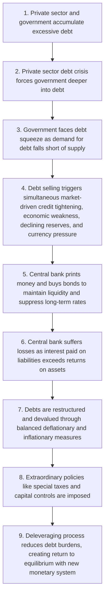
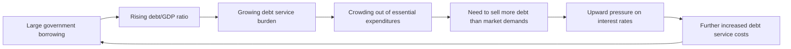
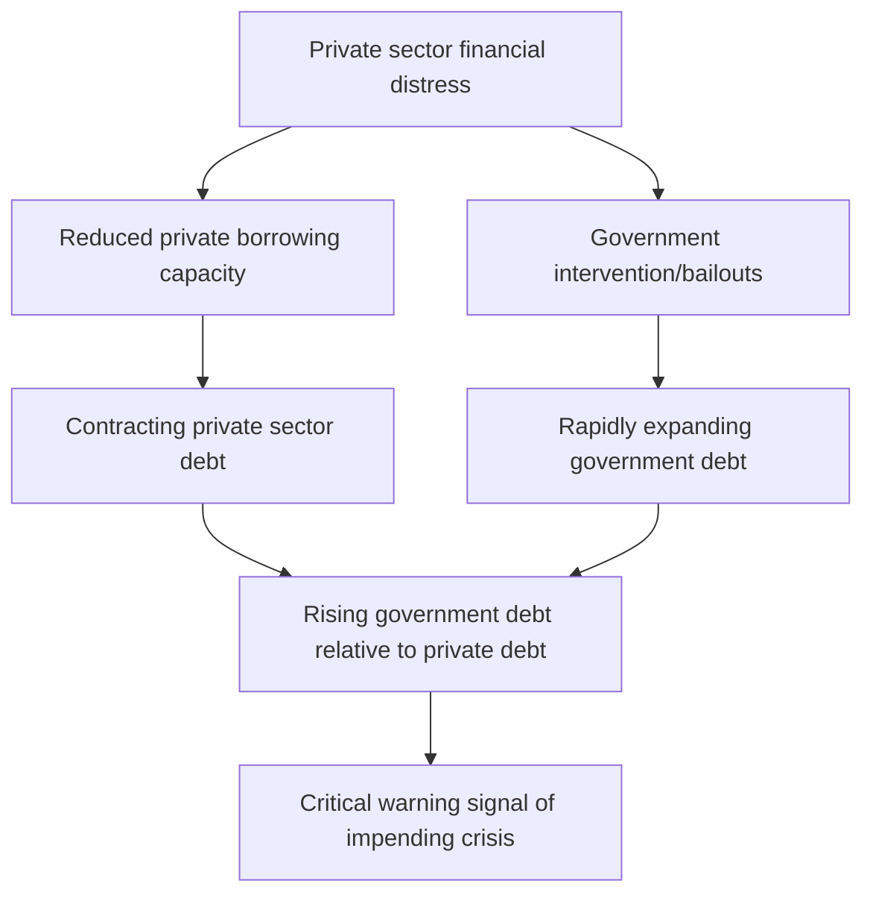
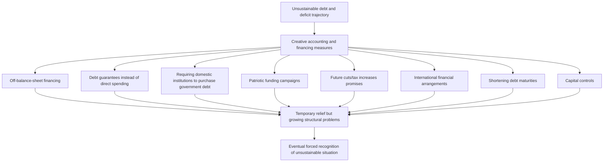
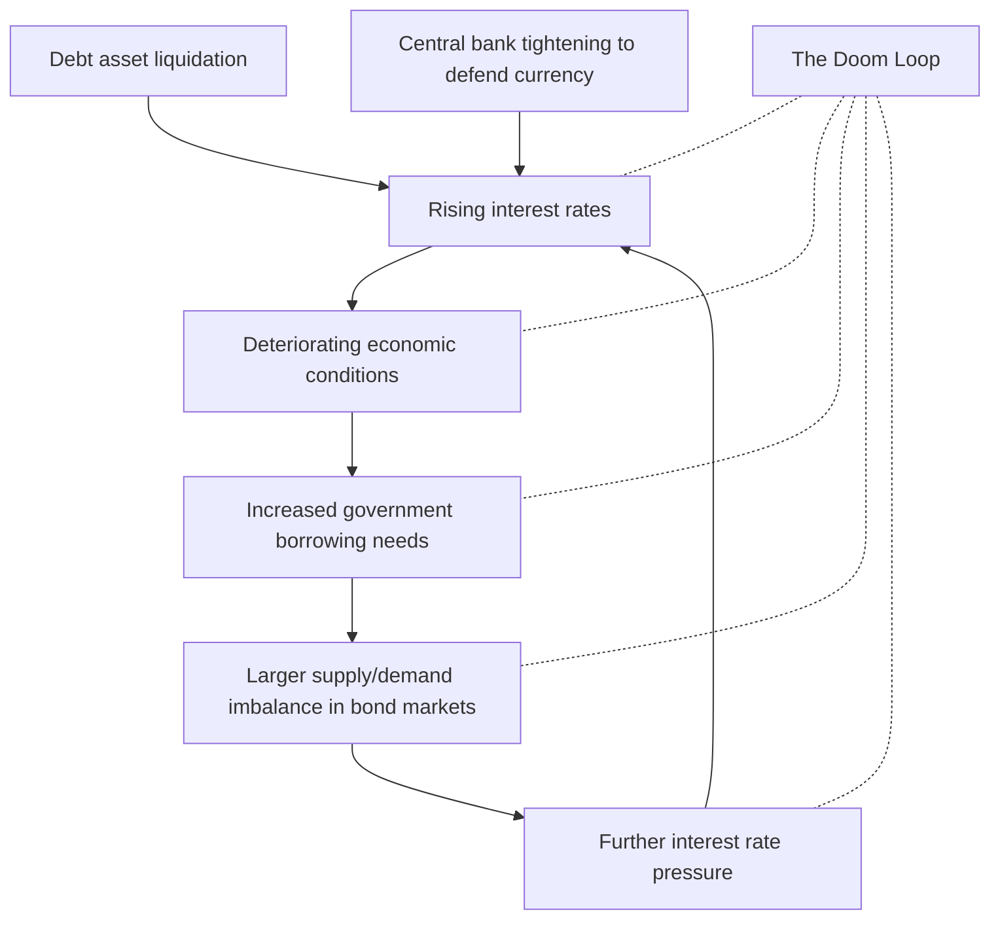

# Part 2: The Archetypical Sequence Leading to Central Governments and Central Banks Going Broke

_Throughout history, [[How Countries Go Broke - Chapter 4 & Chapter 5|central governments]] and central banks have repeatedly followed similar paths to financial ruin—a pattern that remains insufficiently understood despite its recurrence. This section illuminates this [[How Countries Go Broke-Chapter 8 to Chapter 11|archetypical sequence]], offering a comprehensive template of the typical case alongside analysis of the two principal variants: (1) crises involving debt denominated in currencies the country's central bank can print, and (2) those involving debt denominated in currencies beyond the central bank's printing capacity. After establishing this foundational framework, Part 3 will examine how the current [[How Countries Go Broke - Chapter 2 & Chapter 3|Big Cycle]], from 1944 to the present, has unfolded relative to this timeless template._

## Chapter 4: The Archetypical Sequence

**My examination of 65 major debt crises over the last century—with particular focus on 35 cases where [[How Countries Go Broke - Chapter 4 & Chapter 5|central governments]] and/or central banks became insolvent—has yielded a comprehensive understanding of these systemic failures. What follows is the archetypical process, delving into the granular mechanics of events both preceding and following governmental financial collapse. While this section provides crucial detailed insights into how the template manifests in actual economic dynamics, readers seeking a more concise [[Overview of Financial Markets|overview]] may focus on the bolded text and determine whether to explore the nuances further.**

Before exploring the typical sequence, we must first understand a critical factor that fundamentally shapes how these crises unfold: the distinction between hard money and fiat money systems.

### Hard Money Versus Fiat Money

**Debt crises throughout history manifest in two fundamental variants with distinct behavioral patterns. The first type—hard [[Forwards and Futures Notes|currency]] cases—occurs when governments commit to delivering money they cannot create themselves (gold, silver, or another relatively stable [[Forwards and Futures Notes|currency]] like the dollar). Historically, when acquiring these hard currencies to service debts became challenging, governments almost invariably abandoned their promises, triggering immediate, substantial devaluation of both their [[Forwards and Futures Notes|currency]] and debt obligations denominated in it.**

**Following this breach of promise, assuming they don't revert to a hard [[Forwards and Futures Notes|currency]] standard, these economies transition to what economists call a [[How Countries Go Broke - Chapter 4 & Chapter 5|fiat monetary system]], wherein [[Forwards and Futures Notes|currency]] value derives from public confidence and incentives established by central banks.** This pivotal shift for most world currencies began on August 15, 1971—a date etched in my memory from my time clerking on the New York Stock Exchange floor. This transformation echoed a similar transition from April 1933, prompting me to study these historical parallels and their operational mechanisms.

**In fiat monetary systems, central banks deploy [[Interest Rate Quotations|interest rates]], debt monetization capabilities, and monetary supply management to incentivize lenders to extend credit and maintain debt assets.** Throughout history, these institutions, like their counterparts operating under hard [[Forwards and Futures Notes|currency]] regimes, have consistently generated excessive debt—creating claims that individuals believe can be exchanged for money with purchasing power. This leads to identical credit-debt dynamics: governments create or permit their private sectors to accumulate unsustainable debt levels, eventually [[Inflationary Depressions and Currency Crises|printing money]] to facilitate repayment, which devalues the [[Forwards and Futures Notes|currency]] and drives [[War Economies and Hyperinflation|inflation]]. The key distinction with fiat [[Forwards and Futures Notes|currency]] cases is that devaluation occurs gradually rather than as an abrupt event when government promises regarding hard money conversion are broken.

The Bank of Japan provides a compelling contemporary illustration of this process through its aggressive debt monetization policies and maintenance of exceptionally [[The Economist Time Is Cheap|low interest rates]], which has significantly devalued both its [[Forwards and Futures Notes|currency]] and yen-denominated debt. Since early 2013, Japanese government bond holders have suffered losses of 60% relative to gold, 45% compared to US dollar debt, and 6% in domestic purchasing power (with average annual [[War Economies and Hyperinflation|inflation]] at 1%). This devaluation occurred gradually due to the yen's status as a fiat [[Forwards and Futures Notes|currency]], but fundamentally stemmed from the same cause that would have triggered devaluation under a hard [[Forwards and Futures Notes|currency]] regime—excessive debt requiring monetization.

**Throughout this chapter, three trend lines will appear in our analytical charts—a bold central line representing all cases (both hard and fiat currencies combined), flanked by two lighter lines showing average outcomes for hard [[Forwards and Futures Notes|currency]] cases and fiat [[Forwards and Futures Notes|currency]] cases separately. For simplicity, I'll generally reference the aggregate line in my explanations.**

It's worth noting that major historical cycles typically feature [[Forwards and Futures Notes|currency]] regimes oscillating between hard and fiat systems, as each eventually produces extreme consequences necessitating a shift toward the opposite approach. Hard [[Forwards and Futures Notes|currency]] regimes collapse through significant devaluations when governments fail to align debt growth with monetary constraints, while fiat systems deteriorate as confidence in money/debt as a reliable store of value erodes.

### Nine Stages of the Final Crisis

In the [[Squam Lake Group Introduction|introduction]], I outlined the complete archetypical [[US Debt Crisis and Adjustment 1928-1937|debt cycle]]. Now I'll focus specifically on the final phase of the [[How Countries Go Broke Introduction & Chapter 1|Big Debt Cycle]]—when both central government and central bank face insolvency. This terminal phase typically unfolds across nine distinct stages. While this sequence represents the archetypal pattern, significant variations exist in both manifestation and timing, and events don't necessarily follow precisely this order. These elements can be understood as the pathological conditions leading to crisis and the typical remedial measures implemented to resolve it. The more extensively these unhealthy conditions manifest, the greater the risk of a "cardiac arrest" scenario where both central government and central bank become insolvent.

Nations experience financial collapse for numerous reasons—chronic deficit spending and debt accumulation, costly military conflicts, devastating shocks like natural disasters or pandemics, or various combinations thereof. Regardless of initial causes, the following checklist serves as a [[10. Other Topics in Quantitative Finance|risk assessment]] framework; the more unhealthy conditions present, the higher the probability of a debt/[[Forwards and Futures Notes|currency]] crisis. Here is the sequence that typically characterizes the final stages of the [[How Countries Go Broke Introduction & Chapter 1|Big Debt Cycle]]:

1. **The private sector and government become heavily indebted.** This excessive [[Lecture 6-Leverage, Tail Risk, Volatility Products|leverage]] creates fundamental structural vulnerabilities throughout the economy.
    
2. **A [[US Debt Crisis and Adjustment (2007–2011)|debt crisis]] emerges in the private sector, compelling the central government to assume greater debt burdens to support struggling private entities.** The government's superior ability to access credit makes it the default crisis responder.
    
3. **The central government experiences a debt squeeze where market demand for its debt cannot match supply. This creates a fundamental debt sustainability problem. At this juncture, we observe either: a) policy adjustments that rebalance money and credit supply with demand, or b) self-reinforcing debt liquidation that reduces debt and [[Notes on Currency Swaps|debt service]] relative to income. Significant net selling of [[Global Fixed Income Markets|government debt]] represents the most critical warning signal.**
    
4. **The liquidation of [[Global Fixed Income Markets|government debt]] simultaneously triggers: a) market-driven contraction of money and credit, b) economic deterioration, c) diminishing savings/reserves, and d) downward [[Forwards and Futures Notes|currency]] pressure. Because this tightening proves excessively damaging to economic activity, central banks typically ease credit conditions while accepting [[Forwards and Futures Notes|currency]] devaluation. This stage manifests visibly in market dynamics—[[The Economist Margin Call of the Wild|long-term interest rates]] (particularly bonds) rise faster than [[Volatility and Convexity|short-term rates]] while the [[Forwards and Futures Notes|currency]] simultaneously weakens.**
    
5. **When facing debt crises with limited interest rate flexibility (e.g., at the zero lower bound), central banks create money to purchase bonds, maintaining low long-term rates and easing credit conditions to facilitate debt servicing. This doesn't involve literal money printing but rather borrowing reserves from commercial banks at short-term [[Interest Rate Quotations|interest rates]]—creating problems if debt selling and interest rate increases persist.**
    
6. **If selling continues and rates rise further, the central bank incurs losses when interest paid on liabilities exceeds [[Assets|returns]] on debt assets purchased. While notable, this doesn't constitute a critical warning until the central bank develops substantial negative net worth, necessitating additional money creation to cover [[Preview of the Book|cash flow]] shortfalls. This represents a pivotal warning sign, indicating the central bank's "death spiral"—rising rates create problems visible to creditors, who then avoid debt assets, driving rates higher or forcing more money printing, devaluing the [[Forwards and Futures Notes|currency]], triggering additional asset and [[Forwards and Futures Notes|currency]] selling, and so forth. This constitutes what I define as central bank insolvency. While the central bank doesn't technically default due to its money-creation ability, large-scale money printing devalues the [[Forwards and Futures Notes|currency]], generating inflationary recessions or depressions.**
    
7. **Debt undergoes restructuring and devaluation. When managed optimally, fiscal and monetary policymakers execute what I term a "beautiful deleveraging"—balancing deflationary debt reduction methods (restructuring) with inflationary approaches (monetization) to achieve deleveraging without unacceptable levels of either deflation or [[War Economies and Hyperinflation|inflation]].**
    
8. **During these periods, extraordinary measures such as exceptional taxation and capital controls become commonplace.**
    
9. **The deleveraging process inevitably reduces debt burdens, reestablishing equilibrium. One way or another, debt and [[Notes on Currency Swaps|debt service]] levels realign with available income. Frequently, inflationary depressions devalue debt, government reserves increase through asset sales, and a transition from rapidly depreciating [[Forwards and Futures Notes|currency]] to relative stability occurs by linking the [[Forwards and Futures Notes|currency]] to hard currencies or assets (e.g., gold), while simultaneously restructuring government and private sector finances for sustainability. Early in this phase, substantial rewards for holding the [[Forwards and Futures Notes|currency]] and its denominated debt—coupled with penalties for indebtedness—become essential to reestablish monetary and credit credibility by benefiting lender-creditors and disadvantaging borrower-debtors. This phase demands temporarily tight monetary conditions and elevated [[Real Interest Rates and Aggregate Production|real interest rates]]. Eventually, supply and demand for money, credit, debt, spending, and savings rebalance. The specific manifestation largely depends on whether debt is denominated in a [[Forwards and Futures Notes|currency]] the central bank can create and whether debtors and creditors are primarily domestic, giving authorities greater flexibility. These factors determine whether the process proves relatively manageable or exceptionally painful. Additionally, [[How Countries Go Broke-Chapter 15 & Chapter 16|reserve currency status]] significantly impacts outcomes, as widely-used reserve currencies attract greater marginal demand. Historically, however, governments with reserve currencies have frequently abused this privilege through excessive borrowing, ultimately sacrificing this advantage and experiencing more abrupt, severe declines.**
    

In subsequent chapters, I'll illustrate these dynamics through comprehensive [[Mastering Data Analytics with Matplotlib in Python|data visualization]] and analysis.

## Chapter 5: The Private Sector and Central Government Debt Crisis (Stages 1-4)

**Having outlined the [[How Countries Go Broke-Chapter 8 to Chapter 11|archetypical sequence]] across crises in Chapter 4, I now delve deeper into each phase—illuminating the specific indicators and dynamics observed in historical cases. The following analysis presents these patterns through [[Mastering Data Analytics with Matplotlib in Python|data visualization]] accompanied by concise explanations. In each chart, the dark blue line represents the average across all cases, while the thin red line shows fixed exchange rate cases, and the thin green line depicts fiat-variable exchange rate cases.**

These patterns manifest more distinctly in fixed exchange rate systems (where pressures intensify before a clear breaking point) than in fiat [[Forwards and Futures Notes|currency]] cases (where adjustments occur more gradually). Fixed rate systems allow visible pressure accumulation until a definitive rupture, whereas variable exchange rate systems exhibit more incremental shifts.

### Stage 1: The private sector and government get deep in debt.

This initial stage manifests through several characteristic patterns:

- In the years preceding crisis, governments typically exhibit **large, growing debt stocks** resulting from persistent deficit spending. We commonly observe **increasing allocation of expenditures toward consumption/social welfare and declining [[An Asset Allocation Primer|investment]] in productivity-enhancing initiatives**, causing debt to grow without proportional income increases. Many countries become so dependent on extensive social safety nets that reducing them becomes politically untenable (as currently observed in Brazil and the United States).
    
- **Debt levels typically reach unsustainable heights relative to the government's tax revenue capacity, with [[Notes on Currency Swaps|debt service]] burdens crowding out other essential expenditures**. This necessitates selling more debt than private markets willingly absorb, creating upward pressure on [[Interest Rate Quotations|interest rates]] and further increasing [[Notes on Currency Swaps|debt service]] costs. Note the significant divergence between floating and fixed rate currencies following the crisis inflection point. This reflects the more severe, definitive [[Class Slide 4-Restructuring Debt Outside Bankruptcy|debt restructuring]] in fixed exchange cases, establishing conditions for more abrupt, substantial recovery. Fiat systems display gradual debt increases as [[How Countries Go Broke-Chapter 12 to Chapter 14|central bank monetization]] enables continued or even accelerated government spending.
    

 ![[[Notes on Currency Swaps|Debt service]] burdens](https://media.licdn.com/dms/image/v2/D4E12AQG_00bVHaMA_g/article-inline_image-shrink_1500_2232/article-inline_image-shrink_1500_2232/0/1737145658094?e=1749686400&v=beta&t=IFL22zRmi00c8o5qkOQ5oZf_NNdkIFAjnHoxYU0Y0oU)

- The charts below illustrate typical government borrowing patterns (both total and excluding interest payment coverage) preceding devaluation. In 31 of 35 studied cases, we observed **persistent, substantial government deficits** entering the crisis period.

- It's important to recognize that public sector balance sheets sometimes appear less problematic than reality. This occurs when **private sector borrowing requires public sector backing or when implicit government guarantees exist for systemically important institutions like banks**. These situations effectively represent contingent public sector liabilities.

- **The accumulation of debts typically necessitates substantial foreign lending**, whether denominated in domestic [[Forwards and Futures Notes|currency]] (increasing devaluation risk) or reserve currencies (increasing [[Default Risk and Credit Derivatives 183|default risk]]). This creates vulnerability to foreign capital withdrawal. However, current account deficits don't inherently signal problems—they can reflect capital inflows into attractive markets. The vulnerability arises when deteriorating conditions prompt rapid foreign selling of domestic assets. As illustrated below, progressively increasing current account and twin deficits typically precede crises by several years. When crisis manifests through significant devaluation and contraction of debt-financed demand (including imports), these deficits typically diminish.

 

- **Years of substantial foreign borrowing creates accumulated external debt**, heightening vulnerability to foreign capital retrenchment. The charts below depict the total net international [[An Asset Allocation Primer|investment]] position (foreign assets minus foreign liabilities) and an adjusted metric showing available liquid assets relative to external [[Notes on Currency Swaps|debt service]] obligations. By the devaluation point, countries typically possess minimal liquid assets to fulfill external debt obligations.

![Net international [[An Asset Allocation Primer|investment]] position](https://media.licdn.com/dms/image/v2/D4E12AQF7fBEPimpkBA/article-inline_image-shrink_1500_2232/article-inline_image-shrink_1500_2232/0/1737145796769?e=1749686400&v=beta&t=LYzHP-pZGCwGmkXCkBlzAYXjLv3aQkZt6Zp9MkCADsw) 

### Stage 2: The private sector suffers a debt crisis, and the central government gets deeper in debt to help the private sector.

This stage typically transforms moderately stretched government balance sheets into severely stressed ones as authorities intervene to address private sector [[Southland Corp. (c)|financial distress]]:

**When private entities face [[Deciphering the Liquidity and Credit Crunch 2007–2008|financial turmoil]], governments typically assume larger economic roles due to their superior ability to access funding compared to distressed private sectors.** During financial stress, government borrowing capacity exceeds private sector access because markets recognize governments' taxation authority and (for those with domestic [[Forwards and Futures Notes|currency]] debt) central banks' ability to create money. This advantage is particularly pronounced for governments issuing well-established reserve currencies, which enjoy substantial global demand.

Consequently, when credit conditions deteriorate and governments must intervene, public debt typically accelerates while private sector [[Lecture Note 1- Debt Pricing|debt contracts]]. As shown below, [[Global Fixed Income Markets|government debt]] levels typically surge while private sector debt plummets approximately one year before crisis, with [[Global Fixed Income Markets|government debt]] rising substantially relative to private debt. This pattern appeared in 15 of 21 cases with comprehensive public and private sector balance sheet data. Concurrent sharp private debt contraction and [[Global Fixed Income Markets|government debt]] expansion represents a critical leading indicator of impending trouble.

![[[Global Fixed Income Markets|Government debt]] surge vs. private debt contraction](https://media.licdn.com/dms/image/v2/D4E12AQH5BJ_9ztCgSg/article-inline_image-shrink_1500_2232/article-inline_image-shrink_1500_2232/0/1737145824127?e=1749686400&v=beta&t=yMd-N-1bN8AuKQNyAD22y4ovHBrAj_l4vrMTgfnCKS0) ![Rising [[Global Fixed Income Markets|government debt]] relative to private debt](https://media.licdn.com/dms/image/v2/D4E12AQGPNyuoBx8dZA/article-inline_image-shrink_1500_2232/article-inline_image-shrink_1500_2232/0/1737145833339?e=1749686400&v=beta&t=bQ5549bEo3F95uUbhnIrD-auf8oBphYoPpEYBY-_T8Y)

**At this juncture, [[Global Fixed Income Markets|government debt]] challenges typically intensify.** Additional metrics illustrating this progression appear below.

**[[Global Fixed Income Markets|Government debt]] expands relative to: 1) revenue streams, 2) available hard assets for debt repayment (primarily reserves), and 3) monetary supply available for [[Contemporary Financial Intermediation Notes|debt financing]]** (until the central bank eventually introduces additional money and credit).

![[[Global Fixed Income Markets|Government debt]] relative to key metrics](https://media.licdn.com/dms/image/v2/D4E12AQHM1YTRx4Kisg/article-inline_image-shrink_1500_2232/article-inline_image-shrink_1500_2232/0/1737145864288?e=1749686400&v=beta&t=iJvFTF2ondsPbkL0-Yrsu5MqyswfCQLDgiQ6_n_oZRY)

### Stage 3: The central government experiences a debt squeeze in which the free-market demand for its debt falls short of the supply of it.

**[[How Countries Go Broke - Chapter 4 & Chapter 5|Central governments]] encounter [[Southland Corp. (c)|financial distress]] when: 1) debt and [[Notes on Currency Swaps|debt service]] expenses constrain essential spending capacity and 2) debt asset holders begin liquidating positions. This creates upward interest rate pressure, further increasing [[How Countries Go Broke-Chapter 6 & Chapter 7|government financing]] costs and necessitating either painful spending reductions or additional borrowing to cover these expenses.**

More specifically, when [[Notes on Currency Swaps|debt service]] consumes an excessive proportion of income (approaching 100%), it signals danger by indicating either: a) substantial crowding out of other expenditures and/or b) requiring significant borrowing and debt rollovers that may prove unsustainable as lender-creditors recognize the situation and either refuse to lend or liquidate existing debt holdings. Eventually in the long-term [[US Debt Crisis and Adjustment 1928-1937|debt cycle]], [[Notes on Currency Swaps|debt service]] becomes so burdensome relative to income that it either displaces other spending (because borrowing cannot sufficiently mitigate the squeeze) or creates substantial demand shortfalls. In 25 of 35 studied cases, [[Global Fixed Income Markets|government debt]] service as a percentage of government revenue accelerated approaching the crisis.

![[[Global Fixed Income Markets|Government debt]] service relative to revenue](https://media.licdn.com/dms/image/v2/D4E12AQGwO69zJKV8Zw/article-inline_image-shrink_1500_2232/article-inline_image-shrink_1500_2232/0/1737145878811?e=1749686400&v=beta&t=3sLY6kn9DcyEDFqANLz5JuHU0-MVRqm_UHrHO0fq-94)

- **Given accumulated [[Global Fixed Income Markets|government debt]] burdens (and ongoing deficits addressing private sector weakness), debt and [[Notes on Currency Swaps|debt service]] obligations typically follow an unsustainable trajectory.** The charts below illustrate the average projected path of [[Global Fixed Income Markets|government debt]] and interest expenses at devaluation across historical cases. At the eventual devaluation point, governments typically faced indefinitely increasing debt and [[Notes on Currency Swaps|debt service]] absent debt devaluation.

![Projected [[Global Fixed Income Markets|government debt]] trajectory](https://media.licdn.com/dms/image/v2/D4E12AQEK8H0In6CNYA/article-inline_image-shrink_1500_2232/article-inline_image-shrink_1500_2232/0/1737145901810?e=1749686400&v=beta&t=kL1ZIR0rZ3IdN9bny5vvOY0xCY_8bV_hxuX9UdJjmWU)

While this hasn't yet materialized in the United States, trends suggest movement in this direction. Regarding Europe, Japan, and China, government interest service in these regions approximates half the US level as a percentage of GDP—Europe and China due to lower [[Global Fixed Income Markets|government debt]] (though other sectors carry higher debt), and Japan due to historically [[The Economist Time Is Cheap|low interest rates]]. However, conditions can rapidly change, particularly in Japan where extremely high [[Global Fixed Income Markets|government debt]] (approximately 215% of GDP) could become problematic if refinanced at higher rates. As we'll examine later, Japan's massive [[Global Fixed Income Markets|government debt]], extensive Bank of Japan bond purchases, and artificially suppressed [[Interest Rate Quotations|interest rates]] have produced poor [[Global Fixed Income Markets|government debt]] [[Some Stylized Empirical Facts About Asset Retur|asset returns]] due to both minimal yields and [[Inflationary Depressions and Currency Crises 1|currency depreciation]].

Confronting unsustainable debt burdens and financing requirements, governments typically pursue measures to obscure issues and identify creative financing sources, including accounting manipulations:

1. **Utilizing policy and development banks for off-balance-sheet financing** (common in Asian crises, including Japan and during the Asian [[Squam Lake Group Letter|financial crisis]]).
    
2. **Employing debt guarantees instead of direct expenditures** (Peru 1980s, Turkey recently). Governments guarantee certain debt categories, encouraging borrowing without immediate budget impact until losses materialize, creating a deceptive appearance of fiscal neutrality. In 2017, Turkey introduced a [[The Workout Crew|business loan]] [[Temp MMF Guarantee 2008|guarantee program]] amid [[The Balance of Payments|balance of payments]] pressures.
    
3. **Requiring or incentivizing domestic institutions—particularly banks, pension funds, and insurers—to finance government operations** (recent examples in Turkey and Brazil). This sometimes involves favorable regulatory treatment of [[Global Fixed Income Markets|government debt]] (classifying risky instruments as risk-free) or yield curve and financing rate manipulation to enhance attractiveness (US during World War II), effectively constituting backdoor monetary financing by encouraging [[Financial Markets and Institutions Lecture Notes|financial institutions]] to [[Lecture 6-Leverage, Tail Risk, Volatility Products|leverage]] short-term funding for government lending.
    
4. **Organizing patriotic campaigns encouraging public funding of government operations** (recent Turkish appeals for dollar-to-lira conversion, World War II government bond promotion, Korea's relatively successful 1990s campaign soliciting gold contributions for IMF repayment).
    
5. **"Financing" increased expenditures with future cuts and tax increases that may never materialize** (Brazil's recent constitutional spending limitation amendment with numerous exceptions).
    
6. **Leveraging international creditor relationships and/or arranging geopolitical financing deals** (recent Turkish efforts, UK's Sterling Area establishment after World War II).
    
7. **Shortening debt maturities** since lenders typically prefer shorter lending periods during uncertainty (elaborated below).
    
8. **Implementing capital controls** to prevent capital flight, common in severe situations.
    

### Stage 4: The selling of the government's debt leads to market-driven tightening, economic weakness, currency pressure, and declining reserves.

**These developments typically accelerate investors' and savers' exodus from the country's assets, bringing the [[Forwards and Futures Notes|currency]] and debt run to a critical juncture. Typically, the central bank attempts to defend the [[Forwards and Futures Notes|currency]] through monetary tightening and reserve liquidation but ultimately abandons this approach due to tightening's severe economic consequences and insufficient reserves.**

A significant warning sign emerges when debts grow excessively relative to the income required for servicing, reaching levels where sophisticated investors recognize inevitable losses (through either default or substantial money creation, [[Inflationary Depressions and Currency Crises|currency weakness]], and [[War Economies and Hyperinflation|inflation]] to depreciate debts without technical default).

When lender-creditors lose confidence in adequate repayment (whether through insufficient [[Notes on Currency Swaps|debt service]] or inadequate [[War Economies and Hyperinflation|inflation]] compensation), market demand for debt diminishes relative to selling pressure, forcing debt prices down (and [[Interest Rate Quotations|interest rates]] up) until borrowing decreases or saving increases.

During periods of geopolitical tension or conflict, these dynamics intensify due to heightened risks of sanctions (asset confiscation), excessive borrowing, default, and devaluation. These conditions can trigger the "doom loop"—where interest rate pressure weakens economic activity and increases government borrowing requirements, creating larger supply/demand imbalances in bond markets and generating additional interest rate pressure. This necessitates [[How Countries Go Broke-Chapter 6 & Chapter 7|central bank intervention]] through money creation and debt purchases—[[Negative Rates and Qe in Europe and Japan|quantitative easing]] (QE).

As shown below, these periods typically feature simultaneous declines in foreign inflows for local bond purchases, both government and corporate (left chart), alongside spiking [[Real Interest Rates and Aggregate Production|real interest rates]] during classical failed [[Forwards and Futures Notes|currency]] defense attempts through monetary tightening.

During these periods, governments frequently shorten issuance maturities to enhance market palatability.

When market participants recognize approaching limitations, selling accelerates, exacerbating supply/demand imbalances. Central banks then face a dilemma: a) permit [[Interest Rate Quotations|interest rates]] to rise sufficiently to curtail borrowing and redirect capital toward government lending by diverting resources from other investments, or b) create money and purchase debt to address demand shortfalls. Historical evidence and logical analysis indicate central banks invariably select option b) over a), with optimal approaches balancing both strategies. When selling intensifies sufficiently to drive [[War Economies and Hyperinflation|inflation]] amid economic weakness, central banks face an impossible choice—money creation and debt purchases exacerbate [[Inflationary Depressions and Currency Crises 1|currency depreciation]] and [[War Economies and Hyperinflation|inflation]], while restraint produces extremely tight monetary conditions, prohibitively high [[Interest Rate Quotations|interest rates]], and severe economic contraction.

This dynamic materializes when [[Notes on Currency Swaps|debt service]] burdens become unsustainable for borrower-debtors and/or lender-creditors lose interest in debt holdings (typically due to inadequate real [[Assets|returns]], perceived [[Default Risk and Credit Derivatives 183|default risk]], and/or concerns about extensive money creation devaluing assets). When these conditions converge, [[Global Fixed Income Markets|government debt]] values spiral downward until reaching equilibrium through sufficient debt destruction or devaluation to bring debt burdens within manageable parameters.

The United States, Europe, Japan, and China have not yet reached this point.

**Below, we examine these dynamics in greater detail.**

- **Monetary tightening and/or [[Forwards and Futures Notes|currency]] intervention attempts to defend the [[Forwards and Futures Notes|currency]] ultimately fail due to excessive economic damage and intervention costs, resulting in [[Forwards and Futures Notes|currency]]/debt devaluation.**

This situation becomes untenable when investors and savers recognize developing conditions and logically abandon the country's assets and [[Forwards and Futures Notes|currency]], anticipating substantial purchasing power losses. This accelerates the crisis by intensifying pressure for central bank tightening despite potentially devastating economic consequences. **Several advanced-stage warning indicators include:**

- **[[Interest Rate Quotations|Interest rates]] rise due to debt asset liquidation and central bank tightening attempts to defend the [[Forwards and Futures Notes|currency]].** Given depressed [[US Debt Crisis and Adjustment (2007–2011)|economic conditions]], such real interest rate increases prove unsustainable by excessively straining already weak economies and governments facing debt spirals without interest rate relief.

![Rising [[Interest Rate Quotations|interest rates]]](https://media.licdn.com/dms/image/v2/D4E12AQHhJsb9099rGA/article-inline_image-shrink_1500_2232/article-inline_image-shrink_1500_2232/0/1737145961291?e=1749686400&v=beta&t=41G7yHrRYcRsYuuhWxoezcAy6bW5U6lbEh35ftH0-Pk) 

- **Monetary tightening further deteriorates already weak [[US Debt Crisis and Adjustment (2007–2011)|economic conditions]]** (ultimately necessitating tightening abandonment and [[Forwards and Futures Notes|currency]] devaluation).

 

- While not universal, **[[War Economies and Hyperinflation|inflation]] typically accelerates beyond desirable levels** approaching crisis (constraining central bank easing capacity without risking unacceptable [[War Economies and Hyperinflation|inflation]]).

![Rising [[War Economies and Hyperinflation|inflation]]](https://media.licdn.com/dms/image/v2/D4E12AQHj-Kpu3ggW-Q/article-inline_image-shrink_1500_2232/article-inline_image-shrink_1500_2232/0/1737146029239?e=1749686400&v=beta&t=C_w-ISfYMB9Y8YVfqrgH3RQJ2vwdQQVuGHusQPA-s90)

- Economic weakness and accelerating [[War Economies and Hyperinflation|inflation]] create substantial [[Inflationary Depressions and Currency Crises 1|currency depreciation]] pressure. At this stage, fixed and floating rate cases diverge significantly. Fixed-rate regimes actively resist [[Inflationary Depressions and Currency Crises 1|currency depreciation]], even as [[War Economies and Hyperinflation|inflation]] makes currencies increasingly overvalued when devaluation becomes necessary. In floating rate scenarios, currencies gradually depreciate amid economic weakness.

![[[Inflationary Depressions and Currency Crises 1|Currency depreciation]] pressure](https://media.licdn.com/dms/image/v2/D4E12AQHnMjcnCG6tPA/article-inline_image-shrink_1500_2232/article-inline_image-shrink_1500_2232/0/1737146048841?e=1749686400&v=beta&t=QbMnG9uKqbb3tcs6u1PnEoCI3bSUMlgthJqw6YLweJg)

- For countries with hard [[Forwards and Futures Notes|currency]] debt obligations, **credit spreads widen** as markets price increasing default probability.

- **Risky assets incorporate higher risk premiums** (selling off), further pressuring economic activity.

- **During this phase, central banks typically liquidate reserves**. [[Global Fixed Income Markets|Government debt]] functions similarly to individual or [[Corporate Bonds and Loans|corporate debt]], except governments with domestically denominated debt and monetary sovereignty can create money to fulfill obligations. Like individuals and corporations, governments can accumulate savings to mitigate [[Southland Corp. (c)|financial distress]] during income shortfalls. For governments, reserves represent principal liquid savings, alongside sovereign wealth funds. Monitoring reserve size, depletion rate, and proximity to exhaustion helps identify [[US Debt Crisis and Adjustment (2007–2011)|debt crisis]] timing. Foreign [[Forwards and Futures Notes|currency]] sales and domestic [[Forwards and Futures Notes|currency]] purchases represent typical crisis interventions, constituting monetary tightening by reducing money supply. As shown below, reserve depletion characterizes this cycle stage.

- **In the most severe cases, reserves typically fall to inadequate levels relative to central bank liabilities (particularly the monetary base held by savers), limiting capacity to counter [[Forwards and Futures Notes|currency]] runs. When evident that [[Forwards and Futures Notes|currency]] defense will fail, speculative positioning against the [[Forwards and Futures Notes|currency]] and flight from its denominated debt intensify.**

The table below details historical central bank reserve interventions across cases featuring significant intervention. Key patterns include:

- **Prior to reserve intervention, countries typically maintain modest reserve buffers (averaging around 5% of GDP, covering approximately 10% of outstanding money supply and [[Global Fixed Income Markets|government debt]]).**
    
- **To counteract capital flight, central banks typically expend over half their reserves defending currencies** (reserves in global [[Forwards and Futures Notes|currency]] terms declining 62% on average). This selling often concentrates within relatively brief timeframes—during the most intense six-month intervention period, reserves typically decline 49% (median case).
    
- **Currencies typically depreciate** during defense attempts (gold appreciating 42% in median cases)—though some interventions temporarily support currencies.
    
- **After approximately two years of defense (varying by case), central banks abandon intervention.** By this point, reserves back minimal portions of the money supply (6% average) and negligible [[Global Fixed Income Markets|government debt]] (3% average). **After intervention cessation, currencies depreciate further** (gold typically rallying another 51% in median cases). Individual cases appear below.
    

![[[How Countries Go Broke-Chapter 6 & Chapter 7|Central bank intervention]] data](https://media.licdn.com/dms/image/v2/D4E12AQFYHnV0_gskMg/article-inline_image-shrink_1500_2232/article-inline_image-shrink_1500_2232/0/1737466785661?e=1749686400&v=beta&t=ToBJjf7YVD2ivcq0mLfN58xuW4I6iFnL5ZZo6s0TtLQ)  

**At this stage, the [[Forwards and Futures Notes|currency]] becomes demonstrably high-risk at minimum and potentially catastrophic at worst. This prompts not only investor exodus from debt/[[Forwards and Futures Notes|currency]] assets but frequently broader economic participants—particularly banks, corporations, and households—undertaking prudent de-risking actions away from the [[Forwards and Futures Notes|currency]] and its denominated debt.** These late-cycle dynamics manifested consistently across studied cases:

#### Corporate Treasury Actions

1. **Domestic companies retain international revenue offshore in foreign currencies** (particularly dollars), discontinuing local [[Forwards and Futures Notes|currency]] repatriation. Experiencing revenue volatility in local [[Forwards and Futures Notes|currency]] terms despite stable dollar [[Arbitrage Pricing of Derivatives|pricing]], they reconceptualize local [[Forwards and Futures Notes|currency]] as requiring [[Key Rates O1s Durations and Hedging|hedging]], contrary to traditional [[An Asset Allocation Primer|investment]] approaches.
    
2. **Domestic corporations increase local [[Forwards and Futures Notes|currency]] [[Key Rates O1s Durations and Hedging|hedging]] activities**, especially those with hard [[Forwards and Futures Notes|currency]] obligations. [[Key Rates O1s Durations and Hedging|Hedging]] involves forward contracts selling local [[Forwards and Futures Notes|currency]] against foreign [[Forwards and Futures Notes|currency]], depressing forward exchange rates and subsequently spot rates.
    
3. Similarly, **foreign corporations with domestic subsidiaries accelerate cash repatriation**.
    
4. **Companies reassess foreign subsidiary viability**—navigating [[Forwards and Futures Notes|currency]] risk, political instability, and reputational considerations renders expansion opportunities less attractive. New foreign direct [[Exercises|investment projects]] face postponement.
    

#### Domestic Bank Actions

**5. Banks forced into [[Global Fixed Income Markets|government debt]] purchases under policy mandates liquidate positions when [[Class Note 10 Liquidity and Class Note 10 Liquidity and Liquidity Managementliquidity management|liquidity]] evaporates**—accelerating debt selloffs during peak crisis periods.

**6. Central bank stimulative tactics (multiple [[Interest Rate Quotations|interest rates]], capital controls) inadvertently incentivize offshore capital retention over domestic deployment.** Domestic banks and corporations [[Lecture 6-Leverage, Tail Risk, Volatility Products|leverage]] positioning to facilitate [[Characteristics of the Eurodollar Market|offshore markets]]. Even maintaining [[Forwards and Futures Notes|currency]] denomination, capital flight from domestic [[HKS The Banking Industry|banking]] systems often necessitates [[Global Fixed Income Markets|government debt]] liquidation.

#### International Bank Actions

**7. International lenders eliminate operationally challenging business lines**—[[HBR Case Study- Oaktree|trade financing]], working capital credit facilities, etc.

**8. They frequently divest or surrender [[HKS The Banking Industry|banking]] subsidiaries when exposure to potential losses outweighs subsidiary contributions** to parent companies (beyond operational complications).

#### Large International Investor Actions

9. Paradoxically, despite borrowing expansion, increasingly captive institutions (e.g., banks) hold larger proportions while dollar-denominated asset values decline. **[[Class Note 10 Liquidity and Class Note 10 Liquidity and Liquidity Managementliquidity management|Liquidity]] deterioration drives large foreign investors from markets given institutional aversion to [[Class Note 10 Liquidity and Class Note 10 Liquidity and Liquidity Managementliquidity management|illiquid assets]]**.

**10. Major government reserve holders initiate [[Foreign Exchange Reserves|currency diversification]], frequently influenced by geopolitical considerations**.

11. Large international reserve allocators often cannot liquidate positions without disruptive market impacts. Instead, **reserve managers allocate all new reserves to alternative currencies**—eliminating demand.
    
12. Similarly, international investors facing illiquid markets **discontinue position rollovers**.
    

These foreign capital outflows typically precede devaluation events.

#### Domestic Saver Actions

**13. Domestic savers pursue diversification, increasingly allocating toward [[War Economies and Hyperinflation|inflation]]-hedge assets.** **They convert bank deposits to hard currencies**, requiring banks to sell local [[Forwards and Futures Notes|currency]] against foreign currencies.

**14. Individuals purchase physical goods anticipating [[War Economies and Hyperinflation|inflation]] acceleration.** Since these often include imports, [[Forwards and Futures Notes|currency]] selling intensifies, further fueling [[War Economies and Hyperinflation|inflation]] and exacerbating pressures.

**15. High-net-worth individuals, prioritizing wealth preservation and anticipating increased taxation or confiscation, expatriate capital.**

**16. Domestic savers increasingly view foreign equities as more reliable investments.** Financial innovation facilitates access to these markets.

**17. Foreign bank account establishment appears prudent as domestic institutions face mounting challenges.** These institutions simplify [[Forwards and Futures Notes|currency]] conversion (absent government capital controls, which frequently restrict foreign account access).

#### Traditional Speculative Trading

**18. Bond vigilante market action emerges and becomes self-reinforcing.**

**19. Equity investors withdraw from deteriorating markets, creating additional negative [[Forwards and Futures Notes|currency]] pressure.**