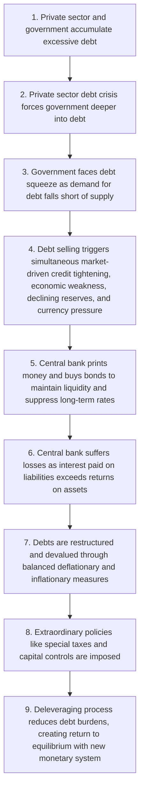
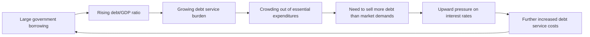
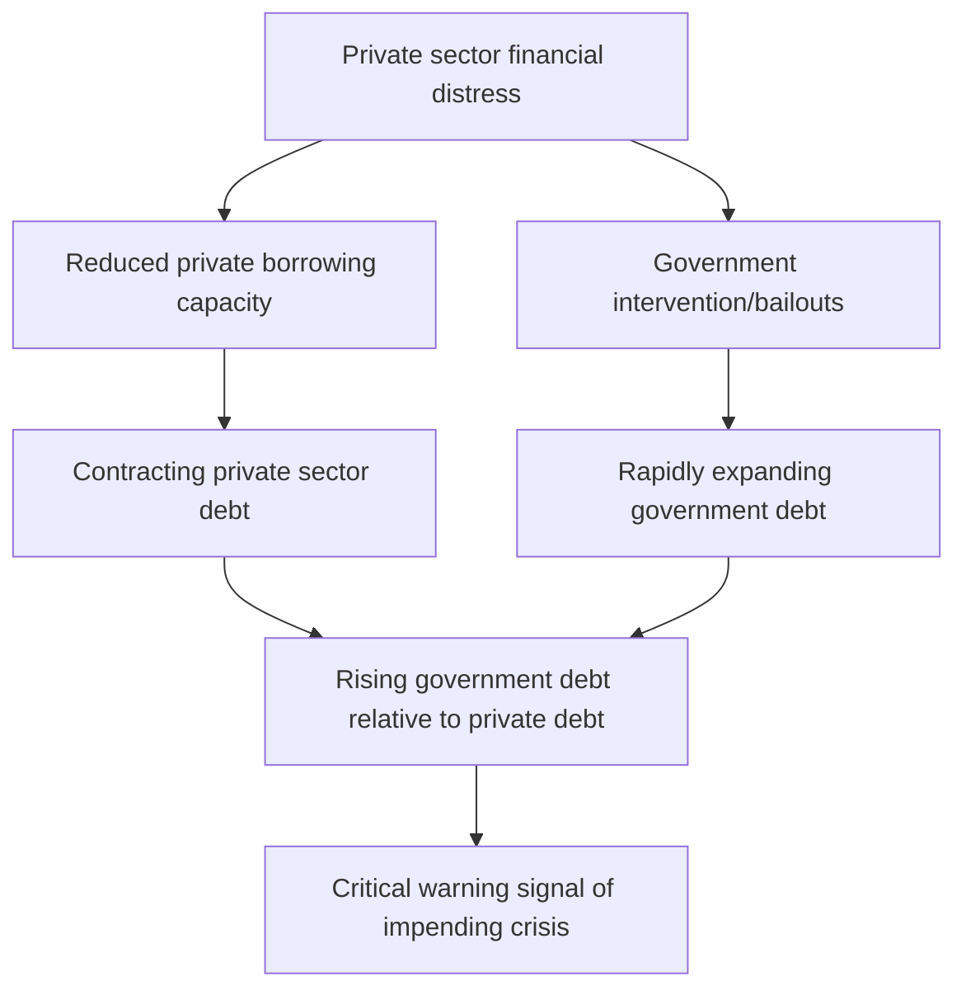
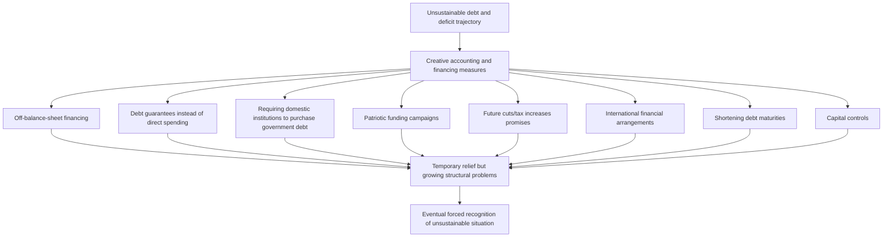
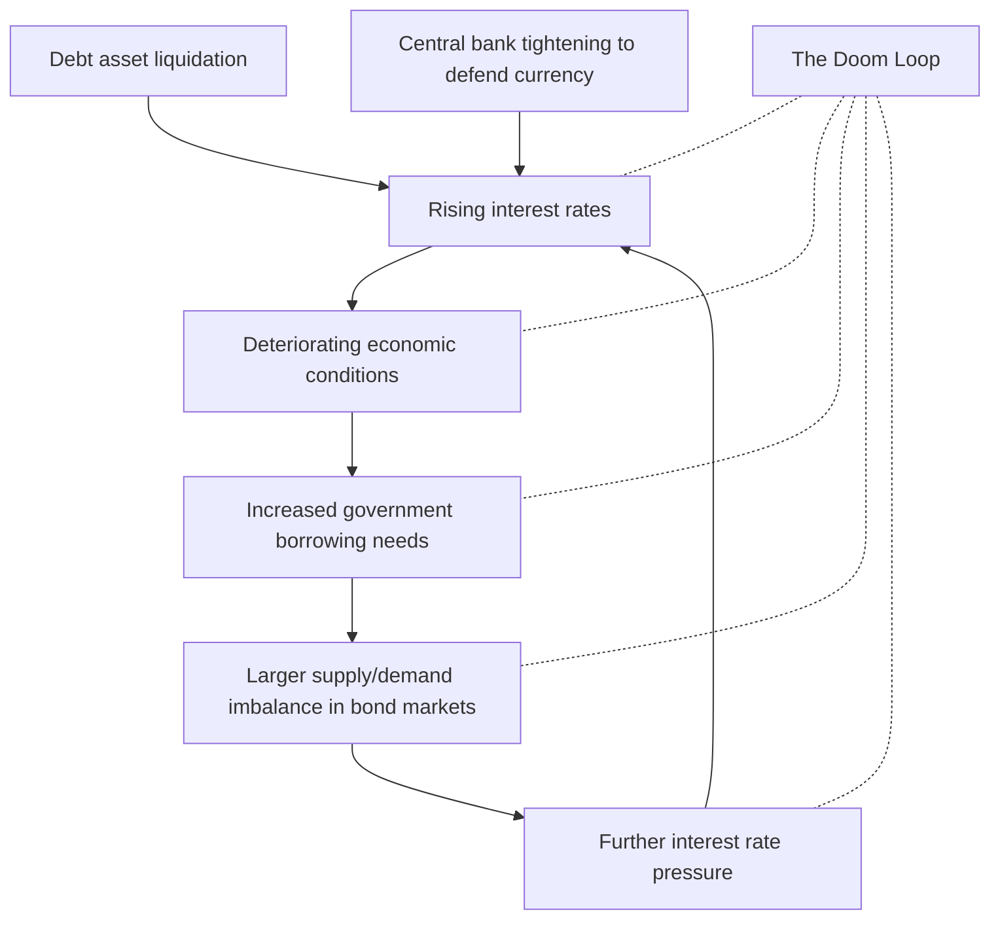

# Part 2: The Archetypical Sequence Leading to Central Governments and Central Banks Going Broke

_Throughout history, [central governments](../How%20Countries%20Go%20Broke%20-%20Chapter%204%20&%20Chapter%205.md) and central banks have repeatedly followed similar paths to financial ruin—a pattern that remains insufficiently understood despite its recurrence. This section illuminates this [archetypical sequence](../How%20Countries%20Go%20Broke-Chapter%208%20to%20Chapter%2011.md), offering a comprehensive template of the typical case alongside analysis of the two principal variants: (1) crises involving debt denominated in currencies the country's central bank can print, and (2) those involving debt denominated in currencies beyond the central bank's printing capacity. After establishing this foundational framework, Part 3 will examine how the current [Big Cycle](../How%20Countries%20Go%20Broke%20-%20Chapter%202%20&%20Chapter%203.md), from 1944 to the present, has unfolded relative to this timeless template._

## Chapter 4: The Archetypical Sequence

**My examination of 65 major debt crises over the last century—with particular focus on 35 cases where [central governments](../How%20Countries%20Go%20Broke%20-%20Chapter%204%20&%20Chapter%205.md) and/or central banks became insolvent—has yielded a comprehensive understanding of these systemic failures. What follows is the archetypical process, delving into the granular mechanics of events both preceding and following governmental financial collapse. While this section provides crucial detailed insights into how the template manifests in actual economic dynamics, readers seeking a more concise [overview](../../../../Financial%20Markets/Financial%20Engineering%20and%20Arbitrage%20in%20the%20Financial%20Markets/PART%20I%20RELATIVE%20VALUE%20BUILDING%20BLOCKS/Chapter%201%20-%20Purpose%20and%20Structure%20of%20Financial%20Markets/Overview%20of%20Financial%20Markets.md) may focus on the bolded text and determine whether to explore the nuances further.**

Before exploring the typical sequence, we must first understand a critical factor that fundamentally shapes how these crises unfold: the distinction between hard money and fiat money systems.

### Hard Money Versus Fiat Money

**Debt crises throughout history manifest in two fundamental variants with distinct behavioral patterns. The first type—hard [currency](../../../../Financial%20Instruments/Lecture%20Notes-%20Financial%20Instruments/Teaching%20Note%201-%20Forward%20Rates%20Agreement/Forwards%20and%20Futures%20Notes.md) cases—occurs when governments commit to delivering money they cannot create themselves (gold, silver, or another relatively stable [currency](../../../../Financial%20Instruments/Lecture%20Notes-%20Financial%20Instruments/Teaching%20Note%201-%20Forward%20Rates%20Agreement/Forwards%20and%20Futures%20Notes.md) like the dollar). Historically, when acquiring these hard currencies to service debts became challenging, governments almost invariably abandoned their promises, triggering immediate, substantial devaluation of both their [currency](../../../../Financial%20Instruments/Lecture%20Notes-%20Financial%20Instruments/Teaching%20Note%201-%20Forward%20Rates%20Agreement/Forwards%20and%20Futures%20Notes.md) and debt obligations denominated in it.**

**Following this breach of promise, assuming they don't revert to a hard [currency](../../../../Financial%20Instruments/Lecture%20Notes-%20Financial%20Instruments/Teaching%20Note%201-%20Forward%20Rates%20Agreement/Forwards%20and%20Futures%20Notes.md) standard, these economies transition to what economists call a [fiat monetary system](../How%20Countries%20Go%20Broke%20-%20Chapter%204%20&%20Chapter%205.md), wherein [currency](../../../../Financial%20Instruments/Lecture%20Notes-%20Financial%20Instruments/Teaching%20Note%201-%20Forward%20Rates%20Agreement/Forwards%20and%20Futures%20Notes.md) value derives from public confidence and incentives established by central banks.** This pivotal shift for most world currencies began on August 15, 1971—a date etched in my memory from my time clerking on the New York Stock Exchange floor. This transformation echoed a similar transition from April 1933, prompting me to study these historical parallels and their operational mechanisms.

**In fiat monetary systems, central banks deploy [interest rates](../../../../Financial%20Markets/Fixed%20Income%20Securities%20Tools%20for%20Today's%20Markets/Chapter%202/Interest%20Rate%20Quotations.md), debt monetization capabilities, and monetary supply management to incentivize lenders to extend credit and maintain debt assets.** Throughout history, these institutions, like their counterparts operating under hard [currency](../../../../Financial%20Instruments/Lecture%20Notes-%20Financial%20Instruments/Teaching%20Note%201-%20Forward%20Rates%20Agreement/Forwards%20and%20Futures%20Notes.md) regimes, have consistently generated excessive debt—creating claims that individuals believe can be exchanged for money with purchasing power. This leads to identical credit-debt dynamics: governments create or permit their private sectors to accumulate unsustainable debt levels, eventually [printing money](../../Chapters/Inflationary%20Depressions%20and%20Currency%20Crises.md) to facilitate repayment, which devalues the [currency](../../../../Financial%20Instruments/Lecture%20Notes-%20Financial%20Instruments/Teaching%20Note%201-%20Forward%20Rates%20Agreement/Forwards%20and%20Futures%20Notes.md) and drives [inflation](../../Principles%20For%20Navigating%20Big%20Debt%20Cycles/Part%20II%20Detailed%20Case%20Studies/German%20Debt%20Crisis%20andHyperinflation%20(1918–1924)/War%20Economies%20and%20Hyperinflation.md). The key distinction with fiat [currency](../../../../Financial%20Instruments/Lecture%20Notes-%20Financial%20Instruments/Teaching%20Note%201-%20Forward%20Rates%20Agreement/Forwards%20and%20Futures%20Notes.md) cases is that devaluation occurs gradually rather than as an abrupt event when government promises regarding hard money conversion are broken.

The Bank of Japan provides a compelling contemporary illustration of this process through its aggressive debt monetization policies and maintenance of exceptionally [low interest rates](../../../../Financial%20Markets%20and%20Institutions/III.%20Liquidity%20of%20Assets/Class%209-%20Bailouts%20and%20Bank%20Failures/Articles/The%20Economist%20Time%20Is%20Cheap.md), which has significantly devalued both its [currency](../../../../Financial%20Instruments/Lecture%20Notes-%20Financial%20Instruments/Teaching%20Note%201-%20Forward%20Rates%20Agreement/Forwards%20and%20Futures%20Notes.md) and yen-denominated debt. Since early 2013, Japanese government bond holders have suffered losses of 60% relative to gold, 45% compared to US dollar debt, and 6% in domestic purchasing power (with average annual [inflation](../../Principles%20For%20Navigating%20Big%20Debt%20Cycles/Part%20II%20Detailed%20Case%20Studies/German%20Debt%20Crisis%20andHyperinflation%20(1918–1924)/War%20Economies%20and%20Hyperinflation.md) at 1%). This devaluation occurred gradually due to the yen's status as a fiat [currency](../../../../Financial%20Instruments/Lecture%20Notes-%20Financial%20Instruments/Teaching%20Note%201-%20Forward%20Rates%20Agreement/Forwards%20and%20Futures%20Notes.md), but fundamentally stemmed from the same cause that would have triggered devaluation under a hard [currency](../../../../Financial%20Instruments/Lecture%20Notes-%20Financial%20Instruments/Teaching%20Note%201-%20Forward%20Rates%20Agreement/Forwards%20and%20Futures%20Notes.md) regime—excessive debt requiring monetization.

**Throughout this chapter, three trend lines will appear in our analytical charts—a bold central line representing all cases (both hard and fiat currencies combined), flanked by two lighter lines showing average outcomes for hard [currency](../../../../Financial%20Instruments/Lecture%20Notes-%20Financial%20Instruments/Teaching%20Note%201-%20Forward%20Rates%20Agreement/Forwards%20and%20Futures%20Notes.md) cases and fiat [currency](../../../../Financial%20Instruments/Lecture%20Notes-%20Financial%20Instruments/Teaching%20Note%201-%20Forward%20Rates%20Agreement/Forwards%20and%20Futures%20Notes.md) cases separately. For simplicity, I'll generally reference the aggregate line in my explanations.**

It's worth noting that major historical cycles typically feature [currency](../../../../Financial%20Instruments/Lecture%20Notes-%20Financial%20Instruments/Teaching%20Note%201-%20Forward%20Rates%20Agreement/Forwards%20and%20Futures%20Notes.md) regimes oscillating between hard and fiat systems, as each eventually produces extreme consequences necessitating a shift toward the opposite approach. Hard [currency](../../../../Financial%20Instruments/Lecture%20Notes-%20Financial%20Instruments/Teaching%20Note%201-%20Forward%20Rates%20Agreement/Forwards%20and%20Futures%20Notes.md) regimes collapse through significant devaluations when governments fail to align debt growth with monetary constraints, while fiat systems deteriorate as confidence in money/debt as a reliable store of value erodes.

### Nine Stages of the Final Crisis

In the [introduction](../../../../Financial%20Markets%20and%20Institutions/III.%20Liquidity%20of%20Assets/Class%209-%20Bailouts%20and%20Bank%20Failures/Squam%20Lake%20Group%20Introduction.md), I outlined the complete archetypical [debt cycle](../../Chapters/US%20Debt%20Crisis%20and%20Adjustment%201928-1937.md). Now I'll focus specifically on the final phase of the [Big Debt Cycle](../How%20Countries%20Go%20Broke%20Introduction%20&%20Chapter%201.md)—when both central government and central bank face insolvency. This terminal phase typically unfolds across nine distinct stages. While this sequence represents the archetypal pattern, significant variations exist in both manifestation and timing, and events don't necessarily follow precisely this order. These elements can be understood as the pathological conditions leading to crisis and the typical remedial measures implemented to resolve it. The more extensively these unhealthy conditions manifest, the greater the risk of a "cardiac arrest" scenario where both central government and central bank become insolvent.

Nations experience financial collapse for numerous reasons—chronic deficit spending and debt accumulation, costly military conflicts, devastating shocks like natural disasters or pandemics, or various combinations thereof. Regardless of initial causes, the following checklist serves as a [risk assessment](../../../../Financial%20Engineering/10.%20Other%20Topics%20in%20Quantitative%20Finance.md) framework; the more unhealthy conditions present, the higher the probability of a debt/[currency](../../../../Financial%20Instruments/Lecture%20Notes-%20Financial%20Instruments/Teaching%20Note%201-%20Forward%20Rates%20Agreement/Forwards%20and%20Futures%20Notes.md) crisis. Here is the sequence that typically characterizes the final stages of the [Big Debt Cycle](../How%20Countries%20Go%20Broke%20Introduction%20&%20Chapter%201.md):

1. **The private sector and government become heavily indebted.** This excessive [leverage](../../../../Advanced%20Investments/Lecture%206-Leverage,%20Tail%20Risk,%20Volatility%20Products.md) creates fundamental structural vulnerabilities throughout the economy.
    
2. **A [debt crisis](../../Chapters/US%20Debt%20Crisis%20and%20Adjustment%20(2007–2011).md) emerges in the private sector, compelling the central government to assume greater debt burdens to support struggling private entities.** The government's superior ability to access credit makes it the default crisis responder.
    
3. **The central government experiences a debt squeeze where market demand for its debt cannot match supply. This creates a fundamental debt sustainability problem. At this juncture, we observe either: a) policy adjustments that rebalance money and credit supply with demand, or b) self-reinforcing debt liquidation that reduces debt and [debt service](../../../../Financial%20Engineering/Notes%20on%20Currency%20Swaps.md) relative to income. Significant net selling of [government debt](../../../../Financial%20Markets/Fixed%20Income%20Securities%20Tools%20for%20Today's%20Markets/Front%20Matter/Global%20Fixed%20Income%20Markets.md) represents the most critical warning signal.**
    
4. **The liquidation of [government debt](../../../../Financial%20Markets/Fixed%20Income%20Securities%20Tools%20for%20Today's%20Markets/Front%20Matter/Global%20Fixed%20Income%20Markets.md) simultaneously triggers: a) market-driven contraction of money and credit, b) economic deterioration, c) diminishing savings/reserves, and d) downward [currency](../../../../Financial%20Instruments/Lecture%20Notes-%20Financial%20Instruments/Teaching%20Note%201-%20Forward%20Rates%20Agreement/Forwards%20and%20Futures%20Notes.md) pressure. Because this tightening proves excessively damaging to economic activity, central banks typically ease credit conditions while accepting [currency](../../../../Financial%20Instruments/Lecture%20Notes-%20Financial%20Instruments/Teaching%20Note%201-%20Forward%20Rates%20Agreement/Forwards%20and%20Futures%20Notes.md) devaluation. This stage manifests visibly in market dynamics—[long-term interest rates](../../../../Financial%20Markets%20and%20Institutions/III.%20Liquidity%20of%20Assets/Class%208-%20Markets,%20Meltdowns,%20and%20Arbitrage/The%20Economist%20Margin%20Call%20of%20the%20Wild.md) (particularly bonds) rise faster than [short-term rates](../../../../Financial%20Markets/Fixed%20Income%20Securities%20Tools%20for%20Today's%20Markets/Chapter%208/Volatility%20and%20Convexity.md) while the [currency](../../../../Financial%20Instruments/Lecture%20Notes-%20Financial%20Instruments/Teaching%20Note%201-%20Forward%20Rates%20Agreement/Forwards%20and%20Futures%20Notes.md) simultaneously weakens.**
    
5. **When facing debt crises with limited interest rate flexibility (e.g., at the zero lower bound), central banks create money to purchase bonds, maintaining low long-term rates and easing credit conditions to facilitate debt servicing. This doesn't involve literal money printing but rather borrowing reserves from commercial banks at short-term [interest rates](../../../../Financial%20Markets/Fixed%20Income%20Securities%20Tools%20for%20Today's%20Markets/Chapter%202/Interest%20Rate%20Quotations.md)—creating problems if debt selling and interest rate increases persist.**
    
6. **If selling continues and rates rise further, the central bank incurs losses when interest paid on liabilities exceeds [returns](../../../../Financial%20Markets/Financial%20Asset%20Pricing%20Theory%20Overview/Chapter%203%20-%20%20Assets,%20Portfolios,%20and%20Arbitrage/Assets.md) on debt assets purchased. While notable, this doesn't constitute a critical warning until the central bank develops substantial negative net worth, necessitating additional money creation to cover [cash flow](../../../../Financial%20Markets/Financial%20Engineering%20and%20Arbitrage%20in%20the%20Financial%20Markets/PART%20I%20RELATIVE%20VALUE%20BUILDING%20BLOCKS/Chapter%201%20-%20Purpose%20and%20Structure%20of%20Financial%20Markets/Preview%20of%20the%20Book.md) shortfalls. This represents a pivotal warning sign, indicating the central bank's "death spiral"—rising rates create problems visible to creditors, who then avoid debt assets, driving rates higher or forcing more money printing, devaluing the [currency](../../../../Financial%20Instruments/Lecture%20Notes-%20Financial%20Instruments/Teaching%20Note%201-%20Forward%20Rates%20Agreement/Forwards%20and%20Futures%20Notes.md), triggering additional asset and [currency](../../../../Financial%20Instruments/Lecture%20Notes-%20Financial%20Instruments/Teaching%20Note%201-%20Forward%20Rates%20Agreement/Forwards%20and%20Futures%20Notes.md) selling, and so forth. This constitutes what I define as central bank insolvency. While the central bank doesn't technically default due to its money-creation ability, large-scale money printing devalues the [currency](../../../../Financial%20Instruments/Lecture%20Notes-%20Financial%20Instruments/Teaching%20Note%201-%20Forward%20Rates%20Agreement/Forwards%20and%20Futures%20Notes.md), generating inflationary recessions or depressions.**
    
7. **Debt undergoes restructuring and devaluation. When managed optimally, fiscal and monetary policymakers execute what I term a "beautiful deleveraging"—balancing deflationary debt reduction methods (restructuring) with inflationary approaches (monetization) to achieve deleveraging without unacceptable levels of either deflation or [inflation](../../Principles%20For%20Navigating%20Big%20Debt%20Cycles/Part%20II%20Detailed%20Case%20Studies/German%20Debt%20Crisis%20andHyperinflation%20(1918–1924)/War%20Economies%20and%20Hyperinflation.md).**
    
8. **During these periods, extraordinary measures such as exceptional taxation and capital controls become commonplace.**
    
9. **The deleveraging process inevitably reduces debt burdens, reestablishing equilibrium. One way or another, debt and [debt service](../../../../Financial%20Engineering/Notes%20on%20Currency%20Swaps.md) levels realign with available income. Frequently, inflationary depressions devalue debt, government reserves increase through asset sales, and a transition from rapidly depreciating [currency](../../../../Financial%20Instruments/Lecture%20Notes-%20Financial%20Instruments/Teaching%20Note%201-%20Forward%20Rates%20Agreement/Forwards%20and%20Futures%20Notes.md) to relative stability occurs by linking the [currency](../../../../Financial%20Instruments/Lecture%20Notes-%20Financial%20Instruments/Teaching%20Note%201-%20Forward%20Rates%20Agreement/Forwards%20and%20Futures%20Notes.md) to hard currencies or assets (e.g., gold), while simultaneously restructuring government and private sector finances for sustainability. Early in this phase, substantial rewards for holding the [currency](../../../../Financial%20Instruments/Lecture%20Notes-%20Financial%20Instruments/Teaching%20Note%201-%20Forward%20Rates%20Agreement/Forwards%20and%20Futures%20Notes.md) and its denominated debt—coupled with penalties for indebtedness—become essential to reestablish monetary and credit credibility by benefiting lender-creditors and disadvantaging borrower-debtors. This phase demands temporarily tight monetary conditions and elevated [real interest rates](../../../../Financial%20Markets/Financial%20Asset%20Pricing%20Theory%20Overview/Chapter%2010%20-%20The%20Economics%20of%20the%20Term%20Structure%20of%20Interest%20Rates/Real%20Interest%20Rates%20and%20Aggregate%20Production.md). Eventually, supply and demand for money, credit, debt, spending, and savings rebalance. The specific manifestation largely depends on whether debt is denominated in a [currency](../../../../Financial%20Instruments/Lecture%20Notes-%20Financial%20Instruments/Teaching%20Note%201-%20Forward%20Rates%20Agreement/Forwards%20and%20Futures%20Notes.md) the central bank can create and whether debtors and creditors are primarily domestic, giving authorities greater flexibility. These factors determine whether the process proves relatively manageable or exceptionally painful. Additionally, [reserve currency status](../How%20Countries%20Go%20Broke-Chapter%2015%20&%20Chapter%2016.md) significantly impacts outcomes, as widely-used reserve currencies attract greater marginal demand. Historically, however, governments with reserve currencies have frequently abused this privilege through excessive borrowing, ultimately sacrificing this advantage and experiencing more abrupt, severe declines.**
    

In subsequent chapters, I'll illustrate these dynamics through comprehensive [data visualization](../../../../Course%20Notes/Python/Mastering%20Data%20Analytics%20with%20Matplotlib%20in%20Python.md) and analysis.

## Chapter 5: The Private Sector and Central Government Debt Crisis (Stages 1-4)

**Having outlined the [archetypical sequence](../How%20Countries%20Go%20Broke-Chapter%208%20to%20Chapter%2011.md) across crises in Chapter 4, I now delve deeper into each phase—illuminating the specific indicators and dynamics observed in historical cases. The following analysis presents these patterns through [data visualization](../../../../Course%20Notes/Python/Mastering%20Data%20Analytics%20with%20Matplotlib%20in%20Python.md) accompanied by concise explanations. In each chart, the dark blue line represents the average across all cases, while the thin red line shows fixed exchange rate cases, and the thin green line depicts fiat-variable exchange rate cases.**

These patterns manifest more distinctly in fixed exchange rate systems (where pressures intensify before a clear breaking point) than in fiat [currency](../../../../Financial%20Instruments/Lecture%20Notes-%20Financial%20Instruments/Teaching%20Note%201-%20Forward%20Rates%20Agreement/Forwards%20and%20Futures%20Notes.md) cases (where adjustments occur more gradually). Fixed rate systems allow visible pressure accumulation until a definitive rupture, whereas variable exchange rate systems exhibit more incremental shifts.

### Stage 1: The private sector and government get deep in debt.

This initial stage manifests through several characteristic patterns:

- In the years preceding crisis, governments typically exhibit **large, growing debt stocks** resulting from persistent deficit spending. We commonly observe **increasing allocation of expenditures toward consumption/social welfare and declining [investment](../../../../Advanced%20Investments/An%20Asset%20Allocation%20Primer.md) in productivity-enhancing initiatives**, causing debt to grow without proportional income increases. Many countries become so dependent on extensive social safety nets that reducing them becomes politically untenable (as currently observed in Brazil and the United States).
    
- **Debt levels typically reach unsustainable heights relative to the government's tax revenue capacity, with [debt service](../../../../Financial%20Engineering/Notes%20on%20Currency%20Swaps.md) burdens crowding out other essential expenditures**. This necessitates selling more debt than private markets willingly absorb, creating upward pressure on [interest rates](../../../../Financial%20Markets/Fixed%20Income%20Securities%20Tools%20for%20Today's%20Markets/Chapter%202/Interest%20Rate%20Quotations.md) and further increasing [debt service](../../../../Financial%20Engineering/Notes%20on%20Currency%20Swaps.md) costs. Note the significant divergence between floating and fixed rate currencies following the crisis inflection point. This reflects the more severe, definitive [debt restructuring](../../../../Financial%20Markets%20and%20Institutions/II.%20The%20Roles%20of%20Banks%20and%20Derivative%20Markets%20in%20Resolving%20Problems%20Inherent%20in%20Debt%20Contracts/Class%204-%20Restructuring%20Public%20Debt/Class%20Slide%204-Restructuring%20Debt%20Outside%20Bankruptcy.md) in fixed exchange cases, establishing conditions for more abrupt, substantial recovery. Fiat systems display gradual debt increases as [central bank monetization](../How%20Countries%20Go%20Broke-Chapter%2012%20to%20Chapter%2014.md) enables continued or even accelerated government spending.
    

  burdens](https://media.licdn.com/dms/image/v2/D4E12AQG_00bVHaMA_g/article-inline_image-shrink_1500_2232/article-inline_image-shrink_1500_2232/0/1737145658094?e=1749686400&v=beta&t=IFL22zRmi00c8o5qkOQ5oZf_NNdkIFAjnHoxYU0Y0oU)

- The charts below illustrate typical government borrowing patterns (both total and excluding interest payment coverage) preceding devaluation. In 31 of 35 studied cases, we observed **persistent, substantial government deficits** entering the crisis period.

- It's important to recognize that public sector balance sheets sometimes appear less problematic than reality. This occurs when **private sector borrowing requires public sector backing or when implicit government guarantees exist for systemically important institutions like banks**. These situations effectively represent contingent public sector liabilities.

- **The accumulation of debts typically necessitates substantial foreign lending**, whether denominated in domestic [currency](../../../../Financial%20Instruments/Lecture%20Notes-%20Financial%20Instruments/Teaching%20Note%201-%20Forward%20Rates%20Agreement/Forwards%20and%20Futures%20Notes.md) (increasing devaluation risk) or reserve currencies (increasing [default risk](../../../../Financial%20Markets/Financial%20Engineering%20and%20Arbitrage%20in%20the%20Financial%20Markets/PART%20I%20RELATIVE%20VALUE%20BUILDING%20BLOCKS/Chapter%207%20-%20Default%20Risk%20and%20Credit%20Derivatives/Default%20Risk%20and%20Credit%20Derivatives%20183.md)). This creates vulnerability to foreign capital withdrawal. However, current account deficits don't inherently signal problems—they can reflect capital inflows into attractive markets. The vulnerability arises when deteriorating conditions prompt rapid foreign selling of domestic assets. As illustrated below, progressively increasing current account and twin deficits typically precede crises by several years. When crisis manifests through significant devaluation and contraction of debt-financed demand (including imports), these deficits typically diminish.

 

- **Years of substantial foreign borrowing creates accumulated external debt**, heightening vulnerability to foreign capital retrenchment. The charts below depict the total net international [investment](../../../../Advanced%20Investments/An%20Asset%20Allocation%20Primer.md) position (foreign assets minus foreign liabilities) and an adjusted metric showing available liquid assets relative to external [debt service](../../../../Financial%20Engineering/Notes%20on%20Currency%20Swaps.md) obligations. By the devaluation point, countries typically possess minimal liquid assets to fulfill external debt obligations.

 position](https://media.licdn.com/dms/image/v2/D4E12AQF7fBEPimpkBA/article-inline_image-shrink_1500_2232/article-inline_image-shrink_1500_2232/0/1737145796769?e=1749686400&v=beta&t=LYzHP-pZGCwGmkXCkBlzAYXjLv3aQkZt6Zp9MkCADsw) 

### Stage 2: The private sector suffers a debt crisis, and the central government gets deeper in debt to help the private sector.

This stage typically transforms moderately stretched government balance sheets into severely stressed ones as authorities intervene to address private sector [financial distress](../../../../Financial%20Markets%20and%20Institutions/III.%20Liquidity%20of%20Assets/Class%205-%20Private%20Information,%20Liquidity,%20and%20Securitization/Southland%20Corp.%20(c).md):

**When private entities face [financial turmoil](../../../../Financial%20Markets%20and%20Institutions/III.%20Liquidity%20of%20Assets/Class%207-%20CP,%20Repo,%20and%20the%20Crisis/Deciphering%20the%20Liquidity%20and%20Credit%20Crunch%202007–2008.md), governments typically assume larger economic roles due to their superior ability to access funding compared to distressed private sectors.** During financial stress, government borrowing capacity exceeds private sector access because markets recognize governments' taxation authority and (for those with domestic [currency](../../../../Financial%20Instruments/Lecture%20Notes-%20Financial%20Instruments/Teaching%20Note%201-%20Forward%20Rates%20Agreement/Forwards%20and%20Futures%20Notes.md) debt) central banks' ability to create money. This advantage is particularly pronounced for governments issuing well-established reserve currencies, which enjoy substantial global demand.

Consequently, when credit conditions deteriorate and governments must intervene, public debt typically accelerates while private sector [debt contracts](../../../../Financial%20Markets%20and%20Institutions/I-%20Introduction%20to%20Financial%20Markets%20and%20Intermediation/I-%20Introduction%20to%20Financial%20Markets%20and%20Intermediation/Lecture%20Note%201-%20Debt%20Pricing.md). As shown below, [government debt](../../../../Financial%20Markets/Fixed%20Income%20Securities%20Tools%20for%20Today's%20Markets/Front%20Matter/Global%20Fixed%20Income%20Markets.md) levels typically surge while private sector debt plummets approximately one year before crisis, with [government debt](../../../../Financial%20Markets/Fixed%20Income%20Securities%20Tools%20for%20Today's%20Markets/Front%20Matter/Global%20Fixed%20Income%20Markets.md) rising substantially relative to private debt. This pattern appeared in 15 of 21 cases with comprehensive public and private sector balance sheet data. Concurrent sharp private debt contraction and [government debt](../../../../Financial%20Markets/Fixed%20Income%20Securities%20Tools%20for%20Today's%20Markets/Front%20Matter/Global%20Fixed%20Income%20Markets.md) expansion represents a critical leading indicator of impending trouble.

 surge vs. private debt contraction](https://media.licdn.com/dms/image/v2/D4E12AQH5BJ_9ztCgSg/article-inline_image-shrink_1500_2232/article-inline_image-shrink_1500_2232/0/1737145824127?e=1749686400&v=beta&t=yMd-N-1bN8AuKQNyAD22y4ovHBrAj_l4vrMTgfnCKS0)  relative to private debt](https://media.licdn.com/dms/image/v2/D4E12AQGPNyuoBx8dZA/article-inline_image-shrink_1500_2232/article-inline_image-shrink_1500_2232/0/1737145833339?e=1749686400&v=beta&t=bQ5549bEo3F95uUbhnIrD-auf8oBphYoPpEYBY-_T8Y)

**At this juncture, [government debt](../../../../Financial%20Markets/Fixed%20Income%20Securities%20Tools%20for%20Today's%20Markets/Front%20Matter/Global%20Fixed%20Income%20Markets.md) challenges typically intensify.** Additional metrics illustrating this progression appear below.

**[Government debt](../../../../Financial%20Markets/Fixed%20Income%20Securities%20Tools%20for%20Today's%20Markets/Front%20Matter/Global%20Fixed%20Income%20Markets.md) expands relative to: 1) revenue streams, 2) available hard assets for debt repayment (primarily reserves), and 3) monetary supply available for [debt financing](../../../../Contemporary%20Financial%20Intermediation%20Notes/Contemporary%20Financial%20Intermediation%20Notes.md)** (until the central bank eventually introduces additional money and credit).

 relative to key metrics](https://media.licdn.com/dms/image/v2/D4E12AQHM1YTRx4Kisg/article-inline_image-shrink_1500_2232/article-inline_image-shrink_1500_2232/0/1737145864288?e=1749686400&v=beta&t=iJvFTF2ondsPbkL0-Yrsu5MqyswfCQLDgiQ6_n_oZRY)

### Stage 3: The central government experiences a debt squeeze in which the free-market demand for its debt falls short of the supply of it.

**[Central governments](../How%20Countries%20Go%20Broke%20-%20Chapter%204%20&%20Chapter%205.md) encounter [financial distress](../../../../Financial%20Markets%20and%20Institutions/III.%20Liquidity%20of%20Assets/Class%205-%20Private%20Information,%20Liquidity,%20and%20Securitization/Southland%20Corp.%20(c).md) when: 1) debt and [debt service](../../../../Financial%20Engineering/Notes%20on%20Currency%20Swaps.md) expenses constrain essential spending capacity and 2) debt asset holders begin liquidating positions. This creates upward interest rate pressure, further increasing [government financing](../How%20Countries%20Go%20Broke-Chapter%206%20&%20Chapter%207.md) costs and necessitating either painful spending reductions or additional borrowing to cover these expenses.**

More specifically, when [debt service](../../../../Financial%20Engineering/Notes%20on%20Currency%20Swaps.md) consumes an excessive proportion of income (approaching 100%), it signals danger by indicating either: a) substantial crowding out of other expenditures and/or b) requiring significant borrowing and debt rollovers that may prove unsustainable as lender-creditors recognize the situation and either refuse to lend or liquidate existing debt holdings. Eventually in the long-term [debt cycle](../../Chapters/US%20Debt%20Crisis%20and%20Adjustment%201928-1937.md), [debt service](../../../../Financial%20Engineering/Notes%20on%20Currency%20Swaps.md) becomes so burdensome relative to income that it either displaces other spending (because borrowing cannot sufficiently mitigate the squeeze) or creates substantial demand shortfalls. In 25 of 35 studied cases, [government debt](../../../../Financial%20Markets/Fixed%20Income%20Securities%20Tools%20for%20Today's%20Markets/Front%20Matter/Global%20Fixed%20Income%20Markets.md) service as a percentage of government revenue accelerated approaching the crisis.

 service relative to revenue](https://media.licdn.com/dms/image/v2/D4E12AQGwO69zJKV8Zw/article-inline_image-shrink_1500_2232/article-inline_image-shrink_1500_2232/0/1737145878811?e=1749686400&v=beta&t=3sLY6kn9DcyEDFqANLz5JuHU0-MVRqm_UHrHO0fq-94)

- **Given accumulated [government debt](../../../../Financial%20Markets/Fixed%20Income%20Securities%20Tools%20for%20Today's%20Markets/Front%20Matter/Global%20Fixed%20Income%20Markets.md) burdens (and ongoing deficits addressing private sector weakness), debt and [debt service](../../../../Financial%20Engineering/Notes%20on%20Currency%20Swaps.md) obligations typically follow an unsustainable trajectory.** The charts below illustrate the average projected path of [government debt](../../../../Financial%20Markets/Fixed%20Income%20Securities%20Tools%20for%20Today's%20Markets/Front%20Matter/Global%20Fixed%20Income%20Markets.md) and interest expenses at devaluation across historical cases. At the eventual devaluation point, governments typically faced indefinitely increasing debt and [debt service](../../../../Financial%20Engineering/Notes%20on%20Currency%20Swaps.md) absent debt devaluation.

 trajectory](https://media.licdn.com/dms/image/v2/D4E12AQEK8H0In6CNYA/article-inline_image-shrink_1500_2232/article-inline_image-shrink_1500_2232/0/1737145901810?e=1749686400&v=beta&t=kL1ZIR0rZ3IdN9bny5vvOY0xCY_8bV_hxuX9UdJjmWU)

While this hasn't yet materialized in the United States, trends suggest movement in this direction. Regarding Europe, Japan, and China, government interest service in these regions approximates half the US level as a percentage of GDP—Europe and China due to lower [government debt](../../../../Financial%20Markets/Fixed%20Income%20Securities%20Tools%20for%20Today's%20Markets/Front%20Matter/Global%20Fixed%20Income%20Markets.md) (though other sectors carry higher debt), and Japan due to historically [low interest rates](../../../../Financial%20Markets%20and%20Institutions/III.%20Liquidity%20of%20Assets/Class%209-%20Bailouts%20and%20Bank%20Failures/Articles/The%20Economist%20Time%20Is%20Cheap.md). However, conditions can rapidly change, particularly in Japan where extremely high [government debt](../../../../Financial%20Markets/Fixed%20Income%20Securities%20Tools%20for%20Today's%20Markets/Front%20Matter/Global%20Fixed%20Income%20Markets.md) (approximately 215% of GDP) could become problematic if refinanced at higher rates. As we'll examine later, Japan's massive [government debt](../../../../Financial%20Markets/Fixed%20Income%20Securities%20Tools%20for%20Today's%20Markets/Front%20Matter/Global%20Fixed%20Income%20Markets.md), extensive Bank of Japan bond purchases, and artificially suppressed [interest rates](../../../../Financial%20Markets/Fixed%20Income%20Securities%20Tools%20for%20Today's%20Markets/Chapter%202/Interest%20Rate%20Quotations.md) have produced poor [government debt](../../../../Financial%20Markets/Fixed%20Income%20Securities%20Tools%20for%20Today's%20Markets/Front%20Matter/Global%20Fixed%20Income%20Markets.md) [asset returns](../../../../Financial%20Markets/Financial%20Asset%20Pricing%20Theory%20Overview/Chapter%201%20-%20Introduction%20and%20Overview/Some%20Stylized%20Empirical%20Facts%20About%20Asset%20Retur.md) due to both minimal yields and [currency depreciation](../../Principles%20For%20Navigating%20Big%20Debt%20Cycles/Part%20I%20-%20The%20Big%20Debt%20Cycle/Inflationary%20Depressions%20and%20Currency%20Crises/Inflationary%20Depressions%20and%20Currency%20Crises%201.md).

Confronting unsustainable debt burdens and financing requirements, governments typically pursue measures to obscure issues and identify creative financing sources, including accounting manipulations:

1. **Utilizing policy and development banks for off-balance-sheet financing** (common in Asian crises, including Japan and during the Asian [financial crisis](../../../../Financial%20Markets%20and%20Institutions/III.%20Liquidity%20of%20Assets/Class%209-%20Bailouts%20and%20Bank%20Failures/Squam%20Lake%20Group%20Letter.md)).
    
2. **Employing debt guarantees instead of direct expenditures** (Peru 1980s, Turkey recently). Governments guarantee certain debt categories, encouraging borrowing without immediate budget impact until losses materialize, creating a deceptive appearance of fiscal neutrality. In 2017, Turkey introduced a [business loan](../../../../Financial%20Markets%20and%20Institutions/II.%20The%20Roles%20of%20Banks%20and%20Derivative%20Markets%20in%20Resolving%20Problems%20Inherent%20in%20Debt%20Contracts/Class%203-%20Financial%20Intermediation%20and%20Delegated%20Loan%20Monitoring%20,%20Intro%20to%20Bankruptcy%20and%20Debt%20Restructuring/The%20Workout%20Crew.md) [guarantee program](../../../../Financial%20Markets%20and%20Institutions/III.%20Liquidity%20of%20Assets/Class%206-%20Bank%20Runs/Temp%20MMF%20Guarantee%202008.md) amid [balance of payments](../../../The%20Balance%20of%20Payments.md) pressures.
    
3. **Requiring or incentivizing domestic institutions—particularly banks, pension funds, and insurers—to finance government operations** (recent examples in Turkey and Brazil). This sometimes involves favorable regulatory treatment of [government debt](../../../../Financial%20Markets/Fixed%20Income%20Securities%20Tools%20for%20Today's%20Markets/Front%20Matter/Global%20Fixed%20Income%20Markets.md) (classifying risky instruments as risk-free) or yield curve and financing rate manipulation to enhance attractiveness (US during World War II), effectively constituting backdoor monetary financing by encouraging [financial institutions](../../../../Financial%20Markets%20and%20Institutions/Financial%20Markets%20and%20Institutions%20Lecture%20Notes.md) to [leverage](../../../../Advanced%20Investments/Lecture%206-Leverage,%20Tail%20Risk,%20Volatility%20Products.md) short-term funding for government lending.
    
4. **Organizing patriotic campaigns encouraging public funding of government operations** (recent Turkish appeals for dollar-to-lira conversion, World War II government bond promotion, Korea's relatively successful 1990s campaign soliciting gold contributions for IMF repayment).
    
5. **"Financing" increased expenditures with future cuts and tax increases that may never materialize** (Brazil's recent constitutional spending limitation amendment with numerous exceptions).
    
6. **Leveraging international creditor relationships and/or arranging geopolitical financing deals** (recent Turkish efforts, UK's Sterling Area establishment after World War II).
    
7. **Shortening debt maturities** since lenders typically prefer shorter lending periods during uncertainty (elaborated below).
    
8. **Implementing capital controls** to prevent capital flight, common in severe situations.
    

### Stage 4: The selling of the government's debt leads to market-driven tightening, economic weakness, currency pressure, and declining reserves.

**These developments typically accelerate investors' and savers' exodus from the country's assets, bringing the [currency](../../../../Financial%20Instruments/Lecture%20Notes-%20Financial%20Instruments/Teaching%20Note%201-%20Forward%20Rates%20Agreement/Forwards%20and%20Futures%20Notes.md) and debt run to a critical juncture. Typically, the central bank attempts to defend the [currency](../../../../Financial%20Instruments/Lecture%20Notes-%20Financial%20Instruments/Teaching%20Note%201-%20Forward%20Rates%20Agreement/Forwards%20and%20Futures%20Notes.md) through monetary tightening and reserve liquidation but ultimately abandons this approach due to tightening's severe economic consequences and insufficient reserves.**

A significant warning sign emerges when debts grow excessively relative to the income required for servicing, reaching levels where sophisticated investors recognize inevitable losses (through either default or substantial money creation, [currency weakness](../../Chapters/Inflationary%20Depressions%20and%20Currency%20Crises.md), and [inflation](../../Principles%20For%20Navigating%20Big%20Debt%20Cycles/Part%20II%20Detailed%20Case%20Studies/German%20Debt%20Crisis%20andHyperinflation%20(1918–1924)/War%20Economies%20and%20Hyperinflation.md) to depreciate debts without technical default).

When lender-creditors lose confidence in adequate repayment (whether through insufficient [debt service](../../../../Financial%20Engineering/Notes%20on%20Currency%20Swaps.md) or inadequate [inflation](../../Principles%20For%20Navigating%20Big%20Debt%20Cycles/Part%20II%20Detailed%20Case%20Studies/German%20Debt%20Crisis%20andHyperinflation%20(1918–1924)/War%20Economies%20and%20Hyperinflation.md) compensation), market demand for debt diminishes relative to selling pressure, forcing debt prices down (and [interest rates](../../../../Financial%20Markets/Fixed%20Income%20Securities%20Tools%20for%20Today's%20Markets/Chapter%202/Interest%20Rate%20Quotations.md) up) until borrowing decreases or saving increases.

During periods of geopolitical tension or conflict, these dynamics intensify due to heightened risks of sanctions (asset confiscation), excessive borrowing, default, and devaluation. These conditions can trigger the "doom loop"—where interest rate pressure weakens economic activity and increases government borrowing requirements, creating larger supply/demand imbalances in bond markets and generating additional interest rate pressure. This necessitates [central bank intervention](../How%20Countries%20Go%20Broke-Chapter%206%20&%20Chapter%207.md) through money creation and debt purchases—[quantitative easing](../../../../Financial%20Markets/Fixed%20Income%20Securities%20Tools%20for%20Today's%20Markets/Front%20Matter/Negative%20Rates%20and%20Qe%20in%20Europe%20and%20Japan.md) (QE).

As shown below, these periods typically feature simultaneous declines in foreign inflows for local bond purchases, both government and corporate (left chart), alongside spiking [real interest rates](../../../../Financial%20Markets/Financial%20Asset%20Pricing%20Theory%20Overview/Chapter%2010%20-%20The%20Economics%20of%20the%20Term%20Structure%20of%20Interest%20Rates/Real%20Interest%20Rates%20and%20Aggregate%20Production.md) during classical failed [currency](../../../../Financial%20Instruments/Lecture%20Notes-%20Financial%20Instruments/Teaching%20Note%201-%20Forward%20Rates%20Agreement/Forwards%20and%20Futures%20Notes.md) defense attempts through monetary tightening.

During these periods, governments frequently shorten issuance maturities to enhance market palatability.

When market participants recognize approaching limitations, selling accelerates, exacerbating supply/demand imbalances. Central banks then face a dilemma: a) permit [interest rates](../../../../Financial%20Markets/Fixed%20Income%20Securities%20Tools%20for%20Today's%20Markets/Chapter%202/Interest%20Rate%20Quotations.md) to rise sufficiently to curtail borrowing and redirect capital toward government lending by diverting resources from other investments, or b) create money and purchase debt to address demand shortfalls. Historical evidence and logical analysis indicate central banks invariably select option b) over a), with optimal approaches balancing both strategies. When selling intensifies sufficiently to drive [inflation](../../Principles%20For%20Navigating%20Big%20Debt%20Cycles/Part%20II%20Detailed%20Case%20Studies/German%20Debt%20Crisis%20andHyperinflation%20(1918–1924)/War%20Economies%20and%20Hyperinflation.md) amid economic weakness, central banks face an impossible choice—money creation and debt purchases exacerbate [currency depreciation](../../Principles%20For%20Navigating%20Big%20Debt%20Cycles/Part%20I%20-%20The%20Big%20Debt%20Cycle/Inflationary%20Depressions%20and%20Currency%20Crises/Inflationary%20Depressions%20and%20Currency%20Crises%201.md) and [inflation](../../Principles%20For%20Navigating%20Big%20Debt%20Cycles/Part%20II%20Detailed%20Case%20Studies/German%20Debt%20Crisis%20andHyperinflation%20(1918–1924)/War%20Economies%20and%20Hyperinflation.md), while restraint produces extremely tight monetary conditions, prohibitively high [interest rates](../../../../Financial%20Markets/Fixed%20Income%20Securities%20Tools%20for%20Today's%20Markets/Chapter%202/Interest%20Rate%20Quotations.md), and severe economic contraction.

This dynamic materializes when [debt service](../../../../Financial%20Engineering/Notes%20on%20Currency%20Swaps.md) burdens become unsustainable for borrower-debtors and/or lender-creditors lose interest in debt holdings (typically due to inadequate real [returns](../../../../Financial%20Markets/Financial%20Asset%20Pricing%20Theory%20Overview/Chapter%203%20-%20%20Assets,%20Portfolios,%20and%20Arbitrage/Assets.md), perceived [default risk](../../../../Financial%20Markets/Financial%20Engineering%20and%20Arbitrage%20in%20the%20Financial%20Markets/PART%20I%20RELATIVE%20VALUE%20BUILDING%20BLOCKS/Chapter%207%20-%20Default%20Risk%20and%20Credit%20Derivatives/Default%20Risk%20and%20Credit%20Derivatives%20183.md), and/or concerns about extensive money creation devaluing assets). When these conditions converge, [government debt](../../../../Financial%20Markets/Fixed%20Income%20Securities%20Tools%20for%20Today's%20Markets/Front%20Matter/Global%20Fixed%20Income%20Markets.md) values spiral downward until reaching equilibrium through sufficient debt destruction or devaluation to bring debt burdens within manageable parameters.

The United States, Europe, Japan, and China have not yet reached this point.

**Below, we examine these dynamics in greater detail.**

- **Monetary tightening and/or [currency](../../../../Financial%20Instruments/Lecture%20Notes-%20Financial%20Instruments/Teaching%20Note%201-%20Forward%20Rates%20Agreement/Forwards%20and%20Futures%20Notes.md) intervention attempts to defend the [currency](../../../../Financial%20Instruments/Lecture%20Notes-%20Financial%20Instruments/Teaching%20Note%201-%20Forward%20Rates%20Agreement/Forwards%20and%20Futures%20Notes.md) ultimately fail due to excessive economic damage and intervention costs, resulting in [currency](../../../../Financial%20Instruments/Lecture%20Notes-%20Financial%20Instruments/Teaching%20Note%201-%20Forward%20Rates%20Agreement/Forwards%20and%20Futures%20Notes.md)/debt devaluation.**

This situation becomes untenable when investors and savers recognize developing conditions and logically abandon the country's assets and [currency](../../../../Financial%20Instruments/Lecture%20Notes-%20Financial%20Instruments/Teaching%20Note%201-%20Forward%20Rates%20Agreement/Forwards%20and%20Futures%20Notes.md), anticipating substantial purchasing power losses. This accelerates the crisis by intensifying pressure for central bank tightening despite potentially devastating economic consequences. **Several advanced-stage warning indicators include:**

- **[Interest rates](../../../../Financial%20Markets/Fixed%20Income%20Securities%20Tools%20for%20Today's%20Markets/Chapter%202/Interest%20Rate%20Quotations.md) rise due to debt asset liquidation and central bank tightening attempts to defend the [currency](../../../../Financial%20Instruments/Lecture%20Notes-%20Financial%20Instruments/Teaching%20Note%201-%20Forward%20Rates%20Agreement/Forwards%20and%20Futures%20Notes.md).** Given depressed [economic conditions](../../Chapters/US%20Debt%20Crisis%20and%20Adjustment%20(2007–2011).md), such real interest rate increases prove unsustainable by excessively straining already weak economies and governments facing debt spirals without interest rate relief.

](https://media.licdn.com/dms/image/v2/D4E12AQHhJsb9099rGA/article-inline_image-shrink_1500_2232/article-inline_image-shrink_1500_2232/0/1737145961291?e=1749686400&v=beta&t=41G7yHrRYcRsYuuhWxoezcAy6bW5U6lbEh35ftH0-Pk) 

- **Monetary tightening further deteriorates already weak [economic conditions](../../Chapters/US%20Debt%20Crisis%20and%20Adjustment%20(2007–2011).md)** (ultimately necessitating tightening abandonment and [currency](../../../../Financial%20Instruments/Lecture%20Notes-%20Financial%20Instruments/Teaching%20Note%201-%20Forward%20Rates%20Agreement/Forwards%20and%20Futures%20Notes.md) devaluation).

 

- While not universal, **[inflation](../../Principles%20For%20Navigating%20Big%20Debt%20Cycles/Part%20II%20Detailed%20Case%20Studies/German%20Debt%20Crisis%20andHyperinflation%20(1918–1924)/War%20Economies%20and%20Hyperinflation.md) typically accelerates beyond desirable levels** approaching crisis (constraining central bank easing capacity without risking unacceptable [inflation](../../Principles%20For%20Navigating%20Big%20Debt%20Cycles/Part%20II%20Detailed%20Case%20Studies/German%20Debt%20Crisis%20andHyperinflation%20(1918–1924)/War%20Economies%20and%20Hyperinflation.md)).

/War%20Economies%20and%20Hyperinflation.md)](https://media.licdn.com/dms/image/v2/D4E12AQHj-Kpu3ggW-Q/article-inline_image-shrink_1500_2232/article-inline_image-shrink_1500_2232/0/1737146029239?e=1749686400&v=beta&t=C_w-ISfYMB9Y8YVfqrgH3RQJ2vwdQQVuGHusQPA-s90)

- Economic weakness and accelerating [inflation](../../Principles%20For%20Navigating%20Big%20Debt%20Cycles/Part%20II%20Detailed%20Case%20Studies/German%20Debt%20Crisis%20andHyperinflation%20(1918–1924)/War%20Economies%20and%20Hyperinflation.md) create substantial [currency depreciation](../../Principles%20For%20Navigating%20Big%20Debt%20Cycles/Part%20I%20-%20The%20Big%20Debt%20Cycle/Inflationary%20Depressions%20and%20Currency%20Crises/Inflationary%20Depressions%20and%20Currency%20Crises%201.md) pressure. At this stage, fixed and floating rate cases diverge significantly. Fixed-rate regimes actively resist [currency depreciation](../../Principles%20For%20Navigating%20Big%20Debt%20Cycles/Part%20I%20-%20The%20Big%20Debt%20Cycle/Inflationary%20Depressions%20and%20Currency%20Crises/Inflationary%20Depressions%20and%20Currency%20Crises%201.md), even as [inflation](../../Principles%20For%20Navigating%20Big%20Debt%20Cycles/Part%20II%20Detailed%20Case%20Studies/German%20Debt%20Crisis%20andHyperinflation%20(1918–1924)/War%20Economies%20and%20Hyperinflation.md) makes currencies increasingly overvalued when devaluation becomes necessary. In floating rate scenarios, currencies gradually depreciate amid economic weakness.

 pressure](https://media.licdn.com/dms/image/v2/D4E12AQHnMjcnCG6tPA/article-inline_image-shrink_1500_2232/article-inline_image-shrink_1500_2232/0/1737146048841?e=1749686400&v=beta&t=QbMnG9uKqbb3tcs6u1PnEoCI3bSUMlgthJqw6YLweJg)

- For countries with hard [currency](../../../../Financial%20Instruments/Lecture%20Notes-%20Financial%20Instruments/Teaching%20Note%201-%20Forward%20Rates%20Agreement/Forwards%20and%20Futures%20Notes.md) debt obligations, **credit spreads widen** as markets price increasing default probability.

- **Risky assets incorporate higher risk premiums** (selling off), further pressuring economic activity.

- **During this phase, central banks typically liquidate reserves**. [Government debt](../../../../Financial%20Markets/Fixed%20Income%20Securities%20Tools%20for%20Today's%20Markets/Front%20Matter/Global%20Fixed%20Income%20Markets.md) functions similarly to individual or [corporate debt](../../../../Financial%20Markets/Fixed%20Income%20Securities%20Tools%20for%20Today's%20Markets/Chapter%2014/Corporate%20Bonds%20and%20Loans.md), except governments with domestically denominated debt and monetary sovereignty can create money to fulfill obligations. Like individuals and corporations, governments can accumulate savings to mitigate [financial distress](../../../../Financial%20Markets%20and%20Institutions/III.%20Liquidity%20of%20Assets/Class%205-%20Private%20Information,%20Liquidity,%20and%20Securitization/Southland%20Corp.%20(c).md) during income shortfalls. For governments, reserves represent principal liquid savings, alongside sovereign wealth funds. Monitoring reserve size, depletion rate, and proximity to exhaustion helps identify [debt crisis](../../Chapters/US%20Debt%20Crisis%20and%20Adjustment%20(2007–2011).md) timing. Foreign [currency](../../../../Financial%20Instruments/Lecture%20Notes-%20Financial%20Instruments/Teaching%20Note%201-%20Forward%20Rates%20Agreement/Forwards%20and%20Futures%20Notes.md) sales and domestic [currency](../../../../Financial%20Instruments/Lecture%20Notes-%20Financial%20Instruments/Teaching%20Note%201-%20Forward%20Rates%20Agreement/Forwards%20and%20Futures%20Notes.md) purchases represent typical crisis interventions, constituting monetary tightening by reducing money supply. As shown below, reserve depletion characterizes this cycle stage.

- **In the most severe cases, reserves typically fall to inadequate levels relative to central bank liabilities (particularly the monetary base held by savers), limiting capacity to counter [currency](../../../../Financial%20Instruments/Lecture%20Notes-%20Financial%20Instruments/Teaching%20Note%201-%20Forward%20Rates%20Agreement/Forwards%20and%20Futures%20Notes.md) runs. When evident that [currency](../../../../Financial%20Instruments/Lecture%20Notes-%20Financial%20Instruments/Teaching%20Note%201-%20Forward%20Rates%20Agreement/Forwards%20and%20Futures%20Notes.md) defense will fail, speculative positioning against the [currency](../../../../Financial%20Instruments/Lecture%20Notes-%20Financial%20Instruments/Teaching%20Note%201-%20Forward%20Rates%20Agreement/Forwards%20and%20Futures%20Notes.md) and flight from its denominated debt intensify.**

The table below details historical central bank reserve interventions across cases featuring significant intervention. Key patterns include:

- **Prior to reserve intervention, countries typically maintain modest reserve buffers (averaging around 5% of GDP, covering approximately 10% of outstanding money supply and [government debt](../../../../Financial%20Markets/Fixed%20Income%20Securities%20Tools%20for%20Today's%20Markets/Front%20Matter/Global%20Fixed%20Income%20Markets.md)).**
    
- **To counteract capital flight, central banks typically expend over half their reserves defending currencies** (reserves in global [currency](../../../../Financial%20Instruments/Lecture%20Notes-%20Financial%20Instruments/Teaching%20Note%201-%20Forward%20Rates%20Agreement/Forwards%20and%20Futures%20Notes.md) terms declining 62% on average). This selling often concentrates within relatively brief timeframes—during the most intense six-month intervention period, reserves typically decline 49% (median case).
    
- **Currencies typically depreciate** during defense attempts (gold appreciating 42% in median cases)—though some interventions temporarily support currencies.
    
- **After approximately two years of defense (varying by case), central banks abandon intervention.** By this point, reserves back minimal portions of the money supply (6% average) and negligible [government debt](../../../../Financial%20Markets/Fixed%20Income%20Securities%20Tools%20for%20Today's%20Markets/Front%20Matter/Global%20Fixed%20Income%20Markets.md) (3% average). **After intervention cessation, currencies depreciate further** (gold typically rallying another 51% in median cases). Individual cases appear below.
    

 data](https://media.licdn.com/dms/image/v2/D4E12AQFYHnV0_gskMg/article-inline_image-shrink_1500_2232/article-inline_image-shrink_1500_2232/0/1737466785661?e=1749686400&v=beta&t=ToBJjf7YVD2ivcq0mLfN58xuW4I6iFnL5ZZo6s0TtLQ)  

**At this stage, the [currency](../../../../Financial%20Instruments/Lecture%20Notes-%20Financial%20Instruments/Teaching%20Note%201-%20Forward%20Rates%20Agreement/Forwards%20and%20Futures%20Notes.md) becomes demonstrably high-risk at minimum and potentially catastrophic at worst. This prompts not only investor exodus from debt/[currency](../../../../Financial%20Instruments/Lecture%20Notes-%20Financial%20Instruments/Teaching%20Note%201-%20Forward%20Rates%20Agreement/Forwards%20and%20Futures%20Notes.md) assets but frequently broader economic participants—particularly banks, corporations, and households—undertaking prudent de-risking actions away from the [currency](../../../../Financial%20Instruments/Lecture%20Notes-%20Financial%20Instruments/Teaching%20Note%201-%20Forward%20Rates%20Agreement/Forwards%20and%20Futures%20Notes.md) and its denominated debt.** These late-cycle dynamics manifested consistently across studied cases:

#### Corporate Treasury Actions

1. **Domestic companies retain international revenue offshore in foreign currencies** (particularly dollars), discontinuing local [currency](../../../../Financial%20Instruments/Lecture%20Notes-%20Financial%20Instruments/Teaching%20Note%201-%20Forward%20Rates%20Agreement/Forwards%20and%20Futures%20Notes.md) repatriation. Experiencing revenue volatility in local [currency](../../../../Financial%20Instruments/Lecture%20Notes-%20Financial%20Instruments/Teaching%20Note%201-%20Forward%20Rates%20Agreement/Forwards%20and%20Futures%20Notes.md) terms despite stable dollar [pricing](../../../../Financial%20Markets/Fixed%20Income%20Securities%20Tools%20for%20Today's%20Markets/Chapter%207/Arbitrage%20Pricing%20of%20Derivatives.md), they reconceptualize local [currency](../../../../Financial%20Instruments/Lecture%20Notes-%20Financial%20Instruments/Teaching%20Note%201-%20Forward%20Rates%20Agreement/Forwards%20and%20Futures%20Notes.md) as requiring [hedging](../../../../Financial%20Markets/Fixed%20Income%20Securities%20Tools%20for%20Today's%20Markets/Chapter%205/Key%20Rates%20O1s%20Durations%20and%20Hedging.md), contrary to traditional [investment](../../../../Advanced%20Investments/An%20Asset%20Allocation%20Primer.md) approaches.
    
2. **Domestic corporations increase local [currency](../../../../Financial%20Instruments/Lecture%20Notes-%20Financial%20Instruments/Teaching%20Note%201-%20Forward%20Rates%20Agreement/Forwards%20and%20Futures%20Notes.md) [hedging](../../../../Financial%20Markets/Fixed%20Income%20Securities%20Tools%20for%20Today's%20Markets/Chapter%205/Key%20Rates%20O1s%20Durations%20and%20Hedging.md) activities**, especially those with hard [currency](../../../../Financial%20Instruments/Lecture%20Notes-%20Financial%20Instruments/Teaching%20Note%201-%20Forward%20Rates%20Agreement/Forwards%20and%20Futures%20Notes.md) obligations. [Hedging](../../../../Financial%20Markets/Fixed%20Income%20Securities%20Tools%20for%20Today's%20Markets/Chapter%205/Key%20Rates%20O1s%20Durations%20and%20Hedging.md) involves forward contracts selling local [currency](../../../../Financial%20Instruments/Lecture%20Notes-%20Financial%20Instruments/Teaching%20Note%201-%20Forward%20Rates%20Agreement/Forwards%20and%20Futures%20Notes.md) against foreign [currency](../../../../Financial%20Instruments/Lecture%20Notes-%20Financial%20Instruments/Teaching%20Note%201-%20Forward%20Rates%20Agreement/Forwards%20and%20Futures%20Notes.md), depressing forward exchange rates and subsequently spot rates.
    
3. Similarly, **foreign corporations with domestic subsidiaries accelerate cash repatriation**.
    
4. **Companies reassess foreign subsidiary viability**—navigating [currency](../../../../Financial%20Instruments/Lecture%20Notes-%20Financial%20Instruments/Teaching%20Note%201-%20Forward%20Rates%20Agreement/Forwards%20and%20Futures%20Notes.md) risk, political instability, and reputational considerations renders expansion opportunities less attractive. New foreign direct [investment projects](../../../../Financial%20Markets/Financial%20Asset%20Pricing%20Theory%20Overview/Chapter%2012%20-%20Derivatives/Exercises.md) face postponement.
    

#### Domestic Bank Actions

**5. Banks forced into [government debt](../../../../Financial%20Markets/Fixed%20Income%20Securities%20Tools%20for%20Today's%20Markets/Front%20Matter/Global%20Fixed%20Income%20Markets.md) purchases under policy mandates liquidate positions when [liquidity](../../../../Financial%20Markets%20and%20Institutions/III.%20Liquidity%20of%20Assets/Class%205-%20Private%20Information,%20Liquidity,%20and%20Securitization/Class%20Note%2010%20Liquidity%20and%20Class%20Note%2010%20Liquidity%20and%20Liquidity%20Managementliquidity%20management.md) evaporates**—accelerating debt selloffs during peak crisis periods.

**6. Central bank stimulative tactics (multiple [interest rates](../../../../Financial%20Markets/Fixed%20Income%20Securities%20Tools%20for%20Today's%20Markets/Chapter%202/Interest%20Rate%20Quotations.md), capital controls) inadvertently incentivize offshore capital retention over domestic deployment.** Domestic banks and corporations [leverage](../../../../Advanced%20Investments/Lecture%206-Leverage,%20Tail%20Risk,%20Volatility%20Products.md) positioning to facilitate [offshore markets](../../../Characteristics%20of%20the%20Eurodollar%20Market.md). Even maintaining [currency](../../../../Financial%20Instruments/Lecture%20Notes-%20Financial%20Instruments/Teaching%20Note%201-%20Forward%20Rates%20Agreement/Forwards%20and%20Futures%20Notes.md) denomination, capital flight from domestic [banking](../../../../Advanced%20Financial%20Analysis%20and%20Valuation/Problem%20Sets/HKS%20The%20Banking%20Industry.md) systems often necessitates [government debt](../../../../Financial%20Markets/Fixed%20Income%20Securities%20Tools%20for%20Today's%20Markets/Front%20Matter/Global%20Fixed%20Income%20Markets.md) liquidation.

#### International Bank Actions

**7. International lenders eliminate operationally challenging business lines**—[trade financing](../../../../Course%20Notes/HBR%20Notes/HBR%20Case%20Study-%20Oaktree.md), working capital credit facilities, etc.

**8. They frequently divest or surrender [banking](../../../../Advanced%20Financial%20Analysis%20and%20Valuation/Problem%20Sets/HKS%20The%20Banking%20Industry.md) subsidiaries when exposure to potential losses outweighs subsidiary contributions** to parent companies (beyond operational complications).

#### Large International Investor Actions

9. Paradoxically, despite borrowing expansion, increasingly captive institutions (e.g., banks) hold larger proportions while dollar-denominated asset values decline. **[Liquidity](../../../../Financial%20Markets%20and%20Institutions/III.%20Liquidity%20of%20Assets/Class%205-%20Private%20Information,%20Liquidity,%20and%20Securitization/Class%20Note%2010%20Liquidity%20and%20Class%20Note%2010%20Liquidity%20and%20Liquidity%20Managementliquidity%20management.md) deterioration drives large foreign investors from markets given institutional aversion to [illiquid assets](../../../../Financial%20Markets%20and%20Institutions/III.%20Liquidity%20of%20Assets/Class%205-%20Private%20Information,%20Liquidity,%20and%20Securitization/Class%20Note%2010%20Liquidity%20and%20Class%20Note%2010%20Liquidity%20and%20Liquidity%20Managementliquidity%20management.md)**.

**10. Major government reserve holders initiate [currency diversification](../../../China%20Foreign%20Exchange%20Reserves/Foreign%20Exchange%20Reserves%20-%20Wikipedia/Foreign%20Exchange%20Reserves.md), frequently influenced by geopolitical considerations**.

11. Large international reserve allocators often cannot liquidate positions without disruptive market impacts. Instead, **reserve managers allocate all new reserves to alternative currencies**—eliminating demand.
    
12. Similarly, international investors facing illiquid markets **discontinue position rollovers**.
    

These foreign capital outflows typically precede devaluation events.

#### Domestic Saver Actions

**13. Domestic savers pursue diversification, increasingly allocating toward [inflation](../../Principles%20For%20Navigating%20Big%20Debt%20Cycles/Part%20II%20Detailed%20Case%20Studies/German%20Debt%20Crisis%20andHyperinflation%20(1918–1924)/War%20Economies%20and%20Hyperinflation.md)-hedge assets.** **They convert bank deposits to hard currencies**, requiring banks to sell local [currency](../../../../Financial%20Instruments/Lecture%20Notes-%20Financial%20Instruments/Teaching%20Note%201-%20Forward%20Rates%20Agreement/Forwards%20and%20Futures%20Notes.md) against foreign currencies.

**14. Individuals purchase physical goods anticipating [inflation](../../Principles%20For%20Navigating%20Big%20Debt%20Cycles/Part%20II%20Detailed%20Case%20Studies/German%20Debt%20Crisis%20andHyperinflation%20(1918–1924)/War%20Economies%20and%20Hyperinflation.md) acceleration.** Since these often include imports, [currency](../../../../Financial%20Instruments/Lecture%20Notes-%20Financial%20Instruments/Teaching%20Note%201-%20Forward%20Rates%20Agreement/Forwards%20and%20Futures%20Notes.md) selling intensifies, further fueling [inflation](../../Principles%20For%20Navigating%20Big%20Debt%20Cycles/Part%20II%20Detailed%20Case%20Studies/German%20Debt%20Crisis%20andHyperinflation%20(1918–1924)/War%20Economies%20and%20Hyperinflation.md) and exacerbating pressures.

**15. High-net-worth individuals, prioritizing wealth preservation and anticipating increased taxation or confiscation, expatriate capital.**

**16. Domestic savers increasingly view foreign equities as more reliable investments.** Financial innovation facilitates access to these markets.

**17. Foreign bank account establishment appears prudent as domestic institutions face mounting challenges.** These institutions simplify [currency](../../../../Financial%20Instruments/Lecture%20Notes-%20Financial%20Instruments/Teaching%20Note%201-%20Forward%20Rates%20Agreement/Forwards%20and%20Futures%20Notes.md) conversion (absent government capital controls, which frequently restrict foreign account access).

#### Traditional Speculative Trading

**18. Bond vigilante market action emerges and becomes self-reinforcing.**

**19. Equity investors withdraw from deteriorating markets, creating additional negative [currency](../../../../Financial%20Instruments/Lecture%20Notes-%20Financial%20Instruments/Teaching%20Note%201-%20Forward%20Rates%20Agreement/Forwards%20and%20Futures%20Notes.md) pressure.**