# Breaking Down the Economic Evolution Since 1944: A Clearer Perspective on Debt Cycles and Monetary Policy

## Part 3: Looking Back

_**While in Part 1 I laid out the [mechanics of money-credit-debt](../How%20Countries%20Go%20Broke-Chapter%208%20to%20Chapter%2011.md)-markets-economics and in Part 2 I showed the [archetypical sequence](../How%20Countries%20Go%20Broke-Chapter%208%20to%20Chapter%2011.md) that led to [central governments](../How%20Countries%20Go%20Broke%20-%20Chapter%204%20&%20Chapter%205.md) and central banks to go broke, in this part I show what happened over the last 80 years so that you can see how it aligned with the template and use that review of history as a foundation for looking ahead which will be done in Part 4. I believe that what is covered in this part will give you an interesting and valuable unconventional perspective of what happened and why that will be a foundation for thinking about what will happen. It will certainly provide you food for thought and debate.**_

## Chapter 8: An Overview of What Has Happened Since 1944

**The period since 1944 marks a critical juncture in global economic history—the birth of a new world order and monetary system. My analysis will examine five intertwined forces that shaped this era: 1) debt/money/economic dynamics, 2) internal political cycles (left versus right), 3) international geopolitical shifts (great power conflicts), 4) natural forces (droughts, floods, pandemics), and 5) technological advancements. These forces cannot be understood in isolation—their interactions created the evolutionary patterns that brought us from 1944 to the present.**

**This examination focuses primarily on key developments in countries that significantly influenced the global monetary and geopolitical landscape. Given the dominance of US money and credit systems throughout this period, American economic dynamics naturally feature prominently in this narrative. However, the same five fundamental forces operated similarly across all nations.**

**For those preferring to skim this material, I recommend focusing on the bold text, which captures the essential insights.**

### The Past Is Prologue: How to Look at It

**To properly understand historical economic developments, I apply two fundamental principles:**

- _**When examining major historical events, avoid fixating on minute details that distract from the broader transformation. Those who prioritize precision often miss the most significant developments because they're preoccupied with exactitude. Stepping back provides the perspective needed to discern the truly consequential changes.**_
    
- _**Every development occurs for specific causal reasons. Our goal should be to identify these cause-effect relationships and construct a logical template-model that explains historical changes while aligning with current developments. This model should be timeless and universal—applicable across all significant developments, time periods, and countries. When the model fails to explain a major development, it signals a missing variable that must be incorporated.**_
    

**The processes and cycles I've previously described have manifested similarly, though never identically, across all countries throughout time. To recognize these patterns, focus on the most consequential changes while understanding their underlying drivers and distinctive characteristics.**

**The fundamental driver of [Big Debt Cycle](../How%20Countries%20Go%20Broke%20Introduction%20&%20Chapter%201.md) transformations throughout history has been the creation of unsustainably large debt assets and liabilities relative to the available money, goods, services, and [investment](../../../../Advanced%20Investments/An%20Asset%20Allocation%20Primer.md) assets. This inevitably leads to debt crises and "runs" on [financial institutions](../../../../Financial%20Markets%20and%20Institutions/Financial%20Markets%20and%20Institutions%20Lecture%20Notes.md).**

**A "run" occurs when debt asset holders attempt to convert their holdings (which lack intrinsic value) into real money, which the institution doesn't possess in sufficient quantities. This forces the institution to either default or, for central banks with fiat monetary systems, create new money. Historically, when asset holders discover they cannot access the purchasing power supposedly stored in their debt assets, the situation accelerates, triggering self-reinforcing financial panics. These continue until debts are defaulted on, restructured, or monetized, reducing debt burdens relative to incomes and establishing a new equilibrium. Almost invariably, central banks create substantial money and credit to facilitate debt repayment, devaluing both money and debt.**

**During these periods, debt assets (bonds) typically become undesirable holdings compared to alternative stores of value like equities and gold, which better preserve purchasing power when monetary value deteriorates.**
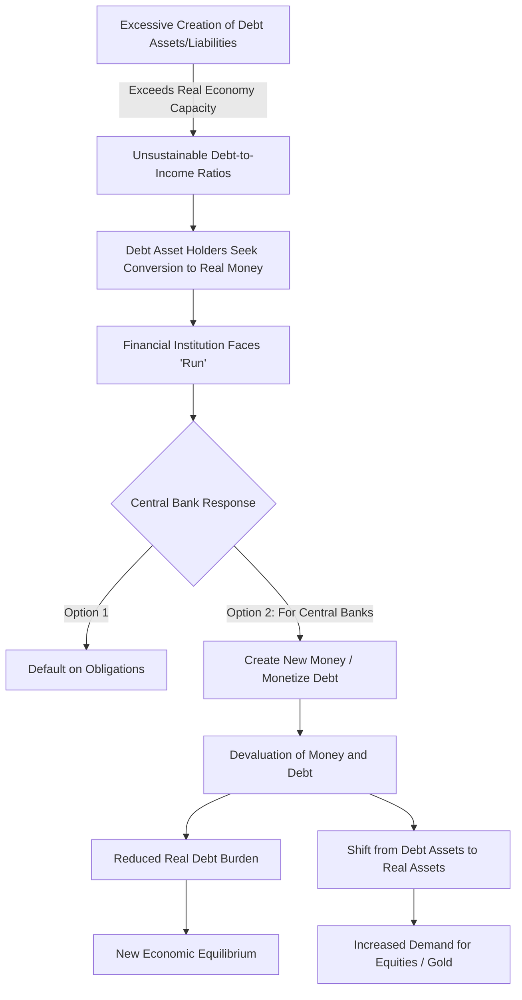

You could overlook this fundamental pattern if you focus too narrowly on the specific mechanisms of [banking](../../../../Advanced%20Financial%20Analysis%20and%20Valuation/Problem%20Sets/HKS%20The%20Banking%20Industry.md) systems, especially without considering their evolution across time and geography. While modern central banks differ from historical [financial institutions](../../../../Financial%20Markets%20and%20Institutions/Financial%20Markets%20and%20Institutions%20Lecture%20Notes.md), they operate on similar principles—with the crucial distinction that central banks can create money. During debt crises, this capacity becomes their defining advantage.

Similarly, countries with established reserve currencies enjoy greater stability since borrowers and lenders maintain higher confidence in their systems. To comprehend debt dynamics fully, we must also consider how they evolve over time. For instance, without understanding how central banks implemented [quantitative easing](../../../../Financial%20Markets/Fixed%20Income%20Securities%20Tools%20for%20Today's%20Markets/Front%20Matter/Negative%20Rates%20and%20Qe%20in%20Europe%20and%20Japan.md) when [interest rates](../../../../Financial%20Markets/Fixed%20Income%20Securities%20Tools%20for%20Today's%20Markets/Chapter%202/Interest%20Rate%20Quotations.md) hit zero in 2008, we wouldn't grasp their potential responses to similar conditions. Throughout history, most central banks have transitioned from [currency](../../../../Financial%20Instruments/Lecture%20Notes-%20Financial%20Instruments/Teaching%20Note%201-%20Forward%20Rates%20Agreement/Forwards%20and%20Futures%20Notes.md) systems backed by hard assets (like gold) to fiat currencies when debt obligations exceeded their backing reserves. They typically revert to fixed/linked currencies after excessive money printing diminishes the fiat [currency](../../../../Financial%20Instruments/Lecture%20Notes-%20Financial%20Instruments/Teaching%20Note%201-%20Forward%20Rates%20Agreement/Forwards%20and%20Futures%20Notes.md)'s effectiveness as a store of value.

To anticipate future developments, we must understand the major historical transformations and their causal mechanisms—comprehending how "the [economic machine](../../Principles%20For%20Navigating%20Big%20Debt%20Cycles/Principles%20Part%20II.md)" functions—rather than focusing exclusively on current conditions or minor details.

I intentionally present this template in simplified terms, making it easy for critics to identify technical inaccuracies. This approach deliberately emphasizes the most significant factors.

While I'll explain how I believe the cyclical debt/money/economic dynamics have unfolded since 1944, remember that these dynamics aren't unique to our era. The [Big Cycle](../How%20Countries%20Go%20Broke%20-%20Chapter%202%20&%20Chapter%203.md) pattern we're currently experiencing operates according to the same fundamental and logical cause-effect relationships that have governed economic systems for millennia across all nations—provided we focus on the broader patterns rather than minute details.

Let's examine developments since World War II's conclusion and the establishment of the new world order. While framing this in the context of the [Big Debt Cycle](../How%20Countries%20Go%20Broke%20Introduction%20&%20Chapter%201.md), we'll see how all five forces fluctuated and interacted to shape events. These forces resemble waves—sometimes small, sometimes massive—occasionally reinforcing each other and other times counteracting, sometimes converging to create perfect storms. Regarding the [debt cycle](../../Chapters/US%20Debt%20Crisis%20and%20Adjustment%201928-1937.md) specifically, the key dynamic to understand is:

- _**Typically, when central banks seek economic stimulus, they reduce [interest rates](../../../../Financial%20Markets/Fixed%20Income%20Securities%20Tools%20for%20Today's%20Markets/Chapter%202/Interest%20Rate%20Quotations.md) and/or expand money and credit supply, increasing spending and debt. This both extends economic expansion and elevates debt assets and liabilities relative to incomes, creating a more precarious debt balance. Historical evidence shows that when central banks can no longer lower [interest rates](../../../../Financial%20Markets/Fixed%20Income%20Securities%20Tools%20for%20Today's%20Markets/Chapter%202/Interest%20Rate%20Quotations.md) but still want to stimulate growth, they print money and purchase debt, particularly government securities. This provides debtors, especially governments, with the resources to avoid default and continue spending beyond their income until the debt imbalance becomes unsustainable, necessitating [debt restructuring](../../../../Financial%20Markets%20and%20Institutions/II.%20The%20Roles%20of%20Banks%20and%20Derivative%20Markets%20in%20Resolving%20Problems%20Inherent%20in%20Debt%20Contracts/Class%204-%20Restructuring%20Public%20Debt/Class%20Slide%204-Restructuring%20Debt%20Outside%20Bankruptcy.md) and/or monetization.**_

### What Happened Since 1944

**I will now explore the [Big Debt Cycle](../How%20Countries%20Go%20Broke%20Introduction%20&%20Chapter%201.md) that began in 1944—which we're currently in the late stages of—and explain its development through the mechanical cause-effect relationships described previously.**

**Beyond major debt/money/economic events, I'll include significant developments from the other four major forces, as these five influences are so interconnected that they cannot be understood in isolation. As we progress through this period to the present, observe the substantial fluctuations in all five factors and their interactions.**

**To clarify how this evolved relative to the money/debt template previously explained, I'll divide the post-1944 period into four phases representing the primary monetary regimes that have driven credit-debt dynamics since 1944, beginning with the establishment of new monetary, geopolitical, and often domestic political orders.**

Born in 1949 and having worked as a [global macro investor](../How%20Countries%20Go%20Broke%20Introduction%20&%20Chapter%201.md) for most of my life, I've both experienced and studied much of what I'll describe. I'll share some personal observations to enrich this narrative and convey [lessons learned](../../../../Financial%20Markets%20and%20Institutions/III.%20Liquidity%20of%20Assets/Class%208-%20Markets,%20Meltdowns,%20and%20Arbitrage/Lessons%20From%20The%20Crisis.md) from my experiences—particularly from painful mistakes, which remain more vivid in my memory than successful decisions. As the story of these eight decades unfolds, note the almost synchronized oscillations of the five forces between extremes. These swings were so pronounced that each decade typically contrasted sharply with its predecessor. Yet, paradoxically, at each decade's conclusion, both psychology and markets anticipated continuity, making these transition points crucial opportunities for those who understood the [fundamentals](../../../../Advanced%20Financial%20Analysis%20and%20Valuation/Lecture%20Notes%20Advanced%20Financial%20Analysis%20and%20Valuation/Week%202/Week%202%20Fundamentals%20Of%20Forecasting.md) to position themselves against conventional wisdom.

### The Current Big Debt Cycle in Brief

**Before detailing specific developments, let me illustrate the [Big Debt Cycle](../How%20Countries%20Go%20Broke%20Introduction%20&%20Chapter%201.md) through several charts, beginning with the United States from 1900 to provide broader context. I focus on US dollar debt because the global money and debt market has primarily operated in US dollars during this cycle, though other countries have experienced their own significant cycles.**

**In the US from 1944 to 2024, we've seen 12.5 [short-term debt](../../../../Financial%20Markets%20and%20Institutions/III.%20Liquidity%20of%20Assets/Class%207-%20CP,%20Repo,%20and%20the%20Crisis/When%20Safe%20Proved%20Risky%20Commercial%20Paper%20During%20the%20Financial%20Crisis%20of%202007%202009.md) cycles (we're currently midway through the 13th), averaging approximately six years each, collectively forming one comprehensive [Big Debt Cycle](../How%20Countries%20Go%20Broke%20Introduction%20&%20Chapter%201.md) that has increased the central government's debt-to-income ratios and deteriorated the central bank's balance sheet as shown in the following charts.** In other words, the US and its [credit markets](../../../../Credit%20Markets/Credit%20Markets%20Session%201.md) have been in the long-term leveraging-up phase of the long-term [debt cycle](../../Chapters/US%20Debt%20Crisis%20and%20Adjustment%201928-1937.md), without yet entering the deleveraging phase, though we've experienced brief deleveraging periods. These charts illustrate the overarching pattern, often overlooked because observers focus on short-term fluctuations that don't even register in these broader visualizations.

**This first chart displays US private debt relative to GDP since 1900, clearly showing the [Big Debt Cycle](../How%20Countries%20Go%20Broke%20Introduction%20&%20Chapter%201.md) beginning in 1944. Note the 2008 peak and subsequent slight decline, which occurred as the US central government and Federal Reserve intervened significantly to support the private sector, as shown in the next two charts. As previously explained, this intervention typifies the beginning of the late stage of the [Big Cycle](../How%20Countries%20Go%20Broke%20-%20Chapter%202%20&%20Chapter%203.md).**

**The chart below shows US [government debt](../../../../Financial%20Markets/Fixed%20Income%20Securities%20Tools%20for%20Today's%20Markets/Front%20Matter/Global%20Fixed%20Income%20Markets.md) relative to GDP, with projected levels from the Congressional Budget Office for the next 10 and 20 years. As illustrated, this metric is evolving in a [big cycle](../How%20Countries%20Go%20Broke%20-%20Chapter%202%20&%20Chapter%203.md), currently at its highest point since 1946 (around World War II's conclusion), and projected to rise substantially higher.**

**Next, I've combined the previous two charts to demonstrate their relationship, revealing how private and public sector debt levels interact—most notably how [government debt](../../../../Financial%20Markets/Fixed%20Income%20Securities%20Tools%20for%20Today's%20Markets/Front%20Matter/Global%20Fixed%20Income%20Markets.md) typically increases when private sector debt decreases.** For example, the dramatic rise in [government debt](../../../../Financial%20Markets/Fixed%20Income%20Securities%20Tools%20for%20Today's%20Markets/Front%20Matter/Global%20Fixed%20Income%20Markets.md)-to-GDP since 2008 coincided with declining private sector debt-to-GDP. This occurred because the central government increased its debt to provide greater support to the private sector—creating the fundamental problem we now face.

The following chart shows [central government debt](../How%20Countries%20Go%20Broke-Chapter%2015%20&%20Chapter%2016.md) service as a percentage of revenue. Currently around 100%, this ratio is projected to reach approximately 150% within 15 years. To contextualize this, imagine having annual [debt service](../../../../Financial%20Engineering/Notes%20on%20Currency%20Swaps.md) payments 50% larger than your annual income—an unsustainable situation. This projection assumes the government will be able to: 1) roll over maturing debt, 2) sell new debt to fund ongoing deficits, and 3) convince existing debt holders not to sell their holdings (meaning lenders continue lending to the government because they don't perceive excessive risk).

  -  flowchart TD A[Government Debt]([Global%20Fixed%20Income%20Markets) Service Reaches 100% of Revenue] --> B[Projected to Rise to 150% in 15 Years] B --> C{Sustainability Requires} C --> D[Successful Rollover of Maturing Debt] C --> E[Market Absorption of New Deficit-Funding Debt] C --> F[Existing Holders Maintain Positions] D & E & F --> G[If Any Component Fails] G --> H[Potential [Sovereign Debt Crisis](../../../../Financial%20Markets/Fixed%20Income%20Securities%20Tools%20for%20Today's%20Markets/Chapter%2013/Uses%20of%20Interest%20Rate%20Swaps.md)] H --> I[Central Bank Intervention]([How%20Countries%20Go%20Broke-Chapter%206%20&%20Chapter%207)] I --> J[Monetization of Debt] J --> K[Currency]([Forwards%20and%20Futures%20Notes) Devaluation]   - 

**_Since all events occur for specific causal reasons, examining these factors enables us to identify indicators of cause-effect relationships, observe their development, and utilize them to anticipate likely outcomes._ To enhance this understanding, I'll share several additional indicators.**

**The next chart displays the 10-year Treasury bond rate alongside a three-year moving average of the [inflation](../../Principles%20For%20Navigating%20Big%20Debt%20Cycles/Part%20II%20Detailed%20Case%20Studies/German%20Debt%20Crisis%20andHyperinflation%20(1918–1924)/War%20Economies%20and%20Hyperinflation.md) rate.** _**The relationship between [interest rates](../../../../Financial%20Markets/Fixed%20Income%20Securities%20Tools%20for%20Today's%20Markets/Chapter%202/Interest%20Rate%20Quotations.md) and [inflation](../../Principles%20For%20Navigating%20Big%20Debt%20Cycles/Part%20II%20Detailed%20Case%20Studies/German%20Debt%20Crisis%20andHyperinflation%20(1918–1924)/War%20Economies%20and%20Hyperinflation.md) is crucial—when [interest rates](../../../../Financial%20Markets/Fixed%20Income%20Securities%20Tools%20for%20Today's%20Markets/Chapter%202/Interest%20Rate%20Quotations.md) substantially exceed [inflation](../../Principles%20For%20Navigating%20Big%20Debt%20Cycles/Part%20II%20Detailed%20Case%20Studies/German%20Debt%20Crisis%20andHyperinflation%20(1918–1924)/War%20Economies%20and%20Hyperinflation.md), saving and earning interest becomes attractive; when [interest rates](../../../../Financial%20Markets/Fixed%20Income%20Securities%20Tools%20for%20Today's%20Markets/Chapter%202/Interest%20Rate%20Quotations.md) fall below [inflation](../../Principles%20For%20Navigating%20Big%20Debt%20Cycles/Part%20II%20Detailed%20Case%20Studies/German%20Debt%20Crisis%20andHyperinflation%20(1918–1924)/War%20Economies%20and%20Hyperinflation.md), borrowing and investing in [inflation](../../Principles%20For%20Navigating%20Big%20Debt%20Cycles/Part%20II%20Detailed%20Case%20Studies/German%20Debt%20Crisis%20andHyperinflation%20(1918–1924)/War%20Economies%20and%20Hyperinflation.md)-benefiting assets becomes preferable.**_

This chart reveals the significant cycles in [interest rates](../../../../Financial%20Markets/Fixed%20Income%20Securities%20Tools%20for%20Today's%20Markets/Chapter%202/Interest%20Rate%20Quotations.md) reflected in the 10-year Treasury yield and [inflation](../../Principles%20For%20Navigating%20Big%20Debt%20Cycles/Part%20II%20Detailed%20Case%20Studies/German%20Debt%20Crisis%20andHyperinflation%20(1918–1924)/War%20Economies%20and%20Hyperinflation.md)'s moving average. The bond yield comprises two components—expected [inflation](../../Principles%20For%20Navigating%20Big%20Debt%20Cycles/Part%20II%20Detailed%20Case%20Studies/German%20Debt%20Crisis%20andHyperinflation%20(1918–1924)/War%20Economies%20and%20Hyperinflation.md) and expected real yield—both critical in determining money and debt's value as wealth stores and funding costs. Note that during the upswing of this major cycle, all short-term cyclical bond yield peaks (during recessions, stimulus periods, growth phases, and [inflation](../../Principles%20For%20Navigating%20Big%20Debt%20Cycles/Part%20II%20Detailed%20Case%20Studies/German%20Debt%20Crisis%20andHyperinflation%20(1918–1924)/War%20Economies%20and%20Hyperinflation.md) spikes leading to monetary tightening, recessions, and falling bond yields) exceeded previous ones until 1981. Conversely, each short-term cyclical decline in bond yields from 1981 until 2020 fell below previous ones until [nominal interest rates](../../../../Financial%20Markets/Financial%20Asset%20Pricing%20Theory%20Overview/Chapter%2010%20-%20The%20Economics%20of%20the%20Term%20Structure%20of%20Interest%20Rates/Real%20and%20Nominal%20Interest%20Rates%20and%20Term%20Struc.md) approached 0% while real rates turned significantly negative. This pattern reflects the major cycle in [inflation](../../Principles%20For%20Navigating%20Big%20Debt%20Cycles/Part%20II%20Detailed%20Case%20Studies/German%20Debt%20Crisis%20andHyperinflation%20(1918–1924)/War%20Economies%20and%20Hyperinflation.md) [expectations](../../../../Fixed%20Income%20Asset%20Pricing/Fixed%20Income%20Lecture%20Notes/FORWARD%20RATES%20AND%20TERM%20STRUCTURE.md) and [real interest rates](../../../../Financial%20Markets/Financial%20Asset%20Pricing%20Theory%20Overview/Chapter%2010%20-%20The%20Economics%20of%20the%20Term%20Structure%20of%20Interest%20Rates/Real%20Interest%20Rates%20and%20Aggregate%20Production.md)' fluctuations around these [expectations](../../../../Fixed%20Income%20Asset%20Pricing/Fixed%20Income%20Lecture%20Notes/FORWARD%20RATES%20AND%20TERM%20STRUCTURE.md). While nominal rates matter, real rates are more significant as they indicate Treasury bonds' attractiveness as wealth stores.

The following chart shows the real 10-year bond yield. For post-1997 years, I use the real yield on 10-year Treasury [inflation](../../Principles%20For%20Navigating%20Big%20Debt%20Cycles/Part%20II%20Detailed%20Case%20Studies/German%20Debt%20Crisis%20andHyperinflation%20(1918–1924)/War%20Economies%20and%20Hyperinflation.md)-protected securities. In my assessment, the real bond yield represents the most critical metric in finance. It reveals the guaranteed real return on wealth (free from [inflation](../../Principles%20For%20Navigating%20Big%20Debt%20Cycles/Part%20II%20Detailed%20Case%20Studies/German%20Debt%20Crisis%20andHyperinflation%20(1918–1924)/War%20Economies%20and%20Hyperinflation.md) and default risks), establishing the foundation for all capital markets. To exceed this rate requires genuine [investment](../../../../Advanced%20Investments/An%20Asset%20Allocation%20Primer.md) skill. More importantly, **it serves as the single best indicator of whether borrower-debtor or lender-creditor positions are advantageous**—when real rates are low, converting borrowed funds into profits becomes substantially easier than during high real rate environments. This makes it an excellent tool for central banks to regulate credit and economic activity. As shown, the real bond yield has averaged approximately 2% over the past century—a rate neither too disadvantageous for borrower-debtors nor too favorable for lender-creditors. Periods of significant deviation from this 2% baseline represent environments of excessively cheap or expensive credit/debt, contributing substantially to the major swings in the [Big Debt Cycle](../How%20Countries%20Go%20Broke%20Introduction%20&%20Chapter%201.md).

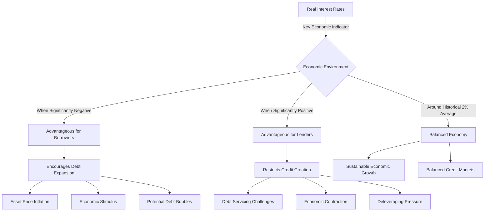

  - 

When examining nominal bond yields relative to [inflation-indexed](Chinese%20Financial%20System.md) bonds' real yields, I can derive the breakeven [inflation](../../Principles%20For%20Navigating%20Big%20Debt%20Cycles/Part%20II%20Detailed%20Case%20Studies/German%20Debt%20Crisis%20andHyperinflation%20(1918–1924)/War%20Economies%20and%20Hyperinflation.md) rate—the market's projected [inflation](../../Principles%20For%20Navigating%20Big%20Debt%20Cycles/Part%20II%20Detailed%20Case%20Studies/German%20Debt%20Crisis%20andHyperinflation%20(1918–1924)/War%20Economies%20and%20Hyperinflation.md) rate. Since one can profit by betting against this rate when [inflation](../../Principles%20For%20Navigating%20Big%20Debt%20Cycles/Part%20II%20Detailed%20Case%20Studies/German%20Debt%20Crisis%20andHyperinflation%20(1918–1924)/War%20Economies%20and%20Hyperinflation.md) [expectations](../../../../Fixed%20Income%20Asset%20Pricing/Fixed%20Income%20Lecture%20Notes/FORWARD%20RATES%20AND%20TERM%20STRUCTURE.md) differ from one's own projections, and markets are challenging to outperform, this rate serves as a reasonable baseline estimate absent superior [forecasting](../../../../Advanced%20Financial%20Analysis%20and%20Valuation/Lecture%20Notes%20Advanced%20Financial%20Analysis%20and%20Valuation/Week%202/Week%202%20Fundamentals%20Of%20Forecasting.md) methods. With market [pricing](../../../../Financial%20Markets/Fixed%20Income%20Securities%20Tools%20for%20Today's%20Markets/Chapter%207/Arbitrage%20Pricing%20of%20Derivatives.md) providing both the "discounted" (market-expected) [inflation](../../Principles%20For%20Navigating%20Big%20Debt%20Cycles/Part%20II%20Detailed%20Case%20Studies/German%20Debt%20Crisis%20andHyperinflation%20(1918–1924)/War%20Economies%20and%20Hyperinflation.md) rate and the achievable real interest rate, I view bond yields as comprising these two critical components. I routinely monitor these factors rather than just the Treasury rate, often considering and trading them separately. Their historical estimated values appear below.

**I consistently analyze the 10-year real rate and its components because it fundamentally governs all capital markets.** My extensive involvement with this metric began years ago when, before the US established an [inflation-indexed](Chinese%20Financial%20System.md) bond market, I invested in non-US [inflation-indexed](Chinese%20Financial%20System.md) bonds with [currency](../../../../Financial%20Instruments/Lecture%20Notes-%20Financial%20Instruments/Teaching%20Note%201-%20Forward%20Rates%20Agreement/Forwards%20and%20Futures%20Notes.md) [hedging](../../../../Financial%20Markets/Fixed%20Income%20Securities%20Tools%20for%20Today's%20Markets/Chapter%205/Key%20Rates%20O1s%20Durations%20and%20Hedging.md) to create synthetic US [inflation-indexed](Chinese%20Financial%20System.md) equivalents. This approach developed after David White of the Rockefeller Foundation, seeking [investment](../../../../Advanced%20Investments/An%20Asset%20Allocation%20Primer.md) strategies to support their 5% annual distribution requirement, prompted me to explore leveraging and [hedging](../../../../Financial%20Markets/Fixed%20Income%20Securities%20Tools%20for%20Today's%20Markets/Chapter%205/Key%20Rates%20O1s%20Durations%20and%20Hedging.md) foreign [inflation-indexed](Chinese%20Financial%20System.md) bonds. This led Bridgewater to become the world's largest global [inflation-indexed](Chinese%20Financial%20System.md) bond manager, and I was subsequently invited to collaborate with Larry Summers on designing the Treasury [Inflation](../../Principles%20For%20Navigating%20Big%20Debt%20Cycles/Part%20II%20Detailed%20Case%20Studies/German%20Debt%20Crisis%20andHyperinflation%20(1918–1924)/War%20Economies%20and%20Hyperinflation.md) Protected Securities (TIPS) market during his Treasury leadership. Since then, we've had a true market displaying real bond yields for both analytical guidance and [investment](../../../../Advanced%20Investments/An%20Asset%20Allocation%20Primer.md) opportunities, forming the foundation of my [investment](../../../../Advanced%20Investments/An%20Asset%20Allocation%20Primer.md) philosophy. I believe [inflation-indexed](Chinese%20Financial%20System.md) bond markets worldwide remain significantly underutilized relative to their potential for the reasons outlined. I recommend monitoring them as indicators and utilizing them as wealth preservation vehicles.

_**The relationship between short-term and long-term rates (the yield curve) is equally significant because when [short-term rates](../../../../Financial%20Markets/Fixed%20Income%20Securities%20Tools%20for%20Today's%20Markets/Chapter%208/Volatility%20and%20Convexity.md) exceed long-term rates, monetary conditions tighten, encouraging cash holding and lending over borrowing and [alternative investments](../../../../Financial%20Markets/Financial%20Engineering%20and%20Arbitrage%20in%20the%20Financial%20Markets/PART%20III%20THE%20PLAYERS/Chapter%2014%20-%20Private%20Equity,%20Pension,%20and%20Sovereign%20Funds/Risk%20Allocation%20for%20Pension%20Funds%20and%20Sovereig.md).**_ Asset attractiveness shifts affect the nominal interest rate yield curve—the difference between 10-year nominal bond yields and nominal short rates—reflecting changing monetary conditions and incentives for holding cash versus bonds. Typically, lender-creditors demand higher interest for longer-term commitments, and higher long-term than [short-term rates](../../../../Financial%20Markets/Fixed%20Income%20Securities%20Tools%20for%20Today's%20Markets/Chapter%208/Volatility%20and%20Convexity.md) incentivize lending. When central banks aim to slow credit growth and economic demand, they raise [short-term rates](../../../../Financial%20Markets/Fixed%20Income%20Securities%20Tools%20for%20Today's%20Markets/Chapter%208/Volatility%20and%20Convexity.md) relative to long-term rates; to stimulate, they do the opposite. When both 1) real yields are high and 2) the yield curve is flat or inverted, monetary conditions favor lender-creditors over borrower-debtors; when 3) real yields are low and 4) the yield curve slopes positively, conditions favor borrower-debtors over lender-creditors. Extreme central bank policy shifts create extreme environments with substantial volatility for both groups, disrupting economies and causing inefficiencies.

**I believe the Federal Reserve should adopt less extreme and volatile interest rate policies.** **If I were directing [monetary policy](../../../../Financial%20Markets%20and%20Institutions/III.%20Liquidity%20of%20Assets/Class%209-%20Bailouts%20and%20Bank%20Failures/Articles/The%20Economist%20Regime%20Change.md), I would maintain relatively stable long-term [real interest rates](../../../../Financial%20Markets/Financial%20Asset%20Pricing%20Theory%20Overview/Chapter%2010%20-%20The%20Economics%20of%20the%20Term%20Structure%20of%20Interest%20Rates/Real%20Interest%20Rates%20and%20Aggregate%20Production.md) at levels balancing borrower-debtor and lender-creditor needs without contributing to debt bubbles and crashes. This would involve targeting real T-bond yields around 2% with approximately 1% variation, while structuring the yield curve so that a) [short-term rates](../../../../Financial%20Markets/Fixed%20Income%20Securities%20Tools%20for%20Today's%20Markets/Chapter%208/Volatility%20and%20Convexity.md) remain about 1% below long-term rates and b) [short-term rates](../../../../Financial%20Markets/Fixed%20Income%20Securities%20Tools%20for%20Today's%20Markets/Chapter%208/Volatility%20and%20Convexity.md) equal roughly 70% of long-term rates, with variations of about 2% and 50% respectively.**

**More consistent policy would reduce volatility, minimizing harm to borrower-debtors and lender-creditors (and their economic impacts), while enabling better planning.** With a more predictable approach, borrower-debtors and lender-creditors could anticipate reasonable real rates acceptable to both parties, allowing for better activity planning. This relatively certain borrowing rate would help lending and [economic conditions](../../Chapters/US%20Debt%20Crisis%20and%20Adjustment%20(2007–2011).md) adapt to reasonable [interest rates](../../../../Financial%20Markets/Fixed%20Income%20Securities%20Tools%20for%20Today's%20Markets/Chapter%202/Interest%20Rate%20Quotations.md). Setting stable rates would provide both borrowers and lenders with more predictable funding costs and real [returns](../../../../Financial%20Markets/Financial%20Asset%20Pricing%20Theory%20Overview/Chapter%203%20-%20%20Assets,%20Portfolios,%20and%20Arbitrage/Assets.md), creating more stable capital markets and [economic conditions](../../Chapters/US%20Debt%20Crisis%20and%20Adjustment%20(2007–2011).md), enhancing efficiency in both domains. But let's return to examining rates and their [economic impact](../../../../Financial%20Markets%20and%20Institutions/III.%20Liquidity%20of%20Assets/Class%209-%20Bailouts%20and%20Bank%20Failures/Articles/The%20Economist%20Fewer%20Or%20Even%20None.md).

**Thus far I've outlined Treasury [interest rates](../../../../Financial%20Markets/Fixed%20Income%20Securities%20Tools%20for%20Today's%20Markets/Chapter%202/Interest%20Rate%20Quotations.md), but these aren't the rates that individuals, companies, and local governments typically face. For this reason, credit spreads provide valuable insight. Below is a chart showing average credit spreads (for Baa corporate bonds) since 1920.**

**Interest owed on debt depends on the amount borrowed and the interest rate, which together with principal repayments constitute the total [debt service](../../../../Financial%20Engineering/Notes%20on%20Currency%20Swaps.md).**

**Let's revisit the earlier chart showing total [debt service](../../../../Financial%20Engineering/Notes%20on%20Currency%20Swaps.md) (principal plus interest payments) for the US central government relative to revenues, breaking down the components between principal and interest payments.** Note that [debt service](../../../../Financial%20Engineering/Notes%20on%20Currency%20Swaps.md) remained relatively constant from 1950 to 2000, reflecting stable or slightly declining [government debt](../../../../Financial%20Markets/Fixed%20Income%20Securities%20Tools%20for%20Today's%20Markets/Front%20Matter/Global%20Fixed%20Income%20Markets.md) levels during this period, resulting in stable to slightly declining principal payments. Interest payments increased modestly from 1950 to 1990 as average [government debt](../../../../Financial%20Markets/Fixed%20Income%20Securities%20Tools%20for%20Today's%20Markets/Front%20Matter/Global%20Fixed%20Income%20Markets.md) [interest rates](../../../../Financial%20Markets/Fixed%20Income%20Securities%20Tools%20for%20Today's%20Markets/Chapter%202/Interest%20Rate%20Quotations.md) gradually rose, then declined from 1990 to approximately 2022 as average rates slowly fell.

I've used dots to indicate projected growth based on Congressional Budget Office estimates for the next 10 and 20 years. The projected scenario differs significantly from recent history because [central government debt](../How%20Countries%20Go%20Broke-Chapter%2015%20&%20Chapter%2016.md) levels are high and expected to rise rapidly, while the [effective interest rate](../../../../Financial%20Engineering/1.%20DeterministicCashFlows.md) on this elevated debt is also projected to increase. This combination will substantially increase [government debt](../../../../Financial%20Markets/Fixed%20Income%20Securities%20Tools%20for%20Today's%20Markets/Front%20Matter/Global%20Fixed%20Income%20Markets.md) service relative to revenue, creating significant spending constraints unless additional borrowing occurs, likely financed by the central bank—therein lies the fundamental problem.

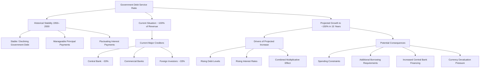

  - 

Who provided the central government's borrowed funds? A substantial portion came from the central bank, with significant additional borrowing from commercial banks and foreign investors who experienced losses when [interest rates](../../../../Financial%20Markets/Fixed%20Income%20Securities%20Tools%20for%20Today's%20Markets/Chapter%202/Interest%20Rate%20Quotations.md) rose. Approximately one-third comes from foreign sources. These commercial and foreign purchasers/holders of [US debt](../../../../Financial%20Markets/Fixed%20Income%20Securities%20Tools%20for%20Today's%20Markets/Front%20Matter/US%20Markets.md) have incurred losses as [interest rates](../../../../Financial%20Markets/Fixed%20Income%20Securities%20Tools%20for%20Today's%20Markets/Chapter%202/Interest%20Rate%20Quotations.md) increased, and they hold more of this debt than makes financial sense alone. The largest foreign holders of US government bonds maintain such large positions because they seek to store purchasing power in the world's most widely used and accepted [currency](../../../../Financial%20Instruments/Lecture%20Notes-%20Financial%20Instruments/Teaching%20Note%201-%20Forward%20Rates%20Agreement/Forwards%20and%20Futures%20Notes.md) from the greatest and most credible global power—essentially because it functions as the leading reserve [currency](../../../../Financial%20Instruments/Lecture%20Notes-%20Financial%20Instruments/Teaching%20Note%201-%20Forward%20Rates%20Agreement/Forwards%20and%20Futures%20Notes.md) of the dominant world power. Looking ahead, given the increasing supply of US government dollar debt (shown in the previous chart) relative to likely demand, it's difficult to imagine these major buyers/holders purchasing the enormous amounts of [US Treasuries](../../../../Credit%20Markets/Credit%20Market%20PSETS/Credit%20Market%20Homework%201.md) they acquired previously, especially if key demand drivers weaken—for example, if the US government a) mishandles its debt and domestic/foreign policy issues, b) threatens sanctions by withholding debt payments, c) offers poor [returns](../../../../Financial%20Markets/Financial%20Asset%20Pricing%20Theory%20Overview/Chapter%203%20-%20%20Assets,%20Portfolios,%20and%20Arbitrage/Assets.md) on this debt, and/or d) loses its economic and geopolitical prominence.

As [US debt](../../../../Financial%20Markets/Fixed%20Income%20Securities%20Tools%20for%20Today's%20Markets/Front%20Matter/US%20Markets.md) service levels continued rising, debtors required lower [interest rates](../../../../Financial%20Markets/Fixed%20Income%20Securities%20Tools%20for%20Today's%20Markets/Chapter%202/Interest%20Rate%20Quotations.md) to maintain affordable [debt service](../../../../Financial%20Engineering/Notes%20on%20Currency%20Swaps.md). From 1980 until 2008, interest rate reductions more than compensated for rising debt levels, keeping [debt service](../../../../Financial%20Engineering/Notes%20on%20Currency%20Swaps.md) manageable despite increasing debt. But **when rates approached zero in 2008, as they had in the post-1933 period, private market demand for bonds proved insufficient to meet supply, prompting [central bank intervention](../How%20Countries%20Go%20Broke-Chapter%206%20&%20Chapter%207.md) through money printing and bond purchases, which suppressed longer-term rates. This occurred in two major waves—first in response to the 1929-33 debt-crisis-induced [Great Depression](../../Chapters/US%20Debt%20Crisis%20and%20Adjustment%201928-1937.md) when [interest rates](../../../../Financial%20Markets/Fixed%20Income%20Securities%20Tools%20for%20Today's%20Markets/Chapter%202/Interest%20Rate%20Quotations.md) hit 0% (in the post-1933 period), and again following the 2008 debt-crisis-induced [Great Recession](../../../../Advanced%20Financial%20Analysis%20and%20Valuation/Problem%20Sets/HKS%20The%20Banking%20Industry.md) when [interest rates](../../../../Financial%20Markets/Fixed%20Income%20Securities%20Tools%20for%20Today's%20Markets/Chapter%202/Interest%20Rate%20Quotations.md) hit 0% (in the post-2008 period).** I wouldn't have recognized this pattern, and Bridgewater wouldn't have succeeded during this period, had we not studied the timeframe illustrated in this chart. This also led to my initial discovery of how the [Big Debt Cycle](../How%20Countries%20Go%20Broke%20Introduction%20&%20Chapter%201.md) functions.

**Regarding central banks,** **the Federal Reserve and other central banks earn lower [returns](../../../../Financial%20Markets/Financial%20Asset%20Pricing%20Theory%20Overview/Chapter%203%20-%20%20Assets,%20Portfolios,%20and%20Arbitrage/Assets.md) on their debt assets than the costs required to service their liabilities, so the modest interest rate increases during the most recent tightening cycle have caused [the Fed](../../../../Financial%20Markets/Fixed%20Income%20Securities%20Tools%20for%20Today's%20Markets/Front%20Matter/Monetary%20Policy%20with%20Abundantreserves.md) to incur moderate operating losses (blue line below).** If [the Fed](../../../../Financial%20Markets/Fixed%20Income%20Securities%20Tools%20for%20Today's%20Markets/Front%20Matter/Monetary%20Policy%20with%20Abundantreserves.md)'s balance sheet bonds were marked to market, its losses would approximate $700 billion, or 2.5% of GDP (red line). While substantial, this remains relatively minor compared to the central bank's funding capacity. Nevertheless, it represents a warning sign and could become a significant problem if widespread selling of [US debt](../../../../Financial%20Markets/Fixed%20Income%20Securities%20Tools%20for%20Today's%20Markets/Front%20Matter/US%20Markets.md) occurs—a typical development when such debt is perceived as risky. As previously explained, for countries like the United States that can create their own money, this would lead to either a) substantial, intolerable increases in nominal and [real interest rates](../../../../Financial%20Markets/Financial%20Asset%20Pricing%20Theory%20Overview/Chapter%2010%20-%20The%20Economics%20of%20the%20Term%20Structure%20of%20Interest%20Rates/Real%20Interest%20Rates%20and%20Aggregate%20Production.md), contracting credit and triggering severe economic contraction, or b) extensive central bank money printing, debt purchases, and credit provision, devaluing both debt and money. Significant central bank losses and deteriorating conditions would also increase scrutiny of central bank independence. Countries with debt denominated in reserve currencies they don't control would face even more severe consequences.

**Debt Burdens Will Increase Globally**

This [introduction](../../../../Financial%20Markets%20and%20Institutions/III.%20Liquidity%20of%20Assets/Class%209-%20Bailouts%20and%20Bank%20Failures/Squam%20Lake%20Group%20Introduction.md) has focused on [US debt](../../../../Financial%20Markets/Fixed%20Income%20Securities%20Tools%20for%20Today's%20Markets/Front%20Matter/US%20Markets.md) dynamics. However, as shown below, rising debt burdens represent a global challenge. Debt burdens are projected to increase substantially across developed economies (excluding Germany) over coming decades. Understanding how these dynamics will unfold is crucial for effective policy formulation and market navigation in the decades ahead.

**To reiterate, I will examine the US [Big Debt Cycle](../How%20Countries%20Go%20Broke%20Introduction%20&%20Chapter%201.md) because the US dollar has been and remains the dominant reserve [currency](../../../../Financial%20Instruments/Lecture%20Notes-%20Financial%20Instruments/Teaching%20Note%201-%20Forward%20Rates%20Agreement/Forwards%20and%20Futures%20Notes.md) for most transactions and savings. However, this chapter will explore Big Debt Cycles across several countries. Chapter 14 will specifically analyze Japan's [Big Debt Cycle](../How%20Countries%20Go%20Broke%20Introduction%20&%20Chapter%201.md). From my perspective, the US experience over the past 70-80 years, Japan's post-bubble economy, and other cases I've studied represent classic Big Debt Cycles operating according to previously described patterns that investors and policymakers worldwide should understand, particularly as many now confront similar cycles in their own countries and will likely experience serious repercussions from US and US dollar asset/liability developments. While reading this chapter, note how these debt cycles interact with political, geopolitical, natural, and technological forces.**

**To summarize my perspective, short-term money/credit/debt/economic cycles accumulate into long-term money/credit/debt/economic cycles, creating oscillations around productivity uptrends driven by human innovation, particularly technological advancement. Conceptually, this pattern resembles the following:**

We will now examine how these patterns unfolded through the long-term [debt cycle](../../Chapters/US%20Debt%20Crisis%20and%20Adjustment%201928-1937.md)'s various phases.

## Chapter 9: The History and Lessons from Phase 1, from 1944 to 1971—A Linked (i.e., Hard) Monetary System (MP1)

**This monetary system structure, which I term [Monetary Policy](../../../../Financial%20Markets%20and%20Institutions/III.%20Liquidity%20of%20Assets/Class%209-%20Bailouts%20and%20Bank%20Failures/Articles/The%20Economist%20Regime%20Change.md) 1, establishes a [currency](../../../../Financial%20Instruments/Lecture%20Notes-%20Financial%20Instruments/Teaching%20Note%201-%20Forward%20Rates%20Agreement/Forwards%20and%20Futures%20Notes.md) that can purchase a designated hard asset (typically gold) at a fixed price, theoretically limiting [currency](../../../../Financial%20Instruments/Lecture%20Notes-%20Financial%20Instruments/Teaching%20Note%201-%20Forward%20Rates%20Agreement/Forwards%20and%20Futures%20Notes.md) supply through this convertibility mechanism. The logic follows that excessive [currency](../../../../Financial%20Instruments/Lecture%20Notes-%20Financial%20Instruments/Teaching%20Note%201-%20Forward%20Rates%20Agreement/Forwards%20and%20Futures%20Notes.md) creation would devalue the [currency](../../../../Financial%20Instruments/Lecture%20Notes-%20Financial%20Instruments/Teaching%20Note%201-%20Forward%20Rates%20Agreement/Forwards%20and%20Futures%20Notes.md), motivating people to exchange it for the backing asset (e.g., gold), removing [currency](../../../../Financial%20Instruments/Lecture%20Notes-%20Financial%20Instruments/Teaching%20Note%201-%20Forward%20Rates%20Agreement/Forwards%20and%20Futures%20Notes.md) from circulation and supporting its value. However, this system has never proven sustainable because governments inevitably issue more debt than prudent, creating far more claims on the backing asset than can be honored at the specified conversion rate. The almost invariable result is a "[run on the bank](../../../../Advanced%20Financial%20Analysis%20and%20Valuation/Problem%20Sets/PSET%206-%20Evaluating%20Bank%20Balance%20Sheets%20and%20Loan%20Portfolios.md)," with people rushing to convert their holdings, ultimately forcing abandonment of the promise to deliver the hard asset.**

**From 1944 to 1971, a gold-linked monetary system operated wherein dollars (considered essentially claim checks with no intrinsic value) could be exchanged for gold (considered real money) at a fixed rate. Other currencies maintained exchangeability with dollars at agreed-upon adjustable rates.**

During this 27-year period, five [short-term debt](../../../../Financial%20Markets%20and%20Institutions/III.%20Liquidity%20of%20Assets/Class%207-%20CP,%20Repo,%20and%20the%20Crisis/When%20Safe%20Proved%20Risky%20Commercial%20Paper%20During%20the%20Financial%20Crisis%20of%202007%202009.md)/economic cycles occurred, creating fluctuations around an upward trend in debt relative to incomes. Here's what transpired, including developments across all five major forces:

World War II ended the previous world order and initiated the transition to our current world order. As always, the war's principal victors—in this case, the US, Great Britain, and allies, alongside the Soviet Union and its allies—established the rules for the new world order, including the new monetary system. **In A1944, the US, Great Britain, and their allies created the new monetary framework,** known as the Bretton Woods monetary system (named for its birthplace in Bretton Woods, New Hampshire). It resembled most historical monetary systems of the past millennia **with "paper" money linked to real money (gold) held in central banks,** though with distinctive characteristics. With the US possessing approximately two-thirds of global gold reserves, housed in the US Treasury, the dollar became the world's reserve [currency](../../../../Financial%20Instruments/Lecture%20Notes-%20Financial%20Instruments/Teaching%20Note%201-%20Forward%20Rates%20Agreement/Forwards%20and%20Futures%20Notes.md). Other countries maintained their own currencies, requiring them to first acquire dollars to purchase gold from the US central bank. Only central banks of countries could obtain gold; individuals were prohibited from converting paper money to gold. In fact, private gold ownership was illegal in the US and most countries because governments wanted to channel savings into debt assets to build the credit system without competition from gold. This system was created for and by the United States, with participation open to interested countries. Great Britain assumed a subordinate role in this new order due to war-related financial weakening, while the United States grew substantially wealthier through its late war entry. The Soviet Union maintained an independent monetary system separate from US dominance.

**The central geopolitical rivalry existed between the US (a capitalist democracy) and the Soviet Union (a communist autocracy).** The United States, enjoying greater economic and military strength than the Soviet Union, provided financial support through programs like the Marshall Plan to bolster allies, particularly in Europe. These initiatives aimed to strengthen alliances during the Cold War era. America's prosperity (possessing two-thirds of global gold reserves, which constituted money at that time), control of the world's reserve [currency](../../../../Financial%20Instruments/Lecture%20Notes-%20Financial%20Instruments/Teaching%20Note%201-%20Forward%20Rates%20Agreement/Forwards%20and%20Futures%20Notes.md), and generation of approximately half of global GDP enabled it to easily sustain allied support. Possessing the world's reserve [currency](../../../../Financial%20Instruments/Lecture%20Notes-%20Financial%20Instruments/Teaching%20Note%201-%20Forward%20Rates%20Agreement/Forwards%20and%20Futures%20Notes.md), which other nations desired, gave the US tremendous purchasing power, which it ultimately overextended.

**During this period, China, though allied with the victorious powers against Japan during the war, emerged as a devastated and weakened nation following what it terms the "Century of Humiliation," when foreign powers occupied various Chinese territories, conditions deteriorated dramatically, and governmental systems collapsed.** This approximately 100-year period spanned 1839 to World War II's conclusion. During this era, Japan annexed Taiwan in 1895, which returned to China through post-war settlements. **Between 1945 and 1949, China experienced a classic civil war between hard-right capitalists and hard-left communists, culminating in the communists forcing capitalists to retreat to Taiwan, Chinese communists aligning with Soviet communists, and US-China alienation. From this period forward, consensus held that one China existed with Taiwan as a component, with disputes centering on who controlled Taiwan and mainland China. These contentious issues have persisted and intensified, gaining particular significance given US and Chinese power dynamics and Taiwan's centrality to semiconductor production, which now surpasses oil production's importance in the previous cycle.**

**During this early post-war period, innovative individuals—particularly American scientists and entrepreneurs financed primarily by capitalists with government backing—continued developing transformative technologies with far-reaching implications.** For example, 1956 witnessed the birth of "artificial intelligence" and personal computing, while 1957 saw satellite development. The mid-1950s established the internet's technical foundations. Naturally, countless innovations emerged with profound economic, political, geopolitical, and environmental ramifications beyond the scope of this discussion.

**Great Britain, burdened by heavy debt and experiencing rapid relative economic and military decline, saw its bonds and [currency](../../../../Financial%20Instruments/Lecture%20Notes-%20Financial%20Instruments/Teaching%20Note%201-%20Forward%20Rates%20Agreement/Forwards%20and%20Futures%20Notes.md) persistently devalued through classic mechanisms described earlier—patterns worth noting when examining the current US situation.** Immediately following the war, Britain carried substantial debt while maintaining colonies and military installations across over 40 countries—commitments it could no longer afford. Without revisiting every step, this overextended British Empire faced debt challenges leading to a managed 30% [currency](../../../../Financial%20Instruments/Lecture%20Notes-%20Financial%20Instruments/Teaching%20Note%201-%20Forward%20Rates%20Agreement/Forwards%20and%20Futures%20Notes.md) devaluation in 1949, followed by successive devaluations in subsequent years—all attempts to alleviate debt burdens at tremendous cost to debt holders. The [currency](../../../../Financial%20Instruments/Lecture%20Notes-%20Financial%20Instruments/Teaching%20Note%201-%20Forward%20Rates%20Agreement/Forwards%20and%20Futures%20Notes.md) and debt value erosion followed classic patterns. Payment difficulties and inevitable losses of controlled foreign territories made Britain's decline evident, diminishing desire to hold its debt and [currency](../../../../Financial%20Instruments/Lecture%20Notes-%20Financial%20Instruments/Teaching%20Note%201-%20Forward%20Rates%20Agreement/Forwards%20and%20Futures%20Notes.md), triggering further declines. Most notably, Egypt's 1956 seizure of the Suez Canal prompted loyal British bondholders to sell their holdings. A 1967 [financial crisis](../../../../Financial%20Markets%20and%20Institutions/III.%20Liquidity%20of%20Assets/Class%209-%20Bailouts%20and%20Bank%20Failures/Squam%20Lake%20Group%20Letter.md) precipitated another major devaluation and abandonment of British debt and [currency](../../../../Financial%20Instruments/Lecture%20Notes-%20Financial%20Instruments/Teaching%20Note%201-%20Forward%20Rates%20Agreement/Forwards%20and%20Futures%20Notes.md) as wealth stores, while by 1976, Britain's financial condition deteriorated so severely that it required IMF assistance. The British pound's decline represents the most recent classic case study of reserve [currency](../../../../Financial%20Instruments/Lecture%20Notes-%20Financial%20Instruments/Teaching%20Note%201-%20Forward%20Rates%20Agreement/Forwards%20and%20Futures%20Notes.md) deterioration, detailed extensively in my book _Principles for Dealing with the Changing World Order_.

**In the early 1960s, the US experienced an expansionary short-term money and credit cycle, benefiting American markets and economy until 1965-66, when [inflation](../../Principles%20For%20Navigating%20Big%20Debt%20Cycles/Part%20II%20Detailed%20Case%20Studies/German%20Debt%20Crisis%20andHyperinflation%20(1918–1924)/War%20Economies%20and%20Hyperinflation.md) reached 3.8% and the Federal Reserve tightened [monetary policy](../../../../Financial%20Markets%20and%20Institutions/III.%20Liquidity%20of%20Assets/Class%209-%20Bailouts%20and%20Bank%20Failures/Articles/The%20Economist%20Regime%20Change.md), inverting the yield curve for the first time since 1929 and triggering a 1969-70 recession. This produced the 1968 [inflation](../../Principles%20For%20Navigating%20Big%20Debt%20Cycles/Part%20II%20Detailed%20Case%20Studies/German%20Debt%20Crisis%20andHyperinflation%20(1918–1924)/War%20Economies%20and%20Hyperinflation.md)-adjusted peak in the S&P 500, which would not be surpassed for 25 years, with the extended underperformance stemming from the significant cycle influences described earlier in this analysis.** This prolonged period of dismal stock and bond market performance—contrasted with exceptional [returns](../../../../Financial%20Markets/Financial%20Asset%20Pricing%20Theory%20Overview/Chapter%203%20-%20%20Assets,%20Portfolios,%20and%20Arbitrage/Assets.md) from gold and [inflation](../../Principles%20For%20Navigating%20Big%20Debt%20Cycles/Part%20II%20Detailed%20Case%20Studies/German%20Debt%20Crisis%20andHyperinflation%20(1918–1924)/War%20Economies%20and%20Hyperinflation.md)-hedge assets—primarily resulted from necessary money creation and devaluation to address excessive debts (i.e., obligations to deliver money) relative to actual money in circulation. This paradigm significantly shaped my understanding of navigating diverse market environments and developing requisite skills. It also places me in a fundamentally different mindset than most investors who lack comparable experiences and base their perspectives solely on personal observations, leading them to believe that maintaining long positions exclusively in equity-like assets while disregarding major cycles represents optimal [investment](../../../../Advanced%20Investments/An%20Asset%20Allocation%20Primer.md) strategy.
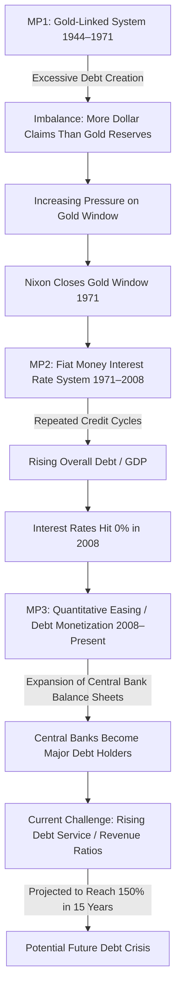

**The 1960s witnessed several nerve-wracking political and geopolitical conflicts that profoundly impacted me, most notably the 1962 Cuban Missile Crisis, which brought the world's most powerful nations to the brink of nuclear war.** As a 13-year-old, I vividly recall watching John F. Kennedy's address explaining the situation and wondering whether nuclear war would erupt or which country would back down. Cuba's leader, Fidel Castro, advocated for war, potentially nuclear. Surprisingly, [financial markets](../../../../Financial%20Markets%20and%20Institutions/Financial%20Markets%20and%20Institutions%20Lecture%20Notes.md) reacted less severely than I anticipated. Eventually, the Soviet Union withdrew its US-targeted missiles from Cuba, while the United States removed its Soviet-targeted missiles from Turkey. This arrangement allowed both nations to claim victory without disclosing their concessions, providing my first lesson in brinkmanship diplomacy's mechanics and market behavior during such crises (when potential conflict damages would be unacceptably high). November 1963 brought JFK's assassination, which similarly produced only brief market and economic disruptions; the civil rights movement advanced; and substantial spending occurred on both "guns" (Vietnam War) and "butter" (domestic social programs). These and numerous seemingly monumental events with limited market impact helped me understand why markets remained resilient and distinguish between consequential and inconsequential developments for market [pricing](../../../../Financial%20Markets/Fixed%20Income%20Securities%20Tools%20for%20Today's%20Markets/Chapter%207/Arbitrage%20Pricing%20of%20Derivatives.md) and economic activity. Without exploring everything that matters, I'll note that markets primarily respond to [investment](../../../../Advanced%20Investments/An%20Asset%20Allocation%20Primer.md) cash flows, so major political events like war threats have minimal impact until they affect these cash flows. From an [investment](../../../../Advanced%20Investments/An%20Asset%20Allocation%20Primer.md) perspective, I recommend disregarding today's headline-grabbing but inconsequential events, as I do. Moreover, I've learned that most global threats appear more ominous than they ultimately prove, as leaders typically retreat from brinkmanship rather than cross critical thresholds. However, international conflicts occasionally impact supply chains and [currency](../../../../Financial%20Instruments/Lecture%20Notes-%20Financial%20Instruments/Teaching%20Note%201-%20Forward%20Rates%20Agreement/Forwards%20and%20Futures%20Notes.md) values, and in rare instances, leaders miscalculate, leading to genuine crises with significant consequences. I view protection against such events as insurance against improbable but unacceptable losses, seeking coverage despite not expecting their occurrence.

**The 1960s also witnessed a major geopolitical shift in Sino-Soviet relations. Their relationship transformed from "friendly" to "adversarial," precipitating a corresponding significant geopolitical realignment between China and the United States from "enemies" to "friends."** This led to Henry Kissinger's secret 1971 China visit followed by Nixon's early 1972 visit, laying groundwork for China's post-Mao Zedong opening after his 1976 death. These developments, like the technological advancements mentioned previously, represented small catalysts for change that evolved into transformative shifts affecting all five forces globally. Though seemingly inconsequential initially, they ultimately proved profoundly significant.

During 1945-70, the US overspent and financed this through borrowing, particularly **during the 1960s on the Vietnam War and the "war on poverty," creating paper-money obligations for gold redemption far exceeding its reserves. This imbalance, while initially unremarkable, gradually accumulated until triggering a crisis. In the 1950s-60s, most countries willingly accepted these "paper" dollars for goods and services, seeking to accumulate dollar savings. This enabled liberal US overspending. Concurrently, countries like Germany and Japan gradually recovered from war losses, becoming economically competitive and worsening the US [balance of payments](../../../The%20Balance%20of%20Payments.md). By the late 1960s, the US and UK experienced central bank runs as paper money holders redeemed it for real money (gold), steadily depleting US central bank gold reserves.**

Observing the US central bank's dwindling gold reserves, French President Charles de Gaulle publicly called for monetary system reform in 1965. Other dollar holders recognized the pattern, accelerating the run while US spending and deficits continued unabated. Consequently, the central [bank run](../../../../Financial%20Markets%20and%20Institutions/III.%20Liquidity%20of%20Assets/Class%206-%20Bank%20Runs/Bank%20Runs%20Deposit%20Insurance%20and%20Liquidity.md) concluded like most such episodes. For reasons described previously, debt selling drove [interest rates](../../../../Financial%20Markets/Fixed%20Income%20Securities%20Tools%20for%20Today's%20Markets/Chapter%202/Interest%20Rate%20Quotations.md) higher while simultaneously depressing the [currency](../../../../Financial%20Instruments/Lecture%20Notes-%20Financial%20Instruments/Teaching%20Note%201-%20Forward%20Rates%20Agreement/Forwards%20and%20Futures%20Notes.md) and weakening the economy. **The US central bank lacked sufficient real money (gold) to honor its paper money exchange obligations at the promised rate.**

**On Sunday evening, August 15, 1971, President Nixon announced via television that the United States would no longer allow dollar holders to exchange their [currency](../../../../Financial%20Instruments/Lecture%20Notes-%20Financial%20Instruments/Teaching%20Note%201-%20Forward%20Rates%20Agreement/Forwards%20and%20Futures%20Notes.md) for gold. This action terminated the monetary system and concept of money as previously understood, immediately devaluing [currency](../../../../Financial%20Instruments/Lecture%20Notes-%20Financial%20Instruments/Teaching%20Note%201-%20Forward%20Rates%20Agreement/Forwards%20and%20Futures%20Notes.md), increasing [inflation](../../Principles%20For%20Navigating%20Big%20Debt%20Cycles/Part%20II%20Detailed%20Case%20Studies/German%20Debt%20Crisis%20andHyperinflation%20(1918–1924)/War%20Economies%20and%20Hyperinflation.md), and facilitating debt repayment through mechanisms explained earlier.** Working as a clerk on the New York Stock Exchange floor at the time—a summer position between college and business school—I anticipated that ending the monetary system and preventing access to real money represented a significant negative development, expecting substantial market declines. Instead, Monday brought the year's strongest market performance—stocks gained over 3%. Having never experienced [currency](../../../../Financial%20Instruments/Lecture%20Notes-%20Financial%20Instruments/Teaching%20Note%201-%20Forward%20Rates%20Agreement/Forwards%20and%20Futures%20Notes.md) devaluation, I misunderstood its dynamics. This prompted my historical research, revealing that in 1933, President Roosevelt had implemented identical measures (defaulting on gold-exchange promises) for identical reasons (excess promises relative to gold reserves during a [bank run](../../../../Financial%20Markets%20and%20Institutions/III.%20Liquidity%20of%20Assets/Class%206-%20Bank%20Runs/Bank%20Runs%20Deposit%20Insurance%20and%20Liquidity.md)), producing identical effects (devaluation, substantial market rallies in stocks and gold). The only meaningful difference was Roosevelt's radio announcement versus Nixon's television broadcast, reflecting technological advancement. In both instances, delinking [currency](../../../../Financial%20Instruments/Lecture%20Notes-%20Financial%20Instruments/Teaching%20Note%201-%20Forward%20Rates%20Agreement/Forwards%20and%20Futures%20Notes.md) freed the central government from delivering real money and enabled substantial money and credit creation, facilitating [debt management](../../Principles%20For%20Navigating%20Big%20Debt%20Cycles/Understanding%20Debt%20Crises%20and%20Their%20Management.md) and economic stimulus, driving equities, gold, and [commodity prices](../../../../Financial%20Instruments/Lecture%20Notes-%20Financial%20Instruments/Teaching%20Note%201-%20Forward%20Rates%20Agreement/Primary%20vs.%20Secondary%20Commodities.md) higher while boosting economic activity. This experience taught me that when central banks create substantial money and credit, monetary and credit value diminishes while most asset prices appreciate. I recognized these as classic examples of "hard" [currency](../../../../Financial%20Instruments/Lecture%20Notes-%20Financial%20Instruments/Teaching%20Note%201-%20Forward%20Rates%20Agreement/Forwards%20and%20Futures%20Notes.md) (gold-linked) exchange systems breaking down, leading to money and debt devaluation. After witnessing this pattern in these cases, I observed its recurrence throughout history in almost all similar situations, learning the principle that _**when severe debt problems become intolerable, central banks "print money" and distribute it to ease debtor obligations, devaluing money and debt relative to other assets**_. This insight has both generated substantial profits and helped me avoid significant losses.

## Chapter 10: The History and Lessons from Phase 2, 1971 to 2008—A Fiat Money, Interest-Rate-Driven Monetary Policy (MP2)

**The August 1971 monetary system collapse transformed both money's value and system operations—** **replacing the gold-linked system with a fiat monetary framework where central banks stimulated and restrained money/credit/debt growth through interest rate adjustments.** I designate this monetary system type (fiat currencies managed via [interest rate changes](../How%20Countries%20Go%20Broke-Chapter%2012%20to%20Chapter%2014.md)) as [Monetary Policy](../../../../Financial%20Markets%20and%20Institutions/III.%20Liquidity%20of%20Assets/Class%209-%20Bailouts%20and%20Bank%20Failures/Articles/The%20Economist%20Regime%20Change.md) 2 (MP2). I distinguish between [monetary policy](../../../../Financial%20Markets%20and%20Institutions/III.%20Liquidity%20of%20Assets/Class%209-%20Bailouts%20and%20Bank%20Failures/Articles/The%20Economist%20Regime%20Change.md) types because they function fundamentally differently, and understanding these differences is crucial. The most significant distinctions between MP1 and MP2 are that a) in an MP2 monetary system, the volume of money and credit provided by lender-creditors to borrower-debtors primarily responds to money's cost (i.e., [interest rates](../../../../Financial%20Markets/Fixed%20Income%20Securities%20Tools%20for%20Today's%20Markets/Chapter%202/Interest%20Rate%20Quotations.md)) and b) faces no constraints from hard [currency](../../../../Financial%20Instruments/Lecture%20Notes-%20Financial%20Instruments/Teaching%20Note%201-%20Forward%20Rates%20Agreement/Forwards%20and%20Futures%20Notes.md) linkage (e.g., gold). Since money and credit creation operated without restrictions and because the world's central banker (the Federal Reserve) sought to accommodate developments, this policy shift produced a classic combination of economic stagnation and [inflation](../../Principles%20For%20Navigating%20Big%20Debt%20Cycles/Part%20II%20Detailed%20Case%20Studies/German%20Debt%20Crisis%20andHyperinflation%20(1918–1924)/War%20Economies%20and%20Hyperinflation.md), termed stagflation.

### From 1971 to 1982: Stagflation and Tightening and the Move from the Political Left to the Political Right

**From 1971 through 1981, the Federal Reserve doubled the money supply, while broader measures including certain bank accounts and cash instruments (M2) increased by 180%. Consequently, prices for a) goods and services (CPI), b) stocks, and c) gold rose by a) approximately 140%, b) around 30%, and c) roughly 10-fold respectively. Stock prices declined 45% in real terms. Naturally, debtors benefited by repaying obligations with increasingly available, cheaper dollars, while creditors suffered as promised monetary value diminished. During this decade, 10-year Treasury bondholders lost approximately 40% in [inflation](../../Principles%20For%20Navigating%20Big%20Debt%20Cycles/Part%20II%20Detailed%20Case%20Studies/German%20Debt%20Crisis%20andHyperinflation%20(1918–1924)/War%20Economies%20and%20Hyperinflation.md)-adjusted terms, and Baa corporate bondholders experienced slightly negative real [returns](../../../../Financial%20Markets/Financial%20Asset%20Pricing%20Theory%20Overview/Chapter%203%20-%20%20Assets,%20Portfolios,%20and%20Arbitrage/Assets.md). In other words, beginning in 1971 and continuing through subsequent years, [the Fed](../../../../Financial%20Markets/Fixed%20Income%20Securities%20Tools%20for%20Today's%20Markets/Front%20Matter/Monetary%20Policy%20with%20Abundantreserves.md) addressed the [debt crisis](../../Chapters/US%20Debt%20Crisis%20and%20Adjustment%20(2007–2011).md) by creating substantially more money and credit, providing significant debt relief for debtors while imposing substantial purchasing power losses on creditors, encouraging borrowing and discouraging lending.** This period of debt monetization significantly influenced my perspective, teaching invaluable lessons about generating [returns](../../../../Financial%20Markets/Financial%20Asset%20Pricing%20Theory%20Overview/Chapter%203%20-%20%20Assets,%20Portfolios,%20and%20Arbitrage/Assets.md) across diverse market environments. I believe current investors who have only experienced environments where equity-like assets delivered positive real [returns](../../../../Financial%20Markets/Financial%20Asset%20Pricing%20Theory%20Overview/Chapter%203%20-%20%20Assets,%20Portfolios,%20and%20Arbitrage/Assets.md) approach investing solely through purchasing equity-like investments for superior real [returns](../../../../Financial%20Markets/Financial%20Asset%20Pricing%20Theory%20Overview/Chapter%203%20-%20%20Assets,%20Portfolios,%20and%20Arbitrage/Assets.md), which represents a fundamental misconception.

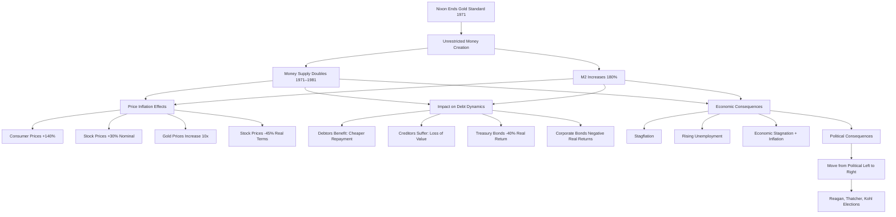

  - 

**The most significant difference between today's US money (dollars)—the world's dominant [currency](../../../../Financial%20Instruments/Lecture%20Notes-%20Financial%20Instruments/Teaching%20Note%201-%20Forward%20Rates%20Agreement/Forwards%20and%20Futures%20Notes.md) since 1944—and pre-1971 dollars is that modern [currency](../../../../Financial%20Instruments/Lecture%20Notes-%20Financial%20Instruments/Teaching%20Note%201-%20Forward%20Rates%20Agreement/Forwards%20and%20Futures%20Notes.md) has been fiat money since 1971. This has meant, and continues to mean, that the Federal Reserve (essentially the world's central banker given the US dollar's dominance as both medium of exchange and wealth store) can create money and credit more freely than previously possible. Other central banks possess similar capabilities, affecting all exchange media and wealth stores. For reasons explained earlier, this approach represents the simplest and most subtle method for governments to alleviate debt burdens and appropriate wealth.** Notably, fiat monetary systems have existed throughout history, so studying historical examples provides invaluable insights into their mechanisms and offers clues regarding our current system's future evolution as the [debt cycle](../../Chapters/US%20Debt%20Crisis%20and%20Adjustment%201928-1937.md) progresses.

While the gold-dollar system collapsed in 1971, the US maintained its dominant global position economically, militarily, and in most other dimensions. With most [global trade](../../../../Course%20Notes/International%20Trade%20Banking%20and%20Capital%20Markets%20Lecture%20Notes.md) and capital transactions conducted in dollars, the [currency](../../../../Financial%20Instruments/Lecture%20Notes-%20Financial%20Instruments/Teaching%20Note%201-%20Forward%20Rates%20Agreement/Forwards%20and%20Futures%20Notes.md) remained the world's leading monetary unit that governments, companies, and individuals preferred for savings, despite its terrible performance as a wealth store during the 1970s.

During 1971-81, borrower-debtors benefited substantially because the major devaluation beginning August 1971 produced immediate inflationary effects, accompanied by significant oil and commodity price increases within a [fiat monetary system](../How%20Countries%20Go%20Broke%20-%20Chapter%204%20&%20Chapter%205.md) that allowed central banks to continue credit creation while maintaining [low interest rates](../../../../Financial%20Markets%20and%20Institutions/III.%20Liquidity%20of%20Assets/Class%209-%20Bailouts%20and%20Bank%20Failures/Articles/The%20Economist%20Time%20Is%20Cheap.md).

The 1970s [inflation](../../Principles%20For%20Navigating%20Big%20Debt%20Cycles/Part%20II%20Detailed%20Case%20Studies/German%20Debt%20Crisis%20andHyperinflation%20(1918–1924)/War%20Economies%20and%20Hyperinflation.md) arrived in two waves driven by two [short-term debt](../../../../Financial%20Markets%20and%20Institutions/III.%20Liquidity%20of%20Assets/Class%207-%20CP,%20Repo,%20and%20the%20Crisis/When%20Safe%20Proved%20Risky%20Commercial%20Paper%20During%20the%20Financial%20Crisis%20of%202007%202009.md) cycles and geopolitical shifts. The significant [monetary policy](../../../../Financial%20Markets%20and%20Institutions/III.%20Liquidity%20of%20Assets/Class%209-%20Bailouts%20and%20Bank%20Failures/Articles/The%20Economist%20Regime%20Change.md) easing following the 1971 gold delinking initiated this trend. Subsequently, **in 1973, as the British Empire and colonialism disintegrated, a major geopolitical realignment in the Middle East triggered the first "oil shock," intensifying [inflation](../../Principles%20For%20Navigating%20Big%20Debt%20Cycles/Part%20II%20Detailed%20Case%20Studies/German%20Debt%20Crisis%20andHyperinflation%20(1918–1924)/War%20Economies%20and%20Hyperinflation.md).** This primarily represented a financial conflict, as typically occurs. More specifically, formerly colonized Middle Eastern countries (and others) were overthrowing their colonial rulers and nationalizing colonizers' asset claims. In the Middle East, Saudi Arabia, Iran, Iraq, and Libya nationalized most oil properties previously owned by the "Seven Sisters" (major oil companies), and in October 1973, Arab-Israeli conflict erupted. These developments substantially increased oil prices, prompting central banks—particularly the Federal Reserve—to implement highly accommodative monetary policies to mitigate rising prices' [economic impact](../../../../Financial%20Markets%20and%20Institutions/III.%20Liquidity%20of%20Assets/Class%209-%20Bailouts%20and%20Bank%20Failures/Articles/The%20Economist%20Fewer%20Or%20Even%20None.md), enabling further money growth and generating [inflation](../../Principles%20For%20Navigating%20Big%20Debt%20Cycles/Part%20II%20Detailed%20Case%20Studies/German%20Debt%20Crisis%20andHyperinflation%20(1918–1924)/War%20Economies%20and%20Hyperinflation.md) across almost all sectors, especially [commodities](../../../../Financial%20Markets/Financial%20Engineering%20and%20Arbitrage%20in%20the%20Financial%20Markets/PART%20I%20RELATIVE%20VALUE%20BUILDING%20BLOCKS/Chapter%203%20-%20Futures%20Markets/Futures%20Not%20Subject%20to%20Cash-And-Carry.md) and real estate. **Commodity producers, particularly in emerging markets, experienced economic booms, naturally attracting dollars from Europe, the US, and elsewhere as loans to emerging market commodity producers, initiating debt-financed booms and bubbles that contributed to widespread "stagflation" in the US and globally.**

During the early 1970s, substantial dollar holdings accumulated outside the US, particularly in European countries, creating the so-called Eurodollar market. These dollars required lending outlets. With global [inflation](../../Principles%20For%20Navigating%20Big%20Debt%20Cycles/Part%20II%20Detailed%20Case%20Studies/German%20Debt%20Crisis%20andHyperinflation%20(1918–1924)/War%20Economies%20and%20Hyperinflation.md) elevated due to previously described [currency](../../../../Financial%20Instruments/Lecture%20Notes-%20Financial%20Instruments/Teaching%20Note%201-%20Forward%20Rates%20Agreement/Forwards%20and%20Futures%20Notes.md) devaluations, [commodity prices](../../../../Financial%20Instruments/Lecture%20Notes-%20Financial%20Instruments/Teaching%20Note%201-%20Forward%20Rates%20Agreement/Primary%20vs.%20Secondary%20Commodities.md) remained high, making commodity-producing emerging markets attractive lending targets. This fueled an economic boom creating bubbles in these countries, with US, European, and some Japanese banks serving as the primary lender-creditors.

The 1970s witnessed two short-term money/credit/debt/economic cycles, each following classic patterns driven by Federal Reserve [monetary policy](../../../../Financial%20Markets%20and%20Institutions/III.%20Liquidity%20of%20Assets/Class%209-%20Bailouts%20and%20Bank%20Failures/Articles/The%20Economist%20Regime%20Change.md) easing and tightening decisions, though the second money/credit/debt and [inflation](../../Principles%20For%20Navigating%20Big%20Debt%20Cycles/Part%20II%20Detailed%20Case%20Studies/German%20Debt%20Crisis%20andHyperinflation%20(1918–1924)/War%20Economies%20and%20Hyperinflation.md) surge substantially exceeded the first.

During 1971-74, accommodative monetary conditions prevailed, [inflation](../../Principles%20For%20Navigating%20Big%20Debt%20Cycles/Part%20II%20Detailed%20Case%20Studies/German%20Debt%20Crisis%20andHyperinflation%20(1918–1924)/War%20Economies%20and%20Hyperinflation.md) and economic activity increased, and oil-exporting countries embargoed oil, further elevating oil prices and [inflation](../../Principles%20For%20Navigating%20Big%20Debt%20Cycles/Part%20II%20Detailed%20Case%20Studies/German%20Debt%20Crisis%20andHyperinflation%20(1918–1924)/War%20Economies%20and%20Hyperinflation.md). Consequently, from late 1973 through 1974, [the Fed](../../../../Financial%20Markets/Fixed%20Income%20Securities%20Tools%20for%20Today's%20Markets/Front%20Matter/Monetary%20Policy%20with%20Abundantreserves.md) tightened [monetary policy](../../../../Financial%20Markets%20and%20Institutions/III.%20Liquidity%20of%20Assets/Class%209-%20Bailouts%20and%20Bank%20Failures/Articles/The%20Economist%20Regime%20Change.md), raising [interest rates](../../../../Financial%20Markets/Fixed%20Income%20Securities%20Tools%20for%20Today's%20Markets/Chapter%202/Interest%20Rate%20Quotations.md) and inverting the yield curve, triggering severe market and economic contractions. This produced a recession, completing that [short-term debt](../../../../Financial%20Markets%20and%20Institutions/III.%20Liquidity%20of%20Assets/Class%207-%20CP,%20Repo,%20and%20the%20Crisis/When%20Safe%20Proved%20Risky%20Commercial%20Paper%20During%20the%20Financial%20Crisis%20of%202007%202009.md) cycle.

**The pattern repeated. Post-recession monetary easing drove [inflation](../../Principles%20For%20Navigating%20Big%20Debt%20Cycles/Part%20II%20Detailed%20Case%20Studies/German%20Debt%20Crisis%20andHyperinflation%20(1918–1924)/War%20Economies%20and%20Hyperinflation.md) and economic activity higher, followed by a second oil price shock stemming from internal political and international geopolitical conflicts.** In Iran, the Shah's regime collapsed, leading to the US embassy seizure and American hostage captivity by the new leadership. This initiated the ongoing Iranian conflict. These developments proved both inflationary and humiliating for the United States. The charts below display the average interest rate (combining 90-day Treasury bill and 10-year Treasury bond rates) against CPI [inflation](../../Principles%20For%20Navigating%20Big%20Debt%20Cycles/Part%20II%20Detailed%20Case%20Studies/German%20Debt%20Crisis%20andHyperinflation%20(1918–1924)/War%20Economies%20and%20Hyperinflation.md) from 1971 through 1981. As shown, during the 1970s [interest rates](../../../../Financial%20Markets/Fixed%20Income%20Securities%20Tools%20for%20Today's%20Markets/Chapter%202/Interest%20Rate%20Quotations.md) rose more slowly than [inflation](../../Principles%20For%20Navigating%20Big%20Debt%20Cycles/Part%20II%20Detailed%20Case%20Studies/German%20Debt%20Crisis%20andHyperinflation%20(1918–1924)/War%20Economies%20and%20Hyperinflation.md), creating low then negative [real interest rates](../../../../Financial%20Markets/Financial%20Asset%20Pricing%20Theory%20Overview/Chapter%2010%20-%20The%20Economics%20of%20the%20Term%20Structure%20of%20Interest%20Rates/Real%20Interest%20Rates%20and%20Aggregate%20Production.md) (dropping to -4% at times, compared to the historical 2% average). These artificially [low interest rates](../../../../Financial%20Markets%20and%20Institutions/III.%20Liquidity%20of%20Assets/Class%209-%20Bailouts%20and%20Bank%20Failures/Articles/The%20Economist%20Time%20Is%20Cheap.md) relative to [inflation](../../Principles%20For%20Navigating%20Big%20Debt%20Cycles/Part%20II%20Detailed%20Case%20Studies/German%20Debt%20Crisis%20andHyperinflation%20(1918–1924)/War%20Economies%20and%20Hyperinflation.md) benefited borrower-debtors while harming lender-creditors, encouraging borrowing and purchasing, driving [inflation](../../Principles%20For%20Navigating%20Big%20Debt%20Cycles/Part%20II%20Detailed%20Case%20Studies/German%20Debt%20Crisis%20andHyperinflation%20(1918–1924)/War%20Economies%20and%20Hyperinflation.md) higher with [interest rates](../../../../Financial%20Markets/Fixed%20Income%20Securities%20Tools%20for%20Today's%20Markets/Chapter%202/Interest%20Rate%20Quotations.md) following until [inflation](../../Principles%20For%20Navigating%20Big%20Debt%20Cycles/Part%20II%20Detailed%20Case%20Studies/German%20Debt%20Crisis%20andHyperinflation%20(1918–1924)/War%20Economies%20and%20Hyperinflation.md) became intolerable, forcing policy changes that reversed these patterns. The vertical lines in these charts mark January 1980.

The chart below illustrates additional real interest rate variations.

**Simultaneously, workers and labor unions gained strength, accelerating wage [inflation](../../Principles%20For%20Navigating%20Big%20Debt%20Cycles/Part%20II%20Detailed%20Case%20Studies/German%20Debt%20Crisis%20andHyperinflation%20(1918–1924)/War%20Economies%20and%20Hyperinflation.md) and reducing corporate profits. As shown below, labor's revenue share increased from 68% in 1965 to the US historical peak of 74% in 1980. This both reflected and influenced the political cycle accompanying the [debt cycle](../../Chapters/US%20Debt%20Crisis%20and%20Adjustment%201928-1937.md).**

**Eventually, conditions reached a breaking point. The combination of high [inflation](../../Principles%20For%20Navigating%20Big%20Debt%20Cycles/Part%20II%20Detailed%20Case%20Studies/German%20Debt%20Crisis%20andHyperinflation%20(1918–1924)/War%20Economies%20and%20Hyperinflation.md), weak dollar, poor [economic conditions](../../Chapters/US%20Debt%20Crisis%20and%20Adjustment%20(2007–2011).md), challenging business environment, and geopolitical crises became intolerable for voters.**

**The debt/money/economic, domestic-political, and international-geopolitical cycles had reached extreme positions, necessitating major changes that reversed previous conditions. Nearly everything transformed and moved in the opposite direction. Specifically, responding to uncontrolled [inflation](../../Principles%20For%20Navigating%20Big%20Debt%20Cycles/Part%20II%20Detailed%20Case%20Studies/German%20Debt%20Crisis%20andHyperinflation%20(1918–1924)/War%20Economies%20and%20Hyperinflation.md), Paul Volcker assumed Federal Reserve chairmanship to shift [monetary policy](../../../../Financial%20Markets%20and%20Institutions/III.%20Liquidity%20of%20Assets/Class%209-%20Bailouts%20and%20Bank%20Failures/Articles/The%20Economist%20Regime%20Change.md) from extremely accommodative to extraordinarily restrictive, while reacting to the generally deplorable conditions under left-leaning governments, Ronald Reagan, Margaret Thatcher, Helmut Kohl and other right-leaning leaders assumed power.** **In essence, one of those classic roughly synchronized debt/economic and political transitions occurred because public dissatisfaction with [economic conditions](../../Chapters/US%20Debt%20Crisis%20and%20Adjustment%20(2007–2011).md) generated discontent with national leadership and the governing party.**

**When Paul Volcker became Federal Reserve chairman in 1979 to combat [inflation](../../Principles%20For%20Navigating%20Big%20Debt%20Cycles/Part%20II%20Detailed%20Case%20Studies/German%20Debt%20Crisis%20andHyperinflation%20(1918–1924)/War%20Economies%20and%20Hyperinflation.md), he dramatically restricted money and credit growth**, resulting in the tightest monetary conditions and highest [interest rates](../../../../Financial%20Markets/Fixed%20Income%20Securities%20Tools%20for%20Today's%20Markets/Chapter%202/Interest%20Rate%20Quotations.md) "since the birth of Jesus Christ" (according to German Chancellor Helmut Schmidt).

**The chart below displays the CPI [inflation](../../Principles%20For%20Navigating%20Big%20Debt%20Cycles/Part%20II%20Detailed%20Case%20Studies/German%20Debt%20Crisis%20andHyperinflation%20(1918–1924)/War%20Economies%20and%20Hyperinflation.md) rate (as a simple [inflation](../../Principles%20For%20Navigating%20Big%20Debt%20Cycles/Part%20II%20Detailed%20Case%20Studies/German%20Debt%20Crisis%20andHyperinflation%20(1918–1924)/War%20Economies%20and%20Hyperinflation.md) proxy), the average three-month and 10-year interest rate (as a [simple interest rate](../../../../Financial%20Engineering/1.%20DeterministicCashFlows.md) proxy) and the yield curve (three-month rate minus 10-year rate—as a simple [monetary policy](../../../../Financial%20Markets%20and%20Institutions/III.%20Liquidity%20of%20Assets/Class%209-%20Bailouts%20and%20Bank%20Failures/Articles/The%20Economist%20Regime%20Change.md) tightness indicator). These charts reveal the two short-term credit cycles during the 1970s and the emerging cycle in the early 1980s. They demonstrate the extremely tight [monetary policy](../../../../Financial%20Markets%20and%20Institutions/III.%20Liquidity%20of%20Assets/Class%209-%20Bailouts%20and%20Bank%20Failures/Articles/The%20Economist%20Regime%20Change.md) implemented around 1980 to combat [inflation](../../Principles%20For%20Navigating%20Big%20Debt%20Cycles/Part%20II%20Detailed%20Case%20Studies/German%20Debt%20Crisis%20andHyperinflation%20(1918–1924)/War%20Economies%20and%20Hyperinflation.md).**

**Beyond monetary tightening, high real rates, and declining [inflation](../../Principles%20For%20Navigating%20Big%20Debt%20Cycles/Part%20II%20Detailed%20Case%20Studies/German%20Debt%20Crisis%20andHyperinflation%20(1918–1924)/War%20Economies%20and%20Hyperinflation.md), a shift occurred from liberal to conservative labor policies. Thatcher in the UK, Reagan in the US, and Kohl in Germany (all moderate conservatives) aggressively confronted labor [inflation](../../Principles%20For%20Navigating%20Big%20Debt%20Cycles/Part%20II%20Detailed%20Case%20Studies/German%20Debt%20Crisis%20andHyperinflation%20(1918–1924)/War%20Economies%20and%20Hyperinflation.md) and unions, reducing labor's revenue share, which decreased [inflation](../../Principles%20For%20Navigating%20Big%20Debt%20Cycles/Part%20II%20Detailed%20Case%20Studies/German%20Debt%20Crisis%20andHyperinflation%20(1918–1924)/War%20Economies%20and%20Hyperinflation.md) and increased corporate profits. These conservative leaders also reduced income and corporate profit taxes while pursuing more assertive geopolitical strategies.**

The new Iranian leadership released American hostages precisely as Reagan assumed office, responding to his threats of severe consequences. Thatcher engaged Argentina militarily and prevailed in a conflict over Argentina's attempt to seize the Falkland Islands—small, unremarkable British colonial possessions. Reagan intensified the Cold War with the Soviet Union, ultimately contributing to the Soviet Union's dissolution.

**The decisive actions by American central government and central bank leadership reshaped money flows and power dynamics, reversing most previous trends. Markets welcomed the combination of declining [interest rates](../../../../Financial%20Markets/Fixed%20Income%20Securities%20Tools%20for%20Today's%20Markets/Chapter%202/Interest%20Rate%20Quotations.md), falling [inflation](../../Principles%20For%20Navigating%20Big%20Debt%20Cycles/Part%20II%20Detailed%20Case%20Studies/German%20Debt%20Crisis%20andHyperinflation%20(1918–1924)/War%20Economies%20and%20Hyperinflation.md), high [real interest rates](../../../../Financial%20Markets/Financial%20Asset%20Pricing%20Theory%20Overview/Chapter%2010%20-%20The%20Economics%20of%20the%20Term%20Structure%20of%20Interest%20Rates/Real%20Interest%20Rates%20and%20Aggregate%20Production.md), improving profit margins, and reduced tax rates.** These conditions greatly benefited capitalists. I vividly recall these policy shifts and the accompanying mood transformation, especially these leaders' willingness to confront difficult challenges despite short-term pain.

**Consequently, the 1980s presented a stark contrast to the 1970s—featuring disinflationary growth, strong stock and bond performance in developed nations, and bursting debt bubbles leading to classic inflationary depressions in emerging markets.**

Throughout this period, I remained deeply engaged with these markets and the circumstances driving them, providing perspective that helped identify excellent [investment](../../../../Advanced%20Investments/An%20Asset%20Allocation%20Primer.md) opportunities and articulate the mechanics described in the previous chapter. However, I didn't fully comprehend all these mechanisms initially. In 1982, I made a significant error expecting the major [debt crisis](../../Chapters/US%20Debt%20Crisis%20and%20Adjustment%20(2007–2011).md) to severely impact American banks, stock markets, and the American and global economies. My mistake stemmed from failing to anticipate how dramatically global financial flows would shift away from emerging markets toward American markets, and how effectively the Federal Reserve and regulators would shield American banks. This failure provided painful but valuable lessons about monitoring capital flows, diversifying to reduce risk without sacrificing [returns](../../../../Financial%20Markets/Financial%20Asset%20Pricing%20Theory%20Overview/Chapter%203%20-%20%20Assets,%20Portfolios,%20and%20Arbitrage/Assets.md), and maintaining humility. This challenging experience ultimately proved beneficial by educating me, which substantially improved my own and Bridgewater's performance over the subsequent 30+ years.

**As demonstrated, all these major market and economic movements with significant political, geopolitical, and technological development impacts were fundamentally driven by money/debt/capital flows. Consequently, I committed to becoming a capital flow expert.**

**The decade from 1971-72 to 1981-82 represented an extremely painful yet archetypal period of debt restructurings and monetizations following the template described previously. Characteristically, the subsequent decade exhibited more contrasting than similar characteristics.**

### From 1982 to 1990: Falling Inflation, Strong Growth, and Levering Up; from One Debt Crisis to Another; Still Operating with an MP2 Monetary Policy

**The 1979-82 [monetary policy](../../../../Financial%20Markets%20and%20Institutions/III.%20Liquidity%20of%20Assets/Class%209-%20Bailouts%20and%20Bank%20Failures/Articles/The%20Economist%20Regime%20Change.md) transformation shifted the environment from favoring borrower-debtors (early 1970s) to benefiting lender-creditors (1980s). As shown below, this reduced [inflation](../../Principles%20For%20Navigating%20Big%20Debt%20Cycles/Part%20II%20Detailed%20Case%20Studies/German%20Debt%20Crisis%20andHyperinflation%20(1918–1924)/War%20Economies%20and%20Hyperinflation.md) while maintaining relatively high [real interest rates](../../../../Financial%20Markets/Financial%20Asset%20Pricing%20Theory%20Overview/Chapter%2010%20-%20The%20Economics%20of%20the%20Term%20Structure%20of%20Interest%20Rates/Real%20Interest%20Rates%20and%20Aggregate%20Production.md) throughout the 1980s.** The charts below update the previous illustration, displaying [interest rates](../../../../Financial%20Markets/Fixed%20Income%20Securities%20Tools%20for%20Today's%20Markets/Chapter%202/Interest%20Rate%20Quotations.md) and [inflation](../../Principles%20For%20Navigating%20Big%20Debt%20Cycles/Part%20II%20Detailed%20Case%20Studies/German%20Debt%20Crisis%20andHyperinflation%20(1918–1924)/War%20Economies%20and%20Hyperinflation.md) through 1990, demonstrating the 1980s' stark contrast with the 1970s. The [monetary policy](../../../../Financial%20Markets%20and%20Institutions/III.%20Liquidity%20of%20Assets/Class%209-%20Bailouts%20and%20Bank%20Failures/Articles/The%20Economist%20Regime%20Change.md) initiatives that ended the 1970s' decade-long rising [inflation](../../Principles%20For%20Navigating%20Big%20Debt%20Cycles/Part%20II%20Detailed%20Case%20Studies/German%20Debt%20Crisis%20andHyperinflation%20(1918–1924)/War%20Economies%20and%20Hyperinflation.md), rising [nominal interest rates](../../../../Financial%20Markets/Financial%20Asset%20Pricing%20Theory%20Overview/Chapter%2010%20-%20The%20Economics%20of%20the%20Term%20Structure%20of%20Interest%20Rates/Real%20and%20Nominal%20Interest%20Rates%20and%20Term%20Struc.md), and low [real interest rates](../../../../Financial%20Markets/Financial%20Asset%20Pricing%20Theory%20Overview/Chapter%2010%20-%20The%20Economics%20of%20the%20Term%20Structure%20of%20Interest%20Rates/Real%20Interest%20Rates%20and%20Aggregate%20Production.md) created the 1980s' falling [inflation](../../Principles%20For%20Navigating%20Big%20Debt%20Cycles/Part%20II%20Detailed%20Case%20Studies/German%20Debt%20Crisis%20andHyperinflation%20(1918–1924)/War%20Economies%20and%20Hyperinflation.md) and relatively high real interest rate environment, initiating a prolonged period of declining [interest rates](../../../../Financial%20Markets/Fixed%20Income%20Securities%20Tools%20for%20Today's%20Markets/Chapter%202/Interest%20Rate%20Quotations.md). With these developments and widening profit margins, the 1980s contrasted sharply with the 1970s. They provided almost ideal market and [economic conditions](../../Chapters/US%20Debt%20Crisis%20and%20Adjustment%20(2007–2011).md) with strong growth accompanied by falling [inflation](../../Principles%20For%20Navigating%20Big%20Debt%20Cycles/Part%20II%20Detailed%20Case%20Studies/German%20Debt%20Crisis%20andHyperinflation%20(1918–1924)/War%20Economies%20and%20Hyperinflation.md), declining [interest rates](../../../../Financial%20Markets/Fixed%20Income%20Securities%20Tools%20for%20Today's%20Markets/Chapter%202/Interest%20Rate%20Quotations.md), and substantial stock and bond market gains across the US and most developed countries. As shown below, from the early 1980s to early 1990s, [inflation](../../Principles%20For%20Navigating%20Big%20Debt%20Cycles/Part%20II%20Detailed%20Case%20Studies/German%20Debt%20Crisis%20andHyperinflation%20(1918–1924)/War%20Economies%20and%20Hyperinflation.md) decreased significantly while [interest rates](../../../../Financial%20Markets/Fixed%20Income%20Securities%20Tools%20for%20Today's%20Markets/Chapter%202/Interest%20Rate%20Quotations.md) and credit tightness declined more dramatically, transitioning the environment from strongly favoring lender-creditors and disadvantaging borrower-debtors to slightly benefiting borrower-debtors and slightly disadvantaging lender-creditors.

**Throughout the 1980s, the previously described tight monetary conditions and short dollar (debt) position drove the dollar higher until the 1985 "Plaza Accord"—an agreement to devalue the dollar, which would have occurred naturally as the substantial current account deficit and high dollar demand had become unsustainable.** During these years, [interest rates](../../../../Financial%20Markets/Fixed%20Income%20Securities%20Tools%20for%20Today's%20Markets/Chapter%202/Interest%20Rate%20Quotations.md) and [inflation](../../Principles%20For%20Navigating%20Big%20Debt%20Cycles/Part%20II%20Detailed%20Case%20Studies/German%20Debt%20Crisis%20andHyperinflation%20(1918–1924)/War%20Economies%20and%20Hyperinflation.md) exhibited significant fluctuations that seemed monumental while experiencing them. However, the overall dynamic remains clear (as shown in previous charts): during the 1980s, [inflation](../../Principles%20For%20Navigating%20Big%20Debt%20Cycles/Part%20II%20Detailed%20Case%20Studies/German%20Debt%20Crisis%20andHyperinflation%20(1918–1924)/War%20Economies%20and%20Hyperinflation.md) declined following the monetary tightening of 1980-82, then [interest rates](../../../../Financial%20Markets/Fixed%20Income%20Securities%20Tools%20for%20Today's%20Markets/Chapter%202/Interest%20Rate%20Quotations.md) also fell, tracking [inflation](../../Principles%20For%20Navigating%20Big%20Debt%20Cycles/Part%20II%20Detailed%20Case%20Studies/German%20Debt%20Crisis%20andHyperinflation%20(1918–1924)/War%20Economies%20and%20Hyperinflation.md) while maintaining relatively high [real interest rates](../../../../Financial%20Markets/Financial%20Asset%20Pricing%20Theory%20Overview/Chapter%2010%20-%20The%20Economics%20of%20the%20Term%20Structure%20of%20Interest%20Rates/Real%20Interest%20Rates%20and%20Aggregate%20Production.md). **These elevated real rates benefited lender-creditors and disadvantaged borrower-debtors. When [nominal interest rates](../../../../Financial%20Markets/Financial%20Asset%20Pricing%20Theory%20Overview/Chapter%2010%20-%20The%20Economics%20of%20the%20Term%20Structure%20of%20Interest%20Rates/Real%20and%20Nominal%20Interest%20Rates%20and%20Term%20Struc.md) declined after [inflation](../../Principles%20For%20Navigating%20Big%20Debt%20Cycles/Part%20II%20Detailed%20Case%20Studies/German%20Debt%20Crisis%20andHyperinflation%20(1918–1924)/War%20Economies%20and%20Hyperinflation.md) began falling, bonds and stocks appreciated significantly because future [cash flow](../../../../Financial%20Markets/Financial%20Engineering%20and%20Arbitrage%20in%20the%20Financial%20Markets/PART%20I%20RELATIVE%20VALUE%20BUILDING%20BLOCKS/Chapter%201%20-%20Purpose%20and%20Structure%20of%20Financial%20Markets/Preview%20of%20the%20Book.md) discount rates decreased, making borrowing more affordable. These conditions stimulated economic activity, creating ideal circumstances for US markets and the economy.**

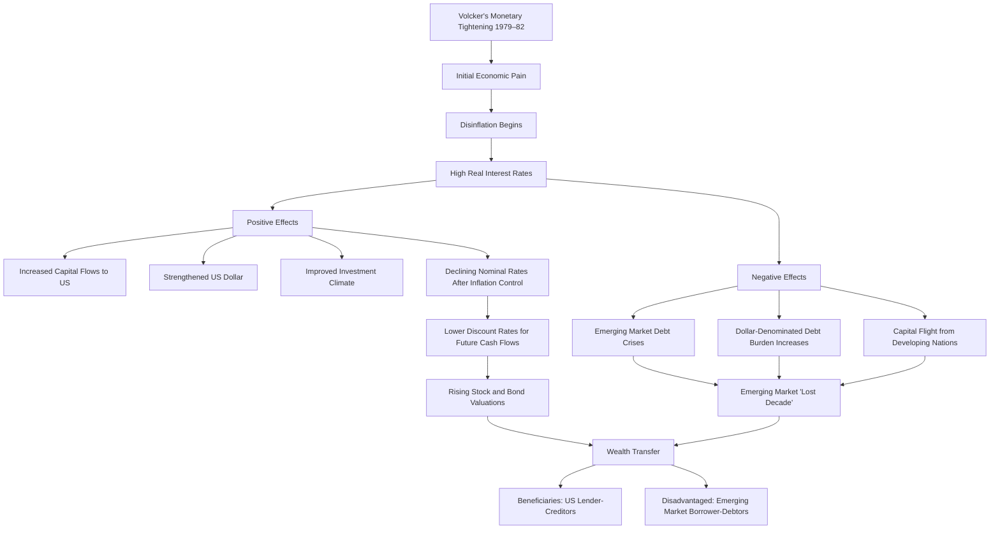

  - 

**But where did this wealth transfer originate? It came from** **borrower-debtors holding high-interest debt liabilities and assets, particularly emerging market borrower-debtors with dollar-denominated debt but local [currency](../../../../Financial%20Instruments/Lecture%20Notes-%20Financial%20Instruments/Teaching%20Note%201-%20Forward%20Rates%20Agreement/Forwards%20and%20Futures%20Notes.md) earnings, and their lenders (especially US multinational banks). Their experience followed classic patterns. High [interest rates](../../../../Financial%20Markets/Fixed%20Income%20Securities%20Tools%20for%20Today's%20Markets/Chapter%202/Interest%20Rate%20Quotations.md) not only increased dollar debt servicing costs but also contributed to dollar appreciation. Countries with debt liabilities and assets in foreign currencies they couldn't create (US dollars) faced debt default problems, while countries with debts in currencies they could create experienced [currency](../../../../Financial%20Instruments/Lecture%20Notes-%20Financial%20Instruments/Teaching%20Note%201-%20Forward%20Rates%20Agreement/Forwards%20and%20Futures%20Notes.md) collapses due to money printing. In other words, this produced monetary [inflation](../../Principles%20For%20Navigating%20Big%20Debt%20Cycles/Part%20II%20Detailed%20Case%20Studies/German%20Debt%20Crisis%20andHyperinflation%20(1918–1924)/War%20Economies%20and%20Hyperinflation.md) (in currencies they could print) and monetary deflation in currencies they owed but couldn't print.**

**The late 1970s debt bubbles transformed into classic debt busts when significant tightening imposed hardship on both parties through painful deleveraging during the 1980s. Countries experiencing debt busts, including many emerging economies, underwent a classic complete [debt cycle](../../Chapters/US%20Debt%20Crisis%20and%20Adjustment%201928-1937.md) over these 20+ years, including inflationary depressions due to substantial debt monetization that devalued their local [currency](../../../../Financial%20Instruments/Lecture%20Notes-%20Financial%20Instruments/Teaching%20Note%201-%20Forward%20Rates%20Agreement/Forwards%20and%20Futures%20Notes.md)-denominated money and debt, while simultaneously facing deflationary debt default problems with foreign [currency](../../../../Financial%20Instruments/Lecture%20Notes-%20Financial%20Instruments/Teaching%20Note%201-%20Forward%20Rates%20Agreement/Forwards%20and%20Futures%20Notes.md) debt they couldn't monetize.** This cycle followed the template outlined in the previous chapter. For these countries, the [debt crisis](../../Chapters/US%20Debt%20Crisis%20and%20Adjustment%20(2007–2011).md) created a classic "lost decade" with inflationary depressions and conventional debt restructurings for lenders. Eventually, in 1991, the crisis resolved through classic means described previously—local [currency](../../../../Financial%20Instruments/Lecture%20Notes-%20Financial%20Instruments/Teaching%20Note%201-%20Forward%20Rates%20Agreement/Forwards%20and%20Futures%20Notes.md) debt devaluation and foreign [currency](../../../../Financial%20Instruments/Lecture%20Notes-%20Financial%20Instruments/Teaching%20Note%201-%20Forward%20Rates%20Agreement/Forwards%20and%20Futures%20Notes.md) [debt restructuring](../../../../Financial%20Markets%20and%20Institutions/II.%20The%20Roles%20of%20Banks%20and%20Derivative%20Markets%20in%20Resolving%20Problems%20Inherent%20in%20Debt%20Contracts/Class%204-%20Restructuring%20Public%20Debt/Class%20Slide%204-Restructuring%20Debt%20Outside%20Bankruptcy.md). Near the cycle's conclusion, most heavily indebted governments sold national assets to accumulate [foreign exchange reserves](../../../China%20Foreign%20Exchange%20Reserves/Foreign%20Exchange%20Reserves%20-%20Wikipedia/Foreign%20Exchange%20Reserves%20-%20Wikipedia.md) and pegged their currencies to the dollar, completing their Big Debt Cycles.

**Naturally, each country experienced its unique cycle, and we'll explore several cases, notably China and Japan in Chapters 13 and 14. However, significant geopolitical shifts during this period also impacted the major cycle for all nations in important ways.**

**During the 1980s, the geopolitical landscape transformed as the Soviet Union collapsed, China ascended, and wealth disparities widened. These changes primarily stemmed from the Soviet Union's inadequate financial and economic system.** Specifically, the United States possessed substantially greater financial resources and productivity than the Soviet Union, outcompeting it in virtually all domains; notably, Reagan had the US outspend and outmaneuver the Soviet Union militarily. This led to the Soviet Union's cascade of debt, economic, [currency](../../../../Financial%20Instruments/Lecture%20Notes-%20Financial%20Instruments/Teaching%20Note%201-%20Forward%20Rates%20Agreement/Forwards%20and%20Futures%20Notes.md), political, and geopolitical failures, manifested in the Berlin Wall's fall in late 1989 and the Soviet Union's official dissolution in December 1991.

**Deng Xiaoping's 1978 ascension to power in China initiated profound 1980s changes that significantly shaped the evolving world order through the present. Deng's rise marked the beginning of China's major money/credit/debt/[economic cycle](../../../Economic%20Stabilization%20Notes/Business%20Cycles-%20Introduction,%20Characteristics,%20and%20History.md). Previously, credit/debt/savings/economic activity remained minimal. Deng transformed this through "open door" and "reform" policies, welcoming foreign capitalists with their capital and expertise. This pivot from pure, extreme communism toward market-oriented, capitalism-influenced "communism" dramatically impacted China and the global community. This transition unleashed unprecedented productivity,** making China the greatest trading and manufacturing power in history by producing numerous tradable goods at significantly lower costs than competitors. This transformation profoundly affected China and other nations, as we'll explore later. Through my Chinese relationships and financial market expertise, I contributed to and closely observed China's remarkable transformation during this period. I'll detail China's [Big Cycle](../How%20Countries%20Go%20Broke%20-%20Chapter%202%20&%20Chapter%203.md) evolution comprehensively in Chapter 13. Suffice to say, China achieved extraordinary productivity levels, flooding the world with competitively priced products, accumulating substantial wealth, and lending extensively to Americans and others for Chinese goods purchases. Consequently, Americans received products while Chinese acquired American debt, creating a relationship whose ultimate beneficiary remains debatable.

**The 1980s witnessed critical technological innovations including laptop computers, lithium-ion batteries, internet, search engines, thought digitalization, applications, DNA profiling, alongside major advances in GPS, video gaming consoles, microprocessors, and satellite television. Americans maintained leadership in innovation and [investment](../../../../Advanced%20Investments/An%20Asset%20Allocation%20Primer.md) while other countries dominated production.** **Most significantly, during the 1980s, technological development, led by entrepreneurs with capitalist backing, advanced internet development, culminating in the World Wide Web's 1991 launch, which spawned the 1990s dot-com bubble within that decade's [Big Debt Cycle](../How%20Countries%20Go%20Broke%20Introduction%20&%20Chapter%201.md), eventually bursting in 2000 when the Federal Reserve tightened [monetary policy](../../../../Financial%20Markets%20and%20Institutions/III.%20Liquidity%20of%20Assets/Class%209-%20Bailouts%20and%20Bank%20Failures/Articles/The%20Economist%20Regime%20Change.md) to control rapid debt-financed speculation on digital transformation.**

### From 1990 Until 2000: More Disinflation and Leveraging Up, Which Led to a Bubble

**Briefly, like all decades, the 1990s brought numerous developments that seemed momentous contemporaneously but are barely memorable retrospectively. I wonder whether I'm providing excessive or insufficient detail. During my experience of these events, every minute felt interminable; now I struggle to recall them, reinforcing my principle that "everything seems larger up close," which has helped maintain perspective while navigating these transformations.**

**In retrospect, I'm pleased with my navigation through these changes, which I attribute to [lessons learned](../../../../Financial%20Markets%20and%20Institutions/III.%20Liquidity%20of%20Assets/Class%208-%20Markets,%20Meltdowns,%20and%20Arbitrage/Lessons%20From%20The%20Crisis.md) and conveyed in this analysis. In summary, the key developments include:**

- **The Soviet Union's 1991 collapse.**
- **Iraq's Kuwait invasion to seize oil resources and the subsequent 1990-91 Gulf War, contributing to rising oil prices, tight [monetary policy](../../../../Financial%20Markets%20and%20Institutions/III.%20Liquidity%20of%20Assets/Class%209-%20Bailouts%20and%20Bank%20Failures/Articles/The%20Economist%20Regime%20Change.md), and a classic recession from mid-1990 through early 1991.**
- **European currencies linked through the Exchange Rate Mechanism (ERM) since 1979 separated in September 1992. Subsequently, Europe evolved from independent nations into the European Union (1993) and a [currency](../../../../Financial%20Instruments/Lecture%20Notes-%20Financial%20Instruments/Teaching%20Note%201-%20Forward%20Rates%20Agreement/Forwards%20and%20Futures%20Notes.md) union with the euro's 1999 creation. These choices pursued unification despite the immense challenge of integrating diverse, independent populations with extensive conflict histories because in the globalized world, they lacked viability as separate economic or geopolitical powers. The union remains highly fragmented and declining in competitiveness.**
- **The 1997-98 Asian [financial crisis](../../../../Financial%20Markets%20and%20Institutions/III.%20Liquidity%20of%20Assets/Class%209-%20Bailouts%20and%20Bank%20Failures/Squam%20Lake%20Group%20Letter.md), primarily affecting Thailand, Indonesia, Malaysia, and South Korea, impacted all regional countries through the "Asian Contagion." As typical, these debt/economic crises triggered internal social and political conflicts across affected nations to varying degrees. Indonesia experienced the most severe consequences, followed by Malaysia, Thailand, while South Korea and China faced less significant disruption. These crises followed classic patterns, displaying all characteristic leading indicators.**
- **Throughout most of the decade, globalization and internet connectivity were considered beneficial and flourished.**
- **Climate change began attracting attention as a concern.**
- **As is typical, the 1990s witnessed remarkable technological innovation, particularly Wi-Fi, smartphones, and e-commerce, alongside significant advances in GPS, video gaming, and perhaps most importantly, artificial intelligence.**
- **As with all major cycles, significant inventions received financing accompanied by [debt and equity](../../../../Financial%20Markets%20and%20Institutions/I-%20Introduction%20to%20Financial%20Markets%20and%20Intermediation/I-%20Introduction%20to%20Financial%20Markets%20and%20Intermediation/Class%20Note%201-%20Borrower-Lender%20conflicts%20and%20implied%20agency%20problems.md) cycles (comparable to steam engines and railroads historically). In this instance, early development generated excitement evolving into a bubble (1995-99), contributing to economic overheating and rising [inflation](../../Principles%20For%20Navigating%20Big%20Debt%20Cycles/Part%20II%20Detailed%20Case%20Studies/German%20Debt%20Crisis%20andHyperinflation%20(1918–1924)/War%20Economies%20and%20Hyperinflation.md), prompting central bank (Federal Reserve) monetary tightening that burst the bubble (March 2000), producing a typical short-term cyclical market and economic downturn. This cycle ended when tighter credit and economic contraction reduced [inflation](../../Principles%20For%20Navigating%20Big%20Debt%20Cycles/Part%20II%20Detailed%20Case%20Studies/German%20Debt%20Crisis%20andHyperinflation%20(1918–1924)/War%20Economies%20and%20Hyperinflation.md), leading [the Fed](../../../../Financial%20Markets/Fixed%20Income%20Securities%20Tools%20for%20Today's%20Markets/Front%20Matter/Monetary%20Policy%20with%20Abundantreserves.md) to ease [monetary policy](../../../../Financial%20Markets%20and%20Institutions/III.%20Liquidity%20of%20Assets/Class%209-%20Bailouts%20and%20Bank%20Failures/Articles/The%20Economist%20Regime%20Change.md) through conventional means.** **Also during this period, President Clinton transformed a substantial budget deficit into a surplus, offering valuable lessons for addressing similar challenges. The key elements of this transformation included:**
- **Implementation during declining unemployment and robust economic and profit growth, when tax revenues increased and fiscal contraction (a growth-inhibiting, [inflation](../../Principles%20For%20Navigating%20Big%20Debt%20Cycles/Part%20II%20Detailed%20Case%20Studies/German%20Debt%20Crisis%20andHyperinflation%20(1918–1924)/War%20Economies%20and%20Hyperinflation.md)-reducing force) could be well-absorbed. In other words, the fiscal tightening was counter-cyclical.**
- **Significant but moderate tax increases and spending reductions.**
- **Bipartisan collaboration (essential for implementation) culminating in the 1997 Balanced Budget Amendment.**
- **Eventual and repeated circumvention through simple majority votes because it represented merely a legislative statute rather than a constitutional amendment. This differs from Germany's approach following the [Weimar Republic](../../Chapters/Inflationary%20Depressions%20and%20Currency%20Crises.md)'s hyperinflation, which established a constitutional amendment that has proven effective since.**

### From 2000 to 2008: From the Bubble Bursting to Deleveraging to Releveraging Up to Creating a New Bubble That Popped and Led to the Great Financial Crisis and Debt Monetization

- **I recall Y2K as an anticipated crisis that never materialized, like many others, while unexpected developments actually occurred.**
- **The debt/asset bubble burst in March 2000, causing the tech-heavy Nasdaq to plummet approximately 80%.**
- **The September 11, 2001 attacks on the World Trade Center and Pentagon initiated the terror war leading to Afghanistan and Iraq conflicts,** though great power competition remained minimal. This aggravated problems following the debt bubble collapse, exacerbating weakness.
- **These events triggered a recession that reduced [inflation](../../Principles%20For%20Navigating%20Big%20Debt%20Cycles/Part%20II%20Detailed%20Case%20Studies/German%20Debt%20Crisis%20andHyperinflation%20(1918–1924)/War%20Economies%20and%20Hyperinflation.md) and prompted the next [short-term debt](../../../../Financial%20Markets%20and%20Institutions/III.%20Liquidity%20of%20Assets/Class%207-%20CP,%20Repo,%20and%20the%20Crisis/When%20Safe%20Proved%20Risky%20Commercial%20Paper%20During%20the%20Financial%20Crisis%20of%202007%202009.md) cycle's credit easing, generating recovery.**
- **In 2006-2007, another classic bubble emerged. This substantial crisis, termed the 2008 [global financial crisis](../../../../Financial%20Engineering/8.%20Credit%20Modeling%20and%20Credit%20Derivatives.md) (GFC), originated in the mortgage/real estate sector financed by excessive debt, creating widespread debt problems affecting virtually everyone globally, similar to the [Great Depression](../../Chapters/US%20Debt%20Crisis%20and%20Adjustment%201928-1937.md) (1929-39).**
- **What began in real estate quickly spread to other financial assets and the real economy—unemployment reached 10% by late 2009 while major stock indices declined over 50% from their 2007 peaks.** **The charts below illustrate [short-term debt](../../../../Financial%20Markets%20and%20Institutions/III.%20Liquidity%20of%20Assets/Class%207-%20CP,%20Repo,%20and%20the%20Crisis/When%20Safe%20Proved%20Risky%20Commercial%20Paper%20During%20the%20Financial%20Crisis%20of%202007%202009.md) cycles reflected in unemployment rates and equity prices.**

- **This drove [interest rates](../../../../Financial%20Markets/Fixed%20Income%20Securities%20Tools%20for%20Today's%20Markets/Chapter%202/Interest%20Rate%20Quotations.md) to 0% (and below) worldwide. Reaching zero eliminated central banks' ability to stimulate the next credit/debt/economic expansion wave through interest rate reductions, forcing them toward money printing and financial asset purchases, also known as debt monetization, [quantitative easing](../../../../Financial%20Markets/Fixed%20Income%20Securities%20Tools%20for%20Today's%20Markets/Front%20Matter/Negative%20Rates%20and%20Qe%20in%20Europe%20and%20Japan.md), and what I term [Monetary Policy](../../../../Financial%20Markets%20and%20Institutions/III.%20Liquidity%20of%20Assets/Class%209-%20Bailouts%20and%20Bank%20Failures/Articles/The%20Economist%20Regime%20Change.md) 3 (MP3) because it classically follows MP2 (interest-rate-controlled money and credit growth).**

In this situation, as typically occurs, central banks implemented "money printing" (balance sheet expansion) alongside debt purchases and guarantees to compensate for private sector debt asset demand shortfalls while maintaining artificially [low interest rates](../../../../Financial%20Markets%20and%20Institutions/III.%20Liquidity%20of%20Assets/Class%209-%20Bailouts%20and%20Bank%20Failures/Articles/The%20Economist%20Time%20Is%20Cheap.md). They pursue this approach regardless of economic rationale because their primary objective involves market and economic stabilization rather than profit generation. **During this [Big Debt Cycle](../How%20Countries%20Go%20Broke%20Introduction%20&%20Chapter%201.md) phase, the central bank transitions from private investor to major debt purchaser and owner (primary creditor). Because central banks remain unconcerned about losses from devalued debt holdings and [liquidity](../../../../Financial%20Markets%20and%20Institutions/III.%20Liquidity%20of%20Assets/Class%205-%20Private%20Information,%20Liquidity,%20and%20Securitization/Class%20Note%2010%20Liquidity%20and%20Class%20Note%2010%20Liquidity%20and%20Liquidity%20Managementliquidity%20management.md) constraints, they can continuously prevent debt crises through money printing and debt purchases.** **They willingly accept substantial losses and negative net worth to protect government and private sector spending capabilities despite poor finances. This intervention manifests through debt monetization or [quantitative easing](../../../../Financial%20Markets/Fixed%20Income%20Securities%20Tools%20for%20Today's%20Markets/Front%20Matter/Negative%20Rates%20and%20Qe%20in%20Europe%20and%20Japan.md)—essentially identical processes with minor differences.** Central bank balance sheet changes reveal this dynamic as they acquire debt assets by providing cash and credit to debt sellers. In the United States, Europe, and Japan, central banks own approximately 15%, 30%, and 40% of [central government debt](../How%20Countries%20Go%20Broke-Chapter%2015%20&%20Chapter%2016.md), and roughly 5%, 10%, and 20% of total debt, respectively. The following charts illustrate this process in the US, showing the timing of 0% interest rate threshold and the Federal Reserve's balance sheet expansion through money printing. This marks the transition from [Monetary Policy](../../../../Financial%20Markets%20and%20Institutions/III.%20Liquidity%20of%20Assets/Class%209-%20Bailouts%20and%20Bank%20Failures/Articles/The%20Economist%20Regime%20Change.md) 2 (interest-rate-driven policy balancing money and credit supply/demand through interest rate adjustments) to [Monetary Policy](../../../../Financial%20Markets%20and%20Institutions/III.%20Liquidity%20of%20Assets/Class%209-%20Bailouts%20and%20Bank%20Failures/Articles/The%20Economist%20Regime%20Change.md) 3 ([central bank intervention](../How%20Countries%20Go%20Broke-Chapter%206%20&%20Chapter%207.md) addressing demand shortfalls through long-term debt asset purchases and balance sheet expansion). This pattern emerged not only in the US but across most countries.

**During the 27 years from 1981 (when [interest rates](../../../../Financial%20Markets/Fixed%20Income%20Securities%20Tools%20for%20Today's%20Markets/Chapter%202/Interest%20Rate%20Quotations.md) reached "the highest levels since the birth of Jesus Christ") to 2008 (when [interest rates](../../../../Financial%20Markets/Fixed%20Income%20Securities%20Tools%20for%20Today's%20Markets/Chapter%202/Interest%20Rate%20Quotations.md) hit 0%), the [Big Cycle](../How%20Countries%20Go%20Broke%20-%20Chapter%202%20&%20Chapter%203.md) unfolded through four short-term credit/debt/economic cycles, and when [interest rates](../../../../Financial%20Markets/Fixed%20Income%20Securities%20Tools%20for%20Today's%20Markets/Chapter%202/Interest%20Rate%20Quotations.md) reached zero, the interest-rate-driven [monetary policy](../../../../Financial%20Markets%20and%20Institutions/III.%20Liquidity%20of%20Assets/Class%209-%20Bailouts%20and%20Bank%20Failures/Articles/The%20Economist%20Regime%20Change.md) (MP2) necessarily transitioned to quantitative-easing-driven [monetary policy](../../../../Financial%20Markets%20and%20Institutions/III.%20Liquidity%20of%20Assets/Class%209-%20Bailouts%20and%20Bank%20Failures/Articles/The%20Economist%20Regime%20Change.md) (MP3).**

Having studied the major cycles from 1918 to 1945 (from World War I's conclusion) and the subsequent monetary system established after World War II, eight years before MP3 began, we incorporated rules into our [investment system](../../../../Financial%20Markets/Financial%20Trading%20and%20Markets/Chapter%2010%20Evaluating%20Trading%20Strategies%20and%20Performance.md) specifying that if a debt contraction crisis occurred with short-term Treasury and federal funds rates approaching 0%, we would anticipate a severe contraction until the central government and central banks implemented substantial stimulus comparable to their March 1933 response. This approach proved advantageous in 2008 because we understood the dynamics, enabling substantial profits while others incurred significant losses. I recognized the [Big Cycle](../How%20Countries%20Go%20Broke%20-%20Chapter%202%20&%20Chapter%203.md) pattern in [interest rates and debt](../How%20Countries%20Go%20Broke%20Introduction%20&%20Chapter%201.md), observing that since the 1979-82 interest rate peak, every cyclical peak and trough in rates fell below its predecessor until approaching 0% while debt levels increased, prompting me to consider potential consequences when rates hit zero. Historical precedent (1933) showed that central banks responded by [printing money](../../Chapters/Inflationary%20Depressions%20and%20Currency%20Crises.md) and purchasing debt. I also noticed how declining real and [nominal interest rates](../../../../Financial%20Markets/Financial%20Asset%20Pricing%20Theory%20Overview/Chapter%2010%20-%20The%20Economics%20of%20the%20Term%20Structure%20of%20Interest%20Rates/Real%20and%20Nominal%20Interest%20Rates%20and%20Term%20Struc.md) shifted conditions from favoring lender-creditors toward benefiting borrower-debtors, allowing debt/income ratios to rise. This downward interest rate trend and increasing debt burden established the foundation for the next major [monetary policy](../../../../Financial%20Markets%20and%20Institutions/III.%20Liquidity%20of%20Assets/Class%209-%20Bailouts%20and%20Bank%20Failures/Articles/The%20Economist%20Regime%20Change.md) transformation, which we'll explore in the next chapter.

**Here are some notable events in internal and external orders, technology, and natural forces during this 2000 to 2008 period:**

- **Despite the tech bubble collapse, internet penetration and influence continued rapid expansion while many established leaders faltered and new entities emerged and thrived.** Social media platforms (including Facebook and YouTube) launched in 2004-2005. The iPhone debuted in 2007, creating the "everything device" integrating numerous functionalities (phone, camera, and application-based tools). This era witnessed internet and computing technologies permeating virtually every aspect of daily life. Americans and the US system maintained significantly greater influence than competitors, though China began effectively copying and competing.
    
- **Domestically, US political polarization intensified, with Democrats shifting from 1990s centrism toward more progressive leadership under Barack Obama (though notably moderate by contemporary Democratic standards), while Republicans eventually distanced themselves from George W. Bush for insufficient populist credentials.** As typically occurs at this cycle stage, media adopted partisan positions and employed propaganda techniques, rendering US media increasingly polarized and polarizing.
    
- **Chinese and other emerging market producers enhanced competitiveness,** with Chinese manufacturing spanning everyday items (apparel, toys, appliances, etc.) in the 1990s-2000s to automobiles and sophisticated technology products currently. This arrangement benefited Chinese exporters who generated substantial revenues and American and other consumers who secured value purchases, supported by Chinese lending to fund US deficits. This dynamic paralleled the earlier Japanese goods manufacturers and customer relationship. In this instance, Chinese producers earned and invested proceeds (purchasing US bonds), simultaneously experiencing protectionism due to manufacturing job losses in the US. China, following Japan's example, directed significant earnings toward [foreign exchange reserves](../../../China%20Foreign%20Exchange%20Reserves/Foreign%20Exchange%20Reserves%20-%20Wikipedia/Foreign%20Exchange%20Reserves%20-%20Wikipedia.md), predominantly in [US Treasuries](../../../../Credit%20Markets/Credit%20Market%20PSETS/Credit%20Market%20Homework%201.md) given the dollar's [reserve currency status](../How%20Countries%20Go%20Broke-Chapter%2015%20&%20Chapter%2016.md). This enabled substantial US government deficit and debt expansion without immediate consequences (at least thus far), while helping constrain global goods [inflation](../../Principles%20For%20Navigating%20Big%20Debt%20Cycles/Part%20II%20Detailed%20Case%20Studies/German%20Debt%20Crisis%20andHyperinflation%20(1918–1924)/War%20Economies%20and%20Hyperinflation.md), allowing central banks to maintain accommodative monetary policies and contributing to equity market appreciation. This dynamic benefited production means owners (capitalists) while disadvantaging displaced workers.
    
- **The European Union and NATO continued eastward expansion, incorporating additional Eastern European nations and approaching Russian borders.**
    
- **Global warming persisted,** with several notable natural events, such as Hurricane Katrina devastating New Orleans in 2005, raising increased environmental concerns.
    

## Chapter 11: The History and Lessons from Phase 3, from 2008 to 2020—Fiat Money and Debt Monetization (Monetary Policy 3)

**During 2008-20:**

- **Two short-term credit/debt/economic cycles occurred. Each cycle witnessed greater debt creation and monetization than its predecessor.**

- **Specifically, by late 2008 the interest-rate-driven monetary system ([Monetary Policy](../../../../Financial%20Markets%20and%20Institutions/III.%20Liquidity%20of%20Assets/Class%209-%20Bailouts%20and%20Bank%20Failures/Articles/The%20Economist%20Regime%20Change.md) 2) could no longer stimulate money and credit creation as [interest rates](../../../../Financial%20Markets/Fixed%20Income%20Securities%20Tools%20for%20Today's%20Markets/Chapter%202/Interest%20Rate%20Quotations.md) reached 0%, forcing central banks to compensate for inadequate free-market debt asset demand through money printing and asset purchases. Consequently, a new monetary framework (MP3)—whereby central banks purchased substantial debt and provided credit through balance sheet expansion, essentially [printing money](../../Chapters/Inflationary%20Depressions%20and%20Currency%20Crises.md), monetizing debt, and implementing [quantitative easing](../../../../Financial%20Markets/Fixed%20Income%20Securities%20Tools%20for%20Today's%20Markets/Front%20Matter/Negative%20Rates%20and%20Qe%20in%20Europe%20and%20Japan.md)—replaced MP2.** While subtle technical distinctions exist between these approaches (which I won't elaborate on), they fundamentally represent **central bank creation and provision of money and credit to government and markets compensating for insufficient private market lending—what I designate [Monetary Policy](../../../../Financial%20Markets%20and%20Institutions/III.%20Liquidity%20of%20Assets/Class%209-%20Bailouts%20and%20Bank%20Failures/Articles/The%20Economist%20Regime%20Change.md) 3.** This began in 2008, marking the first implementation of this [monetary policy](../../../../Financial%20Markets%20and%20Institutions/III.%20Liquidity%20of%20Assets/Class%209-%20Bailouts%20and%20Bank%20Failures/Articles/The%20Economist%20Regime%20Change.md) since 1933 (75 years earlier). Such transitions to debt monetization have recurred throughout history, typically signaling the long-term [debt cycle](../../Chapters/US%20Debt%20Crisis%20and%20Adjustment%201928-1937.md)'s late phase.
    
- **While the 2008 crisis originated in the US, it evolved into a global crisis, with virtually all developed central banks (and many emerging market central banks) transitioning from MP2 to MP3. These interventions increased financial asset prices while reducing yields for lender-creditors and creating inexpensive capital for borrower-creditors. The stimulative monetary policies disproportionately benefited wealthy holders of financial assets. Government bank bailouts reinforced perceptions of systemic favoritism toward the wealthy, intensifying resentment toward affluent capitalists, particularly those apparently responsible for problems who escaped consequences while profiting substantially. Eventually, the US successfully managed private sector debt challenges and engineered economic recovery, though public debt continued rising (effectively postponing the inevitable; more on this later).**
    
- **Continued increases in Chinese and other foreign-produced imports eliminated American jobs while technological advancement simultaneously displaced workers. These forces contributed to middle-class erosion, intensifying tensions between "elites/capitalists" and the working class. China accumulated significant [US debt](../../../../Financial%20Markets/Fixed%20Income%20Securities%20Tools%20for%20Today's%20Markets/Front%20Matter/US%20Markets.md) assets while the US sacrificed numerous jobs in uncompetitive industries, widening wealth and values disparities in the US, fueling anti-China sentiment, and exacerbating political and social polarization. Economically disadvantaged individuals believed that establishment "elites" and the system prioritized profit maximization at American workers' expense. This perspective, combined with the 2008 debt/economic crisis and the perception that government bailouts of [financial institutions](../../../../Financial%20Markets%20and%20Institutions/Financial%20Markets%20and%20Institutions%20Lecture%20Notes.md) primarily benefited financial asset holders rather than average citizens, significantly influenced domestic discord. Consequently, the [financial crisis](../../../../Financial%20Markets%20and%20Institutions/III.%20Liquidity%20of%20Assets/Class%209-%20Bailouts%20and%20Bank%20Failures/Squam%20Lake%20Group%20Letter.md) catalyzed both right-wing populism (Tea Party movement) and left-wing populism (Occupy Wall Street).**
    
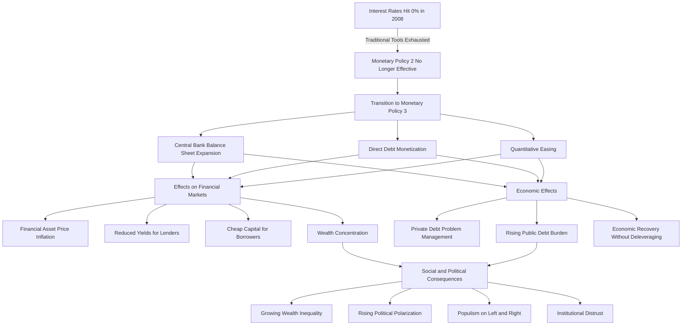

  - 

**Growing wealth and values differences intensified conflict between political and social conservatives and progressives across most countries, particularly the United States. In the US, right-wing populism's rise, especially among non-college-educated, non-urban white populations, facilitated Donald Trump's 2016 election. This fundamentally altered American approaches to domestic and global order in profound ways that remained incompletely understood for years (and, as I write in January 2025, remain partially unrecognized). I'll explore these transformations more extensively in Chapter 12. However, stated concisely, President Trump initiated a shift in domestic, international, economic, political, and geopolitical frameworks toward more autocratic, top-down, rightist, nationalistic, protectionist, militaristic, and aggressive orientations. These policy shifts toward confrontation over cooperation, reflected in multilateral organization deterioration and increased unilateralism, parallel developments preceding World War I and World War II and numerous historical precedents.**

- **Trump's election produced substantial tax reductions for corporations and individuals, three conservative Supreme Court appointments, significant regulatory reductions, renegotiation of [international trade](../../../Globalization/Chapter%202-The%20Principle%20Of%20Comparative%20Advantage.md) and military support arrangements, substantial tariffs, and immigration restrictions. Income and capital gains tax cuts alongside regulatory relief stimulated [stock price](../../../../Financial%20Engineering/Derivatives/Part%20IV%20-%20Options/Chapter%2016%20-%20Black–Scholes%20Model.md) appreciation and economic growth, reducing unemployment to a 50-year low of 3.5% by late 2019.**
    
- **Then the COVID pandemic, the most significant since the 1918-19 Spanish flu, emerged in early 2020.**
    

These developments and outcomes (detailed further in my book _Principles for Dealing with the Changing World Order_ for interested readers) parallel early 1930s patterns. They represent predictable consequences when viewed through the [Big Cycle](../How%20Countries%20Go%20Broke%20-%20Chapter%202%20&%20Chapter%203.md) framework.

**The major debt, political, and geopolitical cycles and their interrelationships have evolved in largely predictable ways, contributing to the overall [Big Cycle](../How%20Countries%20Go%20Broke%20-%20Chapter%202%20&%20Chapter%203.md)'s classic progression. What we observed and currently witness represents these three major cycles unfolding alongside significant disruptions from natural forces (pandemic and climate change) and technological advancement, particularly artificial intelligence (promising substantial productivity improvements while creating other disruptions).**

**In Europe, events closely followed my previously outlined template, though Europe then comprised 17 Eurozone countries, some debtors and others creditors, complicating the process.** The [debt cycle](../../Chapters/US%20Debt%20Crisis%20and%20Adjustment%201928-1937.md) template I described earlier manifested as heavily indebted countries with euro-denominated debt (which they couldn't print) suffered predictably, while the European Central Bank responded conventionally. [Greece](../../../../Financial%20Instruments/Assignments/Solutions/PSET%203%20Solution-Financial%20Instruments.md) exemplifies how the cycle affected heavily indebted countries unable to print their [currency](../../../../Financial%20Instruments/Lecture%20Notes-%20Financial%20Instruments/Teaching%20Note%201-%20Forward%20Rates%20Agreement/Forwards%20and%20Futures%20Notes.md) due to euro constraints. To demonstrate alignment with the template, I'll restate typical patterns alongside actual developments.

**1) The private sector and central government accumulated excessive debt.** During the decade preceding the 2008 [financial crisis](../../../../Financial%20Markets%20and%20Institutions/III.%20Liquidity%20of%20Assets/Class%209-%20Bailouts%20and%20Bank%20Failures/Squam%20Lake%20Group%20Letter.md), [Greece](../../../../Financial%20Instruments/Assignments/Solutions/PSET%203%20Solution-Financial%20Instruments.md)'s total [debt-to-GDP ratio](../../Chapters/US%20Debt%20Crisis%20and%20Adjustment%20(2007–2011).md) increased approximately 90% from 160% to 250%. [Greece](../../../../Financial%20Instruments/Assignments/Solutions/PSET%203%20Solution-Financial%20Instruments.md) joining the euro catalyzed this expansion, making the country's debt appear safer (eliminating devaluation risk with perceived ECB backstop). Capital flowed from throughout the Eurozone, increasing debt across all sectors.

**2) The private sector experienced a [debt crisis](../../Chapters/US%20Debt%20Crisis%20and%20Adjustment%20(2007–2011).md), and the central government assumed greater debt to provide assistance.** Following the 2008 [financial crisis](../../../../Financial%20Markets%20and%20Institutions/III.%20Liquidity%20of%20Assets/Class%209-%20Bailouts%20and%20Bank%20Failures/Squam%20Lake%20Group%20Letter.md), the Greek government implemented stimulus through larger deficits, further increasing its debt. Unable to monetize this debt, these measures exacerbated rather than alleviated the [debt crisis](../../Chapters/US%20Debt%20Crisis%20and%20Adjustment%20(2007–2011).md), plunging [Greece](../../../../Financial%20Instruments/Assignments/Solutions/PSET%203%20Solution-Financial%20Instruments.md) into deep depression.

**3) The central government encountered a debt squeeze when free-market demand for its debt fell below supply, creating a [government debt](../../../../Financial%20Markets/Fixed%20Income%20Securities%20Tools%20for%20Today's%20Markets/Front%20Matter/Global%20Fixed%20Income%20Markets.md) problem.** The [debt crisis](../../Chapters/US%20Debt%20Crisis%20and%20Adjustment%20(2007–2011).md) evolved into an acute public sector [debt crisis](../../Chapters/US%20Debt%20Crisis%20and%20Adjustment%20(2007–2011).md) in late 2009 when the Greek government revealed substantial underreporting of debt and deficits.

**4) [Government debt](../../../../Financial%20Markets/Fixed%20Income%20Securities%20Tools%20for%20Today's%20Markets/Front%20Matter/Global%20Fixed%20Income%20Markets.md) selling triggered a) free-market-driven monetary and credit tightening, leading to b) economic deterioration, c) [currency](../../../../Financial%20Instruments/Lecture%20Notes-%20Financial%20Instruments/Teaching%20Note%201-%20Forward%20Rates%20Agreement/Forwards%20and%20Futures%20Notes.md) pressure, and d) declining reserves as the central bank defended the [currency](../../../../Financial%20Instruments/Lecture%20Notes-%20Financial%20Instruments/Teaching%20Note%201-%20Forward%20Rates%20Agreement/Forwards%20and%20Futures%20Notes.md).** The overwhelming debt burdens and reporting fraud significantly reduced foreign investor appetite for Greek debt just as [Greece](../../../../Financial%20Instruments/Assignments/Solutions/PSET%203%20Solution-Financial%20Instruments.md) required additional stimulus to counter depression-like conditions. Inevitably, [Greece](../../../../Financial%20Instruments/Assignments/Solutions/PSET%203%20Solution-Financial%20Instruments.md) implemented austerity, deepening the depression and further deteriorating government finances (as tax revenues collapsed). This produced massive Greek debt sell-offs, further increasing [interest rates](../../../../Financial%20Markets/Fixed%20Income%20Securities%20Tools%20for%20Today's%20Markets/Chapter%202/Interest%20Rate%20Quotations.md) and aggravating debt problems. By 2012, Greek short-term [interest rates](../../../../Financial%20Markets/Fixed%20Income%20Securities%20Tools%20for%20Today's%20Markets/Chapter%202/Interest%20Rate%20Quotations.md) exceeded 70%. Greek debt increased another approximately 70% of GDP, reflecting both austerity's failure and GDP contraction (a dynamic I term "ugly deleveraging").

**5)** _**During debt crises when [interest rates](../../../../Financial%20Markets/Fixed%20Income%20Securities%20Tools%20for%20Today's%20Markets/Chapter%202/Interest%20Rate%20Quotations.md) cannot be reduced further (reaching 0%), the central bank "prints" (creates) money and purchases bonds to ease credit and facilitate debt servicing.**_ In practice, central banks don't literally print [currency](../../../../Financial%20Instruments/Lecture%20Notes-%20Financial%20Instruments/Teaching%20Note%201-%20Forward%20Rates%20Agreement/Forwards%20and%20Futures%20Notes.md) but effectively borrow reserves from commercial banks, paying very short-term interest. The ECB implemented extensive crisis money printing and debt guarantees, expanding its balance sheet similar to the Federal Reserve. However, these measures proved insufficient and politically contentious as financially stable European countries opposed this perceived Greek bailout, fearing eventual responsibility for these costs.

**6) If [interest rates](../../../../Financial%20Markets/Fixed%20Income%20Securities%20Tools%20for%20Today's%20Markets/Chapter%202/Interest%20Rate%20Quotations.md) rise, central banks incur losses when their liability interest payments exceed their debt asset interest income.** This dynamic didn't materialize in this case. It typically occurs when central banks purchase significant [government debt](../../../../Financial%20Markets/Fixed%20Income%20Securities%20Tools%20for%20Today's%20Markets/Front%20Matter/Global%20Fixed%20Income%20Markets.md) at fixed rates, financing through bank reserves paying floating short rates, then face forced rate increases due to [currency](../../../../Financial%20Instruments/Lecture%20Notes-%20Financial%20Instruments/Teaching%20Note%201-%20Forward%20Rates%20Agreement/Forwards%20and%20Futures%20Notes.md) flight or [inflation](../../Principles%20For%20Navigating%20Big%20Debt%20Cycles/Part%20II%20Detailed%20Case%20Studies/German%20Debt%20Crisis%20andHyperinflation%20(1918–1924)/War%20Economies%20and%20Hyperinflation.md) problems, creating negative central bank interest margins requiring continued money printing to cover losses. During the European [debt crisis](../../Chapters/US%20Debt%20Crisis%20and%20Adjustment%20(2007–2011).md), while the central bank purchased substantial [government debt](../../../../Financial%20Markets/Fixed%20Income%20Securities%20Tools%20for%20Today's%20Markets/Front%20Matter/Global%20Fixed%20Income%20Markets.md) financed through bank reserve creation, Europe as a whole avoided [inflation](../../Principles%20For%20Navigating%20Big%20Debt%20Cycles/Part%20II%20Detailed%20Case%20Studies/German%20Debt%20Crisis%20andHyperinflation%20(1918–1924)/War%20Economies%20and%20Hyperinflation.md) problems or [currency](../../../../Financial%20Instruments/Lecture%20Notes-%20Financial%20Instruments/Teaching%20Note%201-%20Forward%20Rates%20Agreement/Forwards%20and%20Futures%20Notes.md) flight, sparing the ECB from interest rate increases and negative interest margin challenges.

**7) Debts undergo restructuring and devaluation, reducing debt burdens.** [Greece](../../../../Financial%20Instruments/Assignments/Solutions/PSET%203%20Solution-Financial%20Instruments.md) clearly required [debt restructuring](../../../../Financial%20Markets%20and%20Institutions/II.%20The%20Roles%20of%20Banks%20and%20Derivative%20Markets%20in%20Resolving%20Problems%20Inherent%20in%20Debt%20Contracts/Class%204-%20Restructuring%20Public%20Debt/Class%20Slide%204-Restructuring%20Debt%20Outside%20Bankruptcy.md), and ECB expenditures on [Greece](../../../../Financial%20Instruments/Assignments/Solutions/PSET%203%20Solution-Financial%20Instruments.md) likely involved losses. [Greece](../../../../Financial%20Instruments/Assignments/Solutions/PSET%203%20Solution-Financial%20Instruments.md) potentially faced euro exit. Meanwhile, extremely tight credit devastated the Greek economy. Ultimately, the "Troika" (ECB, IMF, and European Commission) engineered a [debt restructuring](../../../../Financial%20Markets%20and%20Institutions/II.%20The%20Roles%20of%20Banks%20and%20Derivative%20Markets%20in%20Resolving%20Problems%20Inherent%20in%20Debt%20Contracts/Class%204-%20Restructuring%20Public%20Debt/Class%20Slide%204-Restructuring%20Debt%20Outside%20Bankruptcy.md) with a bailout package. The 2012 restructuring reduced debt burdens by approximately 50% of GDP.

**8) Extraordinary taxes are implemented, and capital either flees the country or faces capital controls.** [Greece](../../../../Financial%20Instruments/Assignments/Solutions/PSET%203%20Solution-Financial%20Instruments.md) experienced a [bank run](../../../../Financial%20Markets%20and%20Institutions/III.%20Liquidity%20of%20Assets/Class%206-%20Bank%20Runs/Bank%20Runs%20Deposit%20Insurance%20and%20Liquidity.md) as prudent citizens withdrew deposits. Needing revenue, authorities introduced new taxes and discussed potential capital controls, though none were imposed.

**9) Transition occurs from severely devalued [currency](../../../../Financial%20Instruments/Lecture%20Notes-%20Financial%20Instruments/Teaching%20Note%201-%20Forward%20Rates%20Agreement/Forwards%20and%20Futures%20Notes.md) to stable [currency](../../../../Financial%20Instruments/Lecture%20Notes-%20Financial%20Instruments/Teaching%20Note%201-%20Forward%20Rates%20Agreement/Forwards%20and%20Futures%20Notes.md).** This restructuring resolved the crisis's most acute phase. [Greece](../../../../Financial%20Instruments/Assignments/Solutions/PSET%203%20Solution-Financial%20Instruments.md) remained within the euro. Debt reduction through explicit restructuring typically represents a more painful, protracted approach. [Greece](../../../../Financial%20Instruments/Assignments/Solutions/PSET%203%20Solution-Financial%20Instruments.md) required years for recovery, which eventually occurred as all economies ultimately do. Had [Greece](../../../../Financial%20Instruments/Assignments/Solutions/PSET%203%20Solution-Financial%20Instruments.md) and similarly indebted countries possessed the ability to print their obligated currencies, they would have followed the classic path previously described for countries in that position.

**Here are additional key developments:**

- **Regarding international relations, major economic and geopolitical resets established allied and adversarial relationships analogous to those from 1933-38 (and numerous historical precedents). I won't elaborate on these patterns as they would involve examining previous Big Cycles, but interested readers can find detailed analysis in my book** _**Principles for Dealing with the [Changing World Order](../../Principles%20For%20Navigating%20Big%20Debt%20Cycles/Principles%20Part%20II.md).**_
  
- **Climate change attracted substantial attention.** The 2015 Paris Agreement initiated efforts to limit global warming below 2 degrees Celsius. Climate change represents a significant force with enormous economic implications that will fundamentally reshape both human society and natural environments. I won't elaborate further as this would require extensive digression.
    
- **Regarding technological innovation, computer processing power advanced dramatically, cryptocurrencies emerged, autonomous vehicle features began implementation, streaming media became ubiquitous, 4G and 5G wireless networks deployed, reusable spacecraft entered service, and countless other innovations appeared—too numerous to detail comprehensively.**
    

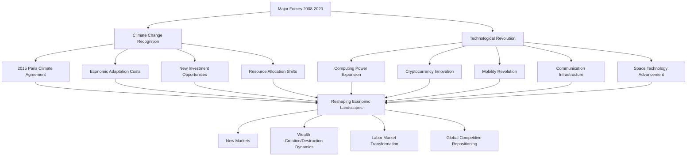

  - 

## Chapter 12: The History and Lessons from Phase 4, from 2020 to 2025—A Fiat Money World with More Government Deficits and More Debt Monetization

**The period from 2020 to 2025 witnessed extraordinary economic and geopolitical developments:**

- **The COVID pandemic generated economic and market crashes in early 2020, forcing central banks and governments to implement unprecedented monetary and fiscal stimulus. These interventions proved remarkably effective in reviving markets but exacerbated wealth disparity, as financial asset owners benefited disproportionately.**
    
- **The pandemic initially triggered enormous deflationary pressures through demand collapse, followed by powerful inflationary forces from:**
    
    1. **Massive monetary creation and spending**
    2. **Supply chain disruptions reducing goods availability**
    3. **Worker shortages increasing labor costs**
    4. **Production capacity limitations against surging demand**

This [inflation](../../Principles%20For%20Navigating%20Big%20Debt%20Cycles/Part%20II%20Detailed%20Case%20Studies/German%20Debt%20Crisis%20andHyperinflation%20(1918–1924)/War%20Economies%20and%20Hyperinflation.md) surge initiated the first significant global tightening cycle in decades as central banks rapidly raised [interest rates](../../../../Financial%20Markets/Fixed%20Income%20Securities%20Tools%20for%20Today's%20Markets/Chapter%202/Interest%20Rate%20Quotations.md), eventually suppressing [inflation](../../Principles%20For%20Navigating%20Big%20Debt%20Cycles/Part%20II%20Detailed%20Case%20Studies/German%20Debt%20Crisis%20andHyperinflation%20(1918–1924)/War%20Economies%20and%20Hyperinflation.md) to lower levels, though still exceeding the 2% Federal Reserve target.

**The transition from deflationary to inflationary conditions profoundly disadvantaged [fixed income securities](../../../../Clippings/Bond%20Equivalent%20Yield%20(BEY)%20-%20Definition,%20Formula,%20and%20Example.md). Previously, during deflationary environments (with declining [interest rates](../../../../Financial%20Markets/Fixed%20Income%20Securities%20Tools%20for%20Today's%20Markets/Chapter%202/Interest%20Rate%20Quotations.md) for 40 years, particularly in developed economies), bonds delivered strong risk-adjusted [returns](../../../../Financial%20Markets/Financial%20Asset%20Pricing%20Theory%20Overview/Chapter%203%20-%20%20Assets,%20Portfolios,%20and%20Arbitrage/Assets.md) and effectively diversified equity portfolios. The environment's fundamental transformation rendered these historical performance patterns obsolete.**

**These developments represent classic manifestations of the [Big Debt Cycle](../How%20Countries%20Go%20Broke%20Introduction%20&%20Chapter%201.md) template I described earlier. The central bank approached its limits in using MP3 (money printing and debt purchases), as it had already substantially expanded its balance sheet. This required the central government to increase deficit spending significantly, creating more money and delivering it directly to citizens via "helicopter money"—stimulus checks and various benefits—a pattern reminiscent of previous late-stage debt cycles throughout history. This approach involved direct fiscal transfers rather than mere reliance on trickling stimulus through the [financial system](../../../../Contemporary%20Financial%20Intermediation%20Notes/Contemporary%20Financial%20Intermediation%20Notes.md).**

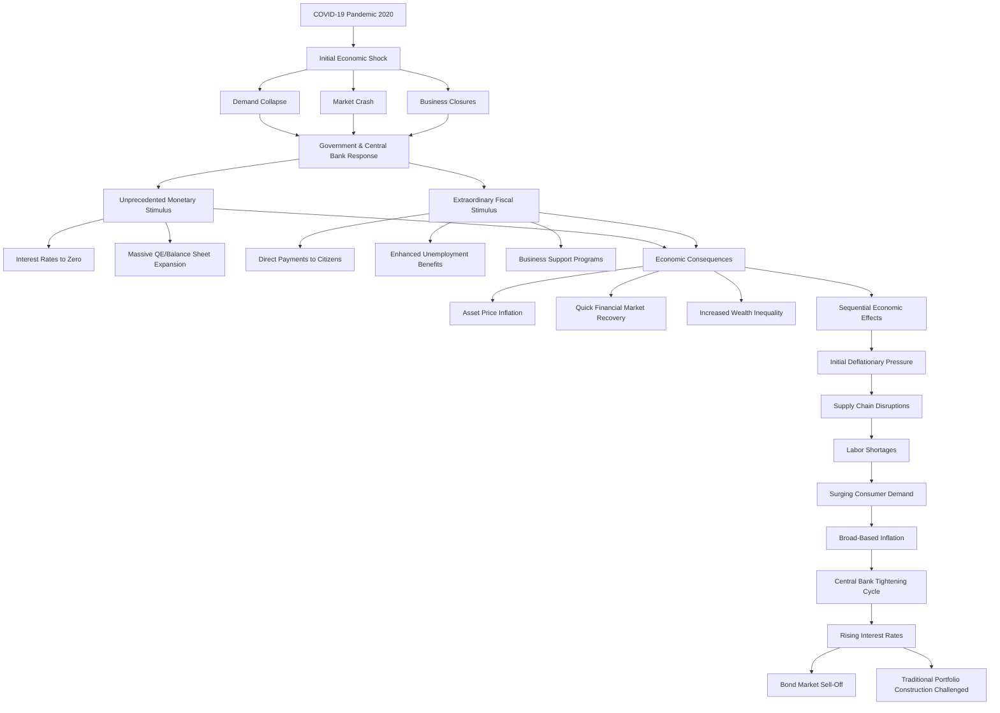

  - 

**In 2022, while the Federal Reserve aggressively raised [interest rates](../../../../Financial%20Markets/Fixed%20Income%20Securities%20Tools%20for%20Today's%20Markets/Chapter%202/Interest%20Rate%20Quotations.md) to combat [inflation](../../Principles%20For%20Navigating%20Big%20Debt%20Cycles/Part%20II%20Detailed%20Case%20Studies/German%20Debt%20Crisis%20andHyperinflation%20(1918–1924)/War%20Economies%20and%20Hyperinflation.md), Russia invaded Ukraine, triggering an international crisis. This introduced significant price implications, particularly for energy and agricultural [commodities](../../../../Financial%20Markets/Financial%20Engineering%20and%20Arbitrage%20in%20the%20Financial%20Markets/PART%20I%20RELATIVE%20VALUE%20BUILDING%20BLOCKS/Chapter%203%20-%20Futures%20Markets/Futures%20Not%20Subject%20to%20Cash-And-Carry.md), and precipitated geopolitical realignments. The invasion marked a definitive end to the post-Cold War international order established after the Soviet Union's dissolution, intensifying bloc formation reminiscent of historical Cold War dynamics.**

**The post-Cold War order's demise triggered significant capital reallocation, as the assumed peace dividend underpinning previous globalization—particularly the notion that economic interdependence would prevent major great power conflicts—proved invalid. Markets and economies must now adapt to a multipolar world with divergent trading blocs, supply chain realignment for security rather than efficiency, and increased resource allocation toward military capabilities. These shifts will profoundly impact [inflation](../../Principles%20For%20Navigating%20Big%20Debt%20Cycles/Part%20II%20Detailed%20Case%20Studies/German%20Debt%20Crisis%20andHyperinflation%20(1918–1924)/War%20Economies%20and%20Hyperinflation.md), sovereign debt dynamics, and global monetary systems in ways that remain partially unfolding.**

**The geopolitical realignment intensified technological competition between major powers, particularly between the United States and China. Technology has evolved beyond mere [competitive advantage](../../../../Advanced%20Financial%20Analysis%20and%20Valuation/Lecture%20Notes%20Advanced%20Financial%20Analysis%20and%20Valuation/Week%206/Week%206%20Bank%20Analysis%20and%20Valuation.md) to embody national security imperatives, especially regarding artificial intelligence, cybersecurity, and semiconductor production. The US implemented substantial Chinese technology export restrictions and advocated reshoring critical technological production—positions with bipartisan support unprecedented in the post-Cold War era.**

**While the Russian invasion received significant attention, the most consequential contemporary geopolitical dynamic involves the US-China relationship. This relationship deteriorated substantially following COVID-19's emergence, intensifying during this period as tensions surrounding Taiwan increased. The strategic competition involves technological decoupling, trade restrictions, diplomatic confrontations, and competing developmental models seeking influence across emerging economies. These developments align with classic great power rivalry patterns during late-stage Big Debt Cycles.**

**Regarding domestic politics, partisan polarization reached historic levels, with minimal common ground between political factions. Political tensions dominated throughout President Biden's administration (2021-2025), culminating in Donald Trump's 2024 election victory. This political turmoil coincided with the late-stage [debt cycle](../../Chapters/US%20Debt%20Crisis%20and%20Adjustment%201928-1937.md), reinforcing concerns that the United States might follow historical precedents where financial, economic, and political instability converge.**

**The dollar's dominance as the world's reserve [currency](../../../../Financial%20Instruments/Lecture%20Notes-%20Financial%20Instruments/Teaching%20Note%201-%20Forward%20Rates%20Agreement/Forwards%20and%20Futures%20Notes.md) faced unprecedented challenges as several factors converged:**

1. **The BRICS coalition (Brazil, Russia, India, China, South Africa) expanded to include additional developing nations, explicitly advocating reduced dollar dependence**
2. **China accelerated efforts to internationalize the renminbi**
3. **The weaponization of dollar-based sanctions against Russia prompted increased international interest in alternative settlement arrangements**
4. **Rising US [government debt](../../../../Financial%20Markets/Fixed%20Income%20Securities%20Tools%20for%20Today's%20Markets/Front%20Matter/Global%20Fixed%20Income%20Markets.md) and approaching [debt service](../../../../Financial%20Engineering/Notes%20on%20Currency%20Swaps.md) challenges raised creditworthiness concerns**

**Nevertheless, the dollar maintained its dominant position as competing currencies faced structural limitations and the sheer scale, [liquidity](../../../../Financial%20Markets%20and%20Institutions/III.%20Liquidity%20of%20Assets/Class%205-%20Private%20Information,%20Liquidity,%20and%20Securitization/Class%20Note%2010%20Liquidity%20and%20Class%20Note%2010%20Liquidity%20and%20Liquidity%20Managementliquidity%20management.md), and institutional framework supporting dollar markets remained unmatched. The dollar's resilience, despite significant pressures, demonstrates the extraordinary stability and persistence of established monetary orders even amid significant stresses.**

  -  
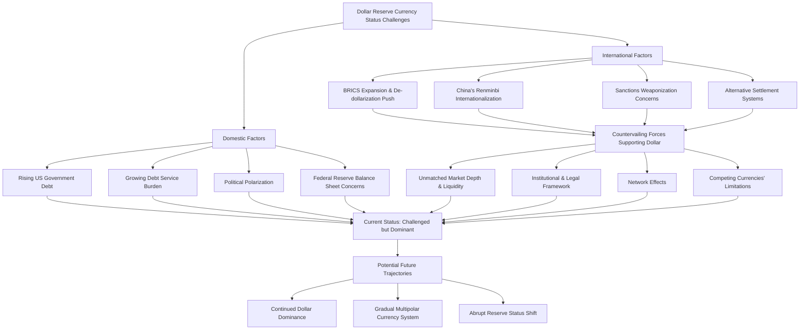

  - 

**The pandemic accelerated technological adoption and innovation, particularly in artificial intelligence, which advanced dramatically. The late 2022 [introduction](../../../../Financial%20Markets%20and%20Institutions/III.%20Liquidity%20of%20Assets/Class%209-%20Bailouts%20and%20Bank%20Failures/Squam%20Lake%20Group%20Introduction.md) of ChatGPT popularized generative AI capabilities, initiating widespread adoption across numerous sectors. Other technological advancements included quantum computing progress, biotechnology innovations (accelerated by COVID-19 vaccine development), renewable energy cost reductions, and space commercialization expansion. These developments promise long-term productivity improvements while simultaneously disrupting established business models and labor markets.**

**As [interest rates](../../../../Financial%20Markets/Fixed%20Income%20Securities%20Tools%20for%20Today's%20Markets/Chapter%202/Interest%20Rate%20Quotations.md) increased throughout 2022-2023 to combat [inflation](../../Principles%20For%20Navigating%20Big%20Debt%20Cycles/Part%20II%20Detailed%20Case%20Studies/German%20Debt%20Crisis%20andHyperinflation%20(1918–1924)/War%20Economies%20and%20Hyperinflation.md), rising [debt service](../../../../Financial%20Engineering/Notes%20on%20Currency%20Swaps.md) costs began affecting the central government's financial position. While the headline total debt figure (approximately 125% of GDP) appeared manageable compared to some historical examples (particularly the Japanese experience), the velocity of debt increase and growing [debt service](../../../../Financial%20Engineering/Notes%20on%20Currency%20Swaps.md) burden as a percentage of government revenue raised alarm. The Congressional Budget Office projected [debt service](../../../../Financial%20Engineering/Notes%20on%20Currency%20Swaps.md) costs potentially growing from approximately 10% of federal revenue to over 20% by 2033, reaching upwards of 30% by the 2040s—clearly unsustainable without intervening policy adjustments or economic transformations.**

**We now approach a potential inflection point with several possible trajectories:**

1. **Sustained economic growth and modest [inflation](../../Principles%20For%20Navigating%20Big%20Debt%20Cycles/Part%20II%20Detailed%20Case%20Studies/German%20Debt%20Crisis%20andHyperinflation%20(1918–1924)/War%20Economies%20and%20Hyperinflation.md) could gradually improve debt-to-GDP ratios while maintaining acceptable [debt service](../../../../Financial%20Engineering/Notes%20on%20Currency%20Swaps.md) levels**
2. **Significant fiscal reforms might address structural deficit issues**
3. **Political gridlock could persist until markets force adjustments through higher [interest rates](../../../../Financial%20Markets/Fixed%20Income%20Securities%20Tools%20for%20Today's%20Markets/Chapter%202/Interest%20Rate%20Quotations.md)**
4. **The central bank might eventually resume monetary accommodation (renewed MP3) to alleviate government borrowing constraints**

**The fifth scenario—technological productivity explosion through AI and related technologies—represents the most optimistic though uncertain possibility. Transformative productivity improvements could generate sufficient economic expansion to outpace debt accumulation, similar to how post-WWII growth facilitated debt reduction from previous all-time high levels.**

**These potential outcomes align with the historical pattern of major debt cycles—increasing [leverage](../../../../Advanced%20Investments/Lecture%206-Leverage,%20Tail%20Risk,%20Volatility%20Products.md) ultimately necessitates adjustment through growth, [inflation](../../Principles%20For%20Navigating%20Big%20Debt%20Cycles/Part%20II%20Detailed%20Case%20Studies/German%20Debt%20Crisis%20andHyperinflation%20(1918–1924)/War%20Economies%20and%20Hyperinflation.md), default, or restructuring. The specific path forward remains undetermined, but understanding the historical template provides valuable guidance for anticipating and navigating these critical economic inflection points.**

## Chapter 13: A Review of China's Big Cycle

**China's 100-year history provides a fascinating case study in Big Cycles. Unlike the United States, which maintained relative political stability since 1776 despite economic fluctuations, China experienced dramatic political, economic, and [debt cycle](../../Chapters/US%20Debt%20Crisis%20and%20Adjustment%201928-1937.md) transformations. Understanding China's evolution helps illustrate how these forces interact across different systems and circumstances.**

**From the late 19th century through 1949, China endured what it terms the "Century of Humiliation," when foreign powers including Britain, France, Germany, Russia, Japan, and the United States exploited a weakened China. This period culminated in Japan's brutal occupation (1937-1945), causing millions of civilian casualties. Following World War II, China experienced civil war between Nationalists (Kuomintang) and Communists, with Mao Zedong's Communists prevailing in 1949, establishing the People's Republic of China, while Chiang Kai-shek's Nationalists retreated to Taiwan.**

**Under Mao's leadership (1949-1976), China operated as a primarily closed, communist economic system. Private property and market mechanisms were largely eliminated, central planning dominated economic activity, and China remained internationally isolated except for limited Soviet relations until their split in the late 1950s. During this period, economic performance proved disastrous, particularly during the Great Leap Forward (1958-1962), which produced catastrophic famine killing tens of millions, and the Cultural Revolution (1966-1976), which devastated China's intellectual and cultural foundations.**

**Deng Xiaoping's ascension following Mao's death initiated China's extraordinary economic transformation. While maintaining Communist Party political control, Deng implemented market-oriented reforms, opened China to [international trade](../../../Globalization/Chapter%202-The%20Principle%20Of%20Comparative%20Advantage.md) and [investment](../../../../Advanced%20Investments/An%20Asset%20Allocation%20Primer.md), and established special economic zones to attract foreign capital and expertise. Deng's approach embodied pragmatism over ideology, famously stating, "It doesn't matter whether a cat is black or white, as long as it catches mice."**

  -  
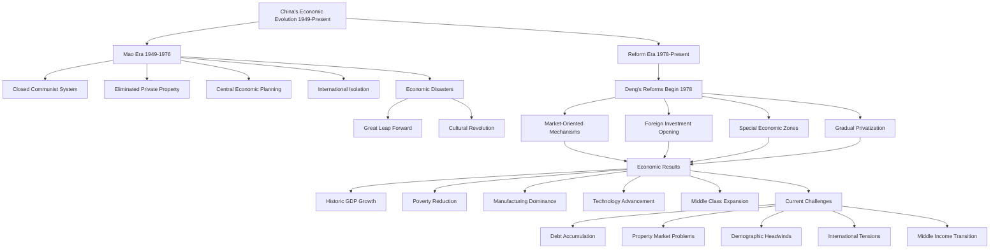

  - 

**The economic results proved remarkable. Between 1978 and 2018, China's economy grew at an average annual rate of approximately 9.5%, the fastest sustained expansion by a major economy in history. This growth lifted over 800 million people from poverty, urbanized hundreds of millions of rural residents, and transformed China into the world's manufacturing center. By the late 1990s, China's growth model focused on [investment](../../../../Advanced%20Investments/An%20Asset%20Allocation%20Primer.md) and exports, resulting in massive trade surpluses with the United States and other developed economies.**

**This economic miracle operated alongside peculiar financial dynamics. Unlike Western financial systems, the Chinese [banking](../../../../Advanced%20Financial%20Analysis%20and%20Valuation/Problem%20Sets/HKS%20The%20Banking%20Industry.md) sector remained primarily state-controlled, directing capital toward state-owned enterprises and government priorities rather than purely profit-maximizing investments. This arrangement facilitated extraordinary [investment](../../../../Advanced%20Investments/An%20Asset%20Allocation%20Primer.md) levels reaching nearly 50% of GDP during certain periods, far exceeding typical rates in market economies.**

**The 2008 [global financial crisis](../../../../Financial%20Engineering/8.%20Credit%20Modeling%20and%20Credit%20Derivatives.md) marked a crucial inflection point. China responded with massive stimulus far exceeding most Western interventions proportionally. While this successfully maintained growth through global economic turmoil, it accelerated debt accumulation significantly. Total debt across all sectors (government, corporate, household) increased from approximately 150% of GDP pre-crisis to over 300% by 2020, among the most rapid debt expansions in any major economy throughout history.**

**Much of this debt fueled China's extraordinary property market boom. Real estate development became a principal economic driver, with the sector eventually accounting for approximately 25-30% of GDP when including adjacent industries. Property ownership rates exceeded 90% among urban Chinese households, with many owning multiple units as [investment](../../../../Advanced%20Investments/An%20Asset%20Allocation%20Primer.md) vehicles given limited alternative domestic [investment](../../../../Advanced%20Investments/An%20Asset%20Allocation%20Primer.md) opportunities. Property valuations reached extraordinary levels relative to income, creating household wealth effects that supported consumption while simultaneously exposing the system to potential correction risks.**

**By 2015-2016, Chinese leadership recognized the unsustainability of debt-fueled growth and excessive property market reliance. While acknowledging the need for "high-quality" rather than merely rapid growth, addressing these vulnerabilities without triggering severe economic dislocation proved challenging. President Xi Jinping's administration initiated deleveraging campaigns but frequently paused them when economic growth decelerated excessively.**

**Since 2020, China has faced multiple concurrent challenges:**

1. **The property market correction finally materialized, with major developers facing severe [financial distress](../../../../Financial%20Markets%20and%20Institutions/III.%20Liquidity%20of%20Assets/Class%205-%20Private%20Information,%20Liquidity,%20and%20Securitization/Southland%20Corp.%20(c).md)**
2. **COVID-19 control measures temporarily disrupted economic activity**
3. **Shifting demographics with an aging, shrinking workforce undermined previous growth models**
4. **Technological competition with the United States intensified**
5. **Capital flows faced increasing restrictions from both domestic controls and international scrutiny**

**Unlike Western central banks, the [People's Bank of China](../../../China%20Foreign%20Exchange%20Reserves/People's%20Bank%20of%20China%20(PBoC).md) maintained relatively conservative [monetary policy](../../../../Financial%20Markets%20and%20Institutions/III.%20Liquidity%20of%20Assets/Class%209-%20Bailouts%20and%20Bank%20Failures/Articles/The%20Economist%20Regime%20Change.md) throughout recent challenges, partly due to different institutional mandates and partly reflecting Chinese leadership's concerns about [financial stability](../../../../Financial%20Markets%20and%20Institutions/III.%20Liquidity%20of%20Assets/Class%206-%20Bank%20Runs/Bank%20Runs%20Deposit%20Insurance%20and%20Liquidity.md) rather than maximizing short-term growth. This approach helped prevent the property market correction from triggering immediate [financial system collapse](../../../../Financial%20Markets%20and%20Institutions/III.%20Liquidity%20of%20Assets/Class%209-%20Bailouts%20and%20Bank%20Failures/The%20Asian%20Liquidity%20Crisis.md), though at the cost of prolonged economic adjustment.**

**China's current position within its [Big Debt Cycle](../How%20Countries%20Go%20Broke%20Introduction%20&%20Chapter%201.md) differs from Western counterparts. China retains significant capacity for traditional monetary and fiscal intervention with relatively low [central government debt](../How%20Countries%20Go%20Broke-Chapter%2015%20&%20Chapter%2016.md), substantial [foreign exchange reserves](../../../China%20Foreign%20Exchange%20Reserves/Foreign%20Exchange%20Reserves%20-%20Wikipedia/Foreign%20Exchange%20Reserves%20-%20Wikipedia.md), and continuing trade surpluses. However, total system debt levels, demographic headwinds, and potential property market losses present formidable medium-term challenges.**

**China's economic evolution demonstrates both distinctive characteristics and remarkable adherence to classic [debt cycle](../../Chapters/US%20Debt%20Crisis%20and%20Adjustment%201928-1937.md) patterns. The state-directed [banking system](../../../../Financial%20Markets%20and%20Institutions/II.%20The%20Roles%20of%20Banks%20and%20Derivative%20Markets%20in%20Resolving%20Problems%20Inherent%20in%20Debt%20Contracts/Class%203-%20Financial%20Intermediation%20and%20Delegated%20Loan%20Monitoring%20,%20Intro%20to%20Bankruptcy%20and%20Debt%20Restructuring/Class%20Slide%203%20Financial%20Intermediation%20and%20Delegated%20Monitoring.md) initially postponed typical market discipline but couldn't indefinitely override fundamental economic principles. China now confronts [debt cycle](../../Chapters/US%20Debt%20Crisis%20and%20Adjustment%201928-1937.md) challenges similar to those previously experienced by Japan and various Western economies, albeit with unique institutional characteristics that may influence both the adjustment process and ultimate outcomes.**

## Chapter 14: A Look at Japan's Big Debt Cycle

**Japan's economic experience since World War II offers invaluable insights for understanding current global debt dynamics. Japan has pioneered [monetary policy](../../../../Financial%20Markets%20and%20Institutions/III.%20Liquidity%20of%20Assets/Class%209-%20Bailouts%20and%20Bank%20Failures/Articles/The%20Economist%20Regime%20Change.md) innovations, confronted demographic challenges now facing numerous developed economies, and navigated complex [debt cycle](../../Chapters/US%20Debt%20Crisis%20and%20Adjustment%201928-1937.md) dynamics that demonstrate both universal principles and distinctive national characteristics.**

**Following devastation during World War II, Japan experienced extraordinary economic revival. From the 1950s through the 1980s, Japan achieved sustained growth averaging approximately 7.5% annually, transforming from war-ravaged nation to global economic powerhouse. This "economic miracle" featured export-oriented industrialization, strategic government-business coordination, high domestic savings rates, and substantial capital [investment](../../../../Advanced%20Investments/An%20Asset%20Allocation%20Primer.md).**

**The 1980s represented Japan's economic zenith. Japanese manufacturing dominated numerous sectors, companies initiated global expansion through foreign acquisitions, and the country appeared positioned to potentially surpass the United States economically. This economic strength generated immense national confidence, manifesting in rapidly appreciating asset prices—particularly equities and real estate. Between 1985 and 1989, Japanese stock markets approximately tripled while urban land prices more than doubled.**

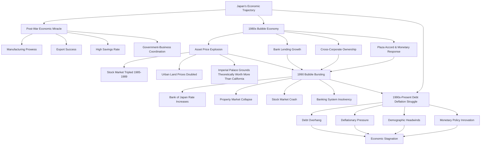

  - 

**These [asset price](../../../../Financial%20Markets/Financial%20Asset%20Pricing%20Theory%20Overview/Chapter%204%20-%20State%20Prices/A%20Preview%20of%20Alternative%20Formulations.md) increases partly stemmed from Japan's response to the 1985 Plaza Accord, which strengthened the yen substantially. To counteract [currency](../../../../Financial%20Instruments/Lecture%20Notes-%20Financial%20Instruments/Teaching%20Note%201-%20Forward%20Rates%20Agreement/Forwards%20and%20Futures%20Notes.md)-driven export competitiveness erosion, Japanese authorities lowered [interest rates](../../../../Financial%20Markets/Fixed%20Income%20Securities%20Tools%20for%20Today's%20Markets/Chapter%202/Interest%20Rate%20Quotations.md) significantly, fueling domestic credit expansion and asset speculation. Major banks dramatically increased property-secured lending, creating a classic debt-fueled asset bubble.**

**When the Bank of Japan finally addressed [inflation](../../Principles%20For%20Navigating%20Big%20Debt%20Cycles/Part%20II%20Detailed%20Case%20Studies/German%20Debt%20Crisis%20andHyperinflation%20(1918–1924)/War%20Economies%20and%20Hyperinflation.md) concerns by raising [interest rates](../../../../Financial%20Markets/Fixed%20Income%20Securities%20Tools%20for%20Today's%20Markets/Chapter%202/Interest%20Rate%20Quotations.md) between 1989 and 1990, the bubble collapsed spectacularly. The Nikkei [stock index](../../../../Financial%20Instruments/Lecture%20Notes-%20Financial%20Instruments/Teaching%20Note%201-%20Forward%20Rates%20Agreement/Hedging%20Strategies%20with%20Forwards.md) declined approximately 60% from its peak in just two years, while urban commercial property values eventually fell 87% from their highs. This asset crash generated catastrophic [banking](../../../../Advanced%20Financial%20Analysis%20and%20Valuation/Problem%20Sets/HKS%20The%20Banking%20Industry.md) sector losses, as property collateral values plummeted below outstanding loan balances.**

**The ensuing period exemplifies the challenges of addressing debt deflation. Unlike many emerging economies experiencing debt crises, Japan maintained credibility in its [currency](../../../../Financial%20Instruments/Lecture%20Notes-%20Financial%20Instruments/Teaching%20Note%201-%20Forward%20Rates%20Agreement/Forwards%20and%20Futures%20Notes.md) and government bonds, permitting unprecedented public sector debt expansion to offset private sector deleveraging. This approach prevented immediate economic collapse but failed to restore robust growth due to demographic headwinds, [banking](../../../../Advanced%20Financial%20Analysis%20and%20Valuation/Problem%20Sets/HKS%20The%20Banking%20Industry.md) sector weakness, and corporate balance sheet repair prioritization over new [investment](../../../../Advanced%20Investments/An%20Asset%20Allocation%20Primer.md).**

**Japan pioneered many unconventional monetary policies now implemented globally. The Bank of Japan introduced [quantitative easing](../../../../Financial%20Markets/Fixed%20Income%20Securities%20Tools%20for%20Today's%20Markets/Front%20Matter/Negative%20Rates%20and%20Qe%20in%20Europe%20and%20Japan.md) in 2001, nearly seven years before Western central banks adopted similar measures following the 2008 crisis. By 2016, Japan implemented [negative interest rates](../../../../Financial%20Markets/Fixed%20Income%20Securities%20Tools%20for%20Today's%20Markets/Front%20Matter/Negative%20Rates%20and%20Qe%20in%20Europe%20and%20Japan.md) and yield curve control—techniques subsequently adopted by the European Central Bank and contemplated by the Federal Reserve. These innovations resulted from necessity as Japan confronted zero interest rate limitations earlier than other advanced economies.**

**Despite these monetary innovations, sustained [inflation](../../Principles%20For%20Navigating%20Big%20Debt%20Cycles/Part%20II%20Detailed%20Case%20Studies/German%20Debt%20Crisis%20andHyperinflation%20(1918–1924)/War%20Economies%20and%20Hyperinflation.md) remained elusive until recent global inflationary pressures. For approximately three decades, Japan experienced mild deflation or minimal [inflation](../../Principles%20For%20Navigating%20Big%20Debt%20Cycles/Part%20II%20Detailed%20Case%20Studies/German%20Debt%20Crisis%20andHyperinflation%20(1918–1924)/War%20Economies%20and%20Hyperinflation.md) despite extraordinary monetary accommodation. This experience challenged conventional economic theory suggesting direct relationships between money supply expansion and [inflation](../../Principles%20For%20Navigating%20Big%20Debt%20Cycles/Part%20II%20Detailed%20Case%20Studies/German%20Debt%20Crisis%20andHyperinflation%20(1918–1924)/War%20Economies%20and%20Hyperinflation.md), demonstrating that debt overhang, negative wealth effects, and demographic contraction can counteract even unprecedented monetary stimulus.**

**Japan's [government debt](../../../../Financial%20Markets/Fixed%20Income%20Securities%20Tools%20for%20Today's%20Markets/Front%20Matter/Global%20Fixed%20Income%20Markets.md) reached approximately 260% of GDP—the highest among advanced economies. Despite this extraordinary level, the Japanese government maintains low [borrowing costs](../../../../Financial%20Engineering/Notes%20on%20Currency%20Swaps.md) due to substantial domestic savings, stable institutional ownership, and central bank purchases. The Bank of Japan eventually owned approximately 50% of outstanding government bonds, effectively monetizing half the government's debt.**

**This arrangement has proven surprisingly sustainable but not without costs. Economic dynamism suffered, productivity growth languished, and Japan's global economic position diminished relative to pre-crisis [expectations](../../../../Fixed%20Income%20Asset%20Pricing/Fixed%20Income%20Lecture%20Notes/FORWARD%20RATES%20AND%20TERM%20STRUCTURE.md). Living standards remained high, unemployment stayed low, and social stability persisted—but the economic vibrancy characterizing previous decades disappeared.**

**Japan's experience offers crucial insights for contemporary global debt dynamics:**

1. **Debt-fueled asset bubbles create persistent economic headwinds when they collapse**
2. **Demographics fundamentally influence [monetary policy](../../../../Financial%20Markets%20and%20Institutions/III.%20Liquidity%20of%20Assets/Class%209-%20Bailouts%20and%20Bank%20Failures/Articles/The%20Economist%20Regime%20Change.md) effectiveness**
3. **Extraordinary [central bank intervention](../How%20Countries%20Go%20Broke-Chapter%206%20&%20Chapter%207.md) can prevent immediate economic collapse but struggles to restore robust growth independently**
4. **[Government debt](../../../../Financial%20Markets/Fixed%20Income%20Securities%20Tools%20for%20Today's%20Markets/Front%20Matter/Global%20Fixed%20Income%20Markets.md) sustainability depends more on ownership structure and domestic saving patterns than absolute levels**
5. **Financial repression (directing domestic savings toward government bond purchases) can postpone debt crises but carries long-term economic costs**

**As other advanced economies confront similar challenges—aging populations, elevated debt levels, and diminishing conventional [monetary policy](../../../../Financial%20Markets%20and%20Institutions/III.%20Liquidity%20of%20Assets/Class%209-%20Bailouts%20and%20Bank%20Failures/Articles/The%20Economist%20Regime%20Change.md) effectiveness—Japan's three-decade experience merits careful consideration. While each country's circumstances involve unique elements, Japan's trajectory suggests that postponing necessary [debt restructuring](../../../../Financial%20Markets%20and%20Institutions/II.%20The%20Roles%20of%20Banks%20and%20Derivative%20Markets%20in%20Resolving%20Problems%20Inherent%20in%20Debt%20Contracts/Class%204-%20Restructuring%20Public%20Debt/Class%20Slide%204-Restructuring%20Debt%20Outside%20Bankruptcy.md) through aggressive monetary accommodation produces suboptimal long-term outcomes despite preventing immediate crisis.**

## Chapter 15: Positioning for Part 4

**Having examined how the [Big Debt Cycle](../How%20Countries%20Go%20Broke%20Introduction%20&%20Chapter%201.md) template manifested across various historical periods and different countries, we've established a foundation for considering potential future scenarios. The analysis reveals remarkable consistency in overall [debt cycle](../../Chapters/US%20Debt%20Crisis%20and%20Adjustment%201928-1937.md) patterns despite significant variations in specific manifestations across different eras and nations.**

**Several key principles emerge:**

- **Debt accumulation eventually reaches unsustainable levels relative to income, necessitating adjustment through some combination of default, restructuring, monetization, or extraordinary growth**
    
- **Central banks initially respond to excessive debt through conventional interest rate reductions, but when rates approach zero, they transition to balance sheet expansion ([quantitative easing](../../../../Financial%20Markets/Fixed%20Income%20Securities%20Tools%20for%20Today's%20Markets/Front%20Matter/Negative%20Rates%20and%20Qe%20in%20Europe%20and%20Japan.md)) and eventually direct fiscal monetization**
    
- **Government intervention can postpone immediate [financial crisis](../../../../Financial%20Markets%20and%20Institutions/III.%20Liquidity%20of%20Assets/Class%209-%20Bailouts%20and%20Bank%20Failures/Squam%20Lake%20Group%20Letter.md) but typically transfers private sector debt problems to public sector balance sheets rather than resolving fundamental imbalances**
    
- **Political and geopolitical cycles frequently align with economic and debt cycles, as financial stress influences both domestic politics and international relations**
    
- **Technological innovation operates independently from debt cycles but can either alleviate or exacerbate economic challenges depending on timing and implementation**
    

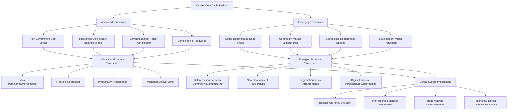

  - 

**As we transition to Part 4, we'll [leverage](../../../../Advanced%20Investments/Lecture%206-Leverage,%20Tail%20Risk,%20Volatility%20Products.md) this historical understanding to evaluate potential paths forward. The current global debt situation features several distinct characteristics that differentiate it from previous cycles:**

1. **Nearly all major economies simultaneously face elevated debt levels, limiting the traditional pattern where stronger countries assist weaker ones through crisis periods**
    
2. **Demographic challenges affect virtually all advanced economies and many emerging ones, creating structural headwinds for growth and savings patterns**
    
3. **Technological transformation, particularly artificial intelligence and automation, introduces unprecedented potential for productivity enhancement while simultaneously disrupting established economic models**
    
4. **Geopolitical fragmentation threatens the integrated global system that facilitated previous [debt cycle](../../Chapters/US%20Debt%20Crisis%20and%20Adjustment%201928-1937.md) management**
    
5. **Climate change adaptation requires substantial [investment](../../../../Advanced%20Investments/An%20Asset%20Allocation%20Primer.md) precisely when fiscal constraints appear most binding**
    

**These unique elements don't invalidate historical lessons but necessitate careful consideration of how traditional [debt cycle](../../Chapters/US%20Debt%20Crisis%20and%20Adjustment%201928-1937.md) patterns might manifest differently in current circumstances. The fundamental mechanics—the relationship between debt, income, and [monetary policy](../../../../Financial%20Markets%20and%20Institutions/III.%20Liquidity%20of%20Assets/Class%209-%20Bailouts%20and%20Bank%20Failures/Articles/The%20Economist%20Regime%20Change.md)—remain consistent, but the specific pathways and policy options may differ substantially.**

**In Part 4, we'll explore these potential pathways systematically, considering how various combinations of policy choices, technological developments, and geopolitical arrangements might influence debt resolution across different economies. This analysis will provide a framework for navigating the extraordinary economic transitions likely in coming decades as the current [Big Debt Cycle](../How%20Countries%20Go%20Broke%20Introduction%20&%20Chapter%201.md) reaches its culmination and a new cycle eventually begins.**