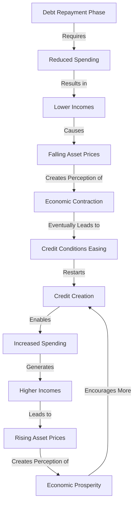

---
tags:
- financial-instruments/call
- financial-instruments/cap
- quantitative-models/apt
- financial-markets/credit
- quantitative-methods/var
- derivatives-pricing
- educational-level/intermediate
key_concepts:
- value at risk and tail risk measurement
- financial mathematics and quantitative analysis
- derivatives and structured products
- risk management and portfolio optimization
- stochastic processes in finance
- mathematical modeling and simulation
type: note
status: active
academic_level: graduate
professional_application: practical
institutional_standard: true
---

# Chapter 1: The Big Debt Cycle in a Tiny Nutshell

## Deciphering the Mechanics of Cyclical Debt Dynamics

**In this chapter, I shall endeavor to present a concise yet comprehensive delineation of the mechanical underpinnings that characterize a typical Big Debt Cycle in merely seven pages.**

### The Fundamental Architecture of Financial Systems

**Credit functions as the primary vehicle for expenditure financing and can be generated with remarkable facility. Since one economic agent's expenditure invariably constitutes another's income, periods of substantial credit expansion typically manifest as increased spending, elevated earnings, appreciating asset valuations, and widespread economic optimism. Conversely, debt servicing—an inherently less gratifying process—produces contrary effects: diminished expenditure, reduced income streams, depreciating asset values, and general economic discontent. In essence, when an entity (borrower-debtor) acquires capital (principal) at a predetermined cost (interest rate), they gain the capacity to exceed their immediate consumption constraints during the initial phase. However, this temporal advantage necessitates subsequent financial restitution (principal plus interest), which inevitably compels reduced expenditure relative to earnings. This inherent relationship illuminates why the** _**credit-expenditure-debt-repayment dynamic manifests an intrinsically cyclical pattern.**_

### The Short-Term Debt Cycle: Oscillations Within the Macroeconomic Framework