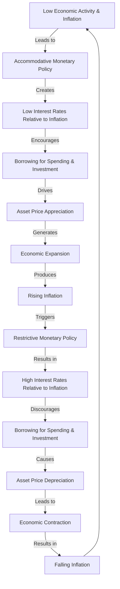
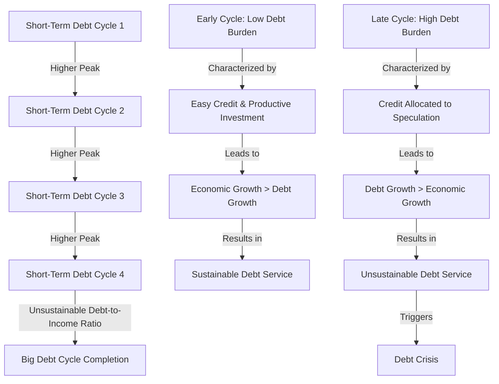
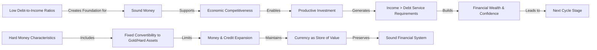
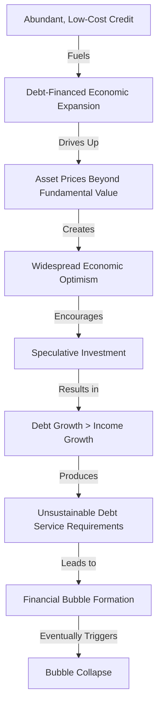
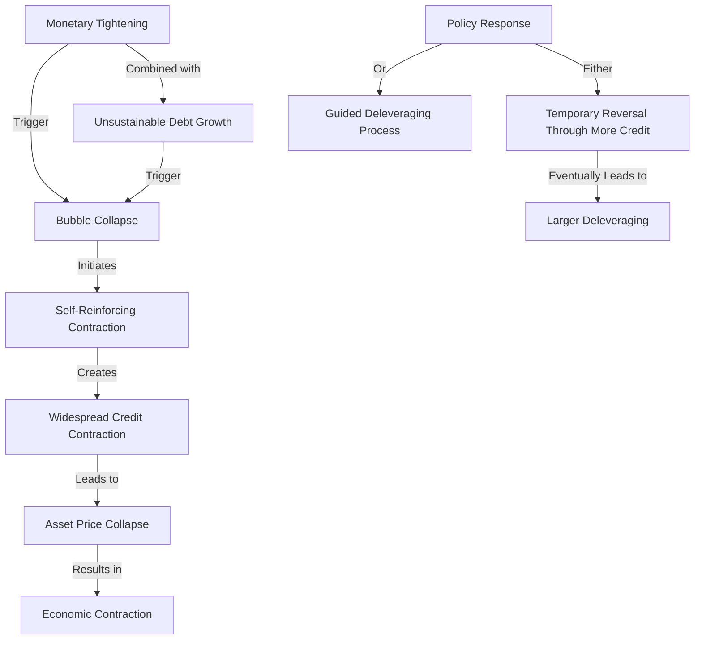
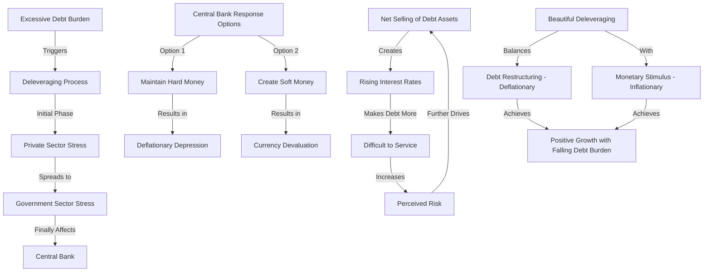
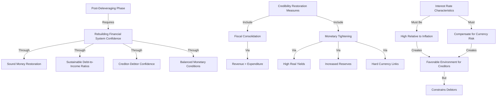

# Chapter 1: The Big Debt Cycle in a Tiny Nutshell

## Deciphering the Mechanics of Cyclical Debt Dynamics

**In this chapter, I shall endeavor to present a concise yet comprehensive delineation of the mechanical underpinnings that characterize a typical [Big Debt Cycle](../How%20Countries%20Go%20Broke%20Introduction%20&%20Chapter%201.md) in merely seven pages.**

### The Fundamental Architecture of Financial Systems

**Credit functions as the primary vehicle for expenditure financing and can be generated with remarkable facility. Since one economic agent's expenditure invariably constitutes another's income, periods of substantial credit expansion typically manifest as increased spending, elevated earnings, appreciating asset valuations, and widespread economic optimism. Conversely, debt servicing—an inherently less gratifying process—produces contrary effects: diminished expenditure, reduced income streams, depreciating asset values, and general economic discontent. In essence, when an entity (borrower-debtor) acquires capital (principal) at a predetermined cost (interest rate), they gain the capacity to exceed their immediate consumption constraints during the initial phase. However, this temporal advantage necessitates subsequent financial restitution (principal plus interest), which inevitably compels reduced expenditure relative to earnings. This inherent relationship illuminates why the** _**credit-expenditure-debt-repayment dynamic manifests an intrinsically cyclical pattern.**_

### The Short-Term Debt Cycle: Oscillations Within the Macroeconomic Framework

**Those who have experienced multiple iterations should be intimately familiar with the [short-term debt](../../../../Financial%20Markets%20and%20Institutions/III.%20Liquidity%20of%20Assets/Class%207-%20CP,%20Repo,%20and%20the%20Crisis/When%20Safe%20Proved%20Risky%20Commercial%20Paper%20During%20the%20Financial%20Crisis%20of%202007%202009.md) cycle's characteristic patterns. This cycle initiates when monetary and credit conditions are accommodative during periods of subdued economic activity and [inflation](../../Principles%20For%20Navigating%20Big%20Debt%20Cycles/Part%20II%20Detailed%20Case%20Studies/German%20Debt%20Crisis%20andHyperinflation%20(1918–1924)/War%20Economies%20and%20Hyperinflation.md), with [interest rates](../../../../Financial%20Markets/Fixed%20Income%20Securities%20Tools%20for%20Today's%20Markets/Chapter%202/Interest%20Rate%20Quotations.md) positioned below [inflation](../../Principles%20For%20Navigating%20Big%20Debt%20Cycles/Part%20II%20Detailed%20Case%20Studies/German%20Debt%20Crisis%20andHyperinflation%20(1918–1924)/War%20Economies%20and%20Hyperinflation.md) rates and comparatively disadvantageous relative to alternative [investment](../../../../Advanced%20Investments/An%20Asset%20Allocation%20Primer.md) yields. These conditions incentivize borrowing for consumption and [investment](../../../../Advanced%20Investments/An%20Asset%20Allocation%20Primer.md), precipitating asset appreciation, economic expansion, and inflationary pressures until they exceed desired thresholds. At this juncture, monetary and credit conditions tighten, with [interest rates](../../../../Financial%20Markets/Fixed%20Income%20Securities%20Tools%20for%20Today's%20Markets/Chapter%202/Interest%20Rate%20Quotations.md) becoming relatively elevated compared to [inflation](../../Principles%20For%20Navigating%20Big%20Debt%20Cycles/Part%20II%20Detailed%20Case%20Studies/German%20Debt%20Crisis%20andHyperinflation%20(1918–1924)/War%20Economies%20and%20Hyperinflation.md) and competing [investment returns](../../../../Financial%20Markets%20and%20Institutions/III.%20Liquidity%20of%20Assets/Class%208-%20Markets,%20Meltdowns,%20and%20Arbitrage/Long%20Term%20Capital%20Management%20L.p.%20(a).md). The resultant contraction in borrowing leads to asset depreciation, economic deceleration, and diminished inflationary pressures, ultimately driving [interest rates](../../../../Financial%20Markets/Fixed%20Income%20Securities%20Tools%20for%20Today's%20Markets/Chapter%202/Interest%20Rate%20Quotations.md) downward, monetary conditions to ease, and the cycle to recommence. These oscillations typically manifest over approximately six years, with a variance of three years in either direction.**

### The Aggregation Phenomenon: Short-Term Cycles Culminating in Long-Term Debt Dynamics

**What warrants greater analytical attention is the mechanism by which these [short-term debt](../../../../Financial%20Markets%20and%20Institutions/III.%20Liquidity%20of%20Assets/Class%207-%20CP,%20Repo,%20and%20the%20Crisis/When%20Safe%20Proved%20Risky%20Commercial%20Paper%20During%20the%20Financial%20Crisis%20of%202007%202009.md) cycles coalesce into significant, long-term debt cycles. Given that credit functions as a stimulant producing euphoric effects, economic agents exhibit a natural predisposition toward its expansion. This behavioral bias typically results in each successive short-term cyclical peak and trough in debt levels exceeding its predecessor, eventually culminating in an unsustainable aggregate position. The capacity for additional debt assumption differs markedly between the early stages of the [Big Debt Cycle](../How%20Countries%20Go%20Broke%20Introduction%20&%20Chapter%201.md)—characterized by modest debt burdens and substantial potential for credit allocation to productive enterprises—and later stages when debt burdens become increasingly onerous and creditors confront a paucity of productive allocation options.**

**During these nascent phases, credit acquisition—even in substantial quantities—and subsequent repayment proceed with relative facility. These initial short-term cycles are predominantly influenced by the previously articulated availability and economic calculus of borrowing and expenditure, coupled with residual caution stemming from recent experiences of monetary constraint. Early in the [Big Debt Cycle](../How%20Countries%20Go%20Broke%20Introduction%20&%20Chapter%201.md), when [debt service](../../../../Financial%20Engineering/Notes%20on%20Currency%20Swaps.md) obligations remain modest relative to income streams and collateralizable assets, fluctuations in credit, expenditure, debt, and [debt service](../../../../Financial%20Engineering/Notes%20on%20Currency%20Swaps.md) are primarily dictated by the aforementioned incentive structures with minimal [risk considerations](../../../../Financial%20Markets%20and%20Institutions/II.%20The%20Roles%20of%20Banks%20and%20Derivative%20Markets%20in%20Resolving%20Problems%20Inherent%20in%20Debt%20Contracts/HomeMax%20Case%20Study%20Solution.md). However, as the [Big Debt Cycle](../How%20Countries%20Go%20Broke%20Introduction%20&%20Chapter%201.md) progresses toward maturity, when [debt service](../../../../Financial%20Engineering/Notes%20on%20Currency%20Swaps.md) costs become substantial relative to income and collateralizable assets, [default probabilities](../../../../Credit%20Markets/Credit%20Markets%20Session%203.md) escalate significantly. Moreover, in these advanced stages, when debt assets and liabilities constitute a substantial proportion of income, the [calibration](../../../../Credit%20Markets/Credit%20Markets%20Session%204.md) challenge of maintaining [interest rates](../../../../Financial%20Markets/Fixed%20Income%20Securities%20Tools%20for%20Today's%20Markets/Chapter%202/Interest%20Rate%20Quotations.md) sufficiently elevated to satisfy creditors while avoiding excessive burden on debtors becomes increasingly formidable. This complexity arises from the fundamental reality that one economic agent's debt constitutes another's asset, necessitating mutual accommodation. Consequently, while [short-term debt](../../../../Financial%20Markets%20and%20Institutions/III.%20Liquidity%20of%20Assets/Class%207-%20CP,%20Repo,%20and%20the%20Crisis/When%20Safe%20Proved%20Risky%20Commercial%20Paper%20During%20the%20Financial%20Crisis%20of%202007%202009.md) cycles conclude primarily due to the economic considerations previously delineated, long-term debt cycles terminate when debt burdens exceed sustainable thresholds. Expressed differently, because borrowing and expenditure typically provide greater utility than saving and foregone consumption, without prudent constraints, debt and associated service obligations can metastasize, progressively eroding purchasing power and displacing discretionary consumption. This dynamic engenders the long-term [Big Debt Cycle](../How%20Countries%20Go%20Broke%20Introduction%20&%20Chapter%201.md).**

**Throughout millennia and across diverse political economies, the primary catalyst for the [Big Debt Cycle](../How%20Countries%20Go%20Broke%20Introduction%20&%20Chapter%201.md) and its attendant market and economic disruptions has been the creation of debt assets and liabilities in quantities that prove unsustainable relative to existing money supply, goods, services, and [investment](../../../../Advanced%20Investments/An%20Asset%20Allocation%20Primer.md) assets.**

_**Expressed with greater parsimony, debt represents a [contractual obligation](../../../../Clippings/Forward%20Rate.md) to deliver [currency](../../../../Financial%20Instruments/Lecture%20Notes-%20Financial%20Instruments/Teaching%20Note%201-%20Forward%20Rates%20Agreement/Forwards%20and%20Futures%20Notes.md). A [debt crisis](../../Chapters/US%20Debt%20Crisis%20and%20Adjustment%20(2007–2011).md) materializes when the aggregate of these obligations exceeds the available [currency](../../../../Financial%20Instruments/Lecture%20Notes-%20Financial%20Instruments/Teaching%20Note%201-%20Forward%20Rates%20Agreement/Forwards%20and%20Futures%20Notes.md) to fulfill them. In such circumstances, the central monetary authority confronts a binary choice: a) expand the money supply substantially, thereby diminishing its value, or b) refrain from monetary expansion, precipitating widespread debt defaults. Ultimately, monetary expansion and [currency](../../../../Financial%20Instruments/Lecture%20Notes-%20Financial%20Instruments/Teaching%20Note%201-%20Forward%20Rates%20Agreement/Forwards%20and%20Futures%20Notes.md) devaluation invariably prevail. Regardless of the specific mechanism—whether default or devaluation—the excessive creation of debt ultimately diminishes the value of [debt instruments](../../../../Financial%20Markets/Fixed%20Income%20Securities%20Tools%20for%20Today's%20Markets/Chapter%2014/Corporate%20Bonds%20and%20Loans.md) (e.g., bonds).**_

**While variation exists in the manifestation of individual cases, the most significant determinant is whether the debt is denominated in [currency](../../../../Financial%20Instruments/Lecture%20Notes-%20Financial%20Instruments/Teaching%20Note%201-%20Forward%20Rates%20Agreement/Forwards%20and%20Futures%20Notes.md) that the central monetary authority can create at will. Notwithstanding such variations, an almost invariable consequence is the diminished desirability of holding debt assets (i.e., bonds) relative to productive capital (i.e., equities) and/or alternative, more stable monetary stores (e.g., gold).**

I find it simultaneously intriguing and problematic that [credit rating agencies](../../../../Financial%20Markets%20and%20Institutions/III.%20Liquidity%20of%20Assets/Class%208-%20Markets,%20Meltdowns,%20and%20Arbitrage/Moody's%20Lessons%20From%20the%20Crisis.md), when evaluating sovereign credit, exclusively assess [default risk](../../../../Financial%20Markets/Financial%20Engineering%20and%20Arbitrage%20in%20the%20Financial%20Markets/PART%20I%20RELATIVE%20VALUE%20BUILDING%20BLOCKS/Chapter%207%20-%20Default%20Risk%20and%20Credit%20Derivatives/Default%20Risk%20and%20Credit%20Derivatives%20183.md) rather than comprehensive value deterioration risk. This methodological limitation creates a misleading impression that highly-rated sovereign debt constitutes a reliable store of value. More explicitly, because central banks possess the capacity to prevent sovereign defaults, the inherent risks of sovereign debt remain obscured. Investors would be better served by ratings that incorporate both default and devaluation risks. After all, these instruments ostensibly function as wealth preservation vehicles and merit evaluation accordingly. Throughout this analysis, this perspective guides my assessment of fixed-income securities. For sovereigns with debt denominated in domestic [currency](../../../../Financial%20Instruments/Lecture%20Notes-%20Financial%20Instruments/Teaching%20Note%201-%20Forward%20Rates%20Agreement/Forwards%20and%20Futures%20Notes.md) (i.e., [currency](../../../../Financial%20Instruments/Lecture%20Notes-%20Financial%20Instruments/Teaching%20Note%201-%20Forward%20Rates%20Agreement/Forwards%20and%20Futures%20Notes.md) they can create), I evaluate central government obligations separately from central bank liabilities to demonstrate their respective risk profiles, and I assess central bank obligations by considering [currency](../../../../Financial%20Instruments/Lecture%20Notes-%20Financial%20Instruments/Teaching%20Note%201-%20Forward%20Rates%20Agreement/Forwards%20and%20Futures%20Notes.md) devaluation risk as equally, if not more, probable than sovereign default.

**Whether through default or devaluation, the distinction holds minimal relevance. My primary concern lies in the erosion of wealth preservation capacity, which inevitably occurs through one mechanism or another.**

### Tracking the Debt Cycle's Evolutionary Trajectory

**The fundamental distinction between short-term and long-term (big) debt cycles pertains to the central monetary authority's capacity to reverse contractionary dynamics. In short-term cycles, contractionary phases can be counteracted through substantial monetary and credit expansion, elevating the economy from a disinflationary state because productive capacity exists for another phase of non-inflationary growth. Conversely, long-term [debt cycle](../../Chapters/US%20Debt%20Crisis%20and%20Adjustment%201928-1937.md) contractions resist reversal through monetary and credit expansion because existing debt levels and growth trajectories have become unsustainable, and debt instrument holders seek divestment due to their perceived inadequacy as wealth preservation vehicles.**

Consider the [Big Debt Cycle](../How%20Countries%20Go%20Broke%20Introduction%20&%20Chapter%201.md)'s progression analogous to disease pathology or life-cycle development through distinct stages exhibiting characteristic symptomatology. By identifying these symptoms, one can approximate the cycle's current developmental stage and formulate reasonable [expectations](../../../../Fixed%20Income%20Asset%20Pricing/Fixed%20Income%20Lecture%20Notes/FORWARD%20RATES%20AND%20TERM%20STRUCTURE.md) regarding its subsequent evolution. In its simplest characterization, the [Big Debt Cycle](../How%20Countries%20Go%20Broke%20Introduction%20&%20Chapter%201.md) transitions from sound/hard money and prudent credit allocation to increasingly accommodative monetary and credit conditions, culminating in debt distress that necessitates a return to sound/hard money and responsible credit practices driven by exigency rather than choice. More specifically, the cycle initiates with responsible private sector borrowing demonstrating repayment capacity; progresses to private sector over-[leverage](../../../../Advanced%20Investments/Lecture%206-Leverage,%20Tail%20Risk,%20Volatility%20Products.md), losses, and repayment difficulties; advances to governmental intervention, over-[leverage](../../../../Advanced%20Investments/Lecture%206-Leverage,%20Tail%20Risk,%20Volatility%20Products.md), losses, and repayment difficulties; culminates in [central bank intervention](../How%20Countries%20Go%20Broke-Chapter%206%20&%20Chapter%207.md) through "money creation" and sovereign debt acquisition, with subsequent repayment challenges; and concludes with extensive debt monetization when feasible (i.e., when debt is denominated in domestic [currency](../../../../Financial%20Instruments/Lecture%20Notes-%20Financial%20Instruments/Teaching%20Note%201-%20Forward%20Rates%20Agreement/Forwards%20and%20Futures%20Notes.md)). While not every case follows this precise sequence, most progress through five characteristic stages:

**1) The Sound Money Stage: Characterized by modest net debt levels, sound monetary conditions, economic competitiveness, and debt growth that stimulates productivity growth, generating income streams sufficient for [debt service](../../../../Financial%20Engineering/Notes%20on%20Currency%20Swaps.md). This environment fosters financial wealth accumulation and confidence.**

- Credit represents a [contractual obligation](../../../../Clippings/Forward%20Rate.md) to deliver [currency](../../../../Financial%20Instruments/Lecture%20Notes-%20Financial%20Instruments/Teaching%20Note%201-%20Forward%20Rates%20Agreement/Forwards%20and%20Futures%20Notes.md). Unlike credit, which necessitates future [currency](../../../../Financial%20Instruments/Lecture%20Notes-%20Financial%20Instruments/Teaching%20Note%201-%20Forward%20Rates%20Agreement/Forwards%20and%20Futures%20Notes.md) settlement, money finalizes transactions—when [currency](../../../../Financial%20Instruments/Lecture%20Notes-%20Financial%20Instruments/Teaching%20Note%201-%20Forward%20Rates%20Agreement/Forwards%20and%20Futures%20Notes.md) changes hands, the transaction concludes, whereas credit extension creates a [currency](../../../../Financial%20Instruments/Lecture%20Notes-%20Financial%20Instruments/Teaching%20Note%201-%20Forward%20Rates%20Agreement/Forwards%20and%20Futures%20Notes.md) obligation. Credit creation requires minimal constraints. Any economic agent can extend credit by accepting payment promises regardless of the counterparty's monetary holdings. Consequently, credit expands with greater facility than money, resulting in substantially greater credit volume than monetary base. The most effective monetary system serves dual functions as medium of exchange and store of value with global acceptance. In the early stages of the [Big Debt Cycle](../How%20Countries%20Go%20Broke%20Introduction%20&%20Chapter%201.md), money exhibits "hardness," functioning as both medium of exchange and store of value with supply constraints, exemplified by gold, sterling silver, and cryptocurrencies like Bitcoin. Bitcoin currently emerges as an accepted hard [currency](../../../../Financial%20Instruments/Lecture%20Notes-%20Financial%20Instruments/Teaching%20Note%201-%20Forward%20Rates%20Agreement/Forwards%20and%20Futures%20Notes.md) due to its global acceptance and algorithmically constrained supply. The predominant threat to money as an effective wealth preservation vehicle is unconstrained supply expansion. The capacity for monetary creation invariably leads to its exploitation. This dynamic engenders the [Big Debt Cycle](../How%20Countries%20Go%20Broke%20Introduction%20&%20Chapter%201.md). In the cycle's early phases, a) money typically maintains "hardness"—e.g., gold—with circulating paper [currency](../../../../Financial%20Instruments/Lecture%20Notes-%20Financial%20Instruments/Teaching%20Note%201-%20Forward%20Rates%20Agreement/Forwards%20and%20Futures%20Notes.md) convertible into "hard money" at fixed exchange rates, and b) limited paper [currency](../../../../Financial%20Instruments/Lecture%20Notes-%20Financial%20Instruments/Teaching%20Note%201-%20Forward%20Rates%20Agreement/Forwards%20and%20Futures%20Notes.md) and debt (promises to deliver money) exist relative to the monetary base. The [Big Debt Cycle](../How%20Countries%20Go%20Broke%20Introduction%20&%20Chapter%201.md) involves the progressive expansion of a) "paper money" and debt assets/liabilities relative to b) "hard money" and real assets (goods and services), and relative to income required for [debt service](../../../../Financial%20Engineering/Notes%20on%20Currency%20Swaps.md). Fundamentally, the [Big Debt Cycle](../How%20Countries%20Go%20Broke%20Introduction%20&%20Chapter%201.md) operates similarly to Ponzi schemes or musical chairs—investors accumulate debt assets believing they remain convertible into money with purchasing power for tangible assets, yet as debt assets multiply relative to tangible assets, this conversion becomes increasingly implausible until this reality becomes apparent and the rush to exchange debt for hard money and tangible assets commences.
    
- In the cycle's early stage, private and public debt and [debt service](../../../../Financial%20Engineering/Notes%20on%20Currency%20Swaps.md) ratios remain 1) modest relative to income streams and/or 2) modest relative to liquid assets. For instance, [government debt](../../../../Financial%20Markets/Fixed%20Income%20Securities%20Tools%20for%20Today's%20Markets/Front%20Matter/Global%20Fixed%20Income%20Markets.md) and [debt service](../../../../Financial%20Engineering/Notes%20on%20Currency%20Swaps.md) remain modest relative to tax revenue and/or government liquid assets (e.g., reserves and sovereign wealth funds) readily convertible into [currency](../../../../Financial%20Instruments/Lecture%20Notes-%20Financial%20Instruments/Teaching%20Note%201-%20Forward%20Rates%20Agreement/Forwards%20and%20Futures%20Notes.md). As illustration, when the current [Big Debt Cycle](../How%20Countries%20Go%20Broke%20Introduction%20&%20Chapter%201.md) commenced in 1944, the ratios of a) US [government debt](../../../../Financial%20Markets/Fixed%20Income%20Securities%20Tools%20for%20Today's%20Markets/Front%20Matter/Global%20Fixed%20Income%20Markets.md) and b) US money supply relative to US government gold reserves equaled a) 7x and b) 1.3x respectively, compared to current ratios of a) 37x and b) 6x.
    
- During this early cyclical phase, debt levels, debt growth, economic expansion, and [inflation](../../Principles%20For%20Navigating%20Big%20Debt%20Cycles/Part%20II%20Detailed%20Case%20Studies/German%20Debt%20Crisis%20andHyperinflation%20(1918–1924)/War%20Economies%20and%20Hyperinflation.md) maintain equilibrium while financial conditions remain fundamentally sound.
    
- At this cyclical stage, "risk assets" trade at relative discounts to "safe" assets, reflecting psychological impacts and [pricing](../../../../Financial%20Markets/Fixed%20Income%20Securities%20Tools%20for%20Today's%20Markets/Chapter%207/Arbitrage%20Pricing%20of%20Derivatives.md) adjustments from previous periods of [financial distress](../../../../Financial%20Markets%20and%20Institutions/III.%20Liquidity%20of%20Assets/Class%205-%20Private%20Information,%20Liquidity,%20and%20Securitization/Southland%20Corp.%20(c).md). For example, during the late 1940s and early 1950s, equity earnings yields approximated 4x bond yields.
    
- This stage fosters economic vitality and attractive [investment returns](../../../../Financial%20Markets%20and%20Institutions/III.%20Liquidity%20of%20Assets/Class%208-%20Markets,%20Meltdowns,%20and%20Arbitrage/Long%20Term%20Capital%20Management%20L.p.%20(a).md), facilitating progression to the subsequent stage.
    

**2) The Debt Bubble Stage: Characterized by debt and [investment](../../../../Advanced%20Investments/An%20Asset%20Allocation%20Primer.md) growth exceeding the income-generating capacity required for sustainable [debt service](../../../../Financial%20Engineering/Notes%20on%20Currency%20Swaps.md).**

- This stage features readily available, inexpensive capital, debt-financed economic expansion, and broad-based prosperity. Demand for goods, services, and [investment](../../../../Advanced%20Investments/An%20Asset%20Allocation%20Primer.md) assets experiences upward pressure from debt-financed purchasing, sentiment becomes extraordinarily optimistic, and by conventional metrics, markets appear significantly overvalued.
    
- This stage typically coincides with genuinely transformative technological innovations that attract substantial [investment](../../../../Advanced%20Investments/An%20Asset%20Allocation%20Primer.md) capital without rigorous assessment of discounted [future cash flows](../../../../Financial%20Engineering/Advanced%20Derivatives%20Pricing%20Methodology.md) relative to capital expenditure.
    
- This dynamic ultimately engenders asset bubbles evidenced by debt and [debt service](../../../../Financial%20Engineering/Notes%20on%20Currency%20Swaps.md) growth rates exceeding income growth rates required for sustainable debt servicing. During this stage, markets and economies exhibit robust performance with widespread [expectations](../../../../Fixed%20Income%20Asset%20Pricing/Fixed%20Income%20Lecture%20Notes/FORWARD%20RATES%20AND%20TERM%20STRUCTURE.md) of continued improvement, financed through extensive [leverage](../../../../Advanced%20Investments/Lecture%206-Leverage,%20Tail%20Risk,%20Volatility%20Products.md), creating illusory wealth. By "illusory wealth," I refer to perceived rather than tangible asset value appreciation. For instance, bubble periods exhibit extended intervals (e.g., three years) of debt growth substantially exceeding income growth, elevated asset valuations relative to traditional [discounted cash flow](../../../../Financial%20Instruments/Lehman%20Brothers%20Option%20Adjusted%20Spread.md) metrics, and numerous additional factors incorporated in my bubble indicator. Contemporary examples include "unicorn" enterprises valued at billions despite modest capital raising (e.g., $50 million), where speculative [venture capital](../../../../Financial%20Markets%20and%20Institutions/III.%20Liquidity%20of%20Assets/Class%209-%20Bailouts%20and%20Bank%20Failures/Articles/The%20Economist%20Intangible%20Capitalism.md) creates paper billionaires through option-like stakes predicated on favorable outcomes. Bubbles may persist before reaching their apogee, but inevitably progress to the subsequent stage.
    

**3) The Top Stage: Characterized by bubble collapse and subsequent credit/debt/market/economic contraction.**

- Bubble implosion results from a combination of monetary tightening and unsustainable debt growth trajectories. The mechanism is fundamentally straightforward.
    
- Following bubble collapse, self-reinforcing contractionary dynamics commence, with debt distress proliferating rapidly, similar to aggressive malignancy. Consequently, policymakers must intervene expeditiously, either to reverse the contraction or guide the deleveraging process to conclusion. In most instances, debt contraction can be temporarily reversed through the same mechanism that precipitated the debt problem—specifically, through additional [credit and debt](../../Chapters/Part%201%20The%20Archetypal%20Big%20Debt%20Cycle.md) creation. This palliative approach continues until sustainability constraints emerge, at which point substantial deleveraging becomes inevitable.
    

**4) The Deleveraging Stage: Characterized by the painful but necessary reduction of debt and [debt service](../../../../Financial%20Engineering/Notes%20on%20Currency%20Swaps.md) to sustainable levels relative to income.**

- During the initial phase of this stage in the [Big Debt Cycle](../How%20Countries%20Go%20Broke%20Introduction%20&%20Chapter%201.md), systemic stress typically propagates from the private sector to the central government and ultimately to the central bank. Net liquidation of debt assets, particularly sovereign debt, constitutes a significant warning signal. When this occurs, conditions deteriorate rapidly absent skilled and expeditious intervention by fiscal and monetary authorities. This liquidation manifests as bank runs, where [debt instruments](../../../../Financial%20Markets/Fixed%20Income%20Securities%20Tools%20for%20Today's%20Markets/Chapter%2014/Corporate%20Bonds%20and%20Loans.md) are exchanged for hard [currency](../../../../Financial%20Instruments/Lecture%20Notes-%20Financial%20Instruments/Teaching%20Note%201-%20Forward%20Rates%20Agreement/Forwards%20and%20Futures%20Notes.md), which [financial institutions](../../../../Financial%20Markets%20and%20Institutions/Financial%20Markets%20and%20Institutions%20Lecture%20Notes.md) possess in insufficient quantity. When debt distress becomes apparent, debt instrument holders liquidate their positions, driving [interest rates](../../../../Financial%20Markets/Fixed%20Income%20Securities%20Tools%20for%20Today's%20Markets/Chapter%202/Interest%20Rate%20Quotations.md) higher on outstanding obligations. This increases [debt service](../../../../Financial%20Engineering/Notes%20on%20Currency%20Swaps.md) difficulty, enhancing risk perceptions and further elevating [interest rates](../../../../Financial%20Markets/Fixed%20Income%20Securities%20Tools%20for%20Today's%20Markets/Chapter%202/Interest%20Rate%20Quotations.md).
    
- Sovereign debt liquidation precipitates a) market-driven monetary and credit tightening, leading to b) economic deterioration, c) [currency depreciation](../../Principles%20For%20Navigating%20Big%20Debt%20Cycles/Part%20I%20-%20The%20Big%20Debt%20Cycle/Inflationary%20Depressions%20and%20Currency%20Crises/Inflationary%20Depressions%20and%20Currency%20Crises%201.md) pressures, and d) declining reserves as the central bank defends [currency](../../../../Financial%20Instruments/Lecture%20Notes-%20Financial%20Instruments/Teaching%20Note%201-%20Forward%20Rates%20Agreement/Forwards%20and%20Futures%20Notes.md) stability. Typically, these dynamics accelerate and become self-reinforcing as debt instrument holders recognize the inevitable erosion of purchasing power—whether through default or [currency](../../../../Financial%20Instruments/Lecture%20Notes-%20Financial%20Instruments/Teaching%20Note%201-%20Forward%20Rates%20Agreement/Forwards%20and%20Futures%20Notes.md) devaluation—previously believed secure in these debt assets, generating substantial revaluations in market values and wealth until debts undergo default, restructuring, and/or monetization. Since this tightening proves excessively damaging to economic activity, the central bank eventually simultaneously eases credit conditions while permitting [currency](../../../../Financial%20Instruments/Lecture%20Notes-%20Financial%20Instruments/Teaching%20Note%201-%20Forward%20Rates%20Agreement/Forwards%20and%20Futures%20Notes.md) devaluation. [Currency](../../../../Financial%20Instruments/Lecture%20Notes-%20Financial%20Instruments/Teaching%20Note%201-%20Forward%20Rates%20Agreement/Forwards%20and%20Futures%20Notes.md) devaluation itself may motivate debt asset liquidation due to compromised wealth preservation capacity. Thus, whether through monetary tightening precipitating debt defaults and economic contraction, or monetary easing producing [currency](../../../../Financial%20Instruments/Lecture%20Notes-%20Financial%20Instruments/Teaching%20Note%201-%20Forward%20Rates%20Agreement/Forwards%20and%20Futures%20Notes.md) and debt asset devaluation, debt assets face adverse outcomes. This dynamic creates a "death spiral"—a self-reinforcing, debt-contraction mechanism where rising [interest rates](../../../../Financial%20Markets/Fixed%20Income%20Securities%20Tools%20for%20Today's%20Markets/Chapter%202/Interest%20Rate%20Quotations.md) generate problems visible to creditors, motivating debt asset liquidation, further elevating [interest rates](../../../../Financial%20Markets/Fixed%20Income%20Securities%20Tools%20for%20Today's%20Markets/Chapter%202/Interest%20Rate%20Quotations.md) or necessitating additional monetary creation, which devalues [currency](../../../../Financial%20Instruments/Lecture%20Notes-%20Financial%20Instruments/Teaching%20Note%201-%20Forward%20Rates%20Agreement/Forwards%20and%20Futures%20Notes.md) and prompts additional debt asset and [currency](../../../../Financial%20Instruments/Lecture%20Notes-%20Financial%20Instruments/Teaching%20Note%201-%20Forward%20Rates%20Agreement/Forwards%20and%20Futures%20Notes.md) liquidation until the spiral exhausts itself. When this affects sovereign debt, the recognition that excessive debt constitutes the fundamental problem naturally encourages expenditure and borrowing reduction. However, since one economic agent's expenditure represents another's income, spending reductions during such periods typically exacerbate debt-to-income ratios. This typically necessitates policy shift toward combined [debt restructuring](../../../../Financial%20Markets%20and%20Institutions/II.%20The%20Roles%20of%20Banks%20and%20Derivative%20Markets%20in%20Resolving%20Problems%20Inherent%20in%20Debt%20Contracts/Class%204-%20Restructuring%20Public%20Debt/Class%20Slide%204-Restructuring%20Debt%20Outside%20Bankruptcy.md) and monetization, with the specific combination primarily determined by the proportion of debt denominated in domestic [currency](../../../../Financial%20Instruments/Lecture%20Notes-%20Financial%20Instruments/Teaching%20Note%201-%20Forward%20Rates%20Agreement/Forwards%20and%20Futures%20Notes.md). This process of default, restructuring, and/or monetization reduces debt burdens relative to income until new equilibrium is established. The transition toward stable equilibrium typically occurs through several painful adjustment phases, as marginal [financial stability](../../../../Financial%20Markets%20and%20Institutions/III.%20Liquidity%20of%20Assets/Class%206-%20Bank%20Runs/Bank%20Runs%20Deposit%20Insurance%20and%20Liquidity.md) precedes robust financial soundness.
    
- Classically, the deleveraging process progresses sequentially. During the early recession/depression phase, central banks reduce [interest rates](../../../../Financial%20Markets/Fixed%20Income%20Securities%20Tools%20for%20Today's%20Markets/Chapter%202/Interest%20Rate%20Quotations.md) and enhance credit availability. However, when a) debt levels are substantial and contraction has commenced, b) [interest rates](../../../../Financial%20Markets/Fixed%20Income%20Securities%20Tools%20for%20Today's%20Markets/Chapter%202/Interest%20Rate%20Quotations.md) approach their lower bound (approximately 0%), c) insufficient demand exists for sovereign debt, and d) monetary accommodation proves inadequate to counteract self-reinforcing deflationary pressures, the central bank must employ novel "instruments" to stimulate economic activity. Historically, effective economic stimulation requires central banks to maintain [interest rates](../../../../Financial%20Markets/Fixed%20Income%20Securities%20Tools%20for%20Today's%20Markets/Chapter%202/Interest%20Rate%20Quotations.md) below nominal economic growth rates, [inflation](../../Principles%20For%20Navigating%20Big%20Debt%20Cycles/Part%20II%20Detailed%20Case%20Studies/German%20Debt%20Crisis%20andHyperinflation%20(1918–1924)/War%20Economies%20and%20Hyperinflation.md) rates, and bond yields, which becomes progressively challenging as rates approach 0%. Concurrently, [central governments](../How%20Countries%20Go%20Broke%20-%20Chapter%204%20&%20Chapter%205.md) typically accumulate substantial additional debt due to declining tax revenues and increased expenditures supporting the private sector, yet inadequate private sector demand exists for this debt. The central government experiences financing constraints when market demand for its debt falls below supply. Net selling of sovereign debt creates substantially greater challenges.
    
- This deleveraging stage frequently features "pushing on a string," terminology coined by 1930s policymakers. This phenomenon emerges late in the long-term [debt cycle](../../Chapters/US%20Debt%20Crisis%20and%20Adjustment%201928-1937.md) when central bankers struggle to translate accommodative policies into increased expenditure because economic agents exhibit reluctance toward [borrowing and spending](../../Principles%20For%20Navigating%20Big%20Debt%20Cycles/Understanding%20Debt%20Crises%20and%20Their%20Management.md) and/or deflationary conditions exist, making risk-free interest relatively attractive. During such periods, encouraging economic agents to reduce precautionary savings even with 0% [interest rates](../../../../Financial%20Markets/Fixed%20Income%20Securities%20Tools%20for%20Today's%20Markets/Chapter%202/Interest%20Rate%20Quotations.md) (or negative rates) proves challenging. This phase features deflationary, anemic, or negative growth as individuals and investors accumulate low-risk, typically government-guaranteed liquid assets.
    
- At this juncture, central banks must choose between maintaining "hard" money, precipitating widespread debt defaults and deflationary depression, or implementing "soft" money through substantial monetary creation, devaluing both [currency](../../../../Financial%20Instruments/Lecture%20Notes-%20Financial%20Instruments/Teaching%20Note%201-%20Forward%20Rates%20Agreement/Forwards%20and%20Futures%20Notes.md) and debt. Because debt repayment with hard money generates severe market and economic contractions, when confronted with this choice, central banks invariably select monetary creation and [currency](../../../../Financial%20Instruments/Lecture%20Notes-%20Financial%20Instruments/Teaching%20Note%201-%20Forward%20Rates%20Agreement/Forwards%20and%20Futures%20Notes.md) devaluation. Naturally, each central bank can only create domestic [currency](../../../../Financial%20Instruments/Lecture%20Notes-%20Financial%20Instruments/Teaching%20Note%201-%20Forward%20Rates%20Agreement/Forwards%20and%20Futures%20Notes.md), which introduces my subsequent significant observation.
    
- During this stage, if capable of "money creation," the central bank generates substantial money and credit, deploying it aggressively in markets. Typically, it acquires sovereign debt and systemically important private sector debt facing [default risk](../../../../Financial%20Markets/Financial%20Engineering%20and%20Arbitrage%20in%20the%20Financial%20Markets/PART%20I%20RELATIVE%20VALUE%20BUILDING%20BLOCKS/Chapter%207%20-%20Default%20Risk%20and%20Credit%20Derivatives/Default%20Risk%20and%20Credit%20Derivatives%20183.md) (addressing inadequate private sector debt demand and maintaining artificially suppressed [interest rates](../../../../Financial%20Markets/Fixed%20Income%20Securities%20Tools%20for%20Today's%20Markets/Chapter%202/Interest%20Rate%20Quotations.md)), occasionally purchasing equities and creating incentives for consumption of goods, services, and financial assets. At this stage, [currency](../../../../Financial%20Instruments/Lecture%20Notes-%20Financial%20Instruments/Teaching%20Note%201-%20Forward%20Rates%20Agreement/Forwards%20and%20Futures%20Notes.md) devaluation typically proves desirable for economic stimulation and [inflation](../../Principles%20For%20Navigating%20Big%20Debt%20Cycles/Part%20II%20Detailed%20Case%20Studies/German%20Debt%20Crisis%20andHyperinflation%20(1918–1924)/War%20Economies%20and%20Hyperinflation.md) generation, counteracting deflationary pressures. If [currency](../../../../Financial%20Instruments/Lecture%20Notes-%20Financial%20Instruments/Teaching%20Note%201-%20Forward%20Rates%20Agreement/Forwards%20and%20Futures%20Notes.md) maintains convertibility to gold, silver, or alternative assets, this link typically dissolves, transitioning to fiat monetary arrangements. If [currency](../../../../Financial%20Instruments/Lecture%20Notes-%20Financial%20Instruments/Teaching%20Note%201-%20Forward%20Rates%20Agreement/Forwards%20and%20Futures%20Notes.md) already operates under fiat arrangements, devaluation relative to alternative wealth preservation vehicles and currencies provides economic benefits. In certain instances, central bank interventions may elevate [nominal interest rates](../../../../Financial%20Markets/Financial%20Asset%20Pricing%20Theory%20Overview/Chapter%2010%20-%20The%20Economics%20of%20the%20Term%20Structure%20of%20Interest%20Rates/Real%20and%20Nominal%20Interest%20Rates%20and%20Term%20Struc.md), either through monetary tightening to combat [inflation](../../Principles%20For%20Navigating%20Big%20Debt%20Cycles/Part%20II%20Detailed%20Case%20Studies/German%20Debt%20Crisis%20andHyperinflation%20(1918–1924)/War%20Economies%20and%20Hyperinflation.md) or through monetary accommodation without [inflation](../../Principles%20For%20Navigating%20Big%20Debt%20Cycles/Part%20II%20Detailed%20Case%20Studies/German%20Debt%20Crisis%20andHyperinflation%20(1918–1924)/War%20Economies%20and%20Hyperinflation.md) control, causing debt holders to avoid newly issued sovereign debt and/or liquidate existing holdings due to inadequate [returns](../../../../Financial%20Markets/Financial%20Asset%20Pricing%20Theory%20Overview/Chapter%203%20-%20%20Assets,%20Portfolios,%20and%20Arbitrage/Assets.md). Understanding these dynamics requires monitoring real and [nominal interest rates](../../../../Financial%20Markets/Financial%20Asset%20Pricing%20Theory%20Overview/Chapter%2010%20-%20The%20Economics%20of%20the%20Term%20Structure%20of%20Interest%20Rates/Real%20and%20Nominal%20Interest%20Rates%20and%20Term%20Struc.md) alongside debt supply and demand. During such periods, extraordinary revenue-generating measures like exceptional taxation and capital controls become commonplace.
    
- This deleveraging stage typically features painful [debt burden reduction](../../../../Financial%20Markets%20and%20Institutions/II.%20The%20Roles%20of%20Banks%20and%20Derivative%20Markets%20in%20Resolving%20Problems%20Inherent%20in%20Debt%20Contracts/Class%204-%20Restructuring%20Public%20Debt/Greece%20Faces%20Bond%20Swap%20Holdouts.md) through defaults, restructurings, and/or devaluations. This necessitates an aggressive combination of [debt restructuring](../../../../Financial%20Markets%20and%20Institutions/II.%20The%20Roles%20of%20Banks%20and%20Derivative%20Markets%20in%20Resolving%20Problems%20Inherent%20in%20Debt%20Contracts/Class%204-%20Restructuring%20Public%20Debt/Class%20Slide%204-Restructuring%20Debt%20Outside%20Bankruptcy.md) and monetization to reduce debt and [debt service](../../../../Financial%20Engineering/Notes%20on%20Currency%20Swaps.md) burdens relative to income. In typical deleveraging episodes, debt-to-income ratios require approximately 50% reduction, plus or minus 20%. The process can be executed with varying degrees of efficacy. When well-managed—what I term a "beautiful deleveraging"—[central governments](../How%20Countries%20Go%20Broke%20-%20Chapter%204%20&%20Chapter%205.md) and monetary authorities simultaneously implement [debt restructuring](../../../../Financial%20Markets%20and%20Institutions/II.%20The%20Roles%20of%20Banks%20and%20Derivative%20Markets%20in%20Resolving%20Problems%20Inherent%20in%20Debt%20Contracts/Class%204-%20Restructuring%20Public%20Debt/Class%20Slide%204-Restructuring%20Debt%20Outside%20Bankruptcy.md) and monetary stimulus in balanced proportion. Restructuring reduces debt burdens with deflationary effects, while monetary stimulus also reduces debt burdens (by providing [liquidity](../../../../Financial%20Markets%20and%20Institutions/III.%20Liquidity%20of%20Assets/Class%205-%20Private%20Information,%20Liquidity,%20and%20Securitization/Class%20Note%2010%20Liquidity%20and%20Class%20Note%2010%20Liquidity%20and%20Liquidity%20Managementliquidity%20management.md) for debt acquisition) but generates [inflation](../../Principles%20For%20Navigating%20Big%20Debt%20Cycles/Part%20II%20Detailed%20Case%20Studies/German%20Debt%20Crisis%20andHyperinflation%20(1918–1924)/War%20Economies%20and%20Hyperinflation.md) and economic stimulus. With appropriate [calibration](../../../../Credit%20Markets/Credit%20Markets%20Session%204.md), positive growth occurs alongside declining debt burdens and acceptable [inflation](../../Principles%20For%20Navigating%20Big%20Debt%20Cycles/Part%20II%20Detailed%20Case%20Studies/German%20Debt%20Crisis%20andHyperinflation%20(1918–1924)/War%20Economies%20and%20Hyperinflation.md). Regardless of execution quality, this stage of the [Big Debt Cycle](../How%20Countries%20Go%20Broke%20Introduction%20&%20Chapter%201.md) substantially reduces debt burdens and establishes the foundation for the subsequent [Big Debt Cycle](../How%20Countries%20Go%20Broke%20Introduction%20&%20Chapter%201.md).
    

**5) The Big [Debt Crisis](../../Chapters/US%20Debt%20Crisis%20and%20Adjustment%20(2007–2011).md) Recedes: Characterized by the establishment of new equilibrium and cycle reinitiation.**

- **To maintain a viable money/credit/debt system, several imperatives exist: a) money/debt must function adequately as wealth preservation vehicles, b) debt and [debt service](../../../../Financial%20Engineering/Notes%20on%20Currency%20Swaps.md) burdens must align with servicing capacity to ensure sustainable debt growth, c) creditors and debtors must maintain confidence in these conditions, and d) monetary availability, credit accessibility, and [real interest rates](../../../../Financial%20Markets/Financial%20Asset%20Pricing%20Theory%20Overview/Chapter%2010%20-%20The%20Economics%20of%20the%20Term%20Structure%20of%20Interest%20Rates/Real%20Interest%20Rates%20and%20Aggregate%20Production.md) must balance the requirements of both lender-creditors and borrower-debtors.** This late phase of the [Big Cycle](../How%20Countries%20Go%20Broke%20-%20Chapter%202%20&%20Chapter%203.md) witnesses movement toward these conditions, requiring both psychological and fundamental adjustments. Following substantial deleveraging, lender-creditors typically exhibit reluctance to extend credit due to risk aversion stemming from devaluations/restructurings experienced during deleveraging, necessitating credibility-enhancing measures from fiscal and monetary authorities. These generally involve fiscal consolidation through a) central government revenue generation exceeding expenditure and/or b) central bank monetary tightening through elevated real yields, increased reserves, and/or [currency](../../../../Financial%20Instruments/Lecture%20Notes-%20Financial%20Instruments/Teaching%20Note%201-%20Forward%20Rates%20Agreement/Forwards%20and%20Futures%20Notes.md) linkage to hard assets like gold or strong currencies. During this stage, [interest rates](../../../../Financial%20Markets/Fixed%20Income%20Securities%20Tools%20for%20Today's%20Markets/Chapter%202/Interest%20Rate%20Quotations.md) typically require significant elevation relative to [inflation](../../Principles%20For%20Navigating%20Big%20Debt%20Cycles/Part%20II%20Detailed%20Case%20Studies/German%20Debt%20Crisis%20andHyperinflation%20(1918–1924)/War%20Economies%20and%20Hyperinflation.md) and must adequately compensate for [currency weakness](../../Chapters/Inflationary%20Depressions%20and%20Currency%20Crises.md), creating favorable conditions for lender-creditors and imposing constraints on borrower-debtors. This cyclical stage typically provides attractive opportunities for creditors.

**The [Big Debt Cycle](../How%20Countries%20Go%20Broke%20Introduction%20&%20Chapter%201.md)'s stage manifests in [monetary policy](../../../../Financial%20Markets%20and%20Institutions/III.%20Liquidity%20of%20Assets/Class%209-%20Bailouts%20and%20Bank%20Failures/Articles/The%20Economist%20Regime%20Change.md) transformation.** As the cycle progresses, central banks must modify their [monetary policy](../../../../Financial%20Markets%20and%20Institutions/III.%20Liquidity%20of%20Assets/Class%209-%20Bailouts%20and%20Bank%20Failures/Articles/The%20Economist%20Regime%20Change.md) implementation to sustain credit/debt/economic expansion. By observing current [monetary policy](../../../../Financial%20Markets%20and%20Institutions/III.%20Liquidity%20of%20Assets/Class%209-%20Bailouts%20and%20Bank%20Failures/Articles/The%20Economist%20Regime%20Change.md) approaches, one can infer the [Big Debt Cycle](../How%20Countries%20Go%20Broke%20Introduction%20&%20Chapter%201.md)'s current stage. **The [monetary policy](../../../../Financial%20Markets%20and%20Institutions/III.%20Liquidity%20of%20Assets/Class%209-%20Bailouts%20and%20Bank%20Failures/Articles/The%20Economist%20Regime%20Change.md) phases and their precipitating conditions progress as follows:**

**Phase 1: A Linked (Hard) Monetary System (MP1).** This monetary arrangement prevailed from 1944 until 1971. Such systems terminate when debt bubbles collapse, triggering the previously described "[bank run](../../../../Financial%20Markets%20and%20Institutions/III.%20Liquidity%20of%20Assets/Class%206-%20Bank%20Runs/Bank%20Runs%20Deposit%20Insurance%20and%20Liquidity.md)" dynamic—a flight from credit assets to hard money—with limited hard money supply precipitating widespread defaults. This creates compelling impetus for monetary creation rather than maintaining supply constraints based on available gold or hard money for exchange at predetermined rates.

**Phase 2: A Fiat Money, Interest-Rate-Driven [Monetary Policy](../../../../Financial%20Markets%20and%20Institutions/III.%20Liquidity%20of%20Assets/Class%209-%20Bailouts%20and%20Bank%20Failures/Articles/The%20Economist%20Regime%20Change.md) (MP2).** During this phase, [interest rates](../../../../Financial%20Markets/Fixed%20Income%20Securities%20Tools%20for%20Today's%20Markets/Chapter%202/Interest%20Rate%20Quotations.md), reserve requirements, and capital adequacy standards function as additional regulatory mechanisms for credit/debt expansion. This fiat monetary arrangement provides greater flexibility but diminished assurance against excessive monetary creation that might devalue [currency](../../../../Financial%20Instruments/Lecture%20Notes-%20Financial%20Instruments/Teaching%20Note%201-%20Forward%20Rates%20Agreement/Forwards%20and%20Futures%20Notes.md) and debt assets. The United States operated under this regime from 1971 until 2008. This phase concludes when interest rate adjustments lose efficacy (e.g., rates approach 0% with continued accommodative needs) and/or private market demand for debt issuance falls below supply, necessitating [central bank intervention](../How%20Countries%20Go%20Broke-Chapter%206%20&%20Chapter%207.md) through monetary creation and debt acquisition to prevent excessive monetary tightening and interest rate elevation.

**Phase 3: A [Fiat Monetary System](../How%20Countries%20Go%20Broke%20-%20Chapter%204%20&%20Chapter%205.md) with Debt Monetization (MP3).** This monetary approach involves central bank monetary and credit creation for [investment](../../../../Advanced%20Investments/An%20Asset%20Allocation%20Primer.md) asset acquisition. It represents the alternative when [interest rates](../../../../Financial%20Markets/Fixed%20Income%20Securities%20Tools%20for%20Today's%20Markets/Chapter%202/Interest%20Rate%20Quotations.md) cannot be further reduced and private market demand for debt assets (predominantly bonds and mortgages, though potentially including other financial assets like equities) proves insufficient at acceptable [interest rates](../../../../Financial%20Markets/Fixed%20Income%20Securities%20Tools%20for%20Today's%20Markets/Chapter%202/Interest%20Rate%20Quotations.md). This benefits financial asset valuations, disproportionately advantaging those with financial asset holdings. It ineffectively directs resources to financially distressed economic agents and lacks precise targeting capacity. The United States operated under this regime from 2008 until 2020.

**Phase 4: A Fiat Money System with Coordinated Fiscal Expansion and Debt Monetization (MP4).** This monetary approach becomes necessary when optimal system functioning requires coordinated fiscal and [monetary policy](../../../../Financial%20Markets%20and%20Institutions/III.%20Liquidity%20of%20Assets/Class%209-%20Bailouts%20and%20Bank%20Failures/Articles/The%20Economist%20Regime%20Change.md) to direct resources toward economic agents with greatest need. While monetary and credit creation temporarily alleviates debt distress, it fails to resolve fundamental imbalances.

**Phase 5: A Big Deleveraging (MP5).** This phase necessitates substantial debt and [debt service](../../../../Financial%20Engineering/Notes%20on%20Currency%20Swaps.md) reduction through [debt restructuring](../../../../Financial%20Markets%20and%20Institutions/II.%20The%20Roles%20of%20Banks%20and%20Derivative%20Markets%20in%20Resolving%20Problems%20Inherent%20in%20Debt%20Contracts/Class%204-%20Restructuring%20Public%20Debt/Class%20Slide%204-Restructuring%20Debt%20Outside%20Bankruptcy.md) and/or monetization. When optimally managed—what I term a "beautiful deleveraging"—deflationary [debt burden reduction](../../../../Financial%20Markets%20and%20Institutions/II.%20The%20Roles%20of%20Banks%20and%20Derivative%20Markets%20in%20Resolving%20Problems%20Inherent%20in%20Debt%20Contracts/Class%204-%20Restructuring%20Public%20Debt/Greece%20Faces%20Bond%20Swap%20Holdouts.md) mechanisms (e.g., restructuring) balance with inflationary mechanisms (e.g., monetization), facilitating deleveraging without unacceptable deflation or [inflation](../../Principles%20For%20Navigating%20Big%20Debt%20Cycles/Part%20II%20Detailed%20Case%20Studies/German%20Debt%20Crisis%20andHyperinflation%20(1918–1924)/War%20Economies%20and%20Hyperinflation.md). The [Big Debt Cycle](../How%20Countries%20Go%20Broke%20Introduction%20&%20Chapter%201.md) sequence proceeds as follows: private sector over-[leverage](../../../../Advanced%20Investments/Lecture%206-Leverage,%20Tail%20Risk,%20Volatility%20Products.md), losses, and repayment difficulties ([debt crisis](../../Chapters/US%20Debt%20Crisis%20and%20Adjustment%20(2007–2011).md)); government intervention, over-[leverage](../../../../Advanced%20Investments/Lecture%206-Leverage,%20Tail%20Risk,%20Volatility%20Products.md), losses, and repayment difficulties; [central bank intervention](../How%20Countries%20Go%20Broke-Chapter%206%20&%20Chapter%207.md) through debt acquisition and losses. To finance these acquisitions and support distressed debtors (fulfilling "[lender of last resort](../../../../Financial%20Markets%20and%20Institutions/III.%20Liquidity%20of%20Assets/Class%205-%20Private%20Information,%20Liquidity,%20and%20Securitization/The%20Only%20Game%20in%20Town%20Walter%20Bagehot.md)" functions), the central bank creates substantial money and acquires significant debt. At its most extreme, the central bank incurs substantial losses on acquired debt.

- While contemporary central banks reportedly "print" money for debt acquisition, they do not literally "print money." Instead, they borrow from commercial banks, paying short-term interest. At extremes, central banks may experience losses when interest earnings on acquired debt fall below interest payments on borrowed funds, potentially creating a self-reinforcing spiral: debt acquisition leads to losses and negative cash flows, necessitating additional monetary creation for [debt service](../../../../Financial%20Engineering/Notes%20on%20Currency%20Swaps.md) and further debt acquisition, generating additional losses requiring similar interventions. This constitutes the previously mentioned "death spiral." At substantial scale, "printing" devalues [currency](../../../../Financial%20Instruments/Lecture%20Notes-%20Financial%20Instruments/Teaching%20Note%201-%20Forward%20Rates%20Agreement/Forwards%20and%20Futures%20Notes.md), creating inflationary recessions or depressions. _**If [interest rates](../../../../Financial%20Markets/Fixed%20Income%20Securities%20Tools%20for%20Today's%20Markets/Chapter%202/Interest%20Rate%20Quotations.md) rise, central banks incur losses on bond holdings when funding costs exceed asset yields. This remains manageable until the central bank develops substantial negative net worth, necessitating additional monetary creation to address negative cash flows from asset-liability mismatches. This represents what I term central bank insolvency:**_ **while the central bank honors its obligations, it cannot service them without monetary creation.**
    
- Eventually, [debt restructuring](../../../../Financial%20Markets%20and%20Institutions/II.%20The%20Roles%20of%20Banks%20and%20Derivative%20Markets%20in%20Resolving%20Problems%20Inherent%20in%20Debt%20Contracts/Class%204-%20Restructuring%20Public%20Debt/Class%20Slide%204-Restructuring%20Debt%20Outside%20Bankruptcy.md) and monetization reduce debt burdens relative to income, concluding the [debt cycle](../../Chapters/US%20Debt%20Crisis%20and%20Adjustment%201928-1937.md).
    

**Phase 6: Return to Hard Money (MP6).** This phase witnesses central government initiatives to restore monetary and credit/debt soundness. This monetary approach follows debt reduction through defaults/restructurings and monetization, realigning debt levels with income streams and available money for [debt service](../../../../Financial%20Engineering/Notes%20on%20Currency%20Swaps.md). It succeeds periods where debt asset holders experienced losses through defaults and/or [inflation](../../Principles%20For%20Navigating%20Big%20Debt%20Cycles/Part%20II%20Detailed%20Case%20Studies/German%20Debt%20Crisis%20andHyperinflation%20(1918–1924)/War%20Economies%20and%20Hyperinflation.md), necessitating confidence rebuilding for debt asset [investment](../../../../Advanced%20Investments/An%20Asset%20Allocation%20Primer.md). During this stage, countries typically revert to MP1 (hard-[asset-backed](../../../../Financial%20Markets%20and%20Institutions/III.%20Liquidity%20of%20Assets/Class%207-%20CP,%20Repo,%20and%20the%20Crisis/Asset%20Backed%20Commercial%20Paper%20Understanding%20the%20Risks.md) [monetary policy](../../../../Financial%20Markets%20and%20Institutions/III.%20Liquidity%20of%20Assets/Class%209-%20Bailouts%20and%20Bank%20Failures/Articles/The%20Economist%20Regime%20Change.md)) or MP2 (interest rate/money supply-targeted [monetary policy](../../../../Financial%20Markets%20and%20Institutions/III.%20Liquidity%20of%20Assets/Class%209-%20Bailouts%20and%20Bank%20Failures/Articles/The%20Economist%20Regime%20Change.md)) favoring creditors through elevated [real interest rates](../../../../Financial%20Markets/Financial%20Asset%20Pricing%20Theory%20Overview/Chapter%2010%20-%20The%20Economics%20of%20the%20Term%20Structure%20of%20Interest%20Rates/Real%20Interest%20Rates%20and%20Aggregate%20Production.md).

**For hegemonic powers with extensive imperial reach, the conclusion of the [Big Debt Cycle](../How%20Countries%20Go%20Broke%20Introduction%20&%20Chapter%201.md) has historically coincided with diminished global prominence.**

### Synthesis and Implications

- _**Prudent financial management dictates accumulating reserves during prosperity to provide resources during adversity. There exist costs associated with both excessive and insufficient savings, and no entity achieves perfect equilibrium.**_
    
- _**Major debt crises represent inevitable economic phenomena.**_ **Throughout history, only exceptionally disciplined societies have avoided them. This inevitability stems from imperfect lending practices relative to income required for [debt service](../../../../Financial%20Engineering/Notes%20on%20Currency%20Swaps.md). Lending frequently exhibits significant imprudence because economic agents consistently demand excessive credit, which transforms into debt. Debt levels eventually exceed sustainable thresholds, necessitating [debt burden reduction](../../../../Financial%20Markets%20and%20Institutions/II.%20The%20Roles%20of%20Banks%20and%20Derivative%20Markets%20in%20Resolving%20Problems%20Inherent%20in%20Debt%20Contracts/Class%204-%20Restructuring%20Public%20Debt/Greece%20Faces%20Bond%20Swap%20Holdouts.md), typically through combined defaults/restructurings and monetary/credit expansion, precipitating debt crises. Furthermore, psychological factors reinforce cyclical patterns: prosperity engenders optimism, encouraging additional borrowing, while economic contraction induces pessimism, reducing expenditure.** Despite this pattern's historical recurrence, most policymakers and investors maintain beliefs in the permanence of current arrangements and monetary systems. The transformation appears inconceivable—until its sudden manifestation.
    
- _**The optimal approach to anticipating debt crises involves comprehensive analysis of multiple interrelated dynamics rather than focusing on isolated metrics like debt-to-GDP ratios.**_ **These interrelationships receive detailed examination in subsequent chapters.**
    
- _**When debt is denominated in domestic [currency](../../../../Financial%20Instruments/Lecture%20Notes-%20Financial%20Instruments/Teaching%20Note%201-%20Forward%20Rates%20Agreement/Forwards%20and%20Futures%20Notes.md), central banks possess the capacity and will to "print" money to alleviate debt crises.**_ **This provides superior crisis management options compared to circumstances where monetary creation is constrained, but inevitably reduces [currency](../../../../Financial%20Instruments/Lecture%20Notes-%20Financial%20Instruments/Teaching%20Note%201-%20Forward%20Rates%20Agreement/Forwards%20and%20Futures%20Notes.md) value. When debt is denominated in currencies beyond domestic monetary authority control, default and deflationary depression become inevitable, measured in the [currency](../../../../Financial%20Instruments/Lecture%20Notes-%20Financial%20Instruments/Teaching%20Note%201-%20Forward%20Rates%20Agreement/Forwards%20and%20Futures%20Notes.md) of obligation.**
    
- _**All debt crises, even systemic ones, respond to skillful policy management through restructuring and monetization, balancing deflationary mechanisms (debt write-offs and restructuring) with inflationary mechanisms (monetary and credit creation benefiting debtors) to facilitate [debt service](../../../../Financial%20Engineering/Notes%20on%20Currency%20Swaps.md). The essential strategy involves temporal distribution of adjustment costs.**_ **For instance, if debt-to-income ratios require approximately 50% reduction for sustainability, restructuring that distributes this adjustment at 3-4% annually would prove substantially less disruptive than 50% adjustment within a single year.**
    
- _**Debt crises present substantial risks and opportunities, historically contributing to imperial decline while simultaneously creating exceptional [investment](../../../../Advanced%20Investments/An%20Asset%20Allocation%20Primer.md) opportunities for those who comprehend their mechanics and possess sound principles for navigating them.**_
    
- **Attempts to analyze debt cycles with excessive precision or short-term focus obscure their fundamental patterns.** The analogy resembles comparing snowflakes and overlooking their essential similarity due to minor variations.
    

**This represents the fundamental architecture of the [Big Debt Cycle](../How%20Countries%20Go%20Broke%20Introduction%20&%20Chapter%201.md).**

In subsequent chapters, I shall explore these mechanisms with greater depth, present the archetypal progression across 35 historical cases, analyze how the current [Big Debt Cycle](../How%20Countries%20Go%20Broke%20Introduction%20&%20Chapter%201.md) and broader [Big Cycle](../How%20Countries%20Go%20Broke%20-%20Chapter%202%20&%20Chapter%203.md) (encompassing additional major cycles such as social order dynamics) that commenced in 1944 and currently approaches its conclusion have unfolded relative to this template, and briefly examine Chinese and Japanese Big Cycles alongside numerous other cases. The Japanese experience warrants particular attention given its advanced progression within its [Big Debt Cycle](../How%20Countries%20Go%20Broke%20Introduction%20&%20Chapter%201.md). Notably, Japan's substantial debt and monetization policies have precipitated [currency depreciation](../../Principles%20For%20Navigating%20Big%20Debt%20Cycles/Part%20I%20-%20The%20Big%20Debt%20Cycle/Inflationary%20Depressions%20and%20Currency%20Crises/Inflationary%20Depressions%20and%20Currency%20Crises%201.md) and debt devaluation, resulting in Japanese bond holders experiencing 45% losses relative to US dollar-denominated debt since 2013 and 60% losses relative to gold over the same period. **In concluding chapters, I shall share my analytical framework for evaluating the contemporary United States relative to this template, potential approaches for mitigating acute [debt crisis](../../Chapters/US%20Debt%20Crisis%20and%20Adjustment%20(2007–2011).md) risks,** and my interpretation of the [Five Big Forces](../How%20Countries%20Go%20Broke-Chapter%208%20to%20Chapter%2011.md) within the current environment.