---
aliases:
- China Financial System
- PRC Financial System
- China Banking System
- Chinese Financial Markets
- China Financial Regulation
- China Banking Sector
- China Capital Markets
cssclasses:
- academia
key_concepts:
- Fixed income securities and markets
- Bond valuation and yield calculation
- Credit analysis and spread decomposition
- Bond pricing and yield curves
- Duration and convexity hedging
- Credit spreads and bond valuation
- Financial regulation and compliance
- Basel III capital requirements
- Dodd-Frank Act implications
- Futures and forwards contract mechanics
- Cash-and-carry arbitrage
- Basis trading and roll strategies
- Interest rate theory and modeling
- Monetary policy and rate setting
- LIBOR transition and SOFR
- Chinese Financial System and financial analysis
- Chinese Financial System in modern finance
- Applications of Chinese Financial System
- 'Case study: Chinese Financial System'
- Interest Rate in financial markets
- Financial markets and instrument analysis
- Quantitative finance and mathematical modeling
- Risk management and hedging strategies
- Investment analysis and portfolio theory
- Capital markets and trading strategies
- Financial engineering and product innovation
- Regulatory frameworks and compliance
- Market dynamics and behavioral finance
linter-yaml-title-alias: Chinese Financial System
tags:
- derivatives
- monetary-policy
- balance sheet
- digital
- fixed-income
- roll
- future
- regulation
- capital
- equity
- interest-rates
- corporate-bond
- asian
- credit
- market
- currency
- bond
- treasury
- sifi
- futures
- bonds
- forex
- roa
- regulatory
- interest-rate
- derivative
title: Chinese Financial System
enhanced: true
enhancement_date: '2025-11-06'
enhancement_id: batch08-000513
batch: BATCH_AH
processing_agent: Enhancement Agent 8
---

# Chinese Financial System

```mermaid
flowchart TD
    %% Top-Level Political Leadership
    CCP["Chinese Communist Party<br>Central Committee & Politburo"]
    SC["State Council"]
    CCP --> SC

    %% Main Financial Leadership & Coordination
    CFC["Central Financial Commission<br>Top Financial Decision-Making Body"]
    FSC["Financial Stability and Development Committee<br>Coordination Body"]
    CCP --> CFC
    SC --> CFC
    SC --> FSC

    %% Core Regulatory System
    subgraph Regulatory_System["Regulatory System"]
        direction TB
        MOF["Ministry of Finance<br>Fiscal Policy & Gov't Budget"]
        PBOC["People's Bank of China<br>Central Bank"]
        NFRA["National Financial Regulatory Administration<br>Banking & Insurance Regulator"]
        CSRC["China Securities Regulatory Commission<br>Capital Markets Regulator"]
        SAFE["State Administration of Foreign Exchange<br>FX Regulator"]
    end
    CFC --> MOF
    CFC --> PBOC
    CFC --> NFRA
    CFC --> CSRC
    CFC --> SAFE
    FSC -.-> MOF
    FSC -.-> PBOC
    FSC -.-> NFRA
    FSC -.-> CSRC
    FSC -.-> SAFE

    %% State Investment Vehicles - "National Team"
    subgraph National_Team["National Team & State Investment Vehicles"]
        direction TB
        CHI["Central Huijin Investment<br>Holds Stakes in Major Financial Institutions"]
        CIC["China Investment Corporation<br>Sovereign Wealth Fund - $1.35T"]
        CITIC["CITIC Group<br>State Investment Conglomerate"]
        NSSF["National Social Security Fund<br>Pension Reserve"]
        StateInvestors["Other State Investors<br>Local Gov't Investment Vehicles"]
    end
    CFC --> National_Team
    MOF --> CHI
    MOF --> CIC

    %% Banking System
    subgraph Banking_System["Banking System"]
        direction TB
        subgraph State_Banks["State-Controlled Banks"]
            direction TB
            SOCBs["State-Owned Commercial Banks<br>'Big Four' & Bank of Communications<br>40% of Banking Assets"]
            PolicyBanks["Policy Banks<br>CDB, China EXIM, ADBC<br>Implement Policy Lending"]
        end
        subgraph Commercial_Banks["Commercial Banks"]
            direction TB
            JSCBs["Joint-Stock Commercial Banks<br>12 Banks - 18% of Assets"]
            CCBs["City Commercial Banks<br>134 Banks - 13% of Assets"]
            RCBs["Rural Banks & Credit Cooperatives<br>Serving Rural Areas"]
        end
        ForeignBanks["Foreign Banks<br>2% of Banking Assets"]
    end

    %% Shadow Banking
    subgraph Shadow_Banking["Shadow Banking System"]
        direction TB
        WMPs["Wealth Management Products<br>$4.37T Market Size"]
        TrustCompanies["Trust Companies<br>$3.12T in Assets"]
        AMCs["Asset Management Companies<br>Bad Banks - Huarong, Cinda, etc."]
        Microfinance["Microlending Companies"]
        UndergroundBanking["Underground Banking<br>Informal Lending Networks"]
    end

    %% Capital Markets
    subgraph Capital_Markets["Capital Markets"]
        direction TB
        subgraph Equity_Markets["Equity Markets"]
            direction TB
            SSE["Shanghai Stock Exchange<br>Mainly SOEs & Blue Chips"]
            SZSE["Shenzhen Stock Exchange<br>SMEs & Tech Firms"]
            BSE["Beijing Stock Exchange<br>Smaller Companies"]
            HKEX["Hong Kong Exchange<br>International Gateway"]
        end
        subgraph Debt_Markets["Debt Markets"]
            direction TB
            GovBonds["Government Bonds<br>Treasury & Local Gov't"]
            PolicyBankBonds["Policy Bank Bonds"]
            CorpBonds["Corporate Bonds"]
            ABSMarket["Asset-Backed Securities"]
        end
        subgraph Other_Markets["Other Markets"]
            direction TB
            FuturesMarket["Futures Markets<br>Commodities & Financial"]
            ForexMarket["Foreign Exchange Market<br>Managed Float System"]
            DerivativesMarket["Derivatives Market<br>Limited Development"]
        end
    end

    %% Digital Finance & Fintech
    subgraph Digital_Finance["Digital Finance & Fintech"]
        direction TB
        DigitalPayments["Digital Payments<br>Alipay, WeChat Pay"]
        OnlineLending["Online Lending Platforms"]
        InsurTech["Insurance Technology"]
        RegTech["Regulatory Technology"]
        CBDC["Digital Yuan (e-CNY)<br>Central Bank Digital Currency"]
    end

    %% International Engagement
    subgraph International["International Financial Engagement"]
        direction TB
        BRI["Belt & Road Initiative<br>$1T+ Financial Commitments"]
        AIIB["Asian Infrastructure Investment Bank"]
        NDB["New Development Bank<br>BRICS Bank"]
        SCOFinance["SCO Interbank Consortium"]
        GlobalBankBranches["Global Expansion of Chinese Banks"]
    end

    %% FX & Capital Controls System
    subgraph FX_System["FX & Capital Controls"]
        direction TB
        FXReserves["Foreign Exchange Reserves<br>$3.24T"]
        CapitalControls["Capital Account Controls"]
        RMBInternational["RMB Internationalization"]
        QFII["QFII/RQFII Programs<br>Inbound Investment"]
        QDII["QDII Program<br>Outbound Investment"]
    end

    %% Local Government Finance
    subgraph Local_Finance["Local Government Finance"]
        direction TB
        LGFVs["Local Gov't Financing Vehicles<br>$7-11T in Debt"]
        LGBonds["Local Government Bonds"]
        LandFinance["Land Finance<br>Land Sales Revenue"]
    end

    %% Real Economy Sectors
    subgraph Real_Economy["Real Economy Financing"]
        direction TB
        SOEFinance["SOE Financing"]
        PrivateSector["Private Sector Financing"]
        RealEstate["Real Estate Sector<br>Property Developers"]
        SMEs["Small & Medium Enterprises"]
    end

    %% Relationships / Flows
    PBOC --> | Monetary Policy | Banking_System
    PBOC --> | Interest Rates | Banking_System
    PBOC --> | Interest Rates | Capital_Markets
    PBOC --> | Reserve Requirements | Banking_System
    PBOC --> | Macroprudential Tools | Banking_System
    PBOC --> | Macroprudential Tools | Shadow_Banking
    PBOC --> | Issues | CBDC
    PBOC --> | Open Market Operations | GovBonds
    PBOC --> | Window Guidance | Banking_System

    NFRA --> | Regulates | Banking_System
    NFRA --> | Supervises | Shadow_Banking
    NFRA --> | Oversees | Digital_Finance

    CSRC --> | Regulates | Capital_Markets
    CSRC --> | Market Oversight | SSE
    CSRC --> | Market Oversight | SZSE
    CSRC --> | Market Oversight | BSE
    CSRC -.-> | Coordinates with | HKEX

    SAFE --> | Manages | FXReserves
    SAFE --> | Oversees | ForexMarket
    SAFE --> | Administers | QFII
    SAFE --> | Administers | QDII

    MOF --> | Fiscal Policy | GovBonds
    MOF --> | Debt Issuance | CorpBonds
    MOF --> | Debt Issuance | PolicyBankBonds
    MOF --> | Supervises | LGBonds
    MOF --> | Oversees | AMCs

    CHI --> | Controlling Stakes | SOCBs
    CHI --> | Controlling Stakes | PolicyBanks
    CHI --> | Strategic Investment | JSCBs
    CHI -.-> | Market Stabilization | SSE

    CIC --> | Foreign Investment | International
    CIC --> | Domestic Investment | Capital_Markets

    CITIC --> | Diversified Financial Services | Banking_System
    CITIC --> | Diversified Financial Services | Capital_Markets

    SOCBs --> | Create & Distribute | WMPs
    SOCBs --> | Lend to | SOEFinance
    SOCBs --> | Bond Issuance | GovBonds
    SOCBs --> | Limited Lending | RealEstate
    SOCBs --> | Global Operations | GlobalBankBranches

    PolicyBanks --> | Policy-Directed Lending | SOEFinance
    PolicyBanks --> | Policy-Directed Lending | LGFVs
    PolicyBanks --> | Policy-Directed Lending | BRI
    PolicyBanks --> | Bond Issuance | PolicyBankBonds

    JSCBs --> | Create & Distribute | WMPs
    CCBs --> | Create & Distribute | WMPs
    JSCBs --> | Lend to | PrivateSector
    CCBs --> | Lend to | PrivateSector
    JSCBs --> | Lend to | SMEs
    CCBs --> | Lend to | SMEs
    JSCBs --> | Higher Exposure | RealEstate
    CCBs --> | Higher Exposure | RealEstate

    WMPs -.-> | Off-Balance Sheet Funding | Banking_System
    WMPs --> | Channel Funds to | TrustCompanies
    WMPs --> | Channel Funds to | LGFVs
    WMPs --> | Channel Funds to | RealEstate

    TrustCompanies --> | Channel Funds to | RealEstate
    TrustCompanies --> | Channel Funds to | LGFVs

    UndergroundBanking -.-> | Informal Lending | SMEs
    UndergroundBanking -.-> | Informal Lending | PrivateSector
    UndergroundBanking -.-> | Circumvents | CapitalControls

    DigitalPayments --> | Payment Infrastructure | Banking_System
    DigitalPayments --> | User Data | OnlineLending
    OnlineLending --> | Alternative Financing | SMEs
    OnlineLending --> | Alternative Financing | PrivateSector

    LGFVs --> | Infrastructure Investment | Real_Economy
    LGFVs --> | Borrow From | Banking_System
    LGFVs --> | Borrow From | Shadow_Banking
    LGFVs --> | Issue | CorpBonds

    LandFinance --> | Revenue Source | Local_Finance
    LandFinance <--> | Price Dependence | RealEstate

    BRI --> | Infrastructure Financing | International
    SOCBs --> | Finance | BRI
    PolicyBanks --> | Finance | BRI

    FXReserves --> | Invested In | International
    FXReserves -.-> | Managed By | SAFE
    FXReserves -.-> | Managed By | CIC

    %% Class styling unchanged
    classDef regulatory fill:#FFECB3,stroke:#E65100,stroke-width:1px
    classDef banking    fill:#E1F5FE,stroke:#0288D1,stroke-width:1px
    classDef shadow     fill:#F3E5F5,stroke:#7B1FA2,stroke-width:1px
    classDef markets    fill:#E8F5E9,stroke:#388E3C,stroke-width:1px
    classDef digital    fill:#E3F2FD,stroke:#1565C0,stroke-width:1px
    classDef intl       fill:#FFF3E0,stroke:#FF6F00,stroke-width:1px
    classDef government fill:#FFEBEE,stroke:#C62828,stroke-width:1px
    classDef national   fill:#F9FBE7,stroke:#827717,stroke-width:1px

    class CCP,SC,CFC,FSC government
    class MOF,PBOC,NFRA,CSRC,SAFE regulatory
    class CHI,CIC,CITIC,NSSF,StateInvestors national
    class SOCBs,PolicyBanks,JSCBs,CCBs,RCBs,ForeignBanks banking
    class WMPs,TrustCompanies,AMCs,Microfinance,UndergroundBanking shadow
    class SSE,SZSE,BSE,HKEX,GovBonds,PolicyBankBonds,CorpBonds,ABSMarket,FuturesMarket,ForexMarket,DerivativesMarket markets
    class DigitalPayments,OnlineLending,InsurTech,RegTech,CBDC digital
    class BRI,AIIB,NDB,SCOFinance,GlobalBankBranches,FXReserves,CapitalControls,RMBInternational,QFII,QDII intl
    class LGFVs,LGBonds,LandFinance,Local_Finance government
    class SOEFinance,PrivateSector,RealEstate,SMEs markets
```

