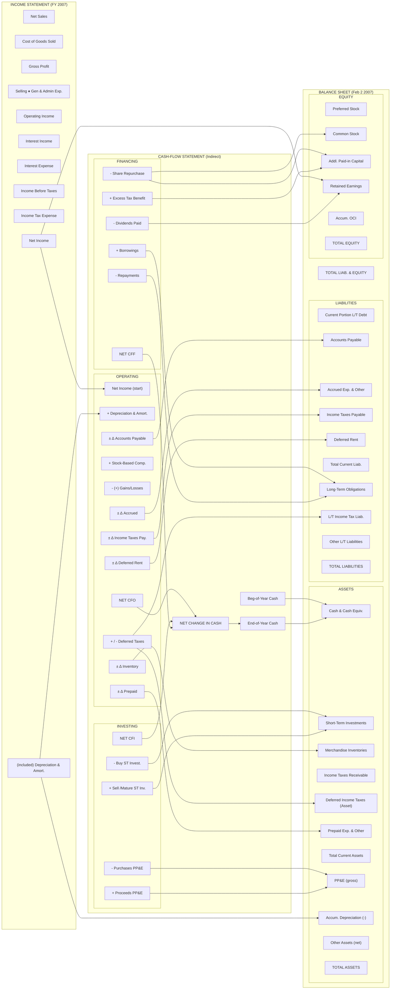

---
key_concepts:
- Option sensitivity analysis
- Delta, gamma, vega, theta, rho
- Equity valuation and analysis
- Dividend discount models
tags:
- regulatory-framework
- greeks
- equity
---

```mermaid
flowchart LR
  %% ──────────────────────────── 1. INCOME STATEMENT ────────────────────────────
  subgraph IS["INCOME STATEMENT (FY 2007)"]
    IS_NetSales["Net Sales"]
    IS_COGS["Cost of Goods Sold"]
    IS_GrossProfit["Gross Profit"]
    IS_SGA["Selling ♦ Gen & Admin Exp."]
    IS_OperatingIncome["Operating Income"]
    IS_InterestIncome["Interest Income"]
    IS_InterestExpense["Interest Expense"]
    IS_EBT["Income Before Taxes"]
    IS_TaxExpense["Income Tax Expense"]
    IS_NetIncome["Net Income"]
    IS_DepAmort["(included) Depreciation & Amort."]
  end

  %% ──────────────────────────── 2. BALANCE SHEET ───────────────────────────────
  subgraph BS["BALANCE SHEET (Feb 2 2007)"]
    subgraph BS_A["ASSETS"]
      BS_Cash["Cash & Cash Equiv."]
      BS_STInv["Short-Term Investments"]
      BS_Inventory["Merchandise Inventories"]
      BS_IncTaxRec["Income Taxes Receivable"]
      BS_DefTaxAsset["Deferred Income Taxes (Asset)"]
      BS_Prepaid["Prepaid Exp. & Other"]
      BS_TCA["Total Current Assets"]
      BS_PPE["PP&E (gross)"]
      BS_AccumDep["Accum. Depreciation (-)"]
      BS_OtherAssets["Other Assets (net)"]
      BS_TAssets["TOTAL ASSETS"]
    end
    subgraph BS_L["LIABILITIES"]
      BS_CPLTO["Current Portion L/T Debt"]
      BS_AP["Accounts Payable"]
      BS_Accrued["Accrued Exp. & Other"]
      BS_IncTaxPay["Income Taxes Payable"]
      BS_DefRent["Deferred Rent"]
      BS_TCL["Total Current Liab."]
      BS_LTDebt["Long-Term Obligations"]
      BS_LTIncTax["L/T Income Tax Liab."]
      BS_OtherLTLiab["Other L/T Liabilities"]
      BS_TLiab["TOTAL LIABILITIES"]
    end
    subgraph BS_E["EQUITY"]
      BS_Pref["Preferred Stock"]
      BS_Common["Common Stock"]
      BS_APIC["Addl. Paid-in Capital"]
      BS_RetEarn["Retained Earnings"]
      BS_AOCI["Accum. OCI"]
      BS_TEquity["TOTAL EQUITY"]
    end
    BS_TLE["TOTAL LIAB. & EQUITY"]
  end

  %% ──────────────────────────── 3. CASH-FLOW STATEMENT ─────────────────────────
  subgraph SCF["CASH-FLOW STATEMENT (Indirect)"]
    %% 3.1 OPERATING
    subgraph CFO["OPERATING"]
      SCF_NetInc["Net Income (start)"]
      SCF_DepAmort["+ Depreciation & Amort."]
      SCF_DefTax["+ / - Deferred Taxes"]
      SCF_StockComp["+ Stock-Based Comp."]
      SCF_GainsLosses["- (+) Gains/Losses"]
      SCF_DInv["± Δ Inventory"]
      SCF_DPrepaid["± Δ Prepaid"]
      SCF_DAP["± Δ Accounts Payable"]
      SCF_DAccrued["± Δ Accrued"]
      SCF_DDefRent["± Δ Deferred Rent"]
      SCF_DIncTax["± Δ Income Taxes Pay."]
      SCF_CFO["NET CFO"]
    end
    %% 3.2 INVESTING
    subgraph CFI["INVESTING"]
      SCF_BuyPPE["- Purchases PP&E"]
      SCF_SellPPE["+ Proceeds PP&E"]
      SCF_BuySTInv["- Buy ST Invest."]
      SCF_SellSTInv["+ Sell /Mature ST Inv."]
      SCF_CFI["NET CFI"]
    end
    %% 3.3 FINANCING
    subgraph CFF["FINANCING"]
      SCF_Borrow["+ Borrowings"]
      SCF_Repay["- Repayments"]
      SCF_TaxBenefit["+ Excess Tax Benefit"]
      SCF_Buyback["- Share Repurchase"]
      SCF_Dividends["- Dividends Paid"]
      SCF_CFF["NET CFF"]
    end
    SCF_DeltaCash["NET CHANGE IN CASH"]
    SCF_BegCash["Beg-of-Year Cash"]
    SCF_EndCash["End-of-Year Cash"]
  end

  %% ──────────────────────────── 4. CROSS-STATEMENT LINKS ───────────────────────
  %% 4.1 Profit → Equity / CFO
  IS_NetIncome --> SCF_NetInc
  IS_NetIncome --> BS_RetEarn

  %% 4.2 Depreciation
  IS_DepAmort --> SCF_DepAmort
  IS_DepAmort --> BS_AccumDep

  %% 4.3 Working-capital rows
  SCF_DInv --> BS_Inventory
  SCF_DPrepaid --> BS_Prepaid
  SCF_DAP --> BS_AP
  SCF_DAccrued --> BS_Accrued
  SCF_DDefRent --> BS_DefRent
  SCF_DIncTax --> BS_IncTaxPay

  %% 4.4 Deferred taxes linkage
  SCF_DefTax --> BS_DefTaxAsset
  SCF_DefTax --> BS_LTIncTax

  %% 4.5 PP&E purchases / sales
  SCF_BuyPPE --> BS_PPE
  SCF_SellPPE --> BS_PPE

  %% 4.6 Short-term investments
  SCF_BuySTInv --> BS_STInv
  SCF_SellSTInv --> BS_STInv

  %% 4.7 Debt flows
  SCF_Borrow --> BS_LTDebt
  SCF_Repay --> BS_LTDebt

  %% 4.8 Equity flows
  SCF_Buyback --> BS_Common
  SCF_Buyback --> BS_APIC
  SCF_Dividends --> BS_RetEarn
  SCF_TaxBenefit --> BS_APIC

  %% 4.9 Cash reconciliation
  SCF_BegCash --> BS_Cash
  SCF_EndCash --> BS_Cash
  SCF_CFO --> SCF_DeltaCash
  SCF_CFI --> SCF_DeltaCash
  SCF_CFF --> SCF_DeltaCash
  SCF_DeltaCash --> SCF_EndCash
```