# Chapter 1: The Big Debt Cycle in a Tiny Nutshell

My goal for this chapter is to convey in seven pages a very brief but complete description of the mechanics of a typical Big Debt Cycle.

## How the Machine Works

Let's start with a fundamental truth that drives everything in economics: credit is simply the ability to spend money you don't yet have. Think of it as a time machine for purchasing power—you can pull future spending into the present. And here's the crucial part: creating credit is as easy as making a promise.

When you understand that one person's spending becomes another person's income, you begin to see why credit creation feels like economic magic. When credit flows freely, people spend more, which means others earn more, which drives asset prices higher, creating a virtuous cycle that everyone loves. It's like a party where everyone's buying rounds—the mood is euphoric.

But here's where the iron law of economics kicks in: every dollar borrowed must eventually be repaid, and that repayment creates the exact opposite effect. When it's time to pay back debt, spending drops, incomes fall, asset prices decline, and the party ends. Nobody enjoys this part.

This creates a profound psychological bias in governments and central banks: they're naturally inclined to keep the credit party going. After all, who wants to be the one to turn off the music?

Let me break down the mechanics precisely. When a borrower takes out a loan (the principal) at a cost (interest rate), they gain immediate purchasing power that exceeds their current earnings and savings. But—and this is critical—over the long term, they must repay both principal and interest, forcing them to spend less than they earn. This fundamental asymmetry between borrowing and repaying is why credit cycles are as inevitable as tides.

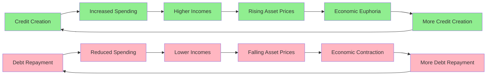

## The Short-Term Debt Cycle

If you've lived through a few economic ups and downs, you've experienced the short-term debt cycle firsthand. Think of it as the economy's breathing pattern—expansion and contraction, inhale and exhale.

The cycle begins in a specific economic environment: activity and inflation are running below desired levels, and interest rates sit low relative to both inflation rates and returns available on other investments. This creates an irresistible incentive structure. Why leave money in low-yielding deposits when you can borrow cheaply and invest in higher-returning assets?

This incentive structure triggers a cascade of borrowing and spending. Asset prices climb, economic activity accelerates, and inflation picks up. Eventually—and this is key—these metrics rise above desired levels. Now the calculus reverses. Money and credit become restricted, interest rates climb to levels that make borrowing unattractive relative to other opportunities.

The result? A mirror image of the expansion phase: borrowing plummets, spending contracts, asset prices fall, economic activity slows, and inflation moderates. This creates conditions for interest rates to fall again, restarting the cycle.

These cycles typically run about six years, though they can range from three to nine years. The variation depends on factors like policy responses, external shocks, and the underlying health of the economy.

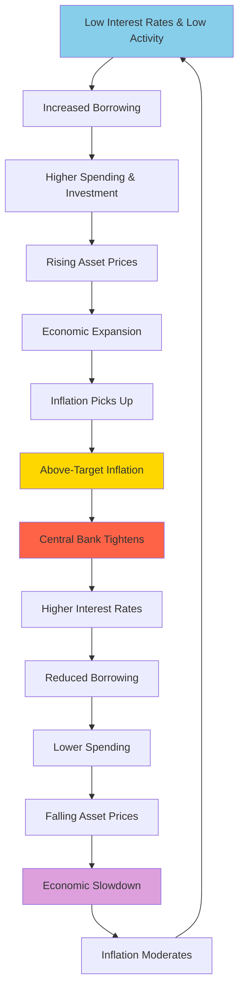

## Short-Term Debt Cycles Add up to Big, Long-Term Debt Cycles

Here's what most people miss: these short-term cycles don't just repeat—they accumulate. Like sedimentary rock forming layer by layer, each short-term cycle typically leaves behind a higher baseline of debt than the previous one.

Why? Because credit acts like a stimulant, and humans have a well-documented preference for stimulants. We want more growth, more prosperity, more of the good times. This creates a systematic bias toward credit expansion. Over decades, this bias compounds, with each cyclical peak in debt surpassing the last, and even the troughs settling at higher levels.

Think of it this way: early in a Big Debt Cycle, the economy is like a young person with a clean credit history and modest expenses. Borrowing is easy because debt service consumes only a small fraction of income. There's ample capacity to take on productive debt—loans that fund ventures generating returns exceeding their costs.

But as the Big Debt Cycle matures, the economy resembles someone approaching retirement with accumulated obligations. Debt service eats up an ever-larger share of income. The pool of genuinely productive investment opportunities shrinks. Yet the desire for credit-fueled growth remains undiminished.

This creates a treacherous dynamic. Early in the cycle, the relationship between borrowers and lenders is relatively simple—primarily driven by straightforward economic incentives and tempered by fresh memories of past debt crises. But late in the cycle, when debt towers over income and productive assets, the system becomes fragile.

The challenge intensifies because debt creates a web of interdependence: one person's debt is another's asset. Both parties must be kept satisfied. As debt levels rise, threading this needle becomes increasingly difficult. Interest rates must be high enough to compensate lenders for risk, yet low enough that borrowers can service their obligations without defaulting.

The margin for error shrinks until it vanishes entirely. **While short-term debt cycles end due to routine economic adjustments, long-term debt cycles end because the debt burden becomes fundamentally unsustainable.**

Put simply: debt can grow like cancer if left unchecked, gradually consuming ever-larger portions of income until it crowds out other essential expenditures. This is the essence of the Big Debt Cycle.

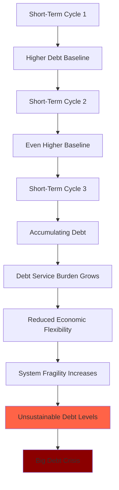

**Throughout the millennia and across countries, what has driven the Big Debt Cycle and has created the big market and economic problems that go along with it is the creation of unsustainably large amounts of debt assets and debt liabilities relative to the amounts of money, goods, services, and investment assets in existence.**

Let me crystallize this into its essence: a debt is nothing more than a promise to deliver money. A debt crisis erupts when the volume of promises overwhelms the money available to fulfill them. It's like writing checks your economy can't cash.

When this moment arrives, central banks face a stark choice between two painful options:

1. **Allow massive defaults**: Keep money "hard" and let debtors fail, triggering a deflationary collapse
2. **Print and devalue**: Create vast amounts of new money, honoring debts in nominal terms while destroying their real value

History shows they always choose door number two. They print and devalue. Why? Because the immediate pain of mass defaults is too politically unbearable. Whether through default or devaluation, the mathematical endpoint remains the same: debt assets (bonds) end up worth far less than promised.

The critical factor determining how this plays out is whether debts are denominated in a currency the central bank can print. This seemingly technical detail makes all the difference between a manageable crisis and an uncontrollable catastrophe.

Yet remarkably, credit rating agencies perpetuate a dangerous fiction. They rate only default risk, not devaluation risk. This creates the illusion that highly-rated government bonds are safe stores of value. But if a bond loses 50% of its purchasing power through currency debasement, does it matter that it technically didn't default?

As I see it: **Default or devaluation, I don't care. What I care about is losing my storehold of wealth, which inevitably will happen one way or another.**

## Following the Debt Cycle's Progression

The fundamental distinction between short-term and long-term debt cycles lies in the central bank's power to reverse them. A short-term contraction can be cured with a strong dose of monetary stimulus—lower rates, easier credit—because the economy retains capacity for non-inflationary growth. The patient responds to treatment.

But a long-term debt cycle contraction resists this medicine. Why? Because debt levels have grown so massive that holders of debt assets want out. They've lost faith that these assets will preserve wealth. Creating more money and credit only accelerates their exodus.

Understanding where we are in the Big Debt Cycle is like a doctor diagnosing a disease by its symptoms. Each stage exhibits distinct characteristics that, once recognized, reveal both the current condition and likely progression.

The cycle follows a predictable arc: from sound money and sustainable credit, to increasingly loose money and excessive credit, to an inevitable debt bust that forces a return to sound money—not by choice, but by necessity.

Let me walk you through each stage with the precision of a pathologist examining tissue samples:

### 1) The Sound Money Stage

This is the cycle's golden age, when the economic machine runs smoothly and sustainably. Net debt levels are low, money maintains its value, the country competes effectively globally, and debt growth finances genuine productivity improvements. The income generated comfortably exceeds debt service requirements, creating a virtuous cycle of rising financial wealth and justified confidence.

Understanding what makes this stage work requires grasping the fundamental difference between credit and money. Credit is a promise to pay money later—an IOU. Money, in contrast, completes transactions immediately. When you pay with money, you're done. When you pay with credit, you've merely postponed the reckoning.

Here's the catch: anyone can create credit simply by accepting promises, but not everyone can create money. I can extend you credit by accepting your promise to pay me later, even if you lack the funds. This ease of creation explains why credit invariably grows to dwarf the money supply.

The most effective money serves dual roles: it's both a convenient medium of exchange and a reliable store of wealth, accepted globally. During the sound money stage, money is "hard"—meaning its supply can't be easily inflated. Think gold, silver, or Bitcoin. These share a crucial characteristic: scarcity that resists manipulation.

Bitcoin represents a modern evolution of hard money. Its global acceptance and algorithmic supply limit echo gold's historical role. The greatest threat to any money's effectiveness as a wealth store is supply inflation. Imagine possessing the power to create money—who could resist the temptation? History shows none can. This temptation drives the Big Debt Cycle.

In the early phase, the financial architecture exhibits two key features:
- Money is typically hard (like gold), with paper currency convertible at fixed rates
- Paper money and debt remain modest relative to hard money and real assets

The Big Debt Cycle essentially operates like a slowly inflating balloon. "Paper" claims (money and debt) gradually expand relative to hard money and real goods/services, while income struggles to keep pace with debt service obligations. It resembles a Ponzi scheme where participants hold ever-increasing debt assets, believing they can convert them to money with real purchasing power. Yet as claims multiply relative to real assets, this conversion becomes mathematically impossible. Eventually, reality intrudes and the rush to exchange debt for hard assets begins.

During the sound money stage, debt metrics remain healthy:
- Private and government debt/income ratios are low
- Government debt service consumes a small fraction of tax revenue
- Liquid assets (reserves, sovereign wealth funds) provide ample cushions

When the current Big Debt Cycle began in 1944, telling ratios illustrated this health:
- US government debt to gold: 7x
- US money supply to gold: 1.3x

Today? Those ratios have ballooned to 37x and 6x respectively—a five-fold deterioration in government debt backing.

This stage features balanced, sustainable conditions: moderate debt levels, steady growth, controlled inflation. "Risky" assets trade cheaply relative to "safe" ones because memories of the previous cycle's devastation still influence psychology and pricing. In the late 1940s and early 1950s, stock earnings yields exceeded bond yields by 4x—investors demanded enormous premiums for equity risk.

This healthy economy with attractive returns plants the seeds for the next stage.

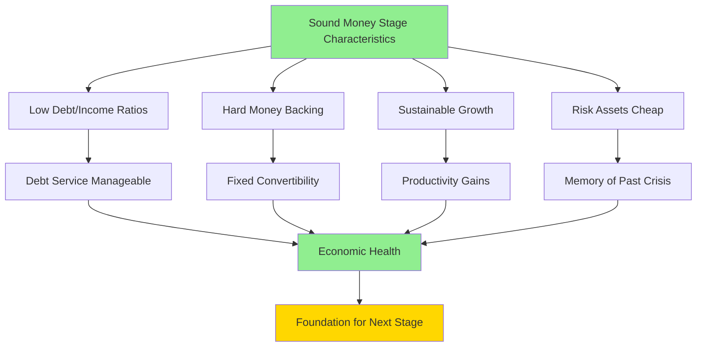

### 2) The Debt Bubble Stage

This is when the intoxication begins. Money flows freely and cheaply, fueling debt-financed expansion and economic boom. Demand for goods, services, and assets surges, driven by borrowed money. Sentiment turns euphoric. By conventional metrics, markets appear overpriced—but nobody cares.

This stage inevitably features "revolutionary" new technologies that seem to justify any valuation. Investors pour money into these innovations without seriously analyzing whether future cash flows will exceed costs. Who needs spreadsheets when you're changing the world?

The mathematical signature of a bubble is unmistakable: debt and debt service grow faster than income—not for quarters, but for years. Asset prices soar beyond any reasonable estimate of discounted future cash flows. My bubble indicator tracks these and other symptoms. (You can find the indicator here.)

Consider a contemporary example: the "unicorn" valued at $1 billion whose founder becomes a paper billionaire despite raising only $50 million. Venture capitalists buy lottery tickets disguised as equity stakes. The gap between imagined and actual wealth yawns wide.

Bubbles can persist surprisingly long before reality intrudes. But their end is mathematically inevitable.

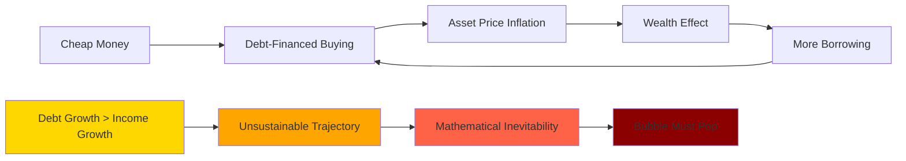

### 3) The Top Stage

The bubble pops through a simple mechanism: the combination of monetary tightening and unsustainable debt growth rates. Nothing more complex than that.

When bubbles burst, contagion spreads with viral speed. Like aggressive cancer, debt problems metastasize rapidly through the financial system. Policy makers must act swiftly—either reverse the contraction or guide a controlled deleveraging.

Initially, the standard response is to administer more of what caused the problem: create additional credit and debt. This can temporarily arrest the decline, like giving an addict another fix. But eventually, the drug stops working. When it does, painful deleveraging becomes unavoidable.

### 4) The Deleveraging Stage

This is when financial gravity reasserts itself with a vengeance. Debt and debt service must be forcibly realigned with income levels to restore sustainability.

The crisis typically begins in the private sector before spreading like a contagion to government and ultimately the central bank. The first warning sign? Net selling of debt assets, especially government bonds. This selling can quickly cascade into full-blown bank runs.

By "bank runs," I mean the rush to convert debt assets into real money—which banks never have enough of. When debt problems surface, holders dump their bonds, driving interest rates higher. Higher rates make debt service more burdensome, increasing risk, pushing rates higher still—a vicious cycle.

This selling of government debt triggers a cascade:
- Free-market monetary tightening
- Economic weakening
- Currency pressure
- Reserve depletion as central banks defend exchange rates

These runs accelerate and become self-reinforcing. Debt holders realize they face losses either through default or devaluation, triggering massive wealth destruction until debts are defaulted, restructured, or monetized.

The tightening's economic damage eventually forces central banks to reverse course—easing credit while accepting currency devaluation. But whether they tighten (causing defaults) or ease (causing devaluation), debt assets suffer.

This creates the dreaded "death spiral"—a self-reinforcing debt contraction where rising rates cause visible distress, spurring more selling, driving rates higher, necessitating money printing, which devalues currency, spurring even more selling. The spiral continues until exhaustion.

When government debt enters this spiral, the instinct is to slash spending and borrowing. But since one person's spending is another's income, austerity typically worsens debt/income ratios. This forces a policy shift toward debt restructuring and monetization, with the mix depending on whether debts are in domestic or foreign currency.

The deleveraging progresses through predictable stages. Initially, central banks cut rates and expand credit. But when:
- Debts are massive and contracting
- Rates hit zero
- Government debt demand evaporates
- Monetary easing can't offset deflationary forces

...central banks must deploy new "tools."

The ideal stimulus requires pushing rates below nominal growth, inflation, and bond yields. But how do you go below zero? Meanwhile, governments hemorrhage money—revenues collapse while spending soars to support the private sector. Yet private demand for government debt vanishes just when supply explodes.

Often this stage features "pushing on a string"—a 1930s phrase describing when stimulus fails to generate spending. Businesses, investors, and consumers prefer hoarding cash despite zero (or negative) rates. Fear overwhelms greed. Even free money can't induce borrowing when deflation makes holding cash attractive.

Central banks face their ultimate choice: maintain hard money and accept catastrophic defaults, or print money and accept devaluation. History's verdict is unanimous—they always print. Each central bank can only print its own currency, which becomes crucial for what follows.

If able to print, central banks create massive money supplies and flood markets. They buy government and systemically important private debt to compensate for vanished private demand and suppress interest rates. Sometimes they buy equities and create consumption incentives.

Currency devaluation often becomes desirable—it stimulates exports and creates inflation to counter deflation. Links to gold or other hard assets get severed, enabling pure fiat money. For already-fiat currencies, devaluation relative to other stores of wealth helps.

Sometimes central banks must raise nominal rates—either to fight inflation or because markets reject new debt issuance at current yields. Watch real and nominal rates carefully, along with debt supply/demand dynamics. Extraordinary measures like wealth taxes and capital controls become common.

The deleveraging stage inflicts necessary pain as debt burdens get reduced through defaults, restructurings, and devaluations. Aggressive mixing of deflationary restructuring and inflationary monetization becomes inevitable. Typically, debt/income ratios must fall roughly 50% (plus or minus 20%).

Success requires balance. In a "beautiful deleveraging," governments and central banks coordinate restructurings (deflationary) with monetary stimulus (inflationary). When properly balanced, growth resumes with falling debt burdens and acceptable inflation. Whether beautiful or ugly, this stage purges enough debt to enable the next cycle.

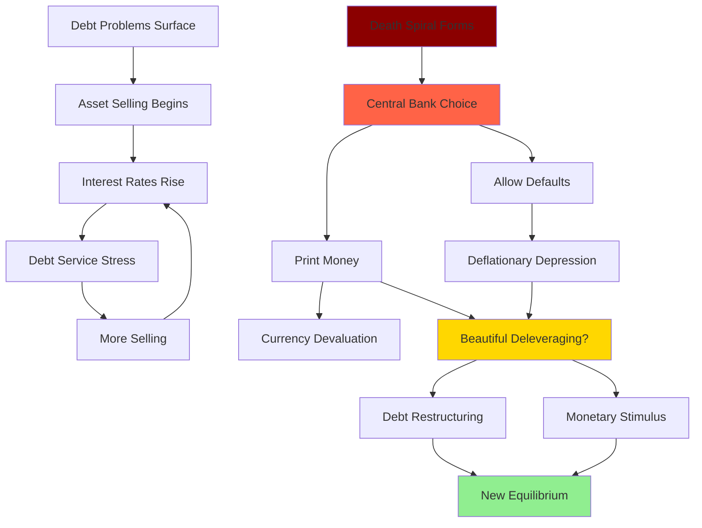

### 5) The Big Debt Crisis Recedes

This final stage represents the return to equilibrium and the foundation for the next cycle. For a monetary system to function, several conditions must align:

- Money/debt must credibly store wealth
- Debt service must align with income capacity
- Both creditors and debtors must believe in the system's sustainability
- Money availability and real interest rates must balance both parties' needs

This late phase involves both psychological and fundamental adjustments. After severe deleveraging, lender-creditors resist lending, scarred by recent losses. Governments and central banks must restore credibility through concrete actions:

- Governments must earn more than they spend
- Central banks must make money "hard" again through high real yields, building reserves, or linking to hard assets

Interest rates typically need to exceed inflation substantially, compensating for currency risk. Lending becomes profitable; borrowing becomes costly. This stage can prove highly attractive for patient creditors.

The monetary policy regime itself reveals the cycle's stage. As the Big Debt Cycle progresses, central banks must evolve their tools to maintain expansion. By observing which tools they're using, you can diagnose where the cycle stands:

**Phase 1: Linked (Hard) Monetary System (MP1)**
This characterized 1944-1971. It ends when debt bubbles burst, triggering "bank runs" from credit to hard money. Limited hard money supplies force massive defaults, creating irresistible pressure to print rather than maintain the peg.

**Phase 2: Fiat Money, Interest-Rate-Driven Policy (MP2)**
Interest rates, bank reserves, and capital requirements control credit growth. While allowing flexibility, this system provides less assurance against wealth-destroying money printing. The US occupied this phase from 1971-2008. It ends when rate changes lose effectiveness (hitting zero) or private debt demand falls short of supply.

**Phase 3: Fiat System with Debt Monetization (MP3)**
Central banks create money to buy assets directly. This becomes necessary when rates can't fall further and private demand for debt proves insufficient at acceptable yields. It benefits financial asset holders disproportionately. The US used this from 2008-2020.

**Phase 4: Coordinated Fiscal and Monetary Policy (MP4)**
When MP3 proves insufficiently targeted, fiscal and monetary authorities coordinate to deliver money to those most in need. While temporarily alleviating problems, it doesn't solve underlying imbalances.

**Phase 5: Big Deleveraging (MP5)**
Major debt reduction through restructuring and/or monetization becomes unavoidable. A "beautiful deleveraging" balances deflationary debt reduction with inflationary monetization, avoiding extremes of either.

The sequence to remember: private sector overborrows and faces crisis → government helps by overborowing and faces crisis → central bank buys government debt and prints money → at worst, central bank faces losses requiring more printing, creating a death spiral → eventually, restructuring and monetization reduce debts to sustainable levels.

**Phase 6: Return to Hard Money (MP6)**
After burning debt holders through defaults and devaluation, governments must restore monetary credibility. This typically means returning to MP1 (hard asset backing) or MP2 (disciplined interest rate policy) with high real yields that reward creditors.

**For great countries with great empires, the end of the Big Debt Cycle has meant the end of their prominence.**

## A Few Concluding Observations

**It pays to build up savings in the good times so there are savings to draw on in the bad times.** Every society faces this eternal balancing act—too much saving stifles growth, too little leaves no buffer for crises. None achieve perfect balance, but some do far better than others.

**Big debt crises are inevitable.** History shows only a handful of exceptionally disciplined countries have avoided them. Why such universal failure? Because lending is never calibrated perfectly to income-generating capacity. More fundamentally, human psychology guarantees excess—people always want more credit, which becomes more debt. Credit feels good; repayment hurts. So debt accumulates beyond sustainable levels, forcing painful readjustment through some combination of default and monetization.

Even more perversely, psychology amplifies cycles: bubbles make people optimistic, spurring more borrowing; busts make people pessimistic, crushing spending. Despite this pattern repeating across millennia, most policymakers and investors believe their current system is different. Change seems unthinkable—until it arrives suddenly.

**The best way to anticipate a debt crisis happening is not by focusing on a single influence or number like debt as a percent of GDP; it is by understanding and focusing on a number of interrelated dynamics** that we will explore in coming chapters.

**If debts are denominated in a country's own currency, its central bank can and will "print" the money to alleviate the debt crisis.** This power allows better crisis management than nations borrowing in foreign currencies, but at the cost of currency debasement. When debts are in currencies central banks cannot print, the result is outright default and deflationary depression.

**All debt crises, even big ones, can be managed well** by balancing deflationary debt reduction (restructuring) with inflationary reduction (monetization). The key is spreading adjustment over time. If debt/income ratios must fall 50%, doing so at 3-4% annually proves far less traumatic than overnight collapse.

**Debt crises provide great risks and opportunities** that have both destroyed empires and created fortunes for those who understood the dynamics and navigated them skillfully.

**If you try to focus on debt cycles precisely or focus your attention on the short term you won't see them.** It's like comparing snowflakes and missing their fundamental similarity by obsessing over superficial differences.

## That's it in a nutshell.

In the rest of this study I will get into the mechanics in greater depth, show the actual archetypical sequences that have played out over 35 cases, look at how the Big Debt Cycle and Big Cycle that includes the other big cycles (for instance, cycles of internal and external order) that started in 1944 and that we are currently in the late stages of have transpired relative to this template, and briefly look at the Chinese and Japanese Big Cycles and a number of other cases. The Japanese case is interesting because Japan is further along in its Big Debt Cycle. Notably its large debt and debt monetizations have led to the depreciation of its currency and debt, which led holders of its bonds to have losses of 45% relative to holding US dollar debt since 2013 and losses of 60% relative to holding gold since 2013. In the final chapters, I will share how I am processing the US today relative to this template, how the US could reduce the risk of an acute debt crisis, and how I read the Five Big Forces today.


# Chapter 2: The Mechanics in Words and Concepts

Note: This chapter gives unconventional concepts about the mechanics of how markets work that I believe would be valuable for professionals and aspiring professionals but are probably beyond the interests of others. I suggest that you give it a try to see whether or not it's the sort of thing you'd like to get into.

Imagine the economy as a vast, interconnected machine where every lever pulled creates ripples throughout the entire system. Because nothing happens without a cause, and every cause triggers multiple effects, the economy operates like a perpetual motion machine of extraordinary complexity. To truly understand this machine, we must dissect its mechanics with surgical precision.

Think of it this way: every economic event—from a single purchase at a corner store to a central bank's decision to print trillions—sends waves through the system. These waves collide, amplify, and sometimes cancel each other out in patterns that seem chaotic but actually follow discernible rules. Thanks to breakthroughs in artificial intelligence, we're approaching a moment where we might finally map these intricate patterns completely. But for now, we must rely on careful observation, historical analysis, and the computational tools at our disposal.

What I'm presenting here represents my attempt to decode the debt/credit/money/economic dynamic—itself just one crucial component of an even grander machine. Through decades of studying what happened and why, I've tried to distill complex realities into comprehensible principles. This is necessarily a simplified picture, but one that captures the essential mechanisms.

Let me zoom out to the highest vantage point. Five titanic forces shape our world, and understanding their interplay is essential:

**The debt/credit/money/economic cycle** - The breathing pattern of financial systems
**The internal political order/disorder cycle** - The rhythm of domestic harmony and conflict
**The external geopolitical order/disorder cycle** - The dance of international cooperation and competition
**Acts of nature** - Droughts, floods, pandemics that periodically reset human progress
**Human inventiveness** - Particularly technological breakthroughs that redefine what's possible

These forces don't operate in isolation—they're locked in an intricate dance, each influencing the others in ways that compound their individual effects. To understand the complete picture of how they interact, you can explore my book *Principles for Dealing with the Changing World Order*.

For this study, we'll focus intensely on the first force—the credit/debt/money/economic dynamic—with particular attention to that critical moment when governments and central banks approach insolvency. But even as we zoom in on this specific mechanism, we cannot ignore how it interacts with the other four forces. From everything I observe, we're likely entering an extraordinarily turbulent phase where all five forces converge to reshape the world order. My hope is that understanding these dynamics will help us navigate the coming changes more skillfully.

## How the Machine Works

Money and credit are the lifeblood of the economic organism. Just as blood carries oxygen and nutrients to every cell in your body, money and credit transport purchasing power to every corner of the economy. They flow from areas of surplus to areas of need, enabling the entire system to function.

The central government acts as the economy's brain, directing the system's operations while consuming a significant portion of resources (typically 15-30%) to perform essential functions like defense, infrastructure, and social programs. The central bank serves as the heart, pumping money and credit through the system's arteries. When this circulation flows smoothly—when capital providers earn good returns and capital users deploy it productively—the entire organism thrives. When circulation falters, the system experiences trauma.

Now, viewing the debt dynamic as a cyclical machine doesn't mean nothing changes. Of course there are innovations, cultural shifts, and institutional evolution. But these changes are surprisingly minor compared to the timeless patterns that repeat across centuries and civilizations. It's like watching ocean waves—each is unique in its details, but the fundamental physics driving them remains constant.

Understanding these universal principles first, then examining the variations, provides far richer insight than the reverse approach. So let me start with the major timeless mechanics, painted in broad strokes rather than exhaustive detail.

## The Five Major Parts and How They Work

Picture the economy as composed of five fundamental elements that interact to create all economic activity:

1. **Goods, services, and investment assets** - The real things people want
2. **Money** - The universally accepted medium for obtaining these things
3. **Credit** - The promise to deliver money in the future
4. **Debt liabilities** - The obligations created when credit is used
5. **Debt assets** - The flip side of debt liabilities (your debt is my asset)

Master how these five elements interact, and you'll understand why economies experience booms and busts with clockwork regularity.

Let's start with the basics. Goods, services, and investment assets can be purchased with either money or credit—this simple fact contains profound implications.

**Money settles transactions completely.** When you buy a car with cash, you hand over the money, receive the car, and you're both done. No lingering obligations remain. Throughout history, what constitutes "money" has evolved dramatically. For millennia, money meant a promise to deliver gold or silver. Since 1971, when the US abandoned the gold standard, we've operated in a fiat system where money is whatever central banks declare it to be—more like a special form of credit that promises general purchasing power rather than specific hard assets. But money differs crucially from credit because only central banks can create it, and they can create whatever amount they choose.

**Credit leaves obligations dangling.** Unlike money, credit can be created by any two willing parties through mutual agreement. When you buy with credit, you're essentially borrowing purchasing power from your future self. This time-shifting creates the economy's fundamental rhythm. Credit allows borrowers to spend beyond their current means, driving up demand and prices in the near term. But eventually, the bill comes due. When debts must be repaid, borrowers must spend less than they earn, depressing demand and prices. This pendulum swing between credit expansion and contraction creates the cycles we experience.

The relationship between money and credit is like that between the foundation and structure of a building. The amount of money in existence sets the base level of potential credit creation. More money enables more credit; less money constrains it. Central banks, by controlling the money supply, wield enormous power over the entire credit system.

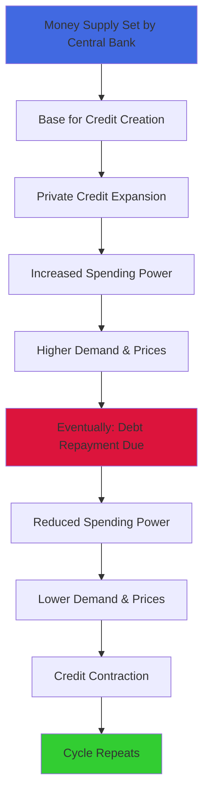

Now let's examine how prices are actually determined—and why my approach differs radically from conventional economics.

## Understanding Price Formation

To grasp how prices truly form, we must start at the atomic level of economics: the individual transaction. Every market, every economy, is simply the sum of countless transactions. And what is a transaction? It's an exchange where a buyer gives money (or credit) to a seller in return for goods, services, or financial assets.

Here's the fundamental equation that governs all prices:

**Price (P) = Total money spent ($) ÷ Total quantity sold (Q)**

Or more simply:

$$P = \frac{\$}{Q}$$

This equation is indisputable. If you know total spending and total quantity sold, you know the price. Period. The challenge lies in predicting these two variables, which requires understanding what motivates buyers to spend and sellers to sell.

Consider the conceptual framework:


While this might appear complex, it's actually straightforward. Every buyer has reasons for spending what they spend. Every seller has reasons for selling what they sell. Identify the major players and their motivations, and you can predict their actions—and thus prices—with remarkable accuracy.

This approach diverges sharply from traditional economics, which measures both supply and demand in terms of quantity. Conventional theory speaks of "elasticity"—how quantity demanded or supplied responds to price changes. This implies fixed relationships that simply don't exist in reality.

Why? Because spending isn't just about wanting things—it's about having the means to buy them. If buyers suddenly have more money (through wage increases, credit availability, or money printing), they'll spend more on the same goods, driving prices higher. The conventional model misses this crucial dynamic.

My approach, developed through decades of trading commodities and financial instruments, focuses on connecting real market participants with real price movements. It works not just for wheat or copper, but for bonds, currencies, and entire economies.

Play with the formula and powerful insights emerge. If spending drops 10% while quantity remains constant, prices fall 10%. This means unsustainable spending patterns—whether too high or too low—signal inevitable price reversals. Identify these extremes and you can calculate both the timing and magnitude of coming changes.

This framework reveals several critical insights:

**When money and credit expand while productive capacity exists, you get non-inflationary growth.** Both spending ($) and quantity (Q) increase together, leaving prices stable while the economy expands. This is the economic sweet spot.

**When money and credit expand but capacity is constrained, you get inflation without real growth.** Spending ($) rises but quantity (Q) cannot, so prices must rise. This is why late-cycle economies experience stagflation.

These principles explain why early cycles (abundant capacity + stimulative central banks) deliver strong growth with low inflation, while late cycles produce weak growth with rising prices. We'll explore what monetary inflations and inflationary depressions look like in detail later.

Where does productivity fit? High productivity growth allows producers to expand quantity (Q) as money and credit grow, extending non-inflationary growth. Productivity gains can manifest as better quality at the same price or dramatically lower costs (think digital photos replacing film). This is why technological revolutions can sustain booms longer than seems possible.

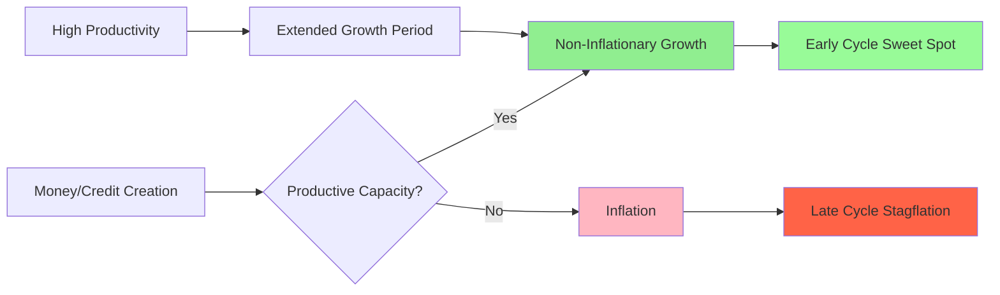

Now let's examine what drives spending and selling decisions across major categories.

People purchase goods and services to use, and investments to build wealth. The allocation between consumption and investment depends on relative prices, available resources, and the comparative appeal of spending now versus saving for later.

These choices involve constant comparisons across two dimensions:

1. **Between different items** - money for food, gold, stocks, real estate
2. **Across time** - buying today versus buying next year

This creates an enormously complex matrix of relative value assessments. The most powerful forces shaping these relationships are arbitrage opportunities and near-certain bets.

**Currencies serve dual roles: facilitating transactions and storing wealth.** They're both the oil in the economic engine and the fuel tank storing purchasing power.

**Investments are simply exchanges of money today for money tomorrow.** All investments generate returns through just two channels: yields and price appreciation. Together these create total return.

$$\text{Total Return} = \text{Yield} + \text{Price Change}$$

All investments compete based on total return. Why? Because most investors care primarily about total return, not its composition, and because arbitrage ensures alignment across markets. This competition creates a unified pricing matrix across all assets.

Let me illustrate with gold versus Treasury bonds. Suppose Treasuries yield 5% while gold yields nothing. For anyone to rationally buy gold, they must expect its price to rise by at least 5% annually. Otherwise, they'd buy bonds instead. This expectation gets priced into markets through countless individual decisions.

Investors compare the 5% certain yield against their estimate of currency depreciation. If money printing seems likely to exceed 5% annually, gold becomes attractive. If not, bonds win. Millions of such calculations, backed by real money, create market prices. The constant arbitrage between these assessments ensures remarkably efficient pricing most of the time—though not always perfectly, which creates opportunities for those with superior understanding.

This competitive dynamic extends beyond simple assets. Financial engineering transforms one asset into synthetic versions of another through leverage, derivatives, and hedging. This creates an intricate web where all prices influence all other prices.

Understanding current market pricing through this lens becomes invaluable for navigating debt cycles. Expected real returns (after inflation) drive capital allocation. When real returns on financial assets are high, money flows there. When they're low or negative, money seeks real assets—real estate, commodities, art, gold.

This is particularly crucial for government bonds. Their returns are known with certainty (the yield is fixed and default risk minimal for bonds in domestic currency), making them the benchmark against which everything else is measured. When bond yields fall below inflation, bonds get sold and inflation hedges get bought. When central banks create massive amounts of money and credit, devaluing both, investors naturally favor real assets that preserve purchasing power.

Price relationships follow specific patterns. While most investors focus on spot prices (for immediate delivery), markets also price future delivery through forward contracts. The relationships between spot and forward prices, between short and long-term bonds, between bonds of different countries—all follow logical patterns driven by arbitrage.

Consider different maturities of government debt. The spread between short and long-term rates primarily reflects expected central bank actions. If traders expect rate hikes, long-term bonds must yield more than short-term ones by enough to compensate. These expectations get constantly tested and refined by market forces.

## Debt Is Currency and Currency Is Debt

Here's a profound insight: since debt assets promise to deliver currency in the future, debt and currency are fundamentally the same thing. If you dislike a currency, you must dislike its bonds. If you distrust the bonds, you must distrust the currency. Once you factor in their relative yields, they're two faces of the same coin.

Remember our gold/bond comparison? The same logic applies to different currencies and their bonds. This creates powerful international capital flows that prove crucial during debt crises.

Let me illustrate with a concrete example:

Imagine Country A's interest rates are 3% below Country B's. Normally, you'd expect Country A's currency to appreciate by 3% annually to offset this difference. Otherwise, traders could earn risk-free profits by borrowing in Country A and lending in Country B.

But what if Country A's currency is expected to depreciate by 2% annually instead of appreciate? Now there's a 5% annual profit opportunity. Capital will flood out of Country A's bonds, forcing one of two adjustments:

**Option A:** The currency immediately falls by roughly 40% (the present value of 5% annual losses over 10 years)

**Option B:** Interest rates spike by 5%, crashing bond prices by approximately 40%

Either way, Country A's bondholders face devastating losses. If capital controls prevent these adjustments, the losses materialize gradually—5% annually compounding to 40% over a decade.

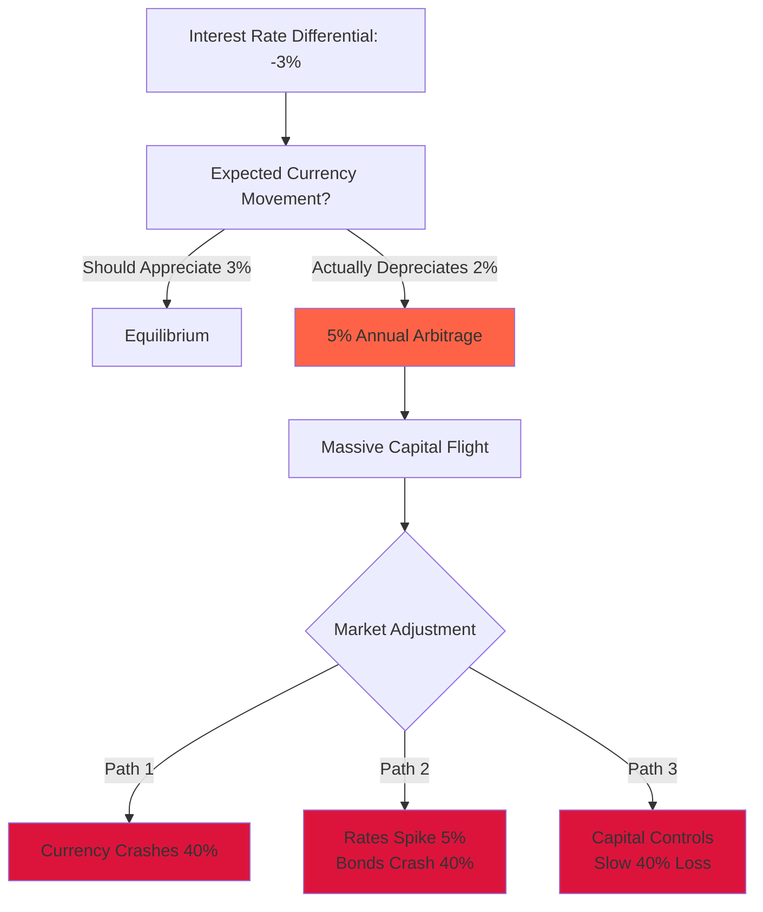

The crucial lesson: **bad returns materialize one way or another.** Whether through outright default, currency devaluation, or inflation exceeding interest rates, mathematics ensures bondholders lose. The only question is how.

## The Major Types of Players and How They Behave to Drive What Happens

Five key players orchestrate the debt cycle symphony:

1. **Borrower-debtors** (private and government) - Those who take on debt to spend beyond current means
2. **Lender-creditors** (private and government) - Those who forego current spending to earn returns
3. **Banks** - Intermediaries who profit from the spread between borrowing and lending rates
4. **Central governments** - Political entities that typically spend beyond their means
5. **Central banks** - The only entities that can create money, tasked with managing the system

Understanding these players' motivations and constraints allows us to predict their behavior and thus market outcomes.

**Credit expansion requires willing partners.** Both borrowers and lenders must see benefit, yet their interests fundamentally conflict. Borrowers need low rates to service debt; lenders need high rates to justify the risk. This tension creates the cycle's fundamental rhythm.

When rates are too high, borrowers slash spending, sell assets, or default—crashing markets and economies. When rates are too low, lenders refuse to lend or dump existing bonds—forcing rates higher or requiring central banks to print money, creating inflation. The system constantly oscillates between these extremes.

**Banks amplify cycles through leverage.** For millennia, across all cultures, banks have played the same role: borrowing at low rates, lending at higher rates, and pocketing the spread. They create bubbles by lending far more than they actually have, repeatedly leveraging their capital. This works magnificently when loans perform and deposits remain stable. But when loans sour or depositors flee, banks fail spectacularly, transforming individual problems into systemic crises.

**The iron law of debt: over the long run, debts cannot grow faster than the incomes needed to service them.** Similarly, interest rates cannot remain too high for borrowers or too low for lenders indefinitely. When these imbalances persist, crisis becomes inevitable. Watch these ratios carefully—they signal danger ahead.

**Big debt crises emerge when debt assets and liabilities dwarf the supply of actual money and real economic output.** It's a simple matter of arithmetic—too many claims chasing too few real resources.

**Central banks control the money supply, determining total purchasing power.** Whatever money and credit they create must flow somewhere—into goods, services, or financial assets. This is why all asset classes tend to rise and fall together with monetary tides, like boats on the harbor.

Central banks exist to smooth these cycles, particularly to manage debt crises. Before central banks (the Federal Reserve only began in 1913), economies experienced savage boom-bust cycles. Banks regularly failed when too many depositors demanded their gold simultaneously. These traumatic experiences birthed central banking—government-sanctioned entities empowered to create money and lend during crises.

But where do central banks get their money? They manufacture it from thin air, digitally or physically. While this provides crucial crisis relief, it also devalues money and debt assets, creating inflation.

Central banks pursue seemingly simple goals: sustainable debt growth, steady economic expansion, and moderate inflation. To achieve these, they raise rates to cool overheating or lower them to stimulate sluggish growth. But these simple tools must navigate between Scylla and Charybdis—satisfying both creditors and debtors becomes increasingly difficult as debt levels rise.

**Central governments compound the problem.** As political entities serving at voters' pleasure, they invariably promise more than they can deliver. This bias toward deficit spending reinforces credit expansion during booms and debt crises during busts. When governments and central banks work well, they create broad prosperity through productive investment. When they fail, the results are catastrophic.

**The critical insight: as debt assets and liabilities grow relative to income, the system becomes increasingly fragile.** The margin for error shrinks until it vanishes entirely.

Because these five players have transparent motivations, their behavior is predictable. When debt is low, economies weak, and inflation modest, central banks will ease. This creates ideal conditions for borrowers and challenging ones for lenders. When debt grows unsustainably fast and inflation accelerates, central banks tighten—rewarding savers and punishing borrowers.

This dynamic creates two interlocking cycles: short-term cycles averaging six years (ranging from three to nine) and long-term cycles averaging 80 years (ranging from 55 to 105). Both spiral around an upward productivity trend driven by human innovation.

## The Short- and Long-Term (Big) Debt Cycles

The **short-term debt cycle** follows this sequence:

1. Recession leads to...
2. Central bank easing (cheap credit), creating...
3. Debt-financed expansion and boom, producing...
4. Bubbles and inflation, forcing...
5. Central bank tightening, causing...
6. Economic weakening and return to recession

Since 1945, the US has experienced 12.5 of these cycles—we're midway through the 13th as I write. Each typically ends with higher debt levels than the previous cycle because policymakers consistently choose reflation over accepting recessions.

The **long-term (big) debt cycle** emerges from accumulating short-term cycles. Like sediment forming rock, each cycle adds debt layers until the total becomes unsustainable. This necessitates dramatic restructuring through default and monetization, creating severe economic turbulence.

These cycles dance around an ascending productivity line—humanity's growing ability to produce more with less. This incline depends on practical innovation (entrepreneurs with capital) working within supportive systems (good governance, rule of law, cooperation).

Over short periods (1-10 years), the short-term cycle dominates. Over long periods (10+ years), the Big Debt Cycle and productivity growth matter more. Conceptually:


**The key distinction between sustainable and unsustainable debt: does it generate sufficient income to service itself?** When debt grows faster than income, requiring more borrowing just to pay interest, collapse approaches. The surest crisis indicator is large-scale borrowing to pay existing debt service.

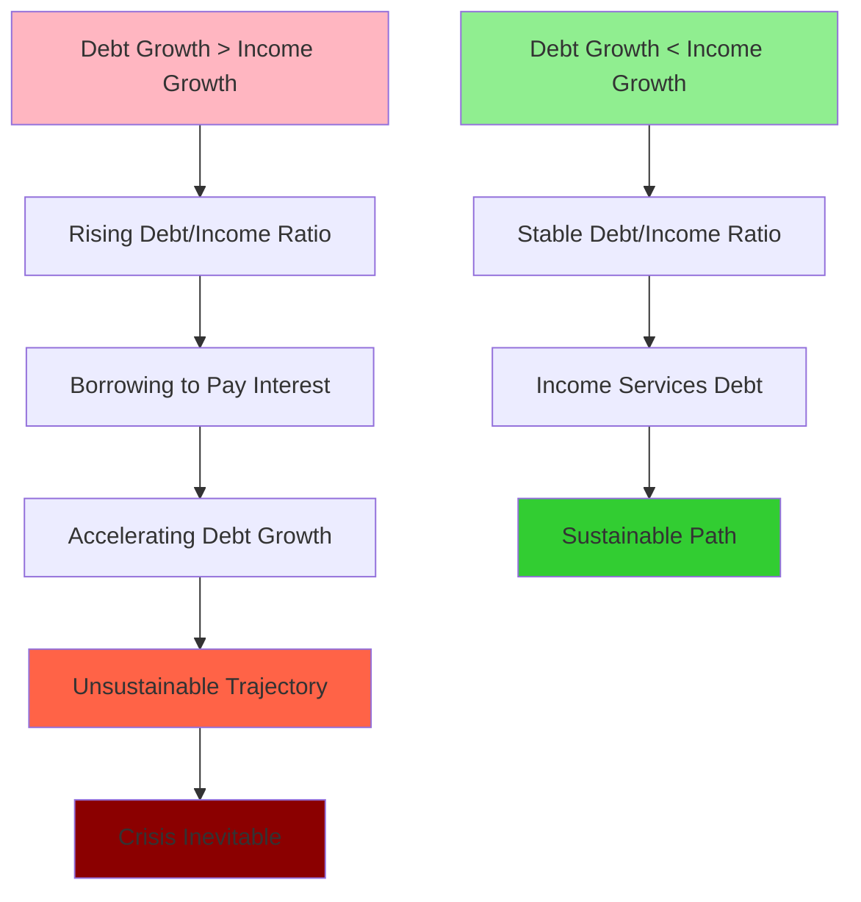

**Why don't central bankers prevent these cycles?** Four reasons:

1. **Universal bias toward growth** - Everyone benefits from expansion, so we push limits until they break
2. **Uncertain danger zones** - Precise debt thresholds depend on unknowable future conditions
3. **Opportunity costs** - Too little credit can damage economies as severely as too much
4. **Manageable crises** - Even severe debt crises can be navigated without complete catastrophe

Credit resembles medicine—too little causes economic anemia, too much creates addiction. The art lies in dosage. Used wisely, credit funds innovations and opportunities that wouldn't exist otherwise. And if governments control the restructuring process in their own currency, pain can be spread tolerably.

History shows debt assets and liabilities grow virtually without exception until becoming unsustainable. Once returns become unacceptably low or risks unacceptably high, the system breaks.

When debt towers over income, central banks face an impossible choice. Rates high enough to satisfy creditors crush debtors. Rates low enough to sustain debtors rob creditors. Because one person's debt is another's asset, someone must lose. This forces central banks to choose between:

1. **Hard money path**: No printing, letting rates rise to market-clearing levels. This creates deflation, massive defaults, and depression—making cash king while crushing all other assets.

2. **Soft money path**: Print aggressively to suppress rates and buy debt. This creates inflation, currency devaluation, and financial repression—preserving nominal values while destroying real purchasing power.

The hard money path proves so economically devastating that central banks always eventually choose inflation. But both paths lead to the same destination: massive real losses for creditors.

At cycle peaks, policymakers can pull four levers:

1. **Austerity** - Spending cuts that typically backfire by crushing incomes faster than debts
2. **Debt restructuring** - Defaults and write-downs that directly reduce burdens
3. **Money printing** - Central bank purchases that inflate away real debt values
4. **Redistribution** - Transfers from those with surplus to those in distress

Austerity seems logical but proves counterproductive. Since spending equals income, cuts create deflationary spirals. Governments see revenues plunge while social demands soar, widening deficits. Tax increases further strangle growth.

The optimal solution—a "beautiful deleveraging"—balances deflationary restructuring with inflationary printing. Done skillfully, this reduces debt burdens while maintaining modest growth and acceptable inflation. The key is spreading adjustment over time—reducing debt/income ratios by 3-4% annually rather than 50% overnight.

Most debt crises in domestic currencies resolve within 1-3 years through this rebalancing. These transitions create extraordinary risks and opportunities for those who understand the dynamics.

## The Big Debt Cycle, Its Risks, and How to Deal with It Need to Be Better Understood

Because transformational debt crises occur roughly once per lifetime, they're paradoxically both the most important and least understood economic events. Like hundred-year floods, their rarity breeds complacency. Each generation must learn these lessons anew, often painfully.

This knowledge gap is dangerous. It's like ignoring cholesterol buildup because you haven't had a heart attack yet. The accumulating risk remains invisible until the crisis strikes.

Let's define financial health clearly:

**Healthy:**
- Private credit funds profitable ventures that generate returns exceeding costs
- Government borrowing finances productivity enhancements (infrastructure, education) that boost tax revenues
- Cyclical deficits during downturns are repaid during expansions

**Unhealthy:**
- Central banks chronically print money to compensate for insufficient private debt demand
- Governments run structural deficits, with debt growing faster than tax revenues
- Debt service consumes an ever-growing share of income

The mechanics summarized:

- Central banks can create unlimited money and heavily influence credit
- Borrowers need sufficient money at low enough rates to service debts
- Lenders need high enough returns to justify risk
- This balance becomes progressively harder as debt/income ratios rise
- Eventually, deleveraging becomes mandatory
- Beautiful deleveragings are possible if debt is in domestic currency
- Long-term financial health requires earning more than spending and owning more than owing
- Understanding cycle position and player motivations enables successful navigation
- The past is prologue

## Important Takeaways:

**Debt crises are inevitable.** History shows only the rarest, most disciplined societies avoid them. Credit is never allocated perfectly and often allocated terribly, as cycle psychology drives bubbles and busts.

**Most debt crises can be managed well** through appropriate restructuring and monetization, spreading pain tolerably over time.

**All debt crises create opportunities** for investors who understand the dynamics and maintain discipline.

**At Big Debt Cycle peaks, satisfying both creditors and debtors becomes impossible.** Central banks must navigate between deflation and inflation, typically experiencing both in sequence. Holding government debt during such periods guarantees losses—through either default or devaluation.

**When forced to choose, central banks always print.** The immediate pain of deflation is politically unbearable compared to the slow burn of inflation. But printing only works for domestic currency debt—foreign currency debt creates true catastrophes.

## The Dance of the Five Forces

While I've focused on debt cycles, they cannot be understood in isolation. The five great forces—debt cycles, internal order, external order, nature's shocks, and human innovation—intertwine in complex choreography.

These forces amplify each other. Financial crisis breeds political conflict, which worsens financial conditions. Domestic weakness invites international aggression. Natural disasters striking fragile systems create cascading failures. Yet innovation can transform apparent limits into new frontiers.

Together, these forces create history's grand cycles—the rises and falls of civilizations, the rhythms of war and peace, the tides of human progress. By monitoring key indicators across all five forces, we can navigate more skillfully.

You can observe great powers' evolutionary paths through telltale signs:
- Inexorably rising debt accompanied by progressively weaker monetary restraints
- Declining education quality, infrastructure, rule of law, and government effectiveness
- Diminishing civility and increasing internal conflict
- Loss of competitive position internationally

I won't elaborate here—these dynamics are thoroughly explored in *Principles for Dealing with the Changing World Order*. Instead, let's dive deeper into the Big Debt Cycle's mathematical mechanics, which I'll strive to make accessible despite their complexity.

# Chapter 3: The Mechanics in Numbers and Equations

**A Strategic Note for the Ambitious Reader:** This chapter transforms abstract debt dynamics into concrete mathematical relationships that financial professionals use daily to anticipate and navigate sovereign debt crises. While the equations might initially seem intimidating, they're actually elegant tools that reveal exactly when and why governments find themselves trapped between impossible choices. Consider this chapter your technical arsenal—scan it first to grasp the core concepts, then return to master the calculations that could define your career in fixed income or macroeconomic analysis.

In Chapter 2, we explored through narrative how central governments and their central bank partners march toward financial catastrophe. Now we're shifting gears entirely—from storytelling to mathematical modeling. Think of this transition like moving from watching a chess game to learning the precise calculations that grandmasters use to see ten moves ahead. These formulas don't just describe what happens; they let you calculate exactly when debt burdens will become unbearable, allowing you to position yourself before markets realize the inevitable.

Let me first establish what makes a debt burden "unsustainable" with crystalline clarity. Picture your personal finances: you're sustainable when money flowing in exceeds money flowing out. You become unsustainable when outflows exceed inflows, forcing you to either drain your savings or borrow increasingly desperate amounts until both wells run dry. At that moment of exhaustion—when savings vanish and no one will lend—you experience financial failure. Governments face this identical constraint, just with more zeros and more dramatic consequences.

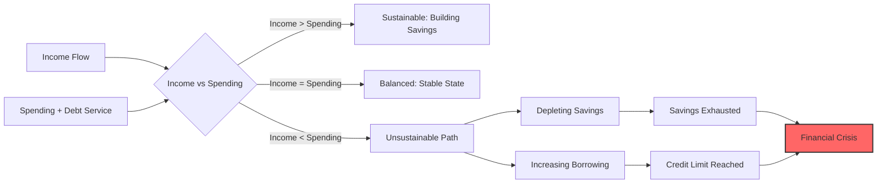

Think of this money flow as your economic bloodstream, with income statements and balance sheets serving as your vital signs. A healthy government, like a healthy body, maintains equilibrium—income matches or exceeds spending, while debts grow no faster than the income supporting them. This doesn't mean all debt growth signals disease. When borrowed funds generate income growth that outpaces debt service costs, you're investing wisely. But when debts compound faster than income—picture plaque accumulating in arteries—each payment increasingly constricts what's available for other purposes. Eventually, this constriction triggers default: the economic heart attack.

Interest rates act as the master valve in this system, dramatically amplifying or dampening debt service burdens. They simultaneously influence creditors' appetite for holding government bonds. As debt service consumes an ever-larger share of income and savings, the squeeze tightens until something breaks.

While I monitor approximately 35 indicators to assess sovereign debt risks comprehensively, four metrics tower above the rest in importance:

**1. Debt-to-Income Ratio:** This foundational metric reveals how many years of income would be required to repay all debt. As this ratio climbs, two dangers intensify exponentially. First, existing creditors grow nervous about refinancing maturing bonds, potentially triggering a funding crisis. Second, the sheer arithmetic of servicing larger debt stocks consumes increasing income shares, creating a vicious cycle where borrowing begets more borrowing.

**2. Debt Service-to-Income Ratio:** This metric cuts straight to what matters—the actual cash flowing out the door annually to prevent default. Think of it as your government's minimum monthly payment. As this ratio rises, it creates a brutal choice: slash spending elsewhere (politically explosive) or borrow more to cover the gap (mathematically unsustainable). When investors see this ratio climbing relentlessly, they anticipate the crisis and accelerate it by demanding higher rates or refusing to roll over maturing debt.

**3. Nominal Interest Rates Relative to Both Inflation and Nominal Income Growth:** This comparison serves two critical functions that many analysts miss:

   a) **The Debt Dynamics Calculator:** Simple arithmetic reveals destiny. If you owe 100% of income, pay 5% interest, but income grows only 3%, your debt burden inexorably rises to 102% next year (assuming balanced spending). This 2% gap compounds remorselessly—small initially, devastating eventually.

   b) **The Market Sentiment Barometer:** When nominal rates exceed both inflation and growth rates significantly, lenders feast while borrowers starve. This imbalance encourages lending but discourages the borrowing and spending that fuels growth. Conversely, when rates lag inflation and growth, borrowers celebrate while lenders suffer—encouraging debt accumulation but eventually triggering capital flight.

**4. Debt Ratios Relative to Liquid Savings (Reserves):** Even when the first three metrics flash red, substantial reserves provide a crucial buffer. Think of reserves as your emergency fund—they buy time to implement reforms, weather temporary storms, or negotiate from strength rather than desperation.

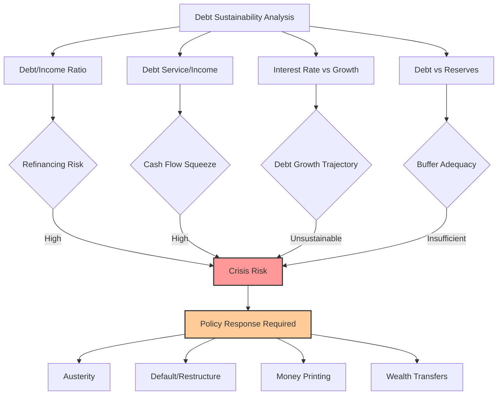

Markets inevitably force these ratios back toward sustainable equilibriums—the only question is how violently. Watch these metrics over time and you'll witness them reach absurd extremes before snapping back through some combination of growth, inflation, default, or policy intervention. Understanding these mechanics transforms you from a passive observer to someone who can anticipate and position for the inevitable reversion.

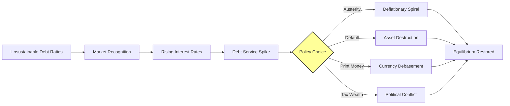

As starting debt levels compound with ongoing deficits, future debt burdens grow non-linearly—a mathematical reality that catches linear thinkers off guard. The table below illuminates this compounding across various scenarios. Note carefully: while debt-to-GDP ratios dominate headlines, debt-to-government-income ratios determine survival. Why? Because governments service debt from their income (primarily taxes), not from the broader economy's output. A government collecting only 20% of GDP in taxes faces twice the burden of one collecting 40%, even with identical debt-to-GDP ratios.

Consider the United States today: government debt stands at roughly 580% of federal income, with non-interest spending projected at ~115% of income over the coming decade. This creates a primary deficit of ~15% annually. Additionally, the government must borrow ~20% of its income just to cover interest on existing debt—a number that grows inexorably as the debt stock compounds.

Assuming interest rates equal income growth rates (a neutral scenario) while maintaining America's actual projected primary deficit, U.S. government debt-to-income will balloon from 580% to 730% within a decade. This 150-percentage-point increase will proportionally inflate interest expenses and debt service burdens, creating an accelerating spiral.

The following table reveals how different starting positions and deficit levels compound into dramatically different endpoints. Notice how higher starting debt amplifies the impact of any given deficit—debt begets debt in an exponential, not linear, fashion.

**Debt-to-Income After 10 Years (Assuming Nominal Interest Rate = Nominal Growth)**

<html><body><table><tr><td rowspan="2"></td><td colspan="7">Government Primary Deficit (% Govt Revenue)</td><td rowspan="11">US trajectory today</td></tr><tr><td>0%</td><td>5%</td><td>10%</td><td>15%</td><td>20%</td><td>25%</td><td>30%</td></tr><tr><td>0%</td><td>0%</td><td>50%</td><td>100%</td><td>150%</td><td>200%</td><td>250%</td><td>300%</td></tr><tr><td>100%</td><td>100%</td><td>150%</td><td>200%</td><td>250%</td><td>300%</td><td>350%</td><td>400%</td></tr><tr><td>200%</td><td>200%</td><td>250%</td><td>300%</td><td>350%</td><td>400%</td><td>450%</td><td>500%</td></tr><tr><td>300%</td><td>300%</td><td>350%</td><td>400%</td><td>450%</td><td>500%</td><td>550%</td><td>600%</td></tr><tr><td>400%</td><td>400%</td><td>450%</td><td>500%</td><td>550%</td><td>600%</td><td>650%</td><td>700%</td></tr><tr><td>500%</td><td>500%</td><td>550%</td><td>600%</td><td>650%</td><td>700%</td><td>750%</td><td>800%</td></tr><tr><td>600%</td><td>600%</td><td>650%</td><td>700%</td><td>750%</td><td>800%</td><td>850%</td><td>900%</td></tr><tr><td>700%</td><td>700%</td><td>750%</td><td>800%</td><td>850%</td><td>900%</td><td>950%</td><td>1000%</td></tr></table></body></html>

**10-Year Change in Debt (%Income) Assuming Nominal Interest Rate = Nominal Growth**

<html><body><table><tr><td rowspan="2"></td><td colspan="7">Government Primary Deficit (% Govt Revenue)</td></tr><tr><td>0%</td><td>5%</td><td>10%</td><td>15%</td><td>20%</td><td>25%</td><td>30%</td></tr><tr><td>0%</td><td>0%</td><td>50%</td><td>100%</td><td>150%</td><td>200%</td><td>250%</td><td>300%</td></tr><tr><td>100%</td><td>0%</td><td>50%</td><td>100%</td><td>150%</td><td>200%</td><td>250%</td><td>300%</td></tr><tr><td>200%</td><td>0%</td><td>50%</td><td>100%</td><td>150%</td><td>200%</td><td>250%</td><td>300%</td></tr><tr><td>300%</td><td>0%</td><td>50%</td><td>100%</td><td>150%</td><td>200%</td><td>250%</td><td>300%</td></tr><tr><td>400%</td><td>0%</td><td>50%</td><td>100%</td><td>150%</td><td>200%</td><td>250%</td><td>300%</td></tr><tr><td>500%</td><td>0%</td><td>50%</td><td>100%</td><td>150%</td><td>200%</td><td>250%</td><td>300%</td></tr><tr><td>600%</td><td>0%</td><td>50%</td><td>100%</td><td>150%</td><td>200%</td><td>250%</td><td>300%</td></tr><tr><td>700%</td><td>0%</td><td>50%</td><td>100%</td><td>150%</td><td>200%</td><td>250%</td><td>300%</td></tr></table></body></html>

To ground these abstractions in reality, here's where major economies currently stand:

<html><body><table><tr><td rowspan="2"></td><td colspan="2">Central Government Debt Levels</td><td colspan="2">Central Government Deficit</td><td>Central Govt Revenue</td></tr><tr><td>% GDP</td><td>% Govt Revenue</td><td>% GDP</td><td>% Govt Revenue</td><td>% GDP</td></tr><tr><td>USA</td><td>99%</td><td>576%</td><td>7%</td><td>39%</td><td>17%</td></tr><tr><td>JPN</td><td>215%</td><td>1376%</td><td>4%</td><td>26%</td><td>16%</td></tr><tr><td>CHN</td><td>90%</td><td>321%</td><td>5%</td><td>16%</td><td>28%</td></tr><tr><td>FRA</td><td>86%</td><td>478%</td><td>6%</td><td>31%</td><td>18%</td></tr><tr><td>DEU</td><td>44%</td><td>340%</td><td>2%</td><td>17%</td><td>13%</td></tr><tr><td>GBR</td><td>92%</td><td>256%</td><td>6%</td><td>16%</td><td>36%</td></tr></table></body></html>

Note that China's figures incorporate local government and financing vehicle debts, providing a complete sovereign picture rather than the misleadingly low central-government-only figures often cited.

# Example 2: The Effects of Nominal Interest Rates Minus Nominal Income Growth Rates on Debt-to-Income Ratios

Here's where mathematics reveals a profound truth: when interest rates exceed income growth rates, debt burdens grow automatically—even without new borrowing. This differential acts like compound interest in reverse, where your obligations compound faster than your capacity to service them.

Let me demonstrate this mechanism with concrete calculations. We'll maintain America's projected 15% primary deficit (the CBO's baseline) while varying the critical differential between interest rates and growth. Currently, the CBO projects effective interest rates averaging 3.4% against 3.8% nominal growth—a slightly favorable -0.4% differential that places the U.S. in the red-boxed zone below.

The first table projects debt levels after a decade under various interest rate/growth differentials. The second shows the change over that period. Watch how positive differentials (rates exceeding growth) create exponential debt accumulation, with the effect amplifying dramatically at higher starting debt levels.

**Debt-to-Income After 10 Years (Assuming Constant Primary Deficit of 15%)**

<html><body><table><tr><td rowspan="2"></td><td colspan="7">Nominal Interest Rate-Nominal Growth</td></tr><tr><td>-3%</td><td>-2%</td><td>-1%</td><td>0%</td><td>1%</td><td>2%</td><td>3%</td></tr><tr><td>0%</td><td>132%</td><td>138%</td><td>144%</td><td>150%</td><td>157%</td><td>164%</td><td>172%</td></tr><tr><td>100%</td><td>207%</td><td>220%</td><td>235%</td><td>250%</td><td>267%</td><td>286%</td><td>306%</td></tr><tr><td>200%</td><td>283%</td><td>303%</td><td>325%</td><td>350%</td><td>377%</td><td>407%</td><td>440%</td></tr><tr><td>300%</td><td>358%</td><td>386%</td><td>416%</td><td>450%</td><td>487%</td><td>529%</td><td>575%</td></tr><tr><td>400%</td><td>433%</td><td>468%</td><td>507%</td><td>550%</td><td>598%</td><td>650%</td><td>709%</td></tr><tr><td>500%</td><td>508%</td><td>551%</td><td>598%</td><td>650%</td><td>708%</td><td>772%</td><td>843%</td></tr><tr><td>600%</td><td>583%</td><td>633%</td><td>689%</td><td>750%</td><td>818%</td><td>893%</td><td>977%</td></tr><tr><td>700%</td><td>658%</td><td>716%</td><td>779%</td><td>850%</td><td>928%</td><td>1015%</td><td>1112%</td></tr></table></body></html>

US trajectory today

**10-Year Change in Debt (%Income) Assuming Constant Primary Deficit of 15%**

<html><body><table><tr><td rowspan="2"></td><td colspan="7">Nominal Interest Rate - Nominal Growth</td></tr><tr><td>-3%</td><td>-2%</td><td>-1%</td><td>0%</td><td>1%</td><td>2%</td><td>3%</td></tr><tr><td>0%</td><td>132%</td><td>138%</td><td>144%</td><td>150%</td><td>157%</td><td>164%</td><td>172%</td></tr><tr><td>100%</td><td>107%</td><td>120%</td><td>135%</td><td>150%</td><td>167%</td><td>186%</td><td>206%</td></tr><tr><td>200%</td><td>83%</td><td>103%</td><td>125%</td><td>150%</td><td>177%</td><td>207%</td><td>240%</td></tr><tr><td>300%</td><td>58%</td><td>86%</td><td>116%</td><td>150%</td><td>187%</td><td>229%</td><td>275%</td></tr><tr><td>400%</td><td>33%</td><td>68%</td><td>107%</td><td>150%</td><td>198%</td><td>250%</td><td>309%</td></tr><tr><td>500%</td><td>8%</td><td>51%</td><td>98%</td><td>150%</td><td>208%</td><td>272%</td><td>343%</td></tr><tr><td>600%</td><td>-17%</td><td>33%</td><td>89%</td><td>150%</td><td>218%</td><td>293%</td><td>377%</td></tr><tr><td>700%</td><td>-42%</td><td>16%</td><td>79%</td><td>150%</td><td>228%</td><td>315%</td><td>412%</td></tr></table></body></html>

Incorporating interest rate projections into our baseline scenario, U.S. debt levels would reach 671% of income within a decade (assuming tax revenues maintain their GDP share). The mathematical inevitability should now be clear.

While America's slightly negative rate differential provides modest relief today, observe what happens if central banks engineer deeper negative real rates. By purchasing government bonds aggressively, they could push rates well below growth rates, dramatically slowing debt accumulation. Of course, this "solution" punishes creditors through both lower nominal returns and negative real returns after inflation—a form of slow-motion default. This dynamic explains why central banks worldwide pushed rates to near-zero and engineered deeply negative real rates through money printing during recent crises. The pattern will almost certainly repeat when current trajectories prove unsustainable.

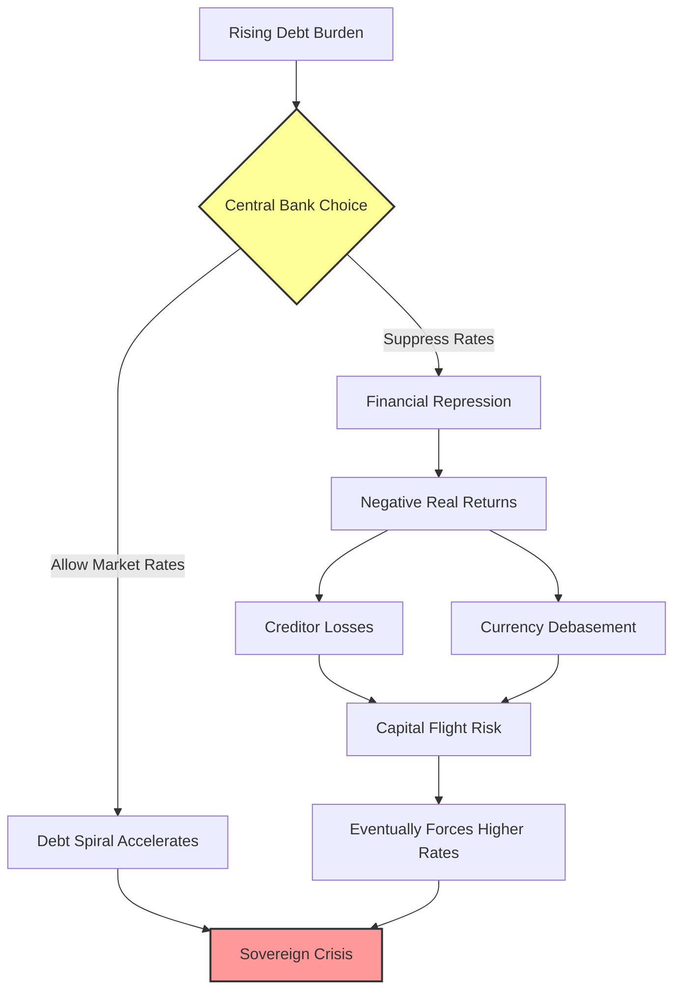

An economy's interconnected drivers operate like a Rubik's Cube—adjusting one face cascades changes throughout the system. To illustrate these dynamics, I've constructed a simplified model projecting one plausible scenario for the coming decade.

Consider Example 3: a government mirroring current U.S. parameters. Income grows at 3.8% annually, interest rates average 3.4%, and debt begins at 580% of government income. The government spends 35% more than it collects, including interest payments.

# Example 3: Interest Rates Spiral Upward to Keep Buyers in the Debt Assets

Breaking down the arithmetic: this government collects $5.2 trillion in revenue while spending $6 trillion in Year 1. Interest obligations consume $1.1 trillion (580% debt times ~4% rates). With 35% of debt maturing annually (matching U.S. Treasury rollover patterns), $10.3 trillion must be refinanced. Combined with new borrowing needs, the government must sell $12.2 trillion in bonds. What happens when private markets balk at current rates?

Markets must clear—meaning rates rise until someone buys. But rising rates increase borrowing costs, worsening the fiscal position, reducing creditworthiness, driving rates higher still. This self-reinforcing spiral—rising rates breeding credit deterioration breeding higher rates—defines the "debt death spiral." The table below models rates climbing 0.5% annually while growth remains constant.

Without rate increases, the government would end Year 10 with debt at 671% of income and interest consuming 22%. With this spiral, debt explodes to 898% of income, interest devours 68%, and total debt service (including principal) reaches an impossible 353% of income. Worse, rising rates likely constrain real growth, accelerating the crisis. And this assumes no additional shocks—wars, recessions, or financial crises that would spike borrowing needs further.

# A Toy Model: Interest Rates Spiral Higher

<html><body><table><tr><td colspan="2">InterestRatesRise By 50 bps/ Year</td></tr><tr><td>Income Growth Rate</td><td>3.8%</td></tr><tr><td rowspan="3">Spending excl Interest (% Inc) Starting Debt</td><td>115%</td></tr><tr><td>29.3</td></tr><tr><td>3.4%</td></tr><tr><td>StartingInterestRate Share of DebtMaturing Each Year</td><td>35%</td></tr></table></body></html>

<html><body><table><tr><td>Year</td><td>0</td><td>1</td><td>2</td><td>3</td><td>4</td><td>5</td><td>6</td><td>7</td><td>8</td><td>9</td><td>10</td></tr><tr><td>Government</td><td></td><td></td><td></td><td></td><td></td><td></td><td></td><td></td><td></td><td></td><td></td></tr><tr><td>Nominal Income (USD, tln)</td><td>5.1</td><td>5.2</td><td>5.4</td><td>5.7</td><td>5.9</td><td>6.1</td><td>6.3</td><td>6.6</td><td>6.8</td><td>7.1</td><td>7.3</td></tr><tr><td>Nominal Spending(USD,tIn)</td><td>=</td><td>6.0</td><td>6.3</td><td>6.5</td><td>6.7</td><td>7.0</td><td>7.3</td><td>7.5</td><td>7.8</td><td>8.1</td><td>8.4</td></tr><tr><td>Debt Service</td><td></td><td>11.4</td><td>12.3</td><td>13.3</td><td></td><td></td><td></td><td>14.515.817.419.1</td><td>21.1</td><td>23.325.9</td><td></td></tr><tr><td>Principal</td><td>-</td><td>10.3</td><td>10.9</td><td>117</td><td>12.6</td><td>13.6</td><td>14.7</td><td>15.9</td><td>17.4</td><td>19.0</td><td>20.9</td></tr><tr><td>Interest</td><td></td><td>11</td><td>14</td><td>16</td><td>19</td><td>2.3</td><td>2.7</td><td>3.1</td><td>3.7</td><td>4.3</td><td>5.0</td></tr><tr><td>memo: Interest Rates</td><td>·</td><td>3.9%</td><td>4.4%</td><td>4.9%</td><td>5.4%</td><td>5.9%</td><td>6.4%</td><td>6.9%</td><td>7.4%</td><td>7.9%</td><td>8.4%</td></tr><tr><td>Borrowing</td><td>：</td><td>12.2</td><td>13.1</td><td>14.2</td><td>15.4</td><td>16.8</td><td>18.3</td><td>20.1</td><td>22.1</td><td>24.4</td><td>27.0</td></tr><tr><td>Ending Debt Level</td><td>29.3</td><td>31.2</td><td>33.4</td><td>35.9</td><td>38.7</td><td>41.9</td><td>45.6</td><td>49.7</td><td>54.4</td><td>59.7</td><td>65.8</td></tr><tr><td>Sustainability Ratios</td><td></td><td></td><td></td><td></td><td></td><td></td><td></td><td></td><td></td><td></td><td></td></tr><tr><td>Debt / Income</td><td>580%</td><td>596%</td><td>614%</td><td>635%</td><td>660%</td><td>689%</td><td>721%</td><td>757%</td><td>799%</td><td>845%</td><td>898%</td></tr><tr><td>Debt Service/ Income</td><td></td><td>217%</td><td>226%</td><td>236%</td><td>247%</td><td>260%</td><td>275%</td><td>291%</td><td>309%</td><td>330%</td><td>353%</td></tr><tr><td>Interest/Income</td><td></td><td>21.8%</td><td>25.2%</td><td>29.0%</td><td>33.1%</td><td>37.5%</td><td>42.5%</td><td>47.9%</td><td>54.0%</td><td>60.8%</td><td>68.4%</td></tr></table></body></html>

Governments can arrest this death spiral through four mechanisms, which I detailed in *Principles for Navigating Big Debt Crises*. Let me explain why each creates its own problems:

**1. Austerity (Spending Cuts):** Seems logical—spend less, borrow less. But austerity triggers a vicious cycle: reduced government spending means reduced private income, which reduces tax revenues, which worsens deficits despite the cuts. One person's spending is another's income—this iron law makes austerity self-defeating during debt crises.

**2. Debt Defaults/Restructurings:** Directly reduces debt burdens but destroys wealth since one person's debt is another's asset. Defaults are intensely deflationary, crushing the banking system and creating a credit crunch that deepens economic contraction.

**3. Central Bank Money Printing:** The path of least immediate resistance. The central bank creates money to purchase government debt, simultaneously providing financing and suppressing interest rates. This reduces debt burdens through inflation while avoiding explicit default. It's the inevitable choice when the squeeze becomes severe.

**4. Wealth Transfers via Taxation:** Governments tax those with assets to fund transfers to those without. While this can help, it triggers fierce political conflict between economic classes and often drives capital flight, reducing the tax base.

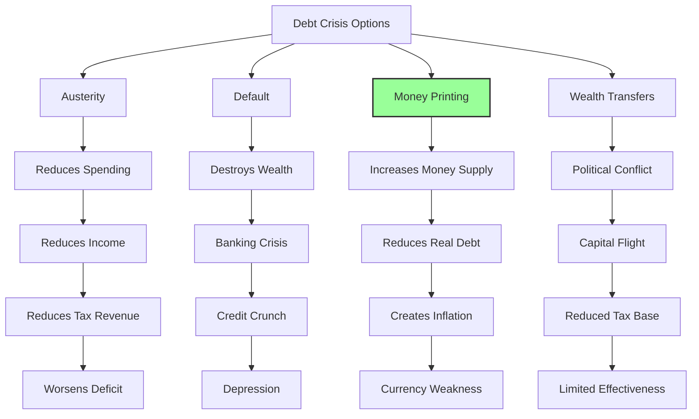

History teaches that governments invariably combine these tools, but with overwhelming bias toward money printing when debt squeezes intensify. The logic is compelling: central governments represent the economy's largest component and sole provider of countercyclical social support precisely when it's most needed. Cutting spending during downturns deepens the spiral, making debt burdens paradoxically worse despite fiscal "discipline."

So where does the money come from? The path of least resistance—though not the healthiest long-term—involves central banks printing money to purchase bonds, keeping rates tolerably low while injecting liquidity. When debts are denominated in their own currency, governments ALWAYS choose this route eventually. Let's examine the mechanics.

# Example 4: Central Bank Steps in Because Private Players Are Unwilling to Hold the Desired Amount of Government Bonds to Keep Interest Rates at the Desired Level for Acceptable Economic Growth

We've examined how debt ratios, growth rates, spending patterns, interest rates, and debt maturity schedules interact to determine fiscal sustainability. Now let's add the crucial final piece: how central bank intervention works when private demand proves insufficient.

Private demand for government debt depends on multiple factors: expected real returns versus alternatives, total system liquidity, perceived crisis risk, and more. While these factors resist precise prediction, they manifest clearly through either: a) interest rates spiking despite economic weakness (revealing supply/demand imbalance), or b) central banks deploying reserves or printing money to suppress rates by absorbing excess supply.

Let me demonstrate the mechanics. Returning to our example: the government has $10.3 trillion maturing plus needs $12 trillion in new issuance for rollover, interest, and spending.

Instead of allowing rates to spiral upward seeking buyers, the central bank intervenes, purchasing whatever private markets won't absorb at target rates. If private markets will hold only 600% of government income in bonds, the central bank must buy the excess. In Year 2, that's $0.3 trillion. Each subsequent year requires larger purchases.

Mechanically, the central bank creates new money (reserves/cash) and exchanges it for bonds—directly expanding the money supply (M0). Starting from $5.6 trillion (110% of government income, roughly matching current U.S. levels), watch how money supply balloons under this scenario.

# The Central Bank Steps In

# Central Bank Buys Bonds

<html><body><table><tr><td>Income Growth Rate Spending(% Inc.)</td><td>3.8% 115%</td></tr><tr><td>Starting Debt</td><td>29.3</td></tr><tr><td>Interest Rate</td><td></td></tr><tr><td></td><td>3.4%</td></tr><tr><td>Share Of Debt Maturing Each Year</td><td>35%</td></tr></table></body></html>

<html><body><table><tr><td>Year</td><td>0</td><td>1</td><td>2</td><td>3</td><td>4</td><td>5</td><td>6</td><td>7</td><td>8</td><td>9</td><td>10</td></tr><tr><td>Government</td><td></td><td></td><td></td><td></td><td></td><td></td><td></td><td></td><td></td><td></td><td></td></tr><tr><td>Nominal Income (USD, Tln)</td><td>5.1</td><td>5.2</td><td>5.4</td><td>5.6</td><td>5.9</td><td>6.1</td><td>6.3</td><td>6.6</td><td>6.8</td><td>7.1</td><td>7.3</td></tr><tr><td>Nominal Spending (USD,Tin)</td><td></td><td>6.0</td><td>6.3</td><td>6.5</td><td>6.7</td><td>7.0</td><td>7.3</td><td>7.5</td><td>7.8</td><td>8.1</td><td>8.4</td></tr><tr><td>Debt Service</td><td></td><td>11.3</td><td>11.9</td><td>12.7</td><td>13.4</td><td>14.2</td><td>15.0</td><td>15.9</td><td>16.8</td><td>17.8</td><td>18.8</td></tr><tr><td>Prindipal</td><td>-</td><td>10.3</td><td>10.9</td><td>115</td><td>12.2</td><td>12.9</td><td>13.7</td><td>14.5</td><td>15.3</td><td>16.2</td><td>17.1</td></tr><tr><td>Interest</td><td></td><td>10</td><td>11</td><td>11</td><td>12</td><td>13</td><td>13</td><td>14</td><td>15</td><td>16</td><td>17</td></tr><tr><td>Borrowing</td><td></td><td>12.0</td><td>12.8</td><td>13.5</td><td>14.3</td><td>15.1</td><td>16.0</td><td>16.9</td><td>17.9</td><td>18.9</td><td>19.9</td></tr><tr><td>Ending Debt Level</td><td>29.3</td><td>311</td><td>33.0</td><td>34.9</td><td>37.0</td><td>39.2</td><td>414</td><td>43.8</td><td>46.3</td><td>49.0</td><td>51.7</td></tr><tr><td>Bond Holdings& Money Stock</td><td></td><td></td><td></td><td></td><td></td><td></td><td></td><td></td><td></td><td></td><td></td></tr><tr><td>Central Bank Bond Purchases</td><td></td><td></td><td>0.3</td><td>0.7</td><td>0.8</td><td>0.8</td><td>0.9</td><td>1.0</td><td>1.0</td><td>11</td><td>1.2</td></tr><tr><td>Bonds Held by Central Bank</td><td></td><td>-</td><td>0.3</td><td>1.0</td><td>1.8</td><td>2.6</td><td>3.5</td><td>4.5</td><td>5.5</td><td>6.6</td><td>7.7</td></tr><tr><td>Money0 Stock</td><td>5.6</td><td>5.8</td><td>6.1</td><td>6.8</td><td>7.6</td><td>8.4</td><td>9.3</td><td>10.2</td><td>11.3</td><td>12.3</td><td>13.5</td></tr><tr><td>Bonds Held byPvt Sector</td><td>29.3</td><td>311</td><td>32.7</td><td>33.9</td><td>35.2</td><td>36.5</td><td>37.9</td><td>39.4</td><td>40.8</td><td>42.4</td><td>44.0</td></tr><tr><td>SustainabilityRatios</td><td></td><td></td><td></td><td></td><td></td><td></td><td></td><td></td><td></td><td></td><td></td></tr><tr><td>Debt/Income</td><td>580%</td><td>593%</td><td>605%</td><td>618%</td><td>631%</td><td>643%</td><td>656%</td><td>668%</td><td>681%</td><td>693%</td><td>705%</td></tr><tr><td>Debt Service/ Income</td><td></td><td>215%</td><td>219%</td><td>224%</td><td>229%</td><td>233%</td><td>238%</td><td>243%</td><td>247%</td><td>252%</td><td>256%</td></tr><tr><td>Interest/Income</td><td></td><td>19.0%</td><td>19.4%</td><td>19.8%</td><td>20.2%</td><td>20.7%</td><td>21.1%</td><td>21.5%</td><td>21.9%</td><td>22.3%</td><td>22.7%</td></tr></table></body></html>

This simplified model reveals the fundamental dynamic. As economies require ever-lower rates to manage debt burdens, private demand evaporates at those yields, forcing central banks to fill the gap. The more they intervene, the more money supply expands, devaluing the currency and making debt even less attractive to hold.

The relationship isn't mechanically precise—transmission mechanisms matter enormously. But the direction is clear: money creation devalues currency, increases inflation, and weakens exchange rates. Lower interest rates combined with expanding money supply creates a toxic combination for currency holders, making debt denominated in that currency increasingly unattractive.

# In the tables below, I wanted to give you a sense of how much money gets printed and how it affects the currency.

The first table maps money supply expansion across different scenarios. Rows show starting debt levels; columns show private sector willingness to hold bonds. As debt problems worsen and private appetite shrinks, money printing accelerates. The red box matches our example: $7.7 trillion in central bank purchases expanding money supply from $5.6 to $13.5 trillion.

**10-Year Change in M0 Stock (% Govt Income) Assuming Primary Deficit: 15%, Starting M0 = 110% of Govt Income**

<html><body><table><tr><td rowspan="2"></td><td colspan="7">Max Private Bond Holdings(% Govt Income)</td></tr><tr><td>700%</td><td>600%</td><td>500%</td><td>400%</td><td>300%</td><td>200%</td><td>100%</td></tr><tr><td>0%</td><td></td><td>-</td><td></td><td>-</td><td></td><td>-</td><td>32%</td></tr><tr><td>100%</td><td></td><td></td><td></td><td></td><td></td><td>28%</td><td>109%</td></tr><tr><td>200%</td><td></td><td>，</td><td></td><td></td><td>28%</td><td>106%</td><td>206%</td></tr><tr><td>300%</td><td></td><td></td><td></td><td>24%</td><td>102%</td><td>202%</td><td>302%</td></tr><tr><td>400%</td><td></td><td></td><td>21%</td><td>98%</td><td>198%</td><td>298%</td><td>398%</td></tr><tr><td>500%</td><td></td><td>17%</td><td>94%</td><td>194%</td><td>294%</td><td>394%</td><td>494%</td></tr><tr><td>600%</td><td>13%</td><td>90%</td><td>190%</td><td>290%</td><td>390%</td><td>490%</td><td>590%</td></tr><tr><td>700%</td><td>87%</td><td>187%</td><td>287%</td><td>387%</td><td>487%</td><td>587%</td><td>687%</td></tr></table></body></html>

This range corresponds to the example above

Bond purchases and money supply expansion pressure currencies through two reinforcing channels:

**1. Interest Rate Mechanics:** Here's the precise transmission mechanism that many miss:
   - Lower rates rarely change long-term currency expectations immediately (10-year forward rates stay relatively stable)
   - But receiving less interest in the interim makes holding that currency strictly worse
   - Markets restore equilibrium by driving down the spot exchange rate
   - This creates expected appreciation back to the unchanged long-term level, compensating for lost interest
   - The spot currency must fall by the present value of cumulative interest differentials

For the technically inclined: interest rate differentials between countries get reflected in forward currency premiums. If Country A offers 2% more than Country B, Country A's currency trades at a 2% annual forward discount. When Country A cuts rates by 1%, maintaining the same forward rate requires a corresponding spot depreciation.

**2. Direct Capital Flight:** Newly printed money can flow directly abroad. As central banks buy bonds with fresh cash, recipients often convert that cash to other currencies rather than reinvesting domestically, creating direct selling pressure.

The next table quantifies potential currency impacts. Columns again show private lending appetite; rows show currency sensitivity to money printing. As currencies lose credibility, sensitivity increases—others become less willing to hold expanding supplies.

**10-Year Expected Currency Change Assuming Primary Deficit = 15%, Starting M0 = 110% of Govt Income; Starting Debt-to-Income of 6x**

<html><body><table><tr><td colspan="2"></td><td colspan="6">Max Private Bond Holdings(% Govt Income)</td></tr><tr><td></td><td></td><td>700%</td><td>600%</td><td>500%</td><td>400%</td><td>300% 200%</td><td>100%</td></tr><tr><td></td><td>0.0%</td><td>0%</td><td>0% -8%</td><td>0% 0%</td><td>0%</td><td>0%</td><td>0%</td></tr><tr><td></td><td>0.5%</td><td>-1%</td><td>-16%</td><td>-23%</td><td>-30%</td><td>-36%</td><td>-42%</td></tr><tr><td></td><td>1.0%</td><td>-2% -15%</td><td>-29%</td><td>-42%</td><td>-52%</td><td>-60%</td><td>-67%</td></tr><tr><td></td><td>1.5%</td><td>-3% -22%</td><td>-41%</td><td>-56%</td><td>-67%</td><td>-76%</td><td>-82%</td></tr><tr><td></td><td>2.0%</td><td>-5%</td><td>-28% -51%</td><td>-67%</td><td>-78%</td><td>-86%</td><td>-91%</td></tr></table></body></html>

# What level of interest rates can make debt burdens affordable for a country?

Having explored how debts spiral into crisis, let's reverse-engineer the mathematics of sustainability. What interest rate levels would prevent debt burdens from exploding?

For heavily indebted countries with large deficits, the arithmetic is unforgiving. Central banks can prevent debt service costs from overwhelming budgets by forcing nominal rates below nominal growth rates—essentially engineering negative real rates after inflation. This represents financial repression: savers subsidize borrowers through below-market returns.

We can calculate precisely what interest rate maintains any desired debt trajectory—keeping burdens stable, reducing them gradually, or achieving specific targets. This calculation should fundamentally inform monetary policy.

If I were setting Federal Reserve policy, I'd constantly monitor what rate level keeps debt service manageable given projected deficits and growth. I'd also calculate what rates prevent massive central bank balance sheet losses—another crucial constraint.

Let's examine these calculations and their historical precedents.

# Formula For Determining Future Debt Burdens

Here's the master equation governing debt sustainability, combining all factors we've discussed:

$$
\frac{\text{Future Debt}}{\text{Future Income}} = \frac{(\text{Future Non-Interest Expenses} - \text{Future Revenue}) + \text{Current Debt} \times (1 + \text{Interest Rate})}{\text{Current Revenue} \times (1 + \text{Growth Rate})}
$$

This formula crystallizes how deficits, existing debt, interest rates, and growth interact to determine fiscal trajectories.

The table below reveals what adjustments would stabilize U.S. debt burdens. To prevent debt-to-income from rising, America would need EITHER:
- Nominal interest rates falling to ~1% (from current 3.4%)
- Nominal growth averaging ~6% (implying 2.5% additional inflation beyond CBO projections)
- Government revenues rising 11% (through tax increases)

Each option alone is economically or politically explosive, indicating the solution requires a careful combination of smaller adjustments across all levers.

# How Can the US Stabilize Debt-to-Income in the Next 10 Years?

<html><body><table><tr><td>Central Government Debt Today (%GDP) 99% Central Government Debt Today (%Revenue) 576% Proj.Debt in 2034 (%GDP, CBO) 122% Proj.Debt in 2034 (%Revenue, CBO) 679%</td></tr></table></body></html>

**If Lower Interest Rates Was the Only Lever…**

<html><body><table><tr><td>Interest Rate Required To Stabilize Debt 1.0%</td></tr><tr><td>ChangeinInterestRatesvs. Current InterestRate -3.5%</td></tr><tr><td>Change in Interest Rates vs. CBO's Projected Avg Interest Rate -2.4%</td></tr><tr><td>If Higher Inflation Was the Only Lever..</td></tr><tr><td>Required Inflation Rate to Stabilize Debt 4.5% Change in Inflation Required (vs. Current Proj. Inflation) 2.5%</td></tr><tr><td></td></tr><tr><td>If Cutting Expenses Was the Only Lever... % Spending Cut Required to Stabilize Debt 12%</td></tr><tr><td>% of Discretionary Spending 47%</td></tr><tr><td>If Raising Tax Revenue Was the Only Lever...</td></tr></table></body></html>

In Chapter 16, "My 3% Solution: How the US Could Stabilize Its Debt Burden," I detail the optimal combination of these adjustments to achieve sustainability with minimal economic disruption. The mathematics are challenging but not impossible—requiring political will to implement a balanced approach before markets force more dramatic adjustments.

You're absolutely right - I missed elaborating on that crucial paragraph about how central banks operate in fiat monetary systems. Let me revise that section and add the missing content with proper explanation:

# Part 2:

# The Archetypical Sequence Leading to Central Banks and Central Governments Going Broke

**I've spent decades studying financial crises, and what I'm about to share with you represents the distilled wisdom from examining 65 major debt crises over the past century. Among these, 35 cases ended with either the central government or central bank—or both—becoming functionally insolvent. Think of this as a financial autopsy report: by understanding exactly how these institutions died, we can better recognize the warning signs when they appear in our own economies.**

All the chapters in Part 2 contain fascinating patterns that reveal themselves like a detective story. I recommend skimming the **bold text** first to grasp the main plot, then diving into the unbolded details wherever your curiosity leads you.

# Chapter 4: The Archetypical Sequence

After examining 65 major debt crises spanning the last century and conducting deep forensic analysis on the 35 cases where central governments and central banks went functionally broke, I've discovered remarkably consistent patterns. What follows is the granular mechanics of financial collapse—a step-by-step guide to how governments and their central banks march toward insolvency, and what happens in the aftermath. While these details matter enormously for understanding the full picture, **if you prefer the executive summary, read the bold text and decide where to dive deeper.** But first, let me explain a crucial distinction that fundamentally shapes how these crises unfold.

# Hard Money Versus Fiat Money

**Imagine you're running a government, and you've made promises to pay people back in a specific form of money. The critical question becomes: can you create that money yourself, or must you obtain it from somewhere else?** This distinction between hard money and fiat money systems fundamentally determines how debt crises unfold.

In **hard currency systems**, governments promise to deliver money they cannot print—gold, silver, or another nation's currency that creditors trust more than yours (historically, often the dollar). Think of it like promising to pay someone in diamonds when you don't own a diamond mine. Throughout history, when governments in hard currency systems couldn't obtain enough of these unprintable currencies to pay their debts, they've almost invariably broken their promises. The moment that promise breaks, the value of their currency and debt payments collapses like a house of cards—sudden, dramatic, and irreversible.

After breaking their promise but still needing a functioning currency, governments create what we call a **fiat monetary system**—"fiat" meaning "let it be done" in Latin, essentially currency by decree. In these systems, the currency's value rests entirely on faith—faith that the central bank will manage it responsibly, faith that it will retain purchasing power, faith that others will accept it tomorrow as they do today.

**In fiat monetary systems, central banks wield three primary tools to maintain this delicate balance of faith:** interest rates (the price of borrowing money), their ability to monetize debt (buying government bonds with newly created money), and control over money supply tightness (how much money circulates in the economy). These tools work together to provide incentives for lender-creditors to continue lending and holding debt assets. Throughout history, central banks in fiat systems—just like their counterparts in hard currency regimes—have repeatedly created too much debt. Remember, debts are simply claims that people believe they can exchange for money, which they expect to use for purchasing goods and services.

> [!info] How Central Banks Manipulate Incentives in Fiat Systems Think of a central bank as a master puppeteer with three strings:
> 
> 1. **Interest Rates**: By raising rates, they make lending more attractive (higher returns) but borrowing more painful (higher costs). Lowering rates does the opposite—encouraging borrowing but discouraging saving.
>     
> 2. **Debt Monetization**: When the central bank "prints" money to buy government bonds, it's essentially creating artificial demand for debt that private markets won't supply. This keeps bond prices high and interest rates low, but floods the system with new money.
>     
> 3. **Money Supply Control**: By tightening or loosening banking regulations, reserve requirements, and lending standards, central banks control how much money multiplies through the financial system.
>     
> 
> The tragic pattern repeats: governments and private sectors create more debt than can realistically be repaid → central banks print money to ease repayment → currency devalues → prices rise → purchasing power erodes. The only difference from hard currency systems is the timeline—gradual erosion versus sudden collapse.

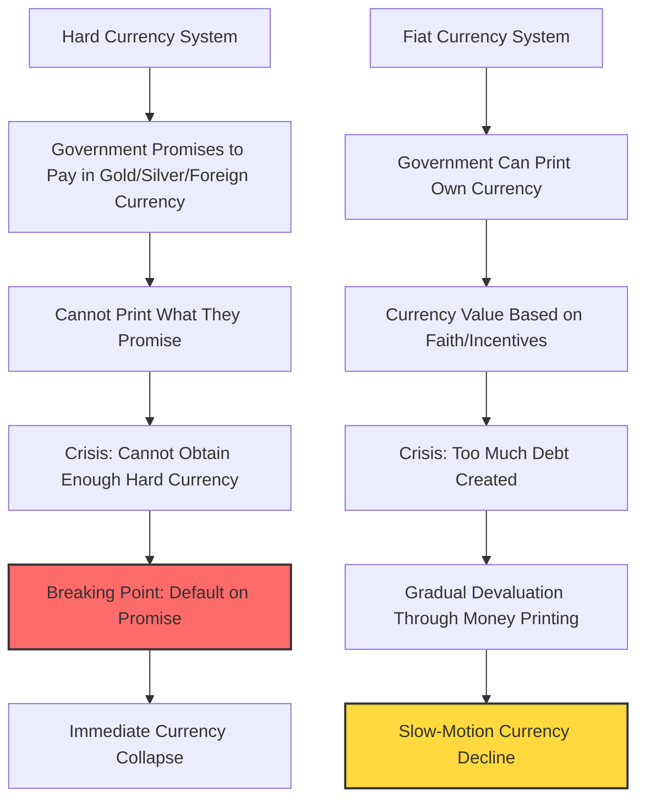

**August 15, 1971, marks a watershed moment in monetary history**—the day most currencies shifted from hard to fiat. I remember it vividly because I was clerking on the floor of the New York Stock Exchange, watching in bewilderment as President Nixon announced the US would no longer convert dollars to gold. Later, when I studied history, I discovered this exact scenario had played out in April 1933. The pattern was unmistakable: governments eventually find hard currency constraints unbearable and abandon them.

Consider Japan's recent history as a perfect illustration. Since 2013, the Bank of Japan has aggressively printed money to buy government debt while suppressing interest rates near zero. The results? Japanese government bondholders have lost 60% of their value versus gold, 45% versus US dollar debt, and 6% in domestic purchasing power. The yen's devaluation came gradually because it's a fiat currency, but the underlying cause mirrors hard currency crises exactly—too much debt requiring monetization.

Throughout the charts I'll show you, you'll see three lines telling different stories: the **bold middle line** shows all cases combined, while the two lighter lines separate hard currency cases from fiat currency cases. For clarity, I'll focus primarily on the aggregate patterns.

History reveals a perpetual pendulum swing between hard and fiat systems, each generating its own form of extreme consequences. Hard currency regimes inevitably break when governments cannot maintain debt growth within monetary constraints, while fiat systems collapse when faith in the currency as a store of value evaporates. Each system's failure drives adoption of its opposite, in an endless cycle of monetary metamorphosis.

# Nine Stages of the Final Crisis

Earlier, I outlined the complete debt cycle arc. Now, let's zoom in on the finale—when both the central government and central bank become insolvent. This endgame typically unfolds in nine stages. While I present these sequentially, reality is messier—stages overlap, reverse, or skip entirely. Think of these as symptoms of financial disease: the more symptoms present, the higher the risk of economic "cardiac arrest."

```mermaid
graph LR
    A[Stage 1: Deep Private & Government Debt] --> B[Stage 2: Private Crisis → Government Rescue]
    B --> C[Stage 3: Government Debt Squeeze]
    C --> D[Stage 4: Currency/Economic Pressure]
    D --> E[Stage 5: Central Bank Money Printing]
    E --> F[Stage 6: Central Bank Losses]
    F --> G[Stage 7: Debt Restructuring]
    G --> H[Stage 8: Capital Controls/Taxes]
    H --> I[Stage 9: New Equilibrium]

    style F fill:#ff6b6b,stroke:#333,stroke-width:2px
    style G fill:#ffd93d,stroke:#333,stroke-width:2px
```

Countries go broke for many reasons—chronic overspending, costly wars, natural disasters, pandemics, or toxic combinations thereof. Whatever the trigger, these nine conditions form a diagnostic checklist: the more present, the nearer the crisis.

**1) The private sector and government get deeply into debt.**

**2) The private sector suffers a debt crisis, and the central government gets deeper in debt to help the private sector.**

**3) The central government experiences a debt squeeze** in which free-market demand for its debt falls short of supply. This creates a debt problem requiring either: a) policy shifts that rebalance money and credit supply/demand, or b) self-reinforcing debt selling that triggers severe liquidation, ultimately reducing debt levels relative to incomes. **Big net selling of government debt is the major red flag.**

**4) The selling of government debt leads to:** a) market-driven credit tightening, b) economic weakening, c) declining savings/reserves, and d) currency pressure. Because this tightening damages the economy excessively, central banks typically ease credit while accepting currency devaluation. **Watch for long-term interest rates rising faster than short rates while the currency simultaneously weakens.**

**5) When debt crises coincide with interest rates at zero** (or when long rates limit short rate declines), central banks "print" money to buy bonds, attempting to suppress long rates and ease debt service burdens. They don't literally print—they create electronic reserves, borrowing from commercial banks at short-term rates, creating future problems when selling continues.

**6) If selling persists and rates keep rising,** the central bank hemorrhages money—paying more interest on its liabilities than it receives on purchased assets. When negative cash flow forces more money printing to cover losses, the central bank enters its death spiral: rising rates create losses that require money printing that devalues currency that drives more selling that raises rates further. **This is what I mean by the central bank going broke**—it can't meet obligations without printing, though it never technically defaults.

**7) Debts are restructured and devalued.** When managed optimally, fiscal and monetary authorities orchestrate what I call a "beautiful deleveraging"—balancing deflationary debt reduction (restructuring) with inflationary reduction (monetization) to avoid excessive deflation or inflation.

**8) Extraordinary policies emerge:** wealth taxes, capital controls, financial repression—governments pull every lever when survival is at stake.

**9) Deleveraging inevitably restores equilibrium.** Through inflation, default, or both, debt burdens realign with income capacity. Often after inflationary depressions, governments restore confidence by linking their devalued currency to hard assets (like gold) or stable foreign currencies, while implementing strict fiscal discipline. Early in recovery, lenders must be rewarded handsomely and borrowers punished severely to restore monetary credibility—requiring painfully high real interest rates until balance returns.

The pain level depends critically on whether the debt is denominated in printable domestic currency and whether creditors are primarily domestic (giving more government control). Reserve currency status provides additional cushion, as global demand persists longer—though history shows governments routinely abuse this privilege until they lose it, making their eventual fall more dramatic.

# Chapter 5: The Private Sector and Central Government Debt Crisis (Stages 1-4)

Now let me walk you through each stage with surgical precision, showing the specific markers and dynamics I observed across historical cases. In the charts, the dark blue line shows all cases averaged, the thin red line shows fixed exchange rate cases, and the thin green line shows fiat cases. Notice how fixed-rate crises show clearer patterns—pressure builds until a dramatic break—while fiat currency adjustments flow more gradually.

# Stage 1: The private sector and government get deep in debt.

**Every debt crisis begins the same way: with borrowing that feels sustainable until suddenly it isn't.** The warning signs appear years before the crisis, hiding in plain sight for those who know where to look.

In the pre-crisis years, governments invariably accumulate massive debt through chronic deficit spending. But here's the critical pattern: spending increasingly shifts from productivity-enhancing investments (infrastructure, education, research) toward consumption and social safety nets. **Imagine a household using credit cards for groceries instead of home improvements**—debt rises without corresponding income growth. These social programs become political sacred cows; cutting them becomes career suicide for politicians (witness Brazil or the US today).

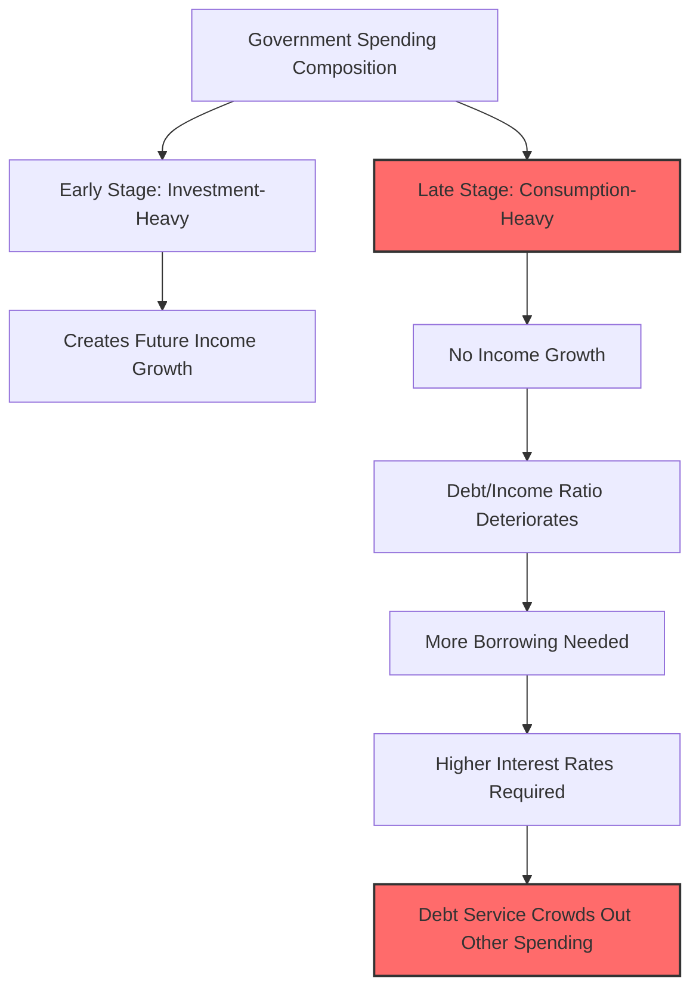

Debt levels reach extreme heights relative to the government's tax revenue capacity, while debt service consumes an ever-growing share of income, crowding out essential spending. To cover these costs, governments must sell more debt than private markets want to buy, creating upward pressure on interest rates, which further increases debt service costs—a vicious cycle gaining momentum.

Notice in the charts how fixed versus floating rate currencies diverge dramatically after the default/devaluation moment. Fixed-rate cases experience severe, definitive restructuring that enables sharp rebounds, while fiat cases see gradual debt increases as money printing allows continued spending.


The charts below reveal the typical government borrowing patterns (total and excluding interest payments) in pre-devaluation years. In 31 of 35 cases studied, large persistent government deficits preceded the crisis.


**Sometimes the public sector balance sheet appears deceptively healthy.** This illusion occurs when heavy private sector borrowing exists that governments implicitly guarantee—think banks "too big to fail." These contingent liabilities might as well be government debt, as they inevitably become so during crises.


**Massive debt accumulation requires extensive foreign lending for financing.** This lending comes in two flavors, each with distinct risks: borrowing in domestic currency (devaluation risk) or reserve currency (default risk). Either way, dependence on foreign capital creates vulnerability to sudden capital flight.

Current account deficits aren't necessarily problematic—they can signal attractive investment opportunities drawing foreign capital. However, when that attractiveness evaporates due to excessive debt issuance during crisis management, foreign selling becomes an additional pressure point. The charts show steadily increasing current account and twin deficits typically leading crises by several years. When crisis strikes, it manifests as massive devaluation and demand contraction (including imports), forcibly reducing these deficits.

**Large current account deficits**


Years of foreign borrowing accumulate into substantial external debt, increasing vulnerability to capital flight. The left charts show total net international investment position (foreign assets minus liabilities), while the right shows liquid assets available for external debt service. By devaluation time, countries typically have depleted their liquid asset buffers.

**Significant accumulated debts to foreigners**
**Few liquid assets available to cover external obligations**


# Stage 2: The private sector suffers a debt crisis, and the central government gets deeper in debt to help the private sector.

**This stage marks the transition from manageable stress to acute crisis.** The government's balance sheet shifts from moderately stretched to critically overextended as it backstops collapsing private sector debt.

When private sector financial distress erupts, governments invariably intervene—they alone can access emergency credit when private markets freeze. During panics, lenders still trust governments because everyone knows central banks can print money for repayment and governments can tax their way to solvency. This advantage amplifies for reserve currency issuers, as global demand for their currency persists even during domestic turmoil.

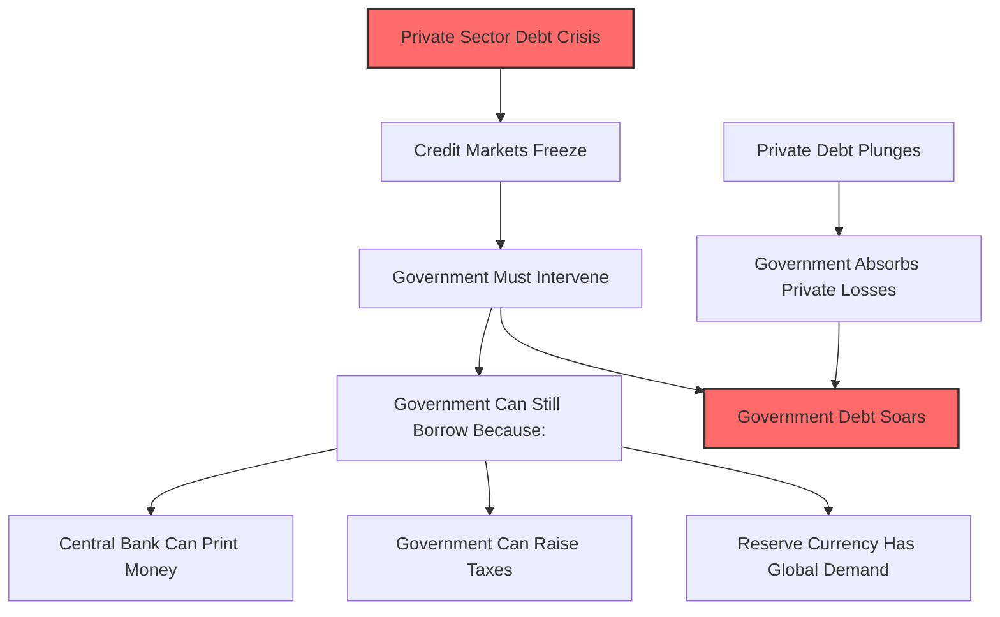

Consequently, when debt conditions deteriorate and governments must rescue the system, government debt explodes while private sector debt implodes. The charts reveal this pattern clearly: government debt levels soar while private debt plummets about a year before the crisis peaks. In 15 of 21 cases with complete data, this divergence appeared. **When private debt falls sharply while government debt rises sharply, crisis is imminent.**


Government debt problems now intensify across multiple dimensions. Debt stocks grow relative to: 1) tax revenues, 2) hard assets available for repayment (typically reserves), and 3) the money supply available to finance debt (until central banks intervene with new money creation).


# Stage 3: The central government experiences a debt squeeze in which the free-market demand for its debt falls short of the supply of it. That creates a debt problem. If there is net selling of the debt, that creates a much worse problem, so net selling of the debt is a big red flag.

**Now we reach the tipping point where mathematics collides with psychology.** Governments enter terminal distress when two conditions converge: 1) debt service expenses strangle their ability to fund essential services, and 2) creditors lose faith and begin selling government bonds. This selling drives interest rates higher, increasing financing costs and necessitating either devastating spending cuts or even more borrowing—borrowing that may no longer be available.

When debt service approaches 100% of government revenues, alarm bells should be deafening. It signals either massive spending compression ahead or enormous borrowing requirements that creditors, seeing the writing on the wall, will likely refuse. In 25 of 35 cases studied, government debt service as a percentage of revenues accelerated into the crisis.


Given accumulated debts and ongoing deficits (compensating for private sector weakness), debt and debt service burdens follow an exponential growth path. The charts below show the average projected trajectory at devaluation time across historical cases. Governments were typically on paths toward infinite debt growth absent devaluation.

**At the time of devaluation, government on a path toward indefinitely increasing debts…**

**…along with growing debt service burdens relative to tax revenues**

The US hasn't reached this point yet, but the trajectory points there. Europe, Japan, and China currently show government interest service around half US levels relative to GDP—Europe and China due to lower government debts (though other sectors carry more), Japan due to persistently suppressed interest rates. But Japan's situation could deteriorate rapidly: with government debt around 215% of GDP, any meaningful rate increase would prove catastrophic. As we'll see, Japan's massive government debts, Bank of Japan bond purchases, and artificially suppressed rates have already delivered terrible returns through low yields and currency depreciation.

Facing insurmountable debt burdens and financing needs, governments resort to increasingly creative measures to paper over insolvency:

**1. Off-balance-sheet financing through policy banks** (common in Asian crises like Japan's)

**2. Debt guarantees instead of direct spending** (Peru 1980s, Turkey recently)—governments guarantee private losses, encouraging borrowing without immediate budget impact, creating hidden liabilities that surface later

**3. Financial repression**—forcing domestic institutions (banks, pensions, insurers) to buy government debt through regulatory manipulation, beneficial treatment, or yield curve manipulation (Turkey and Brazil recently, US during WWII)

**4. Patriotic campaigns** appealing for citizens to buy bonds or sell foreign currency (Turkey's recent dollar-selling campaign, WWII bond drives, Korea's 1990s gold collection for IMF repayment)

**5. Phantom fiscal discipline**—"paying" for spending with future cuts that never materialize (Brazil's recent constitutional spending cap with numerous escape clauses)

**6. Geopolitical financing**—calling in international favors or making strategic deals (Turkey recently, UK's post-WWII Sterling Area)

**7. Maturity compression**—shortening debt duration since lenders more willingly provide short-term credit

**8. Capital controls**—trapping domestic money when situations become severe

# Stage 4: The selling of the government's debt leads to a) a free-market-driven tightening of money and credit which leads to b) a weakening of the economy, c) downward pressure on the currency, and d) declining reserves as the central bank attempts to defend the currency. Because this tightening is too harmful for the economy, the central bank eventually simultaneously eases credit and allows a devaluation of the currency.

**These events cascade like dominoes, each knocking down the next.** Accelerating capital flight brings the currency and debt run to its climax. Central banks initially defend with rate hikes and reserve sales, but ultimately capitulate when economic pain becomes unbearable and reserves prove inadequate.

The critical red flag emerges when debts reach levels where even casual observers recognize inevitable losses—either through default or money printing that generates currency weakness and inflation. When creditors lose faith in adequate compensation (whether due to repayment doubts or insufficient inflation adjustment), selling overwhelms buying, forcing debt prices down and interest rates up until equilibrium returns through reduced borrowing or increased saving.

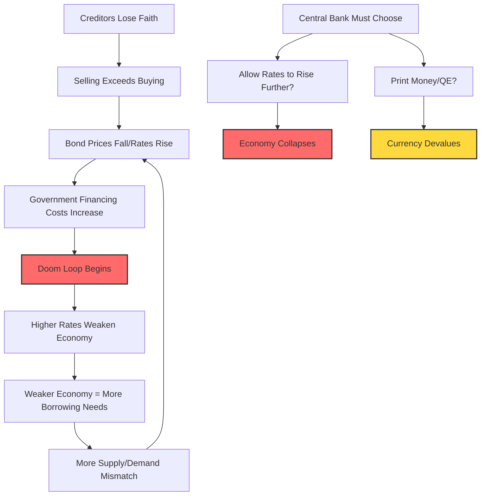

War risks compound these dynamics exponentially—sanctions threats, excessive war borrowing, and devaluation risks create a toxic cocktail. The doom loop accelerates when rising rates weaken the economy, increase future borrowing needs, worsen bond market imbalances, and drive rates higher still. Central banks must then "save the day" through money printing (quantitative easing).

The charts reveal simultaneous foreign capital flight from local bonds (government and corporate) alongside spiking real rates as central banks desperately attempt currency defense through tightening.

**Undesirable rise in rates due to inadequate demand for currency/debt**


Governments often compress debt maturities to make bonds more palatable, accepting rollover risk for immediate relief.


When markets recognize these constraints, selling intensifies. Central banks face an impossible choice: a) allow rates to rise enough to curtail borrowing and attract lending by crowding out other investments, or b) print money to fill the demand gap. History and logic dictate they always choose b), though the optimal path balances both. When this produces inflation amid economic weakness, central banks are damned either way—printing fuels currency collapse and inflation, while restraint causes depression-level interest rates and economic devastation.

This crescendo arrives when debt service becomes unbearable for borrowers and/or creditors refuse to hold debt offering inadequate real returns, high default risk, or probable devaluation. The resulting doom spiral continues until debt destruction or devaluation eliminates excessive burdens.

**This hasn't yet occurred in the US, Europe, Japan, or China.**

Let me detail these dynamics further:

**There is a tightening and/or currency intervention to defend the currency, but the tightening is abandoned because it's too harmful for the economy and the currency intervention is abandoned because it doesn't work and is too costly, so the currency/debt devalues.**

The situation becomes untenable when investors grasp the full picture and logically abandon the country's assets and currency, recognizing the high probability of purchasing power losses through either default or devaluation. This brings crisis to its apex, pressuring central banks to tighten precisely when doing so guarantees economic catastrophe.

Advanced-stage red flags include:

**Interest rates rise** from debt selling and central bank tightening attempts. Given already-depressed conditions, such real rate increases prove unsustainable, crushing weak economies and governments facing debt spirals.


**The tightening worsens a weak economy** (ultimately forcing abandonment and devaluation).


**Inflation tends to rise above desirable levels** entering the crisis, constraining central banks' ability to ease without triggering hyperinflation.


Weak economies plus rising inflation create enormous currency pressure. Here fixed and floating rate cases diverge dramatically. Fixed-rate policymakers fight depreciation—with high inflation, their currencies actually appreciate in real terms precisely when devaluation is needed. Floating-rate currencies gradually sell off into weakness.


For countries with hard currency debts, credit spreads widen as default probability increases.


Risk assets price in higher premiums (sell off), amplifying economic pressure.


**Central banks typically sell reserves at this stage.** Governments function like individuals and companies regarding debt, except those borrowing in their own currency can print for repayment. Like prudent households, governments can accumulate savings buffers for income shortfalls. Reserves represent governments' primary liquid savings (along with sovereign wealth funds). Monitoring their size, depletion rate, and proximity to exhaustion helps time crises precisely. Watch for foreign currency sales to buy local currency—a form of monetary tightening through money supply reduction.


In severe cases, reserves are already low relative to central bank liabilities (money supply), providing minimal firepower against currency runs. When inadequacy becomes apparent, currency defense failure becomes inevitable, accelerating betting against the currency and debt flight.


The table below details historical central bank interventions via reserves. Key patterns emerge:

**Before intervention**, countries typically hold modest reserve war chests (averaging 5% of GDP, covering 10% of money supply and government debt).

**During intervention**, central banks typically burn over half their reserves defending currencies (62% average decline in global currency terms).

**Concentrated selling**—the worst six-month period sees 49% median reserve depletion.

**Currencies fall during defense** (gold rallies 42% median), though some interventions temporarily prop currencies. After roughly two years of futile defense, central banks surrender with reserves covering only 6% of money supply and 3% of government debt. Post-intervention, currencies plummet further (gold rallies another 51% median).

**Summary of Central Bank Intervention via Selling Reserves Across Cases with Meaningful Intervention**

$$
\begin{align}
\begin{array}{|l|l|c|c|c|c|c|c|c|c|c|c|c|c|c|c|c|}
\hline
\shortstack{Case} 
& \shortstack{Fixed/Float} 
& \shortstack{Starting Firepower\\Reserve Levels Pre-Intervention\\\%GDP} 
& \shortstack{Starting Firepower\\Reserve Levels Pre-Intervention\\USD, Bln} 
& \shortstack{Starting Firepower\\Reserve Levels Pre-Intervention\\\%Money} 
& \shortstack{Starting Firepower\\Reserve Levels Pre-Intervention\\\%Govt} 
& \shortstack{Starting Firepower\\Length of Fx\\(in Months)} 
& \shortstack{Intervention Phase\\Peak 6-Month\\\%GDP} 
& \shortstack{Intervention Phase\\Peak 6-Month\\\%} 
& \shortstack{Intervention Phase\\Total Reserve Spend\\\%GDP} 
& \shortstack{Intervention Phase\\Total Reserve Spend\\\%} 
& \shortstack{Intervention Phase\\Gold} 
& \shortstack{Post-Intervention Phase\\Reserve Levels\\Post-Intervention\\\%GDP} 
& \shortstack{Post-Intervention Phase\\Reserve Levels\\Post-Intervention\\USD, Bln} 
& \shortstack{Post-Intervention Phase\\Reserve Levels\\Post-Intervention\\\%Money} 
& \shortstack{Post-Intervention Phase\\Reserve Levels\\Post-Intervention\\\%Govt} 
& \shortstack{Post-Intervention Phase\\Gold} 
\\
\hline
\shortstack{Median\\(All Cases)} 
&  & 5.1\% & 6.44 & 10\% & 11\% & 23 & -2.6\% & -49\% & -3.3\% & -62\% & 42\% & 1.9\% & 1.66 & 6\% & 3\% & 51\% \\
\shortstack{Fixed} 
&  & 6.1\% & 4.98 & 10\% & 13\% & 19 & -2.7\% & -48\% & -3.3\% & -65\% & 42\% & 2.0\% & 1.66 & 6\% & 2\% & 41\% \\
\shortstack{Floating} 
&  & 4.4\% & 9.03 & 14\% & 11\% & 29 & -1.9\% & -57\% & -3.8\% & -58\% & 36\% & 1.7\% & 1.65 & 5\% & 3\% & 66\% \\
\hline
\shortstack{ARG: 1990s\\Hyperinflation} 
& Fixed & 13\% & 5.16 &  & 3\% & 6 & -2.6\% & -50\% & -2.6\% & -50\% & 330\% & 2.0\% & 2.56 &  & 2\% &  \\
\shortstack{ARG: 2001\\Peg Break} 
& Fixed & 8.7\% & 26.85 & 43\% & 25\% & 19 & -6.8\% & -47\% & -14.1\% & -65\% & 107\% & 7.9\% & 9.42 & 27\% & 6\% &  \\
\shortstack{BRZ: 1999\\Peg Break} 
& Fixed & 8.5\% & 73.62 & 34\% & 21\% & 11 & -5.2\% & -49\% & -6.7\% & -56\% & 52\% & 5.2\% & 32.72 & 21\% & 10\% &  \\
\shortstack{DEU: Post-World\\War II} 
& Fixed & 0.8\% & 0.25 & 2\% & 0\% & 64 & -0.2\% & -46\% & -0.6\% & -90\% & 107\% & 0.1\% & 0.02 & 0\% & 0\% &  \\
\shortstack{FRA: World\\War II} 
& Fixed & 30.9\% & 2.96 & 26\% & 29\% & 92 & -8.2\% & -48\% & -7.0\% & -84\% & 192\% & 1.1\% & 0.48 & 2\% & 2\% & 133\% \\
\shortstack{GBR: Great\\Depression} 
& Fixed & 6.1\% & 1.34 & 10\% & 4\% & 15 & -2.7\% & -36\% & -3.3\% & -43\% & 40\% & 5.2\% & 0.77 & 7\% & 3\% & 3\% \\
\shortstack{GBR: Post-World\\War II Deval} 
& Fixed & 6.2\% & 2.66 & 7\% & 3\% & 36 & -1.0\% & -21\% & -2.4\% & -38\% & 54\% & 4.7\% & 1.66 & 6\% & 2\% & 5\% \\
\shortstack{GBR: World\\War II} 
& Fixed & 14.7\% & 4.07 & 22\% & 11\% & 37 & -3.7\% & -66\% & -12.8\% & -89\% & 19\% & 1.5\% & 0.44 & 2\% & 1\% &  \\
\shortstack{JPN: Great\\Depression} 
& Fixed & 4.0\% & 0.49 & 9\% & 15\% & 26 & -3.0\% & -55\% & -5.1\% & -67\% & 35\% & 2.7\% & 0.16 & 6\% & 6\% & 56\% \\
\shortstack{JPN: World\\War II} 
& Fixed & 5.1\% & 0.37 & 10\% & 13\% & 38 & -2.5\% & -58\% & -2.4\% & -81\% & 10\% & 0.6\% & 0.07 & 1\% & 1\% & >500\% \\
\shortstack{MEX: 1982\\Default} 
& Fixed & 1.6\% & 4.98 & 7\% & 5\% & 12 & -1.8\% & -57\% & -2.7\% & -65\% & 227\% & 1.7\% & 1.76 & 9\% & 3\% & 23\% \\
\shortstack{MEX: Tequila\\Crisis} 
& Fixed & 3.9\% & 20.89 & 18\% & 25\% & 11 & -3.2\% & < -100\% & -6.4\% & -128\% & 42\% & -1.7\% & -5.75 & -9\% & -7\% & 28\% \\
\shortstack{TUR: 2001\\Hyperinflation} 
& Fixed & 6.1\% & 18.44 & 26\% & 19\% & 5 & -3.3\% & -44\% & -4.4\% & -50\% & 27\% & 4.4\% & 9.24 & 19\% & 14\% & 16\% \\
\shortstack{USA: 1971\\Devaluation} 
& Fixed & 1.8\% & 18.61 & 3\% & 3\% & 23 & -0.2\% & -14\% & -0.4\% & -23\% & -6\% & 1.2\% & 14.42 & 2\% & 2\% & 150\% \\
\shortstack{USA: Great\\Depression} 
& Floating & 6.6\% & 5.15 & 9\% & 15\% & 14 & -1.0\% & -15\% & -1.3\% & -18\% & -1\% & 6.1\% & 4.25 & 9\% & 12\% & 55\% \\
\hline
\shortstack{ARG: 2020\\Default} 
& Floating & 5.9\% & 36.47 & 18\% & 11\% & 68 & -5.0\% & < -100\% & -12.6\% & -135\% & 163\% & -3.2\% & -12.93 & -11\% & -4\% & 43\% \\
\shortstack{BRZ: 1980s} 
& Floating & 2.5\% & 7.13 & 18\% & 5\% & 6 & -1.9\% & -55\% & -1.9\% & -55\% & 42\% & 1.4\% & 3.18 & 10\% & 3\% & -42\% \\
\shortstack{BRZ: 2002\\BoP Crisis} 
& Floating & 6.9\% & 34.88 & 31\% & 11\% & 20 & -2.9\% & < -100\% & -9.5\% & -159\% & 10\% & -3.5\% & -20.63 & -16\% & -6\% &  \\
\shortstack{BRZ: 2014\\BoP Crisis} 
& Floating & 15.9\% & 371.27 & 44\% & 28\% & 33 & -1.6\% & -18\% & -7.1\% & -31\% & 16\% & 16.2\% & 255.62 & 44\% & 25\% & 10\% \\
\shortstack{DEU: Weimar\\Hyperinflation} 
& Floating & 6.6\% & 0.59 & 7\% & 5\% & 63 & -2.5\% & -39\% & -4.8\% & -73\% & >500\% & 1.9\% & 0.12 & 4\% & 2\% &  \\
\shortstack{FRA: Early 20s\\Deval} 
& Floating & 4.0\% &  &  &  &  &  &  &  &  &  &  &  &  &  &  \\
\hline
\end{array}
\end{align}
$$


Gold excess return figures are dashed out for cases where the currency bottomed before reserve intervention stopped. We show "<-100%" in cases where the central bank spent more than their entire warchest of reserves (for instance via using a swapline to borrow additional reserves).


At this stage, currency risk becomes undeniable. Not just investors flee—banks, corporations, and households make rational self-preservation moves. **What follows is a choreographed panic, where each actor's defensive moves amplify everyone else's fears, creating an unstoppable cascade toward currency collapse.**

```mermaid
graph TD
    A[Currency Risk Becomes Undeniable] --> B[Multi-Actor Flight Begins]

    B --> C[Corporate Treasury Actions]
    C --> C1[Keep revenues offshore]
    C --> C2[Hedge local currency exposure]
    C --> C3[Foreign corps sweep cash out]
    C --> C4[Freeze new investments]

    B --> D[Domestic Bank Actions]
    D --> D1[Forced government debt sales]
    D --> D2[Arbitrage onshore/offshore rates]

    B --> E[International Bank Actions]
    E --> E1[Terminate trade finance]
    E --> E2[Abandon local subsidiaries]

    B --> F[Large Investor Actions]
    F --> F1[Flee illiquid markets]
    F --> F2[Reserve managers exit]
    F --> F3[Stop rolling exposures]

    B --> G[Domestic Saver Actions]
    G --> G1[Convert to hard currency]
    G --> G2[Buy real goods/imports]
    G --> G3[Move money abroad]
    G --> G4[Buy foreign stocks]
    G --> G5[Open foreign accounts]

    C1 --> H[Currency Selling Pressure]
    C2 --> H
    C3 --> H
    D1 --> H
    D2 --> H
    E1 --> I[Credit Contraction]
    E2 --> I
    F1 --> H
    F2 --> H
    F3 --> I
    G1 --> H
    G2 --> H
    G3 --> H

    H --> J[Currency Devaluation]
    I --> K[Economic Contraction]
    J --> L[Inflation Spike]
    K --> M[More Actors Flee]
    L --> M
    M --> B

    style A fill:#ff6b6b,stroke:#333,stroke-width:2px
    style J fill:#ff6b6b,stroke:#333,stroke-width:2px
    style L fill:#ffd93d,stroke:#333,stroke-width:2px
    style M fill:#ff6b6b,stroke:#333,stroke-width:2px
```

> [!info] The Self-Reinforcing Nature of Currency Crises
> Notice how every defensive action creates more pressure on the currency, which validates everyone's fears and accelerates their defensive actions. This is why currency crises, once started, become nearly impossible to stop:
>
> - **Corporate actions** directly create currency selling (keeping revenues offshore, hedging)
> - **Bank actions** reduce liquidity and credit availability
> - **Investor flight** eliminates demand for local assets
> - **Domestic savers** create direct currency selling pressure
> - **All actions together** create economic contraction and inflation, which justify more defensive actions
>
> It's like a crowded theater where someone yells "fire"—even if there's no fire initially, the stampede itself becomes the disaster.

Here are the classic late-stage behaviors I've observed:

**Corporate Treasury Actions**

1. **Domestic companies keep international revenues offshore in foreign currency**, abandoning traditional repatriation. Watching revenues swing wildly in local terms while dollar amounts remain stable, they begin viewing domestic currency as the risk to hedge.

2. **Domestic corporations increase local currency hedging**, especially those with hard currency debts. Forward contracts to sell local/buy foreign currency pressure forward rates and drag down spot rates.

3. **Foreign corporations sweep cash from domestic subsidiaries immediately.**

4. **Companies freeze new foreign direct investment**—currency risk, political chaos, and career risk outweigh small expansion opportunities.

**Domestic Bank Actions**

5. **Banks forced to buy government debt under duress sell when liquidity evaporates**, accelerating the debt selloff at crisis peak.

6. **Central bank stimulative tactics** (multiple rates, capital controls) make offshore holdings more attractive than onshore. Domestic banks and corporations, best positioned to arbitrage, move money offshore even in same currency, requiring government debt sales.

**International Bank Actions**

7. **International lenders terminate troublesome business lines**—trade finance, working capital credit vanish.

8. **They literally abandon bank subsidiaries** when small operations threaten parent company stability.

**Large International Investor Actions**

9. **Ironically, as borrowing grows, liquidity evaporates**—more debt held by captive buyers (banks), dollar values plummet. Large foreign investors flee illiquid markets.

10. **Government reserve holders exit**, often with geopolitical motivations.

11. **Major reserve managers can't sell without market disruption**—instead, they accumulate new reserves elsewhere, eliminating demand.

12. **International investors trapped by illiquidity stop rolling exposures.**

**Foreign outflows classically lead devaluations:**


**Domestic Saver Actions**

13. **Domestic savers seek diversification and inflation hedges**, driving those flows. Converting deposits to hard currency forces banks to sell local currency.

14. **People buy real goods to front-run inflation**—since many are imports, this creates currency selling while fueling inflation.

15. **High-net-worth individuals, fearing wealth taxes and confiscation, move money abroad.**

16. **Domestic savers view foreign stocks as safer bets**—new products emerge to facilitate this.

17. **Opening foreign bank accounts becomes prudent** as domestic banks appear troubled (assuming no capital controls; governments often restrict foreign accounts).

**More Traditional Speculative Trading**

18. **Bond vigilante actions become self-reinforcing.**

19. **Equity investors flee deteriorating environments**, creating currency pressure.


# Chapter 6: The Crisis Spills over to the Central Bank (Stages 5-6)

This chapter continues our journey through the archetypal big debt crisis, focusing on the critical moment when financial turmoil breaches the walls of the central bank itself. Here we examine Stages 5-6, where the institution designed to be the economy's last line of defense becomes entangled in the very crisis it seeks to resolve.

## Stage 5: When Interest Rates Hit Rock Bottom, Money Creation Becomes the Only Tool Left

When a debt crisis erupts and conventional monetary policy reaches its limits—typically when interest rates approach or hit 0%—central banks face a stark choice. They must either watch their economies collapse under crushing debt burdens or deploy their most powerful and controversial tool: creating new money to purchase bonds and ease the strain on debtors.

This process doesn't involve literal printing presses churning out banknotes. Instead, the central bank creates electronic reserves—essentially IOUs to commercial banks—on which it pays short-term interest rates. Through this mechanism, the central bank injects liquidity into the financial system while accumulating vast quantities of government bonds on its balance sheet.

> [!info] Understanding the Mechanics of Quantitative Easing When a central bank "prints money" to buy bonds, here's what actually happens:
> 
> 1. The central bank creates new electronic reserves (not physical cash)
> 2. It uses these reserves to purchase government bonds from banks or investors
> 3. The sellers receive deposits at their banks, increasing the money supply
> 4. The central bank now owns the bonds and must pay interest on the reserves it created
> 5. This process lowers bond yields, making borrowing cheaper throughout the economy
> 
> The key risk: If short-term rates (paid on reserves) rise above long-term rates (earned on bonds), the central bank loses money on every bond it holds.

```mermaid
graph TD
    A[Debt Crisis Emerges] --> B[Interest Rates Already at 0%]
    B --> C{Central Bank Choice}
    C -->|Option 1| D[Allow Rates to Rise]
    C -->|Option 2| E[Print Money & Buy Bonds]
    D --> F[Credit Crunch]
    F --> G[Economic Collapse]
    E --> H[Expand Balance Sheet]
    H --> I[Lower Bond Yields]
    I --> J[Temporary Relief]
    J --> K[Future Interest Rate Risk]
    
    style A fill:#ff6b6b,stroke:#333,stroke-width:2px
    style G fill:#ff6b6b,stroke:#333,stroke-width:2px
    style K fill:#ffd93d,stroke:#333,stroke-width:2px
```

The government, facing astronomical financing needs at precisely the moment when private investors flee to safety, discovers it cannot borrow at rates it can afford. Mechanical selling of currency and debt creates a vicious feedback loop, driving financing costs ever higher. In desperation, the government turns to its central bank—transferring the crisis from the fiscal authority to the monetary authority.

While I characterize this development as a red flag, it's not yet a blazing red flag. Central banks possess formidable powers to control money and credit creation, at least temporarily. However, when governments consistently spend beyond their means, the mathematics become inescapable. Rising debt burdens consume ever-larger portions of government budgets through interest payments alone, creating a treadmill effect where the government must run faster just to stay in place.

> [!info] The Debt Service Treadmill As debt accumulates, governments face an accelerating burden:
> 
> - Each year, more tax revenue goes to interest payments rather than public services
> - To maintain spending levels, governments must borrow even more
> - This additional borrowing increases future interest costs
> - Eventually, interest payments can exceed spending on education, infrastructure, or defense
> - The only escape: growth, inflation, default, or central bank intervention

The central bank's intervention manifests through direct asset purchases or indirect support via guarantees and backstops for systemically important institutions. These purchases often occur at uneconomical prices—the central bank pays more than market value to stabilize prices and restore confidence. Predictably, the central bank eventually incurs losses through some combination of default, inflation, or rising interest rates. The balance sheet damage simply migrates from the government to the central bank, ultimately landing on currency holders who bear the cost through devaluation.

When insufficient private demand exists for government debt, central banks confront a devils' choice:

**Option A**: Allow interest rates to rise until supply and demand equilibrate. This path crushes credit demand and spending, potentially triggering a severe recession.

**Option B**: Create money to purchase debt assets, expanding the central bank's balance sheet through quantitative easing. This path risks currency debasement and inflation.

```mermaid
graph LR
    A[Insufficient Debt Demand] --> B{Central Bank Decision}
    B -->|Path A| C[Let Rates Rise]
    B -->|Path B| D[Print & Buy]
    C --> E[Credit Contraction]
    E --> F[Recession/Depression]
    D --> G[Balance Sheet Expansion]
    G --> H[Currency Debasement Risk]
    H --> I[Inflation Risk]
    
    style A fill:#ff6b6b,stroke:#333,stroke-width:2px
    style F fill:#ff6b6b,stroke:#333,stroke-width:2px
    style I fill:#ffd93d,stroke:#333,stroke-width:2px
```

Several early warning signals should raise concern when observed together:

1. **Prolonged quantitative easing**: When these programs persist for years, they signal chronic imbalances
2. **Maturity compression**: Governments shortening debt maturities indicates long-term funding stress
3. **Rising central bank holdings**: When central banks become dominant bondholders, free-market price discovery vanishes

The charts below reveal how central bank bond purchases and maturity shortening typically accelerate nearly a decade before full crisis, then reverse afterward:


In a healthy financial system, borrowing demand from debtors naturally balances with lending appetite from creditors. But when free-market demand proves inadequate, governments and central banks increasingly absorb the excess debt. The government can shoulder this burden during crises because private lenders still trust its ability to repay—after all, the central bank's money-printing powers stand behind it, virtually eliminating default risk.

> [!info] The Credibility Paradox Private lenders' faith in government debt during crises rests on a paradox:
> 
> - They believe the government won't default because the central bank can print money
> - But if the central bank prints too much money, inflation will devastate the real value of their loans
> - So lenders are betting the central bank will print just enough to avoid default but not enough to cause severe inflation
> - History shows this balance is extraordinarily difficult to maintain

The true risk transforms from default to debasement—lenders may receive payment in full but in dramatically devalued currency. When this pattern emerges, I consider it a red flag, though not yet critical, because history demonstrates central banks can sustain such policies for extended periods before consequences materialize.

This practice, once called debt monetization, has been rebranded as "quantitative easing" in our era. Since 2008, it has unfolded in waves across major economies:

- **United States**: Four waves totaling 18% of potential GDP, 5% of total debt, and 16% of government debt
- **Europe**: Four waves totaling 30% of potential GDP, 10% of total debt, and 36% of government debt
- **Japan**: Three waves totaling 95% of potential GDP, 22% of total debt, and 46% of government debt

When central banks purchase bonds, they assume identical risks to those faced by commercial banks and private investors. The crucial difference lies in central banks' unique powers: they can print money to monetize losses and employ creative accounting to obscure the damage.

> [!info] How Central Banks Hide Their Losses Unlike private investors, central banks can:
> 
> 1. **Avoid mark-to-market accounting**: They don't have to recognize paper losses on bonds
> 2. **Print money to cover losses**: They can create reserves to pay their bills
> 3. **Use regulatory forbearance**: They can operate with negative equity
> 4. **Defer recapitalization**: Governments may delay injecting new capital
> 
> But these tricks merely postpone the reckoning—they don't eliminate the economic reality of the losses.

The mechanics work as follows: When the central bank buys a bond (perhaps from a commercial bank), it credits the selling bank with a new reserve deposit at the central bank. The central bank pays interest on this deposit, much like a commercial bank pays interest to depositors. Just as commercial banks court disaster when deposit rates exceed loan yields, central banks face the same mathematics. When the interest paid on reserve deposits surpasses the interest earned on bond holdings, the central bank hemorrhages money, generating negative cash flow.

If central banks employed mark-to-market accounting, rising rates would reveal massive losses on their bond portfolios. When losses exceed capital, the institution technically becomes insolvent. In reality, few observers care at this stage—but they should, for reasons I'll explain.

## Stage 6: The Central Bank Death Spiral Begins

When interest rates rise, central banks suffer losses because the interest they must pay on liabilities exceeds the interest received on their bond portfolios. While notable, this development doesn't constitute a major red flag until the central bank's negative net worth becomes substantial and money printing accelerates to cover mounting negative cash flows. This marks the beginning of what I call the central bank death spiral—a self-reinforcing cycle where rising rates create losses requiring money printing, which weakens the currency, driving rates higher still.

> [!info] Anatomy of a Central Bank Death Spiral The death spiral unfolds through these interconnected steps:
> 
> 1. **Rising rates create losses**: Short-term rates paid exceed long-term rates earned
> 2. **Negative cash flow emerges**: More money flows out than in
> 3. **Money printing covers the gap**: The central bank creates reserves to pay its bills
> 4. **Currency weakens**: New money creation devalues existing currency
> 5. **Rates rise further**: Investors demand higher yields to compensate for devaluation
> 6. **Return to step 1**: The cycle intensifies with each iteration
> 
> Breaking this cycle requires either massive fiscal adjustment, currency collapse, or both.

```mermaid
graph TD
    A[Interest Rates Rise] --> B[CB Pays More on Liabilities Than Earns on Assets]
    B --> C[Negative Cash Flow]
    C --> D[Print Money to Cover Losses]
    D --> E[Currency Devaluation]
    E --> F[Investors Flee Currency]
    F --> G[Higher Rates Demanded]
    G --> A
    
    H[Death Spiral Accelerates] --> I[Massive Devaluation or Default]
    
    style C fill:#ff6b6b,stroke:#333,stroke-width:2px
    style I fill:#ff0000,stroke:#333,stroke-width:4px
```

Though central banks can print money indefinitely, this power becomes a curse rather than a blessing. Large-scale money printing to fund operations devalues the currency and generates inflationary recessions or depressions. The central bank finds itself trapped between competing imperatives: maintaining policy loose enough to support a fragile economy and weak government finances while keeping it tight enough to prevent capital flight.

This impossible balancing act manifests in several ways:
	a. Central Banks Accumulate Massive Losses and Negative Net Worth
		- After purchasing enormous quantities of bonds, central banks face devastating losses when interest rates rise. Bond prices plummet while funding costs soar as short-term rates exceed the yields on their long-duration portfolios. These losses often grow so large that central banks' net worth turns deeply negative.
		- This represents another red flag in the progression toward crisis. Today, several central banks operate with negative equity, seemingly without immediate consequence. At moderate levels, such technical insolvency poses few operational problems. However, as losses mount from moderate to massive, the cash flow implications become undeniable.

> [!info] Why Central Bank Losses Matter While central banks can operate with negative equity, massive losses matter because:
> 
> 1. **Cash flow pressure**: They must print money just to pay interest on reserves
> 2. **Credibility erosion**: Markets lose faith in the currency's stability
> 3. **Political pressure**: Governments may need to recapitalize the central bank
> 4. **Inflation acceleration**: Money printing to cover losses adds to inflationary pressure
> 5. **Currency crisis risk**: Foreign investors flee, creating a balance of payments crisis

Some governments, maintaining a pretense of sound finance, require their treasuries to recapitalize central banks when equity turns negative. This merely shifts the problem—governments must raise capital through higher taxes, spending cuts, or additional borrowing, intensifying the fiscal squeeze.

Central bank bond purchases serve two purposes: providing credit that markets won't supply and absorbing losses that would otherwise devastate private investors. Yet this protection comes at a steep price—devaluing the currency and all debts denominated in it.

The question arises: Do central bank losses truly matter, and if so, why?

Central bank losses certainly matter less than equivalent private sector losses would. Private investors must maintain credibility with lenders, while central banks can print money. When central banks accumulate significant losses, it signals progression toward the advanced stages of the Big Debt Cycle—I classify it as a mid-cycle warning flag.

Initially, small to moderate losses pose minimal operational challenges. However, as losses escalate from moderate to massive, they generate cash flow needs only satisfiable through extensive money printing. This places tremendous downward pressure on the currency as the central bank pays ever-larger interest bills on its liabilities while earning pittance on its assets, printing the difference.

The following table documents historical cases where cash flow losses became so severe they necessitated massive monetization, contributing to currency collapse:

\begin{tabular}{|l|c|c|c|c|c|c|} \hline \textbf{Case} & \textbf{Period} & \textbf{CB Balance Sheet} & \textbf{CB Cash Flow} & \textbf{Money Growth} & \textbf{Inflation} & \textbf{FX Devaluation} \ & & \textbf{(% GDP)} & \textbf{Losses (% GDP)} & \textbf{(Annual)} & \textbf{(Annual)} & \textbf{(Cumulative)} \ \hline Argentina (Late 80s) & 1988-1990 & 31.5% & -3.3% & 107% & 4,927% & -97% \ Argentina (Recent) & 2019-2022 & 34.0% & -3.5% & 50% & 49% & -86% \ Peru (Late 80s) & 1985-1988 & 6.9% & -2.6% & 214% & 246% & -100% \ Dutch Guilder & 1780-1796 & 5.8% & -3.3% & 27% & 22% & -80% \ Turkey (Current) & 2023-2024 & 17.2% & -2.6% & 20% & 84% & -42% \ \hline \end{tabular}

These cases share common characteristics: Large losses relative to smaller balance sheets created enormous liability costs versus minimal asset yields. Governments chose monetization over recapitalization, and the printed money fled the currency as savers, already burned by previous devaluations, faced continued negative real rates. The losses contributed to massive currency collapses in every instance.

b.  The Central Bank Must Print Money Despite Currency Pressure

Confronted with these circumstances, central banks ultimately must print money to monetize both their own losses and those of other critical institutions. This occurs through direct asset purchases or indirect guarantees and backstops. Central banks typically absorb losses on assets bought at uneconomical prices through defaults, inflation, and rising rates—transferring balance sheet damage from governments to central banks and ultimately to currency holders.

Key indicators of this stage include:

**Expanding central bank balance sheets** as money creation finances governments or rolls debts of stressed entities. The chart below illustrates central bank purchases of government bonds, though interventions often extend far beyond—including corporate bonds, equities, or broad guarantees that don't always appear on balance sheets but represent contingent monetization obligations.


**Reserve sales** as central banks attempt to defend their currencies while simultaneously providing liquidity to stressed borrowers. This creates a composition shift in central bank assets from hard assets (gold and foreign exchange reserves) to soft assets (domestic government and financial sector claims). This dynamic accelerates currency flight, particularly under fixed exchange rate regimes, as investors observe the central bank's defensive resources rapidly depleting, forcing ever-faster reserve sales until defense becomes impossible.

> [!info] The Reserve Depletion Dynamic Under fixed exchange rates, the process unfolds predictably:
> 
> 1. **Initial pressure**: Capital flight begins as confidence erodes
> 2. **Reserve defense**: Central bank sells foreign reserves to maintain the peg
> 3. **Acceleration**: Speculators see reserves falling and increase bets against the currency
> 4. **Desperation**: Central bank burns through reserves at an accelerating pace
> 5. **Capitulation**: Reserves approach zero, forcing abandonment of the peg
> 6. **Collapse**: Currency plummets once artificial support ends

```mermaid
graph TD
    A[Currency Pressure Builds] --> B[CB Sells Reserves to Defend]
    B --> C[Reserves Decline Visibly]
    C --> D[Speculators Attack Currency]
    D --> E[Reserve Sales Accelerate]
    E --> F{Reserves Exhausted?}
    F -->|No| D
    F -->|Yes| G[Abandon Currency Peg]
    G --> H[Massive Devaluation]
    
    style C fill:#ffd93d,stroke:#333,stroke-width:2px
    style H fill:#ff0000,stroke:#333,stroke-width:4px
```

**Debt monetization combined with reserve depletion** causes the ratio of hard assets (reserves) to liabilities (money supply) to plummet, undermining the central bank's currency defense capacity. Fixed exchange rate regimes face this challenge most acutely—they typically maintain higher reserve backing but encounter problems sooner as the reserves-to-money ratio deteriorates. They also burn through more reserves during the defense phase.


In fixed-rate cases, hard asset levels typically start higher (averaging around 50% backing) but decline precipitously, reaching only about one-third backing at devaluation.

# Chapter 7: The Prior Big Debt Crisis Recedes, a New Equilibrium Is Reached, and a New Cycle Can Begin (Stages 7-9)

The cycle's conclusion arrives when market forces and policymaker actions combine to create a bottom and catalyze recovery. This chapter examines the dynamics and markers that signal these final stages (Stages 7-9 of our archetypal framework).

## Stage 7: The Great Reckoning—Debts Are Restructured and Currencies Devalued

When debt burdens become unbearable, a massive restructuring and devaluation becomes inevitable, reducing debts to manageable levels either through chaotic market forces or skillful policy management. In the best-case scenario—what I call a "beautiful deleveraging"—policymakers artfully balance deflationary debt reduction (through restructuring) with inflationary debt reduction (through monetization), achieving deleveraging without triggering excessive deflation or inflation.

The currency plummets and remaining holders of currency and debt suffer devastating real losses. This hemorrhaging of purchasing power continues until a new monetary system emerges with sufficient credibility to persuade investors and savers to hold the currency again. This transformation typically requires substantial debt write-downs and restructuring.


Government debts lose massive value relative to real assets—gold, stocks, commodities, and potentially digital currencies like Bitcoin in our modern era. The charts below reveal average devaluation patterns across historical cases, comparing currencies and debts against (1) gold, (2) commodities, and (3) equities. Gold typically outperforms local debt holdings by approximately 60% from devaluation onset through currency stabilization. Note the dramatic differences between fixed and floating exchange rate regimes.

> [!info] Why Real Assets Outperform During Currency Crises During currency devaluations, real assets surge relative to financial assets because:
> 
> 1. **Intrinsic value**: Physical assets retain utility regardless of currency fluctuations
> 2. **Global pricing**: Commodities and gold trade internationally, maintaining purchasing power
> 3. **Inflation hedge**: Real assets typically rise with or exceed inflation
> 4. **Supply constraints**: Unlike fiat money, physical assets can't be created instantly
> 5. **Safe haven demand**: Investors flee to tangible stores of value during monetary chaos

```mermaid
graph LR
    A[Currency Crisis Begins] --> B[Investors Flee Paper Assets]
    B --> C[Demand for Real Assets Surges]
    C --> D[Gold Prices Spike]
    C --> E[Commodity Prices Rise]  
    C --> F[Equity Values Increase]
    D --> G[Currency Holders Lose 60%+ vs Gold]
    E --> H[Essential Goods Become Expensive]
    F --> I[Companies with Real Assets Outperform]
    
    style A fill:#ff6b6b,stroke:#333,stroke-width:2px
    style G fill:#ff0000,stroke:#333,stroke-width:4px
```


The following table details individual asset returns across various historical cases:

```latex
\begin{document}
\begin{tabular}{|l|c|c|c|c|c|} \hline \textbf{Case} & \textbf{Gold} & \textbf{Commodities} & \textbf{Equities} & \textbf{Bonds} & \textbf{Gold vs Bonds} \ & \textbf{(Local FX)} & \textbf{(Local FX)} & & & \textbf{(Vol-Matched)} \ \hline \textbf{Average Return} & 81% & 55% & 34% & -5% & 94% \ \textbf{Median Return} & 66% & 49% & 3% & -2% & 71% \ \hline Japan: World War II & 282% & 203% & 100% & -53% & 335% \ Germany: Weimar & 245% & 241% & 754% & -99% & 501% \ USA: 1971 Devaluation & 185% & 162% & -44% & -6% & 191% \ Italy: World War II & 173% & 156% & 92% & -28% & 201% \ USA: Great Depression & 149% & 70% & 33% & 19% & 130% \ \hline \end{tabular}
\end{document}
```

_Table shows returns from devaluation through currency stabilization. Returns are indicative given data quality issues in crisis periods._

While debt restructuring and devaluation create terrible conditions in markets and economies, this painful medicine reduces debt burdens and establishes foundations for recovery. In our archetypal case, debt levels surge relative to the monetary base before crisis, forcing the private sector to absorb ever-more government debt with the same money supply—likely contributing to the interest rate pressures observed in many cases.

> [!info] The Debt-to-Money Squeeze As debt grows faster than money supply:
> 
> 1. **Competition intensifies**: More bonds chase the same dollars
> 2. **Rates must rise**: Higher yields needed to attract buyers
> 3. **Pressure builds**: System becomes increasingly unstable
> 4. **Breaking point**: Private sector can no longer absorb new issuance
> 5. **Central bank steps in**: Money printing becomes inevitable

Eventually, when pressure becomes unbearable, the central bank intervenes and monetizes debt, expanding the monetary base and reducing the debt-to-money ratio.

```mermaid
graph TD
    A[Debt Grows Faster Than Money] --> B[Private Sector Absorbs More Debt]
    B --> C[Interest Rates Rise]
    C --> D[Pressure Becomes Unbearable]
    D --> E[Central Bank Monetizes]
    E --> F[Monetary Base Expands]
    F --> G[Debt-to-Money Ratio Falls]
    G --> H[Temporary Stabilization]
    
    style D fill:#ff6b6b,stroke:#333,stroke-width:2px
    style E fill:#4ecdc4,stroke:#333,stroke-width:2px
```

The reserves-to-debt ratio typically deteriorates initially, then improves. In early stages, reserves fall relative to debts—first because debt levels explode, then additionally as reserves are sold defending the currency. After policymakers capitulate and release the currency, this ratio improves as devaluation mechanically reduces local currency debt values relative to hard currency assets while improving competitiveness and hard currency earnings.


The chart below illustrates the typical progression of government debt and monetary base. Government debt rises first (usually responding to some crisis) while money growth remains largely unchanged—often slowing when the central bank attempts currency defense. Governments desperately try maintaining control through foreign exchange restrictions or managed rates (sometimes establishing official exchange rates divorced from market reality). These controls create destructive market distortions.

After the central bank surrenders and releases the currency, money printing accelerates, producing inflation that improves the government's nominal income relative to its debts. This dynamic remains remarkably consistent across fixed and floating rate regimes.


The following charts display government debt against reserves. The declining reserve coverage stems primarily from exploding government debt but also from reserve sales during late-cycle currency defense attempts. After authorities stop defending and allow devaluation, the ratio typically improves as currency depreciation reduces local debt values relative to remaining hard currency assets.


## Stage 8: Desperate Measures—Extraordinary Taxes and Capital Controls

At this juncture, cash-strapped governments typically impose punitive taxes to address their financing needs. The specter of increased taxation prompts households and businesses to move whatever assets they can beyond the government's reach. Predictably, governments respond by erecting capital controls to stem these outflows, though by this stage, the economic pressure for capital flight overwhelms any barriers governments can construct.

> [!info] The Capital Flight Acceleration When governments impose emergency fiscal measures:
> 
> 1. **Tax increases announced**: Government signals desperation
> 2. **Wealth holders panic**: Fear of confiscation triggers action
> 3. **Capital flight surges**: Money races for the exits
> 4. **Controls imposed**: Government tries to trap remaining wealth
> 5. **Black markets emerge**: Alternative channels develop instantly
> 6. **Controls fail**: Economic pressure overwhelms restrictions

The charts below reveal tax rate evolution across historical cases. Both top marginal income tax rates and inheritance tax rates typically rise approximately 10% in the years preceding devaluation.


Higher taxes invariably accompany capital controls as governments attempt to prevent wealth from fleeing in response to confiscatory policies. The table below demonstrates just how common this pattern has been throughout history:

$$\begin{tabular}{|l|c|c|c|c|c|c|} \hline \textbf{Country} & \textbf{1900} & \textbf{1920} & \textbf{1940} & \textbf{1960} & \textbf{1980} & \textbf{2000} \ \hline UK & Yes & Yes & Yes & Yes & & \ USA & Yes & Yes & & & & \ China & & & Yes & Yes & Yes & \ Germany & Yes & Yes & Yes & Yes & & \ France & Yes & & & Yes & & \ Russia & Yes & Yes & Yes & Yes & Yes & Yes \ Austria-Hungary & Yes & & & & & \ Italy & & Yes & & & & \ Netherlands & & & & Yes & & \ Japan & & Yes & & Yes & & \ \hline \end{tabular}$$

## Stage 9: From Ashes to Equilibrium—The Deleveraging Creates Space for Recovery

The deleveraging process, however painful, inevitably reduces debt burdens sufficiently to enable a return to equilibrium. During inflationary depressions where debt is devalued, the cycle's end often features government reserve accumulation through asset sales and a carefully orchestrated transition from rapidly depreciating currency to relative stability. This transformation typically requires linking the currency to hard assets (like gold) or stable foreign currencies while maintaining extremely tight monetary policy and punishingly high real interest rates.

This approach severely punishes borrower-debtors while rewarding lender-creditors, attracting capital back to the currency and debt markets, ultimately stabilizing the system. By this stage, the currency has collapsed and remaining holders have absorbed massive real losses, substantially relieving debtor burdens. Consequently, backing the remaining debt requires relatively modest resources, facilitating stabilization.

> [!info] The Stabilization Paradox The very destruction that seemed catastrophic enables recovery:
> 
> 1. **Debt burden lightened**: Inflation and devaluation reduce real debt loads
> 2. **Competitiveness restored**: Weak currency makes exports attractive
> 3. **Savings depleted**: Less old money to defend means less required to stabilize
> 4. **Expectations reset**: After crisis, modest stability seems miraculous
> 5. **Risk premiums peak**: Extreme pessimism creates opportunity for bold investors

When managed skillfully, governments rebuild reserves through various means: selling state-owned assets, securing IMF loans conditional on sound policies including austerity. At this stage, interest rates remain elevated—indeed, extremely high relative to prospective inflation and currency depreciation. This means central banks can once again make debt and currency attractive investments while making borrowing prohibitively expensive, if they manage the situation competently.

```mermaid
graph TD
    A[Crisis Reaches Bottom] --> B[Debt Burdens Reduced via Devaluation]
    B --> C[Government Stabilization Program]
    C --> D[Asset Sales for Reserves]
    C --> E[IMF/External Support]
    C --> F[Extreme Austerity]
    D --> G[Hard Currency Accumulation]
    E --> G
    F --> H[Primary Surplus Achieved]
    G --> I[Currency Backing Restored]
    H --> I
    I --> J[Very High Real Rates]
    J --> K[Capital Returns]
    K --> L[New Stable Equilibrium]
    
    style A fill:#ff6b6b,stroke:#333,stroke-width:2px
    style L fill:#4ecdc4,stroke:#333,stroke-width:2px
```

This marks the establishment of a new, credible monetary system capable of attracting investors and savers back to the currency. The transition typically requires substantial debt write-downs and restructuring alongside a return to some form of hard money (whether pegged to gold or another stable currency). More fundamentally, it demands structural adjustments that improve the country's balance sheet and income statement.

The five classic steps necessary for successful transition are:

### 1. Restructuring Debts to Sustainable Levels

The country must reduce its debt burden to levels where reserve assets cover a substantial portion of liabilities and debt service no longer exceeds revenue growth capacity. This typically requires defaulting on and restructuring both foreign and local currency obligations.


The charts below decompose what happens to government debt-to-GDP following devaluation across our historical cases. Starting from an average of 89% of GDP at devaluation, the breakdown reveals:

**Factors reducing debt-to-GDP (green bars)**:

- Central bank purchases: 7%
- Inflation impact: 38%
- Real GDP growth: 26%
- Primary surpluses: 16%
- Defaults/restructuring: 8%

**Factors increasing debt-to-GDP (red bar)**:

- Continued interest payments: 76%

The net result: debt falls from 89% to 70% of GDP, with inflation and growth—both stimulated by aggressive monetary expansion—providing the primary relief. In essence, governments with domestic currency debt (1) made payments by having central banks create money, spurring inflation and growth that raised nominal income relative to debt service, and (2) restructured defaulted debts as shown.

> [!info] The Inflation-Growth Solution Governments escape debt traps through nominal GDP expansion:
> 
> - **Inflation**: Reduces real value of fixed nominal debts
> - **Growth**: Increases the economic base supporting debt
> - **Combined effect**: If nominal GDP grows 10% yearly while debt yields 5%, debt burden shrinks rapidly
> - **Political advantage**: Less visible and contentious than outright default
> - **Risk**: Can spiral into hyperinflation if mismanaged

These patterns prove especially pronounced for countries issuing debt in their own currencies. Often, debt problems never truly disappear—they simply become manageable burdens handled through the mechanisms described. While these represent averages with substantial variation, the patterns remain remarkably consistent.


### 2. Deep Fiscal Surgery

Achieving sustainable finances without money printing requires painful fiscal adjustment. Both central government finances and balance of payments must undergo fundamental reform. Typically, primary deficits improve before governments can reduce interest costs by rolling into lower rates.


### 3. Accumulating Hard Reserves

Obtaining sufficient reserves to defend the currency—or back a replacement currency if the old one has been destroyed—proves essential. Currency devaluation assists this process: falling exchange rates increase the value of existing reserves relative to nominal liabilities while improving competitiveness boosts export earnings relative to import costs.

Additionally, governments combine asset sales to build reserves with occasional borrowing from official creditors (often the only remaining willing lenders). State-owned enterprises and other assets are typically privatized, generating both reserve inflows and efficiency improvements.


### 4. Punishingly High Real Interest Rates

Central banks must offer real interest rates that more than compensate investors for currency risk. The charts below show nominal rates on both local and hard currency debt during this phase.


### 5. Strict Limits on Central Bank Powers

The new monetary framework must include credible restrictions preventing the central bank from undermining stability through excessive money creation.


When these conditions align, it creates one of history's best opportunities to own a country's currency and debt.


This represents the typical conclusion of the Big Debt Cycle. Having examined these dynamics in detail, let's now step back to observe how this cycle has unfolded over the past 80 years at the macro level.

