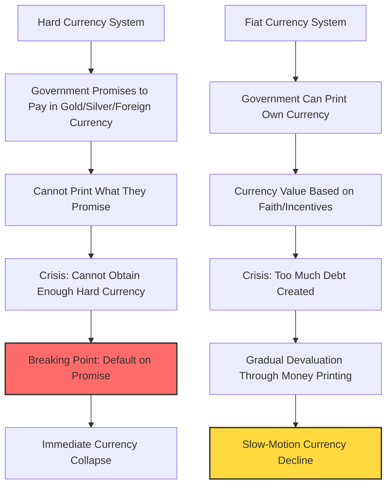
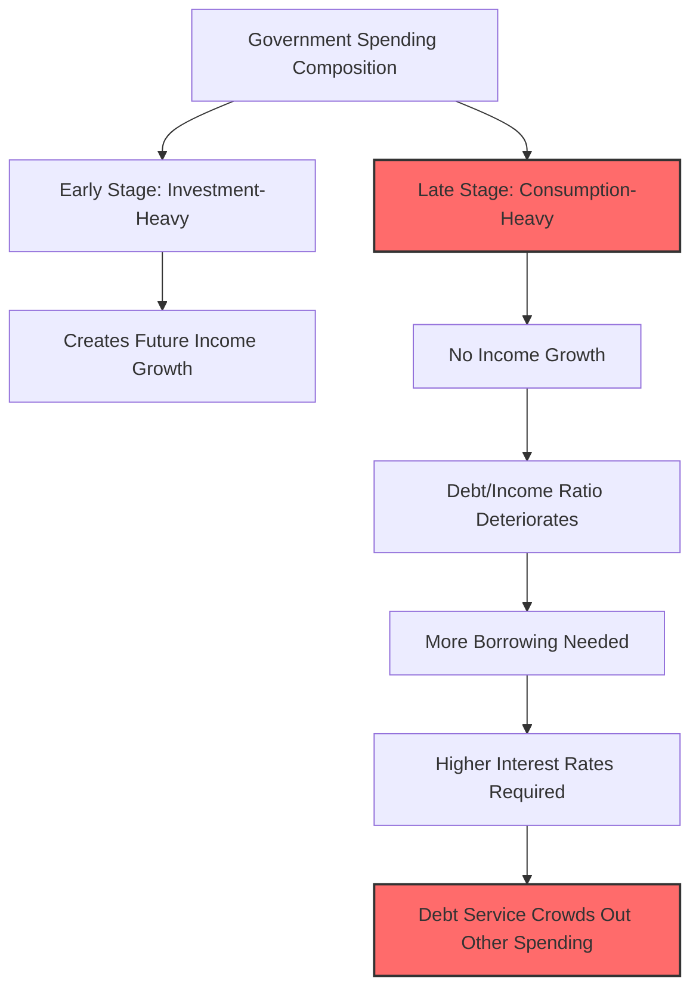
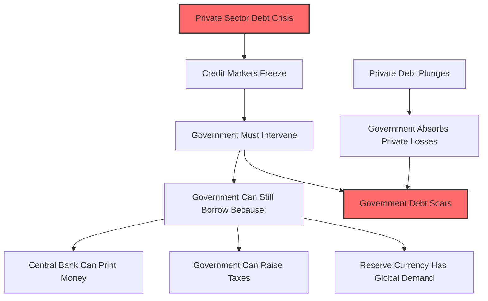
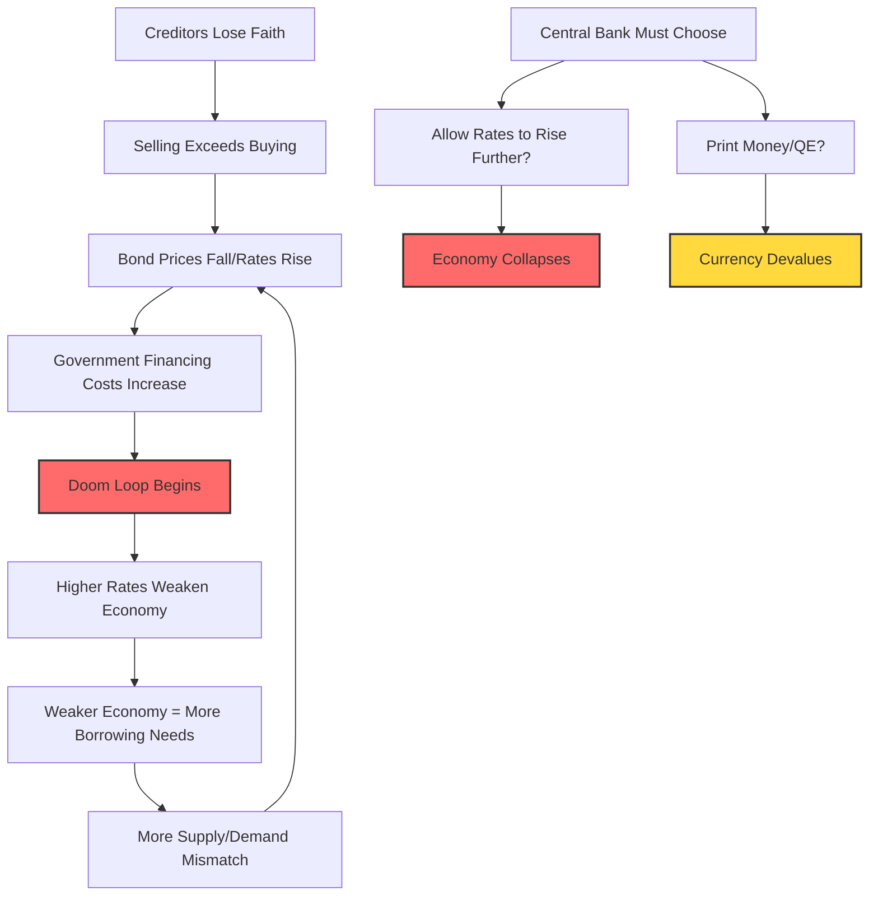

You're absolutely right - I missed elaborating on that crucial paragraph about how central banks operate in fiat monetary systems. Let me revise that section and add the missing content with proper explanation:

# Part 2:

# The Archetypical Sequence Leading to Central Banks and Central Governments Going Broke

**I've spent decades studying financial crises, and what I'm about to share with you represents the distilled wisdom from examining 65 major debt crises over the past century. Among these, 35 cases ended with either the central government or central bank—or both—becoming functionally insolvent. Think of this as a financial autopsy report: by understanding exactly how these institutions died, we can better recognize the warning signs when they appear in our own economies.**

All the chapters in Part 2 contain fascinating patterns that reveal themselves like a detective story. I recommend skimming the **bold text** first to grasp the main plot, then diving into the unbolded details wherever your curiosity leads you.

# Chapter 4: The Archetypical Sequence

After examining 65 major debt crises spanning the last century and conducting deep forensic analysis on the 35 cases where central governments and central banks went functionally broke, I've discovered remarkably consistent patterns. What follows is the granular mechanics of financial collapse—a step-by-step guide to how governments and their central banks march toward insolvency, and what happens in the aftermath. While these details matter enormously for understanding the full picture, **if you prefer the executive summary, read the bold text and decide where to dive deeper.** But first, let me explain a crucial distinction that fundamentally shapes how these crises unfold.

# Hard Money Versus Fiat Money

**Imagine you're running a government, and you've made promises to pay people back in a specific form of money. The critical question becomes: can you create that money yourself, or must you obtain it from somewhere else?** This distinction between hard money and fiat money systems fundamentally determines how debt crises unfold.

In **hard currency systems**, governments promise to deliver money they cannot print—gold, silver, or another nation's currency that creditors trust more than yours (historically, often the dollar). Think of it like promising to pay someone in diamonds when you don't own a diamond mine. Throughout history, when governments in hard currency systems couldn't obtain enough of these unprintable currencies to pay their debts, they've almost invariably broken their promises. The moment that promise breaks, the value of their currency and debt payments collapses like a house of cards—sudden, dramatic, and irreversible.

After breaking their promise but still needing a functioning currency, governments create what we call a **fiat monetary system**—"fiat" meaning "let it be done" in Latin, essentially currency by decree. In these systems, the currency's value rests entirely on faith—faith that the central bank will manage it responsibly, faith that it will retain purchasing power, faith that others will accept it tomorrow as they do today.

**In fiat monetary systems, central banks wield three primary tools to maintain this delicate balance of faith:** interest rates (the price of borrowing money), their ability to monetize debt (buying government bonds with newly created money), and control over money supply tightness (how much money circulates in the economy). These tools work together to provide incentives for lender-creditors to continue lending and holding debt assets. Throughout history, central banks in fiat systems—just like their counterparts in hard currency regimes—have repeatedly created too much debt. Remember, debts are simply claims that people believe they can exchange for money, which they expect to use for purchasing goods and services.

> [!info] How Central Banks Manipulate Incentives in Fiat Systems Think of a central bank as a master puppeteer with three strings:
> 
> 1. **Interest Rates**: By raising rates, they make lending more attractive (higher returns) but borrowing more painful (higher costs). Lowering rates does the opposite—encouraging borrowing but discouraging saving.
>     
> 2. **Debt Monetization**: When the central bank "prints" money to buy government bonds, it's essentially creating artificial demand for debt that private markets won't supply. This keeps bond prices high and interest rates low, but floods the system with new money.
>     
> 3. **Money Supply Control**: By tightening or loosening banking regulations, reserve requirements, and lending standards, central banks control how much money multiplies through the financial system.
>     
> 
> The tragic pattern repeats: governments and private sectors create more debt than can realistically be repaid → central banks print money to ease repayment → currency devalues → prices rise → purchasing power erodes. The only difference from hard currency systems is the timeline—gradual erosion versus sudden collapse.



**August 15, 1971, marks a watershed moment in monetary history**—the day most currencies shifted from hard to fiat. I remember it vividly because I was clerking on the floor of the New York Stock Exchange, watching in bewilderment as President Nixon announced the US would no longer convert dollars to gold. Later, when I studied history, I discovered this exact scenario had played out in April 1933. The pattern was unmistakable: governments eventually find hard currency constraints unbearable and abandon them.

Consider Japan's recent history as a perfect illustration. Since 2013, the Bank of Japan has aggressively printed money to buy government debt while suppressing interest rates near zero. The results? Japanese government bondholders have lost 60% of their value versus gold, 45% versus US dollar debt, and 6% in domestic purchasing power. The yen's devaluation came gradually because it's a fiat currency, but the underlying cause mirrors hard currency crises exactly—too much debt requiring monetization.

Throughout the charts I'll show you, you'll see three lines telling different stories: the **bold middle line** shows all cases combined, while the two lighter lines separate hard currency cases from fiat currency cases. For clarity, I'll focus primarily on the aggregate patterns.

History reveals a perpetual pendulum swing between hard and fiat systems, each generating its own form of extreme consequences. Hard currency regimes inevitably break when governments cannot maintain debt growth within monetary constraints, while fiat systems collapse when faith in the currency as a store of value evaporates. Each system's failure drives adoption of its opposite, in an endless cycle of monetary metamorphosis.

# Nine Stages of the Final Crisis

Earlier, I outlined the complete debt cycle arc. Now, let's zoom in on the finale—when both the central government and central bank become insolvent. This endgame typically unfolds in nine stages. While I present these sequentially, reality is messier—stages overlap, reverse, or skip entirely. Think of these as symptoms of financial disease: the more symptoms present, the higher the risk of economic "cardiac arrest."

```mermaid
graph LR
    A[Stage 1: Deep Private & Government Debt] --> B[Stage 2: Private Crisis → Government Rescue]
    B --> C[Stage 3: Government Debt Squeeze]
    C --> D[Stage 4: Currency/Economic Pressure]
    D --> E[Stage 5: Central Bank Money Printing]
    E --> F[Stage 6: Central Bank Losses]
    F --> G[Stage 7: Debt Restructuring]
    G --> H[Stage 8: Capital Controls/Taxes]
    H --> I[Stage 9: New Equilibrium]

    style F fill:#ff6b6b,stroke:#333,stroke-width:2px
    style G fill:#ffd93d,stroke:#333,stroke-width:2px
```



Countries go broke for many reasons—chronic overspending, costly wars, natural disasters, pandemics, or toxic combinations thereof. Whatever the trigger, these nine conditions form a diagnostic checklist: the more present, the nearer the crisis.

**1) The private sector and government get deeply into debt.**

**2) The private sector suffers a debt crisis, and the central government gets deeper in debt to help the private sector.**

**3) The central government experiences a debt squeeze** in which free-market demand for its debt falls short of supply. This creates a debt problem requiring either: a) policy shifts that rebalance money and credit supply/demand, or b) self-reinforcing debt selling that triggers severe liquidation, ultimately reducing debt levels relative to incomes. **Big net selling of government debt is the major red flag.**

**4) The selling of government debt leads to:** a) market-driven credit tightening, b) economic weakening, c) declining savings/reserves, and d) currency pressure. Because this tightening damages the economy excessively, central banks typically ease credit while accepting currency devaluation. **Watch for long-term interest rates rising faster than short rates while the currency simultaneously weakens.**

**5) When debt crises coincide with interest rates at zero** (or when long rates limit short rate declines), central banks "print" money to buy bonds, attempting to suppress long rates and ease debt service burdens. They don't literally print—they create electronic reserves, borrowing from commercial banks at short-term rates, creating future problems when selling continues.

**6) If selling persists and rates keep rising,** the central bank hemorrhages money—paying more interest on its liabilities than it receives on purchased assets. When negative cash flow forces more money printing to cover losses, the central bank enters its death spiral: rising rates create losses that require money printing that devalues currency that drives more selling that raises rates further. **This is what I mean by the central bank going broke**—it can't meet obligations without printing, though it never technically defaults.

**7) Debts are restructured and devalued.** When managed optimally, fiscal and monetary authorities orchestrate what I call a "beautiful deleveraging"—balancing deflationary debt reduction (restructuring) with inflationary reduction (monetization) to avoid excessive deflation or inflation.

**8) Extraordinary policies emerge:** wealth taxes, capital controls, financial repression—governments pull every lever when survival is at stake.

**9) Deleveraging inevitably restores equilibrium.** Through inflation, default, or both, debt burdens realign with income capacity. Often after inflationary depressions, governments restore confidence by linking their devalued currency to hard assets (like gold) or stable foreign currencies, while implementing strict fiscal discipline. Early in recovery, lenders must be rewarded handsomely and borrowers punished severely to restore monetary credibility—requiring painfully high real interest rates until balance returns.

The pain level depends critically on whether the debt is denominated in printable domestic currency and whether creditors are primarily domestic (giving more government control). Reserve currency status provides additional cushion, as global demand persists longer—though history shows governments routinely abuse this privilege until they lose it, making their eventual fall more dramatic.

# Chapter 5: The Private Sector and Central Government Debt Crisis (Stages 1-4)

Now let me walk you through each stage with surgical precision, showing the specific markers and dynamics I observed across historical cases. In the charts, the dark blue line shows all cases averaged, the thin red line shows fixed exchange rate cases, and the thin green line shows fiat cases. Notice how fixed-rate crises show clearer patterns—pressure builds until a dramatic break—while fiat currency adjustments flow more gradually.

# Stage 1: The private sector and government get deep in debt.

**Every debt crisis begins the same way: with borrowing that feels sustainable until suddenly it isn't.** The warning signs appear years before the crisis, hiding in plain sight for those who know where to look.

In the pre-crisis years, governments invariably accumulate massive debt through chronic deficit spending. But here's the critical pattern: spending increasingly shifts from productivity-enhancing investments (infrastructure, education, research) toward consumption and social safety nets. **Imagine a household using credit cards for groceries instead of home improvements**—debt rises without corresponding income growth. These social programs become political sacred cows; cutting them becomes career suicide for politicians (witness Brazil or the US today).



Debt levels reach extreme heights relative to the government's tax revenue capacity, while debt service consumes an ever-growing share of income, crowding out essential spending. To cover these costs, governments must sell more debt than private markets want to buy, creating upward pressure on interest rates, which further increases debt service costs—a vicious cycle gaining momentum.

Notice in the charts how fixed versus floating rate currencies diverge dramatically after the default/devaluation moment. Fixed-rate cases experience severe, definitive restructuring that enables sharp rebounds, while fiat cases see gradual debt increases as money printing allows continued spending.


The charts below reveal the typical government borrowing patterns (total and excluding interest payments) in pre-devaluation years. In 31 of 35 cases studied, large persistent government deficits preceded the crisis.


**Sometimes the public sector balance sheet appears deceptively healthy.** This illusion occurs when heavy private sector borrowing exists that governments implicitly guarantee—think banks "too big to fail." These contingent liabilities might as well be government debt, as they inevitably become so during crises.


**Massive debt accumulation requires extensive foreign lending for financing.** This lending comes in two flavors, each with distinct risks: borrowing in domestic currency (devaluation risk) or reserve currency (default risk). Either way, dependence on foreign capital creates vulnerability to sudden capital flight.

Current account deficits aren't necessarily problematic—they can signal attractive investment opportunities drawing foreign capital. However, when that attractiveness evaporates due to excessive debt issuance during crisis management, foreign selling becomes an additional pressure point. The charts show steadily increasing current account and twin deficits typically leading crises by several years. When crisis strikes, it manifests as massive devaluation and demand contraction (including imports), forcibly reducing these deficits.

**Large current account deficits**


Years of foreign borrowing accumulate into substantial external debt, increasing vulnerability to capital flight. The left charts show total net international investment position (foreign assets minus liabilities), while the right shows liquid assets available for external debt service. By devaluation time, countries typically have depleted their liquid asset buffers.

**Significant accumulated debts to foreigners**
**Few liquid assets available to cover external obligations**


# Stage 2: The private sector suffers a debt crisis, and the central government gets deeper in debt to help the private sector.

**This stage marks the transition from manageable stress to acute crisis.** The government's balance sheet shifts from moderately stretched to critically overextended as it backstops collapsing private sector debt.

When private sector financial distress erupts, governments invariably intervene—they alone can access emergency credit when private markets freeze. During panics, lenders still trust governments because everyone knows central banks can print money for repayment and governments can tax their way to solvency. This advantage amplifies for reserve currency issuers, as global demand for their currency persists even during domestic turmoil.



Consequently, when debt conditions deteriorate and governments must rescue the system, government debt explodes while private sector debt implodes. The charts reveal this pattern clearly: government debt levels soar while private debt plummets about a year before the crisis peaks. In 15 of 21 cases with complete data, this divergence appeared. **When private debt falls sharply while government debt rises sharply, crisis is imminent.**


Government debt problems now intensify across multiple dimensions. Debt stocks grow relative to: 1) tax revenues, 2) hard assets available for repayment (typically reserves), and 3) the money supply available to finance debt (until central banks intervene with new money creation).


# Stage 3: The central government experiences a debt squeeze in which the free-market demand for its debt falls short of the supply of it. That creates a debt problem. If there is net selling of the debt, that creates a much worse problem, so net selling of the debt is a big red flag.

**Now we reach the tipping point where mathematics collides with psychology.** Governments enter terminal distress when two conditions converge: 1) debt service expenses strangle their ability to fund essential services, and 2) creditors lose faith and begin selling government bonds. This selling drives interest rates higher, increasing financing costs and necessitating either devastating spending cuts or even more borrowing—borrowing that may no longer be available.

When debt service approaches 100% of government revenues, alarm bells should be deafening. It signals either massive spending compression ahead or enormous borrowing requirements that creditors, seeing the writing on the wall, will likely refuse. In 25 of 35 cases studied, government debt service as a percentage of revenues accelerated into the crisis.


Given accumulated debts and ongoing deficits (compensating for private sector weakness), debt and debt service burdens follow an exponential growth path. The charts below show the average projected trajectory at devaluation time across historical cases. Governments were typically on paths toward infinite debt growth absent devaluation.

**At the time of devaluation, government on a path toward indefinitely increasing debts…**

**…along with growing debt service burdens relative to tax revenues**

The US hasn't reached this point yet, but the trajectory points there. Europe, Japan, and China currently show government interest service around half US levels relative to GDP—Europe and China due to lower government debts (though other sectors carry more), Japan due to persistently suppressed interest rates. But Japan's situation could deteriorate rapidly: with government debt around 215% of GDP, any meaningful rate increase would prove catastrophic. As we'll see, Japan's massive government debts, Bank of Japan bond purchases, and artificially suppressed rates have already delivered terrible returns through low yields and currency depreciation.

Facing insurmountable debt burdens and financing needs, governments resort to increasingly creative measures to paper over insolvency:

**1. Off-balance-sheet financing through policy banks** (common in Asian crises like Japan's)

**2. Debt guarantees instead of direct spending** (Peru 1980s, Turkey recently)—governments guarantee private losses, encouraging borrowing without immediate budget impact, creating hidden liabilities that surface later

**3. Financial repression**—forcing domestic institutions (banks, pensions, insurers) to buy government debt through regulatory manipulation, beneficial treatment, or yield curve manipulation (Turkey and Brazil recently, US during WWII)

**4. Patriotic campaigns** appealing for citizens to buy bonds or sell foreign currency (Turkey's recent dollar-selling campaign, WWII bond drives, Korea's 1990s gold collection for IMF repayment)

**5. Phantom fiscal discipline**—"paying" for spending with future cuts that never materialize (Brazil's recent constitutional spending cap with numerous escape clauses)

**6. Geopolitical financing**—calling in international favors or making strategic deals (Turkey recently, UK's post-WWII Sterling Area)

**7. Maturity compression**—shortening debt duration since lenders more willingly provide short-term credit

**8. Capital controls**—trapping domestic money when situations become severe

# Stage 4: The selling of the government's debt leads to a) a free-market-driven tightening of money and credit which leads to b) a weakening of the economy, c) downward pressure on the currency, and d) declining reserves as the central bank attempts to defend the currency. Because this tightening is too harmful for the economy, the central bank eventually simultaneously eases credit and allows a devaluation of the currency.

**These events cascade like dominoes, each knocking down the next.** Accelerating capital flight brings the currency and debt run to its climax. Central banks initially defend with rate hikes and reserve sales, but ultimately capitulate when economic pain becomes unbearable and reserves prove inadequate.

The critical red flag emerges when debts reach levels where even casual observers recognize inevitable losses—either through default or money printing that generates currency weakness and inflation. When creditors lose faith in adequate compensation (whether due to repayment doubts or insufficient inflation adjustment), selling overwhelms buying, forcing debt prices down and interest rates up until equilibrium returns through reduced borrowing or increased saving.



War risks compound these dynamics exponentially—sanctions threats, excessive war borrowing, and devaluation risks create a toxic cocktail. The doom loop accelerates when rising rates weaken the economy, increase future borrowing needs, worsen bond market imbalances, and drive rates higher still. Central banks must then "save the day" through money printing (quantitative easing).

The charts reveal simultaneous foreign capital flight from local bonds (government and corporate) alongside spiking real rates as central banks desperately attempt currency defense through tightening.

**Undesirable rise in rates due to inadequate demand for currency/debt**


Governments often compress debt maturities to make bonds more palatable, accepting rollover risk for immediate relief.


When markets recognize these constraints, selling intensifies. Central banks face an impossible choice: a) allow rates to rise enough to curtail borrowing and attract lending by crowding out other investments, or b) print money to fill the demand gap. History and logic dictate they always choose b), though the optimal path balances both. When this produces inflation amid economic weakness, central banks are damned either way—printing fuels currency collapse and inflation, while restraint causes depression-level interest rates and economic devastation.

This crescendo arrives when debt service becomes unbearable for borrowers and/or creditors refuse to hold debt offering inadequate real returns, high default risk, or probable devaluation. The resulting doom spiral continues until debt destruction or devaluation eliminates excessive burdens.

**This hasn't yet occurred in the US, Europe, Japan, or China.**

Let me detail these dynamics further:

**There is a tightening and/or currency intervention to defend the currency, but the tightening is abandoned because it's too harmful for the economy and the currency intervention is abandoned because it doesn't work and is too costly, so the currency/debt devalues.**

The situation becomes untenable when investors grasp the full picture and logically abandon the country's assets and currency, recognizing the high probability of purchasing power losses through either default or devaluation. This brings crisis to its apex, pressuring central banks to tighten precisely when doing so guarantees economic catastrophe.

Advanced-stage red flags include:

**Interest rates rise** from debt selling and central bank tightening attempts. Given already-depressed conditions, such real rate increases prove unsustainable, crushing weak economies and governments facing debt spirals.


**The tightening worsens a weak economy** (ultimately forcing abandonment and devaluation).


**Inflation tends to rise above desirable levels** entering the crisis, constraining central banks' ability to ease without triggering hyperinflation.


Weak economies plus rising inflation create enormous currency pressure. Here fixed and floating rate cases diverge dramatically. Fixed-rate policymakers fight depreciation—with high inflation, their currencies actually appreciate in real terms precisely when devaluation is needed. Floating-rate currencies gradually sell off into weakness.


For countries with hard currency debts, credit spreads widen as default probability increases.


Risk assets price in higher premiums (sell off), amplifying economic pressure.


**Central banks typically sell reserves at this stage.** Governments function like individuals and companies regarding debt, except those borrowing in their own currency can print for repayment. Like prudent households, governments can accumulate savings buffers for income shortfalls. Reserves represent governments' primary liquid savings (along with sovereign wealth funds). Monitoring their size, depletion rate, and proximity to exhaustion helps time crises precisely. Watch for foreign currency sales to buy local currency—a form of monetary tightening through money supply reduction.


In severe cases, reserves are already low relative to central bank liabilities (money supply), providing minimal firepower against currency runs. When inadequacy becomes apparent, currency defense failure becomes inevitable, accelerating betting against the currency and debt flight.


The table below details historical central bank interventions via reserves. Key patterns emerge:

**Before intervention**, countries typically hold modest reserve war chests (averaging 5% of GDP, covering 10% of money supply and government debt).

**During intervention**, central banks typically burn over half their reserves defending currencies (62% average decline in global currency terms).

**Concentrated selling**—the worst six-month period sees 49% median reserve depletion.

**Currencies fall during defense** (gold rallies 42% median), though some interventions temporarily prop currencies. After roughly two years of futile defense, central banks surrender with reserves covering only 6% of money supply and 3% of government debt. Post-intervention, currencies plummet further (gold rallies another 51% median).

**Summary of Central Bank Intervention via Selling Reserves Across Cases with Meaningful Intervention**

```latex
\begin{tabular}{|l|l|c|c|c|c|c|c|c|c|c|c|c|c|c|c|} \hline \multicolumn{2}{|c|}{} & \multicolumn{4}{c|}{Starting Firepower} & \multicolumn{6}{c|}{Intervention Phase} & \multicolumn{4}{c|}{Post-Intervention Phase} \ \hline \multicolumn{2}{|c|}{} & \multicolumn{3}{c|}{Reserve Levels Pre-Intervention} & Length of Fx & \multicolumn{2}{c|}{Peak 6-Month} & \multicolumn{2}{c|}{Total Reserve Spend} & & \multicolumn{2}{c|}{Reserve Levels Post-Intervention} & & \ \hline Case & Fixed/Float & %GDP & USD, Bln & %Money & %Govt & (in Months) & %GDP & % & %GDP & % & Gold & %GDP & USD, Bln & %Money & %Govt & Gold \ \hline Median (All Cases) & & 5.1% & 6.44 & 10% & 11% & 23 & -2.6% & -49% & -3.3% & -62% & 42% & 1.9% & 1.66 & 6% & 3% & 51% \ Fixed & & 6.1% & 4.98 & 10% & 13% & 19 & -2.7% & -48% & -3.3% & -65% & 42% & 2.0% & 1.66 & 6% & 2% & 41% \ Floating & & 4.4% & 9.03 & 14% & 11% & 29 & -1.9% & -57% & -3.8% & -58% & 36% & 1.7% & 1.65 & 5% & 3% & 66% \ \hline ARG: 1990s Hyperinflation & Fixed & 13% & 5.16 & & 3% & 6 & -2.6% & -50% & -2.6% & -50% & 330% & 2.0% & 2.56 & & 2% & \ ARG: 2001 Peg Break & Fixed & 8.7% & 26.85 & 43% & 25% & 19 & -6.8% & -47% & -14.1% & -65% & 107% & 7.9% & 9.42 & 27% & 6% & \ BRZ: 1999 Peg Break & Fixed & 8.5% & 73.62 & 34% & 21% & 11 & -5.2% & -49% & -6.7% & -56% & 52% & 5.2% & 32.72 & 21% & 10% & \ DEU: Post-World War II & Fixed & 0.8% & 0.25 & 2% & 0% & 64 & -0.2% & -46% & -0.6% & -90% & 107% & 0.1% & 0.02 & 0% & 0% & \ FRA: World War II & Fixed & 30.9% & 2.96 & 26% & 29% & 92 & -8.2% & -48% & -7.0% & -84% & 192% & 1.1% & 0.48 & 2% & 2% & 133% \ GBR: Great Depression & Fixed & 6.1% & 1.34 & 10% & 4% & 15 & -2.7% & -36% & -3.3% & -43% & 40% & 5.2% & 0.77 & 7% & 3% & 3% \ GBR: Post-World War II Deval & Fixed & 6.2% & 2.66 & 7% & 3% & 36 & -1.0% & -21% & -2.4% & -38% & 54% & 4.7% & 1.66 & 6% & 2% & 5% \ GBR: World War II & Fixed & 14.7% & 4.07 & 22% & 11% & 37 & -3.7% & -66% & -12.8% & -89% & 19% & 1.5% & 0.44 & 2% & 1% & \ JPN: Great Depression & Fixed & 4.0% & 0.49 & 9% & 15% & 26 & -3.0% & -55% & -5.1% & -67% & 35% & 2.7% & 0.16 & 6% & 6% & 56% \ JPN: World War II & Fixed & 5.1% & 0.37 & 10% & 13% & 38 & -2.5% & -58% & -2.4% & -81% & 10% & 0.6% & 0.07 & 1% & 1% & >500% \ MEX: 1982 Default & Fixed & 1.6% & 4.98 & 7% & 5% & 12 & -1.8% & -57% & -2.7% & -65% & 227% & 1.7% & 1.76 & 9% & 3% & 23% \ MEX: Tequila Crisis & Fixed & 3.9% & 20.89 & 18% & 25% & 11 & -3.2% & <-100% & -6.4% & -128% & 42% & -1.7% & -5.75 & -9% & -7% & 28% \ TUR: 2001 Hyperinflation & Fixed & 6.1% & 18.44 & 26% & 19% & 5 & -3.3% & -44% & -4.4% & -50% & 27% & 4.4% & 9.24 & 19% & 14% & 16% \ USA: 1971 Devaluation & Fixed & 1.8% & 18.61 & 3% & 3% & 23 & -0.2% & -14% & -0.4% & -23% & -6% & 1.2% & 14.42 & 2% & 2% & 150% \ USA: Great Depression & Floating & 6.6% & 5.15 & 9% & 15% & 14 & -1.0% & -15% & -1.3% & -18% & -1% & 6.1% & 4.25 & 9% & 12% & 55% \ \hline ARG: 2020 Default & Floating & 5.9% & 36.47 & 18% & 11% & 68 & -5.0% & <-100% & -12.6% & -135% & 163% & -3.2% & -12.93 & -11% & -4% & 43% \ BRZ: 1980s & Floating & 2.5% & 7.13 & 18% & 5% & 6 & -1.9% & -55% & -1.9% & -55% & 42% & 1.4% & 3.18 & 10% & 3% & -42% \ BRZ: 2002 BoP Crisis & Floating & 6.9% & 34.88 & 31% & 11% & 20 & -2.9% & <-100% & -9.5% & -159% & 10% & -3.5% & -20.63 & -16% & -6% & \ BRZ: 2014 BoP Crisis & Floating & 15.9% & 371.27 & 44% & 28% & 33 & -1.6% & -18% & -7.1% & -31% & 16% & 16.2% & 255.62 & 44% & 25% & 10% \ DEU: Weimar Hyperinflation & Floating & 6.6% & 0.59 & 7% & 5% & 63 & -2.5% & -39% & -4.8% & -73% & >500% & 1.9% & 0.12 & 4% & 2% & \ FRA: Early 20s Deval & Floating & 4.0% & & & & & & & & & & & & & & \ \hline \end{tabular}
```


Gold excess return figures are dashed out for cases where the currency bottomed before reserve intervention stopped. We show "<-100%" in cases where the central bank spent more than their entire warchest of reserves (for instance via using a swapline to borrow additional reserves).

[The rest of the content continues as in my original response...]